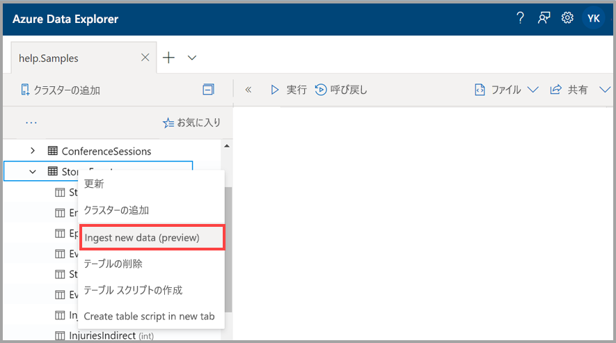
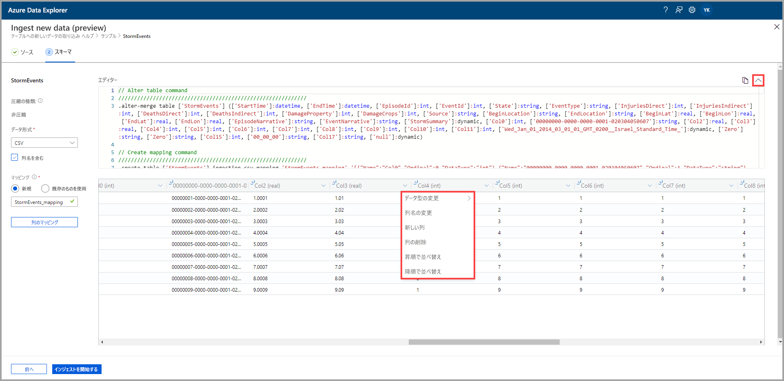
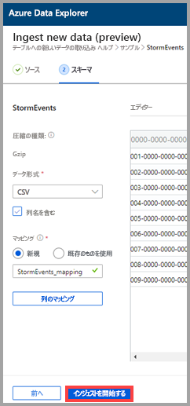
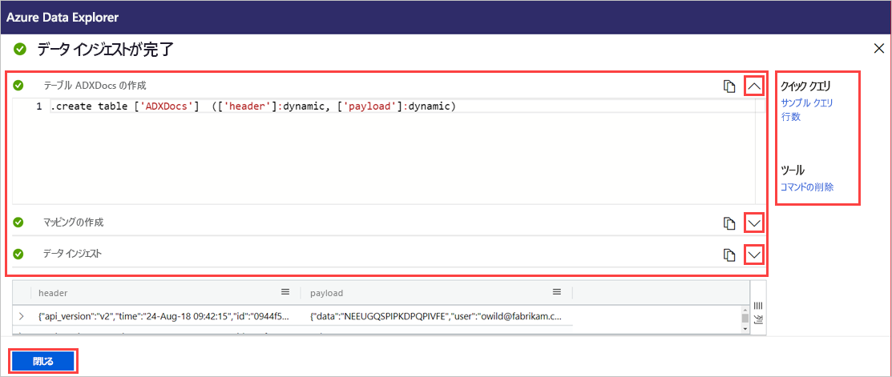

# ワンクリックでのインジェストを使用して Azure Data Explorer の既存のテーブルにデータを取り込む

ワンクリックでのインジェストを使用すると、JSON や CSV、その他の形式のデータをすばやくテーブルに取り込むことができます。 Azure Data Explorer の Web UI を使用して、ストレージ、ローカル ファイル、またはコンテナーからデータを取り込むことができます。 

このドキュメントでは、直感的なワンクリック ウィザードを使用して、JSON ファイルのデータを既存のテーブルに取り込む方法について説明します。 その後、Azure Data Explorer の Web UI を使用して、テーブルの編集やクエリの実行を行うことができます。

データの初回取り込み時やデータのスキーマに不慣れな場合に、ワンクリックでのインジェストは特に効果的です。 

ワンクリックでのインジェストの概要と一連の前提条件については、[ワンクリックでのインジェスト](ingest-data-one-click.md)に関するページを参照してください。
Azure Data Explorer での新しいテーブルへのデータ取り込みについては、[新しいテーブルへのワンクリックでのインジェスト](one-click-ingestion-new-table.md)に関するページを参照してください。

## 新しいデータを取り込む

1. Web UI の左側のメニューで、"*データベース*" または "*テーブル*" を右クリックし、 **[Ingest new data (Preview)]\(新しいデータの取り込み (プレビュー)\)** を選択します。

       
 
1. **[Ingest new data (Preview)]\(新しいデータの取り込み (プレビュー)\)** ウィンドウの **[ソース]** タブが自動的に選択されます。

1. **[テーブル]** フィールドの内容が自動的に設定されない場合は、ドロップダウン メニューから既存のテーブル名を選択します。
    > [!TIP]
    > *テーブル*の行で **[Ingest new data (Preview)] (新しいデータの取り込み (プレビュー))** を選択した場合は、選択したテーブル名が **[プロジェクトの詳細]** に表示されます。

[!INCLUDE [data-explorer-one-click-ingestion-types](../../includes/data-explorer-one-click-ingestion-types.md)]
    
テーブル列の構成を表示および編集するには、 **[スキーマの編集]** を選択します。

## スキーマを編集する

1. **[Map columns]\(列のマップ\)** ダイアログが開き、ソース データ列をターゲット テーブル列にマップすることができます。 
    * **[Source columns]\(ソース列\)** の各フィールドに、 **[Target columns]\(ターゲット列\)** とマップする列名を入力します。
    * マッピングを削除するには、ごみ箱アイコンを選択します。

    ![[Map columns] (マップ列) ウィンドウ](media/one-click-ingestion-existing-table/map-columns.png)

1. **[Update]\(更新\)** を選択します。
1. **[スキーマ]** タブ内:
    1. **[圧縮の種類]** を選択して、 **[非圧縮]** または **[GZip]** のどちらかを選択します。

        [!INCLUDE [data-explorer-one-click-ingestion-edit-schema](../../includes/data-explorer-one-click-ingestion-edit-schema.md)]
        
    1. **JSON** を選択する場合は、1 から 10 の **[JSON levels]\(JSON レベル\)** も選択する必要があります。 このレベルは、テーブル列でのデータ表現に影響します。

    ![[JSON レベル] を選択する](media/one-click-ingestion-existing-table/json-levels.png)

    * JSON 以外の形式を選択した場合は、ファイルの見出し行が無視されるように、 **[Include column names]\(列名を含める\)** チェック ボックスをオンにすることができます。
        
    ![[Include column names]\(列名を含める\) をオンにする](media/one-click-ingestion-existing-table/non-json-format.png)

    > [!Note]
    > 表形式の列データは、Azure Data Explorer のテーブル内の 1 つの列にのみ取り込むことができます。 

    * 新しいマッピングが自動的に設定されますが、既存のマッピングを使用するように変更することもできます。 
    * **[Map columns]\(列のマップ\)** を選択して **[Map columns]\(列のマップ\)** ウィンドウを開きます。

## クエリのコピーと貼り付け

1. **[エディター]** ペインの上にある **v** ボタンを選択して、エディターを開きます。 エディターでは、ご自分の入力から生成された自動コマンドを表示およびコピーできます。 
1. この表で、 
    * 新しい列ヘッダーを選択して**新しい列**の追加、**列の削除**、**昇順での並べ替え**、**降順での並べ替え**を実行できます。 既存の列で選択できるのは、データの並べ替えのみです。

    > [!Note]
    > * 既存のテーブルの名前とデータ型を更新することはできません。
    > * Drop コマンドは、インジェスト フローによって行われた変更 (新しいエクステントと列) を元に戻すだけです。 それ以外はドロップされません。

 

## インジェストを開始する

テーブルおよびマッピングを作成し、データ インジェストを開始するには、 **[Start ingestion]\(インジェストの開始\)** を選択します。

## データ インジェストが完了

**[Data ingestion completed]\(データ インジェストが完了しました\)** ウィンドウでは、データ インジェストが正常に終了した場合、3 つのステップすべてに緑色のチェックマークが表示されます。
 

[!INCLUDE [data-explorer-one-click-ingestion-query-data](../../includes/data-explorer-one-click-ingestion-query-data.md)]

## 次のステップ

* [Azure Data Explorer の Web UI でデータのクエリを実行する](/azure/data-explorer/web-query-data)
* [Kusto クエリ言語を使用して Azure Data Explorer のクエリを作成する](/azure/data-explorer/write-queries)
