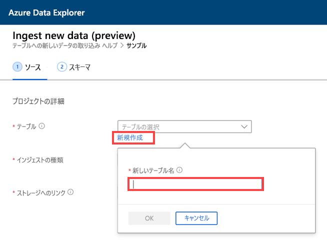
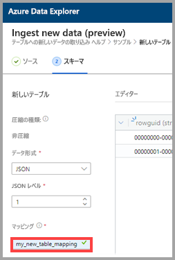
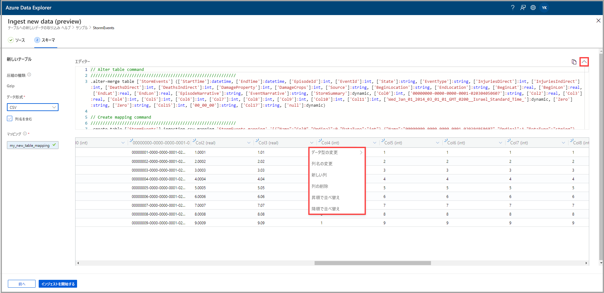
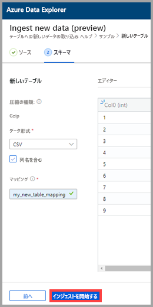
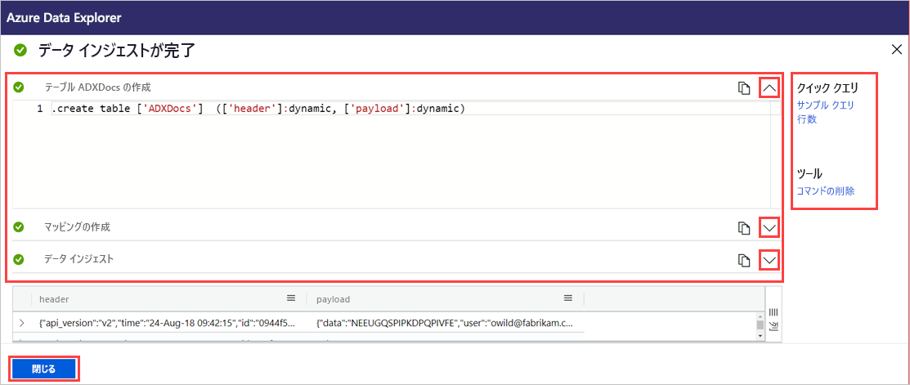

# ワンクリックでのインジェストを使用して Azure Data Explorer の新しいテーブルにデータを取り込む

ワンクリックでのインジェストを使用すると、JSON や CSV、その他の形式のデータをすばやくテーブルに取り込むことができます。 Azure Data Explorer の Web UI を使用して、ストレージ、ローカル ファイル、またはコンテナーからデータを取り込むことができます。 

このドキュメントでは、直感的なワンクリック ウィザードを使用して、コンテナーの CSV データを新しいテーブルに取り込む方法について説明します。 その後、Azure Data Explorer の Web UI を使用して、テーブルの編集やクエリの実行を行うことができます。 また、継続的な取り込みを設定することで、ソース データが更新されたときに自動的にデータをテーブルに取り込むこともできます。

データの初回取り込み時やデータのスキーマに不慣れな場合に、ワンクリックでのインジェストは特に効果的です。 

ワンクリックでのインジェストの概要と一連の前提条件については、[ワンクリックでのインジェスト](ingest-data-one-click.md)に関するページを参照してください。
Azure Data Explorer の既存のテーブルにデータを取り込む方法については、[既存のテーブルへのワンクリックでのインジェスト](one-click-ingestion-existing-table.md)に関するページを参照してください。

## 新しいデータを取り込む

1. Web UI の左側のメニューで、"*データベース*" を右クリックし、 **[Ingest new data (Preview)]\(新しいデータの取り込み (プレビュー)\)** を選択します。

       
 
1. **[Ingest new data (Preview)]\(新しいデータの取り込み (プレビュー)\)** ウィンドウの **[ソース]** タブが自動的に選択されます。 

1. **[新しいテーブルの作成]** を選択し、新しいテーブルの名前を入力します。 英数字、ハイフン、アンダースコアを使用できます。 特殊文字はサポートされていません。

 

[!INCLUDE [data-explorer-one-click-ingestion-types](../../includes/data-explorer-one-click-ingestion-types.md)]

テーブル列の構成を表示および編集するには、 **[スキーマの編集]** を選択します。 このシステムでは、いずれか 1 つの BLOB がランダムに選択され、その BLOB に基づいてスキーマが生成されます。 ソースが圧縮されているかどうかは、その名前を見て自動的に識別されます。

## スキーマを編集する

1. **[スキーマ]** タブ内:

    1. **[データ形式]** を選択します。

        [!INCLUDE [data-explorer-one-click-ingestion-edit-schema](../../includes/data-explorer-one-click-ingestion-edit-schema.md)]

    1. **JSON** を選択する場合は、1 から 10 の **[JSON levels]\(JSON レベル\)** も選択する必要があります。 このレベルは、テーブル列でのデータ表現に影響します。 

    ![[JSON レベル] を選択する](media/one-click-ingestion-new-table/json-levels.png)

    * JSON 以外の形式を選択した場合は、ファイルの見出し行が無視されるように、 **[Include column names]\(列名を含める\)** チェック ボックスをオンにすることができます。

        ![[Include column names]\(列名を含める\) をオンにする](media/one-click-ingestion-new-table/non-json-format.png)
        
1. **[マッピング名]** フィールドに、マッピング名を入力します。 英数字とアンダースコアを使用できます。 スペース、特殊文字、ハイフンはサポートされません。
    
    

## クエリのコピーと貼り付け

1. **[エディター]** ペインの上にある **v** ボタンを選択して、エディターを開きます。 エディターでは、ご自分の入力から生成された自動クエリを表示およびコピーできます。 
1. この表で、 
    * 編集するには、新しい列の名前をダブルクリックします。
    * 新しい列ヘッダーを選択して、次のいずれかの操作を行います。
    
|アクション         |説明                                  |
|-----------------|-------------------------------------------|
|データ型の変更 |サービスによって自動的に選択されたデータ型を、他の[サポートされるデータ型](#edit-the-schema)に変更します|
|列名の変更    |列の名前を変更します |
|新しい列       |新しい列の追加|
|列の削除    |選択した列を削除します|
|昇順で並べ替え   |選択した列の昇順でテーブルを並べ替えます (既存の列のみ)|
|降順で並べ替え  |選択した列の降順でテーブルを並べ替えます (既存の列のみ) |

> [!Note]
> 表形式データの列はそれぞれ Azure Data Explorer の 1 つの列に取り込むことができます。
> さまざまな JSON レベルから新しい列を作成できます。

 

## インジェストを開始する

テーブルおよびマッピングを作成し、データ インジェストを開始するには、 **[Start ingestion]\(インジェストの開始\)** を選択します。

## データ インジェストが完了

**[Data ingestion completed]\(データ インジェストが完了しました\)** ウィンドウでは、データ インジェストが正常に終了した場合、3 つのステップすべてに緑色のチェックマークが表示されます。
 

[!INCLUDE [data-explorer-one-click-ingestion-query-data](../../includes/data-explorer-one-click-ingestion-query-data.md)]

**継続的な取り込み**

継続的な取り込みを使用すると、ソース コンテナーをリッスンするイベント グリッドを作成できます。 あらかじめ定義されたパラメーターの条件 (プレフィックス、サフィックスなど) を満たす新しい BLOB がすべて自動的にターゲット テーブルに取り込まれます。

> [!Note]
> 継続的な取り込みが有効なのは、コンテナーからの取り込み時のみです。

1. **[Continuous ingestion]\(継続的な取り込み\)** を選択して Azure portal を開きます。 イベント グリッドのデータ コネクタが開いた状態で [データ接続] ページが表示されます。ソース パラメーターとターゲット パラメーターは既に入力されています (ソース コンテナー、テーブル、マッピング)。

1. **[作成]** を選択すると、そのコンテナー内の変更をリッスンするデータ接続が作成されます。 

## 次のステップ

* [Azure Data Explorer の Web UI でデータのクエリを実行する](/azure/data-explorer/web-query-data)
* [Kusto クエリ言語を使用して Azure Data Explorer のクエリを作成する](/azure/data-explorer/write-queries)
