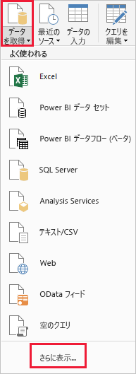
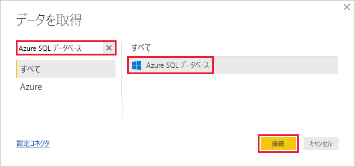
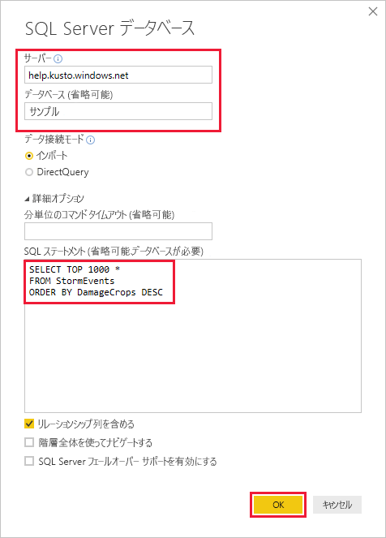
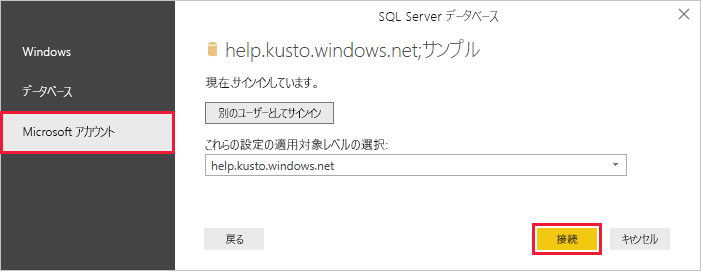
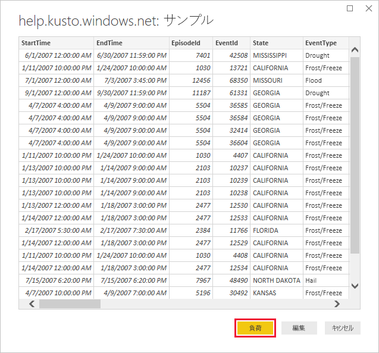

# <a name="visualize-data-from-azure-data-explorer-using-a-sql-query-in-power-bi"></a>Power BI で SQL クエリを使用して Azure Data Explorer のデータを視覚化する

Azure Data Explorer は、ログと利用統計情報データのための高速で拡張性に優れたデータ探索サービスです。 Power BI はビジネス分析ソリューションであり、データを視覚化して、組織全体で結果を共有することができます。

Azure Data Explorer には、Power BI のデータに接続する方法が 3 つ用意されています。ビルトインのコネクタを使用する方法、Azure Data Explorer からクエリをインポートする方法、SQL クエリを使用する方法です。 この記事では、SQL クエリを使用してデータを取得し、それを Power BI レポートで視覚化する方法について説明します。

Azure サブスクリプションをお持ちでない場合は、開始する前に[無料の Azure アカウント](https://azure.microsoft.com/free/)を作成してください。

## <a name="prerequisites"></a>前提条件

この記事を完了するには、以下が必要です。

* Azure Active Directory のメンバーである組織の電子メール アカウント。このアカウントによって [Azure Data Explorer ヘルプ クラスター](https://dataexplorer.azure.com/clusters/help/databases/samples)に接続できます。

* [Power BI Desktop](https://powerbi.microsoft.com/get-started/) ( **[無料ダウンロード]** を選択)

## <a name="get-data-from-azure-data-explorer"></a>Azure Data Explorer からデータを取得する

まず、Azure Data Explorer ヘルプ クラスターに接続し、*StormEvents* テーブルからデータのサブセットを取り込みます。 [!INCLUDE [data-explorer-storm-events](../../includes/data-explorer-storm-events.md)]

Azure Data Explorer ではネイティブの照会言語を使用するのが一般的ですが、SQL クエリもサポートされています。ここで使用しているのも、SQL クエリです。 SQL クエリは、Azure Data Explorer によって自動的にネイティブ クエリに変換されます。

1. Power BI Desktop の **[ホーム]** タブで、 **[データの取得]** 、 **[詳細]** の順に選択します。

    

1. *[Azure SQL Database]* を検索し、 **[Azure SQL Database]** を選択して **[接続]** を選択します。

    

1. **[SQL Server データベース]** 画面のフォームに次の情報を入力します。

    

    **設定** | **値** | **フィールドの説明**
    |---|---|---|
    | サーバー | *help.kusto.windows.net* | ヘルプ クラスターのURL (*https://* なし)。 その他のクラスターでは、URL が *\<クラスター名\>.\<リージョン\>.kusto.windows.net* 形式になります。 |
    | Database | *サンプル* | 接続先のクラスターでホストされるサンプル データベース。 |
    | データ接続モード | *インポート* | Power BI がデータをインポートするか、直接データ ソースに接続するかを決定します。 このコネクタでは、どちらかのオプションを使用できます。 |
    | コマンド タイムアウト | 空白 | タイムアウト エラーがスローされるまでのクエリの実行時間。 |
    | SQL ステートメント | この表の下に記載されているクエリをコピー | Azure Data Explorer によってネイティブ クエリに変換される SQL ステートメント。 |
    | その他のオプション | 既定値のまま | Azure Data Explorer クラスターには該当しないオプション。 |
    | | | |

    ```SQL
    SELECT TOP 1000 *
    FROM StormEvents
    ORDER BY DamageCrops DESC
    ```

1. ヘルプ クラスターへの接続がまだない場合は、サインインしてください。 Microsoft アカウントでサインインし、 **[接続]** を選択します。

    

1. **[help.kusto.windows.net: Samples]** 画面で **[読み込み]** を選択します。

    

    メイン Power BI ウィンドウに、テーブルがレポート ビューで開き、サンプル データに基づいてレポートを作成することができます。

## <a name="visualize-data-in-a-report"></a>レポートでデータを視覚化する

[!INCLUDE [data-explorer-power-bi-visualize-basic](../../includes/data-explorer-power-bi-visualize-basic.md)]

## <a name="clean-up-resources"></a>リソースのクリーンアップ

この記事で作成したレポートが不要になったら、Power BI Desktop (.pbix) ファイルを削除してください。

## <a name="next-steps"></a>次の手順

[Power BI 用 Azure Data Explorer コネクタを使用してデータを視覚化する](power-bi-connector.md)