# <a name="quickstart-query-data-in-azure-data-explorer-web-ui"></a>クイック スタート:Azure Data Explorer の Web UI でデータのクエリを実行する

Azure Data Explorer は、ログと利用統計情報データのための高速で拡張性に優れたデータ探索サービスです。 Azure Data Explorer の Web アプリケーションを使用して、クエリを実行および共有できます。 そのアプリケーションは、Azure portal で利用でき、スタンドアロン Web アプリケーションとしても利用できます。 この記事では、スタンドアロン バージョンを使います。複数のクラスターに接続し、クエリへのディープ リンクを共有することができます。

Azure サブスクリプションをお持ちでない場合は、開始する前に[無料の Azure アカウント](https://azure.microsoft.com/free/)を作成してください。

## <a name="prerequisites"></a>前提条件

このクイック スタートを実行するには、Azure サブスクリプションに加えて、[テスト用のクラスターとデータベース](create-cluster-database-portal.md)が必要です。

## <a name="sign-in-to-the-application"></a>アプリケーションにサインインする

[アプリケーション](https://dataexplorer.azure.com/)にサインインします。

## <a name="add-clusters"></a>クラスターを追加する

最初にアプリケーションを開いたときには、接続はありません。


クエリの実行を始める前に、少なくとも 1 つのクラスターへの接続を追加する必要があります。 このセクションでは、学習補助用に設定されている "*help クラスター*" と、前のクイック スタートで作成したテスト クラスターへの接続を、Azure Data Explorer に追加します。

1. アプリケーションの左上にある **[Add cluster]\(クラスターの追加\)** を選択します。

1. **[Add cluster]\(クラスターの追加\)** ダイアログ ボックスで URI を入力して、 **[Add]\(追加\)** を選択します。

   ヘルプ クラスター URI `https://help.kusto.windows.net` を使用できます。 独自のクラスターがある場合は、そのクラスターの URI を指定します。 たとえば、次の図のように、`https://mydataexplorercluster.westus.kusto.windows.net` と指定します。

    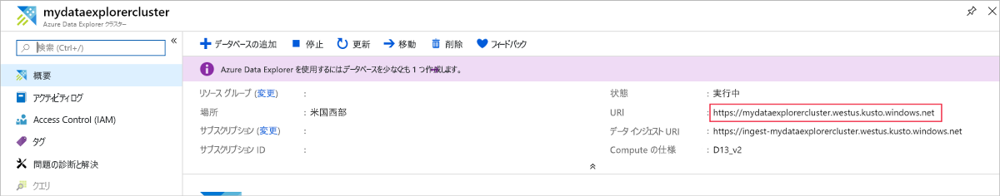

1. 左側のウィンドウに **help** クラスターが表示されます。 **Samples** データベースを展開し、アクセスできるサンプル テーブルを表示します。

    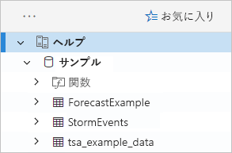

    このクイック スタートでこの後、および他の Azure Data Explorer 記事では、**StormEvents** テーブルを使用します。

作成したテスト クラスターを追加します。

1. **[Add cluster]\(クラスターの追加\)** を選択します。

1. **[Add cluster]\(クラスターの追加\)** ダイアログ ボックスで、テスト クラスターの URL を `https://<ClusterName>.<Region>.kusto.windows.net/` の形式で入力して､ **[Add]\(追加\)** を選択します。

    次の例では、**help** クラスターと、新しいクラスター **docscluster.westus** (完全な URL は `https://docscluster.westus.kusto.windows.net/`) が表示されています。

    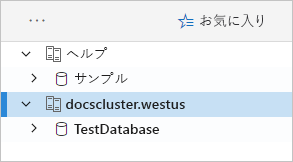

## <a name="run-queries"></a>クエリを実行する

接続したどちらのクラスターに対してもクエリを実行できます (テスト クラスターにデータがあると仮定)。 ここでは **help** クラスターに注目します。

1. 左側のウィンドウで **help** クラスターの下の **Samples** データベースを選択します。

1. 次のクエリをコピーしてクエリ ウィンドウに貼り付けます。 ウィンドウの上部にある **[Run]\(実行\)** を選択します。

    ```Kusto
    StormEvents
    | sort by StartTime desc
    | take 10
    ```
    このクエリでは、**StormEvents** テーブルから最新の 10 レコードが返されます。 結果の左側は次のテーブルのようになります。

    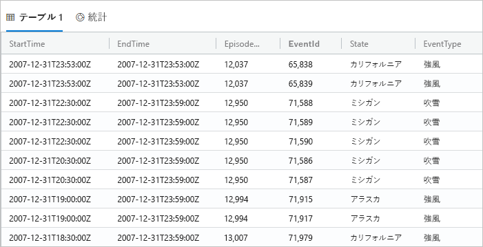

    次の図は、クラスターが追加されてクエリと結果が表示されている、アプリケーションの現在の状態を示しています。

    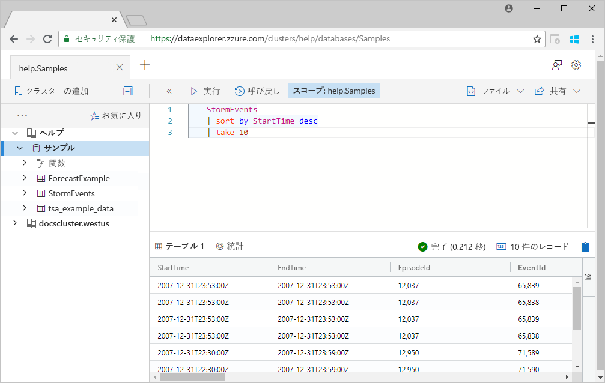

1. 次のクエリをコピーし、クエリ ウィンドウの最初のクエリの下に貼り付けます。 最初のクエリのように異なる行に書式設定されていないことに注意してください。

    ```Kusto
    StormEvents | sort by StartTime desc | project StartTime, EndTime, State, EventType, DamageProperty, EpisodeNarrative | take 10
    ```

1. ウィンドウで新しいクエリをクリックして、クエリを選択します。 Shift + Alt + F キーを押してクエリを書式設定すると、次の表示のようになります。

    

1. Shift + Enter キーを押します。これは、クエリ実行のショートカットです。

   このクエリでは 1 番目と同じレコードが返されますが、`project` ステートメントで指定されている列のみが含まれます。 結果は次のテーブルのようになります。

    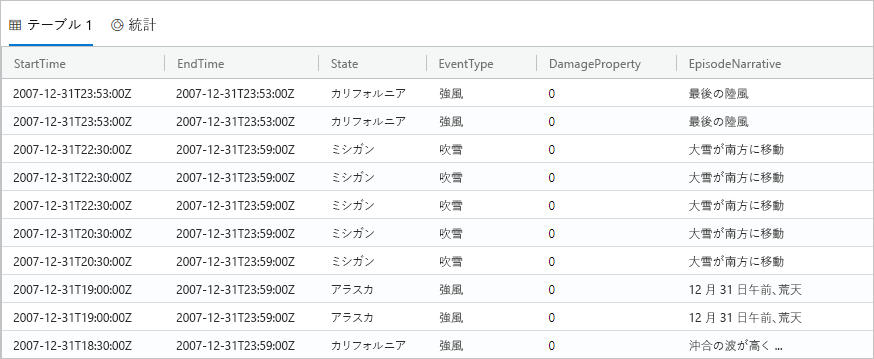

1. クエリ ウィンドウの上部にある **[Recall]\(リコール\)** を選択します。

    クエリを再実行する必要なしに、クエリ ウィンドウに最初のクエリの結果セットが表示されます。 分析では複数のクエリを実行することがよくあり、 **[Recall]\(リコール\)** を使用すると前のクエリの結果を再表示することができます。

1. もう 1 つクエリを実行し、異なる種類の出力を見てみましょう。

    ```Kusto
    StormEvents
    | summarize event_count=count(), mid = avg(BeginLat) by State
    | sort by mid
    | where event_count > 1800
    | project State, event_count
    | render columnchart
    ```
    結果は次のグラフのようになります。

    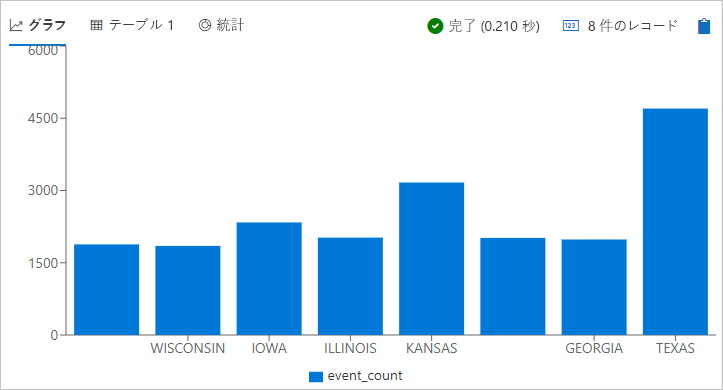

## <a name="work-with-the-table-grid"></a>テーブル グリッドを使用する

基本的なクエリの動作を確認したので、次にテーブル グリッドを使用して結果をカスタマイズし、さらに分析を行う方法を見てみましょう。

1. 最初のクエリを再実行します。 **State** 列をマウスでポイントし、メニューを選択して、 **[Group by State]\(State でグループ化\)** を選択します。

    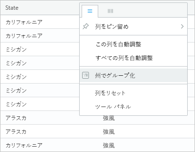

1. グリッドで **California** を展開し、その州のレコードを確認します。

    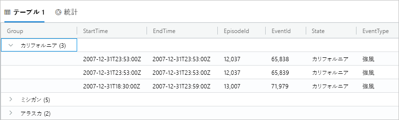

    この種類のグループ化は、探索的分析を行うときに役に立ちます。

1. **[Group]\(グループ\)** 列をマウスでポイントし、 **[Reset columns]\(列のリセット\)** を選択します。

    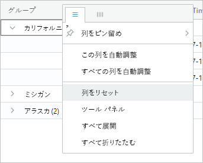

    グリッドが元の状態に戻ります。

1. 次のクエリを実行します。

    ```Kusto
    StormEvents
    | sort by StartTime desc
    | where DamageProperty > 5000
    | project StartTime, State, EventType, DamageProperty, Source
    | take 10
    ```

1. グリッドの右側にある **[Columns]\(列\)** を選択して、ツール パネルを表示します。

    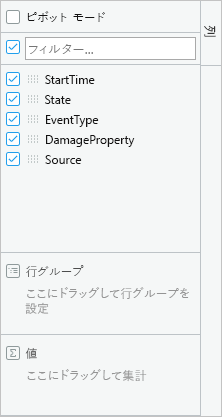

    このパネルは Excel のピボット テーブル フィールド リストと同様に機能し、グリッド自体でさらに分析を実行できます。

1. **[Pivot Mode]\(ピボット モード\)** を選択し、**State** 列を **[Row groups]\(行グループ\)** に、**DamageProperty** 列を **[Values]\(値\)** に、**EventType** 列を **[Column labels]\(列ラベル\)** に、それぞれドラッグします。  

    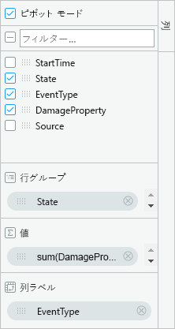

    結果は次のピボット テーブルのようになります。

    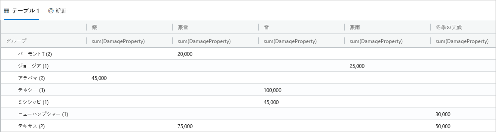

    Vermont と Alabama はそれぞれ同じカテゴリの下に 2 つのイベントがあるのに対し、Texas は異なるカテゴリに 2 つのイベントがあることに注意してください。 ピボット テーブルを使用すると、このようなことをすばやく見つけることができます。これは、迅速な分析のための優れたツールです。

## <a name="share-queries"></a>クエリを共有する

作成したクエリを共有したいことがよくあります。 ディープ リンクを提供して、クラスターにアクセスできる他のユーザーがクエリを実行できるようにすることができます。

1. クエリ ウィンドウで、最初にコピーしたクエリを選択します。

1. クエリ ウィンドウの上部にある **[Share]\(共有\)** を選択します。

1. **[Link, query to clipboard]\(リンク、クエリをクリップボードに\)** を選択します。

1. リンクとクエリをテキスト ファイルにコピーします。

1. リンクを新しいブラウザー ウィンドウに貼り付けます。 クエリを実行した後の結果は次のようになります。

    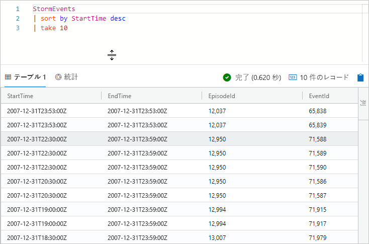

## <a name="provide-feedback"></a>フィードバックの提供

Data Explorer は現在プレビュー段階であり、ユーザーの経験に関するフィードバックを歓迎します。 今すぐ行っても、もっと時間を費やすまで待ってもかまいません。

1. アプリケーションの右上にあるフィードバック アイコンを選択します。 。

1. フィードバックを入力し、 **[Submit]\(送信\)** を選択してください。

## <a name="clean-up-resources"></a>リソースのクリーンアップ

このクイック スタートではリソースは何も作成しませんでしたが、アプリケーションから一方または両方のクラスターを削除したい場合は、クラスターを右クリックして、 **[Remove connection]\(接続を削除\)** を選択します。

## <a name="next-steps"></a>次の手順

[Azure Data Explorer のクエリを記述する](write-queries.md)
