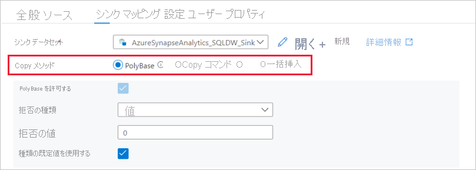

# <a name="copy-and-transform-data-in-azure-synapse-analytics-by-using-azure-data-factory"></a>Azure Data Factory を使用して Azure Synapse Analytics のデータをコピーおよび変換する

> [!div class="op_single_selector" title1="使用している Data Factory サービスのバージョンを選択します。"]
>
> - [バージョン 1](v1/data-factory-azure-sql-data-warehouse-connector.md)
> - [現在のバージョン](connector-azure-sql-data-warehouse.md)

[!INCLUDE[appliesto-adf-asa-md](includes/appliesto-adf-asa-md.md)]

この記事では、Azure Data Factory のコピー アクティビティを使用して、Azure Synapse Analytics との間でデータをコピーし、Data Flow を使用して Azure Data Lake Storage Gen2 のデータを変換する方法について説明します。 Azure Data Factory については、[入門記事で](introduction.md)をご覧ください。

## <a name="supported-capabilities"></a>サポートされる機能

この Azure Synapse Analytics コネクタは、次のアクティビティでサポートされています。

- [サポートされるソース/シンク マトリックス](copy-activity-overview.md)表での[コピー アクティビティ](copy-activity-overview.md)
- [マッピング データ フロー](concepts-data-flow-overview.md)
- [Lookup アクティビティ](control-flow-lookup-activity.md)
- [GetMetadata アクティビティ](control-flow-get-metadata-activity.md)

コピー アクティビティについて、この Azure Synapse Analytics コネクタでは次の機能がサポートされます。

- SQL 認証を使って、およびサービス プリンシパルまたは Azure リソースのマネージド ID で Azure Active Directory (Azure AD) アプリケーション トークン認証を使って、データをコピーする。
- ソースとして、SQL クエリまたはストアド プロシージャを使用してデータを取得する。 Azure Synapse Analytics ソースから並列コピーを行うこともできます。詳細については、「[Azure Synapse Analytics からの並列コピー](#parallel-copy-from-azure-synapse-analytics)」セクションを参照してください。
- シンクとして、[PolyBase](#use-polybase-to-load-data-into-azure-synapse-analytics) または [COPY ステートメント](#use-copy-statement)、あるいは一括挿入を使用してデータを読み込みます。 コピーのパフォーマンスを向上させるために、PolyBase または COPY ステートメントをお勧めします。 コネクタでは、宛先テーブルが存在しない場合は、送信元スキーマに基づくその自動作成もサポートされています。

> [!IMPORTANT]
> Azure Data Factory Integration Runtime を使ってデータをコピーする場合は、Azure サービスが[論理 SQL サーバー](../azure-sql/database/logical-servers.md)にアクセスできるように[サーバーレベルのファイアウォール規則](../azure-sql/database/firewall-configure.md)を構成します。
> セルフホステッド統合ランタイムを使用してデータをコピーする場合は、適切な IP 範囲を許可するようにファイアウォールを構成します。 この範囲には、Azure Synapse Analytics への接続に使用されるマシンの IP が含まれています。

## <a name="get-started"></a>はじめに

> [!TIP]
> 最高のパフォーマンスを実現するには、PolyBase または COPY ステートメントを使用して、Azure Synapse Analytics にデータを読み込みます。 詳細については、「[PolyBase を使用して Azure Synapse Analytics にデータを読み込む](#use-polybase-to-load-data-into-azure-synapse-analytics)」および [COPY ステートメントを使用して Azure Synapse Analytics にデータを読み込む](#use-copy-statement)方法に関するセクションを参照してください。 ユース ケースを使用したチュートリアルについては、[Azure Data Factory を使用して 1 TB のデータを 15 分以内に Azure Synapse Analytics に読み込む方法](load-azure-sql-data-warehouse.md)に関する記事をご覧ください。

[!INCLUDE [data-factory-v2-connector-get-started](../../includes/data-factory-v2-connector-get-started.md)]

以下のセクションでは、Azure Synapse Analytics コネクタに固有の Data Factory エンティティを定義するプロパティについて詳しく説明します。

## <a name="linked-service-properties"></a>リンクされたサービスのプロパティ

Azure Synapse Analytics のリンクされたサービスでは、次のプロパティがサポートされています。

| プロパティ            | 説明                                                  | 必須                                                     |
| :------------------ | :----------------------------------------------------------- | :----------------------------------------------------------- |
| type                | type プロパティは **AzureSqlDW** に設定する必要があります。             | はい                                                          |
| connectionString    | **connectionString** プロパティには、Azure Synapse Analytics インスタンスに接続するために必要な情報を指定します。 <br/>Data Factory に安全に格納するには、このフィールドを SecureString として指定します。 パスワード/サービス プリンシパル キーを Azure Key Vault に格納して、それが SQL 認証の場合は接続文字列から `password` 構成をプルすることもできます。 詳しくは、表の下の JSON の例と、「[Azure Key Vault への資格情報の格納](store-credentials-in-key-vault.md)」の記事をご覧ください。 | はい                                                          |
| servicePrincipalId  | アプリケーションのクライアント ID を取得します。                         | サービス プリンシパルで Azure AD 認証を使う場合は、はい。 |
| servicePrincipalKey | アプリケーションのキーを取得します。 このフィールドを SecureString としてマークして Data Factory に安全に保管するか、[Azure Key Vault に格納されているシークレットを参照](store-credentials-in-key-vault.md)します。 | サービス プリンシパルで Azure AD 認証を使う場合は、はい。 |
| tenant              | アプリケーションが存在するテナントの情報 (ドメイン名またはテナント ID) を指定します。 Azure Portal の右上隅にマウスを置くことで取得できます。 | サービス プリンシパルで Azure AD 認証を使う場合は、はい。 |
| azureCloudType | サービス プリンシパル認証用に、ご利用の Azure AD アプリケーションが登録されている Azure クラウド環境の種類を指定します。 <br/> 使用できる値は、`AzurePublic`、`AzureChina`、`AzureUsGovernment`、`AzureGermany` です。 既定では、データ ファクトリのクラウド環境が使用されます。 | いいえ |
| connectVia          | データ ストアに接続するために使用される[統合ランタイム](concepts-integration-runtime.md)。 Azure Integration Runtime またはセルフホステッド統合ランタイムを使用できます (データ ストアがプライベート ネットワークにある場合)。 指定されていない場合は、既定の Azure 統合ランタイムが使用されます。 | いいえ                                                           |

さまざまな認証の種類の前提条件と JSON サンプルについては、以下のセクションをご覧ください。

- [SQL 認証](#sql-authentication)
- Azure AD アプリケーション トークン認証:[サービス プリンシパル](#service-principal-authentication)
- Azure AD アプリケーション トークン認証:[Azure リソースのマネージド ID](#managed-identity)

>[!TIP]
>Azure Synapse **サーバーレス** SQL プールに対して、リンクされたサービスを UI から作成する場合は、サブスクリプションから参照するのではなく、[手動で入力] を選択します。

>[!TIP]
>エラー コード "UserErrorFailedToConnectToSqlServer" および "The session limit for the database is XXX and has been reached." (データベースのセッション制限 XXX に達しました) のようなメッセージのエラーが発生する場合は、`Pooling=false` を接続文字列に追加して、もう一度試してください。

### <a name="sql-authentication"></a>SQL 認証

#### <a name="linked-service-example-that-uses-sql-authentication"></a>SQL 認証を使用するリンクされたサービスの例

```json
{
    "name": "AzureSqlDWLinkedService",
    "properties": {
        "type": "AzureSqlDW",
        "typeProperties": {
            "connectionString": "Server=tcp:<servername>.database.windows.net,1433;Database=<databasename>;User ID=<username>@<servername>;Password=<password>;Trusted_Connection=False;Encrypt=True;Connection Timeout=30"
        },
        "connectVia": {
            "referenceName": "<name of Integration Runtime>",
            "type": "IntegrationRuntimeReference"
        }
    }
}
```

**Azure Key Vault 内のパスワード:**

```json
{
    "name": "AzureSqlDWLinkedService",
    "properties": {
        "type": "AzureSqlDW",
        "typeProperties": {
            "connectionString": "Server=tcp:<servername>.database.windows.net,1433;Database=<databasename>;User ID=<username>@<servername>;Trusted_Connection=False;Encrypt=True;Connection Timeout=30",
            "password": {
                "type": "AzureKeyVaultSecret",
                "store": {
                    "referenceName": "<Azure Key Vault linked service name>",
                    "type": "LinkedServiceReference"
                },
                "secretName": "<secretName>"
            }
        },
        "connectVia": {
            "referenceName": "<name of Integration Runtime>",
            "type": "IntegrationRuntimeReference"
        }
    }
}
```

### <a name="service-principal-authentication"></a>サービス プリンシパルの認証

サービス プリンシパル ベースの Azure AD アプリケーション トークン認証を使うには、以下の手順のようにします。

1. Azure portal から **[Azure Active Directory アプリケーションを作成します](../active-directory/develop/howto-create-service-principal-portal.md#register-an-application-with-azure-ad-and-create-a-service-principal)** 。 アプリケーション名と、リンクされたサービスを定義する次の値を記録しておきます。

   - アプリケーション ID
   - アプリケーション キー
   - テナント ID

2. まだ行っていない場合は、Azure portal でサーバーの **[Azure Active Directory 管理者をプロビジョニング](../azure-sql/database/authentication-aad-configure.md#provision-azure-ad-admin-sql-database)** します。 Azure AD 管理者は、Azure AD ユーザーでも Azure AD グループでもかまいません。 マネージド ID を持つグループに管理者ロールを付与する場合は、ステップ 3 と 4 をスキップします。 管理者は、データベースへのフル アクセスを持ちます。

3. サービス プリンシパルの **[包含データベース ユーザーを作成します](../azure-sql/database/authentication-aad-configure.md#create-contained-users-mapped-to-azure-ad-identities)** 。 SSMS のようなツールと、少なくとも ALTER ANY USER アクセス許可を持つ Azure AD ID を使用して、データをコピーするデータ ウェアハウスに接続します。 次の T-SQL を実行します。
  
    ```sql
    CREATE USER [your application name] FROM EXTERNAL PROVIDER;
    ```

4. SQL ユーザーや他のユーザーに対する通常の方法で、**サービス プリンシパルに必要なアクセス許可を付与** します。 次のコードを実行するか、[こちら](/sql/relational-databases/system-stored-procedures/sp-addrolemember-transact-sql)でその他のオプションを参照してください。 PolyBase を使用してデータを読み込む場合は、[必要なデータベース アクセス許可](#required-database-permission)について学習します。

    ```sql
    EXEC sp_addrolemember db_owner, [your application name];
    ```

5. Azure Data Factory で、**Azure Synapse Analytics のリンクされたサービスを構成** します。

#### <a name="linked-service-example-that-uses-service-principal-authentication"></a>サービス プリンシパル認証を使うリンクされたサービスの例

```json
{
    "name": "AzureSqlDWLinkedService",
    "properties": {
        "type": "AzureSqlDW",
        "typeProperties": {
            "connectionString": "Server=tcp:<servername>.database.windows.net,1433;Database=<databasename>;Connection Timeout=30",
            "servicePrincipalId": "<service principal id>",
            "servicePrincipalKey": {
                "type": "SecureString",
                "value": "<service principal key>"
            },
            "tenant": "<tenant info, e.g. microsoft.onmicrosoft.com>"
        },
        "connectVia": {
            "referenceName": "<name of Integration Runtime>",
            "type": "IntegrationRuntimeReference"
        }
    }
}
```

### <a name="managed-identities-for-azure-resources-authentication"></a><a name="managed-identity"></a> Azure リソースのマネージド ID 認証

データ ファクトリは、特定のファクトリを表す [Azure リソースのマネージド ID](data-factory-service-identity.md) に関連付けることができます。 このマネージド ID を Azure Synapse Analytics の認証に使用できます。 指定されたファクトリは、この ID を使用してデータ ウェアハウスにアクセスし、データを双方向にコピーできます。

マネージド ID 認証を使用するには、次の手順に従います。

1. まだ行っていない場合は、Azure portal でサーバーの **[Azure Active Directory 管理者をプロビジョニング](../azure-sql/database/authentication-aad-configure.md#provision-azure-ad-admin-sql-database)** します。 Azure AD 管理者は、Azure AD ユーザーでも Azure AD グループでもかまいません。 マネージド ID を持つグループに管理者ロールを付与する場合は、ステップ 3 と 4 をスキップします。 管理者は、データベースへのフル アクセスを持ちます。

2. Data Factory のマネージド ID の **[包含データベース ユーザー](../azure-sql/database/authentication-aad-configure.md#create-contained-users-mapped-to-azure-ad-identities)** を作成します。 SSMS のようなツールと、少なくとも ALTER ANY USER アクセス許可を持つ Azure AD ID を使用して、データをコピーするデータ ウェアハウスに接続します。 次の T-SQL を実行します。
  
    ```sql
    CREATE USER [your Data Factory name] FROM EXTERNAL PROVIDER;
    ```

3. SQL ユーザーや他のユーザーに対する通常の方法と同様に、**Data Factory のマネージド ID に必要なアクセス許可を付与します**。 次のコードを実行するか、[こちら](/sql/relational-databases/system-stored-procedures/sp-addrolemember-transact-sql)でその他のオプションを参照してください。 PolyBase を使用してデータを読み込む場合は、[必要なデータベース アクセス許可](#required-database-permission)について学習します。

    ```sql
    EXEC sp_addrolemember db_owner, [your Data Factory name];
    ```

4. Azure Data Factory で、**Azure Synapse Analytics のリンクされたサービスを構成** します。

**例:**

```json
{
    "name": "AzureSqlDWLinkedService",
    "properties": {
        "type": "AzureSqlDW",
        "typeProperties": {
            "connectionString": "Server=tcp:<servername>.database.windows.net,1433;Database=<databasename>;Connection Timeout=30"
        },
        "connectVia": {
            "referenceName": "<name of Integration Runtime>",
            "type": "IntegrationRuntimeReference"
        }
    }
}
```

## <a name="dataset-properties"></a>データセットのプロパティ

データセットを定義するために使用できるセクションとプロパティの完全な一覧については、[データセット](concepts-datasets-linked-services.md)に関する記事をご覧ください。

Azure Synapse Analytics データセットでは、次のプロパティがサポートされています。

| プロパティ  | 説明                                                  | 必須                    |
| :-------- | :----------------------------------------------------------- | :-------------------------- |
| type      | データセットの **type** プロパティは、**AzureSqlDWTable** を設定する必要があります。 | はい                         |
| schema | スキーマの名前。 |ソースの場合はいいえ、シンクの場合ははい  |
| table | テーブル/ビューの名前。 |ソースの場合はいいえ、シンクの場合ははい  |
| tableName | スキーマがあるテーブル/ビューの名前。 このプロパティは下位互換性のためにサポートされています。 新しいワークロードでは、`schema` と `table` を使用します。 | ソースの場合はいいえ、シンクの場合ははい |

### <a name="dataset-properties-example"></a>データセットのプロパティの例

```json
{
    "name": "AzureSQLDWDataset",
    "properties":
    {
        "type": "AzureSqlDWTable",
        "linkedServiceName": {
            "referenceName": "<Azure Synapse Analytics linked service name>",
            "type": "LinkedServiceReference"
        },
        "schema": [ < physical schema, optional, retrievable during authoring > ],
        "typeProperties": {
            "schema": "<schema_name>",
            "table": "<table_name>"
        }
    }
}
```

## <a name="copy-activity-properties"></a>コピー アクティビティのプロパティ

アクティビティの定義に利用できるセクションとプロパティの完全な一覧については、[パイプライン](concepts-pipelines-activities.md)に関する記事を参照してください。 このセクションでは、Azure Synapse Analytics のソースとシンクでサポートされるプロパティの一覧を示します。

### <a name="azure-synapse-analytics-as-the-source"></a>ソースとしての Azure Synapse Analytics

>[!TIP]
>データ パーティション分割を使用して Azure Synapse Analytics からデータを効率的に読み込む方法の詳細については、「[Azure Synapse Analytics からの並列コピー](#parallel-copy-from-azure-synapse-analytics)」を参照してください。

Azure Synapse Analytics からデータをコピーするには、コピー アクティビティのソースの **type** プロパティを **SqlDWSource** に設定します。 コピー アクティビティの **source** セクションでは、次のプロパティがサポートされます。

| プロパティ                     | 説明                                                  | 必須 |
| :--------------------------- | :----------------------------------------------------------- | :------- |
| type                         | コピー アクティビティのソースの **type** プロパティは **SqlDWSource** に設定する必要があります。 | はい      |
| sqlReaderQuery               | カスタム SQL クエリを使用してデータを読み取ります。 例: `select * from MyTable`. | いいえ       |
| sqlReaderStoredProcedureName | ソース テーブルからデータを読み取るストアド プロシージャの名前。 最後の SQL ステートメントはストアド プロシージャの SELECT ステートメントにする必要があります。 | いいえ       |
| storedProcedureParameters    | ストアド プロシージャのパラメーター。<br/>使用可能な値は、名前または値のペアです。 パラメーターの名前とその大文字と小文字は、ストアド プロシージャのパラメーターの名前とその大文字小文字と一致する必要があります。 | いいえ       |
| isolationLevel | SQL ソースのトランザクション ロック動作を指定します。 使用できる値は、次のとおりです。**ReadCommitted**、**ReadUncommitted**、**RepeatableRead**、**Serializable**、**Snapshot**。 指定しなかった場合は、データベースの既定の分離レベルが使用されます。 詳細については、「[system.data.isolationlevel](/dotnet/api/system.data.isolationlevel)」を参照してください。 | いいえ |
| partitionOptions | Azure Synapse Analytics からのデータの読み込みに使用されるデータ パーティション分割オプションを指定します。 <br>使用できる値は、以下のとおりです。**None** (既定値)、**PhysicalPartitionsOfTable**、および **DynamicRange**。<br>パーティション オプションが有効になっている場合 (つまり、`None` ではない場合)、Azure Synapse Analytics から同時にデータを読み込む並列度は、コピー アクティビティの [`parallelCopies`](copy-activity-performance-features.md#parallel-copy) の設定によって制御されます。 | いいえ |
| partitionSettings | データ パーティション分割の設定のグループを指定します。 <br>パーティション オプションが `None` でない場合に適用されます。 | いいえ |
| ***`partitionSettings` の下:*** | | |
| partitionColumnName | 並列コピーの範囲パーティション分割で使用される **整数型または日付/日時型** (`int`、`smallint`、`bigint`、`date`、`smalldatetime`、`datetime`、`datetime2`、または `datetimeoffset`) のソース列の名前を指定します。 指定しない場合は、テーブルのインデックスまたは主キーが自動的に検出され、パーティション列として使用されます。<br>パーティション オプションが `DynamicRange` である場合に適用されます。 クエリを使用してソース データを取得する場合は、WHERE 句で `?AdfDynamicRangePartitionCondition ` をフックします。 例については、「[SQL データベースからの並列コピー](#parallel-copy-from-azure-synapse-analytics)」セクションを参照してください。 | いいえ |
| partitionUpperBound | パーティション範囲の分割のための、パーティション列の最大値。 この値は、テーブル内の行のフィルター処理用ではなく、パーティションのストライドを決定するために使用されます。 テーブルまたはクエリ結果に含まれるすべての行がパーティション分割され、コピーされます。 指定されない場合、コピー アクティビティによって値が自動検出されます。  <br>パーティション オプションが `DynamicRange` である場合に適用されます。 例については、「[SQL データベースからの並列コピー](#parallel-copy-from-azure-synapse-analytics)」セクションを参照してください。 | いいえ |
| partitionLowerBound | パーティション範囲の分割のための、パーティション列の最小値。 この値は、テーブル内の行のフィルター処理用ではなく、パーティションのストライドを決定するために使用されます。 テーブルまたはクエリ結果に含まれるすべての行がパーティション分割され、コピーされます。 指定されない場合、コピー アクティビティによって値が自動検出されます。<br>パーティション オプションが `DynamicRange` である場合に適用されます。 例については、「[SQL データベースからの並列コピー](#parallel-copy-from-azure-synapse-analytics)」セクションを参照してください。 | いいえ |

**以下の点に注意してください。**

- ソースのストアド プロシージャを使用してデータを取得する場合、異なるパラメーター値が渡されたときにストアド プロシージャが別のスキーマを返すように設計されていると、UI からスキーマをインポートするとき、または自動テーブル作成を使用して SQL データベースにデータをコピーするときに、エラーが発生したり、予期しない結果が表示されます。

#### <a name="example-using-sql-query"></a>例: SQL クエリの使用

```json
"activities":[
    {
        "name": "CopyFromAzureSQLDW",
        "type": "Copy",
        "inputs": [
            {
                "referenceName": "<Azure Synapse Analytics input dataset name>",
                "type": "DatasetReference"
            }
        ],
        "outputs": [
            {
                "referenceName": "<output dataset name>",
                "type": "DatasetReference"
            }
        ],
        "typeProperties": {
            "source": {
                "type": "SqlDWSource",
                "sqlReaderQuery": "SELECT * FROM MyTable"
            },
            "sink": {
                "type": "<sink type>"
            }
        }
    }
]
```

#### <a name="example-using-stored-procedure"></a>例: ストアド プロシージャの使用

```json
"activities":[
    {
        "name": "CopyFromAzureSQLDW",
        "type": "Copy",
        "inputs": [
            {
                "referenceName": "<Azure Synapse Analytics input dataset name>",
                "type": "DatasetReference"
            }
        ],
        "outputs": [
            {
                "referenceName": "<output dataset name>",
                "type": "DatasetReference"
            }
        ],
        "typeProperties": {
            "source": {
                "type": "SqlDWSource",
                "sqlReaderStoredProcedureName": "CopyTestSrcStoredProcedureWithParameters",
                "storedProcedureParameters": {
                    "stringData": { "value": "str3" },
                    "identifier": { "value": "$$Text.Format('{0:yyyy}', <datetime parameter>)", "type": "Int"}
                }
            },
            "sink": {
                "type": "<sink type>"
            }
        }
    }
]
```

#### <a name="sample-stored-procedure"></a>サンプル ストアド プロシージャ:

```sql
CREATE PROCEDURE CopyTestSrcStoredProcedureWithParameters
(
    @stringData varchar(20),
    @identifier int
)
AS
SET NOCOUNT ON;
BEGIN
    select *
    from dbo.UnitTestSrcTable
    where dbo.UnitTestSrcTable.stringData != stringData
    and dbo.UnitTestSrcTable.identifier != identifier
END
GO
```

### <a name="azure-synapse-analytics-as-sink"></a><a name="azure-sql-data-warehouse-as-sink"></a>シンクとしての Azure Synapse Analytics

Azure Data Factory では、Azure Synapse Analytics にデータを読み込む 3 つの方法がサポートされています。



- [PolyBase を使用する](#use-polybase-to-load-data-into-azure-synapse-analytics)
- [COPY ステートメントを使用する](#use-copy-statement)
- 一括挿入を使用する

データを読み込む最も高速でスケーラブルな方法は、[PolyBase](/sql/relational-databases/polybase/polybase-guide) または [COPY ステートメント](/sql/t-sql/statements/copy-into-transact-sql)を使用することです。

Azure Synapse Analytics にデータをコピーするには、コピー アクティビティのシンクの種類を **SqlDWSink** に設定します。 コピー アクティビティの **sink** セクションでは、次のプロパティがサポートされます。

| プロパティ          | 説明                                                  | 必須                                      |
| :---------------- | :----------------------------------------------------------- | :-------------------------------------------- |
| type              | コピー アクティビティのシンクの **type** プロパティは、**SqlDWSink** に設定する必要があります。 | はい                                           |
| allowPolyBase     | PolyBase を使用して Azure Synapse Analytics にデータを読み込むかどうかを示します。 `allowCopyCommand` と `allowPolyBase` の両方を true に設定することはできません。 <br/><br/>制約と詳細については、「[PolyBase を使用して Azure Synapse Analytics にデータを読み込む](#use-polybase-to-load-data-into-azure-synapse-analytics)」をご覧ください。<br/><br/>使用可能な値: **True**、および **False** (既定値)。 | いいえ。<br/>PolyBase を使用する場合に適用します。     |
| polyBaseSettings  | `allowPolybase` プロパティが **true** に設定されているときに指定できるプロパティのグループ。 | いいえ。<br/>PolyBase を使用する場合に適用します。 |
| allowCopyCommand | Azure Synapse Analytics にデータを読み込む際に、[COPY ステートメント](/sql/t-sql/statements/copy-into-transact-sql)を使用するかどうかを示します。 `allowCopyCommand` と `allowPolyBase` の両方を true に設定することはできません。 <br/><br/>制約と詳細については、「[COPY ステートメントを使用して Azure Synapse Analytics にデータを読み込む](#use-copy-statement)」をご覧ください。<br/><br/>使用可能な値: **True**、および **False** (既定値)。 | いいえ。<br>COPY を使用する場合に適用します。 |
| copyCommandSettings | `allowCopyCommand` プロパティが TRUE に設定されているときに指定できるプロパティのグループ。 | いいえ。<br/>COPY を使用する場合に適用します。 |
| writeBatchSize    | SQL テーブルに挿入する **バッチあたりの** 行数。<br/><br/>使用可能な値は **integer** (行数) です。 既定では、Data Factory により行のサイズに基づいて適切なバッチ サイズが動的に決定されます。 | いいえ。<br/>一括挿入を使用する場合に適用します。     |
| writeBatchTimeout | タイムアウトする前に一括挿入操作の完了を待つ時間です。<br/><br/>使用可能な値は **timespan** です。 例:"00:30:00" (30 分)。 | いいえ。<br/>一括挿入を使用する場合に適用します。        |
| preCopyScript     | コピー アクティビティの毎回の実行で、データを Azure Synapse Analytics に書き込む前に実行する SQL クエリを指定します。 前に読み込まれたデータをクリーンアップするには、このプロパティを使います。 | いいえ                                            |
| tableOption | ソースのスキーマに基づいて[自動的にシンク テーブルを作成する](copy-activity-overview.md#auto-create-sink-tables)かどうかを指定します (存在しない場合)。 使用できる値は `none` (既定値)、`autoCreate` です。 |いいえ |
| disableMetricsCollection | Data Factory では、コピーのパフォーマンスの最適化とレコメンデーションを目的として、Azure Synapse Analytics DWU などのメトリックが収集されます。これにより、マスター DB への追加アクセスが発生します。 この動作に不安がある場合は、`true` を指定してオフにします。 | いいえ (既定値は `false`) |

#### <a name="azure-synapse-analytics-sink-example"></a>Azure Synapse Analytics シンクの例

```json
"sink": {
    "type": "SqlDWSink",
    "allowPolyBase": true,
    "polyBaseSettings":
    {
        "rejectType": "percentage",
        "rejectValue": 10.0,
        "rejectSampleValue": 100,
        "useTypeDefault": true
    }
}
```

## <a name="parallel-copy-from-azure-synapse-analytics"></a>Azure Synapse Analytics からの並列コピー

Azure Synapse Analytics コネクタでは、コピー アクティビティの際に、データを並列でコピーするための組み込みのデータ パーティション分割が提供されます。 データ パーティション分割オプションは、コピー アクティビティの **[ソース]** タブにあります。


パーティション分割されるコピーを有効にすると、コピー アクティビティによって Azure Synapse Analytics ソースに対する並列クエリが実行され、パーティションごとにデータが読み込まれます。 並列度は、コピー アクティビティの [`parallelCopies`](copy-activity-performance-features.md#parallel-copy) 設定によって制御されます。 たとえば、`parallelCopies` を 4 に設定した場合、Data Factory では、指定したパーティション オプションと設定に基づいて 4 つのクエリが同時に生成され、実行されます。そして各クエリが、Azure Synapse Analytics からデータの一部を取得します。

Azure Synapse Analytics から大量のデータを読み込む場合は特に、データ パーティション分割を行う並列コピーを有効にすることが推奨されます。 さまざまなシナリオの推奨構成を以下に示します。 ファイルベースのデータ ストアにデータをコピーする場合は、複数のファイルとしてフォルダーに書き込む (フォルダー名のみを指定する) ことをお勧めします。この場合、1 つのファイルに書き込むよりもパフォーマンスが優れています。

| シナリオ                                                     | 推奨設定                                           |
| ------------------------------------------------------------ | ------------------------------------------------------------ |
| 物理パーティションに分割された大きなテーブル全体から読み込む。        | **パーティション オプション**: テーブルの物理パーティション。 <br><br/>実行中に、Data Factory によって物理パーティションが自動的に検出され、パーティションごとにデータがコピーされます。 <br><br/>テーブルに物理パーティションがあるかどうかを確認するには、[こちらのクエリ](#sample-query-to-check-physical-partition)を参照してください。 |
| 物理パーティションがなく、データ パーティション分割用の整数または日時の列がある大きなテーブル全体から読み込む。 | **パーティション オプション**: 動的範囲パーティション。<br>**パーティション列** (省略可能):データのパーティション分割に使用される列を指定します。 指定されていない場合は、インデックスまたは主キー列が使用されます。<br/>**パーティションの上限** と **パーティションの下限** (省略可能):パーティションのストライドを決定する場合に指定します。 これは、テーブル内の行のフィルター処理用ではなく、テーブル内のすべての行がパーティション分割されてコピーされます。 指定されていない場合は、コピー アクティビティによって値が自動検出されます。<br><br>たとえば、パーティション列 "ID" の値の範囲が 1 ～ 100 で、下限を 20 に、上限を 80 に設定し、並列コピーを 4 にした場合、Data Factory によって 4 つのパーティションでデータが取得されます。ID の範囲は、それぞれ、20 以下、21 ～ 50、51 ～ 80、81 以上となります。 |
| 物理パーティションがなく、データ パーティション分割用の整数列または日付/日時列がある大量のデータを、カスタム クエリを使用して読み込む。 | **パーティション オプション**: 動的範囲パーティション。<br>**クエリ**: `SELECT * FROM <TableName> WHERE ?AdfDynamicRangePartitionCondition AND <your_additional_where_clause>`<br>**パーティション列**: データのパーティション分割に使用される列を指定します。<br>**パーティションの上限** と **パーティションの下限** (省略可能):パーティションのストライドを決定する場合に指定します。 これは、テーブル内の行のフィルター処理用ではなく、クエリ結果のすべての行がパーティション分割されてコピーされます。 指定されていない場合は、コピー アクティビティによって値が自動検出されます。<br><br>実行中に、Data Factory によって `?AdfRangePartitionColumnName` が各パーティションの実際の列名および値の範囲に置き換えられ、Azure Synapse Analytics に送信されます。 <br>たとえば、パーティション列 "ID" の値の範囲が 1 ～ 100 で、下限を 20 に、上限を 80 に設定し、並列コピーを 4 にした場合、Data Factory によって 4 つのパーティションでデータが取得されます。ID の範囲は、それぞれ、20 以下、21 ～ 50、51 ～ 80、81 以上となります。 <br><br>さまざまなシナリオのサンプル クエリを次に示します。<br> 1.テーブル全体に対してクエリを実行する: <br>`SELECT * FROM <TableName> WHERE ?AdfDynamicRangePartitionCondition`<br> 2.列の選択と追加の where 句フィルターが含まれるテーブルからのクエリ: <br>`SELECT <column_list> FROM <TableName> WHERE ?AdfDynamicRangePartitionCondition AND <your_additional_where_clause>`<br> 3.サブクエリを使用したクエリ: <br>`SELECT <column_list> FROM (<your_sub_query>) AS T WHERE ?AdfDynamicRangePartitionCondition AND <your_additional_where_clause>`<br> 4.サブクエリにパーティションがあるクエリ: <br>`SELECT <column_list> FROM (SELECT <your_sub_query_column_list> FROM <TableName> WHERE ?AdfDynamicRangePartitionCondition) AS T`
|

パーティション オプションを使用してデータを読み込む場合のベスト プラクティス:

1. データ スキューを回避するため、パーティション列 (主キーや一意キーなど) には特徴のある列を選択します。 
2. テーブルに組み込みパーティションがある場合は、パフォーマンスを向上させるためにパーティション オプションとして "テーブルの物理パーティション" を使用します。
3. Azure Integration Runtime を使用してデータをコピーする場合は、より大きな (4 より大きい) "[データ統合単位 (DIU)](copy-activity-performance-features.md#data-integration-units)" を設定すると、より多くのコンピューティング リソースを利用できます。 そこで、該当するシナリオを確認してください。
4. パーティション数は、"[コピーの並列処理の次数](copy-activity-performance-features.md#parallel-copy)" によって制御されます。この数値を大きくしすぎるとパフォーマンスが低下するため、この数値は、(DIU またはセルフホステッド IR ノードの数) x (2 から 4) に設定することをお勧めします。
5. Azure Synapse Analytics では、最大で 32 個のクエリを実行でき、"コピーの並列度" を高く設定しすぎると、Synapse の調整の問題が発生する可能性があることに注意してください。

**例: 複数の物理パーティションがある大きなテーブル全体から読み込む**

```json
"source": {
    "type": "SqlDWSource",
    "partitionOption": "PhysicalPartitionsOfTable"
}
```

**例: 動的範囲パーティションを使用してクエリを実行する**

```json
"source": {
    "type": "SqlDWSource",
    "query": "SELECT * FROM <TableName> WHERE ?AdfDynamicRangePartitionCondition AND <your_additional_where_clause>",
    "partitionOption": "DynamicRange",
    "partitionSettings": {
        "partitionColumnName": "<partition_column_name>",
        "partitionUpperBound": "<upper_value_of_partition_column (optional) to decide the partition stride, not as data filter>",
        "partitionLowerBound": "<lower_value_of_partition_column (optional) to decide the partition stride, not as data filter>"
    }
}
```

### <a name="sample-query-to-check-physical-partition"></a>物理パーティションを確認するためのサンプル クエリ

```sql
SELECT DISTINCT s.name AS SchemaName, t.name AS TableName, c.name AS ColumnName, CASE WHEN c.name IS NULL THEN 'no' ELSE 'yes' END AS HasPartition
FROM sys.tables AS t
LEFT JOIN sys.objects AS o ON t.object_id = o.object_id
LEFT JOIN sys.schemas AS s ON o.schema_id = s.schema_id
LEFT JOIN sys.indexes AS i ON t.object_id = i.object_id
LEFT JOIN sys.index_columns AS ic ON ic.partition_ordinal > 0 AND ic.index_id = i.index_id AND ic.object_id = t.object_id
LEFT JOIN sys.columns AS c ON c.object_id = ic.object_id AND c.column_id = ic.column_id
LEFT JOIN sys.types AS y ON c.system_type_id = y.system_type_id
WHERE s.name='[your schema]' AND t.name = '[your table name]'
```

テーブルに物理パーティションがある場合、"HasPartition" は "yes" と表示されます。

## <a name="use-polybase-to-load-data-into-azure-synapse-analytics"></a>PolyBase を使用して Azure Synapse Analytics にデータを読み込む

[PolyBase](/sql/relational-databases/polybase/polybase-guide) を使用すると、高いスループットで Azure Synapse Analytics に大量のデータを効率的に読み込むことができます。 既定の BULKINSERT メカニズムではなく PolyBase を使用することで、スループットが大幅に向上することがわかります。 ユース ケースを使用したチュートリアルについては、[1 TB のデータを Azure Synapse Analytics に読み込む方法](v1/data-factory-load-sql-data-warehouse.md)に関する記事をご覧ください。

- ソース データが **Azure Blob、Azure Data Lake Storage Gen1、または Azure Data Lake Storage Gen2** 内にあるときに、**形式が PolyBase 互換** の場合は、コピー アクティビティを使用して PolyBase を直接呼び出し、Azure Synapse Analytics でソースからデータを引き出すことができます。 詳しくは、「 **[PolyBase を使用して直接コピーする](#direct-copy-by-using-polybase)** 」をご覧ください。
- ソース データのストアと形式が、本来は PolyBase でサポートされていない形式の場合は、代わりに **[PolyBase を使用したステージング コピー](#staged-copy-by-using-polybase)** を使います。 ステージング コピー機能はスループットも優れています。 データは、PolyBase と互換性のある形式に自動的に変換され、Azure Blob Storage に格納されます。その後、PolyBase が呼び出されて、Azure Synapse Analytics にデータが読み込まれます。

> [!TIP]
> 「[PolyBase の使用に関するベスト プラクティス](#best-practices-for-using-polybase)」をご覧ください。 Azure Integration Runtime で PolyBase を使用している場合、直接またはステージングされているストレージから Synapse への[データ統合ユニット (DIU)](copy-activity-performance-features.md#data-integration-units) は常に 2 になります。 ストレージからのデータの読み込みは Synapse エンジンによって行われるため、DIU をチューニングしてもパフォーマンスには影響しません。

コピー アクティビティの `polyBaseSettings` では、次の PolyBase 設定がサポートされています。

| プロパティ          | 説明                                                  | 必須                                      |
| :---------------- | :----------------------------------------------------------- | :-------------------------------------------- |
| rejectValue       | クエリが失敗するまでに拒否できる行の数または割合を指定します。<br/><br/>PolyBase の拒否オプションの詳細については、「[CREATE EXTERNAL TABLE (Transact-SQL)](/sql/t-sql/statements/create-external-table-transact-sql)」の「引数」セクションを参照してください。 <br/><br/>使用可能な値は、0 (既定値)、1、2 などです。 | いいえ                                            |
| rejectType        | **rejectValue** オプションがリテラル値か割合かを指定します。<br/><br/>使用可能な値は、**Value** (既定値) と **Percentage** です。 | いいえ                                            |
| rejectSampleValue | 拒否された行の割合が PolyBase で再計算されるまでに取得する行数を決定します。<br/><br/>使用可能な値は、1、2 などです。 | はい (**rejectType** が **percentage** の場合)。 |
| useTypeDefault    | PolyBase によってテキスト ファイルからデータが取得されるときに、区切りテキスト ファイル内の不足値を処理する方法を指定します。<br/><br/>このプロパティの詳細については、[CREATE EXTERNAL FILE FORMAT (Transact-SQL)](/sql/t-sql/statements/create-external-file-format-transact-sql) Arguments セクションをご覧ください。<br/><br/>使用可能な値: **True**、および **False** (既定値)。<br><br> | いいえ                                            |

### <a name="direct-copy-by-using-polybase"></a>PolyBase を使用して直接コピーする

Azure Synapse Analytics の PolyBase では、Azure Blob、Azure Data Lake Storage Gen1、および Azure Data Lake Storage Gen2 が直接サポートされます。 ソース データがこのセクションで説明する条件を満たしている場合は、PolyBase を使用してソース データ ストアから Azure Synapse Analytics に直接コピーします。 それ以外の場合は、[PolyBase を使用したステージング コピー](#staged-copy-by-using-polybase)を使います。

> [!TIP]
> データを効率的に Azure Synapse Analytics にコピーするには、「[Azure Data Factory を利用すれば、Azure Synapse Analytics と共に Data Lake Store を使用する場合にデータからさらに容易かつ便利に情報を引き出せるようになる](/archive/blogs/azuredatalake/azure-data-factory-makes-it-even-easier-and-convenient-to-uncover-insights-from-data-when-using-data-lake-store-with-sql-data-warehouse)」を参考にしてください。

要件が満たされない場合は、Azure Data Factory が設定を確認し、データ移動には自動的に BULKINSERT メカニズムが使用されるように戻ります。

1. **ソース リンク サービス** では、次の種類と認証方法が使用されます。

    | サポートされるソース データ ストアの種類                             | サポートされる認証の種類                        |
    | :----------------------------------------------------------- | :---------------------------------------------------------- |
    | [Azure BLOB](connector-azure-blob-storage.md)                | アカウント キー認証、マネージド ID 認証 |
    | [Azure Data Lake Storage Gen1](connector-azure-data-lake-store.md) | サービス プリンシパルの認証                            |
    | [Azure Data Lake Storage Gen2](connector-azure-data-lake-storage.md) | アカウント キー認証、マネージド ID 認証 |

    >[!IMPORTANT]
    >- ストレージのリンクされたサービスに対してマネージド ID 認証を使用する場合は、[Azure Blob](connector-azure-blob-storage.md#managed-identity) と [Azure Data Lake Storage Gen2](connector-azure-data-lake-storage.md#managed-identity) に必要な各構成について確認してください。
    >- Azure Storage が VNet サービス エンドポイントを使用して構成されている場合は、ストレージ アカウントで [allow trusted Microsoft service]\(信頼された Microsoft サービスを許可する\) を有効にしたマネージド ID 認証を使用する必要があります。詳細については「[Azure Storage で VNet サービス エンドポイントを使用した場合の影響](../azure-sql/database/vnet-service-endpoint-rule-overview.md#impact-of-using-virtual-network-service-endpoints-with-azure-storage)」を参照してください。

2. **ソース データ形式** は、次のように構成された **Parquet**、 **ORC**、または **区切りテキスト** です。

   1. フォルダーのパスにワイルドカード フィルターが含まれない。
   2. ファイル名が空か、1 つのファイルを指している。 コピー アクティビティでワイルドカードのファイル名を指定する場合は、`*` または `*.*` のみを指定できます。
   3. `rowDelimiter` が **default**、 **\n**、 **\r\n**、または **\r** である。
   4. `nullValue` が既定値のままか、**空の文字列** ("") に設定されており、`treatEmptyAsNull` が既定値のままか、true に設定されている。
   5. `encodingName` が既定値のままか、**utf-8** に設定されている。
   6. `quoteChar`、`escapeChar`、および `skipLineCount` が指定されていない。 PolyBase では、ヘッダー行のスキップがサポートされます。これは、ADF で `firstRowAsHeader` として構成できます。
   7. `compression` が **圧縮なし**、**GZip**、または **Deflate** である。

3. ソースがフォルダーの場合は、コピー アクティビティの `recursive` を true に設定する必要があります。

4. `wildcardFolderPath`、`wildcardFilename`、`modifiedDateTimeStart`、`modifiedDateTimeEnd`、`prefix`、`enablePartitionDiscovery`、`additionalColumns` は指定されません。

>[!NOTE]
>ソースがフォルダーの場合、PolyBase ではフォルダーとそのすべてのサブフォルダーからファイルが取得され、ファイル名の先頭に下線 (_) またはピリオド (.) が付いているファイルからはデータが取得されないことに注意してください。詳細については、[LOCATION 引数に関するこちらのドキュメント](/sql/t-sql/statements/create-external-table-transact-sql#arguments-2)を参照してください。

```json
"activities":[
    {
        "name": "CopyFromAzureBlobToSQLDataWarehouseViaPolyBase",
        "type": "Copy",
        "inputs": [
            {
                "referenceName": "ParquetDataset",
                "type": "DatasetReference"
            }
        ],
        "outputs": [
            {
                "referenceName": "AzureSQLDWDataset",
                "type": "DatasetReference"
            }
        ],
        "typeProperties": {
            "source": {
                "type": "ParquetSource",
                "storeSettings":{
                    "type": "AzureBlobStorageReadSettings",
                    "recursive": true
                }
            },
            "sink": {
                "type": "SqlDWSink",
                "allowPolyBase": true
            }
        }
    }
]
```

### <a name="staged-copy-by-using-polybase"></a>PolyBase を使用したステージング コピー

ソース データが PolyBase とネイティブに互換性がない場合は、中間ステージング Azure Blob または Azure Data Lake Storage Gen2 を介したデータのコピーを有効にします (Azure Premium Storage は使用できません)。 この場合、Azure Data Factory によって、PolyBase のデータ形式要件を満たすようにデータが自動的に変換されます。 その後、PolyBase を使用して、データが Azure Synapse Analytics に読み込まれます。 最後に、ストレージから一時データがクリーンアップされます。 ステージング経由でのデータのコピーの詳細は、「[ステージング コピー](copy-activity-performance-features.md#staged-copy)」を参照してください。

この機能を使用するには、中間ストレージとして Azure Storage アカウントを参照する **アカウント キーまたはマネージド ID の認証** を使用して、[Azure Blob Storage のリンクされたサービス](connector-azure-blob-storage.md#linked-service-properties)または [Azure Data Lake Storage Gen2 のリンクされたサービス](connector-azure-data-lake-storage.md#linked-service-properties)を作成します。

>[!IMPORTANT]
>- ステージングのリンクされたサービスに対してマネージド ID 認証を使用する場合は [Azure Blob](connector-azure-blob-storage.md#managed-identity) と [Azure Data Lake Storage Gen2](connector-azure-data-lake-storage.md#managed-identity) に必要な各構成について確認してください。
>- ステージング Azure Storage が VNet サービス エンドポイントを使用して構成されている場合は、ストレージ アカウントで [allow trusted Microsoft service]\(信頼された Microsoft サービスを許可する\) を有効にしたマネージド ID 認証を使用する必要があります。詳細については「[Azure Storage で VNet サービス エンドポイントを使用した場合の影響](../azure-sql/database/vnet-service-endpoint-rule-overview.md#impact-of-using-virtual-network-service-endpoints-with-azure-storage)」を参照してください。 

>[!IMPORTANT]
>ステージング Azure Storage がマネージド プライベート エンドポイントで構成され、ストレージ ファイアウォールが有効になっている場合は、マネージド ID 認証を使用し、Synapse SQL Server にストレージ BLOB データ閲覧者のアクセス許可を付与して、PolyBase の読み込み中にステージング ファイルにアクセスできるようにする必要があります。

```json
"activities":[
    {
        "name": "CopyFromSQLServerToSQLDataWarehouseViaPolyBase",
        "type": "Copy",
        "inputs": [
            {
                "referenceName": "SQLServerDataset",
                "type": "DatasetReference"
            }
        ],
        "outputs": [
            {
                "referenceName": "AzureSQLDWDataset",
                "type": "DatasetReference"
            }
        ],
        "typeProperties": {
            "source": {
                "type": "SqlSource",
            },
            "sink": {
                "type": "SqlDWSink",
                "allowPolyBase": true
            },
            "enableStaging": true,
            "stagingSettings": {
                "linkedServiceName": {
                    "referenceName": "MyStagingStorage",
                    "type": "LinkedServiceReference"
                }
            }
        }
    }
]
```

### <a name="best-practices-for-using-polybase"></a>PolyBase の使用に関するベスト プラクティス

次のセクションでは、[Azure Synapse Analytics のベスト プラクティス](../synapse-analytics/sql/best-practices-sql-pool.md)に関する記事に記載されているもの以外のベスト プラクティスについて説明します。

#### <a name="required-database-permission"></a>必要なデータベース アクセス許可

PolyBase を使用するには、データを Azure Synapse Analytics に読み込むユーザーは、ターゲット データベースに対する ["CONTROL" アクセス許可](/sql/relational-databases/security/permissions-database-engine)を持っている必要があります。 これを実現する方法の 1 つは、ユーザーを **db_owner** ロールのメンバーとして追加することです。 これを行う方法については、[Azure Synapse Analytics の概要](../synapse-analytics/sql-data-warehouse/sql-data-warehouse-overview-manage-security.md#authorization)に関する記事を参照してください。

#### <a name="row-size-and-data-type-limits"></a>行のサイズとデータ型の制限

PolyBase の読み込みは、1 MB 未満の行に制限されます。 VARCHR(MAX)、NVARCHAR(MAX)、VARBINARY(MAX) への読み込みには使用できません。 詳細については、「[Azure Synapse Analytics サービスの容量制限](../synapse-analytics/sql-data-warehouse/sql-data-warehouse-service-capacity-limits.md#loads)」を参照してください。

ソース データに 1 MB を超える行がある場合は、ソース テーブルを複数の小さいテーブルに垂直分割できます。 各行の最大サイズが制限を超えないことを確認します。 その後、これらの小さいテーブルは、PolyBase を使用して Azure Synapse Analytics に読み込み、マージすることができます。

または、このように広い列を持つデータについては、[Allow polybase]\(PolyBase を許可する\) 設定をオフにすることで、ADF を使用したデータの読み込みに PolyBase 以外を使用できます。

#### <a name="azure-synapse-analytics-resource-class"></a>Azure Synapse Analytics リソース クラス

可能な限りスループットを最大化するには、PolyBase 経由で Azure Synapse Analytics にデータを読み込むユーザーに、より大きなリソース クラスを割り当てます。

#### <a name="polybase-troubleshooting"></a>PolyBase に関するトラブルシューティング

#### <a name="loading-to-decimal-column"></a>10 進数の列への読み込み

ソース データがテキスト形式であるか、(ステージング コピーと PolyBase を使用する) その他の PolyBase 非互換ストアにあるときに、その中に Azure Synapse Analytics の 10 進数の列に読み込まれる空の値が含まれている場合は、次のエラーが発生することがあります。

```output
ErrorCode=FailedDbOperation, ......HadoopSqlException: Error converting data type VARCHAR to DECIMAL.....Detailed Message=Empty string can't be converted to DECIMAL.....
```

これを解決するには、コピー アクティビティの sink の PolyBase 設定で、(false として) "**型の既定を使用する**" オプションを選択解除します。 "[USE_TYPE_DEFAULT](/sql/t-sql/statements/create-external-file-format-transact-sql#arguments)" は、PolyBase でテキスト ファイルからデータが取得される際に区切りテキスト ファイル内の欠落値を処理する方法を指定する PolyBase ネイティブ構成です。

#### <a name="check-the-tablename-property-in-azure-synapse-analytics"></a>Azure Synapse Analytics で tableName プロパティを確認する

次の表は、JSON データセットで **tableName** プロパティを指定する方法の例です。 スキーマとテーブル名の複数の組み合わせを示します。

| DB スキーマ | テーブル名 | **tableName** JSON プロパティ               |
| --------- | ---------- | ----------------------------------------- |
| dbo       | MyTable    | MyTable、dbo.MyTable、または [dbo].[MyTable] |
| dbo1      | MyTable    | dbo1.MyTable または [dbo1].[MyTable]          |
| dbo       | My.Table   | [My.Table] または [dbo].[My.Table]            |
| dbo1      | My.Table   | [dbo1].[My.Table]                         |

次のエラーが表示される場合は、**tableName** プロパティに指定した値に問題がある可能性があります。 **tableName** JSON プロパティの値を指定する正しい方法については、上の表を参照してください。

```output
Type=System.Data.SqlClient.SqlException,Message=Invalid object name 'stg.Account_test'.,Source=.Net SqlClient Data Provider
```

#### <a name="columns-with-default-values"></a>既定値を持つ列

現在、Data Factory の PolyBase 機能では、ターゲット テーブルと同じ数の列のみを使用できます。 たとえば、4 つの列を含むテーブルがあり、その列の 1 つには既定値が定義されているものとします。 それでも入力データには 4 つの列が必要です。 入力データセットが 3 列の場合は、次のメッセージのようなエラーが発生します。

```output
All columns of the table must be specified in the INSERT BULK statement.
```

null 値は、特殊な形式の既定値です。 列が null 許容の場合、その列に対する BLOB 内の入力データが空になる可能性があります。 ただし、入力データセットから欠落することはできません。 PolyBase では、Azure Synapse Analytics の欠損値に対して null を挿入します。

#### <a name="external-file-access-failed"></a>外部ファイルへのアクセスに失敗する

次のエラーが発生した場合は、マネージド ID 認証を使用していること、および Synapse SQL Server ワークスペースのマネージド ID にストレージ BLOB データ閲覧者のアクセス許可が付与されていることを確認してください。

```output
Job failed due to reason: at Sink '[SinkName]': shaded.msdataflow.com.microsoft.sqlserver.jdbc.SQLServerException: External file access failed due to internal error: 'Error occurred while accessing HDFS: Java exception raised on call to HdfsBridge_IsDirExist. Java exception message:\r\nHdfsBridge::isDirExist 
```

詳細については、「[ワークスペースの作成後にマネージド ID にアクセス許可を付与する](../synapse-analytics/security/how-to-grant-workspace-managed-identity-permissions.md#grant-permissions-to-managed-identity-after-workspace-creation)」を参照してください。

## <a name="use-copy-statement-to-load-data-into-azure-synapse-analytics"></a><a name="use-copy-statement"></a> COPY ステートメントを使用して Azure Synapse Analytics にデータを読み込む

Azure Synapse Analytics の [COPY ステートメント](/sql/t-sql/statements/copy-into-transact-sql)では、**Azure Blob と Azure Data Lake Storage Gen2** からのデータの読み込みが直接サポートされています。 ソース データがこのセクションで説明する条件を満たしている場合は、ADF で COPY ステートメントを使用して、Azure Synapse Analytics にデータを読み込むことができます。 Azure Data Factory によって設定が確認され、条件が満たされない場合は、コピー アクティビティの実行が失敗します。

>[!NOTE]
>現在、Data Factory では、下記の COPY ステートメントと互換性のあるソースからのコピーのみがサポートされています。

>[!TIP]
>Azure Integration Runtime で COPY ステートメントを使用する場合、有効な[データ統合単位 (DIU)](copy-activity-performance-features.md#data-integration-units) は常に 2 です。 ストレージからのデータの読み込みは Synapse エンジンによって行われるため、DIU をチューニングしてもパフォーマンスには影響しません。

COPY ステートメントを使用する場合、次の構成がサポートされます。

1. **ソースのリンクされたサービスと形式** では、次の種類と認証方法が使用されます。

    | サポートされるソース データ ストアの種類                             | サポートされている形式           | サポートされる認証の種類                         |
    | :----------------------------------------------------------- | -------------------------- | :----------------------------------------------------------- |
    | [Azure BLOB](connector-azure-blob-storage.md)                | [区切りテキスト](format-delimited-text.md)             | アカウント キー認証、Shared Access Signature 認証、サービス プリンシパル認証、マネージド ID 認証 |
    | &nbsp;                                                       | [Parquet](format-parquet.md)                    | アカウント キー認証、Shared Access Signature 認証 |
    | &nbsp;                                                       | [ORC](format-orc.md)                        | アカウント キー認証、Shared Access Signature 認証 |
    | [Azure Data Lake Storage Gen2](connector-azure-data-lake-storage.md) | [区切りテキスト](format-delimited-text.md)<br/>[Parquet](format-parquet.md)<br/>[ORC](format-orc.md) | アカウント キー認証、サービス プリンシパル認証、マネージド ID 認証 |

    >[!IMPORTANT]
    >- ストレージのリンクされたサービスに対してマネージド ID 認証を使用する場合は、[Azure Blob](connector-azure-blob-storage.md#managed-identity) と [Azure Data Lake Storage Gen2](connector-azure-data-lake-storage.md#managed-identity) に必要な各構成について確認してください。
    >- Azure Storage が VNet サービス エンドポイントを使用して構成されている場合は、ストレージ アカウントで [allow trusted Microsoft service]\(信頼された Microsoft サービスを許可する\) を有効にしたマネージド ID 認証を使用する必要があります。詳細については「[Azure Storage で VNet サービス エンドポイントを使用した場合の影響](../azure-sql/database/vnet-service-endpoint-rule-overview.md#impact-of-using-virtual-network-service-endpoints-with-azure-storage)」を参照してください。

2. 形式設定は次のとおりです。

   1. **Parquet** の場合: `compression` が **圧縮なし**、**Snappy**、または **GZip** である。
   2. **ORC** の場合: `compression` が **圧縮なし**、 **```zlib```** 、または **Snappy** である。
   3. **区切りテキスト** の場合:
      1. `rowDelimiter` が **単一の文字** または " **\r\n**" として明示的に設定されており、既定値がサポートされていない。
      2. `nullValue` が既定値のままか、**空の文字列** ("") に設定されている。
      3. `encodingName` が既定値のままか、**utf-8 または utf-16** に設定されている。
      4. `escapeChar` が `quoteChar` と同じである必要があり、空ではない。
      5. `skipLineCount` が既定値のままか、0 に設定されている。
      6. `compression` が **圧縮なし** または **GZip** である。

3. ソースがフォルダーの場合は、コピー アクティビティの `recursive` を true に設定し、`wildcardFilename` が `*` である必要があります。 

4. `wildcardFolderPath`、`wildcardFilename` (`*` 以外)、`modifiedDateTimeStart`、`modifiedDateTimeEnd`、`prefix`、`enablePartitionDiscovery`、`additionalColumns` は指定されません。

コピー アクティビティの `allowCopyCommand` では、次の COPY ステートメント設定がサポートされています。

| プロパティ          | 説明                                                  | 必須                                      |
| :---------------- | :----------------------------------------------------------- | :-------------------------------------------- |
| defaultValues | Azure Synapse Analytics の各ターゲット列の既定値を指定します。  このプロパティの既定値により、データ ウェアハウスで設定されている DEFAULT 制約が上書きされます。ID 列に既定値を設定することはできません。 | いいえ |
| additionalOptions | [COPY ステートメント](/sql/t-sql/statements/copy-into-transact-sql)の "With" 句で、Azure Synapse Analytics の COPY ステートメントに直接渡される追加オプション。 COPY ステートメントの要件に合わせて、必要に応じて値を引用符で囲みます。 | いいえ |

```json
"activities":[
    {
        "name": "CopyFromAzureBlobToSQLDataWarehouseViaCOPY",
        "type": "Copy",
        "inputs": [
            {
                "referenceName": "ParquetDataset",
                "type": "DatasetReference"
            }
        ],
        "outputs": [
            {
                "referenceName": "AzureSQLDWDataset",
                "type": "DatasetReference"
            }
        ],
        "typeProperties": {
            "source": {
                "type": "ParquetSource",
                "storeSettings":{
                    "type": "AzureBlobStorageReadSettings",
                    "recursive": true
                }
            },
            "sink": {
                "type": "SqlDWSink",
                "allowCopyCommand": true,
                "copyCommandSettings": {
                    "defaultValues": [
                        {
                            "columnName": "col_string",
                            "defaultValue": "DefaultStringValue"
                        }
                    ],
                    "additionalOptions": {
                        "MAXERRORS": "10000",
                        "DATEFORMAT": "'ymd'"
                    }
                }
            },
            "enableSkipIncompatibleRow": true
        }
    }
]
```

## <a name="mapping-data-flow-properties"></a>Mapping Data Flow のプロパティ

マッピング データ フローでデータを変換する場合、Azure Synapse Analytics からテーブルの読み取りと書き込みを実行できます。 詳細については、マッピング データ フローの[ソース変換](data-flow-source.md)と[シンク変換](data-flow-sink.md)に関する記事をご覧ください。

### <a name="source-transformation"></a>ソース変換

Azure Synapse Analytics に固有の設定は、ソース変換の **[Source Options]\(ソース オプション\)** タブにあります。

**[入力]\(Input\)** : テーブルにあるソースを指す (```Select * from <table-name>``` に相当) かカスタム SQL クエリを入力するかを選択します。

**[Enable Staging]\(ステージングを有効にする\)** Azure Synapse Analytics ソースを使用する運用ワークロードでは、このオプションを使用することを強くお勧めします。 パイプラインから Azure Synapse Analytics ソースを使用して[データ フロー アクティビティ](control-flow-execute-data-flow-activity.md)を実行すると、ADF によってステージングの場所のストレージ アカウントの入力が求められ、ステージング データの読み込みにそれが使用されます。 Azure Synapse Analytics からデータを読み込む最も速いメカニズムです。

- ストレージのリンクされたサービスに対してマネージド ID 認証を使用する場合は、[Azure Blob](connector-azure-blob-storage.md#managed-identity) と [Azure Data Lake Storage Gen2](connector-azure-data-lake-storage.md#managed-identity) に必要な各構成について確認してください。
- Azure Storage が VNet サービス エンドポイントを使用して構成されている場合は、ストレージ アカウントで [allow trusted Microsoft service]\(信頼された Microsoft サービスを許可する\) を有効にしたマネージド ID 認証を使用する必要があります。詳細については「[Azure Storage で VNet サービス エンドポイントを使用した場合の影響](../azure-sql/database/vnet-service-endpoint-rule-overview.md#impact-of-using-virtual-network-service-endpoints-with-azure-storage)」を参照してください。
- Azure Synapse **サーバーレス** SQL プールをソースとして使用する場合、ステージングの有効化はサポートされていません。

**Query**: [Input] フィールドで [Query] を選択した場合は、ソースに対する SQL クエリを入力します。 この設定により、データセットで選択したすべてのテーブルがオーバーライドされます。 ここでは **Order By** 句はサポートされていませんが、完全な SELECT FROM ステートメントを設定することができます。 ユーザー定義のテーブル関数を使用することもできます。 **select * from udfGetData()** は、テーブルを返す SQL の UDF です。 このクエリでは、お使いのデータ フローで使用できるソース テーブルが生成されます。 テスト対象またはルックアップ対象の行を減らすうえでも、クエリの使用は有効な手段です。

SQL の例: ```Select * from MyTable where customerId > 1000 and customerId < 2000```

**Batch size**: 大量データを読み取りにまとめるバッチ サイズを入力します。 データ フローでは、ADF はこの設定を使用して Spark の列キャッシュを設定します。 これは省略可能なフィールドであり、空白のままになっている場合は Spark の既定値が使用されます。

**Isolation Level**: マッピング データ フローでの SQL ソースの既定値は [コミットされていないものを読み取り] です。 ここで分離レベルを次のいずれかの値に変更できます。

- コミットされたものを読み取り
- コミットされていないものを読み取り
- 反復可能読み取り
- シリアル化可能
- なし (分離レベルを無視)


### <a name="sink-transformation"></a>シンク変換

Azure Synapse Analytics に固有の設定は、シンク変換の **[設定]** タブにあります。

**[Update method]\(更新方法\)** : 対象となるデータベースに対して許可される操作を指定します。 既定では、挿入のみが許可されます。 行を更新、アップサート、または削除するには、それらのアクションに対して行をタグ付けするために行の変更変換が必要になります。 更新、アップサート、削除の場合、1 つまたは複数のキー列を設定して、変更する行を決定する必要があります。

**[Table action]\(テーブル アクション\):** 書き込み前に変換先テーブルのすべての行を再作成するか削除するかを指定します。

- [なし]:テーブルに対してアクションは実行されません。
- [再作成]:テーブルが削除され、再作成されます。 新しいテーブルを動的に作成する場合に必要です。
- [切り詰め]:ターゲット テーブルのすべての行が削除されます。

**[Enable staging]\(ステージングの有効化\):** Azure Synapse Analytics に書き込むときに、[PolyBase](/sql/relational-databases/polybase/polybase-guide) を使用するかどうかを指定します。 ステージング ストレージは[データ フローの実行アクティビティ](control-flow-execute-data-flow-activity.md)で構成されます。 

- ストレージのリンクされたサービスに対してマネージド ID 認証を使用する場合は、[Azure Blob](connector-azure-blob-storage.md#managed-identity) と [Azure Data Lake Storage Gen2](connector-azure-data-lake-storage.md#managed-identity) に必要な各構成について確認してください。
- Azure Storage が VNet サービス エンドポイントを使用して構成されている場合は、ストレージ アカウントで [allow trusted Microsoft service]\(信頼された Microsoft サービスを許可する\) を有効にしたマネージド ID 認証を使用する必要があります。詳細については「[Azure Storage で VNet サービス エンドポイントを使用した場合の影響](../azure-sql/database/vnet-service-endpoint-rule-overview.md#impact-of-using-virtual-network-service-endpoints-with-azure-storage)」を参照してください。

**Batch size**: 各バケットに書き込まれる行数を制御します。 バッチ サイズを大きくすると、圧縮とメモリの最適化が向上しますが、データをキャッシュする際にメモリ不足の例外が発生するリスクがあります。

**[Pre and Post SQL scripts] (事前および事後 SQL スクリプト)** : データがシンク データベースに書き込まれる前 (前処理) と書き込まれた後 (後処理) に実行される複数行の SQL スクリプトを入力します。


## <a name="lookup-activity-properties"></a>Lookup アクティビティのプロパティ

プロパティの詳細については、[Lookup アクティビティ](control-flow-lookup-activity.md)に関するページを参照してください。

## <a name="getmetadata-activity-properties"></a>GetMetadata アクティビティのプロパティ

プロパティの詳細については、[GetMetadata アクティビティ](control-flow-get-metadata-activity.md)に関するページを参照してください。

## <a name="data-type-mapping-for-azure-synapse-analytics"></a>Azure Synapse Analytics のデータ型のマッピング

Azure Synapse Analytics との間でデータをコピーする場合、Azure Synapse Analytics のデータ型から Azure Data Factory の中間データ型への次のマッピングが使用されます。 コピー アクティビティでソースのスキーマとデータ型がシンクにマッピングされるしくみについては、[スキーマとデータ型のマッピング](copy-activity-schema-and-type-mapping.md)に関する記事を参照してください。

>[!TIP]
>Azure Synapse Analytics でサポートされているデータ型と、サポートされていないデータ型への対処法については、[Azure Synapse Analytics のテーブルのデータ型](../synapse-analytics/sql/develop-tables-data-types.md)に関する記事をご覧ください。

| Azure Synapse Analytics のデータ型    | Data Factory の中間データ型 |
| :------------------------------------ | :----------------------------- |
| bigint                                | Int64                          |
| binary                                | Byte[]                         |
| bit                                   | Boolean                        |
| char                                  | String, Char[]                 |
| date                                  | DateTime                       |
| Datetime                              | DateTime                       |
| datetime2                             | DateTime                       |
| Datetimeoffset                        | DateTimeOffset                 |
| Decimal                               | Decimal (10 進数型)                        |
| FILESTREAM attribute (varbinary(max)) | Byte[]                         |
| Float                                 | Double                         |
| image                                 | Byte[]                         |
| INT                                   | Int32                          |
| money                                 | Decimal                        |
| nchar                                 | String, Char[]                 |
| numeric                               | Decimal (10 進数型)                        |
| nvarchar                              | String, Char[]                 |
| real                                  | Single                         |
| rowversion                            | Byte[]                         |
| smalldatetime                         | DateTime                       |
| smallint                              | Int16                          |
| smallmoney                            | Decimal                        |
| time                                  | TimeSpan                       |
| tinyint                               | Byte                           |
| UNIQUEIDENTIFIER                      | Guid                           |
| varbinary                             | Byte[]                         |
| varchar                               | String, Char[]                 |

## <a name="next-steps"></a>次のステップ

Azure Data Factory のコピー アクティビティによってソースおよびシンクとしてサポートされるデータ ストアの一覧については、[サポートされるデータ ストアと形式](copy-activity-overview.md#supported-data-stores-and-formats)の表をご覧ください。
