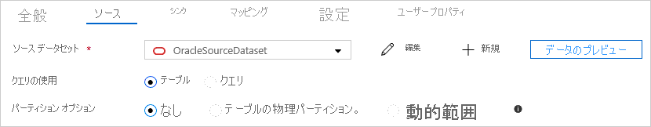

# <a name="copy-data-from-and-to-oracle-by-using-azure-data-factory"></a>Azure Data Factory を使用した Oracle をコピー元またはコピー先とするデータのコピー
> [!div class="op_single_selector" title1="使用している Data Factory サービスのバージョンを選択してください:"]
> * [Version 1](v1/data-factory-onprem-oracle-connector.md)
> * [現在のバージョン](connector-oracle.md)

この記事では、Azure Data Factory のコピー アクティビティを使用して、Oracle データベースをコピー先またはコピー元としてデータをコピーする方法について説明します。 この記事は、コピー アクティビティの概要を示している[コピー アクティビティの概要](copy-activity-overview.md)に関する記事に基づいています。

## <a name="supported-capabilities"></a>サポートされる機能

Oracle データベースから、サポートされている任意のシンク データ ストアにデータをコピーできます。 サポートされている任意のデータ ソース ストアから Oracle データベースにデータをコピーすることもできます。 コピー アクティビティによってソースまたはシンクとしてサポートされるデータ ストアの一覧については、[サポートされるデータ ストア](copy-activity-overview.md#supported-data-stores-and-formats)に関する記事の表をご覧ください。

具体的には、この Oracle コネクタでは以下がサポートされています。

- Oracle データベースの次のバージョン:
  - Oracle 12c R1 (12.1)
  - Oracle 11g R1、R2 (11.1、11.2)
  - Oracle 10g R1、R2 (10.1、10.2)
  - Oracle 9i R1、R2 (9.0.1、9.2)
  - Oracle 8i R3 (8.1.7)
- **基本**認証または **OID** 認証を使用したデータのコピー。
- Oracle ソースからの並列コピー。 詳細については、「[Oracle からの並列コピー](#parallel-copy-from-oracle)」をご覧ください。

> [!Note]
> Oracle プロキシ サーバーはサポートされていません。

## <a name="prerequisites"></a>前提条件

パブリックにアクセスできない Oracle データベースをコピー元またはコピー先としてデータをコピーするには、セルフホステッド統合ランタイムを設定する必要があります。 統合ランタイムの詳細については、「[セルフホステッド統合ランタイム](create-self-hosted-integration-runtime.md)」を参照してください。 統合ランタイムには、組み込みの Oracle ドライバーがあります。 そのため、Oracle をコピー元またはコピー先としてデータをコピーするときに、ドライバーを手動でインストールする必要はありません。

## <a name="get-started"></a>作業開始

[!INCLUDE [data-factory-v2-connector-get-started](../../includes/data-factory-v2-connector-get-started.md)]

次のセクションでは、Oracle コネクタに固有の Data Factory エンティティの定義に使用されるプロパティについて詳しく説明します。

## <a name="linked-service-properties"></a>リンクされたサービスのプロパティ

Oracle のリンクされたサービスでは、次のプロパティがサポートされます。

| プロパティ | 説明 | 必須 |
|:--- |:--- |:--- |
| type | type プロパティは **Oracle** に設定する必要があります。 | はい |
| connectionString | Oracle Database インスタンスに接続するために必要な情報を指定します。 <br/>Data Factory に安全に格納するには、このフィールドを SecureString として指定します。 パスワードを Azure Key Vault に格納して、接続文字列から `password` 構成をプルすることもできます。 詳細については、次のサンプルと「[Azure Key Vault への資格情報の格納](store-credentials-in-key-vault.md)」の記事を参照してください。 <br><br>**サポートされる接続の種類**:**Oracle SID** または **Oracle サービス名**を使用してデータベースを識別できます。<br>- SID を使用する場合: `Host=<host>;Port=<port>;Sid=<sid>;User Id=<username>;Password=<password>;`<br>- サービス名を使用する場合: `Host=<host>;Port=<port>;ServiceName=<servicename>;User Id=<username>;Password=<password>;` | はい |
| connectVia | データ ストアに接続するために使用される[統合ランタイム](concepts-integration-runtime.md)。 セルフホステッド統合ランタイムまたは Azure 統合ランタイム (データ ストアがパブリックにアクセスできる場合) を使用できます。 指定されていない場合は、既定の Azure 統合ランタイムが使用されます。 |いいえ |

>[!TIP]
>"ORA 01025:UPI パラメータの値が有効範囲外です" というエラーが発生し、Oracle がバージョン 8i である場合、`WireProtocolMode=1` を接続文字列に追加してもう一度やり直してください。

**Oracle の接続で暗号化を有効にするには**、2 つのオプションがあります。

1.  **Triple-DES Encryption (3DES) と Advanced Encryption Standard (AES)** を使用するには、Oracle サーバー側で Oracle Advanced Security (OAS) に移動し、暗号化の設定を構成します。詳しくは[こちら](https://docs.oracle.com/cd/E11882_01/network.112/e40393/asointro.htm#i1008759)をご覧ください。 ADF Oracle コネクタは暗号化方法を自動的にネゴシエートし、Oracle への接続を確立するときにユーザーが OAS で構成した方法を使用します。

2.  **SSL** を使用するには、以下の手順のようにします。

    1.  SSL 証明書の情報を取得します。 SSL 証明書の DER でエンコードされた証明書情報を取得し、出力 (----- Begin Certificate … End Certificate -----) をテキスト ファイルとして保存します。

        ```
        openssl x509 -inform DER -in [Full Path to the DER Certificate including the name of the DER Certificate] -text
        ```

        **例:** DERcert.cer から証明書情報を抽出し、出力を cert.txt に保存します

        ```
        openssl x509 -inform DER -in DERcert.cer -text
        Output:
        -----BEGIN CERTIFICATE-----
        XXXXXXXXXXXXXXXXXXXXXXXXXXXXXXXXXXXXXXXXXXXX
        XXXXXXXXXXXXXXXXXXXXXXXXXXXXXXXXXXXXXXXXXXXX
        XXXXXXXXXXXXXXXXXXXXXXXXXXXXXXXXXXXXXXXXXXXX
        XXXXXXXXXXXXXXXXXXXXXXXXXXXXXXXXXXXXXXXXXXXX
        XXXXXXXXX
        -----END CERTIFICATE-----
        ```
    
    2.  キーストアまたはトラストストアをビルドします。 次のコマンドでは、PKCS-12 形式のパスワードが含まれる、または含まれない、トラストストア ファイルが作成されます。

        ```
        openssl pkcs12 -in [Path to the file created in the previous step] -out [Path and name of TrustStore] -passout pass:[Keystore PWD] -nokeys -export
        ```

        **例:** パスワードを含む MyTrustStoreFile という名前の PKCS12 トラストストア ファイルを作成します

        ```
        openssl pkcs12 -in cert.txt -out MyTrustStoreFile -passout pass:ThePWD -nokeys -export  
        ```

    3.  トラストストア ファイルをセルフホステッド IR マシンに格納します (例: C:\MyTrustStoreFile)。
    4.  ADF で、`EncryptionMethod=1` および対応する `TrustStore`/`TrustStorePassword` 値を含む Oracle 接続文字列を構成します (例: `Host=<host>;Port=<port>;Sid=<sid>;User Id=<username>;Password=<password>;EncryptionMethod=1;TrustStore=C:\\MyTrustStoreFile;TrustStorePassword=<trust_store_password>`)。

**例:**

```json
{
    "name": "OracleLinkedService",
    "properties": {
        "type": "Oracle",
        "typeProperties": {
            "connectionString": {
                "type": "SecureString",
                "value": "Host=<host>;Port=<port>;Sid=<sid>;User Id=<username>;Password=<password>;"
            }
        },
        "connectVia": {
            "referenceName": "<name of Integration Runtime>",
            "type": "IntegrationRuntimeReference"
        }
    }
}
```

**例: パスワードを Azure Key Vault に格納する**

```json
{
    "name": "OracleLinkedService",
    "properties": {
        "type": "Oracle",
        "typeProperties": {
            "connectionString": {
                "type": "SecureString",
                "value": "Host=<host>;Port=<port>;Sid=<sid>;User Id=<username>;"
            },
            "password": { 
                "type": "AzureKeyVaultSecret", 
                "store": { 
                    "referenceName": "<Azure Key Vault linked service name>", 
                    "type": "LinkedServiceReference" 
                }, 
                "secretName": "<secretName>" 
            }
        },
        "connectVia": {
            "referenceName": "<name of Integration Runtime>",
            "type": "IntegrationRuntimeReference"
        }
    }
}
```
## <a name="dataset-properties"></a>データセットのプロパティ

データセットを定義するために使用できるセクションとプロパティの完全な一覧については、[データセット](concepts-datasets-linked-services.md)に関する記事をご覧ください。 このセクションでは、Oracle データセットでサポートされるプロパティの一覧を示します。

Oracle をコピー元またはコピー先としてデータをコピーするには、データセットの type プロパティを **OracleTable** に設定します。 次のプロパティがサポートされています。

| プロパティ | 説明 | 必須 |
|:--- |:--- |:--- |
| type | データセットの type プロパティは **OracleTable** に設定する必要があります。 | はい |
| tableName |リンクされたサービスが参照する Oracle データベースのテーブルの名前です。 | はい |

**例:**

```json
{
    "name": "OracleDataset",
    "properties":
    {
        "type": "OracleTable",
        "linkedServiceName": {
            "referenceName": "<Oracle linked service name>",
            "type": "LinkedServiceReference"
        },
        "typeProperties": {
            "tableName": "MyTable"
        }
    }
}
```

## <a name="copy-activity-properties"></a>コピー アクティビティのプロパティ

アクティビティの定義に利用できるセクションとプロパティの完全な一覧については、[パイプライン](concepts-pipelines-activities.md)に関する記事を参照してください。 このセクションでは、Oracle のソースとシンクでサポートされるプロパティの一覧を示します。

### <a name="oracle-as-a-source-type"></a>ソース タイプとしての Oracle

> [!TIP]
>
> データ パーティション分割を使用して、Oracle からデータを効率的に読み込む方法の詳細については、「[Oracle からの並列コピー](#parallel-copy-from-oracle)」をご覧ください。

Oracle からデータをコピーするは、コピー アクティビティのソースの種類を **OracleSource** に設定します。 コピー アクティビティの **source** セクションでは、次のプロパティがサポートされます。

| プロパティ | 説明 | 必須 |
|:--- |:--- |:--- |
| type | コピー アクティビティのソースの type プロパティは **OracleSource** に設定する必要があります。 | はい |
| oracleReaderQuery | カスタム SQL クエリを使用してデータを読み取ります。 例: `"SELECT * FROM MyTable"`。<br>パーティション分割された読み込みを有効にするときは、クエリで対応する組み込みパーティション パラメーターをフックする必要があります。 例については、「[Oracle からの並列コピー](#parallel-copy-from-oracle)」をご覧ください。 | いいえ |
| partitionOptions | Oracle からのデータの読み込みに使用されるデータ パーティション分割オプションを指定します。 <br>指定できる値は、**None** (既定値)、**PhysicalPartitionsOfTable**、**DynamicRange** です。<br>パーティション オプションが有効になっている ("None" ではない) 場合は、コピー アクティビティの **[`parallelCopies`](copy-activity-performance.md#parallel-copy)** 設定も構成してください (例: 4)。これにより、Oracle データベースからデータを同時に読み込むときの並列度が決定されます。 | いいえ |
| partitionSettings | データ パーティション分割の設定のグループを指定します。 <br>パーティション オプションが `None` でない場合に適用されます。 | いいえ |
| partitionNames | コピーする必要がある物理パーティションのリスト。 <br>パーティション オプションが `PhysicalPartitionsOfTable` である場合に適用されます。 クエリを使用してソース データを取得する場合は、WHERE 句で `?AdfTabularPartitionName` をフックします。 例については、「[Oracle からの並列コピー](#parallel-copy-from-oracle)」をご覧ください。 | いいえ |
| partitionColumnName | 並列コピーの範囲パーティション分割で使用される**整数型**のソース列の名前を指定します。 指定されていない場合は、テーブルの主キーが自動検出され、パーティション列として使用されます。 <br>パーティション オプションが `DynamicRange` である場合に適用されます。 クエリを使用してソース データを取得する場合は、WHERE 句で `?AdfRangePartitionColumnName` をフックします。 例については、「[Oracle からの並列コピー](#parallel-copy-from-oracle)」をご覧ください。 | いいえ |
| partitionUpperBound | データをコピーするパーティション列の最大値。 <br>パーティション オプションが `DynamicRange` である場合に適用されます。 クエリを使用してソース データを取得する場合は、WHERE 句で `?AdfRangePartitionUpbound` をフックします。 例については、「[Oracle からの並列コピー](#parallel-copy-from-oracle)」をご覧ください。 | いいえ |
| PartitionLowerBound | データをコピーするパーティション列の最小値。 <br>パーティション オプションが `DynamicRange` である場合に適用されます。 クエリを使用してソース データを取得する場合は、WHERE 句で `?AdfRangePartitionLowbound` をフックします。 例については、「[Oracle からの並列コピー](#parallel-copy-from-oracle)」をご覧ください。 | いいえ |

**例: パーティションなしで基本的なクエリを使用してデータをコピーする**

```json
"activities":[
    {
        "name": "CopyFromOracle",
        "type": "Copy",
        "inputs": [
            {
                "referenceName": "<Oracle input dataset name>",
                "type": "DatasetReference"
            }
        ],
        "outputs": [
            {
                "referenceName": "<output dataset name>",
                "type": "DatasetReference"
            }
        ],
        "typeProperties": {
            "source": {
                "type": "OracleSource",
                "oracleReaderQuery": "SELECT * FROM MyTable"
            },
            "sink": {
                "type": "<sink type>"
            }
        }
    }
]
```

その他の例については、「[Oracle からの並列コピー](#parallel-copy-from-oracle)」をご覧ください。

### <a name="oracle-as-a-sink-type"></a>シンクの種類としての Oracle

Oracle にデータをコピーするには、コピー アクティビティのシンクの種類を **OracleSink** に設定します。 コピー アクティビティの **sink** セクションでは、次のプロパティがサポートされます。

| プロパティ | 説明 | 必須 |
|:--- |:--- |:--- |
| type | コピー アクティビティのシンクの type プロパティは **OracleSink** に設定する必要があります。 | はい |
| writeBatchSize | バッファー サイズが writeBatchSize に達したときに SQL テーブルにデータを挿入します。<br/>使用可能な値: 整数 (行数)。 |いいえ (既定値は 10,000) |
| writeBatchTimeout | タイムアウトする前に一括挿入操作の完了を待つ時間です。<br/>使用可能な値: 期間。 たとえば "00:30:00" (30 分) を指定できます。 | いいえ |
| preCopyScript | コピー アクティビティの毎回の実行で、データを Oracle に書き込む前に実行する SQL クエリを指定します。 このプロパティを使用して、事前に読み込まれたデータをクリーンアップできます。 | いいえ |

**例:**

```json
"activities":[
    {
        "name": "CopyToOracle",
        "type": "Copy",
        "inputs": [
            {
                "referenceName": "<input dataset name>",
                "type": "DatasetReference"
            }
        ],
        "outputs": [
            {
                "referenceName": "<Oracle output dataset name>",
                "type": "DatasetReference"
            }
        ],
        "typeProperties": {
            "source": {
                "type": "<source type>"
            },
            "sink": {
                "type": "OracleSink"
            }
        }
    }
]
```

## <a name="parallel-copy-from-oracle"></a>Oracle からの並列コピー

データ ファクトリの Oracle コネクタは、優れたパフォーマンスで Oracle からデータを並列コピーするために、組み込みのデータ パーティション分割を提供します。 データ パーティション分割オプションは、コピー アクティビティの Oracle ソースにあります。



パーティション分割されたコピーを有効にすると、データ ファクトリによって Oracle ソースに対する並列クエリが実行され、パーティションごとにデータが読み込まれます。 並列度は、コピー アクティビティの **[`parallelCopies`](copy-activity-performance.md#parallel-copy)** 設定によって構成および制御されます。 たとえば、`parallelCopies` を 4 に設定した場合、指定したパーティション オプションと設定に基づいて 4 つのクエリが同時に生成され、実行されます。各クエリは、Oracle データベースからデータの一部を取得します。

特に、Oracle データベースから大量のデータを読み込む場合は、データ パーティション分割を使用した並列コピーを有効にすることをお勧めします。 さまざまなシナリオの推奨構成を以下に示します。

| シナリオ                                                     | 推奨設定                                           |
| ------------------------------------------------------------ | ------------------------------------------------------------ |
| 物理パーティションに分割された大きなテーブル全体から読み込む          | **パーティション オプション**: テーブルの物理パーティション。 <br><br/>実行時に、データ ファクトリによって物理パーティションが自動的に検出され、パーティションごとにデータがコピーされます。 |
| 物理パーティションがなく、データ パーティション分割用の整数列がある大きなテーブル全体から読み込む | **パーティション オプション**: 動的範囲パーティション。<br>**パーティション列**: データのパーティション分割に使用される列を指定します。 指定されていない場合は、主キー列が使用されます。 |
| カスタム クエリを使用して大量のデータを読み込む (物理パーティションがある場合) | **パーティション オプション**: テーブルの物理パーティション。<br>**クエリ**: `SELECT * FROM <TABLENAME> PARTITION("?AdfTabularPartitionName") WHERE <your_additional_where_clause>`<br>**パーティション名**: データのコピー元のパーティション名を指定します。 指定されていない場合は、Oracle データセットで指定したテーブルの物理パーティションが ADF によって自動的に検出されます。<br><br>実行時に、データ ファクトリによって `?AdfTabularPartitionName` が実際のパーティション名に置き換えられ、Oracle に送信されます。 |
| カスタム クエリを使用して大量のデータを読み込む (物理パーティションがなく、データ パーティション分割用の整数列がある場合) | **パーティション オプション**: 動的範囲パーティション。<br>**クエリ**: `SELECT * FROM <TABLENAME> WHERE ?AdfRangePartitionColumnName <= ?AdfRangePartitionUpbound AND ?AdfRangePartitionColumnName >= ?AdfRangePartitionLowbound AND <your_additional_where_clause>`<br>**パーティション列**: データのパーティション分割に使用される列を指定します。 整数データ型の列に対してパーティション分割を行うことができます。<br>**パーティションの上限**と**パーティションの下限**: パーティション列に対してフィルター処理を実行して、下限から上限までの範囲のデータのみを取得する場合に指定します。<br><br>実行時に、データ ファクトリによって `?AdfRangePartitionColumnName`、`?AdfRangePartitionUpbound`、`?AdfRangePartitionLowbound` が各パーティションの実際の列名および値の範囲に置き換えられ、Oracle に送信されます。 <br>たとえば、パーティション列 "ID" で下限が 1、上限が 80 に設定され、並列コピーが 4 に設定されている場合、ADF によって、ID の範囲が [1, 20]、[21, 40]、[41, 60]、[61, 80] の 4 つのパーティションでデータが取得されます。 |

**例: 物理パーティションを使用してクエリを実行する**

```json
"source": {
    "type": "OracleSource",
    "query": "SELECT * FROM <TABLENAME> PARTITION(\"?AdfTabularPartitionName\") WHERE <your_additional_where_clause>",
    "partitionOption": "PhysicalPartitionsOfTable",
    "partitionSettings": {
        "partitionNames": [
            "<partitionA_name>",
            "<partitionB_name>"
        ]
    }
}
```

**例: 動的範囲パーティションを使用してクエリを実行する**

```json
"source": {
    "type": "OracleSource",
    "query": "SELECT * FROM <TABLENAME> WHERE ?AdfRangePartitionColumnName <= ?AdfRangePartitionUpbound AND ?AdfRangePartitionColumnName >= ?AdfRangePartitionLowbound AND <your_additional_where_clause>",
    "partitionOption": "DynamicRange",
    "partitionSettings": {
        "partitionColumnName": "<partition_column_name>",
        "partitionUpperBound": "<upper_value_of_partition_column>",
        "partitionLowerBound": "<lower_value_of_partition_column>"
    }
}
```

## <a name="data-type-mapping-for-oracle"></a>Oracle のデータ型マッピング

Oracle をコピー元またはコピー先としてデータをコピーするとき、次の Oracle のデータ型から Data Factory の中間データ型へのマッピングが使用されます。 コピー アクティビティでソースのスキーマとデータ型がシンクにマッピングされるしくみについては、[スキーマとデータ型のマッピング](copy-activity-schema-and-type-mapping.md)に関する記事を参照してください。

| Oracle データ型 | Data Factory の中間データ型 |
|:--- |:--- |
| BFILE |Byte[] |
| BLOB |Byte[]<br/>(Oracle 10g 以上でのみサポート) |
| CHAR |string |
| CLOB |string |
| DATE |DateTime |
| FLOAT |Decimal、String (有効桁数が 28 を超える場合) |
| INTEGER |Decimal、String (有効桁数が 28 を超える場合) |
| LONG |string |
| LONG RAW |Byte[] |
| NCHAR |string |
| NCLOB |string |
| NUMBER |Decimal、String (有効桁数が 28 を超える場合) |
| NVARCHAR2 |string |
| RAW |Byte[] |
| ROWID |string |
| TIMESTAMP |DateTime |
| TIMESTAMP WITH LOCAL TIME ZONE |string |
| TIMESTAMP WITH TIME ZONE |string |
| 符号なし INTEGER |NUMBER |
| VARCHAR2 |string |
| XML |string |

> [!NOTE]
> INTERVAL YEAR TO MONTH データ型と INTERVAL DAY TO SECOND データ型はサポートされません。


## <a name="next-steps"></a>次の手順
Data Factory のコピー アクティビティによってソースおよびシンクとしてサポートされるデータ ストアの一覧については、[サポートされるデータ ストア](copy-activity-overview.md##supported-data-stores-and-formats)の表をご覧ください。
