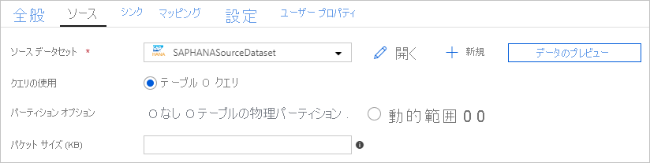

# <a name="copy-data-from-sap-hana-using-azure-data-factory"></a>Azure Data Factory を使用して SAP HANA からデータをコピーする
> [!div class="op_single_selector" title1="使用している Data Factory サービスのバージョンを選択してください:"]
> * [Version 1](v1/data-factory-sap-hana-connector.md)
> * [現在のバージョン](connector-sap-hana.md)

この記事では、Azure Data Factory のコピー アクティビティを使用して、SAP HANA データベースからデータをコピーする方法について説明します。 この記事は、コピー アクティビティの概要を示している[コピー アクティビティの概要](copy-activity-overview.md)に関する記事に基づいています。

>[!TIP]
>SAP データ統合シナリオにおける ADF の全体的なサポートについては、[「Azure Data Factory を使用した SAP データの統合」ホワイトペーパー](https://github.com/Azure/Azure-DataFactory/blob/master/whitepaper/SAP%20Data%20Integration%20using%20Azure%20Data%20Factory.pdf)の詳細手順、比較、およびガイダンスを参照してください。

## <a name="supported-capabilities"></a>サポートされる機能

この SAP HANA コネクタは、次のアクティビティでサポートされます。

- [サポートされるソース/シンク マトリックス](copy-activity-overview.md)での[コピー アクティビティ](copy-activity-overview.md)
- [Lookup アクティビティ](control-flow-lookup-activity.md)

SAP HANA データベースから、サポートされている任意のシンク データ ストアにデータをコピーできます。 コピー アクティビティによってソースまたはシンクとしてサポートされるデータ ストアの一覧については、[サポートされるデータ ストア](copy-activity-overview.md#supported-data-stores-and-formats)の表をご覧ください。

具体的には、この SAP HANA コネクタは以下をサポートします。

- SAP HANA データベースの任意のバージョンからのデータのコピー。
- **HANA 情報モデル** (分析ビューや計算ビューなど) および**行/列のテーブル**からのデータのコピー。
- **基本**または **Windows** 認証を使用したデータのコピー。
- SAP HANA ソースからの並列コピー。 詳細については、「[SAP HANA からの並列コピー](#parallel-copy-from-sap-hana)」セクションを参照してください。

> [!TIP]
> データを SAP HANA データ ストア**に**コピーするには、汎用 ODBC コネクタを使用します。 詳細については、「[SAP HANA シンク](connector-odbc.md#sap-hana-sink)」を参照してください。 SAP HANA コネクタと ODBC コネクタ用のリンクされたサービスは種類が異なるため、再利用することはできないことに注意してください。

## <a name="prerequisites"></a>前提条件

この SAP HANA コネクタを使用するには、次の手順が必要です。

- セルフホステッド統合ランタイムをセットアップする。 詳細については、[セルフホステッド統合ランタイム](create-self-hosted-integration-runtime.md)に関する記事をご覧ください。
- SAP HANA ODBC ドライバーを統合ランタイム コンピューターにインストールします。 SAP HANA ODBC ドライバーは [SAP ソフトウェアのダウンロード センター](https://support.sap.com/swdc)からダウンロードできます。 "**SAP HANA CLIENT for Windows**" というキーワードで検索してください。

## <a name="getting-started"></a>作業の開始

[!INCLUDE [data-factory-v2-connector-get-started](../../includes/data-factory-v2-connector-get-started.md)]

次のセクションでは、SAP HANA コネクタに固有の Data Factory エンティティの定義に使用されるプロパティについて詳しく説明します。

## <a name="linked-service-properties"></a>リンクされたサービスのプロパティ

SAP HANA のリンクされたサービスでは、次のプロパティがサポートされます。

| プロパティ | 説明 | Required |
|:--- |:--- |:--- |
| type | type プロパティは、次のように設定する必要があります:**SapHana** | はい |
| connectionString | **基本認証**または **Windows 認証**のいずれかを使用して SAP HANA に接続するために必要な情報を指定します。 以下のサンプルを参照してください。<br>接続文字列には、サーバー/ポートが必要です (既定のポートは 30015)。基本認証を使用する場合は、ユーザー名とパスワードが必要です。 詳細設定については、[SAP HANA ODBC の接続プロパティ](<https://help.sap.com/viewer/0eec0d68141541d1b07893a39944924e/2.0.02/en-US/7cab593774474f2f8db335710b2f5c50.html>)に関する記事を参照してください。<br/>パスワードを Azure Key Vault に格納し、接続文字列からパスワード構成を引き出すこともできます。 詳細については、「[Azure Key Vault への資格情報の格納](store-credentials-in-key-vault.md)」の記事を参照してください。 | はい |
| userName | Windows 認証を使用する場合は、ユーザー名を指定します。 例: `user@domain.com` | いいえ |
| パスワード | ユーザー アカウントのパスワードを指定します。 このフィールドを SecureString としてマークして Data Factory に安全に保管するか、[Azure Key Vault に格納されているシークレットを参照](store-credentials-in-key-vault.md)します。 | いいえ |
| connectVia | データ ストアに接続するために使用される[統合ランタイム](concepts-integration-runtime.md)。 「[前提条件](#prerequisites)」に記されているように、セルフホステッド統合ランタイムが必要です。 |はい |

**例: 基本認証を使用する**

```json
{
    "name": "SapHanaLinkedService",
    "properties": {
        "type": "SapHana",
        "typeProperties": {
            "connectionString": "SERVERNODE=<server>:<port (optional)>;UID=<userName>;PWD=<Password>"
        },
        "connectVia": {
            "referenceName": "<name of Integration Runtime>",
            "type": "IntegrationRuntimeReference"
        }
    }
}
```

**例: Windows 認証を使用する**

```json
{
    "name": "SapHanaLinkedService",
    "properties": {
        "type": "SapHana",
        "typeProperties": {
            "connectionString": "SERVERNODE=<server>:<port (optional)>;",
            "userName": "<username>", 
            "password": { 
                "type": "SecureString", 
                "value": "<password>" 
            } 
        },
        "connectVia": {
            "referenceName": "<name of Integration Runtime>",
            "type": "IntegrationRuntimeReference"
        }
    }
}
```

以下のペイロードで SAP HANA のリンクされたサービスを使用していた場合、現状のまま引き続きサポートされますが、今後は新しいものを使用することをお勧めします。

**例:**

```json
{
    "name": "SapHanaLinkedService",
    "properties": {
        "type": "SapHana",
        "typeProperties": {
            "server": "<server>:<port (optional)>",
            "authenticationType": "Basic",
            "userName": "<username>",
            "password": {
                "type": "SecureString",
                "value": "<password>"
            }
        },
        "connectVia": {
            "referenceName": "<name of Integration Runtime>",
            "type": "IntegrationRuntimeReference"
        }
    }
}
```

## <a name="dataset-properties"></a>データセットのプロパティ

データセットを定義するために使用できるセクションとプロパティの完全な一覧については、[データセット](concepts-datasets-linked-services.md)に関する記事をご覧ください。 このセクションでは、SAP HANA データセット でサポートされるプロパティの一覧を示します。

SAP HANA からのデータ コピーについては、次のプロパティがサポートされています。

| プロパティ | 説明 | Required |
|:--- |:--- |:--- |
| type | データセットの type プロパティは、次のように設定する必要があります:**SapHanaTable** | はい |
| schema | SAP HANA データベース内のスキーマの名前。 | いいえ (アクティビティ ソースの "query" が指定されている場合) |
| table | SAP HANA データベース内のテーブルの名前。 | いいえ (アクティビティ ソースの "query" が指定されている場合) |

**例:**

```json
{
    "name": "SAPHANADataset",
    "properties": {
        "type": "SapHanaTable",
        "typeProperties": {
            "schema": "<schema name>",
            "table": "<table name>"
        },
        "schema": [],
        "linkedServiceName": {
            "referenceName": "<SAP HANA linked service name>",
            "type": "LinkedServiceReference"
        }
    }
}
```

`RelationalTable` 型のデータセットを使用していた場合、現状のまま引き続きサポートされますが、今後は新しいものを使用することをお勧めします。

## <a name="copy-activity-properties"></a>コピー アクティビティのプロパティ

アクティビティの定義に利用できるセクションとプロパティの完全な一覧については、[パイプライン](concepts-pipelines-activities.md)に関する記事を参照してください。 このセクションでは、SAP HANA ソースでサポートされるプロパティの一覧を示します。

### <a name="sap-hana-as-source"></a>ソースとしての SAP HANA

>[!TIP]
>データのパーティション分割を使用して SAP HANA からデータを効率的に取り込むには、「[SAP HANA からの並列コピー](#parallel-copy-from-sap-hana)」セクションを参照してください。

SAP HANA からデータをコピーするために、コピー アクティビティの **source** セクションでは次のプロパティがサポートされています。

| プロパティ | 説明 | Required |
|:--- |:--- |:--- |
| type | コピー アクティビティのソースの type プロパティは、次のように設定する必要があります:**SapHanaSource** | はい |
| query | SAP HANA インスタンスからデータを読み取る SQL クエリを指定します。 | はい |
| partitionOptions | SAP HANA からのデータの取り込みに使用されるデータ パーティション分割オプションを指定します。 詳細については、「[SAP HANA からの並列コピー](#parallel-copy-from-sap-hana)」セクションを参照してください。<br>指定できる値は、 **None**  (既定値)、 **PhysicalPartitionsOfTable**、**SapHanaDynamicRange** です。 詳細については、「[SAP HANA からの並列コピー](#parallel-copy-from-sap-hana)」セクションを参照してください。 `PhysicalPartitionsOfTable` は、クエリではなく、テーブルからデータをコピーする場合にのみ使用できます。 <br>パーティション オプションが有効になっている (つまり、`None` ではない) 場合、SAP HANA から同時にデータを読み込む並列処理の次数は、コピー アクティビティの [`parallelCopies`](copy-activity-performance.md#parallel-copy) の設定によって制御されます。 | False |
| partitionSettings | データ パーティション分割の設定のグループを指定します。<br>パーティション オプションが `SapHanaDynamicRange` である場合に適用されます。 | False |
| partitionColumnName | 並列コピーのパーティションによって使用されるソース列の名前を指定します。 指定されない場合は、テーブルのインデックスまたは主キーが自動検出され、パーティション列として使用されます。<br>パーティション オプションが  `SapHanaDynamicRange` である場合に適用されます。 クエリを使用してソース データを取得する場合は、WHERE 句で  `?AdfHanaDynamicRangePartitionCondition` をフックします。 「[SAP HANA からの並列コピー](#parallel-copy-from-sap-hana)」セクションにある例を参照してください。 | はい (`SapHanaDynamicRange` パーティションを使用する場合)。 |
| packetSize | データを複数のブロックに分割するためのネットワーク パケット サイズ (KB 単位) を指定します。 大量のデータをコピーする場合、パケット サイズを大きくすると、ほとんどの場合、SAP HANA からの読み取り速度が向上する可能性があります。 パケット サイズを調整する場合は、パフォーマンス テストを行うことをお勧めします。 | いいえ。<br>既定値は 2,048 (2 MB)です。 |

**例:**

```json
"activities":[
    {
        "name": "CopyFromSAPHANA",
        "type": "Copy",
        "inputs": [
            {
                "referenceName": "<SAP HANA input dataset name>",
                "type": "DatasetReference"
            }
        ],
        "outputs": [
            {
                "referenceName": "<output dataset name>",
                "type": "DatasetReference"
            }
        ],
        "typeProperties": {
            "source": {
                "type": "SapHanaSource",
                "query": "<SQL query for SAP HANA>"
            },
            "sink": {
                "type": "<sink type>"
            }
        }
    }
]
```

`RelationalSource` 型のコピー ソースを使用していた場合、現状のまま引き続きサポートされますが、今後は新しいものを使用することをお勧めします。

## <a name="parallel-copy-from-sap-hana"></a>SAP HANA からの並列コピー

Data Factory の SAP HANA コネクタは、SAP HANA からデータを並列でコピーするために、組み込みのデータ パーティション分割を提供します。 データ パーティション分割オプションは、コピー アクティビティの **[ソース]** テーブルにあります。



パーティション分割されたコピーを有効にすると、Data Factory によって SAP HANA ソースに対する並列クエリが実行され、パーティションごとにデータが取得されます。 並列度は、コピー アクティビティの [`parallelCopies`](copy-activity-performance.md#parallel-copy) 設定によって制御されます。 たとえば、`parallelCopies` を 4 に設定した場合、Data Factory では、指定したパーティション オプションと設定に基づいて 4 つのクエリが同時に生成され、実行されます。各クエリでは、SAP HANA からデータの一部を取得します。

特に、SAP HANA から大量のデータを取り込む場合は、データのパーティション分割を使用した並列コピーを有効にすることをお勧めします。 さまざまなシナリオの推奨構成を以下に示します。 ファイルベースのデータ ストアにデータをコピーする場合は、複数のファイルとしてフォルダーに書き込む (フォルダー名のみを指定する) ことをお勧めします。この場合、1 つのファイルに書き込むよりもパフォーマンスが優れています。

| シナリオ                                           | 推奨設定                                           |
| -------------------------------------------------- | ------------------------------------------------------------ |
| 大きなテーブル全体を読み込む。                        | **パーティション オプション**: テーブルの物理パーティション。 <br><br/>実行時に、Data Factory によって、指定された SAP HANA テーブルの物理パーティションの種類が自動的に検出され、対応するパーティション戦略が選択されます。<br>- **範囲パーティション分割**:テーブルに対して定義されているパーティション列とパーティション範囲を取得し、そのデータを範囲別にコピーします。 <br>- **ハッシュ パーティション分割**:ハッシュ パーティション キーをパーティション列として使用して、ADF によって計算された範囲に基づいてデータをパーティション分割してコピーします。 <br>- **ラウンドロビン パーティション分割**または**パーティションなし**:主キーをパーティション列として使用して、ADF によって計算された範囲に基づいてデータをパーティション分割してコピーします。 |
| カスタム クエリを使用して大量のデータを読み込む。 | **パーティション オプション**: 動的範囲パーティション。<br>**クエリ**: `SELECT * FROM <TABLENAME> WHERE ?AdfHanaDynamicRangePartitionCondition AND <your_additional_where_clause>`<br>**パーティション列**: 動的な範囲パーティションを適用するために、使用する列を指定します。 <br><br>実行時に、Data Factory ではまず、指定されたパーティション列の値の範囲を計算します。これにより、個別のパーティション列の値の数と ADF 並列コピー設定に従って、複数のバケットに行が均等に分散されます。次に、`?AdfHanaDynamicRangePartitionCondition` が、パーティションごとのパーティション列値の範囲のフィルター処理に置き換えられて、SAP HANA に送信されます。<br><br>複数の列をパーティション列として使用する場合は、`SELECT * FROM (SELECT *, CONCAT(<KeyColumn1>, <KeyColumn2>) AS PARTITIONCOLUMN FROM <TABLENAME>) WHERE ?AdfHanaDynamicRangePartitionCondition` のように、各列の値をクエリ内で 1 つの列として連結して、ADF でのパーティション列として指定できます。 |

**例: テーブルの物理パーティションを使用してクエリを実行する**

```json
"source": {
    "type": "SapHanaSource",
    "partitionOption": "PhysicalPartitionsOfTable"
}
```

**例: 動的範囲パーティションを使用してクエリを実行する**

```json
"source": {
    "type": "SapHanaSource",
    "query": "SELECT * FROM <TABLENAME> WHERE ?AdfHanaDynamicRangePartitionCondition AND <your_additional_where_clause>",
    "partitionOption": "SapHanaDynamicRange",
    "partitionSettings": {
        "partitionColumnName": "<Partition_column_name>"
    }
}
```

## <a name="data-type-mapping-for-sap-hana"></a>SAP HANA のデータ型マッピング

SAP HANA からデータをコピーするとき、次の SAP HANAのデータ型から Azure Data Factory の中間データ型へのマッピングが使用されます。 コピー アクティビティでソースのスキーマとデータ型がシンクにマッピングされるしくみについては、[スキーマとデータ型のマッピング](copy-activity-schema-and-type-mapping.md)に関する記事を参照してください。

| SAP HANA のデータ型 | Data Factory の中間データ型 |
| ------------------ | ------------------------------ |
| ALPHANUM           | String                         |
| bigint             | Int64                          |
| BINARY             | Byte[]                         |
| BINTEXT            | String                         |
| BLOB               | Byte[]                         |
| BOOL               | Byte                           |
| CLOB               | String                         |
| DATE               | DateTime                       |
| DECIMAL            | Decimal                        |
| DOUBLE             | Double                         |
| FLOAT              | Double                         |
| INTEGER            | Int32                          |
| NCLOB              | String                         |
| NVARCHAR           | String                         |
| real               | Single                         |
| SECONDDATE         | DateTime                       |
| SHORTTEXT          | String                         |
| SMALLDECIMAL       | Decimal                        |
| SMALLINT           | Int16                          |
| STGEOMETRYTYPE     | Byte[]                         |
| STPOINTTYPE        | Byte[]                         |
| [TEXT]               | String                         |
| TIME               | TimeSpan                       |
| TINYINT            | Byte                           |
| VARCHAR            | String                         |
| timestamp          | DateTime                       |
| VARBINARY          | Byte[]                         |

## <a name="lookup-activity-properties"></a>Lookup アクティビティのプロパティ

プロパティの詳細については、[Lookup アクティビティ](control-flow-lookup-activity.md)に関するページを参照してください。

## <a name="next-steps"></a>次のステップ
Azure Data Factory のコピー アクティビティによってソースおよびシンクとしてサポートされるデータ ストアの一覧については、[サポートされるデータ ストア](copy-activity-overview.md#supported-data-stores-and-formats)の表をご覧ください。
