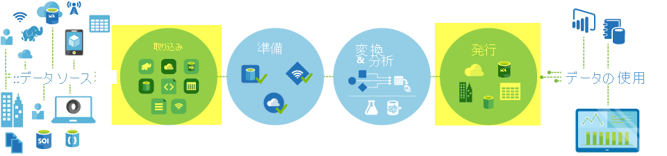

# <a name="copy-activity-in-azure-data-factory"></a>Azure Data Factory のコピー アクティビティ

## <a name="overview"></a>概要

> [!div class="op_single_selector" title1="Select the version of Data Factory service you are using:"]
> * [Version 1](v1/data-factory-data-movement-activities.md)
> * [現在のバージョン](copy-activity-overview.md)

Azure Data Factory では、コピー アクティビティを使用して、オンプレミスにあるデータ ストアやクラウド内のデータ ストアの間でデータをコピーできます。 コピーされたデータをさらに変換して分析することができます。 また、コピー アクティビティを使用して、変換や分析の結果を発行し、ビジネス インテリジェンス (BI) やアプリケーションで使用することもできます。



コピー アクティビティは、[統合ランタイム](concepts-integration-runtime.md)で実行されます。 異なるデータ コピーのシナリオでは、別の種類の統合ランタイムを利用できます。

* どちらもパブリックにアクセス可能なデータ ストア間でデータをコピーする場合は、セキュリティ保護され、信頼性が高く、スケーラブルで、かつ[グローバルに使用可能な](concepts-integration-runtime.md#integration-runtime-location) **Azure 統合ランタイム**でコピー アクティビティを機能強化できます。
* オンプレミスにあるデータ ストアや、アクセス制御が設定されたネットワーク (Azure Virtual Network など) 内のデータ ストアの間でデータをコピーする場合は、データ コピーを機能強化するために**自己ホスト型統合ランタイム**を設定する必要があります。

統合ランタイムを各ソースおよびシンク データ ストアに関連付ける必要があります。 コピー アクティビティが、[使用する IR を決定する](concepts-integration-runtime.md#determining-which-ir-to-use)方法について詳細を学習してください。

コピー アクティビティは、次の各段階を通して、ソースからシンクにデータをコピーします。 コピー アクティビティを実行するサービスが行う処理を次に示します。

1. ソース データ ストアからデータを読み取る。
2. シリアル化/逆シリアル化、圧縮/圧縮解除、列マッピングなどを実行する。この操作は、入力データセット、出力データセット、およびコピー アクティビティの構成に基づいて実行されます。
3. シンク/宛先データ ストアにデータを書き込む。


## <a name="supported-data-stores-and-formats"></a>サポートされるデータ ストアと形式

[!INCLUDE [data-factory-v2-supported-data-stores](../../includes/data-factory-v2-supported-data-stores.md)]

### <a name="supported-file-formats"></a>サポートされるファイル形式

コピー アクティビティを使用すると、ファイル ベースの 2 つのデータ ストア間で**ファイルをそのままコピー**できます。その場合、データはシリアル化/逆シリアル化なしで効率的にコピーされます。

コピー アクティビティではまた、指定された形式 (**テキスト、JSON、Avro、ORC、および Parquet**) のファイルの読み取りと書き込みもサポートされ、圧縮コーデック **GZip、Deflate、BZip2、および ZipDeflate** がサポートされています。 詳細については、「[サポートされているファイル形式と圧縮形式](supported-file-formats-and-compression-codecs.md)」を参照してください。

たとえば、次のようなコピー アクティビティを実行できます。

* オンプレミスの SQL Server のデータをコピーし、Azure Data Lake Store に ORC 形式で書き込む。
* オンプレミスのファイル システムからテキスト (CSV) 形式でファイルをコピーし、Azure BLOB に Avro 形式で書き込む。
* オンプレミスのファイルシステムから zip ファイルをコピーし、圧縮を解除したうえで Azure Data Lake Store 書き込む。
* Azure BLOB から GZip 圧縮テキスト (CSV) 形式でデータをコピーし、Azure SQL Database に書き込む。

## <a name="supported-regions"></a>サポートされているリージョン

コピー アクティビティを実行するサービスは、「[統合ランタイムの場所](concepts-integration-runtime.md#integration-runtime-location)」に記載されているリージョンと場所でグローバルに使うことができます。 グローバルに使用できるトポロジでは効率的なデータ移動が保証されます。このデータ移動では、通常、リージョンをまたがるホップが回避されます。 特定のリージョンにおける Data Factory とデータ移動の提供状況については、[リージョン別のサービス](https://azure.microsoft.com/regions/#services)に関するページをご覧ください。

## <a name="configuration"></a>構成

Azure Data Factory のコピー アクティビティを使用するには、次のことを行う必要があります。

1. **ソース データ ストアとシンク データ ストアのリンクされたサービスを作成します。** 構成方法およびサポートされるプロパティについては、コネクタの記事の「リンクされたサービスのプロパティ」セクションを参照してください。 サポートされるコネクタの一覧は、「[サポートされるデータ ストアと形式](#supported-data-stores-and-formats)」セクションで見つけることができます。
2. **ソースとシンクのデータセットを作成します。** 構成方法およびサポートされるプロパティについては、ソースおよびシンク コネクタの記事の「データセットのプロパティ」セクションを参照してください。
3. **コピー アクティビティを含むパイプラインを作成します。** 次のセクションでは、例を示します。  

### <a name="syntax"></a>構文

次のコピー アクティビティのテンプレートは、サポートされるすべてのプロパティの一覧を示しています。 実際のシナリオに適したものを指定してください。

```json
"activities":[
    {
        "name": "CopyActivityTemplate",
        "type": "Copy",
        "inputs": [
            {
                "referenceName": "<source dataset name>",
                "type": "DatasetReference"
            }
        ],
        "outputs": [
            {
                "referenceName": "<sink dataset name>",
                "type": "DatasetReference"
            }
        ],
        "typeProperties": {
            "source": {
                "type": "<source type>",
                <properties>
            },
            "sink": {
                "type": "<sink type>"
                <properties>
            },
            "translator":
            {
                "type": "TabularTranslator",
                "columnMappings": "<column mapping>"
            },
            "dataIntegrationUnits": <number>,
            "parallelCopies": <number>,
            "enableStaging": true/false,
            "stagingSettings": {
                <properties>
            },
            "enableSkipIncompatibleRow": true/false,
            "redirectIncompatibleRowSettings": {
                <properties>
            }
        }
    }
]
```

### <a name="syntax-details"></a>構文の詳細

| プロパティ | 説明 | 必須 |
|:--- |:--- |:--- |
| type | コピー アクティビティの type プロパティは、**Copy** に設定する必要があります。 | [はい] |
| inputs | ソース データを指す、前に作成したデータセットを指定します。 コピー アクティビティは、1 つの入力のみをサポートします。 | [はい] |
| outputs | シンク データを指す、前に作成したデータセットを指定します。 コピー アクティビティは、1 つの出力のみをサポートします。 | [はい] |
| typeProperties | コピー アクティビティを構成するためのプロパティのグループ。 | [はい] |
| source | コピー ソースの型と、データを取得する方法に関する対応するプロパティを指定します。<br/><br/>「[サポートされるデータ ストアと形式](#supported-data-stores-and-formats)」に一覧表示されているコネクタの記事にある「コピー アクティビティのプロパティ」セクションで詳細を学習してください。 | [はい] |
| sink | コピー シンクの型と、データを書き込む方法に関する対応するプロパティを指定します。<br/><br/>「[サポートされるデータ ストアと形式](#supported-data-stores-and-formats)」に一覧表示されているコネクタの記事にある「コピー アクティビティのプロパティ」セクションで詳細を学習してください。 | [はい] |
| translator | ソースからシンクへの明示的な列マッピングを指定します。 既定のコピー動作が要求を満足できない場合に適用されます。<br/><br/>「[スキーマとデータ型のマッピング](copy-activity-schema-and-type-mapping.md)」で詳細を学習してください。 | いいえ  |
| dataIntegrationUnits | データ コピーを機能強化するために、[Azure 統合ランタイム](concepts-integration-runtime.md)の強力な機能を指定します。 以前はクラウド データ移動単位 (DMU) と呼ばれていました。 <br/><br/>詳しくは、[データ統合単位](copy-activity-performance.md#data-integration-units)に関するページをご覧ください。 | いいえ  |
| parallelCopies | ソースからのデータの読み取り時やシンクへのデータの書き込み時にコピー アクティビティで使用する並列処理を指定します。<br/><br/>「[並列コピー](copy-activity-performance.md#parallel-copy)」で詳細を学習してください。 | いいえ  |
| enableStaging<br/>stagingSettings | ソースからシンクに直接データをコピーするのではなく、中間データを BLOB ストレージにステージングすることを選択します。<br/><br/>役立つシナリオや構成の詳細を「[ステージング コピー](copy-activity-performance.md#staged-copy)」で学習してください。 | いいえ  |
| enableSkipIncompatibleRow<br/>redirectIncompatibleRowSettings| ソースからシンクにデータをコピーするときに互換性のない行を処理する方法を選択します。<br/><br/>「[フォールト トレランス](copy-activity-fault-tolerance.md)」で詳細を学習してください。 | いいえ  |

## <a name="monitoring"></a>監視

Azure Data Factory の [Author & Monitor]\(作成者と監視\) という UI またはプログラムで、コピー アクティビティの実行を監視できます。 その後、お客様のシナリオのパフォーマンスと構成を、社内テストから得られたコピー アクティビティの[パフォーマンス リファレンス](copy-activity-performance.md#performance-reference)と比較できます。

### <a name="monitor-visually"></a>視覚的な監視

コピー アクティビティの実行を視覚的に監視するには、お使いのデータ ファクトリ -> **[Author & Monitor]\(作成者と監視\)** -> **[監視] タブ** の順に移動して、**[アクション]** 列にある [View Activity Runs]\(アクティビティ実行の表示\) リンクを使ってパイプライン実行の一覧を表示します。 


クリックして、このパイプライン実行のアクティビティ一覧を表示する **[アクション]** 列に、コピー アクティビティの入力、出力、エラー (コピー アクティビティの実行に失敗した場合) へのリンクと詳細が表示されます。


**[アクション]** にある **[詳細]** リンクをクリックして、コピー アクティビティ実行の詳細とパフォーマンス特性を確認します。 source から sink にコピーされた volume/rows/files のデータ、スループット、対応する期間に処理されるステップ、お使いのコピー シナリオで使用される構成などの情報が表示されます。

**例: Amazon S3 から Azure Data Lake Store へコピーする**


**例: ステージング コピーを使用して Azure SQL Database から Azure SQL Data Warehouse にコピーする**


### <a name="monitor-programmatically"></a>プログラムで監視する

コピー アクティビティの実行の詳細とパフォーマンス特性は、コピー アクティビティの実行結果の [出力] セクションでも返されます。 以下は包括的な一覧です。コピー シナリオに該当するものだけを示しています。 アクティビティの実行を監視する方法は、[クイック スタートの監視セクション](quickstart-create-data-factory-dot-net.md#monitor-a-pipeline-run)で学習してください。

| プロパティ名  | 説明 | 単位 |
|:--- |:--- |:--- |
| dataRead | ソースから読み取られたデータ サイズ | Int64 値 **(バイト数)** |
| dataWritten | シンクに書き込まれたデータ サイズ | Int64 値 **(バイト数)** |
| filesRead | ファイル ストレージからデータをコピーするときに、コピーされるファイルの数。 | Int64 値 (単位なし) |
| filesWritten | ファイル ストレージにデータをコピーするときに、コピーされるファイルの数。 | Int64 値 (単位なし) |
| rowsCopied | コピーされた行数 (バイナリ コピーには適用されません)。 | Int64 値 (単位なし) |
| rowsSkipped | スキップされた互換性のない行の数。 この機能は、"enableSkipIncompatibleRow" を true に設定することによって有効にできます。 | Int64 値 (単位なし) |
| throughput | データが転送された速度 | 浮動小数点数 **(KB/秒)** |
| copyDuration | コピーの持続期間 | Int32 値 (秒数) |
| sqlDwPolyBase | SQL Data Warehouse にデータをコピーするときに PolyBase が使用される場合。 | ブール |
| redshiftUnload | Redshift からデータをコピーするときに UNLOAD が使用される場合。 | ブール |
| hdfsDistcp | HDFS からデータをコピーするときに DistCp が使用される場合。 | ブール |
| effectiveIntegrationRuntime | アクティビティの実行を機能強化するために、どの統合ランタイムが使用されるかを `<IR name> (<region if it's Azure IR>)` の形式で示します。 | Text (文字列) |
| usedDataIntegrationUnits | コピーの間に有効なデータ統合単位。 | Int32 値 |
| usedParallelCopies | コピー中の効率的な parallelCopies。 | Int32 値|
| redirectRowPath | "redirectIncompatibleRowSettings" で構成した、BLOB ストレージ内のスキップされた互換性のない行のログのパス。 下の例を参照してください。 | Text (文字列) |
| executionDetails | コピー アクティビティが処理される際の段階の詳細、対応するステップ、期間、使用される構成など。このセクションは変更される場合があるため、解析はお勧めしません。 | Array |

```json
"output": {
    "dataRead": 107280845500,
    "dataWritten": 107280845500,
    "filesRead": 10,
    "filesWritten": 10,
    "copyDuration": 224,
    "throughput": 467707.344,
    "errors": [],
    "effectiveIntegrationRuntime": "DefaultIntegrationRuntime (East US 2)",
    "usedDataIntegrationUnits": 32,
    "usedParallelCopies": 8,
    "executionDetails": [
        {
            "source": {
                "type": "AmazonS3"
            },
            "sink": {
                "type": "AzureDataLakeStore"
            },
            "status": "Succeeded",
            "start": "2018-01-17T15:13:00.3515165Z",
            "duration": 221,
            "usedDataIntegrationUnits": 32,
            "usedParallelCopies": 8,
            "detailedDurations": {
                "queuingDuration": 2,
                "transferDuration": 219
            }
        }
    ]
}
```

## <a name="schema-and-data-type-mapping"></a>スキーマとデータ型のマッピング

コピー アクティビティがソース データをシンクにマッピングする方法について説明している「[スキーマとデータ型のマッピング](copy-activity-schema-and-type-mapping.md)」を参照してください。

## <a name="fault-tolerance"></a>フォールト トレランス

既定では、コピー アクティビティはソースとシンクの間に互換性のないデータを検出した場合、データのコピーを停止して失敗を返します。 そのコピーを成功させるために、互換性のない行をスキップしてログに記録し、互換性があるデータのみをコピーするように明示的に構成できます。 詳細については、「[Copy Activity fault tolerance](copy-activity-fault-tolerance.md)」 (コピー アクティビティのフォールト トレランス) を参照してください。

## <a name="performance-and-tuning"></a>パフォーマンスとチューニング

Azure Data Factory でのデータ移動 (コピー アクティビティ) のパフォーマンスに影響する主な要因については、「 [コピー アクティビティのパフォーマンスとチューニングに関するガイド](copy-activity-performance.md)」をご覧ください。 このガイドでは、内部テスト実行時の実際のパフォーマンスを一覧表示すると共に、コピー アクティビティのパフォーマンスを最適化するさまざまな方法についても説明します。

## <a name="incremental-copy"></a>増分コピー 
Data Factory では、ソース データ ストアからコピー先データ ストアに差分データを増分コピーするシナリオをサポートしています。 [データの増分コピーに関するチュートリアル](tutorial-incremental-copy-overview.md)を参照してください。 

## <a name="read-and-write-partitioned-data"></a>パーティション分割されたデータの読み取りおよび書き込み
Azure Data Factory のバージョン 1 では、パーティション分割されたデータの読み取りと書き込みを SliceStart/SliceEnd/WindowStart/WindowEnd システム変数を使用してサポートしていました。 現在のバージョンでは、パイプライン パラメーターと、そのパラメーターの値としてのトリガーの開始時刻/スケジュールされた時刻を使用してこの動作を実現できます。 詳しくは、[パーティション分割されたデータの読み取りまたは書き込みを行う方法](how-to-read-write-partitioned-data.md)に関するページをご覧ください。

## <a name="next-steps"></a>次の手順
次のクイック スタート、チュートリアル、およびサンプルを参照してください。

- [Copy data from one location to another location in the same Azure Blob Storage (同じ Azure Blob Storage 内のある場所から別の場所にデータをコピーする)](quickstart-create-data-factory-dot-net.md)
- [Copy data from Azure Blob Storage to Azure SQL Database (Azure Blob Storage から Azure SQL Database にデータをコピーする)](tutorial-copy-data-dot-net.md)
- [Copy data from on-premises SQL Server to Azure (オンプレミスの SQL Server から Azure にデータをコピーする)](tutorial-hybrid-copy-powershell.md)
