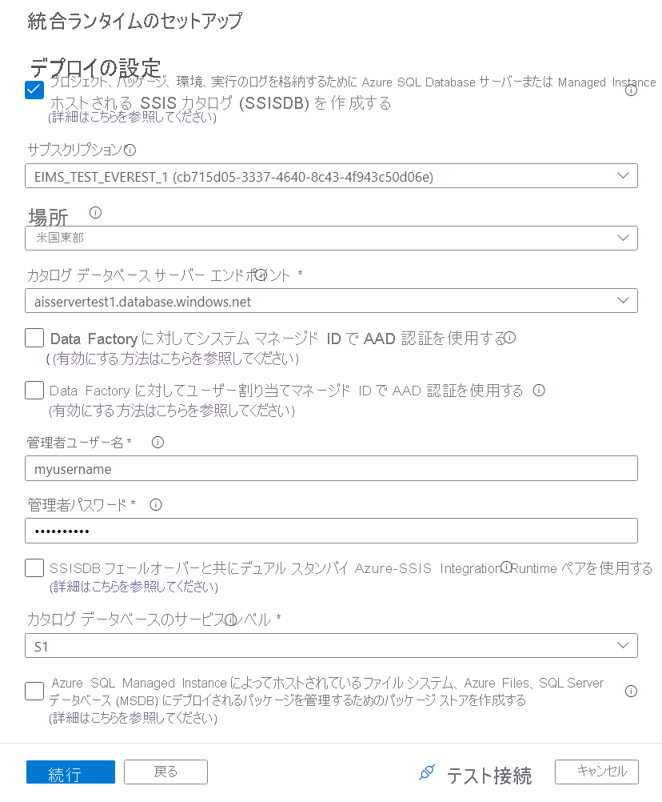

# <a name="create-an-azure-ssis-integration-runtime-in-azure-data-factory"></a>Azure Data Factory で Azure-SSIS 統合ランタイムを作成する

[!INCLUDE[appliesto-adf-xxx-md](includes/appliesto-adf-xxx-md.md)]

この記事では、Azure-SQL Server Integration Services (SSIS) 統合ランタイム (IR) を Azure Data Factory (ADF) でプロビジョニングする手順について説明します。 Azure-SSIS IR では、次のことがサポートされます。

- Azure SQL Database サーバーまたは Managed Instance をホストとする SSIS カタログ (SSISDB) にデプロイされたパッケージを実行する (プロジェクト デプロイ モデル)
- Azure SQL Managed Instance にホストされた SQL Server データベース (MSDB)、Azure Files、ファイル システムのいずれかにデプロイされたパッケージを実行する (パッケージ デプロイ モデル)

Azure-SSIS IR のプロビジョニング後は、使い慣れたツールを使用して、Azure にパッケージをデプロイして実行することができます。 これらのツールは既に Azure に対応しています。たとえば、SQL Server Data Tools (SSDT) や SQL Server Management Studio (SSMS) のほか、[dtutil](/sql/integration-services/dtutil-utility)、[AzureDTExec](./how-to-invoke-ssis-package-azure-enabled-dtexec.md) などのコマンド ライン ユーティリティがあります。

[Azure-SSIS IR のプロビジョニング](./tutorial-deploy-ssis-packages-azure.md)のチュートリアルに関するページでは、Azure-SSIS IR を Azure portal または Data Factory アプリから作成する方法が紹介されています。 このチュートリアルでは、必要に応じて Azure SQL Database サーバーまたはマネージド インスタンスを使用して SSISDB をホストする方法についても説明されています。 この記事ではそのチュートリアルをさらに掘り下げており、次の任意の操作を行う方法について説明しています。

- IP ファイアウォール規則/仮想ネットワーク サービス エンドポイントを備えた Azure SQL Database サーバーまたはプライベート エンドポイントを備えたマネージド インスタンスを使用して SSISDB をホストします。 前提条件として、Azure-SSIS IR を仮想ネットワークに参加させるために、仮想ネットワークのアクセス許可と設定を構成する必要があります。

- Azure Active Directory (Azure AD) 認証とデータ ファクトリのマネージド ID を使用し、Azure SQL Database サーバーまたはマネージド インスタンスに接続します。 前提条件として、SSISDB インスタンスを作成できるデータベース ユーザーとしてデータ ファクトリのマネージド ID を追加する必要があります。

- Azure-SSIS IR を仮想ネットワークに参加させるか、またはセルフホステッド IR を Azure-SSIS IR のプロキシとして構成してオンプレミスのデータにアクセスします。

この記事では、Azure portal、Azure PowerShell、Azure Resource Manager テンプレートを使用し、Azure-SSIS IR をプロビジョニングする方法について説明します。

## <a name="prerequisites"></a>前提条件

[!INCLUDE [updated-for-az](../../includes/updated-for-az.md)]

- **Azure サブスクリプション**。 まだサブスクリプションをお持ちでない場合は、[無料試用版](https://azure.microsoft.com/pricing/free-trial/)アカウントを作成できます。

- **Azure SQL Database サーバーまたは SQL Managed Instance (オプション)** 。 まだデータベース サーバーまたはマネージド インスタンスをお持ちでない場合は、あらかじめ Azure portal でデータベース サーバーを作成しておいてください。 その後、Data Factory によって、このデータベース サーバーに SSISDB インスタンスが作成されます。 

  データベース サーバーまたはマネージド インスタンスは、統合ランタイムと同じ Azure リージョンに作成することをお勧めします。 この構成により、統合ランタイムは、Azure リージョンをまたがることなく SSISDB に実行ログを書き込むことができます。

  次の点に留意してください。

  - SSISDB インスタンスは、単一データベースやエラスティック プールの一部として、またはマネージド インスタンス上に自動的に作成できます。 パブリック ネットワークからアクセスできるほか、仮想ネットワークに参加させてアクセスすることもできます。 SSISDB のホストとなる SQL Database または SQL Managed Instance を選択する場合のガイダンスについては、この記事の[SQL Database と SQL Managed Instance の比較](#comparison-of-sql-database-and-sql-managed-instance)に関するセクションを参照してください。 
  
    IP ファイアウォール規則または仮想ネットワーク サービス エンドポイントを備えた Azure SQL Database サーバー、またはプライベート エンドポイントを備えた SQL Managed Instance を使用して SSISDB をホストする場合、またはセルフホステッド IR を構成せずにオンプレミスのデータへのアクセスを必要としている場合は、Azure-SSIS IR を仮想ネットワークに参加させる必要があります。 詳細については、「[Azure-SSIS 統合ランタイムを仮想ネットワークに参加させる](./join-azure-ssis-integration-runtime-virtual-network.md)」を参照してください。

  - データベース サーバーで **[Azure サービスへのアクセスを許可]** の設定が有効になっていることを確認します。 この設定は、IP ファイアウォール規則または仮想ネットワーク サービス エンドポイントを備えた Azure SQL Database サーバー、またはプライベート エンドポイントを備えた SQL Managed Instance を使用して SSISDB をホストする場合は適用されません。 詳細については、「[Azure SQL Database のセキュリティ保護](../azure-sql/database/secure-database-tutorial.md#create-firewall-rules)」を参照してください。 PowerShell を使用してこの設定を有効にするには、「[New-AzSqlServerFirewallRule](/powershell/module/az.sql/new-azsqlserverfirewallrule)」を参照してください。

  - クライアント マシンの IP アドレス、またはクライアント マシンの IP アドレスを含む IP アドレスの範囲を、データベース サーバーのファイアウォール設定にあるクライアント IP アドレスの一覧に追加します。 詳細については、「[Azure SQL Database のサーバーレベルとデータベースレベルのファイアウォール規則](../azure-sql/database/firewall-configure.md)」を参照してください。

  - サーバー管理者の資格情報による SQL 認証またはデータ ファクトリのマネージド ID による Azure AD 認証を使用して、データベース サーバーに接続できます。 後者の場合、データベース サーバーへのアクセス許可が割り当てられている Azure AD グループにデータ ファクトリのマネージド ID を追加する必要があります。 詳細については、「[Azure-SSIS 統合ランタイムに対して Azure Active Directory 認証を有効にする](./enable-aad-authentication-azure-ssis-ir.md)」を参照してください。

  - データベース サーバーに SSISDB インスタンスがまだないことを確認します。 Azure-SSIS IR のプロビジョニングでは、既存の SSISDB インスタンスの使用はサポートされていません。

- **Azure Resource Manager 仮想ネットワーク (オプション)** 。 次の条件に 1 つでも当てはまる場合は、Azure Resource Manager 仮想ネットワークが必要です。

  - IP ファイアウォール規則/仮想ネットワーク サービス エンドポイントを備えた Azure SQL Database サーバーまたはプライベート エンドポイントを備えたマネージド インスタンスで SSISDB をホストしている。

  - セルフホステッド IR を構成せずに、Azure-SSIS IR 上で実行されている SSIS パッケージからオンプレミス データ ストアに接続する必要がある。

- **Azure PowerShell (オプション)** . PowerShell スクリプトを実行して Azure-SSIS IR をプロビジョニングする場合は、[Azure PowerShell のインストールおよび構成方法](/powershell/azure/install-az-ps)に関する記事の指示に従ってください。

### <a name="regional-support"></a>リージョン サポート

Data Factory と Azure-SSIS IR が使用可能な Azure リージョンの一覧については、[Data Factory と SSIS IR が利用可能なリージョン](https://azure.microsoft.com/global-infrastructure/services/?products=data-factory&regions=all)に関するページを参照してください。

### <a name="comparison-of-sql-database-and-sql-managed-instance"></a>SQL Database と SQL Managed Instance の比較

次の表では、Azure-SSIR IR に関連する Azure SQL Database サーバーと SQL Managed Instance の一部の機能を比較しています。

| 特徴量 | SQL Database| SQL Managed Instance |
|---------|--------------|------------------|
| **スケジュール設定** | SQL Server エージェントは使用できません。<br/><br/>[Data Factory パイプラインでのパッケージの実行のスケジュール](/sql/integration-services/lift-shift/ssis-azure-schedule-packages#activity)に関するセクションを参照してください。| マネージド インスタンス エージェントを使用できます。 |
| **認証** | **db_owner** ロールのメンバーとしてデータ ファクトリのマネージド ID を持つ Azure AD グループを表す包含データベース ユーザーを使用して SSISDB を作成できます。<br/><br/>[Azure SQL Database サーバーで SSISDB を作成するための Azure AD 認証の有効化](enable-aad-authentication-azure-ssis-ir.md#enable-azure-ad-on-azure-sql-database)に関するページを参照してください。 | データ ファクトリのマネージド ID を表す包含データベース ユーザーを使用して SSISDB を作成できます。 <br/><br/>[Azure SQL Managed Instance で SSISDB を作成するための Azure AD 認証の有効化](enable-aad-authentication-azure-ssis-ir.md#enable-azure-ad-on-sql-managed-instance)に関するページを参照してください。 |
| **サービス レベル** | Azure SQL Database サーバーで Azure-SSIS IR を作成するときに、SSISDB のサービス レベルを選択できます。 複数のサービス レベルがあります。 | マネージド インスタンスで Azure-SSIS IR を作成するときは、SSISDB のサービス レベルを選択することはできません。 マネージド インスタンス上のすべてのデータベースは、そのインスタンスに割り当てられた同じリソースを共有します。 |
| **Virtual Network** | IP ファイアウォール規則/仮想ネットワーク サービス エンドポイントを備えた Azure SQL Database サーバーを使用している場合、Azure-SSIS IR は Azure Resource Manager 仮想ネットワークに参加できます。 | プライベート エンドポイントを備えたマネージド インスタンスを使用している場合、Azure-SSIS IR は Azure Resource Manager 仮想ネットワークに参加できます。 マネージド インスタンスでパブリック エンドポイントを有効にしない場合、仮想ネットワークが必要です。<br/><br/>マネージド インスタンスと同じ仮想ネットワークに Azure-SSIS IR を参加させる場合は、Azure-SSIS IR を、必ずマネージド インスタンスとは異なるサブネットに配置します。 マネージド インスタンスとは異なる仮想ネットワークに Azure-SSIS IR を参加させる場合、仮想ネットワーク ピアリングかネットワーク間接続のいずれかをお勧めします。 [Azure SQL Database Managed Instance へのアプリケーションの接続](../azure-sql/managed-instance/connect-application-instance.md)に関する記事を参照してください。 |
| **分散トランザクション** | この機能はエラスティック トランザクションを介してサポートされます。 Microsoft 分散トランザクション コーディネーター (MSDTC) トランザクションはサポートされていません。 SSIS パッケージが MSDTC を使用して分散トランザクションを調整している場合は、Azure SQL Database 用のエラスティック トランザクションに移行することを検討してください。 詳細については、「[クラウド データベースにまたがる分散トランザクション](../azure-sql/database/elastic-transactions-overview.md)」を参照してください。 | サポートされていません。 |
| | | |

## <a name="use-the-azure-portal-to-create-an-integration-runtime"></a>Azure portal を使用して統合ランタイムを作成する

このセクションでは、Azure portal、具体的には Data Factory ユーザー インターフェイス (UI) を使用して Azure-SSIS IR を作成します。

### <a name="create-a-data-factory"></a>Data Factory の作成

Azure portal でデータ ファクトリを作成するには、[UI を使用してデータ ファクトリを作成する](./quickstart-create-data-factory-portal.md#create-a-data-factory)手順に従ってください。 その時に、作成後にすぐアクセスできるよう、 **[ダッシュボードにピン留めする]** を選択します。 

データ ファクトリが作成されたら、その概要ページが Azure portal で開きます。 **[作成と監視]** タイルを選択して、別のタブで **[Let's get started]\(はじめに\)** ページを開きます。そこから Azure-SSIS IR の作成に進むことができます。   

### <a name="provision-an-azure-ssis-integration-runtime"></a>Azure-SSIS 統合ランタイムのプロビジョニング

**[Let's get started]\(始めましょう\)** ページで、 **[Configure SSIS Integration]\(SSIS 統合の構成\)** タイルをクリックして、 **[Integration runtime setup]\(統合ランタイムのセットアップ\)** ペインを開きます。

   ![[Configure SSIS Integration Runtime]\(SSIS 統合ランタイムの構成\) タイル](./media/tutorial-create-azure-ssis-runtime-portal/configure-ssis-integration-runtime-tile.png)

   **[統合ランタイムのセットアップ]** ペインには、全般設定、デプロイ設定、詳細設定という一連の構成を行うための 3 つのページがあります。

#### <a name="general-settings-page"></a>[全般設定] ページ

**[統合ランタイムのセットアップ]** ペインの **[全般設定]** ページで、次の手順を行います。

   

   1. **[名前]** に統合ランタイムの名前を入力します。

   2. **[説明]** に統合ランタイムの説明を入力します。

   3. **[場所]** で、統合ランタイムの場所を選択します。 サポートされている場所のみが表示されます。 SSISDB をホストするデータベース サーバーと同じ場所を選択することをお勧めします。

   4. **[ノード サイズ]** で、統合ランタイム クラスター内のノードのサイズを選択します。 サポートされているノード サイズのみが表示されます。 コンピューティングやメモリを大量に使用するパッケージを多数実行する場合は、大きなノード サイズを選択します (スケールアップ)。
   > [!NOTE]
   > [コンピューティングの分離](../azure-government/azure-secure-isolation-guidance.md#compute-isolation)を必要とする場合は、**Standard_E64i_v3** ノード サイズを選択してください。 このノード サイズは、物理ホスト全体を消費し、特定のワークロード (米国国防総省の影響レベル 5 (IL5) のワークロードなど) で必要とされる分離レベルを提供する分離された仮想マシンを表します。
   
   5. **[Node Number]\(ノード数\)** で、統合ランタイム クラスター内のノードの数を選択します。 サポートされているノード数のみが表示されます。 多くのパッケージを並列で実行する場合は、ノード数が多い大規模なクラスターを選択します (スケールアウト)。

   6. **[Edition/License]\(エディション/ライセンス\)** で、統合ランタイムの SQL Server エディション ([Standard] または [Enterprise]) を選択します。 統合ランタイムで高度な機能を使用する場合は、[Enterprise] を選択します。

   7. **[お金を節約]** で、統合ランタイムの Azure ハイブリッド特典オプション ( **[はい]** または **[いいえ]** ) を選択します。 ソフトウェア アシュアランス付き SQL Server ライセンスを移行して、ハイブリッド使用によるコスト節約の利点を得るには、 **[はい]** を選択します。

   8. **[続行]** をクリックします。

#### <a name="deployment-settings-page"></a>[デプロイ設定] ページ

**[Integration runtime setup]\(統合ランタイムのセットアップ\)** ペインの **[デプロイ設定]** ページには、SSISDB や Azure-SSIS IR パッケージ ストアを作成するオプションがあります。

##### <a name="creating-ssisdb"></a>SSISDB を作成する

**[Integration runtime setup]\(統合ランタイムのセットアップ\)** ペインの **[デプロイ設定]** ページで、パッケージを SSISDB (プロジェクト デプロイ モデル) にデプロイしたい場合は、 **[Create SSIS catalog (SSISDB) hosted by Azure SQL Database server/Managed Instance to store your projects/packages/environments/execution logs]\(Azure SQL Database サーバーおよびマネージド インスタンスによってホストされた SSIS カタログ (SSISDB) を作成してプロジェクト、パッケージ、環境、実行ログを格納する\)** チェック ボックスをオンにします。 Azure SQL Managed Instance にホストされた SQL Server データベース (MSDB)、Azure Files、ファイル システムのいずれかにパッケージをデプロイする場合 (パッケージ デプロイ モデル) は、SSISDB を作成する必要はなく、チェック ボックスをオンにする必要もありません。

デプロイ モデルに関係なく、Azure SQL Managed Instance にホストされた SQL Server エージェントを使用してパッケージの実行を調整 (スケジュール) したい場合は、SSISDB によって有効になっているため、このチェック ボックスをオンにしてください。 詳細については、[Azure SQL Managed Instance エージェントを使用して SSIS パッケージの実行をスケジュールする](./how-to-invoke-ssis-package-managed-instance-agent.md)方法に関するページを参照してください。
   
このチェック ボックスをオンにした場合は、自動的に作成および管理される SSISDB のホストとなる独自のデータベース サーバーを次の手順に従って用意してください。

   
   
   1. **[サブスクリプション]** で、SSISDB をホストするデータベース サーバーを保有する Azure サブスクリプションを選択します。 

   1. **[場所]** で、SSISDB をホストするデータベース サーバーの場所を選択します。 統合ランタイムと同じ場所を選択することをお勧めします。

   1. **[Catalog Database Server Endpoint]\(カタログ データベース サーバー エンドポイント\)** で、SSISDB をホストするデータベース サーバーのエンドポイントを選択します。 
   
      SSISDB インスタンスは、選択したデータベース サーバーに基づいて、単一データベースやエラスティック プールの一部として、またはマネージド インスタンス上に自動的に作成できます。 パブリック ネットワークからアクセスできるほか、仮想ネットワークに参加させてアクセスすることもできます。 SSISDB をホストするデータベース サーバーの種類を選択する際のガイダンスについては、[SQL Database と SQL Managed Instance の比較](../data-factory/create-azure-ssis-integration-runtime.md#comparison-of-sql-database-and-sql-managed-instance)に関するセクションを参照してください。   

      IP ファイアウォール規則/仮想ネットワーク サービス エンドポイントを備えた Azure SQL Database サーバーまたはプライベート エンドポイントを備えたマネージド インスタンスを選択して SSISDB をホストする場合、またはセルフホステッド IR を構成せずにオンプレミスのデータへのアクセスを必要としている場合は、Azure-SSIS IR を仮想ネットワークに参加させる必要があります。 詳細については、「[Azure-SSIS 統合ランタイムを仮想ネットワークに参加させる](./join-azure-ssis-integration-runtime-virtual-network.md)」を参照してください。

   1. **[Use Azure AD authentication with the managed identity for your ADF]\(ADF のマネージド ID で Azure AD 認証を使用する\)** チェック ボックスをオンにして、SSISDB をホストするためのデータベース サーバーの認証方法を選択します。 SQL 認証を選択するか、またはデータ ファクトリのマネージド ID を使用した Azure AD 認証を選択することになります。

      このチェック ボックスをオンにした場合は、データベース サーバーへのアクセス許可が割り当てられている Azure AD グループにデータ ファクトリのマネージド ID を追加する必要があります。 詳細については、「[Azure-SSIS 統合ランタイムに対して Azure Active Directory 認証を有効にする](./enable-aad-authentication-azure-ssis-ir.md)」を参照してください。
   
   1. **[管理者ユーザー名]** に、SSISDB をホストするデータベース サーバーの SQL 認証ユーザー名を入力します。 

   1. **[管理者パスワード]** に、SSISDB をホストするデータベース サーバーの SQL 認証パスワードを入力します。 

   1. 事業継続とディザスター リカバリー (BCDR) のために Azure SQL Database または Managed Instance フェールオーバー グループと同期して機能するデュアル スタンバイ Azure SSIS IR ペアを構成するには、 **[Use dual standby Azure-SSIS Integration Runtime pair with SSISDB failover]\(SSISDB フェールオーバーと共にデュアル スタンバイ Azure-SSIS Integration Runtime ペアを使用する\)** チェック ボックスをオンにします。
   
      このチェック ボックスをオンにした場合は、 **[Dual standby pair name]\(デュアル スタンバイ ペア名\)** テキスト ボックスに、プライマリとセカンダリの Azure-SSIS IR ペアを識別する名前を入力します。 プライマリとセカンダリの Azure SSIS IR を作成するときは、同じペア名を入力する必要があります。

      詳細については、[BCDR のための Azure-SSIS IR の構成](./configure-bcdr-azure-ssis-integration-runtime.md)に関する記事をご覧ください。

   1. **[Catalog Database Service Tier]\(カタログ データベースのサービス レベル)** で、SSISDB をホストするデータベース サーバーのサービス レベルを選択します。 Basic、Standard、Premium のいずれかのレベルを選択するか、エラスティック プール名を選択してください。

**[テスト接続]** を選択し (該当する場合)、成功したら **[Continue]\(続行\)** を選択します。

> [!NOTE]
   > Azure SQL Database サーバーを使用して SSISDB をホストする場合、データは既定でバックアップ用に geo 冗長ストレージに格納されます。 他のリージョンでデータをレプリケートしたくない場合は、「[PowerShell を使用してバックアップ ストレージの冗長性を構成する](../azure-sql/database/automated-backups-overview.md?tabs=single-database#configure-backup-storage-redundancy-by-using-powershell)」の手順に従ってください。
   
##### <a name="creating-azure-ssis-ir-package-stores"></a>Azure-SSIS IR パッケージ ストアを作成する

**[Integration runtime setup]\(統合ランタイムのセットアップ\)** ペインの **[デプロイ設定]** ページで、MSDB、ファイル システム、または Azure Files (パッケージ デプロイ モデル) にデプロイされたパッケージを Azure-SSIS IR パッケージ ストアで管理したい場合は、 **[Create package stores to manage your packages that are deployed into file system/Azure Files/SQL Server database (MSDB) hosted by Azure SQL Managed Instance]\(パッケージ ストアを作成して、Azure SQL Managed Instance をホストとする SQL Server データベース (MSDB)、Azure Files、ファイル システムにデプロイされたパッケージを管理する\)** チェック ボックスをオンにします。
   
Azure-SSIS IR パッケージ ストアを使用すると、パッケージのインポート、エクスポート、削除、実行のほか、実行中のパッケージの監視と停止を、[従来の SSIS パッケージ ストア](/sql/integration-services/service/package-management-ssis-service)と同様、SSMS を介して行うことができます。 詳細については、[Azure-SSIS IR パッケージ ストアを使用した SSIS パッケージの管理](./azure-ssis-integration-runtime-package-store.md)に関するページを参照してください。
   
このチェック ボックスをオンにした場合、 **[新規]** を選択することで Azure-SSIS IR に複数のパッケージ ストアを追加できます。 逆に、1 つのパッケージ ストアを複数の Azure-SSIS IR で共有することもできます。


**[Add package store]\(パッケージ ストアの追加\)** ペインで、次の手順を実行します。
   
   1. **[Package store name]\(パッケージ ストア名\)** に、パッケージ ストアの名前を入力します。 

   1. **[Package store linked service]\(パッケージ ストアのリンクされたサービス\)** で、パッケージのデプロイ先のファイル システム、Azure Files、Azure SQL Managed Instance へのアクセス情報を格納する既存のリンクされたサービスを選択するか、 **[New]\(新規\)** を選択して新たに作成します。 **[New Linked Service]\(新しいリンクされたサービス\)** ペインで、次の手順を実行します。
   
      > [!NOTE]
      > **Azure File Storage** か **File System** にリンクされているサービスを利用し、Azure Files にアクセスできます。 **Azure File Storage** にリンクされているサービスを使用する場合、Azure-SSIS IR パッケージ ストアでは現在のところ、(**アカウント キー** でも **SAS URI** でもなく) **基本** 認証方法のみがサポートされています。  

      

      1. **[名前]** に、リンクされたサービスの名前を入力します。 
         
      1. **[説明]** に、リンクされたサービスの説明を入力します。 
         
      1. **[Type]\(種類\)** で、 **[Azure File Storage]** 、 **[Azure SQL Managed Instance]** 、 **[ファイル システム]** のいずれかを選択します。

      1. **[統合ランタイム経由で接続]** は無視してかまいません。パッケージ ストアのアクセス情報は、常に Microsoft がお客様の Azure-SSIS IR を使用してフェッチするからです。

      1. **[Azure File Storage]** を選択した場合は、 **[認証方法]** に **[基本]** を選択して次の手順を実行します。 

         1. **[Account selection method]\(アカウントの選択方法\)** で、 **[From Azure subscription]\(Azure サブスクリプションから\)** または **[Enter manually]\(手動で入力\)** を選択します。
         
         1. **[From Azure subscription]\(Azure サブスクリプションから\)** を選択した場合は、適切な **Azure サブスクリプション**、**ストレージ アカウント名**、**ファイル共有** を選択します。
            
         1. **[Enter manually]\(手動で入力\)** を選択した場合は、 **[ホスト]** に「`\\<storage account name>.file.core.windows.net\<file share name>`」を、 **[ユーザー名]** に「`Azure\<storage account name>`」を、 **[パスワード]** に「`<storage account key>`」を入力するか、それがシークレットとして保存されている **Azure Key Vault** を選択します。

      1. **[Azure SQL Managed Instance]** を選択した場合は、次の手順を実行します。 

         1. **[接続文字列]** を選択するか、それがシークレットとして保存されている **Azure Key Vault** を選択します。

         1. **[接続文字列]** を選択した場合は、次の手順を実行します。 
             1. **[アカウントの選択方法]** で **[Azure サブスクリプションから]** を選択した場合は、該当する **Azure サブスクリプション**、**サーバー名**、**エンドポイントの種類**、**データベース名** を選択します。 **[手動で入力]** を選択した場合は、次の手順を実行します。 
                1.  Azure SQL Managed Instance のプライベート エンドポイントまたはパブリック エンドポイントとして、それぞれ「`<server name>.<dns prefix>.database.windows.net`」または「`<server name>.public.<dns prefix>.database.windows.net,3342`」を **[完全修飾ドメイン名]** に入力します。 プライベート エンドポイントを入力した場合、ADF UI からは到達できないため、 **[テスト接続]** は利用できません。

                1. **[データベース名]** に「`msdb`」と入力します。

            1. **[認証の種類]** で、 **[SQL 認証]** 、 **[マネージド ID]** 、 **[サービス プリンシパル]** のいずれかを選択します。

                - **[SQL 認証]** を選択した場合は、適切な **ユーザー名** と **パスワード** を入力するか、それがシークレットとして保存されている **Azure Key Vault** を選択します。

                -  **[マネージド ID]** を選択した場合は、ご利用の ADF マネージド ID に Azure SQL Managed Instance へのアクセス権を付与します。

                - **[サービス プリンシパル]** を選択した場合は、適切な **サービス プリンシパル ID** と **サービス プリンシパル キー** を入力するか、それがシークレットとして保存されている **Azure Key Vault** を選択します。

      1. **[ファイル システム]** を選択した場合は、パッケージのデプロイ先フォルダーの UNC パスを **[ホスト]** に入力すると共に、適切な **ユーザー名** と **パスワード** を入力するか、それがシークレットとして保存されている **Azure Key Vault** を選択します。

      1. **[テスト接続]** を選択し (該当する場合)、成功したら **[作成]** を選択します。

   1. 追加したパッケージ ストアが **[Deployment settings]\(デプロイ設定\)** ページに表示されます。 これらを削除する場合は、対応するチェック ボックスをオンにしてから **[削除]** を選択します。

**[テスト接続]** を選択し (該当する場合)、成功したら **[Continue]\(続行\)** を選択します。

#### <a name="advanced-settings-page"></a>[詳細設定] ページ

**[統合ランタイムのセットアップ]** ペインの **[詳細設定]** ページで、次の手順を行います。

   

   1. **[Maximum Parallel Executions Per Node]\(ノードあたりの最大並列実行数\)** で、統合ランタイム クラスター内のノードあたりの同時に実行するパッケージの最大数を選択します。 サポートされているパッケージ数のみが表示されます。 コンピューティングやメモリを大量に使用する 1 つの大規模なパッケージを実行するために複数のコアを使用する場合は、低い数値を選択します。 1 つのコアで 1 つ以上の小規模なパッケージを実行する場合は、高い数値を選択します。

   1. Azure-SSIS IR 上で標準および高速カスタム セットアップを追加するかどうかを選択するには、 **[Customize your Azure-SSIS Integration Runtime with additional system configurations/component installations]\(追加のシステム構成およびコンポーネントのインストールで Azure-SSIS 統合ランタイムをカスタマイズする\)** チェック ボックスをオンにします。 詳細については、「[Azure-SSIS 統合ランタイムの設定のカスタマイズ](./how-to-configure-azure-ssis-ir-custom-setup.md)」を参照してください。

      このチェック ボックスを選択した場合、次の手順を行います。

      
   
      1. **[Custom setup container SAS URI] (カスタム セットアップ コンテナー SAS URI)** では、標準カスタム セットアップのためのスクリプトや関連付けられたファイルを格納するコンテナーの SAS URI を入力します。

      1. **[Express custom setup] (高速カスタム セットアップ)** では、 **[新規]** を選択して **[Add express custom setup] (高速カスタム セットアップの追加)** パネルを開き、 **[Express custom setup type] (高速カスタム セットアップの種類)** ドロップダウン メニューの下にあるいずれかの種類 ( **[Run cmdkey command] (cmdkey コマンドの実行)** 、 **[Add environment variable] (環境変数の追加)** 、 **[Install licensed component] (ライセンス付与されたコンポーネントのインストール)** など) を選択します。

         **[Install licensed component]\(ライセンス付与されたコンポーネントのインストール\)** の種類を選択した場合は、その後に **[コンポーネント名]** ドロップダウン メニューで ISV パートナーの任意の統合コンポーネントを選択し、必要に応じて **[ライセンス キー]** / **[ライセンス ファイル]** ボックスにパートナーから購入した製品ライセンス キーを入力するか、製品ライセンス ファイルをアップロードします。
  
         追加された高速カスタム セットアップは、 **[詳細設定]** ページに表示されます。 これらを削除する場合は、対応するチェック ボックスをオンにしてから **[削除]** を選択できます。

   1. 統合ランタイムを仮想ネットワークに参加させるかどうかを選択するには、 **[Select a VNet for your Azure-SSIS Integration Runtime to join, allow ADF to create certain network resources, and optionally bring your own static public IP addresses] (参加させる Azure-SSIS 統合ランタイムの VNet を選択し、ADF で特定のネットワーク リソースを作成できるようにし、必要に応じて独自の静的パブリック IP アドレスを使用する)** チェック ボックスをオンにします。 

      これをオンにするのは、IP ファイアウォール規則/仮想ネットワーク サービス エンドポイントを備えた Azure SQL Database サーバーまたはプライベート エンドポイントを備えたマネージド インスタンスを使用して SSISDB をホストする場合、またはセルフホステッド IR を構成せずにオンプレミスのデータへのアクセスを必要としている (つまり、SSIS パッケージ内にオンプレミスのデータ ソースまたは宛先がある) 場合です。 詳細については、「[仮想ネットワークへの Azure-SSIS IR の参加](./join-azure-ssis-integration-runtime-virtual-network.md)」を参照してください。 

      このチェック ボックスを選択した場合、次の手順を行います。

      

      1. **[サブスクリプション]** で、仮想ネットワークを含む Azure サブスクリプションを選択します。

      1. **[場所]** では、統合ランタイムと同じ場所が選択されています。

      1. **[種類]** で、仮想ネットワークの種類の (クラシックまたは Azure Resource Manager) を選択します。 クラシック仮想ネットワークは間もなく非推奨になるので、Azure Resource Manager 仮想ネットワークを選択することをお勧めします。

      1. **[VNet 名]** で、仮想ネットワークの名前を選択します。 これは、SSISDB をホストするために仮想ネットワーク サービス エンドポイントを備えた Azure SQL Database サーバーまたはプライベート エンドポイントを備えたマネージド インスタンスに使用されているものと同じである必要があります。 または、オンプレミス ネットワークに接続されているものと同じである必要があります。 それ以外の場合は、Azure-SSIS IR に独自の静的パブリック IP アドレスを使用するための任意の仮想ネットワークを指定できます。

      1. **[サブネット名]** で、お使いの仮想ネットワークのサブネットの名前を選択します。 これは、SSISDB をホストするために仮想ネットワーク サービス エンドポイントを備えた Azure SQL Database サーバーに使用されているものと同じである必要があります。 または、SSISDB をホストするためにプライベート エンドポイントを備えたマネージド インスタンスに使用されているものとは異なるサブネットである必要があります。 それ以外の場合は、Azure-SSIS IR に独自の静的パブリック IP アドレスを使用するための任意のサブネットを指定できます。

      1. Azure-SSIS IR に独自の静的パブリック IP アドレスを使用して、それらをデータ ソースのファイアウォールで許可するかどうかを選択するには、 **[Bring static public IP addresses for your Azure-SSIS Integration Runtime]\(Azure-SSIS 統合ランタイムに静的パブリック IP アドレスを使用する\)** チェック ボックスをオンにします。

         このチェック ボックスを選択した場合、次の手順を行います。

         1. **[First static public IP address] (最初の静的パブリック IP アドレス)** では、Azure-SSIS IR の要件を満たす最初の静的パブリック IP アドレスを選択します。 まだ持っていない場合は、 **[新規作成]** リンクをクリックして Azure portal 上に静的パブリック IP アドレスを作成してから、ここにある更新ボタンをクリックしてそれを選択できるようにします。
      
         1. **[Second static public IP address] (2 番目の静的パブリック IP アドレス)** では、Azure-SSIS IR の要件を満たす 2 番目の静的パブリック IP アドレスを選択します。 まだ持っていない場合は、 **[新規作成]** リンクをクリックして Azure portal 上に静的パブリック IP アドレスを作成してから、ここにある更新ボタンをクリックしてそれを選択できるようにします。

   1. セルフホステッド IR を Azure-SSIS IR のプロキシとして構成するかどうかを選択するには、 **[Set up Self-Hosted Integration Runtime as a proxy for your Azure-SSIS Integration Runtime] (セルフホステッド統合ランタイムを Azure-SSIS 統合ランタイムのプロキシとして設定する)** チェック ボックスをオンにします。 詳細については、[セルフホステッド IR のプロキシとしての設定](./self-hosted-integration-runtime-proxy-ssis.md)に関するページを参照してください。 

      このチェック ボックスを選択した場合、次の手順を行います。

      

      1. **[Self-Hosted Integration Runtime] (セルフホステッド統合ランタイム)** では、既存のセルフホステッド IR を Azure-SSIS IR のプロキシとして選択します。

      1. **[Staging Storage Linked Service]\(ステージング ストレージのリンクされたサービス\)** では、既存の Azure BLOB ストレージのリンクされたサービスを選択するか、またはステージング用の新しいリンクされたサービスを作成します。

      1. **[Staging Path] (ステージング パス)** では、選択した Azure BLOB ストレージ アカウント内の BLOB コンテナーを指定するか、またはこれを空のままにしてステージング用の既定のパスを使用します。

   1. **[VNet Validation] (VNet の検証)**  >  **[続行]** の順に選択します。 

**[概要]** セクションで、すべてのプロビジョニング設定を確認し、推奨されるドキュメントのリンクをブックマークした後、 **[完了]** を選択して統合ランタイムの作成を開始します。

   > [!NOTE]
   > この処理は、カスタムのセットアップ時間があればそれを除くと、5 分以内で完了するはずです。 ただし、Azure-SSIS IR を仮想ネットワークに参加させるには 20 分から 30 分かかることがあります。
   >
   > SSISDB を使用する場合、Data Factory サービスは、SSISDB を準備するためにデータベース サーバーに接続します。 また、仮想ネットワーク (指定されている場合) に必要なアクセス許可と設定を構成し、Azure-SSIS IR を仮想ネットワークに参加させます。
   > 
   > Azure-SSIS IR をプロビジョニングすると、Access の再頒布可能パッケージと Azure Feature Pack for SSIS もインストールされます。 これらのコンポーネントは、組み込みのコンポーネントで既にサポートされているデータ ソースに加えて、Excel ファイルと Access ファイルのほか、さまざまな Azure データ ソースに対する接続を実現するものです。 組み込みコンポーネントとプレインストール コンポーネントの詳細については、[Azure-SSIS IR の組み込みコンポーネントとプレインストール コンポーネント](./built-in-preinstalled-components-ssis-integration-runtime.md)に関するページを参照してください。 その他インストールできるコンポーネントの詳細については、[Azure-SSIS IR のカスタム設定](./how-to-configure-azure-ssis-ir-custom-setup.md)に関するページを参照してください。

#### <a name="connections-pane"></a>[接続] ペイン

**[管理]** ハブの **[接続]** ペインで、 **[Integration runtimes]\(統合ランタイム\)** ページに切り替え、 **[Refresh]\(更新\)** を選択します。 

   ![[接続] ペイン](./media/tutorial-create-azure-ssis-runtime-portal/connections-pane.png)

   Azure-SSIS IR は、その名前を選択することで編集したり再構成したりすることができます。 該当するボタンを選択することで、Azure-SSIS IR を監視、開始、停止、削除したり、Azure-SSIS IR 上で動作する SSIS パッケージの実行アクティビティを含む ADF パイプラインを自動生成したりできます。また、Azure-SSIS IR の JSON コード (またはペイロード) を表示することもできます。  Azure-SSIS IR の編集と削除は、それが停止しているときにしか実行できません。

### <a name="azure-ssis-integration-runtimes-in-the-portal"></a>ポータルでの Azure SSIS 統合ランタイム

1. Azure Data Factory の UI で、 **[管理]** タブに切り替え、 **[接続]** ペインの **[Integration runtimes]\(統合ランタイム\)** タブに切り替えて、データ ファクトリ内の既存の統合ランタイムを表示します。

   

1. **[新規]** を選択して Azure-SSIS IR を作成し、 **[統合ランタイムのセットアップ]** ペインを開きます。

   

1. **[統合ランタイムのセットアップ]** ペインで、 **[Azure で実行するには、既存の SSIS パッケージをリフトアンドシフトします]** タイルを選択してから、 **[Continue]\(続行\)** を選択します。

   

1. Azure-SSIS-IR を設定する残りの手順については、「[Azure SSIS 統合ランタイムをプロビジョニングする](#provision-an-azure-ssis-integration-runtime)」セクションを参照してください。

## <a name="use-azure-powershell-to-create-an-integration-runtime"></a>Azure PowerShell を使用して統合ランタイムを作成する

このセクションでは、Azure PowerShell を使用して、Azure-SSIS IR を作成します。

### <a name="create-variables"></a>変数の作成

次のスクリプトをコピーして貼り付けます。 変数の値を指定します。 

```powershell
### Azure Data Factory info
# If your input contains a PSH special character like "$", precede it with the escape character "`" - for example, "`$"
$SubscriptionName = "[your Azure subscription name]"
$ResourceGroupName = "[your Azure resource group name]"
# Data factory name - must be globally unique
$DataFactoryName = "[your data factory name]"
# For supported regions, see https://azure.microsoft.com/global-infrastructure/services/?products=data-factory&regions=all
$DataFactoryLocation = "EastUS"

### Azure-SSIS integration runtime info - This is a Data Factory compute resource for running SSIS packages.
$AzureSSISName = "[your Azure-SSIS IR name]"
$AzureSSISDescription = "[your Azure-SSIS IR description]"
# For supported regions, see https://azure.microsoft.com/global-infrastructure/services/?products=data-factory&regions=all
$AzureSSISLocation = "EastUS"
# For supported node sizes, see https://azure.microsoft.com/pricing/details/data-factory/ssis/
$AzureSSISNodeSize = "Standard_D8_v3"
# 1-10 nodes are currently supported
$AzureSSISNodeNumber = 2
# Azure-SSIS IR edition/license info: Standard or Enterprise
$AzureSSISEdition = "Standard" # Standard by default, whereas Enterprise lets you use advanced features on your Azure-SSIS IR
# Azure-SSIS IR hybrid usage info: LicenseIncluded or BasePrice
$AzureSSISLicenseType = "LicenseIncluded" # LicenseIncluded by default, whereas BasePrice lets you bring your own on-premises SQL Server license with Software Assurance to earn cost savings from Azure Hybrid Benefit option
# For a Standard_D1_v2 node, up to 4 parallel executions per node are supported. For other nodes, up to (2 x number of cores) are currently supported.
$AzureSSISMaxParallelExecutionsPerNode = 8
# Custom setup info: Standard/express custom setups
$SetupScriptContainerSasUri = "" # OPTIONAL to provide a SAS URI of blob container for standard custom setup where your script and its associated files are stored
$ExpressCustomSetup = "[RunCmdkey|SetEnvironmentVariable|InstallAzurePowerShell|SentryOne.TaskFactory|oh22is.SQLPhonetics.NET|oh22is.HEDDA.IO|KingswaySoft.IntegrationToolkit|KingswaySoft.ProductivityPack|Theobald.XtractIS|AecorSoft.IntegrationService|CData.Standard|CData.Extended or leave it empty]" # OPTIONAL to configure an express custom setup without script
# Virtual network info: Classic or Azure Resource Manager
$VnetId = "[your virtual network resource ID or leave it empty]" # REQUIRED if you use an Azure SQL Database server with IP firewall rules/virtual network service endpoints or a managed instance with private endpoint to host SSISDB, or if you require access to on-premises data without configuring a self-hosted IR. We recommend an Azure Resource Manager virtual network, because classic virtual networks will be deprecated soon.
$SubnetName = "[your subnet name or leave it empty]" # WARNING: Use the same subnet as the one used for your Azure SQL Database server with virtual network service endpoints, or a different subnet from the one used for your managed instance with a private endpoint
# Public IP address info: OPTIONAL to provide two standard static public IP addresses with DNS name under the same subscription and in the same region as your virtual network
$FirstPublicIP = "[your first public IP address resource ID or leave it empty]"
$SecondPublicIP = "[your second public IP address resource ID or leave it empty]"

### SSISDB info
$SSISDBServerEndpoint = "[your Azure SQL Database server name.database.windows.net or managed instance name.DNS prefix.database.windows.net or managed instance name.public.DNS prefix.database.windows.net,3342 or leave it empty if you do not use SSISDB]" # WARNING: If you use SSISDB, ensure that there's no existing SSISDB on your database server, so we can prepare and manage one on your behalf
# Authentication info: SQL or Azure AD
$SSISDBServerAdminUserName = "[your server admin username for SQL authentication or leave it empty for Azure AD authentication]"
$SSISDBServerAdminPassword = "[your server admin password for SQL authentication or leave it empty for Azure AD authentication]"
# For the basic pricing tier, specify "Basic," not "B." For standard, premium, and elastic pool tiers, specify "S0," "S1," "S2," "S3," etc. See https://docs.microsoft.com/azure/sql-database/sql-database-resource-limits-database-server.
$SSISDBPricingTier = "[Basic|S0|S1|S2|S3|S4|S6|S7|S9|S12|P1|P2|P4|P6|P11|P15|…|ELASTIC_POOL(name = <elastic_pool_name>) for Azure SQL Database server or leave it empty for managed instance]"

### Self-hosted integration runtime info - This can be configured as a proxy for on-premises data access 
$DataProxyIntegrationRuntimeName = "" # OPTIONAL to configure a proxy for on-premises data access 
$DataProxyStagingLinkedServiceName = "" # OPTIONAL to configure a proxy for on-premises data access 
$DataProxyStagingPath = "" # OPTIONAL to configure a proxy for on-premises data access 
```

### <a name="sign-in-and-select-a-subscription"></a>サインインしてサブスクリプションを選択します。

サインインして Azure サブスクリプションを選択するには、スクリプトに次のスクリプトを追加します。

```powershell
Connect-AzAccount
Select-AzSubscription -SubscriptionName $SubscriptionName
```

### <a name="validate-the-connection-to-database-server"></a>データベース サーバーへの接続を検証する

Azure SQL Database サーバーまたはマネージド インスタンスを検証するには、次のスクリプトを追加します。

```powershell
# Validate only if you use SSISDB and you don't use virtual network or Azure AD authentication
if(![string]::IsNullOrEmpty($SSISDBServerEndpoint))
{
    if([string]::IsNullOrEmpty($VnetId) -and [string]::IsNullOrEmpty($SubnetName))
    {
        if(![string]::IsNullOrEmpty($SSISDBServerAdminUserName) -and ![string]::IsNullOrEmpty($SSISDBServerAdminPassword))
        {
            $SSISDBConnectionString = "Data Source=" + $SSISDBServerEndpoint + ";User ID=" + $SSISDBServerAdminUserName + ";Password=" + $SSISDBServerAdminPassword
            $sqlConnection = New-Object System.Data.SqlClient.SqlConnection $SSISDBConnectionString;
            Try
            {
                $sqlConnection.Open();
            }
            Catch [System.Data.SqlClient.SqlException]
            {
                Write-Warning "Cannot connect to your Azure SQL Database server, exception: $_";
                Write-Warning "Please make sure the server you specified has already been created. Do you want to proceed? [Y/N]"
                $yn = Read-Host
                if(!($yn -ieq "Y"))
                {
                    Return;
                }
            }
        }
    }
}
```

### <a name="configure-the-virtual-network"></a>仮想ネットワークの構成

Azure-SSIS 統合ランタイムが参加するための仮想ネットワークのアクセス許可と設定を自動的に構成するには、次のスクリプトを追加します。

```powershell
# Make sure to run this script against the subscription to which the virtual network belongs
if(![string]::IsNullOrEmpty($VnetId) -and ![string]::IsNullOrEmpty($SubnetName))
{
    # Register to the Azure Batch resource provider
    $BatchApplicationId = "ddbf3205-c6bd-46ae-8127-60eb93363864"
    $BatchObjectId = (Get-AzADServicePrincipal -ServicePrincipalName $BatchApplicationId).Id
    Register-AzResourceProvider -ProviderNamespace Microsoft.Batch
    while(!(Get-AzResourceProvider -ProviderNamespace "Microsoft.Batch").RegistrationState.Contains("Registered"))
    {
    Start-Sleep -s 10
    }
    if($VnetId -match "/providers/Microsoft.ClassicNetwork/")
    {
        # Assign the VM contributor role to Microsoft.Batch
        New-AzRoleAssignment -ObjectId $BatchObjectId -RoleDefinitionName "Classic Virtual Machine Contributor" -Scope $VnetId
    }
}
```

### <a name="create-a-resource-group"></a>リソース グループを作成する

[New-AzResourceGroup](/powershell/module/az.resources/new-azresourcegroup) コマンドを使用して [Azure リソース グループ](../azure-resource-manager/management/overview.md)を作成します。 リソース グループとは、複数の Azure リソースをまとめてデプロイ、管理する際の論理コンテナーです。

リソース グループが既に存在する場合は、このコードをスクリプトにコピーしないでください。 

```powershell
New-AzResourceGroup -Location $DataFactoryLocation -Name $ResourceGroupName
```

### <a name="create-a-data-factory"></a>Data Factory の作成

次のコマンドを実行して、データ ファクトリを作成します。

```powershell
Set-AzDataFactoryV2 -ResourceGroupName $ResourceGroupName `
    -Location $DataFactoryLocation `
    -Name $DataFactoryName
```

### <a name="create-an-integration-runtime"></a>統合ランタイムの作成

Azure 内で SSIS パッケージを実行する Azure-SSIS 統合ランタイムを作成するには、次のコマンドを実行します。

SSISDB を使用しない場合、`CatalogServerEndpoint`、`CatalogPricingTier`、`CatalogAdminCredential` パラメーターを省略することができます。

IP ファイアウォール規則/仮想ネットワーク サービス エンドポイントを備えた Azure SQL Database サーバーまたはプライベート エンドポイントを備えたマネージド インスタンスを使用して SSISDB をホストしない場合や、オンプレミスのデータへのアクセスを必要としていない場合は、`VNetId` および `Subnet` パラメーターを省略するか、またはそれらに空の値を渡すことができます。 また、オンプレミスのデータにアクセスするためにセルフホステッド IR を Azure-SSIS IR のプロキシとして構成する場合も、それらを省略できます。 そうではない場合は、これらのパラメーターを省略することはできず、お使いの仮想ネットワーク構成の有効な値を渡す必要があります。 詳細については、「[Azure-SSIS 統合ランタイムを仮想ネットワークに参加させる](./join-azure-ssis-integration-runtime-virtual-network.md)」を参照してください。

マネージド インスタンスを使って SSISDB をホストする場合は、`CatalogPricingTier` パラメーターを省略するか、空の値を渡すことができます。 それ以外の場合は、このパラメーターを省略することはできず、Azure SQL Database でサポートされる価格レベルの一覧から有効な値を渡す必要があります。 [SQL Database リソースの制限](../azure-sql/database/resource-limits-logical-server.md)に関するページをご覧ください。

Azure AD 認証とデータ ファクトリのマネージド ID を使用してデータベース サーバーに接続する場合、`CatalogAdminCredential` パラメーターを省略できます。 ただし、データベース サーバーへのアクセス許可が割り当てられている Azure AD グループにデータ ファクトリのマネージド ID を追加する必要があります。 詳細については、「[Azure-SSIS 統合ランタイムに対して Azure Active Directory 認証を有効にする](./enable-aad-authentication-azure-ssis-ir.md)」を参照してください。 それ以外の場合は、省略することができません。SQL 認証のためのサーバー管理者のユーザー名とパスワードから構成された有効なオブジェクトを渡す必要があります。

```powershell
Set-AzDataFactoryV2IntegrationRuntime -ResourceGroupName $ResourceGroupName `
    -DataFactoryName $DataFactoryName `
    -Name $AzureSSISName `
    -Description $AzureSSISDescription `
    -Type Managed `
    -Location $AzureSSISLocation `
    -NodeSize $AzureSSISNodeSize `
    -NodeCount $AzureSSISNodeNumber `
    -Edition $AzureSSISEdition `
    -LicenseType $AzureSSISLicenseType `
    -MaxParallelExecutionsPerNode $AzureSSISMaxParallelExecutionsPerNode `
    -VnetId $VnetId `
    -Subnet $SubnetName
       
# Add the CatalogServerEndpoint, CatalogPricingTier, and CatalogAdminCredential parameters if you use SSISDB
if(![string]::IsNullOrEmpty($SSISDBServerEndpoint))
{
    Set-AzDataFactoryV2IntegrationRuntime -ResourceGroupName $ResourceGroupName `
        -DataFactoryName $DataFactoryName `
        -Name $AzureSSISName `
        -CatalogServerEndpoint $SSISDBServerEndpoint `
        -CatalogPricingTier $SSISDBPricingTier

    if(![string]::IsNullOrEmpty($SSISDBServerAdminUserName) –and ![string]::IsNullOrEmpty($SSISDBServerAdminPassword)) # Add the CatalogAdminCredential parameter if you don't use Azure AD authentication
    {
        $secpasswd = ConvertTo-SecureString $SSISDBServerAdminPassword -AsPlainText -Force
        $serverCreds = New-Object System.Management.Automation.PSCredential($SSISDBServerAdminUserName, $secpasswd)

        Set-AzDataFactoryV2IntegrationRuntime -ResourceGroupName $ResourceGroupName `
            -DataFactoryName $DataFactoryName `
            -Name $AzureSSISName `
            -CatalogAdminCredential $serverCreds
    }
}

# Add custom setup parameters if you use standard/express custom setups
if(![string]::IsNullOrEmpty($SetupScriptContainerSasUri))
{
    Set-AzDataFactoryV2IntegrationRuntime -ResourceGroupName $ResourceGroupName `
        -DataFactoryName $DataFactoryName `
        -Name $AzureSSISName `
        -SetupScriptContainerSasUri $SetupScriptContainerSasUri
}
if(![string]::IsNullOrEmpty($ExpressCustomSetup))
{
    if($ExpressCustomSetup -eq "RunCmdkey")
    {
        $addCmdkeyArgument = "YourFileShareServerName or YourAzureStorageAccountName.file.core.windows.net"
        $userCmdkeyArgument = "YourDomainName\YourUsername or azure\YourAzureStorageAccountName"
        $passCmdkeyArgument = New-Object Microsoft.Azure.Management.DataFactory.Models.SecureString("YourPassword or YourAccessKey")
        $setup = New-Object Microsoft.Azure.Management.DataFactory.Models.CmdkeySetup($addCmdkeyArgument, $userCmdkeyArgument, $passCmdkeyArgument)
    }
    if($ExpressCustomSetup -eq "SetEnvironmentVariable")
    {
        $variableName = "YourVariableName"
        $variableValue = "YourVariableValue"
        $setup = New-Object Microsoft.Azure.Management.DataFactory.Models.EnvironmentVariableSetup($variableName, $variableValue)
    }
    if($ExpressCustomSetup -eq "InstallAzurePowerShell")
    {
        $moduleVersion = "YourAzModuleVersion"
        $setup = New-Object Microsoft.Azure.Management.DataFactory.Models.AzPowerShellSetup($moduleVersion)
    }
    if($ExpressCustomSetup -eq "SentryOne.TaskFactory")
    {
        $licenseKey = New-Object Microsoft.Azure.Management.DataFactory.Models.SecureString("YourLicenseKey")
        $setup = New-Object Microsoft.Azure.Management.DataFactory.Models.ComponentSetup($ExpressCustomSetup, $licenseKey)
    }
    if($ExpressCustomSetup -eq "oh22is.SQLPhonetics.NET")
    {
        $licenseKey = New-Object Microsoft.Azure.Management.DataFactory.Models.SecureString("YourLicenseKey")
        $setup = New-Object Microsoft.Azure.Management.DataFactory.Models.ComponentSetup($ExpressCustomSetup, $licenseKey)
    }
    if($ExpressCustomSetup -eq "oh22is.HEDDA.IO")
    {
        $setup = New-Object Microsoft.Azure.Management.DataFactory.Models.ComponentSetup($ExpressCustomSetup)
    }
    if($ExpressCustomSetup -eq "KingswaySoft.IntegrationToolkit")
    {
        $licenseKey = New-Object Microsoft.Azure.Management.DataFactory.Models.SecureString("YourLicenseKey")
        $setup = New-Object Microsoft.Azure.Management.DataFactory.Models.ComponentSetup($ExpressCustomSetup, $licenseKey)
    }
    if($ExpressCustomSetup -eq "KingswaySoft.ProductivityPack")
    {
        $licenseKey = New-Object Microsoft.Azure.Management.DataFactory.Models.SecureString("YourLicenseKey")
        $setup = New-Object Microsoft.Azure.Management.DataFactory.Models.ComponentSetup($ExpressCustomSetup, $licenseKey)
    }    
    if($ExpressCustomSetup -eq "Theobald.XtractIS")
    {
        $jsonData = Get-Content -Raw -Path YourLicenseFile.json
        $jsonData = $jsonData -replace '\s',''
        $jsonData = $jsonData.replace('"','\"')
        $licenseKey = New-Object Microsoft.Azure.Management.DataFactory.Models.SecureString($jsonData)
        $setup = New-Object Microsoft.Azure.Management.DataFactory.Models.ComponentSetup($ExpressCustomSetup, $licenseKey)
    }
    if($ExpressCustomSetup -eq "AecorSoft.IntegrationService")
    {
        $licenseKey = New-Object Microsoft.Azure.Management.DataFactory.Models.SecureString("YourLicenseKey")
        $setup = New-Object Microsoft.Azure.Management.DataFactory.Models.ComponentSetup($ExpressCustomSetup, $licenseKey)
    }
    if($ExpressCustomSetup -eq "CData.Standard")
    {
        $licenseKey = New-Object Microsoft.Azure.Management.DataFactory.Models.SecureString("YourLicenseKey")
        $setup = New-Object Microsoft.Azure.Management.DataFactory.Models.ComponentSetup($ExpressCustomSetup, $licenseKey)
    }
    if($ExpressCustomSetup -eq "CData.Extended")
    {
        $licenseKey = New-Object Microsoft.Azure.Management.DataFactory.Models.SecureString("YourLicenseKey")
        $setup = New-Object Microsoft.Azure.Management.DataFactory.Models.ComponentSetup($ExpressCustomSetup, $licenseKey)
    }    
    # Create an array of one or more express custom setups
    $setups = New-Object System.Collections.ArrayList
    $setups.Add($setup)

    Set-AzDataFactoryV2IntegrationRuntime -ResourceGroupName $ResourceGroupName `
        -DataFactoryName $DataFactoryName `
        -Name $AzureSSISName `
        -ExpressCustomSetup $setups
}

# Add self-hosted integration runtime parameters if you configure a proxy for on-premises data accesss
if(![string]::IsNullOrEmpty($DataProxyIntegrationRuntimeName) -and ![string]::IsNullOrEmpty($DataProxyStagingLinkedServiceName))
{
    Set-AzDataFactoryV2IntegrationRuntime -ResourceGroupName $ResourceGroupName `
        -DataFactoryName $DataFactoryName `
        -Name $AzureSSISName `
        -DataProxyIntegrationRuntimeName $DataProxyIntegrationRuntimeName `
        -DataProxyStagingLinkedServiceName $DataProxyStagingLinkedServiceName

    if(![string]::IsNullOrEmpty($DataProxyStagingPath))
    {
        Set-AzDataFactoryV2IntegrationRuntime -ResourceGroupName $ResourceGroupName `
            -DataFactoryName $DataFactoryName `
            -Name $AzureSSISName `
            -DataProxyStagingPath $DataProxyStagingPath
    }
}

# Add public IP address parameters if you bring your own static public IP addresses
if(![string]::IsNullOrEmpty($FirstPublicIP) -and ![string]::IsNullOrEmpty($SecondPublicIP))
{
    $publicIPs = @($FirstPublicIP, $SecondPublicIP)
    Set-AzDataFactoryV2IntegrationRuntime -ResourceGroupName $ResourceGroupName `
        -DataFactoryName $DataFactoryName `
        -Name $AzureSSISName `
        -PublicIPs $publicIPs
}
```

### <a name="start-the-integration-runtime"></a>統合ランタイムを起動する

Azure-SSIS 統合ランタイムを起動するには、次のコマンドを実行します。

```powershell
write-host("##### Starting #####")
Start-AzDataFactoryV2IntegrationRuntime -ResourceGroupName $ResourceGroupName `
    -DataFactoryName $DataFactoryName `
    -Name $AzureSSISName `
    -Force

write-host("##### Completed #####")
write-host("If any cmdlet is unsuccessful, please consider using -Debug option for diagnostics.")
```

> [!NOTE]
> この処理は、カスタムのセットアップ時間があればそれを除くと、5 分以内で完了するはずです。 ただし、Azure-SSIS IR を仮想ネットワークに参加させるには 20 分から 30 分かかることがあります。
>
> SSISDB を使用する場合、Data Factory サービスは、SSISDB を準備するためにデータベース サーバーに接続します。 また、仮想ネットワーク (指定されている場合) に必要なアクセス許可と設定を構成し、Azure-SSIS IR を仮想ネットワークに参加させます。
> 
> Azure-SSIS IR をプロビジョニングすると、Access の再頒布可能パッケージと Azure Feature Pack for SSIS もインストールされます。 これらのコンポーネントは、組み込みのコンポーネントで既にサポートされているデータ ソースに加えて、Excel ファイルと Access ファイルのほか、さまざまな Azure データ ソースに対する接続を実現するものです。 組み込みコンポーネントとプレインストール コンポーネントの詳細については、[Azure-SSIS IR の組み込みコンポーネントとプレインストール コンポーネント](./built-in-preinstalled-components-ssis-integration-runtime.md)に関するページを参照してください。 その他インストールできるコンポーネントの詳細については、[Azure-SSIS IR のカスタム設定](./how-to-configure-azure-ssis-ir-custom-setup.md)に関するページを参照してください。

### <a name="full-script"></a>完全なスクリプト

Azure-SSIS 統合ランタイムを作成する完全なスクリプトを次に示します。

```powershell
### Azure Data Factory info
# If your input contains a PSH special character like "$", precede it with the escape character "`" - for example, "`$"
$SubscriptionName = "[your Azure subscription name]"
$ResourceGroupName = "[your Azure resource group name]"
# Data factory name - must be globally unique
$DataFactoryName = "[your data factory name]"
# For supported regions, see https://azure.microsoft.com/global-infrastructure/services/?products=data-factory&regions=all
$DataFactoryLocation = "EastUS"

### Azure-SSIS integration runtime info - This is a Data Factory compute resource for running SSIS packages.
$AzureSSISName = "[your Azure-SSIS IR name]"
$AzureSSISDescription = "[your Azure-SSIS IR description]"
# For supported regions, see https://azure.microsoft.com/global-infrastructure/services/?products=data-factory&regions=all
$AzureSSISLocation = "EastUS"
# For supported node sizes, see https://azure.microsoft.com/pricing/details/data-factory/ssis/
$AzureSSISNodeSize = "Standard_D8_v3"
# 1-10 nodes are currently supported
$AzureSSISNodeNumber = 2
# Azure-SSIS IR edition/license info: Standard or Enterprise
$AzureSSISEdition = "Standard" # Standard by default, whereas Enterprise lets you use advanced features on your Azure-SSIS IR
# Azure-SSIS IR hybrid usage info: LicenseIncluded or BasePrice
$AzureSSISLicenseType = "LicenseIncluded" # LicenseIncluded by default, whereas BasePrice lets you bring your own on-premises SQL Server license with Software Assurance to earn cost savings from the Azure Hybrid Benefit option
# For a Standard_D1_v2 node, up to four parallel executions per node are supported. For other nodes, up to (2 x number of cores) are currently supported.
$AzureSSISMaxParallelExecutionsPerNode = 8
# Custom setup info: Standard/express custom setups
$SetupScriptContainerSasUri = "" # OPTIONAL to provide a SAS URI of blob container for standard custom setup where your script and its associated files are stored
$ExpressCustomSetup = "[RunCmdkey|SetEnvironmentVariable|InstallAzurePowerShell|SentryOne.TaskFactory|oh22is.SQLPhonetics.NET|oh22is.HEDDA.IO|KingswaySoft.IntegrationToolkit|KingswaySoft.ProductivityPack|Theobald.XtractIS|AecorSoft.IntegrationService|CData.Standard|CData.Extended or leave it empty]" # OPTIONAL to configure an express custom setup without script
# Virtual network info: Classic or Azure Resource Manager
$VnetId = "[your virtual network resource ID or leave it empty]" # REQUIRED if you use an Azure SQL Database server with IP firewall rules/virtual network service endpoints or a managed instance with private endpoint to host SSISDB, or if you require access to on-premises data without configuring a self-hosted IR. We recommend an Azure Resource Manager virtual network, because classic virtual networks will be deprecated soon.
$SubnetName = "[your subnet name or leave it empty]" # WARNING: Use the same subnet as the one used for your Azure SQL Database server with virtual network service endpoints, or a different subnet from the one used for your managed instance with a private endpoint
# Public IP address info: OPTIONAL to provide two standard static public IP addresses with DNS name under the same subscription and in the same region as your virtual network
$FirstPublicIP = "[your first public IP address resource ID or leave it empty]"
$SecondPublicIP = "[your second public IP address resource ID or leave it empty]"

### SSISDB info
$SSISDBServerEndpoint = "[your Azure SQL Database server name.database.windows.net or managed instance name.DNS prefix.database.windows.net or managed instance name.public.DNS prefix.database.windows.net,3342 or leave it empty if you do not use SSISDB]" # WARNING: If you use SSISDB, ensure that there's no existing SSISDB on your database server, so we can prepare and manage one on your behalf
# Authentication info: SQL or Azure AD
$SSISDBServerAdminUserName = "[your server admin username for SQL authentication or leave it empty for Azure AD authentication]"
$SSISDBServerAdminPassword = "[your server admin password for SQL authentication or leave it empty for Azure AD authentication]"
# For the basic pricing tier, specify "Basic," not "B." For standard, premium, and elastic pool tiers, specify "S0," "S1," "S2," "S3," etc. See https://docs.microsoft.com/azure/sql-database/sql-database-resource-limits-database-server.
$SSISDBPricingTier = "[Basic|S0|S1|S2|S3|S4|S6|S7|S9|S12|P1|P2|P4|P6|P11|P15|…|ELASTIC_POOL(name = <elastic_pool_name>) for Azure SQL Database server or leave it empty for managed instance]"

### Self-hosted integration runtime info - This can be configured as a proxy for on-premises data access 
$DataProxyIntegrationRuntimeName = "" # OPTIONAL to configure a proxy for on-premises data access 
$DataProxyStagingLinkedServiceName = "" # OPTIONAL to configure a proxy for on-premises data access 
$DataProxyStagingPath = "" # OPTIONAL to configure a proxy for on-premises data access 

### Sign in and select a subscription
Connect-AzAccount
Select-AzSubscription -SubscriptionName $SubscriptionName

### Validate the connection to the database server
# Validate only if you use SSISDB and don't use a virtual network or Azure AD authentication
if(![string]::IsNullOrEmpty($SSISDBServerEndpoint))
{
    if([string]::IsNullOrEmpty($VnetId) -and [string]::IsNullOrEmpty($SubnetName))
    {
        if(![string]::IsNullOrEmpty($SSISDBServerAdminUserName) -and ![string]::IsNullOrEmpty($SSISDBServerAdminPassword))
        {
            $SSISDBConnectionString = "Data Source=" + $SSISDBServerEndpoint + ";User ID=" + $SSISDBServerAdminUserName + ";Password=" + $SSISDBServerAdminPassword
            $sqlConnection = New-Object System.Data.SqlClient.SqlConnection $SSISDBConnectionString;
            Try
            {
                $sqlConnection.Open();
            }
            Catch [System.Data.SqlClient.SqlException]
            {
                Write-Warning "Cannot connect to your Azure SQL Database server, exception: $_";
                Write-Warning "Please make sure the server you specified has already been created. Do you want to proceed? [Y/N]"
                $yn = Read-Host
                if(!($yn -ieq "Y"))
                {
                    Return;
                }
            }
        }
    }
}

### Configure a virtual network
# Make sure to run this script against the subscription to which the virtual network belongs
if(![string]::IsNullOrEmpty($VnetId) -and ![string]::IsNullOrEmpty($SubnetName))
{
    # Register to the Azure Batch resource provider
    $BatchApplicationId = "ddbf3205-c6bd-46ae-8127-60eb93363864"
    $BatchObjectId = (Get-AzADServicePrincipal -ServicePrincipalName $BatchApplicationId).Id
    Register-AzResourceProvider -ProviderNamespace Microsoft.Batch
    while(!(Get-AzResourceProvider -ProviderNamespace "Microsoft.Batch").RegistrationState.Contains("Registered"))
    {
    Start-Sleep -s 10
    }
    if($VnetId -match "/providers/Microsoft.ClassicNetwork/")
    {
        # Assign the VM contributor role to Microsoft.Batch
        New-AzRoleAssignment -ObjectId $BatchObjectId -RoleDefinitionName "Classic Virtual Machine Contributor" -Scope $VnetId
    }
}

### Create a data factory
Set-AzDataFactoryV2 -ResourceGroupName $ResourceGroupName `
    -Location $DataFactoryLocation `
    -Name $DataFactoryName

### Create an integration runtime
Set-AzDataFactoryV2IntegrationRuntime -ResourceGroupName $ResourceGroupName `
    -DataFactoryName $DataFactoryName `
    -Name $AzureSSISName `
    -Description $AzureSSISDescription `
    -Type Managed `
    -Location $AzureSSISLocation `
    -NodeSize $AzureSSISNodeSize `
    -NodeCount $AzureSSISNodeNumber `
    -Edition $AzureSSISEdition `
    -LicenseType $AzureSSISLicenseType `
    -MaxParallelExecutionsPerNode $AzureSSISMaxParallelExecutionsPerNode `
    -VnetId $VnetId `
    -Subnet $SubnetName
       
# Add CatalogServerEndpoint, CatalogPricingTier, and CatalogAdminCredential parameters if you use SSISDB
if(![string]::IsNullOrEmpty($SSISDBServerEndpoint))
{
    Set-AzDataFactoryV2IntegrationRuntime -ResourceGroupName $ResourceGroupName `
        -DataFactoryName $DataFactoryName `
        -Name $AzureSSISName `
        -CatalogServerEndpoint $SSISDBServerEndpoint `
        -CatalogPricingTier $SSISDBPricingTier

    if(![string]::IsNullOrEmpty($SSISDBServerAdminUserName) –and ![string]::IsNullOrEmpty($SSISDBServerAdminPassword)) # Add the CatalogAdminCredential parameter if you don't use Azure AD authentication
    {
        $secpasswd = ConvertTo-SecureString $SSISDBServerAdminPassword -AsPlainText -Force
        $serverCreds = New-Object System.Management.Automation.PSCredential($SSISDBServerAdminUserName, $secpasswd)

        Set-AzDataFactoryV2IntegrationRuntime -ResourceGroupName $ResourceGroupName `
            -DataFactoryName $DataFactoryName `
            -Name $AzureSSISName `
            -CatalogAdminCredential $serverCreds
    }
}

# Add custom setup parameters if you use standard/express custom setups
if(![string]::IsNullOrEmpty($SetupScriptContainerSasUri))
{
    Set-AzDataFactoryV2IntegrationRuntime -ResourceGroupName $ResourceGroupName `
        -DataFactoryName $DataFactoryName `
        -Name $AzureSSISName `
        -SetupScriptContainerSasUri $SetupScriptContainerSasUri
}
if(![string]::IsNullOrEmpty($ExpressCustomSetup))
{
    if($ExpressCustomSetup -eq "RunCmdkey")
    {
        $addCmdkeyArgument = "YourFileShareServerName or YourAzureStorageAccountName.file.core.windows.net"
        $userCmdkeyArgument = "YourDomainName\YourUsername or azure\YourAzureStorageAccountName"
        $passCmdkeyArgument = New-Object Microsoft.Azure.Management.DataFactory.Models.SecureString("YourPassword or YourAccessKey")
        $setup = New-Object Microsoft.Azure.Management.DataFactory.Models.CmdkeySetup($addCmdkeyArgument, $userCmdkeyArgument, $passCmdkeyArgument)
    }
    if($ExpressCustomSetup -eq "SetEnvironmentVariable")
    {
        $variableName = "YourVariableName"
        $variableValue = "YourVariableValue"
        $setup = New-Object Microsoft.Azure.Management.DataFactory.Models.EnvironmentVariableSetup($variableName, $variableValue)
    }
    if($ExpressCustomSetup -eq "InstallAzurePowerShell")
    {
        $moduleVersion = "YourAzModuleVersion"
        $setup = New-Object Microsoft.Azure.Management.DataFactory.Models.AzPowerShellSetup($moduleVersion)
    }
    if($ExpressCustomSetup -eq "SentryOne.TaskFactory")
    {
        $licenseKey = New-Object Microsoft.Azure.Management.DataFactory.Models.SecureString("YourLicenseKey")
        $setup = New-Object Microsoft.Azure.Management.DataFactory.Models.ComponentSetup($ExpressCustomSetup, $licenseKey)
    }
    if($ExpressCustomSetup -eq "oh22is.SQLPhonetics.NET")
    {
        $licenseKey = New-Object Microsoft.Azure.Management.DataFactory.Models.SecureString("YourLicenseKey")
        $setup = New-Object Microsoft.Azure.Management.DataFactory.Models.ComponentSetup($ExpressCustomSetup, $licenseKey)
    }
    if($ExpressCustomSetup -eq "oh22is.HEDDA.IO")
    {
        $setup = New-Object Microsoft.Azure.Management.DataFactory.Models.ComponentSetup($ExpressCustomSetup)
    }
    if($ExpressCustomSetup -eq "KingswaySoft.IntegrationToolkit")
    {
        $licenseKey = New-Object Microsoft.Azure.Management.DataFactory.Models.SecureString("YourLicenseKey")
        $setup = New-Object Microsoft.Azure.Management.DataFactory.Models.ComponentSetup($ExpressCustomSetup, $licenseKey)
    }
    if($ExpressCustomSetup -eq "KingswaySoft.ProductivityPack")
    {
        $licenseKey = New-Object Microsoft.Azure.Management.DataFactory.Models.SecureString("YourLicenseKey")
        $setup = New-Object Microsoft.Azure.Management.DataFactory.Models.ComponentSetup($ExpressCustomSetup, $licenseKey)
    }    
    if($ExpressCustomSetup -eq "Theobald.XtractIS")
    {
        $jsonData = Get-Content -Raw -Path YourLicenseFile.json
        $jsonData = $jsonData -replace '\s',''
        $jsonData = $jsonData.replace('"','\"')
        $licenseKey = New-Object Microsoft.Azure.Management.DataFactory.Models.SecureString($jsonData)
        $setup = New-Object Microsoft.Azure.Management.DataFactory.Models.ComponentSetup($ExpressCustomSetup, $licenseKey)
    }
    if($ExpressCustomSetup -eq "AecorSoft.IntegrationService")
    {
        $licenseKey = New-Object Microsoft.Azure.Management.DataFactory.Models.SecureString("YourLicenseKey")
        $setup = New-Object Microsoft.Azure.Management.DataFactory.Models.ComponentSetup($ExpressCustomSetup, $licenseKey)
    }
    if($ExpressCustomSetup -eq "CData.Standard")
    {
        $licenseKey = New-Object Microsoft.Azure.Management.DataFactory.Models.SecureString("YourLicenseKey")
        $setup = New-Object Microsoft.Azure.Management.DataFactory.Models.ComponentSetup($ExpressCustomSetup, $licenseKey)
    }
    if($ExpressCustomSetup -eq "CData.Extended")
    {
        $licenseKey = New-Object Microsoft.Azure.Management.DataFactory.Models.SecureString("YourLicenseKey")
        $setup = New-Object Microsoft.Azure.Management.DataFactory.Models.ComponentSetup($ExpressCustomSetup, $licenseKey)
    }
    # Create an array of one or more express custom setups
    $setups = New-Object System.Collections.ArrayList
    $setups.Add($setup)

    Set-AzDataFactoryV2IntegrationRuntime -ResourceGroupName $ResourceGroupName `
        -DataFactoryName $DataFactoryName `
        -Name $AzureSSISName `
        -ExpressCustomSetup $setups
}

# Add self-hosted integration runtime parameters if you configure a proxy for on-premises data accesss
if(![string]::IsNullOrEmpty($DataProxyIntegrationRuntimeName) -and ![string]::IsNullOrEmpty($DataProxyStagingLinkedServiceName))
{
    Set-AzDataFactoryV2IntegrationRuntime -ResourceGroupName $ResourceGroupName `
        -DataFactoryName $DataFactoryName `
        -Name $AzureSSISName `
        -DataProxyIntegrationRuntimeName $DataProxyIntegrationRuntimeName `
        -DataProxyStagingLinkedServiceName $DataProxyStagingLinkedServiceName

    if(![string]::IsNullOrEmpty($DataProxyStagingPath))
    {
        Set-AzDataFactoryV2IntegrationRuntime -ResourceGroupName $ResourceGroupName `
            -DataFactoryName $DataFactoryName `
            -Name $AzureSSISName `
            -DataProxyStagingPath $DataProxyStagingPath
    }
}

# Add public IP address parameters if you bring your own static public IP addresses
if(![string]::IsNullOrEmpty($FirstPublicIP) -and ![string]::IsNullOrEmpty($SecondPublicIP))
{
    $publicIPs = @($FirstPublicIP, $SecondPublicIP)
    Set-AzDataFactoryV2IntegrationRuntime -ResourceGroupName $ResourceGroupName `
        -DataFactoryName $DataFactoryName `
        -Name $AzureSSISName `
        -PublicIPs $publicIPs
}

### Start the integration runtime
write-host("##### Starting #####")
Start-AzDataFactoryV2IntegrationRuntime -ResourceGroupName $ResourceGroupName `
    -DataFactoryName $DataFactoryName `
    -Name $AzureSSISName `
    -Force

write-host("##### Completed #####")
write-host("If any cmdlet is unsuccessful, please consider using -Debug option for diagnostics.")
```

## <a name="use-an-azure-resource-manager-template-to-create-an-integration-runtime"></a>Azure Resource Manager テンプレートを使用して統合ランタイムを作成する

このセクションでは、Azure Resource Manager テンプレートを使用して、Azure-SSIS 統合ランタイムを作成します。 サンプル チュートリアルを次に示します。

1. 次の Azure Resource Manager テンプレートを使用して、JSON ファイルを作成します。 山かっこ (プレースホルダー) 内のすべての値をご自分の値に置き換えます。

    ```json
    {
        "contentVersion": "1.0.0.0",
        "$schema": "https://schema.management.azure.com/schemas/2015-01-01/deploymentTemplate.json#",
        "parameters": {},
        "variables": {},
        "resources": [{
            "name": "<Specify a name for your data factory>",
            "apiVersion": "2018-06-01",
            "type": "Microsoft.DataFactory/factories",
            "location": "East US",
            "properties": {},
            "resources": [{
                "type": "integrationruntimes",
                "name": "<Specify a name for your Azure-SSIS IR>",
                "dependsOn": [ "<The name of the data factory you specified at the beginning>" ],
                "apiVersion": "2018-06-01",
                "properties": {
                    "type": "Managed",
                    "typeProperties": {
                        "computeProperties": {
                            "location": "East US",
                            "nodeSize": "Standard_D8_v3",
                            "numberOfNodes": 1,
                            "maxParallelExecutionsPerNode": 8
                        },
                        "ssisProperties": {
                            "catalogInfo": {
                                "catalogServerEndpoint": "<Azure SQL Database server name>.database.windows.net",
                                "catalogAdminUserName": "<Azure SQL Database server admin username>",
                                "catalogAdminPassword": {
                                    "type": "SecureString",
                                    "value": "<Azure SQL Database server admin password>"
                                },
                                "catalogPricingTier": "Basic"
                            }
                        }
                    }
                }
            }]
        }]
    }
    ```

2. Azure Resource Manager テンプレートをデプロイするには、次の例に示すように、`New-AzResourceGroupDeployment` コマンドを実行します。 例では、`ADFTutorialResourceGroup` がリソース グループの名前です。 `ADFTutorialARM.json` はデータ ファクトリおよび Azure-SSIS IR の JSON 定義を含むファイルです。

    ```powershell
    New-AzResourceGroupDeployment -Name MyARMDeployment -ResourceGroupName ADFTutorialResourceGroup -TemplateFile ADFTutorialARM.json
    ```

    このコマンドは、データ ファクトリを作成し、その中に Azure-SSIS IR を作成しますが、IR の起動は行いません。

3. Azure-SSIS IR を起動するには、`Start-AzDataFactoryV2IntegrationRuntime` コマンドを実行します。

    ```powershell
    Start-AzDataFactoryV2IntegrationRuntime -ResourceGroupName "<Resource Group Name>" `
        -DataFactoryName "<Data Factory Name>" `
        -Name "<Azure SSIS IR Name>" `
        -Force
    ```

> [!NOTE]
> この処理は、カスタムのセットアップ時間があればそれを除くと、5 分以内で完了するはずです。 ただし、Azure-SSIS IR を仮想ネットワークに参加させるには 20 分から 30 分かかることがあります。
>
> SSISDB を使用する場合、Data Factory サービスは、SSISDB を準備するためにデータベース サーバーに接続します。 また、仮想ネットワーク (指定されている場合) に必要なアクセス許可と設定を構成し、Azure-SSIS IR を仮想ネットワークに参加させます。
> 
> Azure-SSIS IR をプロビジョニングすると、Access の再頒布可能パッケージと Azure Feature Pack for SSIS もインストールされます。 これらのコンポーネントは、組み込みのコンポーネントで既にサポートされているデータ ソースに加えて、Excel ファイルと Access ファイルのほか、さまざまな Azure データ ソースに対する接続を実現するものです。 組み込みコンポーネントとプレインストール コンポーネントの詳細については、[Azure-SSIS IR の組み込みコンポーネントとプレインストール コンポーネント](./built-in-preinstalled-components-ssis-integration-runtime.md)に関するページを参照してください。 その他インストールできるコンポーネントの詳細については、[Azure-SSIS IR のカスタム設定](./how-to-configure-azure-ssis-ir-custom-setup.md)に関するページを参照してください。

## <a name="deploy-ssis-packages"></a>SSIS パッケージのデプロイ

SSISDB を使用する場合は、そこにパッケージをデプロイし、Azure 対応の SSDT または SSMS ツールを使用して、それらを Azure-SSIS IR 上で実行することができます。 これらのツールは、ご利用のデータベース サーバーに対し、そのサーバーのエンドポイントを介して接続します。 

- Azure SQL Database サーバーの場合、サーバー エンドポイントの形式は `<server name>.database.windows.net` です。
- プライベート エンドポイントを備えたマネージド インスタンスの場合、サーバー エンドポイントの形式は `<server name>.<dns prefix>.database.windows.net` です。
- パブリック エンドポイントを備えたマネージド インスタンスの場合、サーバー エンドポイントの形式は `<server name>.public.<dns prefix>.database.windows.net,3342` です。 

SSISDB を使用しない場合は、Azure SQL Managed Instance にホストされた MSDB、ファイル システム、Azure Files のいずれかにパッケージをデプロイし、[dtutil](/sql/integration-services/dtutil-utility) および [AzureDTExec](./how-to-invoke-ssis-package-azure-enabled-dtexec.md) コマンド ライン ユーティリティを使用してそれらのパッケージを Azure-SSIS IR 上で実行できます。 

詳細については、[SSIS プロジェクトおよびパッケージのデプロイ](/sql/integration-services/packages/deploy-integration-services-ssis-projects-and-packages)に関する記事を参照してください。

どちらの場合も、Data Factory パイプラインの SSIS パッケージの実行アクティビティを使用して、デプロイしたパッケージを Azure-SSIS IR 上で実行することもできます。 詳細については、[ファーストクラスの Data Factory アクティビティとして SSIS パッケージの実行を呼び出す方法](./how-to-invoke-ssis-package-ssis-activity.md)に関するページを参照してください。

## <a name="next-steps"></a>次のステップ

このドキュメントでは、Azure SSIS IR に関する、次のような他のトピックも参照してください。

- [Azure-SSIS 統合ランタイム](concepts-integration-runtime.md#azure-ssis-integration-runtime): この記事では、Azure-SSIS IR など、統合ランタイムに関する一般的な情報が説明されています。
- [Azure-SSIS IR を監視する](monitor-integration-runtime.md#azure-ssis-integration-runtime): この記事では、Azure-SSIS IR についての情報を取得して理解するための方法を示します。
- [Azure-SSIS IR を管理する](manage-azure-ssis-integration-runtime.md): この記事では、Azure-SSIS IR を停止、開始、または削除する方法を示しています。 また、ノードを追加することで Azure-SSIS IR をスケールアウトする方法も説明されています。
- [Azure での SSIS パッケージのデプロイ、実行、監視](/sql/integration-services/lift-shift/ssis-azure-deploy-run-monitor-tutorial)   
- [Azure での SSISDB への接続](/sql/integration-services/lift-shift/ssis-azure-connect-to-catalog-database)
- [Windows 認証を使用したオンプレミス データ ソースへの接続](/sql/integration-services/lift-shift/ssis-azure-connect-with-windows-auth) 
- [Azure でのパッケージ実行のスケジュール設定](/sql/integration-services/lift-shift/ssis-azure-schedule-packages)