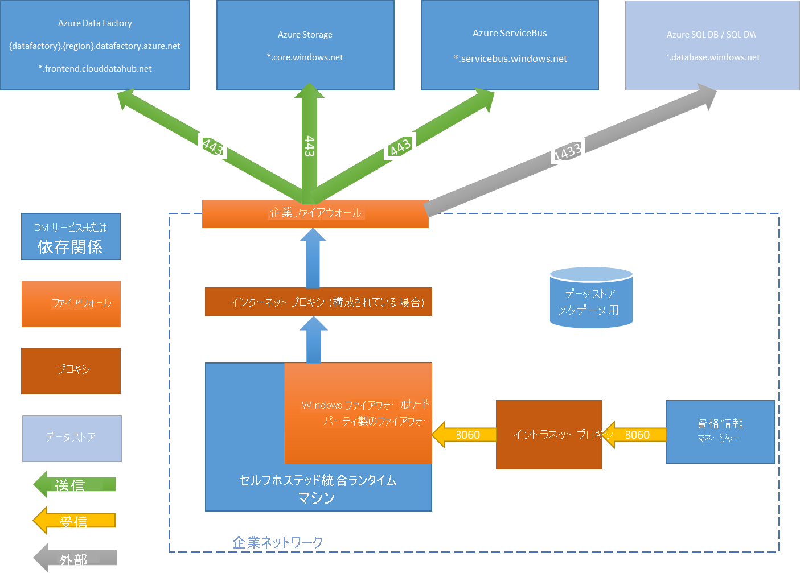

# <a name="create-and-configure-a-self-hosted-integration-runtime"></a>セルフホステッド統合ランタイムを作成して構成する
統合ランタイム (IR) は、異なるネットワーク環境間でデータ統合機能を提供するために Azure Data Factory によって使用されるコンピューティング インフラストラクチャです。 IR の詳細については、[ランタイム統合の概要](concepts-integration-runtime.md)に関するページを参照してください。

セルフホステッド統合ランタイムでは、クラウド データストアとプライベート ネットワーク内のデータストアとの間でコピー アクティビティを実行し、オンプレミス ネットワークまたは Azure Virtual Network 内のコンピューティング リソースに対して変換アクティビティをディスパッチすることができます。 セルフホステッド統合ランタイムは、オンプレミス コンピューター、またはプライベート ネットワーク内の仮想マシン (VM) にインストールする必要があります。  

このドキュメントでは、セルフホステッド IR を作成して構成する方法について説明します。

## <a name="high-level-steps-to-install-a-self-hosted-ir"></a>セルフホステッド IR をインストールする手順の概要
1. セルフホステッド統合ランタイムを作成します。 このタスクでは、Azure Data Factory の UI を使用することができます。 PowerShell の例を次に示します。

    ```powershell
    Set-AzureRmDataFactoryV2IntegrationRuntime -ResourceGroupName $resourceGroupName -DataFactoryName $dataFactoryName -Name $selfHostedIntegrationRuntimeName -Type SelfHosted -Description "selfhosted IR description"
    ```
  
2. セルフホステッド統合ランタイムをローカル コンピューターに[ダウンロード](https://www.microsoft.com/download/details.aspx?id=39717)してインストールします。

3. 認証キーを取得し、そのキーを使用してセルフホステッド統合ランタイムを登録します。 PowerShell の例を次に示します。

    ```powershell
    Get-AzureRmDataFactoryV2IntegrationRuntimeKey -ResourceGroupName $resourceGroupName -DataFactoryName $dataFactoryName -Name $selfHostedIntegrationRuntime.  
    ```

## <a name="setting-up-a-self-hosted-ir-on-an-azure-vm-by-using-an-azure-resource-manager-template-automation"></a>Azure Resource Manager テンプレートを使用する Azure VM でのセルフホステッド IR の設定 (オートメーション)
[この Azure Resource Manager テンプレート](https://github.com/Azure/azure-quickstart-templates/tree/master/101-vms-with-selfhost-integration-runtime)を使用して、Azure 仮想マシンでのセルフホステッド IR のセットアップを自動化できます。 このテンプレートでは、高可用性とスケーラビリティの機能を備えた完全に機能するセルフホステッド IR を Azure Virtual Network 内に簡単に設定できます (ノード数を 2 以上に設定している場合のみ)。

## <a name="command-flow-and-data-flow"></a>コマンド フローとデータ フロー
オンプレミスとクラウドの間でデータを移動する場合、アクティビティではセルフホステッド統合ランタイムを使用して、オンプレミス データ ソースからクラウドに、またはその逆に、データを転送します。

セルフホステッド IR でコピーする手順の概要についてのデータ フローを以下に示します。


1. データ開発者は、PowerShell コマンドレットを使用して Azure Data Factory 内でセルフホステッド統合ランタイムを作成します。 現時点では、Azure ポータルはこの機能をサポートしていません。
2. データ開発者は、データ ストアへの接続に使用する必要があるセルフホステッド統合ランタイムのインスタンスを指定することによって、オンプレミスのデータ ストアへのリンクされたサービスを作成します。 リンクされたサービスの設定の一部として、データ開発者は資格情報マネージャー アプリケーション (現時点ではサポートされていません) を使用して、認証の種類と資格情報を設定します。 資格情報マネージャー アプリケーションはデータ ストアと通信して接続をテストし、セルフホステッド統合ランタイムと通信して資格情報を保存します。
3. セルフホステッド統合ランタイム ノードでは、Windows DPAPI (Data Protection Application Programming Interface) を使用して資格情報を暗号化し、その資格情報をローカルに保存します。 高可用性を目的として複数ノードが設定されている場合、資格情報はさらに他のノード間で同期されます。 各ノードでは、DPAPI を使用して資格情報を暗号化し、それらをローカルに格納します。 資格情報の同期は、データ開発者に透過的であり、セルフホステッド IR によって処理されます。    
4. Data Factory サービスでは、共有 Azure Service Bus キューを使用する*コントロール チャネル* を介して、ジョブのスケジューリングと管理のためにセルフホステッド統合ランタイムと通信を行います。 アクティビティ ジョブを実行する必要がある場合、Data Factory は、その要求を資格情報と共に (資格情報が自己ホスト型統合ランタイムに保存されていない場合) キューに入れます。 セルフホステッド統合ランタイムでは、そのキューをポーリングした後、ジョブを開始します。
5. セルフホステッド統合ランタイムでは、データ パイプラインでのコピー アクティビティの構成方法に応じて、オンプレミス ストアからクラウド ストレージに、またはその逆に、データをコピーします。 この手順では、セルフホステッド統合ランタイムは、セキュリティで保護された (HTTPS) チャネルを使用して、クラウド ベースのストレージ サービス (Azure Blob Storage など) と直接通信を行います。

## <a name="considerations-for-using-a-self-hosted-ir"></a>セルフホステッド IR の使用に関する注意点

- 1 つの自己ホスト型統合ランタイムは、複数のオンプレミス データ ソースで使用できます。 単一のセルフホステッド統合ランタイムを、同じ Azure Active Directory テナント内の別のデータ ファクトリと共有することができます。 詳細については、[セルフホステッド統合ランタイムの共有](#sharing-the-self-hosted-integration-runtime-with-multiple-data-factories)に関するセクションを参照してください。
- 単一コンピューター上にインストールできるセルフホステッド統合ランタイムのインスタンスは 1 つのみとなります。 オンプレミス データ ソースにアクセスする必要があるデータ ファクトリが 2 つある場合、2 つのオンプレミス コンピューターにセルフホステッド統合ランタイムをインストールする必要があります。 つまり、セルフホステッド統合ランタイムは、特定のデータ ファクトリに関連付けられます。
- セルフホステッド統合ランタイムは、データ ソースと同じコンピューター上に存在する必要はありません。 しかし、セルフホステッド統合ランタイムをデータ ソースの近くに配置することにより、セルフホステッド統合ランタイムからデータ ソースへの接続時間が短縮されます。 自己ホスト型統合ランタイムは、オンプレミス データ ソースをホストするコンピューターとは異なるコンピューターにインストールすることをお勧めします。 セルフホステッド統合ランタイムとデータ ソースが別のコンピューター上にある場合、セルフホステッド統合ランタイムではデータ ソースとリソースの競合は発生しません。
- 同じオンプレミス データ ソースに接続する異なるコンピューター上で、複数のセルフホステッド統合ランタイムを使用することができます。 たとえば、2 つのデータ ファクトリを提供する 2 つのセルフホステッド統合ランタイムがあり、どちらのデータ ファクトリにも同じオンプレミス データ ソースが登録されている場合があります。
- Power BI シナリオを提供するゲートウェイがコンピューターに既にインストールされている場合は、Azure Data Factory 用のセルフホステッド統合ランタイムを別のコンピューター上にインストールします。
- セルフホステッド統合ランタイムは、Azure Virtual Network 内のデータ統合をサポートするために使用する必要があります。
- Azure ExpressRoute を使用する場合でも、ファイアウォールの背後にあるオンプレミス データ ソースとしてデータ ソースを扱います。 自己ホスト型統合ランタイムを使用してサービスとデータ ソースの間の接続を確立します。
- データ ストアがクラウド内の Azure IaaS 仮想マシン上にある場合でも、セルフホステッド統合ランタイムを使用する必要があります。
- FIPS 準拠の暗号化が有効になっている Windows Server 上にインストールされているセルフホステッド統合ランタイムでは、タスクが失敗する可能性があります。 この問題を回避するには、サーバー上の FIPS 準拠の暗号化を無効にします。 FIPS 準拠の暗号化を無効にするには、次のレジストリ値を 1 (有効) から 0 (無効) に変更します`HKLM\System\CurrentControlSet\Control\Lsa\FIPSAlgorithmPolicy\Enabled`。

## <a name="prerequisites"></a>前提条件

- サポートされているオペレーティング システムのバージョンは、Windows 7 Service Pack 1、Windows 8.1、Windows 10、Windows Server 2008 R2 SP1、Windows Server 2012、Windows Server 2012 R2、Windows Server 2016 です。 セルフホステッド統合ランタイムのドメイン コントローラーへのインストールはサポートされていません。
- .NET Framework 4.6.1 以降が必要です。 Windows 7 コンピューター上にセルフホステッド統合ランタイムをインストールする場合は、.NET Framework 4.6.1 以降をインストールします。 詳細については、「 [.NET Framework システム要件](/dotnet/framework/get-started/system-requirements) 」をご覧ください。
- セルフホステッド統合ランタイム コンピューターの推奨される最小限の構成は、2 GHz、4 コア、8 GB の RAM、80 GB のディスクです。
- ホスト コンピューターが休止状態の場合、自己ホスト型統合ランタイムはデータ要求に応答しません。 セルフホステッド統合ランタイムをインストールする前に、コンピューターに適切な電源プランを構成します。 コンピューターが休止状態に入るよう構成されている場合、自己ホスト型統合ランタイムのインストール時にメッセージが出力されます。
- 自己ホスト型統合ランタイムを正常にインストールして構成するには、コンピューターの管理者である必要があります。
- コピー アクティビティは特定の頻度で実行されます。 コンピューター上のリソース使用率 (CPU、メモリ) では、ピーク時とアイドル時で同じパターンに従います。 リソース使用率はまた、移動されるデータの量に大きく依存します。 複数のコピー ジョブが進行中のときには、ピーク時にリソース使用率が上昇します。

## <a name="installation-best-practices"></a>インストールのベスト プラクティス
セルフホステッド統合ランタイムは、MSI セットアップ パッケージを [Microsoft ダウンロード センター](https://www.microsoft.com/download/details.aspx?id=39717)からダウンロードしてインストールすることができます。 詳細な手順については、[オンプレミスとクラウドの間でのデータ移動](tutorial-hybrid-copy-powershell.md)に関する記事を参照してください。

- コンピューターが休止状態にならないように、セルフホステッド統合ランタイム用のホスト コンピューターの電源プランを構成します。 ホスト コンピューターが休止状態になると、セルフホステッド統合ランタイムはオフラインになります。
- 定期的に、自己ホスト型統合ランタイムに関連付けられている資格情報をバックアップします。

## <a name="install-and-register-self-hosted-ir-from-the-download-center"></a>ダウンロード センターからセルフホステッド IR をインストールして登録する

1. [Microsoft Integration Runtime のダウンロード ページ](https://www.microsoft.com/download/details.aspx?id=39717)に移動します。
2. **[ダウンロード]** を選択します。次に、適切なバージョン (**32 ビット**または **64 ビット**) を選んでから **[次へ]** を選択します。
3. MSI ファイルを直接実行するか、ハード ディスクに保存してから実行します。
4. **[ようこそ]** ページで言語を選び、**[次へ]** を選択します。
5. マイクロソフト ソフトウェア ライセンス条項に同意して、**[次へ]** を選択します。
6. セルフホステッド統合ランタイムをインストールする**フォルダー**を選んで、**[次へ]** を選択します。
7. **[インストールの準備完了]** ページで **[インストール]** をクリックします。
8. **[完了]** をクリックしてインストールを完了します。
9. Azure PowerShell を使用して認証キーを取得します。 認証キーを取得するための PowerShell の例を以下に示します。

    ```powershell
    Get-AzureRmDataFactoryV2IntegrationRuntimeKey -ResourceGroupName $resourceGroupName -DataFactoryName $dataFactoryName -Name $selfHostedIntegrationRuntime
    ```
11. ご利用のコンピューターで実行している Microsoft Integration Runtime 構成マネージャーの **[統合ランタイム (セルフホスト) の登録]** ページで、次の手順を行います。

    a. 認証キーをテキスト領域に貼り付けます。

    b. 必要に応じて、**[認証キーの表示]** を選択してキー テキストを表示します。

    c. **[登録]** を選択します。


## <a name="high-availability-and-scalability"></a>高可用性とスケーラビリティ
セルフホステッド統合ランタイムは、複数のオンプレミス コンピューターに関連付けることができます。 これらのコンピューターは、ノードと呼ばれます。 セルフホステッド統合ランタイムには最大で 4 つのノードを関連付けることができます。 1 つの論理ゲートウェイで複数のノード (ゲートウェイがインストールされているオンプレミス コンピューター) を使用する利点は次のとおりです。
* セルフホステッド統合ランタイムの可用性が向上したことによって、ビッグ データ ソリューションや Azure Data Factory を使用したクラウド データ統合において、単一障害点となることはなくなり、最大 4 つのノードによって継続性が確保されます。
* オンプレミスとクラウド データ ストアとの間のデータ移動は、パフォーマンスとスループットが向上しました。 詳しくは[パフォーマンス比較](copy-activity-performance.md)を参照してください。

セルフホステッド統合ランタイム ソフトウェアを[ダウンロード センター](https://www.microsoft.com/download/details.aspx?id=39717)からインストールして、複数のノードを関連付けることができます。 その後、[チュートリアル](tutorial-hybrid-copy-powershell.md)の説明に従って、**New-AzureRmDataFactoryV2IntegrationRuntimeKey** コマンドレットから取得した認証キーのいずれかを使用して、登録します。

> [!NOTE]
> 各ノードを関連付けるために新しいセルフホステッド統合ランタイムを作成する必要はありません。 セルフホステッド統合ランタイムを別のコンピューターにインストールし、同じ認証キーを使用してそれを登録できます。 

> [!NOTE]
> 高可用性とスケーラビリティ用の別のノードを追加する前に、最初のノードで **[Remote access to intranet]\(イントラネットへのリモート アクセス\)** オプションを確実に有効にします (**[Microsoft Integration Runtime 構成マネージャー]** > **[設定]** > **[Remote access to intranet]\(イントラネットへのリモート アクセス\)**)。 

### <a name="scale-considerations"></a>スケールに関する考慮事項

#### <a name="scale-out"></a>スケールアウト

セルフホステッド IR で使用可能なメモリが低減しており、CPU 使用率が高い場合、新しいノードを追加すると、コンピューター全体の負荷をスケールアウトするのに役立ちます。 タイムアウトのため、またはセルフホステッド IR ノードがオフライン状態であるために、アクティビティが失敗したときに、ノードをゲートウェイに追加する場合に役立ちます。

#### <a name="scale-up"></a>スケールアップ

使用可能なメモリと CPU が効果的に活用されていないのに、同時ジョブの実行が上限に達する場合は、ノードで実行できる同時実行ジョブの数を増やすことで、スケールアップを行う必要があります。 また、セルフホステッド IR が過負荷になっているために、アクティビティがタイムアウトになる場合も、スケールアップが必要になることがあります。 次の画像に示すように、ノードの最大容量を増やすことができます。  


### <a name="tlsssl-certificate-requirements"></a>TLS/SSL 証明書の要件

統合ランタイム ノード間の通信を保護するために使用される TLS/SSL 証明書の要件を次に示します。

- 証明書は必ず、公的に信頼されている X509 v3 証明書とします。 公的 (パートナー) 証明機関 (CA) によって発行された証明書を使用することをお勧めします。
- 統合ランタイムの各ノードで、この証明書を信頼する必要があります。
- サブジェクトの別名 (SAN) の最後の項目のみが使用され、現行の制限に起因してその他はすべて無視されるため、SAN 証明書はお勧めしません。 たとえば、SAN が **node1.domain.contoso.com** と **node2.domain.contoso.com** の SAN 証明書がある場合、FQDN が **node2.domain.contoso.com** のコンピューターでのみこの証明書を使用できます。
- 証明書では、SSL 証明書のために Windows Server 2012 R2 でサポートされている任意のキー サイズがサポートされます。
- CNG キーを使用する証明書はサポートされません。  

## <a name="sharing-the-self-hosted-integration-runtime-with-multiple-data-factories"></a>複数のデータ ファクトリでセルフホステッド統合ランタイムを共有する

データ ファクトリに既に設定してある既存のセルフホステッド統合ランタイム インフラストラクチャを再利用することができます。 これにより、既存のセルフホステッド IR (共有) を参照して、異なるデータ ファクトリに*リンクされたセルフホステッド統合ランタイム*を作成できます。

PowerShell を使用してセルフホステッド統合ランタイムを共有するには、「[Create a shared self-hosted integration runtime in Azure Data Factory with PowerShell](create-shared-self-hosted-integration-runtime-powershell.md)」 (PowerShell を使用して Azure Data Factory 内で共有のセルフホステッド統合ランタイムを作成する) を参照してください。

この機能の概要とデモンストレーションについては、以下の 12 分間の動画を視聴してください。

> [!VIDEO https://channel9.msdn.com/Shows/Azure-Friday/Hybrid-data-movement-across-multiple-Azure-Data-Factories/player]

### <a name="terminology"></a>用語集

- **共有された IR**:物理インフラストラクチャで実行されている元のセルフホステッド IR。  
- **リンクされた IR**:別の共有された IR を参照する IR。 これは論理 IR であり、別のセルフホステッド IR (共有された IR) のインフラストラクチャを使用します。

### <a name="high-level-steps-for-creating-a-linked-self-hosted-ir"></a>リンクされたセルフホステッド IR を作成する手順の概要

1. 共有されるセルフホステッド IR で、リンクされた IR を作成するデータ ファクトリへのアクセス許可を付与します。 

   ![[共有] タブのアクセス許可を付与するためのボタン](media/create-self-hosted-integration-runtime/grant-permissions-IR-sharing.png)

   

2. 共有されるセルフホステッド IR のリソース ID をメモしておきます。

   

3. アクセス許可が付与されたデータ ファクトリで、新しいセルフホステッド IR (共有) を作成して、リソース ID を入力します。

   

   

### <a name="monitoring"></a>監視 

- **共有 IR**

  

  

- **リンクされた IR**

  

  

### <a name="known-limitations-of-self-hosted-ir-sharing"></a>セルフホステッド IR の共有に関する既知の制限事項

* リンクされた IR が作成されるデータ ファクトリには、[MSI](https://docs.microsoft.com/azure/active-directory/managed-service-identity/overview) が必要です。 既定で、Azure portal または PowerShell コマンドレットで作成されたデータ ファクトリには、暗黙的に MSI が作成されています。 しかし、データ ファクトリが Azure Resource Manager テンプレートまたは SDK を使用して作成されている場合、Azure Resource Manager で MSI を含むデータ ファクトリが確実に作成されるように、明示的に **Identity** プロパティを設定する必要があります。 

* この機能をサポートする Azure Data Factory .NET SDK のバージョンは、1.1.0 以降です。

* この機能をサポートする Azure PowerShell のバージョンは、6.6.0 以降 (AzureRM.DataFactoryV2、0.5.7 以降) です。

* アクセス許可を付与するには、ユーザーには、共有 IR が存在するデータ ファクトリ内に所有者ロールまたは継承された所有者ロールが必要です。

* 共有機能は、同じ Azure Active Directory テナント内のデータ ファクトリに対してのみ機能します。

* Active Directory の[ゲスト ユーザー](https://docs.microsoft.com/azure/active-directory/governance/manage-guest-access-with-access-reviews) の場合、UI の検索機能 (検索キーワードを使用するすべてのデータ ファクトリの一覧表示) が[動作しません](https://msdn.microsoft.com/library/azure/ad/graph/howto/azure-ad-graph-api-permission-scopes#SearchLimits)。 しかし、ゲスト ユーザーがデータ ファクトリの所有者である限り、検索機能なしで IR を共有できます。その場合、IR を共有する必要があるデータ ファクトリの MSI を **[アクセス許可の割り当て]** テキスト ボックスに直接入力し、Azure Data Factory UI で **[追加]** を選択します。 

  > [!NOTE]
  > この機能は、Azure Data Factory V2 でのみ使用できます。 

## <a name="notification-area-icons-and-notifications"></a>通知領域のアイコンと通知

通知領域のアイコンまたはメッセージの上にカーソルを移動すると、セルフホステッド統合ランタイムの状態の詳細が表示されます。


## <a name="ports-and-firewall"></a>ポートとファイアウォール
考慮する必要がある 2 つのファイアウォールがあります。それは組織の中央ルーターで実行している*企業ファイアウォール*と、セルフホステッド統合ランタイムがインストールされているローカル コンピューター上のデーモンとして構成されている *Windows ファイアウォール*です。



*企業ファイアウォール* レベルでは、次のドメインと送信ポートを構成する必要があります。

ドメイン名 | ポート | 説明
------------ | ----- | ------------
*.servicebus.windows.net | 443 | バックエンドのデータ移動サービスとの通信に使用
*.core.windows.net | 443 | Azure Blob Storage を使用した段階的なコピーに使用 (構成されている場合)
*. frontend.clouddatahub.net | 443 | バックエンドのデータ移動サービスとの通信に使用
download.microsoft.com | 443 | 更新プログラムのダウンロードに使用

*Windows ファイアウォール* レベル (コンピューター レベル) では、通常、これらの送信ポートが有効になっています。 有効になっていない場合は、セルフホステッド統合ランタイム コンピューターに応じて、ドメインとポートを構成することができます。

> [!NOTE]
> お使いのソースやシンクに基づいて、追加のドメインと送信ポートを企業ファイアウォールまたは Windows ファイアウォールのホワイトリストに追加する必要がある場合があります。
>
> 一部のクラウド データベース (Azure SQL Database や Azure Data Lake など) では、そのファイアウォール構成でセルフホステッド統合ランタイム コンピューターの IP アドレスをホワイトリストに追加する必要がある場合があります。

### <a name="copy-data-from-a-source-to-a-sink"></a>ソースからシンクへのデータのコピー
ファイアウォール ルールが、企業ファイアウォール、セルフホステッド統合ランタイム コンピューター上の Windows ファイアウォール、およびデータ ストア自体に対して確実に正しく有効にします。 このルールを有効にすると、自己ホスト型統合ランタイムは、ソースとシンクの両方に正常に接続されます。 コピー操作に関連するデータ ストアごとにルールを有効にしてください。

たとえば、オンプレミス データ ストアから Azure SQL Database シンクまたは Azure SQL Data Warehouse シンクにコピーするには、次の手順を行います。

1. 送信 TCP 通信を、Windows ファイアウォールと企業ファイアウォールの両方に対して、ポート 1433 上で許可します。
2. Azure SQL Database のファイアウォール設定を、セルフホステッド統合ランタイム コンピューターの IP アドレスを許可された IP アドレスのリストに追加するように構成します。

> [!NOTE]
> ファイアウォールで送信ポート 1433 が許可されていない場合、セルフホステッド統合ランタイムで Azure SQL Database に直接アクセスすることはできません。 この場合、Azure SQL Database と Azure SQL Data Warehouse に[ステージング コピー](copy-activity-performance.md)を使用できます。 このシナリオでは、データ移動に HTTPS (ポート 443) のみが必要になります。


## <a name="proxy-server-considerations"></a>プロキシ サーバーに関する考慮事項
企業ネットワーク環境でプロキシ サーバーを使用してインターネットにアクセスする場合は、適切なプロキシ設定を使用するようにセルフホステッド統合ランタイムを構成します。 プロキシは、初期登録フェーズ中に設定できます。


セルフホステッド統合ランタイムでは、プロキシ サーバーを使用してクラウド サービスに接続します。 初期セットアップ時に **[変更] リンク**を選択します。 プロキシ設定ダイアログ ボックスが表示されます。


3 つの構成オプションがあります。

- **プロキシを使用しない**:自己ホスト型統合ランタイムは、クラウド サービスに接続するときにプロキシを明示的には使用しません。
- **システム プロキシを使用する**:セルフホステッド統合ランタイムでは、diahost.exe.config と diawp.exe.config で構成されているプロキシ設定を使用します。diahost.exe.config と diawp.exe.config でプロキシが構成されていない場合、セルフホステッド統合ランタイムではプロキシを経由せず、直接クラウド サービスに接続します。
- **カスタム プロキシを使用する**:diahost.exe.config と diawp.exe.config の構成は使用せず、セルフホステッド統合ランタイムで使用するように HTTP プロキシ設定を構成します。**アドレス**と**ポート**は必須です。 **ユーザー名**と**パスワード**は、プロキシの認証設定によっては省略できます。 すべての設定は Windows DPAPI を使用して、自己ホスト型統合ランタイム上で暗号化され、コンピューターにローカルに格納されます。

統合ランタイムのホスト サービスは、更新済みのプロキシ設定を保存した後に自動的に再起動されます。

セルフホステッド統合ランタイムが正常に登録された後、プロキシ設定を表示または更新する必要がある場合は、Integration Runtime 構成マネージャーを使用します。

1. **Microsoft Integration Runtime 構成マネージャー**を開きます。
2. **[設定]** タブに切り替えます。
3. **[HTTP プロキシ]** セクションの **[変更]** リンクを選択して、**[HTTP プロキシを設定する]** ダイアログ ボックスを開きます。
4. **[次へ]** を選択します。 その後、プロキシ設定を保存して統合ランタイムのホスト サービスを再起動するためのアクセス許可を求める警告が表示されます。

構成マネージャー ツールを使用して、HTTP プロキシを表示して更新することができます。


> [!NOTE]
> NTLM 認証でプロキシ サーバーを設定する場合は、ドメイン アカウントで統合ランタイムのホスト サービスが実行されます。 ドメイン アカウントのパスワードを後で変更する場合は、忘れずにサービスの構成設定を更新し、適宜、再起動してください。 この要件のため、専用のドメイン アカウントを使用して、パスワードを頻繁に更新する必要がないプロキシ サーバーにアクセスすることをお勧めします。

### <a name="configure-proxy-server-settings"></a>プロキシ サーバーの設定を構成する

HTTP プロキシに対して **[システム プロキシを使用する]** 設定を選択すると、セルフホステッド統合ランタイムで、diahost.exe.config と diawp.exe.config のプロキシ設定が使用されます。diahost.exe.config と diawp.exe.config でプロキシが指定されていない場合、セルフホステッド統合ランタイムはプロキシを経由せずに直接クラウド サービスに接続されます。 diahost.exe.config ファイルを更新する手順を以下に示します。

1. ファイル エクスプ ローラーで、C:\Program Files\Microsoft Integration Runtime\3.0\Shared\diahost.exe.config の安全なコピーを作成して、元のファイルをバックアップします。
2. 管理者として実行中の Notepad.exe を開き、テキスト ファイル C:\Program Files\Microsoft Integration Runtime\3.0\Shared\diahost.exe.config を開きます。次のコードに示されている system.net の既定のタグを見つけます。

    ```xml
    <system.net>
        <defaultProxy useDefaultCredentials="true" />
    </system.net>
    ```
    その後、次の例で示すように、プロキシ サーバーの詳細を追加できます。

    ```xml
    <system.net>
        <defaultProxy enabled="true">
              <proxy bypassonlocal="true" proxyaddress="http://proxy.domain.org:8888/" />
        </defaultProxy>
    </system.net>
    ```

    追加のプロパティは、プロキシ タグ内で `scriptLocation` のように必要な設定を指定することが許可されます。 構文については、[proxy 要素 (ネットワーク設定)](https://msdn.microsoft.com/library/sa91de1e.aspx) を参照してください。

    ```xml
    <proxy autoDetect="true|false|unspecified" bypassonlocal="true|false|unspecified" proxyaddress="uriString" scriptLocation="uriString" usesystemdefault="true|false|unspecified "/>
    ```
3. 元の場所に構成ファイルを保存します。 次に、セルフホステッド統合ランタイムのホスト サービスを再開して、変更を取得します。 

   サービスを再開するには、コントロール パネルのサービス アプレットを使用します。 または、Integration Runtime 構成マネージャーから、**[サービスの停止]** ボタンを選択し、**[サービスの開始]** を選びます。 
   
   サービスが開始されない場合は、不正確な XML タグ構文が編集済みのアプリケーション構成ファイルに追加されている可能性があります。

> [!IMPORTANT]
> diahost.exe.config と diawp.exe.config の両方を忘れずに更新してください。

また、Microsoft Azure が会社のホワイトリストにあることを確認する必要もあります。 有効な Microsoft Azure IP アドレスの一覧は、[Microsoft ダウンロード センター](https://www.microsoft.com/download/details.aspx?id=41653)からダウンロードできます。

### <a name="possible-symptoms-for-firewall-and-proxy-server-related-issues"></a>ファイアウォールとプロキシ サーバー関連の問題で発生する可能性がある症状
次のようなエラーが発生した場合は、ファイアウォールまたはプロキシ サーバーの不適切な構成が原因である可能性があります。構成が不適切だと、セルフホステッド統合ランタイムが自身を認証するための Data Factory に接続できません。 ファイアウォールとプロキシ サーバーが確実に正しく構成されるようにするには、前のセクションを参照してください。

* セルフホステッド統合ランタイムを登録すると、次のエラーが表示されます。"この Integration Runtime ノードの登録に失敗しました。 認証キーが有効であることと、このコンピューター上で統合サービスのホストサービスが実行されていることを確認してください。"
* Integration Runtime 構成マネージャーを開くと、**[切断]** または **[接続中]** という状態が表示されます。 **[イベント ビューアー]** > **[アプリケーションとサービス ログ]** > **[Microsoft Integration Runtime]** の順に選択して Windows イベント ログを表示すると、次のようなエラー メッセージが表示されます。

    ```
    Unable to connect to the remote server
    A component of Integration Runtime has become unresponsive and restarts automatically. Component name: Integration Runtime (Self-hosted).
    ```

### <a name="enabling-remote-access-from-an-intranet"></a>イントラネットからのリモート アクセスを有効にする  
PowerShell または資格情報マネージャー アプリケーションを使用して、セルフホステッド統合ランタイムがインストールされているのとは別の (ネットワーク内の) コンピューターから資格情報を暗号化する場合、**[イントラネットからのリモート アクセス]** オプションを有効にすることができます。 PowerShell または資格情報マネージャー アプリケーションを使用して、セルフホステッド統合ランタイムがインストールされているのと同じコンピューターで資格情報を暗号化する場合、**[イントラネットからのリモート アクセス]** オプションを有効にすることはできません。

高可用性とスケーラビリティ用の別のノードを追加する前に、**[イントラネットからのリモート アクセス]** を有効にする必要があります。  

既定では、セルフホステッド統合ランタイム (バージョン 3.3.xxxx.x 以降) の設定中に、セルフホステッド統合ランタイムのインストールにより、セルフホステッド統合ランタイム コンピューター上の **[イントラネットからのリモート アクセス]** が無効になります。

サードパーティ製のファイアウォールを使用している場合は、ポート 8060 (またはユーザー構成ポート) を手動で開くことができます。 セルフホステッド統合ランタイムの設定中にファイアウォールの問題が発生した場合は、次のコマンドを使用して、ファイアウォールを構成せずにセルフホステッド統合ランタイムをインストールしてみてください。

```
msiexec /q /i IntegrationRuntime.msi NOFIREWALL=1
```
> [!NOTE]
> Azure Data Factory V2 での資格情報の暗号化では、資格情報マネージャー アプリケーションはまだ使用できません。  

セルフホステッド統合ランタイム コンピューター上でポート 8060 を開かない場合は、資格情報の設定アプリケーション以外のメカニズムを使用して、データ ストア資格情報を構成します。 たとえば、**New-AzureRmDataFactoryV2LinkedServiceEncryptCredential** PowerShell コマンドレットを使用できます。


## <a name="next-steps"></a>次の手順
具体的な手順については、次のチュートリアルを参照してください。[チュートリアル:オンプレミスのデータをクラウドにコピーする](tutorial-hybrid-copy-powershell.md)
