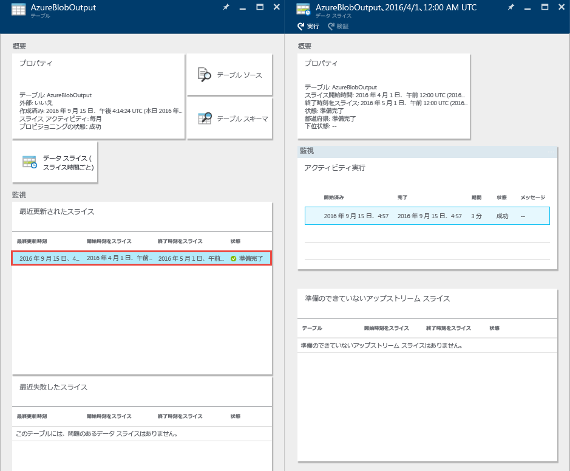
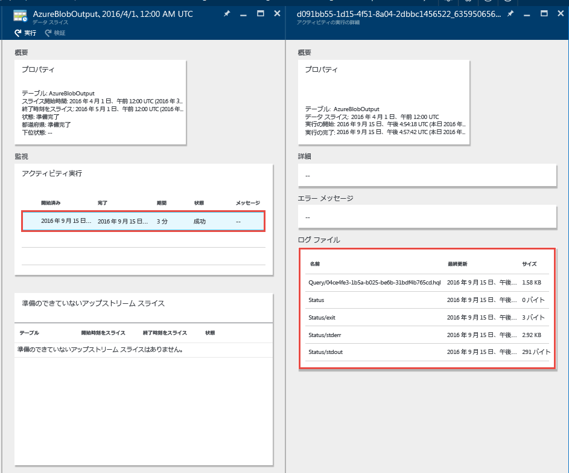
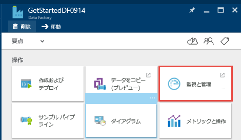
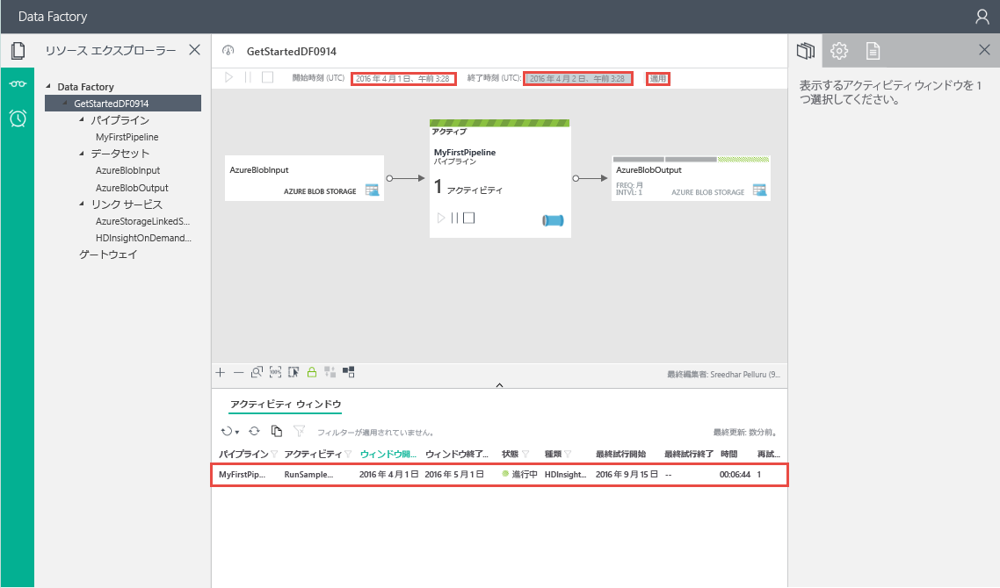
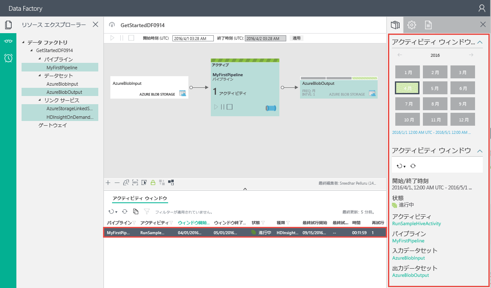

<properties
	pageTitle="最初の Data Factory の作成 (Visual Studio) | Microsoft Azure"
	description="このチュートリアルでは、Visual Studio を使用して、サンプルの Azure Data Factory パイプラインを作成します。"
	services="data-factory"
	documentationCenter=""
	authors="spelluru"
	manager="jhubbard"
	editor="monicar"/>

<tags
	ms.service="data-factory"
	ms.workload="data-services"
	ms.tgt_pltfrm="na"
	ms.devlang="na"
	ms.topic="hero-article" 
	ms.date="08/01/2016"
	ms.author="spelluru"/>

# チュートリアル: Microsoft Visual Studio を使用した初めての Azure データ ファクトリの作成
> [AZURE.SELECTOR]
- [チュートリアルの概要](data-factory-build-your-first-pipeline.md)
- [Data Factory エディターを使用する](data-factory-build-your-first-pipeline-using-editor.md)
- [PowerShell の使用](data-factory-build-your-first-pipeline-using-powershell.md)
- [Visual Studio の使用](data-factory-build-your-first-pipeline-using-vs.md)
- [Using Resource Manager Template](data-factory-build-your-first-pipeline-using-arm.md)

この記事では、Microsoft Visual Studio を使用して最初の Azure データ ファクトリを作成します。

## 前提条件
1. 「[チュートリアルの概要](data-factory-build-your-first-pipeline.md)」に目を通し、**前提条件**の手順を完了する必要があります。
2. Data Factory エンティティを Visual Studio から Azure Data Factory に発行できる **Azure サブスクリプションの管理者**である必要があります。
3. コンピューターに以下がインストールされている必要があります。
	- Visual Studio 2013 または Visual Studio 2015
	- Azure SDK for Visual Studio 2013 または Visual Studio 2015 をダウンロードします。[Azure ダウンロード ページ](https://azure.microsoft.com/downloads/)に移動し、**.NET** セクションの **[VS 2013]** または **[VS 2015]** をクリックします。
	- Visual Studio 用の最新の Azure Data Factory プラグイン ([VS 2013](https://visualstudiogallery.msdn.microsoft.com/754d998c-8f92-4aa7-835b-e89c8c954aa5) または [VS 2015](https://visualstudiogallery.msdn.microsoft.com/371a4cf9-0093-40fa-b7dd-be3c74f49005)) をダウンロードします。メニューで **[ツール]**、**[拡張機能と更新プログラム]**、**[オンライン]**、**[Visual Studio ギャラリー]**、**[Microsoft Azure Data Factory Tools for Visual Studio]**、**[更新]** の順にクリックして、プラグインを更新することもできます。
 
それでは、Visual Studio を使用して、Azure データ ファクトリを作成しましょう。

## Visual Studio プロジェクトの作成 
1. **Visual Studio 2013** または **Visual Studio 2015** を起動します。**[ファイル]** をクリックし、**[新規作成]** をポイントして、**[プロジェクト]** をクリックします。**[新しいプロジェクト]** ダイアログ ボックスが表示されます。
2. **[新しいプロジェクト]** ダイアログで、**[DataFactory]** テンプレートを選択し、**[空の Data Factory プロジェクト]** をクリックします。

	![[新しいプロジェクト] ダイアログ ボックス](./media/data-factory-build-your-first-pipeline-using-vs/new-project-dialog.png)

3. プロジェクトの**名前**、**場所**、**ソリューション**の名前を入力し、**[OK]** をクリックします。

	

## リンクされたサービスの作成
データ ファクトリは、1 つまたは複数のパイプラインを持つことができます。パイプラインには、1 つまたは複数のアクティビティを含めることができます。たとえば、コピー元からコピー先のデータ ストアにデータをコピーするコピー アクティビティや、Hive スクリプトを実行して入力データを変換する HDInsight Hive アクティビティなどを含めることができます。コピー アクティビティでサポートされているすべてのソースとシンクについては、[サポートされているデータ ストア](data-factory-data-movement-activities.md##supported-data-stores-and-formats)に関する記事を参照してください。Data Factory でサポートされているコンピューティング サービスの一覧については、「[コンピューティングのリンクされたサービス](data-factory-compute-linked-services.md)」を参照してください。

この手順では、Azure ストレージ アカウントとオンデマンド Azure HDInsight クラスターをデータ ファクトリにリンクします。Azure ストレージ アカウントには、このサンプルのパイプラインの入力データと出力データが保持されます。HDInsight のリンクされたサービスは、このサンプルのパイプラインのアクティビティに指定された Hive スクリプトを実行するために使用されます。自分のシナリオで使用するデータ ストアやコンピューティング サービスを特定し、リンクされたサービスを作成して、それらのサービスをデータ ファクトリにリンクします。

後で Data Factory ソリューションを発行するときに、データ ファクトリの名前と設定を指定します。

#### Azure Storage のリンクされたサービスを作成する
この手順では、Azure ストレージ アカウントをデータ ファクトリにリンクします。このチュートリアルでは、同じ Azure ストレージ アカウントを使用して、入力/出力データと HQL スクリプト ファイルを格納します。

4. ソリューション エクスプローラーの **[Linked Services]** を右クリックして、**[追加]** をポイントし、**[新しい項目]** をクリックします。
5. **[新しい項目の追加]** ダイアログ ボックスで、一覧から **[Azure Storage のリンクされたサービス]** を選択し、**[追加]** をクリックします。
3. **accountname** と **accountkey** を Azure ストレージ アカウントとそのキーで置き換えます。ストレージ アクセス キーを取得する方法については、「[ストレージ アクセス キーの表示、コピーおよび再生成](../storage/storage-create-storage-account.md#view-copy-and-regenerate-storage-access-keys)」を参照してください。

	

4. **AzureStorageLinkedService1.json** ファイルを保存します。

#### Azure HDInsight のリンクされたサービスを作成する
この手順では、オンデマンド HDInsight クラスターをデータ ファクトリにリンクします。HDInsight クラスターは、実行時に自動的に作成されます。また、処理が終わり、アイドル状態が一定時間続くと削除されます。オンデマンド HDInsight クラスターの代わりに、独自の HDInsight クラスターを使用できます。詳細については、「[計算のリンクされたサービス](data-factory-compute-linked-services.md)」を参照してください。

1. **ソリューション エクスプローラー**の **[リンクされたサービス]** を右クリックして、**[追加]** をポイントし、**[新しい項目]** をクリックします。
2. **[HDInsight のオンデマンドのリンクされたサービス]** を選択し、**[追加]** をクリックします。
3. **JSON** を次のように置き換えます。

		{
		  "name": "HDInsightOnDemandLinkedService",
		  "properties": {
		    "type": "HDInsightOnDemand",
		    "typeProperties": {
		      "version": "3.2",
		      "clusterSize": 1,
		      "timeToLive": "00:30:00",
		      "linkedServiceName": "AzureStorageLinkedService1"
		    }
		  }
		}
	
	次の表に、このスニペットで使用される JSON プロパティの説明を示します。
	
	プロパティ | 説明
	-------- | -----------
	バージョン | 作成された HDInsight のバージョンが 3.2 になるように指定します。 
	ClusterSize | HDInsight クラスターのサイズを指定します。 
	TimeToLive | 削除されるまでの HDInsight クラスターのアイドル時間を指定します。
	linkedServiceName | HDInsight によって生成されるログを保存するために使用されるストレージ アカウントを指定します。

	以下の点に注意してください。
	
	- Data Factory は、上記の JSON で **Windows ベース**の HDInsight クラスターを自動的に作成します。**Linux ベース**の HDInsight クラスターを作成させることもできます。詳細については、[オンデマンド HDInsight のリンクされたサービス](data-factory-compute-linked-services.md#azure-hdinsight-on-demand-linked-service)に関するセクションを参照してください。
	- オンデマンド HDInsight クラスターの代わりに、**独自の HDInsight クラスター**を使用できます。詳細については、[HDInsight のリンクされたサービス](data-factory-compute-linked-services.md#azure-hdinsight-linked-service)に関するセクションを参照してください。
	- HDInsight クラスターは、JSON (**linkedServiceName**) で指定した Blob Storage に**既定のコンテナー**を作成します。クラスターを削除しても、HDInsight はこのコンテナーを削除しません。この動作は仕様です。オンデマンド HDInsight のリンクされたサービスでは、既存のライブ クラスター (**timeToLive**) がある場合を除き、スライスが処理されるたびに HDInsight クラスターが作成されます。クラスターは、処理が終了すると自動的に削除されます。
	
		処理されるスライスが多いほど、Azure BLOB ストレージ内のコンテナーも増えます。ジョブのトラブルシューティングのためにコンテナーが必要ない場合、コンテナーを削除してストレージ コストを削減できます。これらのコンテナーの名前は、"adf**<データ ファクトリ名>**-**<リンクされたサービス名>**-<日時スタンプ>" というパターンに従います。Azure Blob Storage 内のコンテナーを削除するには、[Microsoft ストレージ エクスプローラー](http://storageexplorer.com/)などのツールを使用します。

	詳細については、「[On-demand HDInsight Linked Service (オンデマンド HDInsight のリンクされたサービス)](data-factory-compute-linked-services.md#azure-hdinsight-on-demand-linked-service)」を参照してください。
4. **HDInsightOnDemandLinkedService1.json** ファイルを保存します。

## データセットを作成する
この手順では、Hive 処理の入力データと出力データを表すデータセットを作成します。これらのデータセットは、このチュートリアルで前に作成した **AzureStorageLinkedService1** を参照します。このリンクされたサービスは Azure ストレージ アカウントを指し、データセットは入力データと出力データを保持するストレージのコンテナー、フォルダー、ファイル名を指定します。

#### 入力データセットの作成

1. **ソリューション エクスプローラー**の **[テーブル]** を右クリックし、**[追加]** をポイントして、**[新しい項目]** をクリックします。
2. 一覧から **[Azure BLOB]** を選択し、ファイルの名前を **InputDataSet.json** に変更して、**[追加]** をクリックします。
3. エディターで **JSON** を次のコードに置き換えます。

	この JSON スニペットでは、パイプラインのアクティビティの入力データを表す **AzureBlobInput** というデータセットを作成します。さらに、**adfgetstarted** という BLOB コンテナーと **inputdata** というフォルダーに入力データが配置されるように指定します。
		
		{
			"name": "AzureBlobInput",
		    "properties": {
		        "type": "AzureBlob",
		        "linkedServiceName": "AzureStorageLinkedService1",
		        "typeProperties": {
		            "fileName": "input.log",
		            "folderPath": "adfgetstarted/inputdata",
		            "format": {
		                "type": "TextFormat",
		                "columnDelimiter": ","
		            }
		        },
		        "availability": {
		            "frequency": "Month",
		            "interval": 1
		        },
		        "external": true,
		        "policy": {}
		    }
		} 

	次の表に、このスニペットで使用される JSON プロパティの説明を示します。

	| プロパティ | Description |
	| :------- | :---------- |
	| type | データは Azure Blob Storage に存在するため、type プロパティを AzureBlob に設定しています。 |  
	| linkedServiceName | 前に作成した AzureStorageLinkedService1 を参照します。 |
	| fileName | このプロパティは省略可能です。このプロパティを省略した場合は、folderPath のすべてのファイルが取得されます。このチュートリアルでは、input.log のみが処理されます。 |
	| type | ログ ファイルはテキスト形式です。そのため、TextFormat を使用します。 | 
	| columnDelimiter | ログ ファイル内の列はコンマ (,) で区切られています。 |
	| frequency/interval | frequency を Month に設定し、interval を 1 に設定しています。そのため、入力スライスは 1 か月ごとになります。 | 
	| 外部 | Data Factory サービスによって入力データが生成されない場合は、このプロパティを true に設定します。 | 
	  
	
3. **InputDataset.json** ファイルを保存します。

 
#### 出力データセットの作成
次に、Azure BLOB ストレージに格納される出力データを表す出力データセットを作成します。

1. **ソリューション エクスプローラー**の **[テーブル]** を右クリックし、**[追加]** をポイントして、**[新しい項目]** をクリックします。
2. 一覧から **[Azure BLOB]** を選択し、ファイルの名前を **OutputDataset.json** に変更して、**[追加]** をクリックします。
3. エディターで **JSON** を次のコードに置き換えます。

	この JSON スニペットでは、**AzureBlobOutput** というデータセットを作成し、Hive スクリプトによって生成されるデータの構造を指定しています。さらに、**adfgetstarted** という BLOB コンテナーと **partitioneddata** というフォルダーに結果が保存されるように指定します。**availability** セクションでは、出力データセットが 1 か月ごとに生成されることを指定します。
	
		{
		  "name": "AzureBlobOutput",
		  "properties": {
		    "type": "AzureBlob",
		    "linkedServiceName": "AzureStorageLinkedService1",
		    "typeProperties": {
		      "folderPath": "adfgetstarted/partitioneddata",
		      "format": {
		        "type": "TextFormat",
		        "columnDelimiter": ","
		      }
		    },
		    "availability": {
		      "frequency": "Month",
		      "interval": 1
		    }
		  }
		}

	これらのプロパティの説明については、「**入力データセットを作成する**」セクションを参照してください。Data Factory サービスによってデータセットが生成されるため、出力データセットの external プロパティは設定しません。

4. **OutputDataset.json** ファイルを保存します。

### パイプラインの作成
この手順では、**HDInsightHive** アクティビティを含む最初のパイプラインを作成します。入力スライスは 1 か月ごと (frequency: Month、interval: 1) に使用可能であり、出力スライスは 1 か月ごとに生成されるため、アクティビティの scheduler プロパティも 1 か月ごとに設定します。出力データセットとアクティビティの scheduler の設定は一致している必要があります。現在、スケジュールは出力データセットによって開始されるため、アクティビティが出力を生成しない場合でも、出力データセットを作成する必要があります。アクティビティが入力を受け取らない場合は、入力データセットの作成を省略できます。次の JSON で使用されているプロパティについては、このセクションの最後で説明します。

1. **ソリューション エクスプローラー**で、**[パイプライン]** を右クリックして **[追加]** をポイントし、**[新しい項目]** をクリックします。
2. 一覧から **[Hive 変換パイプライン]** を選択し、**[追加]** をクリックします。
3. **JSON** を次のスニペットに置き換えます。

	> [AZURE.IMPORTANT] **storageaccountname** をストレージ アカウントの名前に置き換えます。

		{
		    "name": "MyFirstPipeline",
		    "properties": {
		        "description": "My first Azure Data Factory pipeline",
		        "activities": [
		            {
		                "type": "HDInsightHive",
		                "typeProperties": {
		                    "scriptPath": "adfgetstarted/script/partitionweblogs.hql",
		                    "scriptLinkedService": "AzureStorageLinkedService1",
		                    "defines": {
		                        "inputtable": "wasb://adfgetstarted@<storageaccountname>.blob.core.windows.net/inputdata",
		                        "partitionedtable": "wasb://adfgetstarted@<storageaccountname>.blob.core.windows.net/partitioneddata"
		                    }
		                },
		                "inputs": [
		                    {
		                        "name": "AzureBlobInput"
		                    }
		                ],
		                "outputs": [
		                    {
		                        "name": "AzureBlobOutput"
		                    }
		                ],
		                "policy": {
		                    "concurrency": 1,
		                    "retry": 3
		                },
		                "scheduler": {
		                    "frequency": "Month",
		                    "interval": 1
		                },
		                "name": "RunSampleHiveActivity",
		                "linkedServiceName": "HDInsightOnDemandLinkedService"
		            }
		        ],
		        "start": "2016-04-01T00:00:00Z",
		        "end": "2016-04-02T00:00:00Z",
		        "isPaused": false
		    }
		}

 	この JSON スニペットでは、Hive を使用して HDInsight クラスターのデータを処理する 1 つのアクティビティで構成されるパイプラインを作成します。
	
	この JSON スニペットでは、Hive を使用して HDInsight クラスターのデータを処理する 1 つのアクティビティで構成されるパイプラインを作成します。
	
	Hive スクリプト ファイル **partitionweblogs.hql** は、Azure ストレージ アカウント (scriptLinkedService によって指定され、**AzureStorageLinkedService1** という名前) および **adfgetstarted** コンテナーの **script** フォルダーに格納されます。

	**defines** セクションは、Hive 構成値 (例: ${hiveconf:inputtable}、${hiveconf:partitionedtable}) として Hive スクリプトに渡される実行時設定を指定するために使用されます。

	パイプラインの **start** および **end** プロパティでは、パイプラインのアクティブな期間を指定します。

	アクティビティ JSON では、**linkedServiceName** に指定されたコンピューティング **HDInsightOnDemandLinkedService** で Hive スクリプトが実行されるように指定します。

	> [AZURE.NOTE] 例で使用した JSON プロパティの詳細については、「[パイプラインのしくみ](data-factory-create-pipelines.md#anatomy-of-a-pipeline)」を参照してください。
3. **HiveActivity1.json** ファイルを保存します。

### 依存関係として partitionweblogs.hql と input.log を追加する 

1. **[ソリューション エクスプローラー]** ウィンドウで **[依存関係]** を右クリックし、**[追加]** をポイントして **[既存の項目]** をクリックします。
2. **C:\\ADFGettingStarted** に移動し、**partitionweblogs.hql** ファイルと **input.log** ファイルを選択して、**[追加]** をクリックします。これら 2 つのファイルは、「[チュートリアルの概要](data-factory-build-your-first-pipeline.md)」の前提条件の一環として作成しています。

次の手順でソリューションを発行すると、**adfgetstarted** BLOB コンテナーの scripts フォルダーに **partitionweblogs.hql** ファイルがアップロードされます。

### Data Factory エンティティの発行/デプロイ

18. ソリューション エクスプローラーでプロジェクトを右クリックし、**[発行]** をクリックします。
19. **[Microsoft アカウントの新規登録]** ダイアログ ボックスが表示されたら、Azure サブスクリプションを所有するアカウントの資格情報を入力し、**[サインイン]** をクリックします。
20. 次のダイアログ ボックスが表示されます。

	![[発行] ダイアログ ボックス](./media/data-factory-build-your-first-pipeline-using-vs/publish.png)

21. Data Factory の構成ページで、次の操作を行います。
	1. **[Data Factory の新規作成]** オプションを選択します。
	2. データ ファクトリの一意の**名前**を入力します。たとえば、「**FirstDataFactoryUsingVS09152016**」と入力します。名前はグローバルに一意である必要があります。
	
		> [AZURE.IMPORTANT] 発行時に "**Data factory 名 "FirstDataFactoryUsingVS" は利用できません**" というエラーが発生した場合は、名前を変更します (yournameFirstDataFactoryUsingVS など)。Data Factory アーティファクトの名前付け規則については、「[Azure Data Factory - 名前付け規則](data-factory-naming-rules.md)」を参照してください。
	3. **[サブスクリプション]** フィールドで適切なサブスクリプションを選択します。
	 
		> [AZURE.IMPORTANT] サブスクリプションが表示されない場合は、サブスクリプションの管理者または共同管理者のアカウントを使用してログインしたことを確認します。
	4. 作成するデータ ファクトリの**リソース グループ**を選択します。
	5. データ ファクトリの**リージョン**を選択します。
	6. **[次へ]** をクリックし、**[項目の発行]** ページに切り替えます。(**[次へ]** ボタンが無効になっている場合は、**Tab** キーを押して [名前] フィールドの外に移動します)。
23. **[項目の発行]** ページで、すべての Data Factory エンティティが選択されていることを確認し、**[次へ]** をクリックして **[概要]** ページに切り替えます。
24. 概要を確認し、**[次へ]** をクリックし、デプロイ プロセスを開始し、**[デプロイ ステータス]** を表示します。
25. **[デプロイ ステータス]** ページに、デプロイメント プロセスのステータスが表示されます。デプロイメントが完了したら、[完了] をクリックします。

 
注意すべき重要な点は、次のとおりです。

- "**サブスクリプションが名前空間 Microsoft.DataFactory を使用するように登録されていません**" というエラー メッセージが表示されたら、以下のいずれかの操作をしてから、もう一度発行してみます。

	- Azure PowerShell で次のコマンドを実行して、Data Factory プロバイダーを登録します。
		
			Register-AzureRmResourceProvider -ProviderNamespace Microsoft.DataFactory
	
		Data Factory プロバイダーが登録されたことを確認するには、次のコマンドを実行します。
	
			Get-AzureRmResourceProvider
	- Azure サブスクリプションを使用して [Azure ポータル](https://portal.azure.com)にログインし、[Data Factory] ブレードに移動するか、Azure ポータルでデータ ファクトリを作成します。この操作によって、プロバイダーが自動的に登録されます。
- 	データ ファクトリの名前は今後、DNS 名として登録される可能性があるため、一般ユーザーに表示される場合があります。
- 	Data Factory インスタンスを作成するには、Azure サブスクリプションの管理者または共同管理者である必要があります。

 
## パイプラインを監視する

### ダイアグラム ビューを使用してパイプラインを監視する
6. [Azure ポータル](https://portal.azure.com/)にログインし、次の操作を行います。
	1. **[参照]** をクリックし、**[Data Factory]** を選択します。
		 
	2. データ ファクトリの一覧から **[FirstDataFactoryUsingVS]** を選択します。 
7. 該当するデータ ファクトリのホーム ページで **[ダイアグラム]** をクリックします。
  
	
7. ダイアグラム ビューに、パイプラインの概要と、このチュートリアルで使用するデータセットが表示されます。
	
	
8. パイプラインのすべてのアクティビティを表示するために、ダイアグラム内のパイプラインを右クリックし、[パイプラインを開く] をクリックします。

	
9. パイプラインの HDInsightHive アクティビティが表示されることを確認します。
  
	

	前のビューに戻るには、上部にある階層リンク メニューの **[データ ファクトリ]** をクリックします。
10. **ダイアグラム ビュー**で、**AzureBlobInput** データセットをダブルクリックします。スライスの状態が **[準備完了]** であることを確認します。スライスの状態が [準備完了] と表示されるまでに数分かかる場合があります。しばらく待っても [準備完了] と表示されない場合は、入力ファイル (input.log) が適切なコンテナー (adfgetstarted) とフォルダー (inputdata) に配置されていることを確認してください。

	
11. **[X]** をクリックして、**[AzureBlobInput]** ブレードを閉じます。
12. **ダイアグラム ビュー**で、**AzureBlobOutput** データセットをダブルクリックします。現在処理中のスライスが表示されます。

	
9. 処理が完了すると、スライスの状態に **[準備完了]** が表示されます。
	>[AZURE.IMPORTANT] オンデマンド HDInsight クラスターの作成には通常しばらく時間がかかります (約 20 分)。そのため、パイプラインによるスライスの処理に**約 30 分**かかると想定してください。

	
	
10. スライスが**準備完了**状態になったら、Blob Storage の **adfgetstarted** コンテナーの **partitioneddata** フォルダーで出力データを調べます。
 
	
11. スライスをクリックすると、**[データ スライス]** ブレードに詳細が表示されます。

	
12. **[アクティビティの実行]** 一覧でアクティビティの実行をクリックすると、**[アクティビティの実行の詳細]** ウィンドウにアクティビティの実行の詳細 (このシナリオでは Hive アクティビティ) が表示されます。 
	
	ログ ファイルで、実行された Hive クエリとステータス情報を確認できます。これらのログは、すべての問題のトラブルシューティングに役立ちます。
 

Azure ポータルを使用して、このチュートリアルで作成したパイプラインとデータセットを監視する方法については、[データセットとパイプラインの監視](data-factory-monitor-manage-pipelines.md)に関するページを参照してください。

### 監視と管理アプリを使用してパイプラインを監視する
パイプラインは、監視と管理アプリを使用して監視することもできます。このアプリケーションの使い方の詳細については、[監視と管理アプリを使用した Azure Data Factory パイプラインの監視と管理](data-factory-monitor-manage-app.md)に関する記事を参照してください。

1. [監視と管理] タイルをクリックします。

	
2. 監視と管理アプリケーションが表示されます。パイプラインの開始時刻 (2016 年 4 月 1 日午前 12:00) と終了時刻 (2016 年 4 月 2 日午前 12:00) と一致するように、**[開始時刻]** と **[終了時刻]** を変更し、**[適用]** をクリックします。

	
3. [アクティビティ ウィンドウ] 一覧でアクティビティ ウィンドウを選択し、詳細を確認します。 

> [AZURE.IMPORTANT] 入力ファイルは、スライスが正常に処理された時点で削除されます。そのためスライスを取得したり、このチュートリアルをもう一度行ったりする場合は、adfgetstarted コンテナーの inputdata フォルダーに入力ファイル (input.log) をアップロードしてください。
 

## サーバー エクスプローラーを使用して Data Factory を表示する

1. **Visual Studio** のメニューで **[ビュー]** をクリックし、**[サーバー エクスプローラー]** をクリックします。
2. [サーバー エクスプローラー] ウィンドウで、**[Azure]** を展開し、**[Data Factory]** を展開します。**[Visual Studio にサインイン]** が表示されたら、Azure サブスクリプションに関連付けられている**アカウント**を入力し、**[続行]** をクリックします。**パスワード**を入力し、**[サインイン]** をクリックします。Visual Studio は、サブスクリプション内のすべての Azure データ ファクトリに関する情報を取得しようとします。**[Data Factory Task List (Data Factory タスク リスト)]** ウィンドウで、この操作のステータスを確認します。

	
3. データ ファクトリを右クリックし、**[Data Factory を新しいプロジェクトにエクスポートする]** を選択して、既存のデータ ファクトリに基づいて Visual Studio プロジェクトを作成します。

	

## Visual Studio の Data Factory ツールを更新する

Visual Studio の Azure Data Factory ツールを更新するには、次のように行います。

1. メニューで **[ツール]** をクリックし、**[拡張機能と更新プログラム]** を選択します。
2. 左ウィンドウで **[更新]** を選択し、**[Visual Studio ギャラリー]** を選択します。
3. **[Visual Studio の Azure Data Factory ツール]** を選択して、**[更新]** をクリックします。このエントリが表示されない場合は、ツールは既に最新バージョンです。

## 構成ファイルを使用する
リンクされたサービス/テーブル/パイプラインには、Visual Studio から構成ファイルを使用して環境ごとに異なるプロパティを構成できます。

Azure Storage のリンクされたサービスに関して次のような JSON 定義があるとします。Data Factory エンティティのデプロイ先となる環境 (開発/テスト/運用) ごとに異なる値を **connectionString** の accountname と accountkey に指定するには、環境ごとに個別の構成ファイルを使用します。

	{
	    "name": "StorageLinkedService",
	    "properties": {
	        "type": "AzureStorage",
	        "description": "",
	        "typeProperties": {
	            "connectionString": "DefaultEndpointsProtocol=https;AccountName=<accountname>;AccountKey=<accountkey>"
	        }
	    }
	} 

### 構成ファイルを追加する
環境ごとに次の手順を実行して構成ファイルを追加します。

1. Visual Studio ソリューションで Data Factory プロジェクトを右クリックし、**[追加]** をポイントして **[新しい項目]** をクリックします。
2. 左側にあるインストールされたテンプレートの一覧で **[構成]** を選択し、**[構成ファイル]** を選択して、構成ファイルの**名前**を入力し、**[追加]** をクリックします。

	
3. 次の形式で構成パラメーターとその値を追加します。

		{
		    "$schema": "http://datafactories.schema.management.azure.com/vsschemas/V1/Microsoft.DataFactory.Config.json",
		    "AzureStorageLinkedService1": [
		        {
		            "name": "$.properties.typeProperties.connectionString",
		            "value": "DefaultEndpointsProtocol=https;AccountName=<accountname>;AccountKey=<accountkey>"
		        }
		    ],
		    "AzureSqlLinkedService1": [
		        {
		            "name": "$.properties.typeProperties.connectionString",
		            "value":  "Server=tcp:spsqlserver.database.windows.net,1433;Database=spsqldb;User ID=spelluru;Password=Sowmya123;Trusted_Connection=False;Encrypt=True;Connection Timeout=30"
		        }
		    ]
		}

	この例で構成しているのは、Azure Storage のリンクされたサービスと Azure SQL のリンクされたサービスの connectionString プロパティです。名前を指定するための構文が [JsonPath](http://goessner.net/articles/JsonPath/) であることに注目してください。

	ここで、JSON のプロパティが、次のコードのように値の配列になっているとします。

		"structure": [
	  		{
	  			"name": "FirstName",
	    		"type": "String"
	  		},
	  		{
	    		"name": "LastName",
	    	    "type": "String"
			}
		],
	
	次の構成ファイルのように、プロパティを構成します (0 から始まるインデックスを使用)。
		
		{
            "name": "$.properties.structure[0].name",
            "value": "FirstName"
        }
        {
            "name": "$.properties.structure[0].type",
            "value": "String"
        }
        {
            "name": "$.properties.structure[1].name",
            "value": "LastName"
        }
        {
            "name": "$.properties.structure[1].type",
            "value": "String"
        }

### スペースが含まれているプロパティ名
プロパティ名にスペースが含まれている場合は、次の例 (Database server name) のように、角かっこを使用します。

     {
         "name": "$.properties.activities[1].typeProperties.webServiceParameters.['Database server name']",
         "value": "MyAsqlServer.database.windows.net"
     }

### 構成を指定してソリューションをデプロイする
Azure Data Factory のエンティティを VS で発行するときに、その発行操作に使用する構成を指定できます。

構成ファイルを使用して Azure Data Factory プロジェクトのエンティティを発行するには、次の手順を実行します。

1. Data Factory プロジェクトを右クリックして **[発行]** をクリックし、**[Publish Items (項目の発行)]** ダイアログ ボックスを表示します。
2. **[Configure data factory (データ ファクトリの構成)]** ページで、既存のデータ ファクトリを選択するか、データ ファクトリを作成するために値を指定して、**[次へ]** をクリックします。
3. **[Publish Items (項目の発行)]** ページのドロップダウン リストに、**[Select Deployment Config (デプロイ構成の選択)]** フィールドで使用できる構成が表示されます。

	

4. 使用する**構成ファイル**を選択し、**[次へ]** をクリックします。
5. JSON ファイルの名前が **[概要]** ページに表示されていることを確認し、**[次へ]** をクリックします。
6. デプロイ操作が終了したら、**[完了]** をクリックします。

実際にデプロイすると、Data Factory エンティティの JSON ファイルに指定されているプロパティの値が、構成ファイルの値を使用して設定された後、Azure Data Factory サービスにエンティティがデプロイされます。

## 概要 
このチュートリアルでは、HDInsight Hadoop クラスター上で Hive スクリプトを実行してデータを処理するために、Azure データ ファクトリを作成しました。以下の手順を実行するために、Azure ポータルで Data Factory エディターを使用しました。

1.	Azure **データ ファクトリ**を作成しました。
2.	次の 2 つの**リンクされたサービス**を作成しました。
	1.	入出力ファイルを保持する Azure Blob Storage をデータ ファクトリにリンクするための **Azure Storage** のリンクされたサービス。
	2.	オンデマンド HDInsight Hadoop クラスターをデータ ファクトリにリンクするための **Azure HDInsight** オンデマンドのリンクされたサービス。Azure Data Factory は、入力データを処理し、出力データを生成するために、HDInsight Hadoop クラスターをジャストインタイムで作成します。
3.	パイプラインの HDInsight Hive アクティビティ向けの入出力データを記述する 2 つの**データセット**を作成しました。
4.	**HDInsight Hive** アクティビティを持つ**パイプライン**を作成しました。

## 次のステップ
この記事では、オンデマンド HDInsight クラスターで Hive スクリプトを実行する変換アクティビティ (HDInsight アクティビティ) を含むパイプラインを作成しました。コピー アクティビティを使用して Azure BLOB から Azure SQL にデータをコピーする方法については、「[チュートリアル: Azure BLOB から Azure SQL にデータをコピーする](data-factory-copy-data-from-azure-blob-storage-to-sql-database.md)」を参照してください。
  
## 関連項目
| トピック | 説明 |
| :---- | :---- |
| [データ変換のアクティビティ](data-factory-data-transformation-activities.md) | この記事には、Azure Data Factory でサポートされているデータ変換のアクティビティ (このチュートリアルで使用した HDInsight Hive 変換など) の一覧を示します。 | 
| [スケジュールと実行](data-factory-scheduling-and-execution.md) | この記事では、Azure Data Factory アプリケーション モデルのスケジュール設定と実行の側面について説明します。 |
| [パイプライン](data-factory-create-pipelines.md) | この記事では、Azure Data Factory のパイプラインとアクティビティの概要、およびそれらを利用して実際のシナリオやビジネスのためにエンド ツー エンドのデータ主導ワークフローを作成する方法を説明します。 |
| [データセット](data-factory-create-datasets.md) | この記事では、Azure Data Factory のデータセットについて説明します。
| [監視アプリを使用したパイプラインの監視と管理に関する記事](data-factory-monitor-manage-app.md) | この記事では、監視と管理アプリを使用してパイプラインを監視、管理、デバッグする方法について説明します。 

<!---HONumber=AcomDC_0928_2016-->