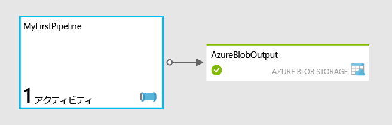

<properties
	pageTitle="Azure Data Factory を使用した初めてのパイプラインの作成"
	description="このチュートリアルでは、Azure HDInsight を使用してデータを変換するサンプル データ パイプラインを、Data Factory エディターを使用して作成する方法を示します"
	services="data-factory"
	documentationCenter=""
	authors="spelluru"
	manager="jhubbard"
	editor="monicar"/>

<tags
	ms.service="data-factory"
	ms.workload="data-services"
	ms.tgt_pltfrm="na"
	ms.devlang="na"
	ms.topic="get-started-article" 
	ms.date="07/27/2015"
	ms.author="spelluru"/>

# Azure Data Factory を使用した初めてのパイプラインの作成
> [AZURE.SELECTOR]
- [Tutorial Overview](data-factory-build-your-first-pipeline.md)
- [Using Data Factory Editor](data-factory-build-your-first-pipeline-using-editor.md)
- [Using PowerShell](data-factory-build-your-first-pipeline-using-powershell.md)
- [Using Visual Studio](data-factory-build-your-first-pipeline-using-vs.md)

この記事では、初めてのイプラインの作成と、Azure Data Factory へのデプロイについて説明します。

> [AZURE.NOTE]この記事では、Azure Data Factory サービスの概念については説明しません。サービスの詳細については、記事「[Azure Data Factory サービスの概要](data-factory-introduction.md)」を参照してください。

## チュートリアルの概要
このチュートリアルでは、初めてパイプラインを稼動させるために必要な手順を示します。パイプラインを作成し、必要なすべてのリソースを最初から指定します。

最初から作成せずにすばやく Data Factory のさまざまな機能を調べたい場合は、Azure プレビュー ポータルで提供されているサンプルを使用できます。Azure プレビュー ポータルを使用する使用例に基づくサンプルのデプロイ方法については、「[Azure Data Factory の更新: サンプルの簡略化されたデプロイ](http://azure.microsoft.com/blog/2015/04/24/azure-data-factory-update-simplified-sample-deployment/)」を参照してください。

## 前提条件
このチュートリアルを開始する前に、以下の前提条件を満たしている必要があります。

1.	**Azure サブスクリプション** - Azure サブスクリプションがない場合は、無料試用版アカウントを数分で作成することができます。無料試用版アカウントの取得方法については、「[無料試用版](http://azure.microsoft.com/pricing/free-trial/)」を参照してください。

2.	**Azure Storage** – このチュートリアルのデータを格納するには、Azure ストレージ アカウントを使用します。Azure ストレージ アカウントがない場合は、「[ストレージ アカウントの作成](../storage-create-storage-account/#create-a-storage-account)」を参照してください。ストレージ アカウントを作成した後は、ストレージにアクセスするために使用するアカウント キーを取得する必要があります。「[ストレージ アクセス キーの表示、コピーおよび再生成](../storage-create-storage-account/#view-copy-and-regenerate-storage-access-keys)」を参照してください。

## このチュートリアルの内容	
Azure Data Factory では、データ駆動型ワークフローとしてデータ移動タスクやデータ処理タスクを構成できます。HDInsight を使用して毎月 Web ログを変換および分析する初めてのパイプラインを作成する方法を説明します。

このチュートリアルでは、以下の手順を実施します。

1.	データ ファクトリ を作成する
2.	次のリンクされたサービスを作成します。
	1.	**Azure ストレージ アカウント** – Azure ストレージ アカウントは、オンデマンド HDInsight クラスターによって使用されるファイルを格納するために使用されます。
	2.	**オンデマンド HDInsight クラスター** – HDInsight クラスターは、オンデマンドで開始されてデータを変換および分析します。
3.	出力データセットを作成します。 
4.	Hive スクリプトを実行して出力データセットに結果を格納するパイプラインを作成します。Hive スクリプトは、まず、外部テーブルを作成し、Azure BLOB ストレージに格納されている未加工の Web ログ データを参照します。次に、年と月で未加工データを分割します。

**MyFirstPipeline** という名前の最初のパイプラインは、Hive アクティビティを使用して、HDInsight クラスターの一部としてデプロイされる Web ログを変換および分析し、**/HdiSamples/WebsiteLogSampleData/SampleLog/** に格納します。

Hive スクリプトが実行した後、結果は Azure BLOB ストレージ コンテナー **data/partitioneddata** に格納されます。

**AzureBlobOutput** データセットで定義されている可用性により、Hive アクティビティの実行頻度が決まります。このチュートリアルでは、これは毎月に設定されています。

## チュートリアルの Azure Storage を準備する
チュートリアルを開始する前に、チュートリアルに必要なファイルで Azure Storage を準備する必要があります。

1. メモ帳を起動し、次のテキストを貼り付け、**partitionweblogs.hql** という名前でハード ドライブの C:\\adfgettingstarted フォルダーに保存します。この Hive スクリプトは、2 つの外部テーブル **WebLogsRaw** と **WebLogsPartitioned** を作成します。

	> [AZURE.IMPORTANT]最後の行の **storageaccountname** は、実際のストレージ アカウントの名前に置き換えます。

		set hive.exec.dynamic.partition.mode=nonstrict;

		DROP TABLE IF EXISTS WebLogsRaw; 
		CREATE EXTERNAL TABLE WebLogsRaw (
		  date  date,
		  time  string,
		  ssitename string,
		  csmethod  string,
		  csuristem  string,
		  csuriquery string,
		  sport int,
		  susername string,
		  cipcsUserAgent string,
		  csCookie string,
		  csReferer string,
		  cshost  string,
		  scstatus  int,
		  scsubstatus  int,
		  scwin32status  int,
		  scbytes int,
		  csbytes int,
		  timetaken int
		)
		ROW FORMAT DELIMITED FIELDS TERMINATED BY ' '
		LINES TERMINATED BY '\n' 
		LOCATION '/HdiSamples/WebsiteLogSampleData/SampleLog/'
		tblproperties ("skip.header.line.count"="2");
		
		DROP TABLE IF EXISTS WebLogsPartitioned ; 
		create external table WebLogsPartitioned (  
		  date  date,
		  time  string,
		  ssitename string,
		  csmethod  string,
		  csuristem  string,
		  csuriquery string,
		  sport int,
		  susername string,
		  cipcsUserAgent string,
		  csCookie string,
		  csReferer string,
		  cshost  string,
		  scstatus  int,
		  scsubstatus  int,
		  scwin32status  int,
		  scbytes int,
		  csbytes int,
		  timetaken int
		)
		partitioned by ( year int, month int)
		ROW FORMAT DELIMITED FIELDS TERMINATED BY ',' 
		STORED AS TEXTFILE 
		LOCATION '${hiveconf:partitionedtable}';

		INSERT INTO TABLE WebLogsPartitioned  PARTITION( year , month) 
		SELECT
		  date,
		  time,
		  ssitename,
		  csmethod,
		  csuristem,
		  csuriquery,
		  sport,
		  susername,
		  cipcsUserAgent,
		  csCookie,
		  csReferer,
		  cshost,
		  scstatus,
		  scsubstatus,
		  scwin32status,
		  scbytes,
		  csbytes,
		  timetaken,
		  year(date),
		  month(date)
		FROM WebLogsRaw

	 
 
2. チュートリアル用に Azure Storage を準備するには:
	1. [最新バージョンの **AzCopy**](http://aka.ms/downloadazcopy) または[最新のプレビュー バージョン](http://aka.ms/downloadazcopypr)をダウンロードします。ユーティリティを使用する手順については、[AzCopy を使用する方法](../storage/storage-use-azcopy.md)に関する記事を参照してください。
	2. AzCopy をインストールした後は、コマンド プロンプトで次のコマンドを実行してシステム パスに追加できます。 
	
			set path=%path%;C:\Program Files (x86)\Microsoft SDKs\Azure\AzCopy
	

	3. c:\\adfgettingstarted フォルダーに移動し、次のコマンドを実行して Hive .HQL ファイルをストレージ アカウントにアップロードします。**<StorageAccountName>** はストレージ アカウントの名前に、**<Storage Key>** はストレージ アカウント キーに置き換えます。

			AzCopy /Source:. /Dest:https://<StorageAccountName>.blob.core.windows.net/script /DestKey:<Storage Key>
	4. ファイルが正常にアップロードされると、AzCopy から次の出力が表示されます。
	
			Finished 1 of total 1 file(s).
			[2015/06/15 15:47:13] Transfer summary:
			-----------------
			Total files transferred: 1
			Transfer successfully:   1
			Transfer skipped:        0
			Transfer failed:         0
			Elapsed time:            00.00:00:01

以下の手順を実行します。

- Azure ポータルの一部である Data Factory エディターを使用してチュートリアルを実行するには、上部にある「[Data Factory エディターの使用](data-factory-build-your-first-pipeline-using-editor.md)」というリンクをクリックします。
- Azure PowerShell を使用してチュートリアルを実行するには、上部にある「[PowerShell の使用](data-factory-build-your-first-pipeline-using-powershell.md)」というリンクをクリックします。
- Visual Studio を使用してチュートリアルを実行するには、上部にある「[Visual Studio の使用](data-factory-build-your-first-pipeline-using-vs.md)」というリンクをクリックします。 

<!---HONumber=August15_HO7-->