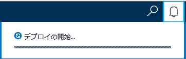
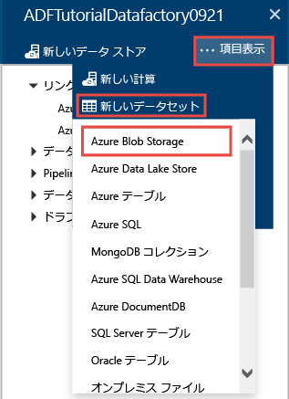
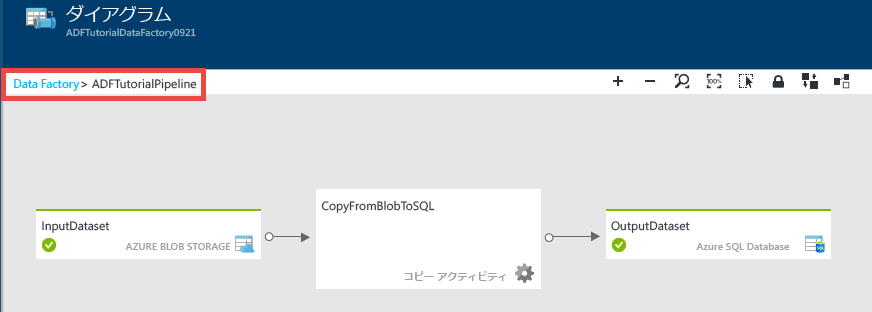
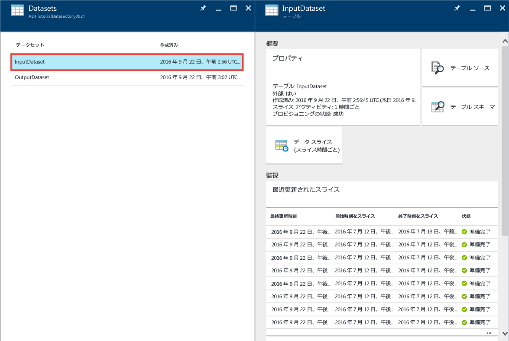
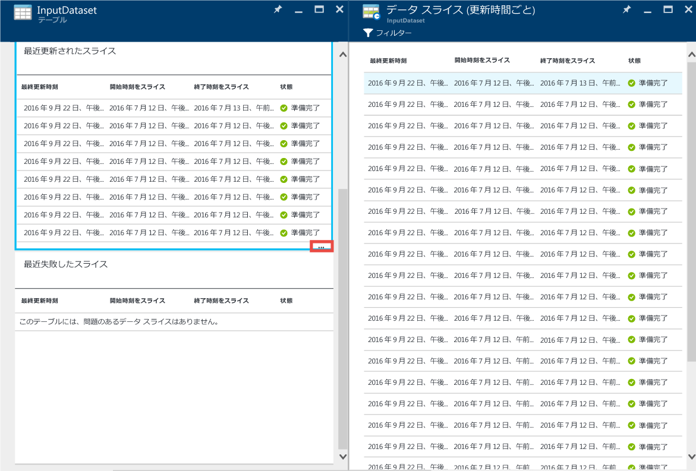
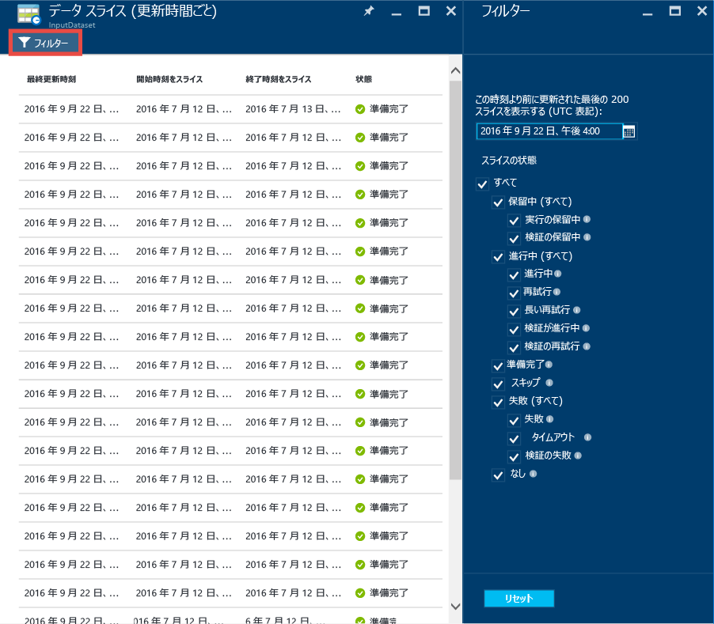
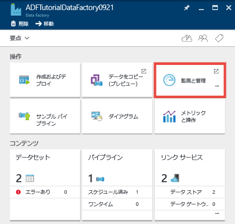
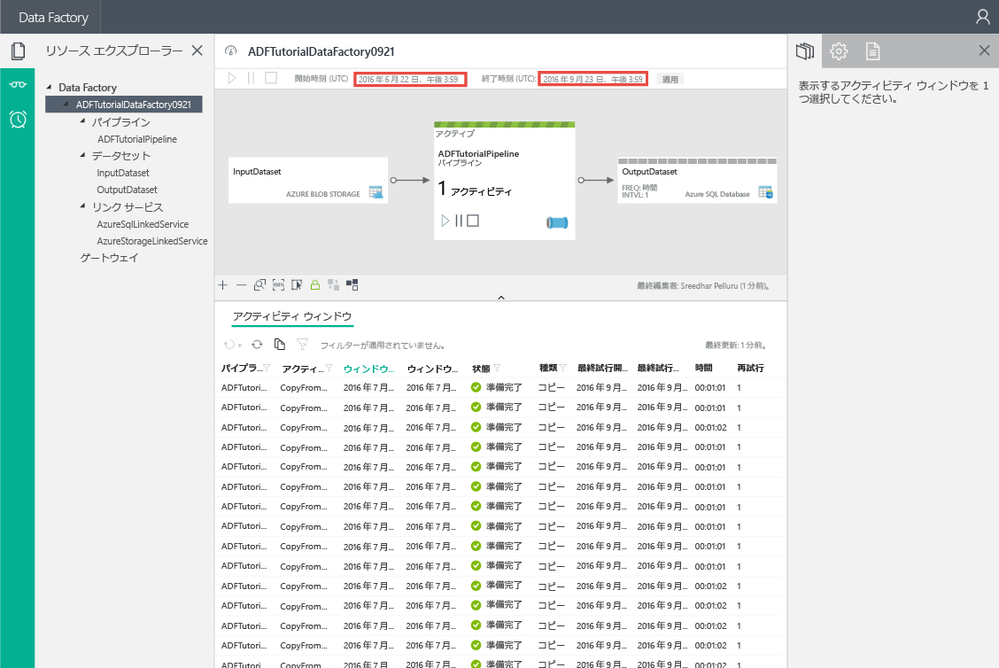
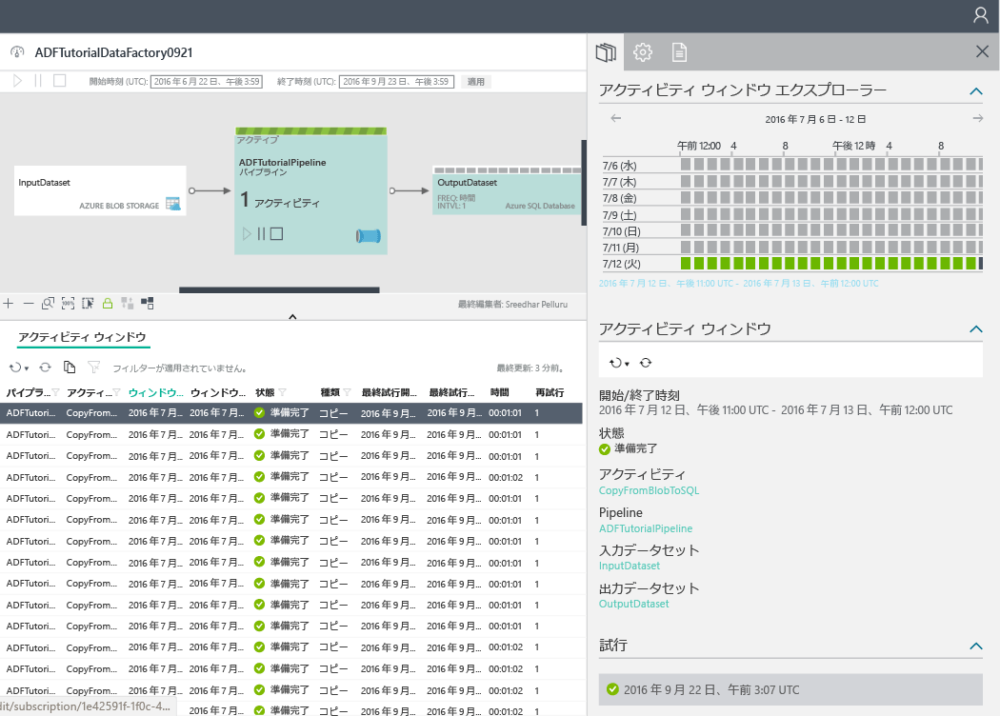

<properties 
	pageTitle="チュートリアル: コピー アクティビティがあるパイプラインを Azure Portal で作成する | Microsoft Azure" 
	description="このチュートリアルでは、Azure ポータルで Data Factory エディターを使用して、コピー アクティビティを含む Azure Data Factory パイプラインを作成します。" 
	services="data-factory" 
	documentationCenter="" 
	authors="spelluru" 
	manager="jhubbard" 
	editor="monicar"/>

<tags 
	ms.service="data-factory" 
	ms.workload="data-services" 
	ms.tgt_pltfrm="na" 
	ms.devlang="na" 
	ms.topic="get-started-article" 
	ms.date="09/16/2016" 
	ms.author="spelluru"/>

# チュートリアル: コピー アクティビティがあるパイプラインを Azure Portal で作成する
> [AZURE.SELECTOR]
- [概要と前提条件](data-factory-copy-data-from-azure-blob-storage-to-sql-database.md)
- [Azure ポータル](data-factory-copy-activity-tutorial-using-azure-portal.md)
- [Visual Studio](data-factory-copy-activity-tutorial-using-visual-studio.md)
- [PowerShell](data-factory-copy-activity-tutorial-using-powershell.md)
- [REST API](data-factory-copy-activity-tutorial-using-rest-api.md)
- [.NET API](data-factory-copy-activity-tutorial-using-dotnet-api.md)
- [コピー ウィザード](data-factory-copy-data-wizard-tutorial.md)

このチュートリアルでは、Azure Portal を使用して Azure データ ファクトリを作成および監視する方法について説明しています。データ ファクトリのパイプラインは、コピー アクティビティを使用して、Azure Blob Storage から Azure SQL Database にデータをコピーします。

このチュートリアルの一部として実行する手順を次に示します。

手順 | Description
-----| -----------
[Azure Data Factory を作成する](#create-data-factory) | この手順では、**ADFTutorialDataFactory** という名前の Azure データ ファクトリを作成します。  
[リンクされたサービスの作成](#create-linked-services) | この手順では、**AzureStorageLinkedService** と **AzureSqlLinkedService** の 2 つのリンクされたサービスを作成します。  AzureStorageLinkedService は Azure ストレージを、AzureSqlLinkedService は Azure SQL データベースを、それぞれ ADFTutorialDataFactory にリンクします。パイプラインの入力データは、Azure BLOB ストレージの BLOB コンテナーにあります。また出力データは、Azure SQL Database のテーブルに格納されます。そのため、これら 2 つのデータ ストアをリンクされたサービスとしてデータ ファクトリに追加します。      
[入力データセットと出力データセットを作成する](#create-datasets) | 前の手順では、入力/出力データを含むデータ ストアを参照する、リンクされたサービスを作成しました。この手順では、**InputDataset** と **OutputDataset** の 2 つのデータセットを定義します。これらはデータ ストアに格納されている入力/出力データを表します。  InputDataset にはソース データがある BLOB が含まれた BLOB コンテナーを指定し、OutputDataset には出力データが格納される SQL テーブルを指定します。また、構造、可用性、ポリシーなど、他のプロパティも指定します。 
[パイプラインを作成する。](#create-pipeline) | この手順では、**ADFTutorialPipeline** という名前のパイプラインを ADFTutorialDataFactory に作成します。  Azure BLOB から Azure SQL 出力テーブルに入力データをコピーする**コピー アクティビティ**を、パイプラインに追加します。コピー アクティビティにより、Azure Data Factory でデータ移動が実行されます。このアクティビティは、安全で信頼性の高いスケーラブルな方法によってさまざまなデータ ストア間でデータをコピーできる、グローバルに利用可能なサービスによって動作します。コピー アクティビティの詳細については、「[データ移動アクティビティ](data-factory-data-movement-activities.md)」をご覧ください。 
[パイプラインの監視](#monitor-pipeline) | この手順では、Azure ポータルを使用して、入力テーブルと出力テーブルのスライスを監視します。

> [AZURE.IMPORTANT] 
「[チュートリアルの概要](data-factory-copy-data-from-azure-blob-storage-to-sql-database.md)」という記事を参照し、前提条件の手順を完了してから、このチュートリアルを実行してください。

## データ ファクトリの作成
この手順では、Azure ポータルを使用して、**ADFTutorialDataFactory** という名前の Azure データ ファクトリを作成します。

1.	[Azure Portal](https://portal.azure.com/) にログインした後、**[新規]** をクリックして **[Intelligence + Analytics (インテリジェンス + 分析)]** を選択し、**[Data Factory]** をクリックします。

	![[新規] -> [DataFactory]](./media/data-factory-copy-activity-tutorial-using-azure-portal/NewDataFactoryMenu.png)

6. **[新しいデータ ファクトリ]** ブレードで以下の手順を実行します。
	1. **[名前]** に「**ADFTutorialDataFactory**」と入力します。
	
  		![[新しいデータ ファクトリ] ブレード](./media/data-factory-copy-activity-tutorial-using-azure-portal/getstarted-new-data-factory.png)

		Azure データ ファクトリの名前は**グローバルに一意**にする必要があります。次のエラーが発生した場合は、データ ファクトリの名前を変更して (yournameADFTutorialDataFactory など) 作成し直してください。Data Factory アーティファクトの名前付け規則については、「[Azure Data Factory - 名前付け規則](data-factory-naming-rules.md)」を参照してください。
	
			Data factory name “ADFTutorialDataFactory” is not available  
	 
		
	2. Azure **サブスクリプション**を選択します。
	3. リソース グループについて、次の手順のいずれかを行います。
		1. **[Use existing (既存のものを使用)]** を選択し、ドロップダウン リストから既存のリソース グループを選択します。
		2. **[新規作成]** を選択し、リソース グループの名前を入力します。
	
			このチュートリアルの一部の手順は、**ADFTutorialResourceGroup** という名前のリソース グループを使用することを前提としています。リソース グループの詳細については、[リソース グループを使用した Azure のリソースの管理](../resource-group-overview.md)に関するページを参照してください。
	4. データ ファクトリの**場所**を選択します。Data Factory サービスによってサポートされているリージョンのみ、ドロップダウン リストに表示されます。
	5. **[スタート画面にピン留めする]** を選択します。
	6. **[作成]** をクリックします。

		> [AZURE.IMPORTANT] Data Factory インスタンスを作成するには、サブスクリプション/リソース グループ レベルで [Data Factory の共同作業者](../active-directory/role-based-access-built-in-roles.md/#data-factory-contributor)ロールのメンバーである必要があります。
		>  
		>  データ ファクトリの名前は今後、DNS 名として登録される可能性があるため、一般ユーザーに表示される場合があります。
9.  状態/通知メッセージを表示するには、ツール バーのベル アイコンをクリックします。

	
10. 作成が完了すると、図に示されているような **[Data Factory]** ブレードが表示されます。

    

## リンクされたサービスの作成
リンクされたサービスは、データ ストアまたはコンピューティング サービスを Azure Data Factory にリンクします。コピー アクティビティでサポートされているすべてのソースとシンクについては、[サポートされているデータ ストア](data-factory-data-movement-activities.md##supported-data-stores-and-formats)に関する記事を参照してください。Data Factory でサポートされているコンピューティング サービスの一覧については、「[コンピューティングのリンクされたサービス](data-factory-compute-linked-services.md)」を参照してください。このチュートリアルでは、コンピューティング サービスは使用しません。

この手順では、**AzureStorageLinkedService** と **AzureSqlLinkedService** の 2 つのリンクされたサービスを作成します。リンクされたサービス AzureStorageLinkedService は Azure ストレージ アカウントを、AzureSqlLinkedService は Azure SQL Database を **ADFTutorialDataFactory** にリンクします。このチュートリアルの後半では、AzureStorageLinkedService 内の BLOB コンテナーから AzureSqlLinkedService 内の SQL テーブルにデータをコピーするパイプラインを作成します。

### Azure ストレージ アカウント用にリンクされたサービスを作成する
1.	**[Data Factory]** ブレードで、**[作成およびデプロイ]** タイルをクリックして、データ ファクトリの**エディター**を起動します。

	![[作成とデプロイ] タイル](./media/data-factory-copy-activity-tutorial-using-azure-portal/getstarted-author-deploy-tile.png)
5. **エディター**のツール バーで **[新しいデータ ストア]** ボタンをクリックし、ドロップダウン メニューから **[Azure Storage]** を選択します。Azure Storage のリンクされたサービスを作成するための JSON テンプレートが右側のウィンドウに表示されます。

	![エディターの [新しいデータ ストア] ボタン](./media/data-factory-copy-activity-tutorial-using-azure-portal/getstarted-editor-newdatastore-button.png)
6. `<accountname>` と `<accountkey>` を Azure ストレージ アカウントの名前とキーの値に置き換えます。

	
6. ツール バーの **[デプロイ]** をクリックします。これで、デプロイした **AzureStorageLinkedService** がツリー ビューに表示されます。

	

> [AZURE.NOTE]
JSON プロパティの詳細については、[Azure BLOB に対するデータの移動](data-factory-azure-blob-connector.md#azure-storage-linked-service)に関するページを参照してください。

### Azure SQL Database 用にリンクされたサービスを作成する
1. **Data Factory エディター**のツール バーで **[新しいデータ ストア]** ボタンをクリックし、ドロップダウン メニューから **[Azure SQL Database]** を選択します。Azure SQL のリンクされたサービスを作成するための JSON テンプレートが右側のウィンドウに表示されます。
2. `<servername>`、`<databasename>`、`<username>@<servername>`、`<password>` を、Azure SQL のサーバー名、データベース名、ユーザー アカウント、パスワードに置き換えます。
3. ツール バーの **[デプロイ]** をクリックして、**AzureSqlLinkedService** を作成してデプロイします。
4. **AzureSqlLinkedService** がツリー ビューに表示されることを確認します。

> [AZURE.NOTE]
JSON プロパティの詳細については、[Azure SQL Database に対するデータの移動](data-factory-azure-sql-connector.md#azure-sql-linked-service-properties)に関するページを参照してください。

## データセットを作成する
前の手順では、**AzureStorageLinkedService** と **AzureSqlLinkedService** というリンクされたサービスを作成し、Azure ストレージ アカウントと Azure SQL データベースを **ADFTutorialDataFactory** というデータ ファクトリにリンクしました。この手順では、**InputDataset** と **OutputDataset** の 2 つのデータセットを定義します。これらはそれぞれ、AzureStorageLinkedService と AzureSqlLinkedService が参照するデータ ストアに格納されている入力/出力データを表します。InputDataset にはソース データがある BLOB が含まれた BLOB コンテナーを指定し、OutputDataset には出力データが格納される SQL テーブルを指定します。

### 入力データセットの作成 
この手順では、リンクされたサービス **AzureStorageLinkedService** が表す Azure Storage 内の BLOB コンテナーをポイントする **InputDataset** という名前のデータセットを作成します。

1. Data Factory の**エディター**で、**[...More (...詳細)]**、**[新しいデータセット]** の順にクリックし、ドロップダウン メニューから **[Azure BLOB ストレージ]** を選択します。

	
2. 右側のウィンドウの JSON スクリプトを、次の JSON スニペットに置き換えます。

		{
		  "name": "InputDataset",
		  "properties": {
		    "structure": [
		      {
		        "name": "FirstName",
		        "type": "String"
		      },
		      {
		        "name": "LastName",
		        "type": "String"
		      }
		    ],
		    "type": "AzureBlob",
		    "linkedServiceName": "AzureStorageLinkedService",
		    "typeProperties": {
		      "folderPath": "adftutorial/",
			  "fileName": "emp.txt",
		      "format": {
		        "type": "TextFormat",
		        "columnDelimiter": ","
		      }
		    },
		    "external": true,
		    "availability": {
		      "frequency": "Hour",
		      "interval": 1
		    }
		  }
		}
		
     以下の点に注意してください。
	
	- dataset の **type** は **AzureBlob** に設定されています。
	- **linkedServiceName** は **AzureStorageLinkedService** に設定されています。このリンクされたサービスは手順 2. で作成しました。
	- **folderPath** が **adftutorial** コンテナーに設定されています。**fileName** プロパティを使用して、フォルダー内の BLOB の名前を指定することもできます。BLOB の名前を指定しない場合、コンテナー内のすべての BLOB からのデータが入力データと見なされます。
	- format の **type** が **TextFormat** に設定されています。
	- テキスト ファイル内に 2 つのフィールド (**FirstName** と **LastName**) があり、コンマ (**columnDelimiter**) で区切られています。
	- **availability** が **hourly** に設定されています (**frequency** は **hour**、**interval** は **1** に設定されています)。そのため、Data Factory は、指定された BLOB コンテナー (**adftutorial**) のルート フォルダーにある入力データを 1 時間ごとに検索します。
	
	**入力**データセット用に **fileName** を指定しない場合、入力フォルダー (**folderPath**) のすべてのファイルまたは BLOB が入力と見なされます。JSON で fileName を指定した場合は、指定されたファイル/BLOB のみが入力と見なされます。
 
	**output table** に **fileName** を指定しない場合、**folderPath** に生成されるファイルには Data.&lt;Guid&gt;.txt という形式で名前が付けられます (例: Data.0a405f8a-93ff-4c6f-b3be-f69616f1df7a.txt)。

	**folderPath** と **fileName** を **SliceStart** 時刻に基づいて動的に設定するには、**partitionedBy** プロパティを使用します。次の例では、folderPath に SliceStart (処理されるスライスの開始時刻) の年、月、日を使用し、fileName に SliceStart の時間を使用します。たとえば、スライスが 2016-09-20T08:00:00 に生成されている場合、folderName は wikidatagateway/wikisampledataout/2016/09/20 に設定され、fileName は 08.csv に設定されます。

			"folderPath": "wikidatagateway/wikisampledataout/{Year}/{Month}/{Day}",
	        "fileName": "{Hour}.csv",
	        "partitionedBy": 
	        [
	        	{ "name": "Year", "value": { "type": "DateTime", "date": "SliceStart", "format": "yyyy" } },
	            { "name": "Month", "value": { "type": "DateTime", "date": "SliceStart", "format": "MM" } }, 
	            { "name": "Day", "value": { "type": "DateTime", "date": "SliceStart", "format": "dd" } }, 
	            { "name": "Hour", "value": { "type": "DateTime", "date": "SliceStart", "format": "hh" } } 
	        ],
2. ツール バーの **[デプロイ]** をクリックし、**InputDataset** データセットを作成してデプロイします。ツリー ビューに **InputDataset** が表示されることを確認します。

> [AZURE.NOTE]
JSON プロパティの詳細については、[Azure BLOB に対するデータの移動](data-factory-azure-blob-connector.md#azure-blob-dataset-type-properties)に関するページを参照してください。

### 出力データセットの作成
手順のこの部分では、**OutputDataset** という名前の出力データセットを作成します。このデータセットは、**AzureSqlLinkedService** で表される Azure SQL Database 内の SQL テーブルをポイントします。

1. Data Factory の**エディター**で、**[...More (...詳細)]**、**[新しいデータセット]** の順にクリックし、ドロップダウン メニューから **[Azure SQL]** を選択します。
2. 右側のウィンドウの JSON スクリプトを、次の JSON スニペットに置き換えます。

		{
		  "name": "OutputDataset",
		  "properties": {
		    "structure": [
		      {
		        "name": "FirstName",
		        "type": "String"
		      },
		      {
		        "name": "LastName",
		        "type": "String"
		      }
		    ],
		    "type": "AzureSqlTable",
		    "linkedServiceName": "AzureSqlLinkedService",
		    "typeProperties": {
		      "tableName": "emp"
		    },
		    "availability": {
		      "frequency": "Hour",
		      "interval": 1
		    }
		  }
		}
		
     以下の点に注意してください。
	
	- dataset の **type** が **AzureSQLTable** に設定されています。
	- **linkedServiceName** が **AzureSqlLinkedService** (手順 2. で作成した、リンクされたサービス) に設定されています。
	- **tablename** は **emp** に設定されています。
	- データベース内の emp テーブルには、**ID**、**FirstName**、**LastName** の 3 つの列があります。ID は ID 列であるため、ここで指定する必要があるのは **FirstName** と **LastName** のみです。
	- **availability** が **hourly** に設定されています (**frequency** は **hour**、**interval** は **1** に設定されています)。Data Factory サービスは、Azure SQL Database 内の **emp** テーブルに 1 時間ごとに出力データ スライスを生成します。

3. ツール バーの **[デプロイ]** をクリックし、**OutputDataset** データセットを作成してデプロイします。ツリー ビューに **OutputDataset** が表示されることを確認します。

> [AZURE.NOTE]
JSON プロパティの詳細については、[Azure SQL Database に対するデータの移動](data-factory-azure-sql-connector.md#azure-sql-linked-service-properties)に関するページを参照してください。

## パイプラインの作成
この手順では、**InputDataset** を入力、**OutputDataset** を出力として使用する**コピー アクティビティ**を持つパイプラインを作成します。

1. **Data Factory エディター**のツール バーで **[新しいパイプライン]** をクリックします。ボタンが表示されない場合は、ツール バーの **[...] \(省略記号)** をクリックします。または、ツリー ビューの **[パイプライン]** を右クリックして、**[新しいパイプライン]** をクリックする方法もあります。
2. 右側のウィンドウの JSON スクリプトを、次の JSON スニペットに置き換えます。
		
		{
		  "name": "ADFTutorialPipeline",
		  "properties": {
		    "description": "Copy data from a blob to Azure SQL table",
		    "activities": [
		      {
		        "name": "CopyFromBlobToSQL",
		        "type": "Copy",
		        "inputs": [
		          {
		            "name": "InputDataset"
		          }
		        ],
		        "outputs": [
		          {
		            "name": "OutputDataset"
		          }
		        ],
		        "typeProperties": {
		          "source": {
		            "type": "BlobSource"
		          },
		          "sink": {
		            "type": "SqlSink",
		            "writeBatchSize": 10000,
		            "writeBatchTimeout": "60:00:00"
		          }
		        },
		        "Policy": {
		          "concurrency": 1,
		          "executionPriorityOrder": "NewestFirst",
		          "retry": 0,
		          "timeout": "01:00:00"
		        }
		      }
		    ],
		    "start": "2016-07-12T00:00:00Z",
		    "end": "2016-07-13T00:00:00Z"
		  }
		} 

	以下の点に注意してください。

	- activities セクションに、**type** が **Copy** に設定されたアクティビティが 1 つだけあります。
	- アクティビティの入力を **InputDataset** に設定し、出力を **OutputDataset** に設定します。
	- **typeProperties** セクションでは、ソースの種類として **BlobSource** が指定され、シンクの種類として **SqlSink** が指定されています。

	**start** プロパティの値を現在の日付に置き換え、**end** プロパティの値を翌日の日付に置き換えます。日付の部分のみを指定し、時刻の部分をスキップすることもできます。たとえば、"2016-02-03" と "2016-02-03T00:00:00Z" は同じです。
	
	start と end の日時は、いずれも [ISO 形式](http://en.wikipedia.org/wiki/ISO_8601)である必要があります たとえば、2016-10-14T16:32:41Z とします。**end** の時刻は省略可能ですが、このチュートリアルでは使用します。
	
	**end** プロパティの値を指定しない場合、"**start + 48 時間**" として計算されます。パイプラインを無期限に実行する場合は、**9999-09-09** を **end** プロパティとして指定します。
	
	前の例では、各データ スライスが 1 時間ごとに生成されるため、データ スライスは 24 個になります。
	
4. ツール バーの **[デプロイ]** をクリックし、**ADFTutorialPipeline** を作成してデプロイします。ツリー ビューにパイプラインが表示されることを確認します。
5. ここで、**[X]** をクリックして **[エディター]** ブレードを閉じます。もう一度 **[X]** をクリックし、**ADFTutorialDataFactory** 用の **Data Factory** ホーム ページを表示します。

**お疲れさまでした。** これで、Azure Data Factory、リンクされたサービス、テーブル、およびパイプラインの作成と、パイプラインのスケジュール設定が完了しました。
 
### ダイアグラム ビューでの Data Factory の表示 
1. **[Data Factory]** ブレードで、**[ダイアグラム]** をクリックします。

	![[Data Factory] ブレードの [ダイアグラム] タイル](./media/data-factory-copy-activity-tutorial-using-azure-portal/getstarted-datafactoryblade-diagramtile.png)
2. 以下の図のようなダイアグラムが表示されるはずです。

	

	パイプラインとテーブルは、拡大、縮小、100% に拡大、ウィンドウのサイズに合わせて大きさを変更、自動的に配置などの表示が可能です。また、系列情報を表示 (選択した項目の上位項目や下位項目を強調表示) することもできます。オブジェクト (入力/出力テーブルまたはパイプライン) をダブルクリックすると、そのオブジェクトのプロパティを表示できます。
3. ダイアグラム ビューで **[ADFTutorialPipeline]** を右クリックして **[パイプラインを開く]** をクリックします。

	
4. パイプライン内のアクティビティに加えて、アクティビティの入力データセットと出力データセットが表示されます。このチュートリアルでは、パイプラインのアクティビティ (コピー アクティビティ) は、入力データセットとして InputDataset、出力データセットとして OutputDataset が含まれたもの 1 つのみです。

	
5. 左上にある階層リンクで **[Data Factory]** をクリックして、ダイアグラム ビューに戻ります。ダイアグラム ビューには、すべてのパイプラインが表示されます。この例では 1 つのパイプラインのみ作成しました。
 

## パイプラインを監視する
この手順では、Azure ポータルを使用して、Azure データ ファクトリの状況を監視します。

### ダイアグラム ビューを使用してパイプラインを監視する

1. **[X]** をクリックして **[ダイアグラム]** ビューを閉じ、データ ファクトリ用の Data Factory ホーム ページを表示します。Web ブラウザーを閉じている場合、次の手順を行います。
	2. [Azure Portal](https://portal.azure.com/) に移動します。
	2. **スタート画面**の **ADFTutorialDataFactory** をダブルクリックします。(または) 左側のメニューにある**データ ファクトリ**をクリックし、ADFTutorialDataFactory を探します。
3. 作成したテーブルの数と名前、およびパイプラインの名前がブレードに表示されます。

	
4. **[データセット]** タイルをクリックします。
5. **[データセット]** ブレードで、**[InputDataset]** をクリックします。このデータセットは、**ADFTutorialPipeline** の入力データセットです。

	
5. **[...] (省略記号)** をクリックし、すべてのデータ スライスを表示します。

	

	現在の時刻までのデータ スライスはすべて **[準備完了]** になっています。これは、**emp.txt** ファイルが BLOB コンテナー **adftutorial\\input** 内に常に存在しているためです。下部の **[最近失敗したスライス]** セクションにスライスが表示されていないことを確認します。

	**[最近更新したスライス]** と **[最近失敗したスライス]** の一覧は、どちらも **[最終更新時刻]** で並べ替えられます。
    
	スライスをフィルター処理するには、ツール バーの **[フィルター]** をクリックします。
	
	
6. **[データセット]** ブレードが表示されるまでブレードを閉じます。**[OutputDataset]** をクリックします。このデータセットは、**ADFTutorialPipeline** の出力データセットです。

	![[データセット] ブレード](./media/data-factory-copy-activity-tutorial-using-azure-portal/getstarted-datasets-blade.png)
6. 次の図に示すように、**[OutputDataset]** ブレードが表示されます。

	![[テーブル] ブレード](./media/data-factory-copy-activity-tutorial-using-azure-portal/getstarted-table-blade.png)
7. 現在の時刻までのデータ スライスが既に生成されており、**準備完了**になっています。下部の **[問題のあるスライス]** セクションにはスライスが表示されていません。
8. **[...] (省略記号)** をクリックし、すべてのスライスを表示します。

	![[データ スライス] ブレード](./media/data-factory-copy-activity-tutorial-using-azure-portal/getstarted-dataslices-blade.png)
9. 一覧で任意のデータ スライスをクリックすると、**[データ スライス]** ブレードが表示されます。

	![[データ スライス] ブレード](./media/data-factory-copy-activity-tutorial-using-azure-portal/getstarted-dataslice-blade.png)
  
	スライスが **[準備完了]** 状態でない場合、現在のスライスの実行をブロックしている準備完了でない上位スライスが、**[準備完了でない上位スライス]** の一覧に表示されます。
11. **[データ スライス]** ブレードの下部にある一覧に、すべてのアクティビティの実行状況が表示されます。**[activity run (アクティビティの実行)]** をクリックすると、**[アクティビティの実行の詳細]** ブレードが表示されます。

	
12. **[X]** をクリックすると、すべてのブレードが閉じられ、**ADFTutorialDataFactory** のホーム ブレードに戻ります。
14. (省略可能) **ADFTutorialDataFactory** のホーム ページで **[パイプライン]** をクリックし、**[パイプライン]** ブレードの **[ADFTutorialPipeline]** をクリックして、入力テーブル (**Consumed**) または出力テーブル (**Produced**) を表示します。
15. **SQL Server Management Studio** を起動し、Azure SQL Database に接続して、データベース内の **emp** テーブルに行が挿入されていることを確認します。

	

### 監視と管理アプリを使用してパイプラインを監視する
パイプラインは、監視と管理アプリを使用して監視することもできます。このアプリケーションの使い方の詳細については、[監視と管理アプリを使用した Azure Data Factory パイプラインの監視と管理](data-factory-monitor-manage-app.md)に関する記事を参照してください。

1. データ ファクトリのホーム ページの **[監視と管理]** タイルをクリックします。

	
2. **監視と管理アプリケーション**が表示されます。パイプラインの開始時刻 (2016 年 7 月 12 日) と終了時刻 (2016 年 7 月 13 日) が含まれるように、**[開始時刻]** と **[終了時刻]** を変更し、**[適用]** をクリックします。

	
3. **[アクティビティ ウィンドウ]** 一覧でアクティビティ ウィンドウを選択し、詳細を確認します。

## 概要 
このチュートリアルでは、Azure Data Factory を作成し、Azure BLOB から Azure SQL Database にデータをコピーしました。また、Azure ポータルを使用して、データ ファクトリ、リンクされたサービス、データセット、パイプラインを作成しました。以下は、このチュートリアルで実行した手順の概要です。

1.	Azure **データ ファクトリ**を作成しました。
2.	次の**リンクされたサービス**を作成しました。
	1. 入力データを保持する Azure ストレージ アカウントをリンクするための、**Azure Storage** のリンクされたサービス。
	2. 出力データを保持する Azure SQL データベースをリンクするための、**Azure SQL** のリンクされたサービス。
3.	パイプラインの入力データと出力データを記述する**データセット**を作成しました。
4.	ソースとして **BlobSource**、シンクとして **SqlSink** を持つ**コピー アクティビティ**がある**パイプライン**を作成しました。

## 関連項目
| トピック | Description |
| :---- | :---- |
| [データ移動アクティビティ](data-factory-data-movement-activities.md) | この記事には、このチュートリアルで使用したコピー アクティビティの詳細な情報が記載されています。 |
| [スケジュールと実行](data-factory-scheduling-and-execution.md) | この記事では、Azure Data Factory アプリケーション モデルのスケジュール設定と実行の側面について説明します。 |
| [パイプライン](data-factory-create-pipelines.md) | この記事では、Azure Data Factory のパイプラインとアクティビティについて説明します。 |
| [データセット](data-factory-create-datasets.md) | この記事では、Azure Data Factory のデータセットについて説明します。
| [監視アプリを使用したパイプラインの監視と管理に関する記事](data-factory-monitor-manage-app.md) | この記事では、監視と管理アプリを使用してパイプラインを監視、管理、デバッグする方法について説明します。 

<!---HONumber=AcomDC_0928_2016-->