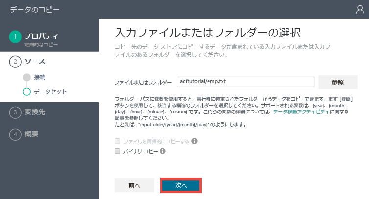
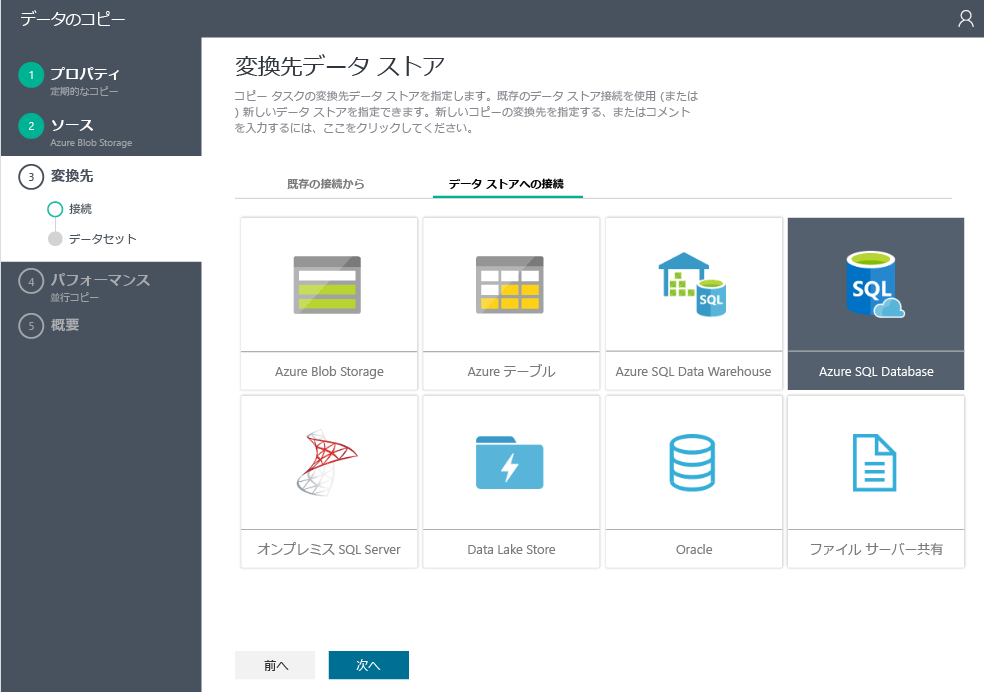
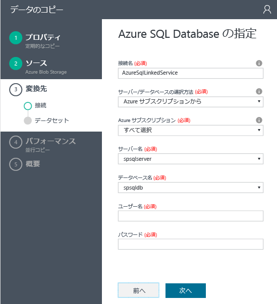
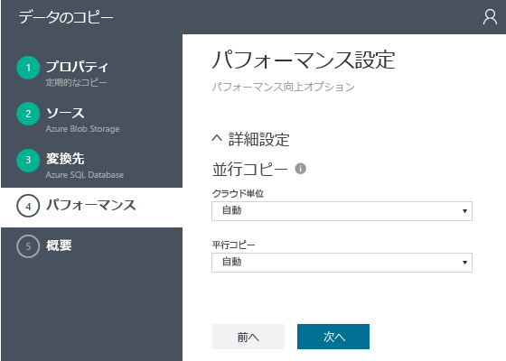
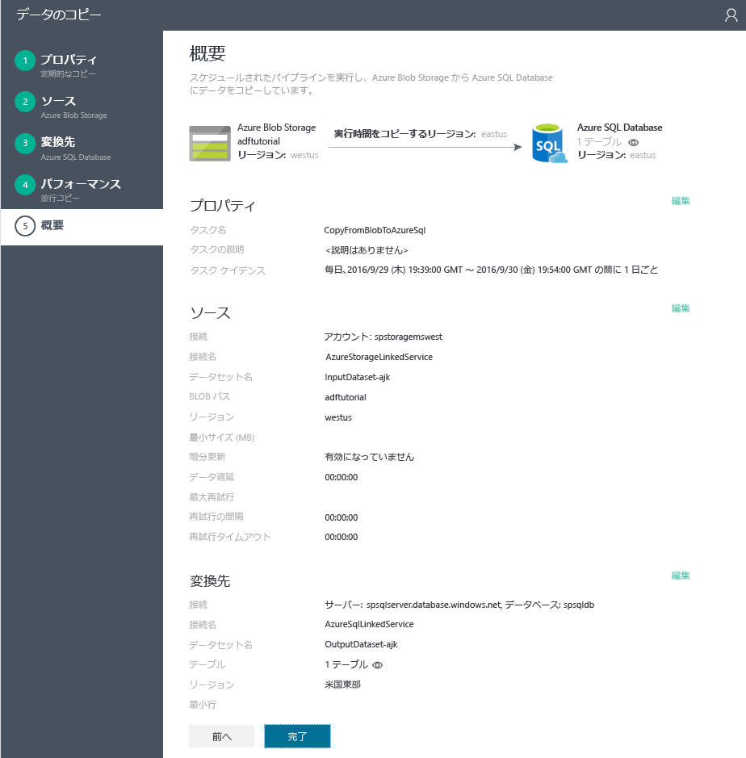

<properties 
	pageTitle="チュートリアル: コピー ウィザードを使用してパイプラインを作成する" 
	description="このチュートリアルでは、Data Factory でサポートされているコピー ウィザードを使用して、コピー アクティビティがある Azure Data Factory パイプラインを作成します。" 
	services="data-factory" 
	documentationCenter="" 
	authors="spelluru" 
	manager="jhubbard" 
	editor="monicar"/>

<tags 
	ms.service="data-factory" 
	ms.workload="data-services" 
	ms.tgt_pltfrm="na" 
	ms.devlang="na" 
	ms.topic="get-started-article" 
	ms.date="09/16/2016" 
	ms.author="spelluru"/>

# チュートリアル: コピー アクティビティがあるパイプラインを Data Factory コピー ウィザードで作成する
> [AZURE.SELECTOR]
- [概要と前提条件](data-factory-copy-data-from-azure-blob-storage-to-sql-database.md)
- [コピー ウィザード](data-factory-copy-data-wizard-tutorial.md)
- [Azure ポータル](data-factory-copy-activity-tutorial-using-azure-portal.md)
- [Visual Studio](data-factory-copy-activity-tutorial-using-visual-studio.md)
- [PowerShell](data-factory-copy-activity-tutorial-using-powershell.md)
- [REST API](data-factory-copy-activity-tutorial-using-rest-api.md)
- [.NET API](data-factory-copy-activity-tutorial-using-dotnet-api.md)

Azure Data Factory の**コピー ウィザード**を使用すると、データの取り込み/移動の要件を満たしたパイプラインがすばやく簡単に作成できます。データ移動のシナリオを想定したサンプル パイプラインを作成するときはまず、このウィザードを使用することをお勧めします。このチュートリアルでは、Azure Data Factory を作成し、コピー ウィザードを起動して、一連の手順を実行する方法を紹介しながら、データの取り込み/移動のシナリオについて詳しく説明します。ウィザードの手順が完了すると、Azure Blob Storage から Azure SQL Database にデータを複製するコピー アクティビティを含んだパイプラインが自動的に作成されます。コピー アクティビティの詳細については、「[データ移動アクティビティ](data-factory-data-movement-activities.md)」をご覧ください。

> [AZURE.IMPORTANT] このチュートリアルの作業を開始する前に、[概要と前提条件](data-factory-copy-data-from-azure-blob-storage-to-sql-database.md)の記事にひととおり目を通して大要を把握し、**前提条件**を満たしておくようにしてください。

## データ ファクトリの作成
この手順では、Azure ポータルを使用して、**ADFTutorialDataFactory** という名前の Azure データ ファクトリを作成します。

1.	[Azure Portal](https://portal.azure.com) にログインした後、左上隅の **[+ 新規]** をクリックし、**[インテリジェンス + 分析]** をクリックして **[Data Factory]** をクリックします。

	![[新規] -> [DataFactory]](./media/data-factory-copy-data-wizard-tutorial/new-data-factory-menu.png)

6. **[新しいデータ ファクトリ]** ブレードで以下の手順を実行します。
	1. **[名前]** に「**ADFTutorialDataFactory**」と入力します。Azure Data Factory の名前はグローバルに一意にする必要があります。**""ADFTutorialDataFactory" という名前の Data Factory は使用できません"** というエラーが発生した場合は、データ ファクトリの名前を変更して (yournameADFTutorialDataFactory など) 作成し直してください。Data Factory アーティファクトの名前付け規則については、「[Azure Data Factory - 名前付け規則](data-factory-naming-rules.md)」を参照してください。
	 
		
	
		> [AZURE.NOTE] データ ファクトリの名前は今後、DNS 名として登録される可能性があるため、一般ユーザーに表示される場合があります。
	2. Azure **サブスクリプション**を選択します。
	3. リソース グループについて、次の手順のいずれかを行います。
		1. **[既存のものを使用]** を選択し、既存のリソース グループを選択します。
		2. **[新規作成]** を選択し、リソース グループの名前を入力します。

			このチュートリアルの一部の手順は、**ADFTutorialResourceGroup** という名前のリソース グループを使用することを前提としています。リソース グループの詳細については、[リソース グループを使用した Azure のリソースの管理](../resource-group-overview.md)に関するページを参照してください。
	3. データ ファクトリの**場所**を選択します。
	4. ブレードの一番下にある **[ダッシュボードにピン留めする]** チェック ボックスをオンにします。
	5. **[作成]** をクリックします。
	
		![[新しいデータ ファクトリ] ブレード](media/data-factory-copy-data-wizard-tutorial/new-data-factory-blade.png)
10. 作成が完了すると、次の図に示すような **[Data Factory]** ブレードが表示されます。

    

## コピー ウィザードの起動と使用

1. Data Factory のホーム ページで **[データのコピー]** タイルをクリックして、**コピー ウィザード**を起動します。

	> [AZURE.NOTE] 承認中であることを示すメッセージが表示されたまま Web ブラウザーが停止してしまう場合は、**サード パーティの Cookie とサイト データをブロック**する設定を無効にしてください。または、有効な状態のまま **login.microsoftonline.com** に対する例外を作成し、そのうえで、もう一度ウィザードを起動してください。
2. **[プロパティ]** ページで次の操作を実行します。
	1. **[タスク名]** に「**CopyFromBlobToAzureSql**」と入力します。
	2. **説明**を入力します (省略可能)。
	3. **[Start date time (開始日時)]** と **[End date time (終了日時)]** を変更します。終了日は今日の日付に、開始日はその 5 日前の日付に設定してください。
	3. **[次へ]** をクリックします。

	
3. **[Source data store (ソース データ ストア)]** ページで、**[Azure BLOB ストレージ]** タイルをクリックします。このページを使用して、コピー タスクのソース データ ストアを指定します。既存のデータ ストアのリンクされたサービスを使用するか、新しいデータ ストアを指定できます。既存のリンクされたサービスを使用するには、**[FROM EXISTING LINKED SERVICES (既存のリンクされたサービスから)]** をクリックし、適切なリンクされたサービスを選択します。

	
5. **[Specify the Azure Blob storage account (Azure BLOB ストレージ アカウントの指定)]** ページで次の操作を実行します。
	1. **[リンクされたサービス名]** に「**AzureStorageLinkedService**」と入力します。
	2. **[Account selection method (アカウントの選択方法)]** で **[From Azure subscriptions (Azure サブスクリプションから)]** オプションが選択されていることを確認します。
	3. Azure **サブスクリプション**を選択します。
	3. 選択したサブスクリプションで利用できる Azure Storage アカウントの一覧から、使用する **Azure Storage アカウント**を選択します。ストレージ アカウント設定を手動で入力することもできます。その場合は、**[Account selection method (アカウントの選択方法)]** で **[Enter manually (手動で入力)]** オプションを選択し、**[次へ]** をクリックします。

	
6. **[Choose the input file or folder (入力ファイルまたはフォルダーの選択)]** ページで次の操作を実行します。
	1. **adftutorial** フォルダーに移動します。
	2. **emp.txt** を選択し、**[選択]** をクリックします。
	3. **[次へ]** をクリックします。

	
7. **[Choose the input file or folder (入力ファイルまたはフォルダーの選択)]** ページで、**[次へ]** をクリックします。**[Binary copy (バイナリ コピー)]** は選択しないでください。

	
8. **[File format settings (ファイル形式の設定)]** ページに、ウィザードがファイルを解析することによって自動的に検出した区切り記号とスキーマが表示されます。区切り記号を手動で入力することで、コピー ウィザードによる自動検出を防止 (上書き) することもできます。区切り記号を確認し、データをプレビューしたら、**[次へ]** をクリックします。

	
8. [Destination data store (ターゲット データ ストア)] ページで **[Azure SQL Database]** を選択し、**[次へ]** をクリックします。

	
9. **[Specify the Azure SQL database (Azure SQL Database の指定)]** ページで次の操作を実行します。
	1. **[接続名]** フィールドに「**AzureSqlLinkedService**」と入力します。
	2. **[Server / database selection method (サーバー/データベースの選択方法)]** で **[From Azure subscriptions (Azure サブスクリプションから)]** オプションが選択されていることを確認します。
	3. Azure **サブスクリプション**を選択します。
	2. **サーバー名**と**データベース**を選択します。
	4. **ユーザー名**と**パスワード**を入力します。
	5. **[次へ]** をクリックします。

	
9. **[テーブル マッピング]** ページで、**[ターゲット]** フィールドのドロップダウン リストから **[emp]** を選択します。**下向き矢印**をクリックすると (省略可能)、スキーマを表示し、データをプレビューできます。

	
10. **[Schema mapping (スキーマ マッピング)]** ページで、**[次へ]** をクリックします。

	
11. **[Performance settings (パフォーマンス設定)]** ページで、**[次へ]** をクリックします。

	
11. **[概要]** ページの内容を確認し、**[完了]** をクリックします。これにより、2 つのリンクされたサービス、2 つのデータセット (入力と出力)、1 つのパイプラインが (コピー ウィザードを起動した場所から) データ ファクトリに作成されます。

	

## 監視と管理アプリケーションの起動 
12. **[デプロイメント]** ページで、**[Click here to monitor copy pipeline (コピー パイプラインを監視するには、ここをクリックしてください)]** というリンクをクリックします。

	
13. [監視アプリを使用したパイプラインの監視と管理](data-factory-monitor-manage-app.md)に関するページの指示に従って、作成したパイプラインを監視する方法を確認します。**[ACTIVITY WINDOWS (アクティビティ ウィンドウ)]** 一覧の **[更新]** アイコンをクリックして、スライスを表示します。

	
 	
	> [AZURE.NOTE] **[ACTIVITY WINDOWS (アクティビティ ウィンドウ)]** 一覧の一番下にある **[Refresh (更新)]** ボタンをクリックして最新の状態を確認します。自動的には更新されません。

## 関連項目
| トピック | Description |
| :---- | :---- |
| [データ移動アクティビティ](data-factory-data-movement-activities.md) | この記事には、このチュートリアルで使用したコピー アクティビティの詳細な情報が記載されています。 |
| [スケジュールと実行](data-factory-scheduling-and-execution.md) | この記事では、Azure Data Factory アプリケーション モデルのスケジュール設定と実行の側面について説明します。 |
| [パイプライン](data-factory-create-pipelines.md) | この記事では、Azure Data Factory のパイプラインとアクティビティの概要、およびそれらを利用して実際のシナリオやビジネスのためにエンド ツー エンドのデータ主導ワークフローを作成する方法を説明します。 |
| [データセット](data-factory-create-datasets.md) | この記事では、Azure Data Factory のデータセットについて説明します。
| [監視アプリを使用したパイプラインの監視と管理に関する記事](data-factory-monitor-manage-app.md) | この記事では、監視と管理アプリを使用してパイプラインを監視、管理、デバッグする方法について説明します。 

<!---HONumber=AcomDC_1005_2016-->