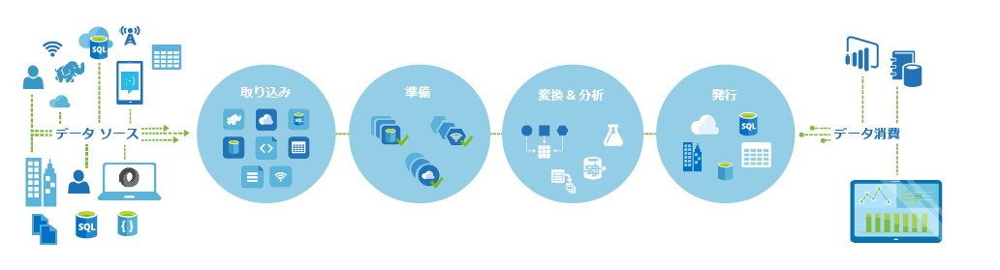
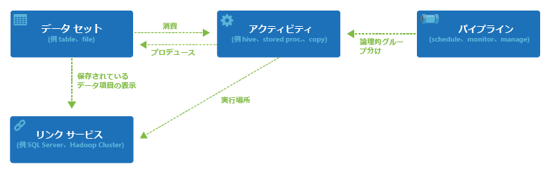

<properties 
	pageTitle="Azure Data Factory の概要" 
	description="Azure データ ファクトリ サービスを使用してデータ処理、データ保存、データ移動のサービスを構成し、信頼済みの情報を生成するパイプラインを作成する方法について説明します。" 
	services="data-factory" 
	documentationCenter="" 
	authors="spelluru" 
	manager="jhubbard" 
	editor="monicar"/>

<tags 
	ms.service="data-factory" 
	ms.workload="data-services" 
	ms.tgt_pltfrm="na" 
	ms.devlang="na" 
	ms.topic="article" 
	ms.date="07/16/2015" 
	ms.author="spelluru"/>

# Azure Data Factory サービスの概要

## 概要
Data Factory は、データの移動や変換を自動化するクラウド ベースの情報管理サービスです。

原材料を機械で加工して最終製品を作成する工場と同じように、Data Factory は生データを収集してすぐに使用できる情報に変換する既存のサービスを調整します。

Data Factory は、オンプレミスとクラウドのデータ ソースおよび SaaS で動作し、データの取り込み、準備、変換、分析、および発行を行います。ビッグ データのコンピューティング ニーズのための [Azure HDInsight (Hadoop)](http://azure.microsoft.com/documentation/services/hdinsight/) や [Azure Batch](http://azure.microsoft.com/documentation/services/batch/) および分析ソリューションを運用可能にするための [Azure Machine Learning](http://azure.microsoft.com/documentation/services/machine-learning/) といったサービスから Data Factory を使用して管理されたデータ フロー パイプラインを作成し、データを変換します。単なる表形式の監視ビューではなく、Data Factory のリッチな視覚化機能を使用してデータ パイプライン間の系列と依存関係をすばやく表示します。1 つの統一されたビューからすべてのデータ フロー パイプラインを監視し、問題を簡単に特定して監視アラートを設定します。

 

**図 1.** 多くのさまざまなオンプレミス データ ソースからデータを収集し、データを取り込んで準備し、広範な変換でデータを整理して分析し、消費用にすぐ使用できるデータを発行します。

必要があればいつでも Data Factory を使用して、異なる形状とサイズのデータを収集し、変換し、発行して深い洞察を抽出することのすべてを、信頼できるスケジュールで実行できます。Data Factory を使用すると、オンライン ショッピング業者が顧客の閲覧行動に基づいて個人用に設定された製品の推奨事項を生成できるようにするといったシナリオ用に、可用性の高いデータ フロー パイプラインを作成できます。

## 主要な概念

Azure Data Factory には、入力および出力データ、処理イベント、および目的のデータ フローの実行に必要なスケジュールとリソースを定義するために連携するいくつかの重要なエンティティがあります。

 **図 2.** データセット、アクティビティ、パイプライン、リンクされたサービスの間の関係

### アクティビティ
アクティビティは、データに対して実行するアクションを定義します。各アクティビティは、入力として 0 個以上のデータセットを受け取り、出力として 1 つまたは複数のデータセットを生成します。アクティビティは、Azure Data Factory でのオーケストレーションの単位です。たとえば、コピー アクティビティを使用して、データセット間のデータのコピーを調整できます。同様に、Azure HDInsight クラスターに対して Hive クエリを実行する Hive アクティビティを使用して、データを変換および分析できます。Azure Data Factory には、データ変換、分析、データ移動のための広範なアクティビティがあります。

### パイプライン
パイプラインは、アクティビティの論理的なグループです。パイプラインは、まとまってタスクを実行するユニットにアクティビティをグループ化するために使用されます。たとえば、複数の変換アクティビティのシーケンスがログ ファイル データのクレンジングに必要な場合があります。このシーケンスには、調整および自動化が必要な複雑なスケジュールと依存関係があります。これらのアクティビティのすべてを "CleanLogFiles" という名前の 1 つのパイプラインにグループ化できます。個々のアクティビティを個別に管理するのではなく、"CleanLogFiles" を 1 つの単位としてデプロイ、スケジューリング、削除できます。

### データセット
データセットは、アクティビティの入力または出力として使用するデータへの名前付きの参照/ポインターです。データセットは、テーブル、ファイル、フォルダー、ドキュメントなどのさまざまなデータ ストア内のデータ構造を示します。

### リンクされたサービス
リンクされたサービスは、Data Factory が外部リソースに接続するために必要な情報を定義します。Data Factory ではリンクされたサービスは 2 つの目的に使用されます。

- オンプレミスの SQL Server、Oracle DB、ファイル共有、Azure BLOB ストレージ アカウント、その他のデータ ストアを表すため。前述のように、データセットは、リンクされたサービスによって Data Factory に接続されるデータ ストア内の構造を表します。
- アクティビティの実行をホストできるコンピューティング リソースを表すため。たとえば、“HDInsightHive Activity” は HDInsight Hadoop クラスターで実行します。

データセット、アクティビティ、パイプライン、およびリンクされたサービスという 4 つの簡単な概念を理解すれば、Azure Data Factory を使用できます。 何もない状態から[最初のパイプラインを作成する](data-factory-build-your-first-pipeline.md)ことも、[ブログ投稿](https://azure.microsoft.com/blog/2015/04/24/azure-data-factory-update-simplified-sample-deployment/)の説明に従って既成のサンプルをデプロイすることもできます。

<!---HONumber=July15_HO5-->