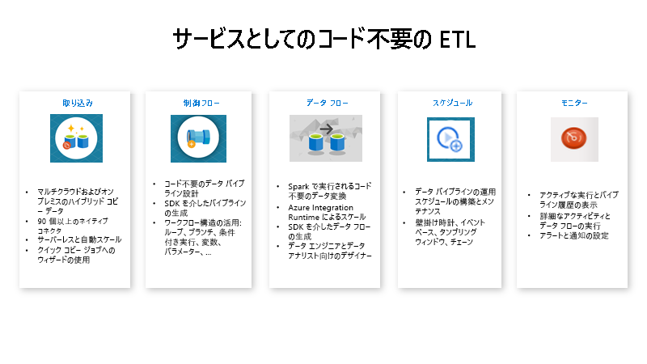

# Azure Data Factory とは何ですか。

[!INCLUDE[appliesto-adf-xxx-md](includes/appliesto-adf-xxx-md.md)]

ビッグ データの世界では、未整理の生データは、多くの場合、リレーショナル、非リレーショナル、その他のストレージ システム内に格納されます。 ただし、生データ自体には、アナリストや、データ サイエンティスト、管理職意思決定者に有用な分析を提供するのに必要となる正しいコンテキストや意味はありません。 

ビッグ データに必要なのは、データ制御と運用化の処理によって、膨大な量の生データを実用的なビジネス分析へと転換できるサービスです。 Azure Data Factory は、ETL (抽出 - 変換 - 読み込み)、ELT (抽出 - 読み込み - 変換)、データ統合という複雑なハイブリッド プロジェクト用に構築された、管理クラウド サービスです。

たとえば、クラウド内のゲームで生成される、数ペタバイト規模のゲーム ログを収集するゲーム会社があるとします。 その会社がこれらのログを分析して顧客の好みや内訳、利用行動などについての洞察を得たいと考えているとしましょう。 また同社は、アップセルやクロス セルの商機の見極め、魅力的な新機能の開発、ビジネスの成長の後押し、カスタマー エクスペリエンスの向上にも興味があります。

これらのログを分析するには、顧客情報やゲーム情報、マーケティング キャンペーン情報など、オンプレミスのデータ ストアにある参照データを使用する必要があります。 この会社は、オンプレミスのデータ ストアにあるこれらのデータを、クラウドのデータ ストアにある追加のログ データと統合して活用しようと考えています。 

状況を正確に把握するために、クラウドの Spark クラスターを使用して統合したデータを処理し (Azure HDInsight)、変換したデータを Azure SQL Data Warehouse などのクラウドのデータ ウェアハウスに公開して、これらのデータに基づくレポートを簡単に作成できるようにすることを希望しています。 このワークフローを自動化し、日単位のスケジュールに従って監視、管理することが目標となります。 それを実行するタイミングは、BLOB ストア コンテナーにファイルが到着したときとします。

Azure Data Factory は、このようなデータ シナリオを解決するプラットフォームです。 *クラウドベースの ETL およびデータ統合サービスを通じて、データの移動と変換を大規模に制御するデータ ドリブンのワークフローを作成できます*。 Azure Data Factory を使えば、各種のデータ ストアからデータを取り込むことができるデータ主導型のワークフロー (パイプライン) を作成し、スケジューリングできます。 コンピューティング サービス (Azure HDInsight Hadoop、Azure Databricks、Azure SQL Database など) やデータ フローを使用してデータを変換する複雑な ETL プロセスを視覚的に作成できます。 

さらに、ビジネス インテリジェンス (BI) アプリケーションから利用できるよう、Azure SQL Data Warehouse などのデータ ストアに、変換済みのデータを公開することもできます。 Azure Data Factory を使うと、最終的に、生データを意味のあるデータ ストアとデータ レイクに整理し、より的確な意思決定に活用できます。

## それはどのように機能しますか?

Data Factory には、包括的なエンド ツー エンドのプラットフォームをデータ エンジニアに提供する、相互接続された一連のシステムが含まれています。

### 接続と収集

企業は、さまざまな種類のデータをさまざまなソースで管理しています。ソースには、オンプレミスのソースやクラウド内のソース、構造化されたもの、構造化されていないもの、半構造化されたものなどがあり、そのデータの受信間隔も速度もまちまちです。 

情報生成システム構築の最初のステップは、サービスとしてのソフトウェア (SaaS) サービス、データベース、ファイル共有、FTP Web サービスなど、必要なすべてのデータ ソースと処理の機能に接続することです。 その後、必要に応じて後続の処理機能にデータを移動するステップへと続きます。

Data Factory を使用していない企業では、カスタムのデータ移動コンポーネントを構築するか、これらのデータ ソースと処理を統合するカスタム サービスを作成しなければなりません。 このようなシステムの統合と保守は高コストで、容易ではありません。 そのうえ、エンタープライズ クラスの監視やアラートが欠け、フル マネージドのサービスが提供できるような制御機能を用意できないことも少なくありません。

Data Factory を使用すれば、データ パイプラインの[コピー アクティビティ](copy-activity-overview.md)で、オンプレミスとクラウドの両方のソース データ ストアからクラウド内の一元化されたデータ ストアにデータを移動し、詳しく分析することができます。 たとえば、Azure Data Lake Storage でデータを収集し、後で Azure Data Lake Analytics コンピューティング サービスを使用してデータを変換することができます。 または、Azure Blob Storage でデータを収集し、後で Azure HDInsight Hadoop クラスターを使用してデータを変換することもできます。

### 変換と強化
クラウド上の一元的なデータ ストアにデータが集まったら、ADF マッピング データ フローを使用して、その収集されたデータを処理または変換します。 データ エンジニアは、Spark クラスターや Spark プログラミングの知識がなくても、データ フローを使用して、Spark 上で実行されるデータ変換グラフを作成、維持することができます。

変換を手動でコーディングしたい場合でも、ADF は、HDInsight Hadoop、Spark、Data Lake Analytics、Machine Learning などのコンピューティング サービス上で目的の変換を実行するための外部アクティビティをサポートしています。

### CI/CD と公開
Data Factory では、Azure DevOps と GitHub を使用したデータ パイプラインの CI/CD が完全にサポートされています。 ETL プロセスの開発とデリバリを段階的に進めたうえで、完成した製品を公開することが可能です。 生データが変換されてビジネスに即応して利用できる形態になったら、このデータを、ビジネス ユーザーがビジネス インテリジェンス ツールから参照できる Azure Data Warehouse、Azure SQL Database、Azure CosmosDB、またはその他の分析エンジンに読み込みます。

### モニター
データ統合パイプラインを正常に構築してデプロイし、変換したデータからビジネス価値を生み出せるようになったなら、スケジュール化したアクティビティとパイプラインを監視して、成功率と失敗率を確認することができます。 Azure Data Factory には、Azure Monitor、API、PowerShell、Azure Monitor ログ、Azure portal の正常性パネルを利用してパイプラインを監視する、ビルトイン サポートが用意されています。

## トップレベルの概念
1 つの Azure サブスクリプションで 1 つ以上の Azure Data Factory インスタンス (データ ファクトリ) を利用できます。 Azure Data Factory は、4 つの主要コンポーネントで構成されています。 これらのコンポーネントの連携によって実現するプラットフォームを基盤として、データ移動とデータ変換のステップを含んだデータ主導型のワークフローを作成することができます。

### パイプライン
データ ファクトリには、1 つまたは複数のパイプラインを設定できます。 パイプラインは、1 つの作業単位を実行するための複数のアクティビティから成る論理的なグループです。 パイプライン内のアクティビティがまとまって 1 つのタスクを実行します。 たとえば、パイプラインに Azure BLOB からデータを取り込むアクティビティのグループを含め、HDInsight クラスターで Hive クエリを実行してデータをパーティション分割することができます。 

パイプラインのメリットは、アクティビティを個別にではなく、セットとして管理できることです。 パイプライン内のアクティビティは、連鎖して順次処理することも、独立して並行処理することもできます。

### データ フローのマッピング
あらゆるサイズのデータの変換に使用できるデータ変換ロジックのグラフを作成して管理します。 再利用可能なデータ変換ルーチンのライブラリを構築し、それらのプロセスを ADF パイプラインからスケールアウト方式で実行することができます。 Data Factory は、必要なときにスピンアップおよびスピンダウンする Spark クラスターでロジックを実行します。 クラスターを自分で維持、管理する必要はありません。

### アクティビティ
アクティビティは、パイプライン内の処理ステップを表します。 たとえば、コピー アクティビティを使用して、データ ストア間でデータをコピーできます。 同様に、Azure HDInsight クラスターに対して Hive クエリを実行する Hive アクティビティを使用して、データを変換または分析できます。 Data Factory では、データ移動アクティビティ、データ変換アクティビティ、制御アクティビティの 3 種類のアクティビティがサポートされています。

### データセット
データセットは、データ ストア内のデータ構造を表しています。アクティビティ内でデータを入力または出力として使用したい場合は、そのデータをポイントまたは参照するだけで済みます。 

### リンクされたサービス
リンクされたサービスは、接続文字列によく似ており、Data Factory が外部リソースに接続するために必要な接続情報を定義します。 リンクされたサービスはデータ ソースへの接続を定義するもので、データセットはデータの構造を表すもの、と捉えることができます。 たとえば、Azure Storage アカウントに接続するための接続文字列は、Azure Storage のリンクされたサービスで指定します。 また、データを格納する BLOB コンテナーやフォルダーは、Azure BLOB データセットで指定します。

Data Factory ではリンクされたサービスは 2 つの目的に使用されます。

- オンプレミスの SQL Server データベース、Oracle データベース、ファイル共有、Azure Blob Storage アカウント、その他の "**データ ストア**" を表すため。 サポートされるデータ ストアの一覧については、「[コピー アクティビティ](copy-activity-overview.md)」を参照してください。

- アクティビティの実行をホストできる **コンピューティング リソース** を表すため。 たとえば、HDInsightHive アクティビティは HDInsight Hadoop クラスターで実行されます。 変換アクティビティとサポートされているコンピューティング環境の一覧については、「[データの変換](transform-data.md)」を参照してください。

### トリガー
トリガーは、パイプラインの実行をいつ開始する必要があるかを決定する処理単位を表します。 さまざまな種類のイベントに合わせて、さまざまな種類のトリガーがあります。

### パイプライン実行
パイプライン実行は、パイプラインを実行するインスタンスです。 パイプライン実行は、通常、パイプラインで定義されたパラメーターに引数を渡してインスタンス化されます。 引数は、手動で渡すか、トリガー定義内で渡すことができます。

### パラメーター
パラメーターは、読み取り専用の構成のキーと値のペアです。  パラメーターはパイプラインで定義されます。 定義済みパラメーターの引数は、実行時に、トリガーが作成した実行コンテキストか、手動で実行されるパイプラインから渡されます。 パイプライン内のアクティビティは、パラメーターの値を使用します。

データセットとは、厳密に型指定されたパラメーターと、再利用または参照可能なエンティティのことです。 アクティビティは、データセットを参照でき、データセットの定義で定義されたプロパティを使用できます。

リンクされたサービスも厳密に型指定されたパラメーターであり、これにはデータ ストアかコンピューティング環境への接続情報が入ります。 これは再利用可能または参照可能なエンティティでもあります。

### 制御フロー
制御フローは、パイプライン アクティビティのオーケストレーションです。これには、シーケンスに従うアクティビティの連鎖、分岐、パイプライン レベルでのパラメーターの定義、オンデマンドかトリガーからパイプラインが呼び出される際の引数の受け渡しが含まれます。 さらに、カスタム状態の受け渡しや、ループ コンテナー、つまり For-each 反復子も含まれます。

### 変数
変数は、パイプライン内で一時的な値を格納するときに使用できるほか、パラメーターと組み合わせて、パイプラインやデータ フローなどのアクティビティ間で値を受け渡しする際にも使用できます。

## 次のステップ
次のステップとして重要なドキュメントを次に示します。ぜひご覧ください。

- [データセットとリンクされたサービス](concepts-datasets-linked-services.md)
- [パイプラインとアクティビティ](concepts-pipelines-activities.md)
- [Integration Runtime](concepts-integration-runtime.md)
- [マッピング データ フロー](concepts-data-flow-overview.md)
- [Azure Portal の Data Factory UI](quickstart-create-data-factory-portal.md)
- [Azure Portal の [データのコピー] ツール](quickstart-create-data-factory-copy-data-tool.md)
- [PowerShell](quickstart-create-data-factory-powershell.md)
- [.NET](quickstart-create-data-factory-dot-net.md)
- [Python](quickstart-create-data-factory-python.md)
- [REST](quickstart-create-data-factory-rest-api.md)
- [Azure Resource Manager テンプレート](quickstart-create-data-factory-resource-manager-template.md)
 
