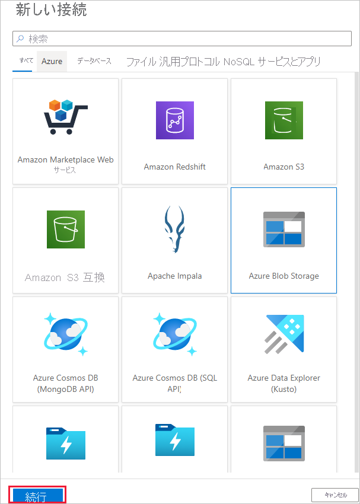
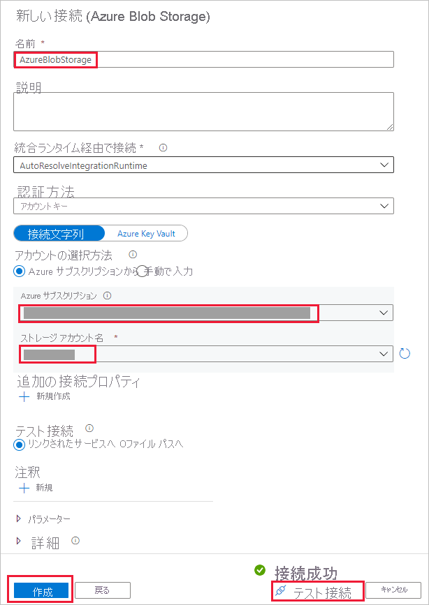

# データのコピー ツールを使用してデータをコピーする 
> [!div class="op_single_selector" title1="Select the version of Data Factory service that you are using:"]
> * [Version 1](v1/data-factory-copy-data-from-azure-blob-storage-to-sql-database.md)
> * [現在のバージョン](quickstart-create-data-factory-copy-data-tool.md)

このクイック スタートでは、Azure Portal を使用してデータ ファクトリを作成します。 次に、データのコピー ツールを使用して、Azure Blob Storage 内のフォルダーから別のフォルダーにデータをコピーするパイプラインを作成します。 

> [!NOTE]
> Azure Data Factory を初めて使用する場合は、このクイック スタートを実行する前に、「[Azure Data Factory の概要](data-factory-introduction.md)」を参照してください。 

[!INCLUDE [data-factory-quickstart-prerequisites](../../includes/data-factory-quickstart-prerequisites.md)] 

## Data Factory を作成する。

1. 左側のメニューの **[新規]** を選択し、**[データ + 分析]** を選択して、**[Data Factory]** を選択します。 
   
   ![[新規] ウィンドウでの [Data Factory] の選択](./media/quickstart-create-data-factory-copy-data-tool/new-azure-data-factory-menu.png)
1. **[新しいデータ ファクトリ]** ページで、**[名前]** に「**ADFTutorialDataFactory**」と入力します。 
      
   ![[新しいデータ ファクトリ] ページ](./media/quickstart-create-data-factory-copy-data-tool/new-azure-data-factory.png)
 
   Azure データ ファクトリの名前は *グローバルに一意*にする必要があります。 次のエラーが発生した場合は、データ ファクトリの名前を変更して (**&lt;yourname&gt;ADFTutorialDataFactory** など) 作成し直してください。 Data Factory アーティファクトの名前付け規則については、[Data Factory の名前付け規則](naming-rules.md)に関する記事を参照してください。
  
   
1. **[サブスクリプション]** で、データ ファクトリを作成する Azure サブスクリプションを選択します。 
1. **[リソース グループ]** で、次の手順のいずれかを行います。
     
   - **[既存のものを使用]** を選択し、一覧から既存のリソース グループを選択します。 
   - **[新規作成]** を選択し、リソース グループの名前を入力します。   
         
   リソース グループの詳細については、 [リソース グループを使用した Azure のリソースの管理](../azure-resource-manager/resource-group-overview.md)に関するページを参照してください。  
1. **[バージョン]** で、**[V2]** を選択します。
1. **[場所]** で、データ ファクトリの場所を選択します。 

   このリストに表示されるのは、サポートされている場所のみです。 Data Factory で使用するデータ ストア (Azure Storage、Azure SQL Database など) やコンピューティング (Azure HDInsight など) は他の場所/リージョンに配置できます。

1. **[ダッシュボードにピン留めする]** をオンにします。     
1. **作成**を選択します。
1. ダッシュボードに、**[Deploying Data Factory]\(Data Factory をデプロイしています\)** というステータスを示した次のタイルが表示されます。 

    ![[Deploying data factory]\(データ ファクトリをデプロイしています\) タイル](media/quickstart-create-data-factory-copy-data-tool/deploying-data-factory.png)
1. 作成が完了すると、**[Data Factory]** ページが表示されます。 **[作成と監視]** タイルを選択して、別のタブで Azure Data Factory ユーザー インターフェイス (UI) アプリケーションを起動します。
   
   ![[作成と監視] タイルが表示された、データ ファクトリのホーム ページ](./media/quickstart-create-data-factory-copy-data-tool/data-factory-home-page.png)

## データのコピー ツールの起動

1. **[Let's get started]\(始めましょう\)** ページで、**[データのコピー]** タイルを選択してデータのコピー ツールを起動します。 

   ![[データのコピー] タイル](./media/quickstart-create-data-factory-copy-data-tool/copy-data-tool-tile.png)

1. データのコピー ツールの **[プロパティ]** ページで、パイプラインの名前とその説明を指定できます。**[次へ]** を選択します。 

   ![[プロパティ] ページ](./media/quickstart-create-data-factory-copy-data-tool/copy-data-tool-properties-page.png)
1. **[ソース データ ストア]** ページで、次の手順を実行します。

    a. **[+ 新しい接続の作成]** をクリックして、接続を追加します。

    ![[ソース データ ストア] ページ](./media/quickstart-create-data-factory-copy-data-tool/new-source-linked-service.png)

    b. ギャラリーから **[Azure Blob Storage]** を選択し、**[次へ]** を選択します。

    

    c. **[Specify the Azure Blob storage account]\(Azure BLOB ストレージ アカウントの指定\)** ページで、**[ストレージ アカウント名]** ボックスの一覧からストレージ アカウントを選択し、**[完了]** をクリックします。 

   

   d. 新しく作成したリンクされたサービスをソースとして選択し、**[次へ]** をクリックします。

   

1. **[Choose the input file or folder]\(入力ファイルまたはフォルダーの選択\)** ページで、次の手順を実行します。

   a. **[参照]** をクリックして、**adftutorial/input** フォルダーに移動します。**emp.txt** ファイルを選択し、**[選択]** をクリックします。 

   ![[Choose the input file or folder]\(入力ファイルまたはフォルダーの選択\) ページ](./media/quickstart-create-data-factory-copy-data-tool/configure-source-path.png)

   d. ファイルをそのままコピーするため、**[Binary copy]\(バイナリ コピー\)** チェック ボックスをオンにし、**[次へ]** を選択します。 

   ![[Choose the input file or folder]\(入力ファイルまたはフォルダーの選択\) ページ](./media/quickstart-create-data-factory-copy-data-tool/select-binary-copy.png)

1. **[Destination data store]\(コピー先データ ストア\)** ページで、作成した **Azure Blob Storage** のリンクされたサービスを選択し、**[次へ]** を選択します。 

   ![[Destination data store]\(コピー先データ ストア\) ページ](./media/quickstart-create-data-factory-copy-data-tool/select-sink-linked-service.png)

1. **[Choose the output file or folder]\(出力ファイルまたはフォルダーの選択\)** ページで、フォルダー パスとして「**adftutorial/output**」と入力し、**[次へ]** を選択します。 

   ![[Choose the output file or folder]\(出力ファイルまたはフォルダーの選択\) ページ](./media/quickstart-create-data-factory-copy-data-tool/configure-sink-path.png) 

1. **[設定]** ページで、**[次へ]** を選択して、既定の構成を使用します。 

1. **[概要]** ページで、すべての設定を確認し、**[次へ]** を選択します。 

    ![[概要] ページ](./media/quickstart-create-data-factory-copy-data-tool/summary-page.png)

1. **[Deployment complete]\(デプロイ完了\)** ページで **[監視]** を選択して、作成したパイプラインを監視します。 

    ![[Deployment complete]\(デプロイ完了\) ページ](./media/quickstart-create-data-factory-copy-data-tool/deployment-page.png)

1. アプリケーションの **[監視]** タブに切り替えます。このタブでは、パイプラインの状態が表示されます。**[最新の情報に更新]** を選択して、一覧を更新します。 
    
    

1. **[アクション]** 列の **[View Activity Runs]\(アクティビティの実行の表示\)** リンクを選択します。 このパイプラインには、**コピー**という種類のアクティビティが 1 つのみ含まれます。 

    
    
1. コピー操作の詳細を確認するには、**[アクション]** 列にある **[詳細]** (眼鏡アイコン) リンクを選択します。 プロパティの詳細については、[コピー アクティビティの概要](copy-activity-overview.md)に関するページを参照してください。

    

1. **adftutorial** コンテナーの **output** フォルダーに **emp.txt** ファイルが作成されていることを確認します。 output フォルダーが存在しない場合は、Data Factory サービスによって自動的に作成されます。 

1. **[監視]** タブの上にある **[編集]** タブに切り替えると、リンクされたサービス、データセット、パイプラインを編集できます。 Data Factory UI での編集の詳細については、[Azure Portal を使用したデータ ファクトリの作成](quickstart-create-data-factory-portal.md)に関する記事を参照してください。

## 次の手順
このサンプルのパイプラインは、Azure Blob Storage 内のある場所から別の場所にデータをコピーします。 より多くのシナリオで Data Factory を使用する方法については、[チュートリアル](tutorial-copy-data-portal.md)を参照してください。 