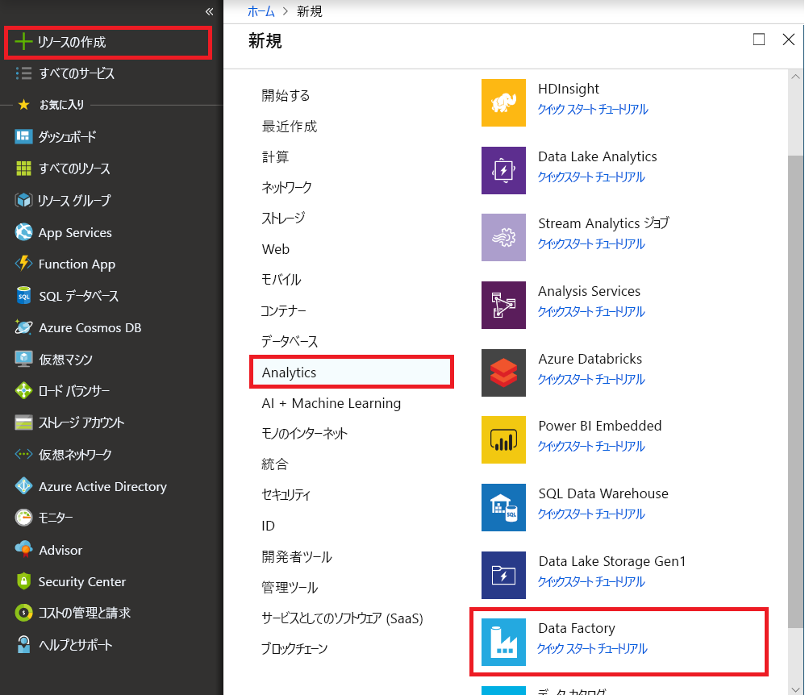
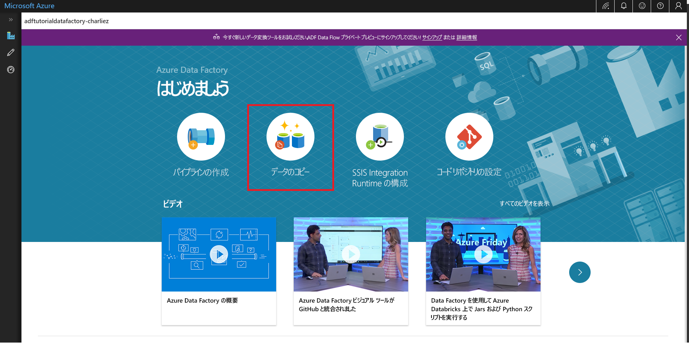
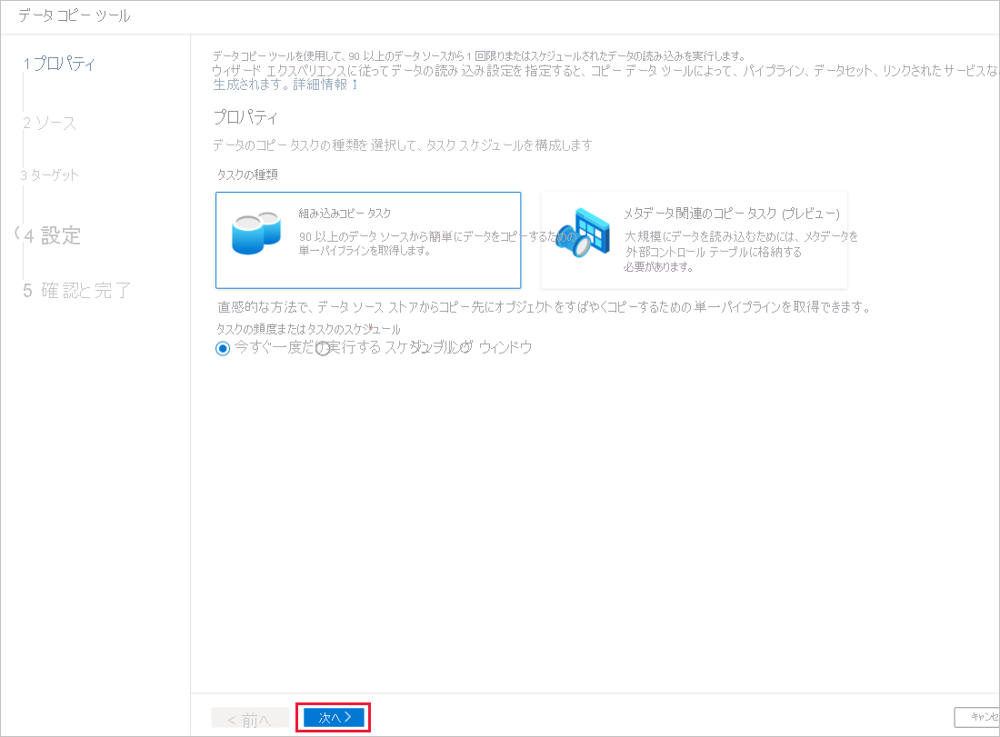

# データのコピー ツールを使用してデータをコピーする 
> [!div class="op_single_selector" title1="Select the version of Data Factory service you are using:"]
> * [バージョン 1 - 一般公開](v1/data-factory-copy-data-from-azure-blob-storage-to-sql-database.md)
> * [バージョン 2 - プレビュー](quickstart-create-data-factory-copy-data-tool.md)

このクイック スタートでは、Azure Portal を使用してデータ ファクトリを作成します。 次に、データのコピー ツールを使用して、Azure Blob Storage 内のフォルダーから別のフォルダーにデータをコピーするパイプラインを作成します。 

> [!NOTE]
> Azure Data Factory を初めて使用する場合は、このクイック スタートを実行する前に、「[Azure Data Factory の概要](data-factory-introduction.md)」を参照してください。 
>
> この記事は、現在プレビュー段階にある Data Factory のバージョン 2 に適用されます。 一般公開 (GA) されている Data Factory サービスのバージョン 1 を使用している場合は、[Data Factory バージョン 1 の使用](v1/data-factory-copy-data-from-azure-blob-storage-to-sql-database.md)に関する記事をご覧ください。

[!INCLUDE [data-factory-quickstart-prerequisites](../../includes/data-factory-quickstart-prerequisites.md)] 

## Data Factory を作成する。

1. 左側のメニューで **[新規]** をクリックし、**[データ + 分析]**、**[Data Factory]** の順にクリックします。 
   
   
2. **[新しいデータ ファクトリ]** ページで、**[名前]** に「**ADFTutorialDataFactory**」と入力します。 
      
     ![[新しいデータ ファクトリ] ページ](./media/quickstart-create-data-factory-copy-data-tool/new-azure-data-factory.png)
 
   Azure データ ファクトリの名前は **グローバルに一意**にする必要があります。 [名前] フィールドで次のエラーが発生した場合は、データ ファクトリの名前を変更し (yournameADFTutorialDataFactory など)、もう一度作成してください。 Data Factory アーティファクトの名前付け規則については、[Data Factory の名前付け規則](naming-rules.md)に関する記事を参照してください。
  
     
3. データ ファクトリを作成する Azure **サブスクリプション**を選択します。 
4. **[リソース グループ]** について、次の手順のいずれかを行います。
     
      - **[Use existing (既存のものを使用)]**を選択し、ドロップダウン リストから既存のリソース グループを選択します。 
      - **[新規作成]**を選択し、リソース グループの名前を入力します。   
         
      リソース グループの詳細については、 [リソース グループを使用した Azure のリソースの管理](../azure-resource-manager/resource-group-overview.md)に関するページを参照してください。  
4. **バージョン**として **[V2 (プレビュー)]** を選択します。
5. データ ファクトリの **場所** を選択します。 サポートされている場所のみがドロップダウン リストに表示されます。 データ ファクトリで使用するデータ ストア (Azure Storage、Azure SQL Database など) やコンピューティング (HDInsight など) は他の場所/リージョンに配置できます。
6. **[ダッシュボードにピン留めする]** をオンにします。     
7. **Create** をクリックしてください。
8. ダッシュボードに、**[Deploying data factory]\(データ ファクトリをデプロイしています\)** というステータスを示したタイルが表示されます。 

    ![[Deploying data factory]\(データ ファクトリをデプロイしています\) タイル](media/quickstart-create-data-factory-copy-data-tool/deploying-data-factory.png)
9. 作成が完了すると、図に示されているような **[Data Factory]** ページが表示されます。
   
   
10. **[Author & Monitor]\(作成と監視\)** タイルをクリックして、別のタブで Azure Data Factory ユーザー インターフェイス (UI) を起動します。 

## データのコピー ツールの起動

1. 開始ページで **[データのコピー]** タイルをクリックして、データのコピー ツールを起動します。 

   
2. データのコピー ツールの **[プロパティ]** ページで、**[次へ]** をクリックします。 このページで、パイプラインの名前とその説明を指定できます。 

    
3. **[ソース データ ストア]** ページで **[Azure Blob Storage]** を選択し、**[次へ]** をクリックします。

    ![[ソース データ ストア] ページ](./media/quickstart-create-data-factory-copy-data-tool/source-data-store-page.png)
4. **[Specify the Azure Blob storage account]\(Azure BLOB ストレージ アカウントの指定\)** ページで、使用する**ストレージ アカウント名**をドロップダウン リストから選択し、[次へ] をクリックします。 

    
5. **[Choose the input file or folder]\(入力ファイルまたはフォルダーの選択\)** ページで、次の手順を行います。

    1. **adftutorial/input** フォルダーに移動します。 
    2. **emp.txt** ファイルを選択します。
    3. **[選択]** をクリックします。 **emp.txt** をダブルクリックすると、この手順をスキップできます。 
    4. **[次へ]** をクリックします。 

    
6. **[File format settings]\(ファイル形式設定\)** ページで、列区切り記号と行区切り記号がツールによって自動的に検出されたことを確認して、**[次へ]** をクリックします。 このページでは、データのプレビューと入力データのスキーマの表示を行うこともできます。 

    ![[File format settings]\(ファイル形式設定\) ページ](./media/quickstart-create-data-factory-copy-data-tool/file-format-settings-page.png)
7. **[Destination data store]\(コピー先データ ストア\)** ページで **[Azure Blob Storage]** を選択し、**[次へ]** をクリックします。 

    ![[Destination data store]\(コピー先データ ストア\) ページ](./media/quickstart-create-data-factory-copy-data-tool/destination-data-store-page.png)    
8. **[Specify the Azure Blob storage account]\(Azure BLOB ストレージ アカウントの指定\)** ページで、使用する Azure BLOB ストレージ アカウントを選択し、**[次へ]** をクリックします。 

    
9. **[Choose the output file or folder]\(出力ファイルまたはフォルダーの選択\)** ページで、次の手順を行います。 

    1. **フォルダー パス**として「**adftutorial/output**」と入力します。
    2. **ファイル名**として「**emp.txt**」と入力します。 
    3. **[次へ]** をクリックします。 

     
10. **[File format settings]\(ファイル形式設定\)** ページで **[次へ]** をクリックします。 

    ![[File format settings]\(ファイル形式設定\) ページ](./media/quickstart-create-data-factory-copy-data-tool/file-format-settings-output-page.png)
11. **[設定]** ページで **[次へ]** をクリックします。 

    ![[詳細設定] ページ](./media/quickstart-create-data-factory-copy-data-tool/advanced-settings-page.png)
12. **[概要]** ページで、すべての設定を確認し、[次へ] をクリックします。 

    
13. **[Deployment complete]\(デプロイ完了\)** ページで **[監視]** をクリックして、作成されたパイプラインを監視します。 

    ![[Deployment]\(デプロイ\) ページ](./media/quickstart-create-data-factory-copy-data-tool/deployment-page.png)
14. アプリケーションの **[監視]** タブに切り替えます。パイプラインの状態が、このページに表示されます。 **[最新の情報に更新]** をクリックして、リストを更新します。 
    
    ![[Monitor pipeline runs]\(パイプラインの実行の監視\) ページ](./media/quickstart-create-data-factory-copy-data-tool/monitor-pipeline-runs-page.png)
15. [アクション] 列の **[View Activity Runs]\(アクティビティの実行の表示\)** リンクをクリックします。 このパイプラインには、**コピー**という種類のアクティビティが 1 つのみ含まれます。 

    ![[アクティビティの実行] ページ](./media/quickstart-create-data-factory-copy-data-tool/activity-runs.png)
16. コピー操作の詳細を確認するには、**[アクション]** 列にある **[詳細]** (眼鏡アイコン) リンクをクリックします。 プロパティの詳細については、[コピー アクティビティの概要](copy-activity-overview.md)に関するページを参照してください。 

    
17. **adftutorial** コンテナーの **output** フォルダーに **emp.txt** ファイルが作成されていることを確認します。 output フォルダーが存在しない場合は、Data Factory サービスによって自動的に作成されます。 
18. **[編集]** タブに切り替えると、リンクされたサービス、データセット、パイプラインを編集できます。 Data Factory UI での編集の詳細については、「[Azure Portal を使用してデータ ファクトリを作成する](quickstart-create-data-factory-portal.md)」を参照してください。

    ![[編集] タブ](./media/quickstart-create-data-factory-copy-data-tool/edit-tab.png)

## 次の手順
このサンプルのパイプラインは、Azure BLOB ストレージ内のある場所から別の場所にデータをコピーするものです。 より多くのシナリオで Data Factory を使用する方法については、[チュートリアル](tutorial-copy-data-portal.md)を参照してください。 