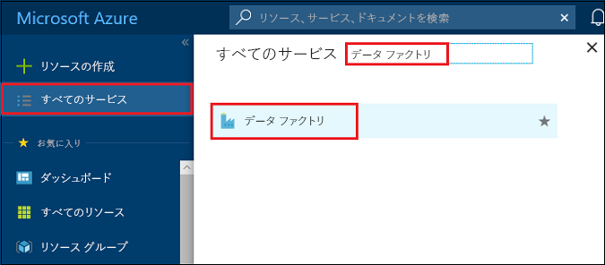
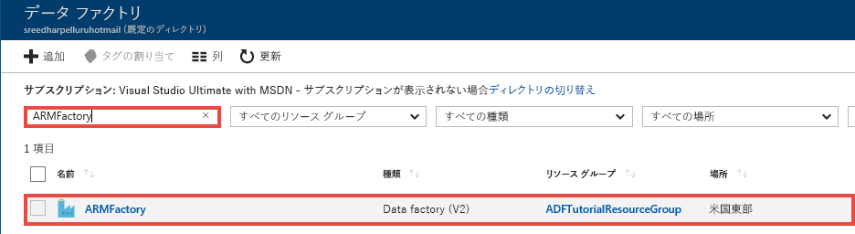
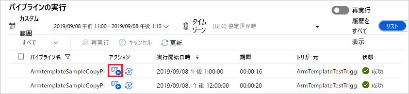
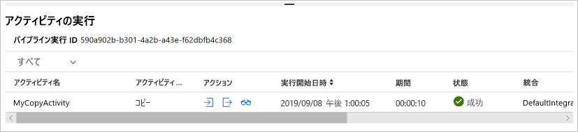

# <a name="tutorial-create-an-azure-data-factory-using-azure-resource-manager-template"></a>チュートリアル: Azure Resource Manager テンプレートを使用した Azure データ ファクトリの作成
> [!div class="op_single_selector" title1="Select the version of Data Factory service you are using:"]
> * [Version 1](v1/data-factory-build-your-first-pipeline-using-arm.md)
> * [現在のバージョン](quickstart-create-data-factory-resource-manager-template.md) 

このクイックスタートでは、Azure Resource Manager テンプレートを使用して Azure データ ファクトリを作成する方法を説明します。 このデータ ファクトリに作成されたパイプラインは、データを Azure BLOB ストレージ内のあるフォルダーから別のフォルダーに**コピー**します。 Azure Data Factory を使用してデータを**変換**する方法のチュートリアルについては、[Spark を使用したデータ変換のチュートリアル](transform-data-using-spark.md)を参照してください。 

> [!NOTE]
> この記事では、Data Factory サービスの概要については詳しく取り上げません。 Azure Data Factory サービスの概要については、「[Azure Data Factory の概要](introduction.md)」をご覧ください。

[!INCLUDE [data-factory-quickstart-prerequisites](../../includes/data-factory-quickstart-prerequisites.md)] 

### <a name="azure-powershell"></a>Azure PowerShell
[Azure PowerShell のインストールと構成の方法](/powershell/azure/install-azurerm-ps)に関するページの手順に従って、最新の Azure PowerShell モジュールをインストールしてください。

## <a name="resource-manager-templates"></a>Resource Manager テンプレート
Azure Resource Manager テンプレート全般に関する情報については、[Azure Resource Manager テンプレートの作成](../azure-resource-manager/resource-group-authoring-templates.md)に関するページを参照してください。 

次のセクションでは、このチュートリアルを速やかに実行し、テンプレートをテストできるように、Data Factory エンティティを定義するための完全な Resource Manager テンプレートを提供します。 各 Data Factory エンティティを定義する方法については、「[テンプレートの Data Factory エンティティ](#data-factory-entities-in-the-template)」をご覧ください。

## <a name="data-factory-json"></a>Data Factory JSON 
以下の内容を記述した **ADFTutorialARM.json** という名前の JSON ファイルを **C:\ADFTutorial** フォルダーに作成します。

```json
{
    "contentVersion": "1.0.0.0",
    "$schema": "http://schema.management.azure.com/schemas/2015-01-01/deploymentTemplate.json#",
    "parameters": {
        "dataFactoryName": {
            "type": "string",
            "metadata": {
                "description": "Name of the data factory. Must be globally unique."
            }
        },
        "dataFactoryLocation": {
            "type": "string",
            "allowedValues": [
                "East US",
                "East US 2",
                "West Europe"
            ],
            "defaultValue": "East US",
            "metadata": {
                "description": "Location of the data factory. Currently, only East US, East US 2, and West Europe are supported. "
            }
        },
        "storageAccountName": {
            "type": "string",
            "metadata": {
                "description": "Name of the Azure storage account that contains the input/output data."
            }
        },
        "storageAccountKey": {
            "type": "securestring",
            "metadata": {
                "description": "Key for the Azure storage account."
            }
        },
        "blobContainer": {
            "type": "string",
            "metadata": {
                "description": "Name of the blob container in the Azure Storage account."
            }
        },
        "inputBlobFolder": {
            "type": "string",
            "metadata": {
                "description": "The folder in the blob container that has the input file."
            }
        },
        "inputBlobName": {
            "type": "string",
            "metadata": {
                "description": "Name of the input file/blob."
            }
        },
        "outputBlobFolder": {
            "type": "string",
            "metadata": {
                "description": "The folder in the blob container that will hold the transformed data."
            }
        },
        "outputBlobName": {
            "type": "string",
            "metadata": {
                "description": "Name of the output file/blob."
            }
        },
        "triggerStartTime": {
            "type": "string",
            "metadata": {
                "description": "Start time for the trigger."
            }
        },
        "triggerEndTime": {
            "type": "string",
            "metadata": {
                "description": "End time for the trigger."
            }
        }
    },
    "variables": {
        "azureStorageLinkedServiceName": "ArmtemplateStorageLinkedService",
        "inputDatasetName": "ArmtemplateTestDatasetIn",
        "outputDatasetName": "ArmtemplateTestDatasetOut",
        "pipelineName": "ArmtemplateSampleCopyPipeline",
        "triggerName": "ArmTemplateTestTrigger"
    },
    "resources": [{
        "name": "[parameters('dataFactoryName')]",
        "apiVersion": "2017-09-01-preview",
        "type": "Microsoft.DataFactory/factories",
        "location": "[parameters('dataFactoryLocation')]",
        "properties": {
            "loggingStorageAccountName": "[parameters('storageAccountName')]",
            "loggingStorageAccountKey": "[parameters('storageAccountKey')]"
        },
        "resources": [{
                "type": "linkedservices",
                "name": "[variables('azureStorageLinkedServiceName')]",
                "dependsOn": [
                    "[parameters('dataFactoryName')]"
                ],
                "apiVersion": "2017-09-01-preview",
                "properties": {
                    "type": "AzureStorage",
                    "description": "Azure Storage linked service",
                    "typeProperties": {
                        "connectionString": {
                            "value": "[concat('DefaultEndpointsProtocol=https;AccountName=',parameters('storageAccountName'),';AccountKey=',parameters('storageAccountKey'))]",
                            "type": "SecureString"
                        }
                    }
                }
            },
            {
                "type": "datasets",
                "name": "[variables('inputDatasetName')]",
                "dependsOn": [
                    "[parameters('dataFactoryName')]",
                    "[variables('azureStorageLinkedServiceName')]"
                ],
                "apiVersion": "2017-09-01-preview",
                "properties": {
                    "type": "AzureBlob",
                    "typeProperties": {
                        "folderPath": "[concat(parameters('blobContainer'), '/', parameters('inputBlobFolder'), '/')]",
                        "fileName": "[parameters('inputBlobName')]"
                    },
                    "linkedServiceName": {
                        "referenceName": "[variables('azureStorageLinkedServiceName')]",
                        "type": "LinkedServiceReference"
                    }
                }
            },
            {
                "type": "datasets",
                "name": "[variables('outputDatasetName')]",
                "dependsOn": [
                    "[parameters('dataFactoryName')]",
                    "[variables('azureStorageLinkedServiceName')]"
                ],
                "apiVersion": "2017-09-01-preview",
                "properties": {
                    "type": "AzureBlob",
                    "typeProperties": {
                        "folderPath": "[concat(parameters('blobContainer'), '/', parameters('outputBlobFolder'), '/')]",
                        "fileName": "[parameters('outputBlobName')]"
                    },
                    "linkedServiceName": {
                        "referenceName": "[variables('azureStorageLinkedServiceName')]",
                        "type": "LinkedServiceReference"
                    }
                }
            },
            {
                "type": "pipelines",
                "name": "[variables('pipelineName')]",
                "dependsOn": [
                    "[parameters('dataFactoryName')]",
                    "[variables('azureStorageLinkedServiceName')]",
                    "[variables('inputDatasetName')]",
                    "[variables('outputDatasetName')]"
                ],
                "apiVersion": "2017-09-01-preview",
                "properties": {
                    "activities": [{
                        "type": "Copy",
                        "typeProperties": {
                            "source": {
                                "type": "BlobSource"
                            },
                            "sink": {
                                "type": "BlobSink"
                            }
                        },
                        "name": "MyCopyActivity",
                        "inputs": [{
                            "referenceName": "[variables('inputDatasetName')]",
                            "type": "DatasetReference"
                        }],
                        "outputs": [{
                            "referenceName": "[variables('outputDatasetName')]",
                            "type": "DatasetReference"
                        }]
                    }]
                }
            },
            {
                "type": "triggers",
                "name": "[variables('triggerName')]",
                "dependsOn": [
                    "[parameters('dataFactoryName')]",
                    "[variables('azureStorageLinkedServiceName')]",
                    "[variables('inputDatasetName')]",
                    "[variables('outputDatasetName')]",
                    "[variables('pipelineName')]"
                ],
                "apiVersion": "2017-09-01-preview",
                "properties": {
                    "type": "ScheduleTrigger",
                    "typeProperties": {
                        "recurrence": {
                            "frequency": "Hour",
                            "interval": 1,
                            "startTime": "[parameters('triggerStartTime')]",
                            "endTime": "[parameters('triggerEndTime')]",
                            "timeZone": "UTC"
                        }
                    },
                    "pipelines": [{
                        "pipelineReference": {
                            "type": "PipelineReference",
                            "referenceName": "ArmtemplateSampleCopyPipeline"
                        },
                        "parameters": {}
                    }]
                }
            }
        ]
    }]
}
```

## <a name="parameters-json"></a>Parameters JSON
Azure Resource Manager テンプレートのパラメーターを含む **ADFTutorialARM-Parameters.json** という名前の JSON ファイルを作成します。  

> [!IMPORTANT]
> - このパラメーター ファイルの **storageAccountName** パラメーターと **storageAccountKey** パラメーターに、Azure Storage アカウントの名前とキーを指定します。 adftutorial コンテナーを作成し、この Azure Blob Storage の入力フォルダーにサンプル ファイル (emp.txt) をアップロードしました。 
> - **dataFactoryName** パラメーターには、データ ファクトリのグローバルに一意の名前を指定します。 たとえば ARMTutorialFactoryJohnDoe11282017 とします。 
> - **triggerStartTime** には、現在の日付を `2017-11-28T00:00:00` 形式で指定します。
> - **triggerEndTime** には、翌日の日付を `2017-11-29T00:00:00` 形式で指定します。 また、現在の UTC 時刻を調べて、その 1 ～ 2 時間後を終了時刻として指定することもできます。 たとえば、現在の UTC 時刻が午前 1 時 32 分である場合、終了時刻として `2017-11-29:03:00:00` を指定します。 この場合、トリガーによってパイプラインが 2 回実行されます (午前 2 時と午前 3 時)。

```json
{
  "$schema": "https://schema.management.azure.com/schemas/2015-01-01/deploymentParameters.json#",
  "contentVersion": "1.0.0.0",
  "parameters": {
    "dataFactoryName": {
      "value": "<datafactoryname>"
    },    
    "dataFactoryLocation": {
      "value": "East US"
    },
    "storageAccountName": {
      "value": "<yourstroageaccountname>"
    },
    "storageAccountKey": {
      "value": "<yourstorageaccountkey>"
    },
    "blobContainer": {
      "value": "adftutorial"
    },
    "inputBlobFolder": {
      "value": "input"
    },
    "inputBlobName": {
      "value": "emp.txt"
    },
    "outputBlobFolder": {
      "value": "output"
    },
    "outputBlobName": {
      "value": "emp.txt"
    },
    "triggerStartTime": {
        "value": "2017-11-28T00:00:00. Set to today"
    },
    "triggerEndTime": {
        "value": "2017-11-29T00:00:00. Set to tomorrow"
    }
  }
}
```

> [!IMPORTANT]
> 開発環境、テスト環境、運用環境用にそれぞれ別の parameter JSON ファイルを作成して、同じ Data Factory JSON テンプレートで使用できます。 PowerShell スクリプトを使用して、これらの環境への Data Factory エンティティのデプロイを自動化できます。 

## <a name="deploy-data-factory-entities"></a>Data Factory エンティティのデプロイ 
このクイックスタートで作成した Resource Manager テンプレートを使用して Data Factory エンティティをデプロイするには、PowerShell で次のコマンドを実行します。 

```PowerShell
New-AzureRmResourceGroupDeployment -Name MyARMDeployment -ResourceGroupName ADFTutorialResourceGroup -TemplateFile C:\ADFTutorial\ADFTutorialARM.json -TemplateParameterFile C:\ADFTutorial\ADFTutorialARM-Parameters.json
```

次のサンプルのような出力が表示されます。 

```
DeploymentName          : MyARMDeployment
ResourceGroupName       : ADFTutorialResourceGroup
ProvisioningState       : Succeeded
Timestamp               : 11/29/2017 3:11:13 AM
Mode                    : Incremental
TemplateLink            :
Parameters              :
                          Name                 Type            Value
                          ===============      ============    ==========
                          dataFactoryName      String          <data factory name>
                          dataFactoryLocation  String          East US
                          storageAccountName   String          <storage account name>
                          storageAccountKey    SecureString
                          blobContainer        String          adftutorial
                          inputBlobFolder      String          input
                          inputBlobName        String          emp.txt
                          outputBlobFolder     String          output
                          outputBlobName       String          emp.txt
                          triggerStartTime     String          11/29/2017 12:00:00 AM
                          triggerEndTime       String          11/29/2017 4:00:00 AM

Outputs                 :
DeploymentDebugLogLevel :
```

## <a name="start-the-trigger"></a>トリガーの起動

このテンプレートでは、次の Data Factory エンティティをデプロイします。 

- Azure Storage のリンクされたサービス
- Azure BLOB データセット (入力と出力)
- コピー アクティビティのあるパイプライン
- パイプラインのトリガー

デプロイしたトリガーは停止状態になっています。 トリガーを起動する方法の 1 つとして、PowerShell コマンドレットの **Start-AzureRmDataFactoryV2Trigger** を使用します。 次に、その手順を詳しく説明します。 

1. PowerShell ウィンドウで、リソース グループの名前を保持する変数を作成します。 次のコマンドを PowerShell ウィンドウにコピーし、Enter キーを押します。 New-AzureRmResourceGroupDeployment コマンドに別のリソース グループ名を指定している場合は、ここで値を更新してください。 

    ```powershell
    $resourceGroupName = "ADFTutorialResourceGroup"
    ``` 
1. データ ファクトリの名前を保持する変数を作成します。 ADFTutorialARM-Parameters.json ファイルで指定したものと同じ名前を指定してください。   

    ```powershell
    $dataFactoryName = "<yourdatafactoryname>"
    ```
3. トリガー名の変数を設定します。 トリガーの名前は、Resource Manager テンプレート ファイル (ADFTutorialARM.json) にハードコードされます。

    ```powershell
    $triggerName = "ArmTemplateTestTrigger"
    ```
4. データ ファクトリとトリガーの名前を指定した後に、次の PowerShell コマンドを実行して**トリガーのステータス**を取得します。

    ```powershell
    Get-AzureRmDataFactoryV2Trigger -ResourceGroupName $resourceGroupName -DataFactoryName $dataFactoryName -Name $triggerName
    ```

    出力例を次に示します。 

    ```json
    TriggerName       : ArmTemplateTestTrigger
    ResourceGroupName : ADFTutorialResourceGroup
    DataFactoryName   : ARMFactory1128
    Properties        : Microsoft.Azure.Management.DataFactory.Models.ScheduleTrigger
    RuntimeState      : Stopped
    ```
    
    トリガーのランタイム状態が **Stopped** であることに注目してください。 
5. **トリガーを起動します**。 テンプレートで定義されているパイプラインが正時に実行されます。 つまり、このコマンドを午後 2 時 25 分に実行した場合は、午後 3 時に、トリガーによってパイプラインが初回実行されます。 その後は 1 時間ごとに、トリガーに指定した終了時刻になるまでパイプラインが実行されます。 

    ```powershell
    Start-AzureRmDataFactoryV2Trigger -ResourceGroupName $resourceGroupName -DataFactoryName $dataFactoryName -TriggerName $triggerName
    ```
    
    出力例を次に示します。 
    
    ```
    Confirm
    Are you sure you want to start trigger 'ArmTemplateTestTrigger' in data factory 'ARMFactory1128'?
    [Y] Yes  [N] No  [S] Suspend  [?] Help (default is "Y"): y
    True
    ```
6. もう一度 Get-AzureRmDataFactoryV2Trigger コマンドを実行して、トリガーが開始されていることを確認します。  

    ```powershell
    Get-AzureRmDataFactoryV2Trigger -ResourceGroupName $resourceGroupName -DataFactoryName $dataFactoryName -TriggerName $triggerName
    ```
    
    出力例を次に示します。
    
    ```
    TriggerName       : ArmTemplateTestTrigger
    ResourceGroupName : ADFTutorialResourceGroup
    DataFactoryName   : ARMFactory1128
    Properties        : Microsoft.Azure.Management.DataFactory.Models.ScheduleTrigger
    RuntimeState      : Started
    ```

## <a name="monitor-the-pipeline"></a>パイプラインの監視
1. [Azure Portal](https://portal.azure.com/) にログインしたら、**[すべてのサービス]** をクリックし、キーワード ("**データ ファ**" など) を使用して検索して、**[データ ファクトリ]** を選択します。

    
2. **[データ ファクトリ]** ページで、自分が作成したデータ ファクトリをクリックします。 必要に応じて、該当するデータ ファクトリの名前で一覧をフィルター処理します。  

    
3. [データ ファクトリ] ページの **[監視と管理]** タイルをクリックします。 

    ![[監視と管理] タイル](media/quickstart-create-data-factory-resource-manager-template/monitor-manage-tile.png)
4. **データ統合アプリケーション**は、Web ブラウザーに別のタブに表示されます。 監視タブがアクティブになっていない場合は、**監視タブ**に切り替えます。**スケジューラ トリガー**によってパイプラインの実行がトリガーされたことに注目してください。 

        

    > [!IMPORTANT]
    > パイプラインは正時 (例: 午前 4 時、午前 5 時、午前 6 時など) にのみ実行されます。 1 時間ごとにツール バーの **[更新]** をクリックすると一覧が最新の情報に更新されます。 
5. **[アクション]** 列のリンクをクリックします。 

    
6. パイプラインの実行に関連付けられたアクティビティの実行が表示されます。 このクイックスタートでは、パイプラインに、コピーという種類のアクティビティが 1 つのみ含まれます。 そのため、そのアクティビティの実行が表示されます。 

    
1. **[出力]** 列のリンクをクリックします。 **[出力]** ウィンドウに、コピー操作による出力が表示されます。 最大化ボタンをクリックすると、出力全体が表示されます。 最大化した出力ウィンドウを閉じるか、単に閉じてください。 

    ![[出力] ウィンドウ](media/quickstart-create-data-factory-resource-manager-template/output-window.png)
7. 実行の成功/失敗が表示されたらトリガーを停止します。 トリガーは、1 時間に 1 回パイプラインを実行します。 実行のたびに、入力フォルダーから出力フォルダーに同じファイルがパイプラインによってコピーされます。 トリガーを停止するには、PowerShell ウィンドウで次のコマンドを実行します。 
    
    ```powershell
    Stop-AzureRmDataFactoryV2Trigger -ResourceGroupName $resourceGroupName -DataFactoryName $dataFactoryName -Name $triggerName
    ```

[!INCLUDE [data-factory-quickstart-verify-output-cleanup.md](../../includes/data-factory-quickstart-verify-output-cleanup.md)] 

## <a name="data-factory-entities-in-the-template"></a>エンティティの JSON 定義
JSON テンプレートには、次の Data Factory エンティティが定義されています。 

- [Azure Storage のリンクされたサービス](#azure-storage-linked-service)
- [Azure BLOB の入力データセット](#azure-blob-input-dataset)
- [Azure BLOB の出力データセット](#azure-blob-output-dataset)
- [コピー アクティビティを含むデータ パイプライン](#data-pipeline)
- [トリガー](#trigger)

#### <a name="azure-storage-linked-service"></a>Azure Storage のリンクされたサービス
AzureStorageLinkedService は、Azure ストレージ アカウントをデータ ファクトリにリンクします。 前提条件の一部として、コンテナーを作成し、データをこのストレージ アカウントにアップロードしました。 このセクションで、Azure Storage アカウントの名前とキーを指定します。 Azure Storage のリンクされたサービスの定義に使用する JSON プロパティの詳細については、「[Azure Storage のリンクされたサービス](connector-azure-blob-storage.md#linked-service-properties)」をご覧ください。 

```json
{
    "type": "linkedservices",
    "name": "[variables('azureStorageLinkedServiceName')]",
    "dependsOn": [
        "[parameters('dataFactoryName')]"
    ],
    "apiVersion": "2017-09-01-preview",
    "properties": {
        "type": "AzureStorage",
        "description": "Azure Storage linked service",
        "typeProperties": {
            "connectionString": {
                "value": "[concat('DefaultEndpointsProtocol=https;AccountName=',parameters('storageAccountName'),';AccountKey=',parameters('storageAccountKey'))]",
                "type": "SecureString"
            }
        }
    }
}
```

connectionString では、storageAccountName パラメーターと storageAccountKey パラメーターを使用しています。 これらのパラメーターの値は、構成ファイルを使用して渡されます。 この定義では、テンプレートで定義された azureStroageLinkedService、dataFactoryName の各変数も使用しています。 

#### <a name="azure-blob-input-dataset"></a>Azure BLOB の入力データセット
Azure Storage のリンクされたサービスは、Data Factory サービスが実行時に Azure ストレージ アカウントへの接続に使用する接続文字列を指定します。 Azure BLOB データセット定義では、入力データが格納される BLOB コンテナー、フォルダー、ファイルの名前を指定します。 Azure BLOB データセットの定義に使用する JSON プロパティの詳細については、[Azure BLOB データセットのプロパティ](connector-azure-blob-storage.md#dataset-properties)に関するセクションをご覧ください。 

```json
{
    "type": "datasets",
    "name": "[variables('inputDatasetName')]",
    "dependsOn": [
    "[parameters('dataFactoryName')]",
    "[variables('azureStorageLinkedServiceName')]"
    ],
    "apiVersion": "2017-09-01-preview",
    "properties": {
    "type": "AzureBlob",
    "typeProperties": {
        "folderPath": "[concat(parameters('blobContainer'), '/', parameters('inputBlobFolder'), '/')]",
        "fileName": "[parameters('inputBlobName')]"
    },
    "linkedServiceName": {
        "referenceName": "[variables('azureStorageLinkedServiceName')]",
        "type": "LinkedServiceReference"
    }
    }
},

```

#### <a name="azure-blob-output-dataset"></a>Azure BLOB の出力データセット
入力フォルダーからコピーしたデータを保持する、Azure Blob Storage 内のフォルダーの名前を指定します。 Azure BLOB データセットの定義に使用する JSON プロパティの詳細については、[Azure BLOB データセットのプロパティ](connector-azure-blob-storage.md#dataset-properties)に関するセクションをご覧ください。 

```json
{
    "type": "datasets",
    "name": "[variables('outputDatasetName')]",
    "dependsOn": [
    "[parameters('dataFactoryName')]",
    "[variables('azureStorageLinkedServiceName')]"
    ],
    "apiVersion": "2017-09-01-preview",
    "properties": {
    "type": "AzureBlob",
    "typeProperties": {
        "folderPath": "[concat(parameters('blobContainer'), '/', parameters('outputBlobFolder'), '/')]",
        "fileName": "[parameters('outputBlobName')]"
    },
    "linkedServiceName": {
        "referenceName": "[variables('azureStorageLinkedServiceName')]",
        "type": "LinkedServiceReference"
    }
    }
}
```

#### <a name="data-pipeline"></a>データ パイプライン
ある Azure BLOB データセットから別の Azure BLOB データセットにデータをコピーするパイプラインを定義します。 この例のパイプラインの定義に使用されている JSON 要素については、「[パイプライン JSON](concepts-pipelines-activities.md#pipeline-json)」を参照してください。 

```json
{
    "type": "pipelines",
    "name": "[variables('pipelineName')]",
    "dependsOn": [
    "[parameters('dataFactoryName')]",
    "[variables('azureStorageLinkedServiceName')]",
    "[variables('inputDatasetName')]",
    "[variables('outputDatasetName')]"
    ],
    "apiVersion": "2017-09-01-preview",
    "properties": {
    "activities": [
        {
        "type": "Copy",
        "typeProperties": {
            "source": {
            "type": "BlobSource"
            },
            "sink": {
            "type": "BlobSink"
            }
        },
        "name": "MyCopyActivity",
        "inputs": [
            {
            "referenceName": "[variables('inputDatasetName')]",
            "type": "DatasetReference"
            }
        ],
        "outputs": [
            {
            "referenceName": "[variables('outputDatasetName')]",
            "type": "DatasetReference"
            }
        ]
        }
    ]
    }
}
```

#### <a name="trigger"></a>トリガー
1 時間に 1 回パイプラインを実行するトリガーを定義します。 デプロイしたトリガーは停止状態になっています。 **Start-AzureRmDataFactoryV2Trigger** コマンドレットを使用してトリガーを起動します。 トリガーの詳細については、[パイプラインの実行とトリガー](concepts-pipeline-execution-triggers.md#triggers)に関する記事を参照してください。 

```json
{
    "type": "triggers",
    "name": "[variables('triggerName')]",
    "dependsOn": [
        "[parameters('dataFactoryName')]",
        "[variables('azureStorageLinkedServiceName')]",
        "[variables('inputDatasetName')]",
        "[variables('outputDatasetName')]",
        "[variables('pipelineName')]"
    ],
    "apiVersion": "2017-09-01-preview",
    "properties": {
        "type": "ScheduleTrigger",
        "typeProperties": {
            "recurrence": {
                "frequency": "Hour",
                "interval": 1,
                "startTime": "2017-11-28T00:00:00",
                "endTime": "2017-11-29T00:00:00",
                "timeZone": "UTC"               
            }
        },
        "pipelines": [{
            "pipelineReference": {
                "type": "PipelineReference",
                "referenceName": "ArmtemplateSampleCopyPipeline"
            },
            "parameters": {}
        }]
    }
}
```

## <a name="reuse-the-template"></a>テンプレートの再利用
このチュートリアルでは、Data Factory エンティティを定義するためのテンプレートと、パラメーターの値を渡すためのテンプレートを作成しました。 同じテンプレートを使用して、Data Factory エンティティをさまざまな環境にデプロイするには、環境ごとにパラメーター ファイルを作成し、その環境にデプロイするときに使用します。     

例:  

```PowerShell
New-AzureRmResourceGroupDeployment -Name MyARMDeployment -ResourceGroupName ADFTutorialResourceGroup -TemplateFile ADFTutorialARM.json -TemplateParameterFile ADFTutorialARM-Parameters-Dev.json

New-AzureRmResourceGroupDeployment -Name MyARMDeployment -ResourceGroupName ADFTutorialResourceGroup -TemplateFile ADFTutorialARM.json -TemplateParameterFile ADFTutorialARM-Parameters-Test.json

New-AzureRmResourceGroupDeployment -Name MyARMDeployment -ResourceGroupName ADFTutorialResourceGroup -TemplateFile ADFTutorialARM.json -TemplateParameterFile ADFTutorialARM-Parameters-Production.json
```
最初のコマンドでは開発環境用、2 番目のコマンドではテスト環境用、3 番目のコマンドでは運用環境用のパラメーター ファイルをそれぞれ使用していることに注意してください。  

テンプレートを再利用して、繰り返されるタスクを実行することもできます。 たとえば、1 つ以上のパイプラインを持つ多数のデータ ファクトリを作成するとします。各データ ファクトリは同じロジックを実装しますが、それぞれ異なる Azure ストレージ アカウントを使用します。 このシナリオでは、1 つの環境 (開発、テスト、または運用) で同じテンプレートと異なるパラメーター ファイルを使用してデータ ファクトリを作成します。 


## <a name="next-steps"></a>次の手順
このサンプルのパイプラインは、Azure BLOB ストレージ内のある場所から別の場所にデータをコピーするものです。 より多くのシナリオで Data Factory を使用する方法については、[チュートリアル](tutorial-copy-data-dot-net.md)を参照してください。 
