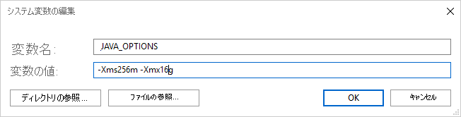

# <a name="supported-file-formats-and-compression-codecs-in-azure-data-factory"></a>Azure Data Factory でサポートされるファイル形式と圧縮コーデック

*この記事は、次のコネクターに適用されます。[Amazon S3](connector-amazon-simple-storage-service.md)、[Azure Blob](connector-azure-blob-storage.md)、[Azure Data Lake Storage Gen1](connector-azure-data-lake-store.md)、[Azure Data Lake Storage Gen2](connector-azure-data-lake-storage.md)、[Azure File Storage](connector-azure-file-storage.md)、[ファイル システム](connector-file-system.md)、[FTP](connector-ftp.md)、[Google Cloud Storage](connector-google-cloud-storage.md)、[HDFS](connector-hdfs.md)、[HTTP](connector-http.md)、および [SFTP](connector-sftp.md)。*

[!INCLUDE [data-factory-v2-file-formats](../../includes/data-factory-v2-file-formats.md)] 

>[!NOTE]
>Data Factory では新しいフォーマットベースのデータセット モデルが導入されました。詳細については、上記の対応する書式の記事を参照してください。 この記事に記載されている、ファイル ベースのデータ ストア データセットの次の構成は、後方互換性のためにまだサポートされています。 今後は新しいモデルを使用することをお勧めします。 

## <a name="text-format"></a>テキスト形式

>[!NOTE]
>Data Factory に新しい区切りテキスト形式のデータセットが導入されました。詳しくは、[区切りテキスト形式](format-delimited-text.md)に関する記事を参照してください。 ファイル ベースのデータ ストア データセットの次の構成は、後方互換性のためにまだサポートされています。 今後は新しいモデルを使用することをお勧めします。

テキスト ファイルからの読み取りまたはテキスト ファイルへの書き込みを行うには、データセットの `format` セクション で `type` プロパティを **TextFormat** に設定します。 `format` セクションに**オプションの**プロパティを指定することもできます。 構成方法については、「[TextFormat の例](#textformat-example)」セクションを参照してください。

| プロパティ | 説明 | 使用できる値 | 必須 |
| --- | --- | --- | --- |
| columnDelimiter |ファイル内の列を区切るために使用する文字。 データ内に存在する可能性が低い、出力できない珍しい文字を使用することを検討します。 たとえば、"\u0001" を指定します。これは、見出しの先頭 (SOH) を表します。 |使用できるのは 1 文字だけです。 **既定**値は**コンマ (,)** です。 <br/><br/>Unicode 文字を使用するには、[Unicode 文字](https://en.wikipedia.org/wiki/List_of_Unicode_characters)に関するページを参照して、対応するコードを取得してください。 |いいえ |
| rowDelimiter |ファイル内の行を区切るために使用する文字。 |使用できるのは 1 文字だけです。 読み取り時の**既定**値は **["\r\n"、"\r"、"\n"]** のいずれかになり、書き込み時の既定値は **"\r\n"** になります。 |いいえ |
| escapeChar |入力ファイルのコンテンツの列区切り記号をエスケープするために使用する特殊文字。 <br/><br/>1 つのテーブルに escapeChar と quoteChar の両方を指定することはできません。 |使用できるのは 1 文字だけです。 既定値はありません。 <br/><br/>例:列区切り記号としてコンマ (,) を使用しているときに、テキストにもコンマ文字を含める必要がある場合 (例:"Hello, world")、エスケープ文字として "$" を定義し、ソースで文字列 "Hello$, world" を使用できます。 |いいえ |
| quoteChar |文字列値の引用に使用する文字。 引用符文字内の列区切り文字と行区切り文字は文字列値の一部として処理されます。 このプロパティは、入力と出力の両方のデータセットに適用されます。<br/><br/>1 つのテーブルに escapeChar と quoteChar の両方を指定することはできません。 |使用できるのは 1 文字だけです。 既定値はありません。 <br/><br/>たとえば、列の区切り文字としてコンマ (,) を使用しているときにテキストにもコンマ文字が必要な場合 (例: Hello, world)、引用符文字として " (二重引用符) を定義し、ソースで文字列 "Hello, world" を使用できます。 |いいえ |
| nullValue |Null 値を表すために使用する 1 つ以上の文字。 |1 つ以上の文字。 **既定**値は、読み取り時は **"\N" および "NULL"** 、書き込み時は **"\N"** です。 |いいえ |
| encodingName |エンコード名の指定。 |有効なエンコード名。 詳細については、[Encoding.EncodingName プロパティ](https://msdn.microsoft.com/library/system.text.encoding.aspx)に関するページを参照してください。 例: windows-1250 または shift_jis。 **既定**値は **UTF-8** です。 |いいえ |
| firstRowAsHeader |先頭行をヘッダーと見なすかどうかを指定します。 入力データセットでは、Data Factory は先頭行をヘッダーとして読み取ります。 出力データセットでは、Data Factory は先頭行をヘッダーとして書き込みます。 <br/><br/>サンプル シナリオについては、「[`firstRowAsHeader` と `skipLineCount` を使用するシナリオ](#scenarios-for-using-firstrowasheader-and-skiplinecount)」を参照してください。 |True<br/><b>False (既定値)</b> |いいえ |
| skipLineCount |入力ファイルからのデータ読み取り時にスキップする**空でない**行数を示します。 skipLineCount と firstRowAsHeader の両方を指定した場合は、まず行がスキップされ、次に入力ファイルからヘッダー情報が読み取られます。 <br/><br/>サンプル シナリオについては、「[`firstRowAsHeader` と `skipLineCount` を使用するシナリオ](#scenarios-for-using-firstrowasheader-and-skiplinecount)」を参照してください。 |整数 |いいえ |
| treatEmptyAsNull |入力ファイルのデータの読み取り時に null または空の文字列 を Null 値として扱うかどうかを指定します。 |**True (既定値)**<br/>False |いいえ |

### <a name="textformat-example"></a>TextFormat の例

次のデータセットの JSON 定義では、省略可能なプロパティの一部が指定されます。

```json
"typeProperties":
{
    "folderPath": "mycontainer/myfolder",
    "fileName": "myblobname",
    "format":
    {
        "type": "TextFormat",
        "columnDelimiter": ",",
        "rowDelimiter": ";",
        "quoteChar": "\"",
        "NullValue": "NaN",
        "firstRowAsHeader": true,
        "skipLineCount": 0,
        "treatEmptyAsNull": true
    }
},
```

`quoteChar` の代わりに `escapeChar` を使用するには、`quoteChar` の含まれる行を次の escapeChar で置き換えます。

```json
"escapeChar": "$",
```

### <a name="scenarios-for-using-firstrowasheader-and-skiplinecount"></a>firstRowAsHeader と skipLineCount を使用するシナリオ

* ファイル以外のソースからテキスト ファイルにコピーし、スキーマ メタデータ(例:SQL スキーマ) を含むヘッダー行を追加する。 このシナリオでは、出力データセットの `firstRowAsHeader` を True として指定します。
* ヘッダー行を含むテキスト ファイルから、ファイル以外のシンクにコピーし、その行を削除する: 入力データセットの `firstRowAsHeader` を True として指定します。
* テキスト ファイルからコピーして、データやヘッダー情報を含まない先頭の数行をスキップする: `skipLineCount` を指定して、スキップする行数を示します。 ファイルの残りの部分にヘッダー行が含まれている場合は、`firstRowAsHeader` も指定できます。 `skipLineCount` と `firstRowAsHeader` の両方を指定した場合は、まず行がスキップされ、次に入力ファイルからヘッダー情報が読み取られます。

## <a name="json-format"></a>JSON 形式

>[!NOTE]
>Data Factory に新しい JSON 形式のデータセットが導入されました。詳しくは、[JSON](format-json.md) に関する記事を参照してください。 ファイル ベースのデータ ストア データセットの次の構成は、後方互換性のためにまだサポートされています。 今後は新しいモデルを使用することをお勧めします。

**Azure Cosmos DB との間で JSON ファイルをそのままインポート/エクスポートする**場合は、Azure Cosmos DB との間でのデータの移動に関する記事の「[Import/export JSON documents (JSON ドキュメントのインポート/エクスポート)](connector-azure-cosmos-db.md)」のセクションをご覧ください。

JSON ファイルを解析するか、JSON 形式でデータを書き込む場合は、`format` セクションの `type` プロパティを **JsonFormat** に設定します。 `format` セクションに**オプションの**プロパティを指定することもできます。 構成方法については、「[JsonFormat の例](#jsonformat-example)」セクションを参照してください。

| プロパティ | 説明 | 必須 |
| --- | --- | --- |
| filePattern |各 JSON ファイルに格納されたデータのパターンを示します。 使用できる値は、**setOfObjects** と **arrayOfObjects** です。 **既定**値は **setOfObjects** です。 これらのパターンの詳細については、「[JSON ファイルのパターン](#json-file-patterns)」セクションを参照してください。 |いいえ |
| jsonNodeReference | 同じパターンを持つ配列フィールド内のオブジェクトからのデータの反復処理と抽出を行う場合は、その配列の JSON のパスを指定します。 このプロパティは、JSON ファイル**から**データをコピーするときにのみサポートされます。 | いいえ |
| jsonPathDefinition | カスタマイズされた列名 (先頭が小文字) での列マッピングごとに JSON のパス式を指定します。 このプロパティは JSON ファイル**から**データをコピーするときにのみサポートされ、オブジェクトまたは配列からデータを抽出することができます。 <br/><br/> ルート オブジェクトの直下のフィールドの場合、ルートの $ から記述します。`jsonNodeReference` プロパティによって選択された配列内のフィールドの場合、配列要素から記述します。 構成方法については、「[JsonFormat の例](#jsonformat-example)」セクションを参照してください。 | いいえ |
| encodingName |エンコード名の指定。 有効なエンコード名の一覧については、[Encoding.EncodingName](https://msdn.microsoft.com/library/system.text.encoding.aspx) プロパティに関する記事を参照してください。 例: windows-1250 または shift_jis。 **既定** 値は、**UTF-8** です。 |いいえ |
| nestingSeparator |入れ子レベルの分割に使用される文字。 既定値は "." (ドット) です。 |いいえ |

>[!NOTE]
>配列内のデータを複数の行にクロス適用する場合 (ケース 1 -> 「[JsonFormat の例](#jsonformat-example)」のサンプル 2)、選択できるのは `jsonNodeReference` プロパティを使用した 1 つの配列の展開のみです。

### <a name="json-file-patterns"></a>JSON ファイルのパターン

コピー アクティビティでは、次の JSON ファイルのパターンを解析することができます。

- **タイプ I: setOfObjects**

    各ファイルには、単一のオブジェクト、または改行区切り/連結された複数のオブジェクトが含まれます。 出力データセットでこのオプションを選択すると、コピー アクティビティによって、各オブジェクトが行ごとに配置された (改行区切り) 1 つの JSON ファイルが生成されます。

    * **単一オブジェクトの JSON の例**

        ```json
        {
            "time": "2015-04-29T07:12:20.9100000Z",
            "callingimsi": "466920403025604",
            "callingnum1": "678948008",
            "callingnum2": "567834760",
            "switch1": "China",
            "switch2": "Germany"
        }
        ```

    * **改行区切りの JSON の例**

        ```json
        {"time":"2015-04-29T07:12:20.9100000Z","callingimsi":"466920403025604","callingnum1":"678948008","callingnum2":"567834760","switch1":"China","switch2":"Germany"}
        {"time":"2015-04-29T07:13:21.0220000Z","callingimsi":"466922202613463","callingnum1":"123436380","callingnum2":"789037573","switch1":"US","switch2":"UK"}
        {"time":"2015-04-29T07:13:21.4370000Z","callingimsi":"466923101048691","callingnum1":"678901578","callingnum2":"345626404","switch1":"Germany","switch2":"UK"}
        ```

    * **連結 JSON の例**

        ```json
        {
            "time": "2015-04-29T07:12:20.9100000Z",
            "callingimsi": "466920403025604",
            "callingnum1": "678948008",
            "callingnum2": "567834760",
            "switch1": "China",
            "switch2": "Germany"
        }
        {
            "time": "2015-04-29T07:13:21.0220000Z",
            "callingimsi": "466922202613463",
            "callingnum1": "123436380",
            "callingnum2": "789037573",
            "switch1": "US",
            "switch2": "UK"
        }
        {
            "time": "2015-04-29T07:13:21.4370000Z",
            "callingimsi": "466923101048691",
            "callingnum1": "678901578",
            "callingnum2": "345626404",
            "switch1": "Germany",
            "switch2": "UK"
        }
        ```

- **タイプ II: arrayOfObjects**

    各ファイルにはオブジェクトの配列が含まれます。

    ```json
    [
        {
            "time": "2015-04-29T07:12:20.9100000Z",
            "callingimsi": "466920403025604",
            "callingnum1": "678948008",
            "callingnum2": "567834760",
            "switch1": "China",
            "switch2": "Germany"
        },
        {
            "time": "2015-04-29T07:13:21.0220000Z",
            "callingimsi": "466922202613463",
            "callingnum1": "123436380",
            "callingnum2": "789037573",
            "switch1": "US",
            "switch2": "UK"
        },
        {
            "time": "2015-04-29T07:13:21.4370000Z",
            "callingimsi": "466923101048691",
            "callingnum1": "678901578",
            "callingnum2": "345626404",
            "switch1": "Germany",
            "switch2": "UK"
        }
    ]
    ```

### <a name="jsonformat-example"></a>JsonFormat の例

**ケース 1:JSON ファイルからのデータのコピー**

**サンプル 1: オブジェクトと配列からデータを抽出する**

このサンプルでは、1 つのルート JSON オブジェクトが表形式の結果の 1 つのレコードにマップされることを想定しています。 次の内容が含まれる JSON ファイルをお持ちで、

```json
{
    "id": "ed0e4960-d9c5-11e6-85dc-d7996816aad3",
    "context": {
        "device": {
            "type": "PC"
        },
        "custom": {
            "dimensions": [
                {
                    "TargetResourceType": "Microsoft.Compute/virtualMachines"
                },
                {
                    "ResourceManagementProcessRunId": "827f8aaa-ab72-437c-ba48-d8917a7336a3"
                },
                {
                    "OccurrenceTime": "1/13/2017 11:24:37 AM"
                }
            ]
        }
    }
}
```

オブジェクトと配列両方からデータを抽出することで、上記の内容を次の形式の Azure SQL テーブルにコピーします。

| id | deviceType | targetResourceType | resourceManagementProcessRunId | occurrenceTime |
| --- | --- | --- | --- | --- |
| ed0e4960-d9c5-11e6-85dc-d7996816aad3 | PC | Microsoft.Compute/virtualMachines | 827f8aaa-ab72-437c-ba48-d8917a7336a3 | 1/13/2017 11:24:37 AM |

**JsonFormat** 型の入力データセットは次のように定義されます (関連する部分のみでの部分的な定義)。 具体的には次のとおりです。

- `structure` セクションでは、表形式データへの変換中に、カスタマイズされた列名と、対応するデータ型を定義します。 このセクションは、列マッピングを行う必要がない場合は**省略可能**です。 詳しくは、[変換先のデータセット列へのソース データセット列のマップ](copy-activity-schema-and-type-mapping.md)に関するページをご覧ください。
- `jsonPathDefinition` は、データを抽出する位置を示す各列の JSON のパスを指定します。 配列からデータをコピーするには、`array[x].property` を使用して `xth` 番目のオブジェクトから特定のプロパティの値を抽出するか、`array[*].property` を使用してこのようなプロパティを含むオブジェクトから値を見つけることができます。

```json
"properties": {
    "structure": [
        {
            "name": "id",
            "type": "String"
        },
        {
            "name": "deviceType",
            "type": "String"
        },
        {
            "name": "targetResourceType",
            "type": "String"
        },
        {
            "name": "resourceManagementProcessRunId",
            "type": "String"
        },
        {
            "name": "occurrenceTime",
            "type": "DateTime"
        }
    ],
    "typeProperties": {
        "folderPath": "mycontainer/myfolder",
        "format": {
            "type": "JsonFormat",
            "filePattern": "setOfObjects",
            "jsonPathDefinition": {"id": "$.id", "deviceType": "$.context.device.type", "targetResourceType": "$.context.custom.dimensions[0].TargetResourceType", "resourceManagementProcessRunId": "$.context.custom.dimensions[1].ResourceManagementProcessRunId", "occurrenceTime": " $.context.custom.dimensions[2].OccurrenceTime"}
        }
    }
}
```

**サンプル 2: 同じパターンの複数のオブジェクトを配列からクロス適用する**

このサンプルでは、表形式の結果において 1 つのルート JSON オブジェクトを複数のレコードに変換することを想定しています。 次の内容が含まれる JSON ファイルをお持ちで、

```json
{
    "ordernumber": "01",
    "orderdate": "20170122",
    "orderlines": [
        {
            "prod": "p1",
            "price": 23
        },
        {
            "prod": "p2",
            "price": 13
        },
        {
            "prod": "p3",
            "price": 231
        }
    ],
    "city": [ { "sanmateo": "No 1" } ]
}
```

配列内のデータをフラット化し、共通のルート情報とクロス結合させることで Azure SQL テーブルに次の形式でコピーする場合:

| `ordernumber` | `orderdate` | `order_pd` | `order_price` | `city` |
| --- | --- | --- | --- | --- |
| 01 | 20170122 | P1 | 23 | `[{"sanmateo":"No 1"}]` |
| 01 | 20170122 | P2 | 13 | `[{"sanmateo":"No 1"}]` |
| 01 | 20170122 | P3 | 231 | `[{"sanmateo":"No 1"}]` |


**JsonFormat** 型の入力データセットは次のように定義されます (関連する部分のみでの部分的な定義)。 具体的には次のとおりです。

- `structure` セクションでは、表形式データへの変換中に、カスタマイズされた列名と、対応するデータ型を定義します。 このセクションは、列マッピングを行う必要がない場合は**省略可能**です。 詳しくは、[変換先のデータセット列へのソース データセット列のマップ](copy-activity-schema-and-type-mapping.md)に関するページをご覧ください。
- `jsonNodeReference` は、`orderlines` という**配列**の直下にある同じパターンのオブジェクトからのデータの反復処理と抽出を行うことを示します。
- `jsonPathDefinition` は、データを抽出する位置を示す各列の JSON のパスを指定します。 この例での `ordernumber`、`orderdate`、`city` は、`$.` から始まる JSON のパスが含まれるルート オブジェクトの直下にあります。`order_pd` と `order_price` は、`$.` のない配列要素から派生したパスで定義されています。

```json
"properties": {
    "structure": [
        {
            "name": "ordernumber",
            "type": "String"
        },
        {
            "name": "orderdate",
            "type": "String"
        },
        {
            "name": "order_pd",
            "type": "String"
        },
        {
            "name": "order_price",
            "type": "Int64"
        },
        {
            "name": "city",
            "type": "String"
        }
    ],
    "typeProperties": {
        "folderPath": "mycontainer/myfolder",
        "format": {
            "type": "JsonFormat",
            "filePattern": "setOfObjects",
            "jsonNodeReference": "$.orderlines",
            "jsonPathDefinition": {"ordernumber": "$.ordernumber", "orderdate": "$.orderdate", "order_pd": "prod", "order_price": "price", "city": " $.city"}
        }
    }
}
```

**以下の点に注意してください。**

* `structure` と `jsonPathDefinition` が Data Factory データセット内で定義されていない場合、コピー アクティビティでは最初のオブジェクトからスキーマを検出し、オブジェクト全体をフラット化します。
* JSON 入力に配列がある場合、コピー アクティビティは既定で配列値全体を文字列に変換します。 `jsonNodeReference` と `jsonPathDefinition` の両方またはどちらかからデータを抽出するか、`jsonPathDefinition` でこれを指定せずにスキップすることが可能です。
* 同じレベルに重複する名前がある場合、コピー アクティビティでは最後の 1 つが選択されます。
* プロパティ名では大文字と小文字が区別されます。 名前は同じでも大文字小文字が異なる 2 つのプロパティは、2 つの個別のプロパティとして扱われます。

**ケース 2:JSON ファイルへのデータの書き込み**

SQL Database 内に次のテーブルが含まれているとします。

| id | order_date | order_price | order_by |
| --- | --- | --- | --- |
| 1 | 20170119 | 2000 | David |
| 2 | 20170120 | 3500 | Patrick |
| 3 | 20170121 | 4000 | Jason |

また、レコードごとに、次の形式で JSON オブジェクトに書き込みます。

```json
{
    "id": "1",
    "order": {
        "date": "20170119",
        "price": 2000,
        "customer": "David"
    }
}
```

**JsonFormat** 型の出力データセットは次のように定義されます (関連する部分のみでの部分的な定義)。 具体的には、`structure` セクションでは、目的のファイル内のカスタマイズされたプロパティ名を定義します。`nestingSeparator` (既定では ".") は、入れ子のレイヤーを名前から識別するために使用されます。 このセクションは、ソース列名と比較してプロパティ名を変更したり、一部のプロパティを入れ子にしたりする必要がない場合は**省略可能**です。

```json
"properties": {
    "structure": [
        {
            "name": "id",
            "type": "String"
        },
        {
            "name": "order.date",
            "type": "String"
        },
        {
            "name": "order.price",
            "type": "Int64"
        },
        {
            "name": "order.customer",
            "type": "String"
        }
    ],
    "typeProperties": {
        "folderPath": "mycontainer/myfolder",
        "format": {
            "type": "JsonFormat"
        }
    }
}
```

## <a name="parquet-format"></a>Parquet 形式

>[!NOTE]
>Data Factory に新しい Parquet 形式のデータセットが導入されました。詳しくは、[Parquet 形式](format-parquet.md)に関する記事を参照してください。 ファイル ベースのデータ ストア データセットの次の構成は、後方互換性のためにまだサポートされています。 今後は新しいモデルを使用することをお勧めします。

Parquet ファイルを解析するか、Parquet 形式でデータを書き込む場合は、`format` `type` プロパティを **ParquetFormat** に設定します。 typeProperties セクション内の Format セクションにプロパティを指定する必要はありません。 例:

```json
"format":
{
    "type": "ParquetFormat"
}
```

以下の点に注意してください。

* 複雑なデータ型はサポートされていません (MAP、LIST)。
* 列名では、空白はサポートされません。
* Parquet ファイルには、圧縮関連のオプションとして、NONE、SNAPPY、GZIP、LZO があります。 Data Factory では、LZO を除く、これらすべての圧縮形式の Parquet ファイルからデータを読み取ることができます。データの読み取りには、メタデータ内の圧縮コーデックが使用されます。 ただし、Data Factory で Parquet ファイルに書き込むときは、Parquet 形式の既定の動作である SNAPPY が選択されます。 現時点でこの動作をオーバーライドするオプションはありません。

> [!IMPORTANT]
> セルフホステッド統合ランタイム を利用するコピー (たとえば、オンプレミスとクラウド データ ストア間) では、Parquet ファイルを**そのまま**コピーしない場合、IR マシン上に **64 ビット JRE 8 (Java Runtime Environment) または OpenJDK** をインストールする必要があります。 詳細については、次の段落を参照してください。

Parquet ファイルのシリアル化/逆シリアル化を使用してセルフホステッド IR 上で実行されるコピーでは、ADF は最初に JRE のレジストリ *`(SOFTWARE\JavaSoft\Java Runtime Environment\{Current Version}\JavaHome)`* を調べ、見つからない場合は次に OpenJDK のシステム変数 *`JAVA_HOME`* を調べることで、Java ランタイムを見つけます。

- **JRE を使用する場合**:64 ビット IR には 64 ビット JRE が必要です。 [こちら](https://go.microsoft.com/fwlink/?LinkId=808605)から入手できます。
- **OpenJDK を使用する場合**: IR バージョン 3.13 以降でサポートされています。 jvm.dll を他のすべての必要な OpenJDK のアセンブリと共にセルフホステッド IR マシンにパッケージ化し、それに応じてシステム環境変数 JAVA_HOME を設定します。

>[!TIP]
>セルフホステッド統合ランタイムを使用して、 Parquet 形式をコピー元またはコピー先にしてデータをコピーしたときに、[An error occurred when invoking java, message: **java.lang.OutOfMemoryError:Java heap space** (java の呼び出し中にエラーが発生しました。メッセージ: java.lang.OutOfMemoryError:Java heap space)] というエラーが発生する場合は、まず、セルフホステッド IR のホストであるマシン内に環境変数 `_JAVA_OPTIONS` を追加してください。次に、JVM の最小/最大ヒープ サイズを調整し、コピーを行えるようにしてから、パイプラインを再実行してください。



例: 変数 `_JAVA_OPTIONS` を設定して、値 `-Xms256m -Xmx16g` を指定します。 フラグ `Xms` では、Java 仮想マシン (JVM) の初期メモリ割り当てプールを指定します。`Xmx` では、最大メモリ割り当てプールを指定します。 これは、JVM 起動時のメモリ量が `Xms`、使用可能なメモリ量が最大で `Xmx` であることを意味します。 既定では、ADF では、最小で 64MB、最大で 1G が使用されます。

### <a name="data-type-mapping-for-parquet-files"></a>Parquet ファイルのデータ型マッピング

| Data Factory の中間データ型 | Parquet のプリミティブ型 | Parquet の元の型 (逆シリアル化) | Parquet の元の型 (シリアル化) |
|:--- |:--- |:--- |:--- |
| Boolean | Boolean | 該当なし | 該当なし |
| SByte | Int32 | Int8 | Int8 |
| Byte | Int32 | UInt8 | Int16 |
| Int16 | Int32 | Int16 | Int16 |
| UInt16 | Int32 | UInt16 | Int32 |
| Int32 | Int32 | Int32 | Int32 |
| UInt32 | Int64 | UInt32 | Int64 |
| Int64 | Int64 | Int64 | Int64 |
| UInt64 | Int64/Binary | UInt64 | Decimal |
| Single | Float | 該当なし | 該当なし |
| Double | Double | 該当なし | 該当なし |
| Decimal | Binary | Decimal | Decimal |
| string | Binary | Utf8 | Utf8 |
| DateTime | Int96 | 該当なし | 該当なし |
| TimeSpan | Int96 | 該当なし | 該当なし |
| DateTimeOffset | Int96 | 該当なし | 該当なし |
| ByteArray | Binary | 該当なし | 該当なし |
| Guid | Binary | Utf8 | Utf8 |
| Char | Binary | Utf8 | Utf8 |
| CharArray | サポートされていません | 該当なし | 該当なし |

## <a name="orc-format"></a>ORC 形式

>[!NOTE]
>Data Factory に新しい ORC 形式のデータセットが導入されました。詳しくは、[ORC 形式](format-orc.md)に関する記事を参照してください。 ファイル ベースのデータ ストア データセットの次の構成は、後方互換性のためにまだサポートされています。 今後は新しいモデルを使用することをお勧めします。

ORC ファイルを解析するか、ORC 形式でデータを書き込む場合は、`format` `type` プロパティを **OrcFormat** に設定します。 typeProperties セクション内の Format セクションにプロパティを指定する必要はありません。 例:

```json
"format":
{
    "type": "OrcFormat"
}
```

以下の点に注意してください。

* 複雑なデータ型はサポートされていません (STRUCT、MAP、LIST、UNION)。
* 列名では、空白はサポートされません。
* ORC ファイルには、[圧縮関連のオプション](https://hortonworks.com/blog/orcfile-in-hdp-2-better-compression-better-performance/)として、NONE、ZLIB、SNAPPY の 3 つがあります。 Data Factory では、これらすべての圧縮形式の ORC ファイルからデータを読み取ることができます。 データの読み取りには、メタデータ内の圧縮コーデックが使用されます。 ただし、Data Factory で ORC ファイルに書き込むときは、ORC の既定の動作である ZLIB が選択されます。 現時点でこの動作をオーバーライドするオプションはありません。

> [!IMPORTANT]
> セルフホステッド統合ランタイム を利用するコピー (たとえば、オンプレミスとクラウド データ ストア間) では、Parquet ファイルを**そのまま**コピーしない場合、IR マシン上に **64 ビット JRE 8 (Java Runtime Environment) または OpenJDK** をインストールする必要があります。 詳細については、次の段落を参照してください。

ORC ファイルのシリアル化/逆シリアル化を使用してセルフホステッド IR 上で実行されるコピーでは、ADF は最初に JRE のレジストリ *`(SOFTWARE\JavaSoft\Java Runtime Environment\{Current Version}\JavaHome)`* を調べ、見つからない場合は次に OpenJDK のシステム変数 *`JAVA_HOME`* を調べることで、Java ランタイムを見つけます。

- **JRE を使用する場合**:64 ビット IR には 64 ビット JRE が必要です。 [こちら](https://go.microsoft.com/fwlink/?LinkId=808605)から入手できます。
- **OpenJDK を使用する場合**: IR バージョン 3.13 以降でサポートされています。 jvm.dll を他のすべての必要な OpenJDK のアセンブリと共にセルフホステッド IR マシンにパッケージ化し、それに応じてシステム環境変数 JAVA_HOME を設定します。

### <a name="data-type-mapping-for-orc-files"></a>ORC ファイルデータ型マッピング

| Data Factory の中間データ型 | ORC 型 |
|:--- |:--- |
| Boolean | Boolean |
| SByte | Byte |
| Byte | ショート |
| Int16 | ショート |
| UInt16 | int |
| Int32 | int |
| UInt32 | long |
| Int64 | long |
| UInt64 | string |
| Single | Float |
| Double | Double |
| Decimal | Decimal |
| string | string |
| DateTime | Timestamp |
| DateTimeOffset | Timestamp |
| TimeSpan | Timestamp |
| ByteArray | Binary |
| Guid | string |
| Char | Char(1) |

## <a name="avro-format"></a>AVRO 形式

>[!NOTE]
>Data Factory に新しい Avro 形式のデータセットが導入されました。詳しくは、[Avri 形式](format-avro.md)に関する記事を参照してください。 ファイル ベースのデータ ストア データセットの次の構成は、後方互換性のためにまだサポートされています。 今後は新しいモデルを使用することをお勧めします。

Avro ファイルを解析するか、Avro 形式でデータを書き込む場合は、`format` `type` プロパティを **AvroFormat** に設定します。 typeProperties セクション内の Format セクションにプロパティを指定する必要はありません。 例:

```json
"format":
{
    "type": "AvroFormat",
}
```

Hive テーブルで Avro 形式を使用するには、 [Apache Hive のチュートリアルに関するページ](https://cwiki.apache.org/confluence/display/Hive/AvroSerDe)を参照してください。

以下の点に注意してください。

* [複合データ型](https://avro.apache.org/docs/current/spec.html#schema_complex)はサポートされていません (レコード、列挙型、配列、マップ、共用体、および固定)。

## <a name="binary-format"></a>バイナリ形式

詳しくは、[バイナリ形式](format-binary.md)に関する記事をご覧ください。

## <a name="compression-support"></a>圧縮のサポート

Azure Data Factory は、コピー中のデータの圧縮/圧縮解除をサポートします。 `compression` プロパティを入力データセットで指定すると、コピー アクティビティでソースから圧縮データを読み取り、圧縮を解除することができます。このプロパティを出力データセットで指定すると、コピー アクティビティによりシンクへの書き込みデータを圧縮することができます。 いくつかのサンプル シナリオを次に示します。

* Azure BLOB から GZIP 圧縮データを読み取り、展開して、生成されたデータを Azure SQL データベースに書き込みます。 `compression` `type` プロパティを使用して、Azure BLOB 入力データセットを GZIP として定義します。
* オンプレミスのファイル システムのプレーンテキスト ファイルからデータを読み取り、GZip 形式で圧縮して、圧縮データを Azure BLOB に書き込みます。 `compression` `type` プロパティを使用して、Azure BLOB 出力データセットを GZip として定義します。
* FTP サーバーから .zip ファイルを読み取り、圧縮解除して中にあるファイルを取得し、それらのファイルを Azure Data Lake Store に格納します。 `compression` `type` プロパティを使用して、FTP 入力データセットを ZipDeflate として定義します。
* Azure BLOB から GZIP 圧縮データを読み取って展開し、BZIP2 で圧縮して、生成されたデータを Azure BLOB に書き込みます。 Azure BLOB 入力データセットは `compression` `type` を GZIP に設定して定義し、Azure BLOB 出力データセットは `compression` `type` を BZIP2 に設定して定義します。

データセットの圧縮を指定するには、次の例のように、データセットの JSON で **compression** プロパティを使用します。

```json
{
    "name": "AzureBlobDataSet",
    "properties": {
        "type": "AzureBlob",
        "linkedServiceName": {
            "referenceName": "StorageLinkedService",
            "type": "LinkedServiceReference"
        },
        "typeProperties": {
            "fileName": "pagecounts.csv.gz",
            "folderPath": "compression/file/",
            "format": {
                "type": "TextFormat"
            },
            "compression": {
                "type": "GZip",
                "level": "Optimal"
            }
        }
    }
}
```

**compression** セクションには次の 2 つのプロパティがあります。

* **Type:** 圧縮コーデックです。**GZIP**、**Deflate**、**BZIP2**、または **ZipDeflate** を選択できます。
* **level:** 圧縮率です。**Optimal** または **Fastest** を指定できます。

  * **Fastest:** 圧縮操作は可能な限り短時間で完了しますが、圧縮後のファイルが最適に圧縮されていない場合があります。
  * **Optimal**:圧縮操作で最適に圧縮されますが、操作が完了するまでに時間がかかる場合があります。

    詳細については、 [圧縮レベル](https://msdn.microsoft.com/library/system.io.compression.compressionlevel.aspx) に関するトピックをご覧ください。

> [!NOTE]
> **AvroFormat**、**OrcFormat**、および **ParquetFormat** のデータの圧縮設定はサポートされていません。 こうした形式でファイルを読み取るとき、Data Factory は、メタデータ内の圧縮コーデックを検出して使用します。 ファイルに書き込むときは、その形式の既定の圧縮コーデックを選択します。 たとえば、OrcFormat には ZLIB、ParquetFormat には SNAPPY が選択されます。

## <a name="unsupported-file-types-and-compression-formats"></a>サポートされていないファイル形式と圧縮形式

Azure Data Factory の拡張機能を使用して、サポートされていないファイルに変換することができます。
Azure Function、および Azure Batch を使用することによるカスタム タスクという 2つのオプションがあります。

Azure Function を使用して [tar ファイルの内容を抽出する](https://github.com/Azure/Azure-DataFactory/tree/master/SamplesV2/UntarAzureFilesWithAzureFunction)サンプルをご覧いただけます。 詳細については、「[Azure Functions アクティビティ](https://docs.microsoft.com/azure/data-factory/control-flow-azure-function-activity)」をご覧ください。

また、カスタム dotnet アクティビティを使用してこの機能性を構築することもできます。 詳細については、[ここ](https://docs.microsoft.com/azure/data-factory/transform-data-using-dotnet-custom-activity)を参照してください。

## <a name="next-steps"></a>次の手順

Azure Data Factory でサポートされるファイル ベースのデータ ストアについては、次の記事を参照してください。

- [Azure Blob Storage コネクタ](connector-azure-blob-storage.md)
- [Azure Data Lake Store コネクタ](connector-azure-data-lake-store.md)
- [Amazon S3 コネクタ](connector-amazon-simple-storage-service.md)
- [ファイル システム コネクタ](connector-file-system.md)
- [FTP コネクタ](connector-ftp.md)
- [SFTP コネクタ](connector-sftp.md)
- [HDFS コネクタ](connector-hdfs.md)
- [HTTP コネクタ](connector-http.md)
