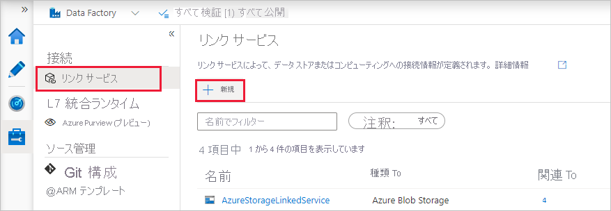
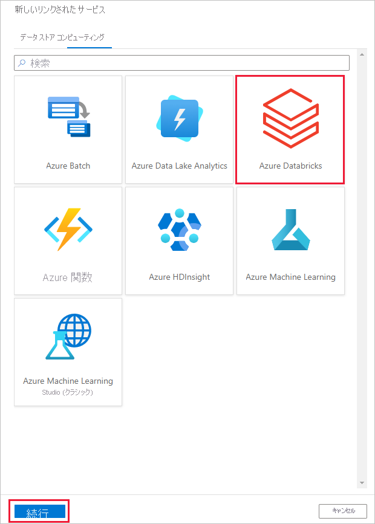
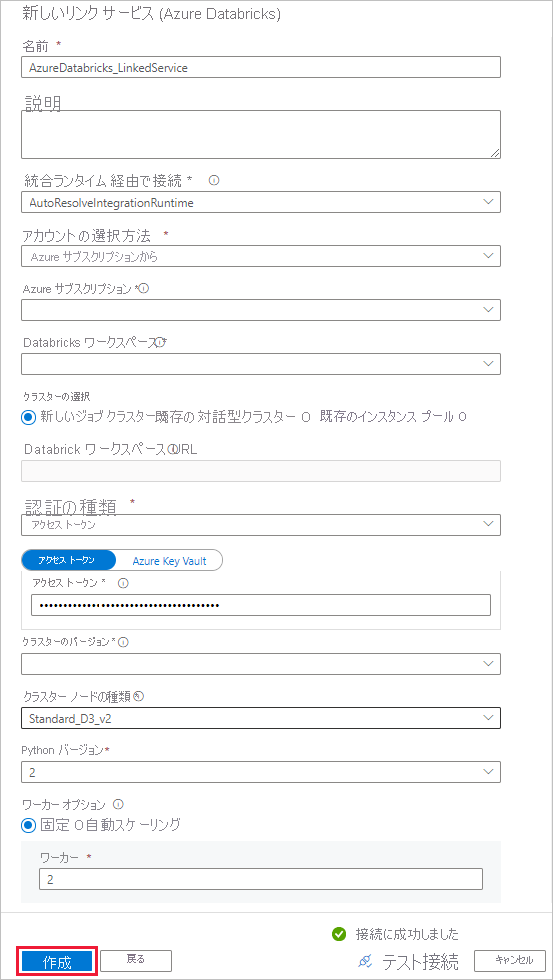
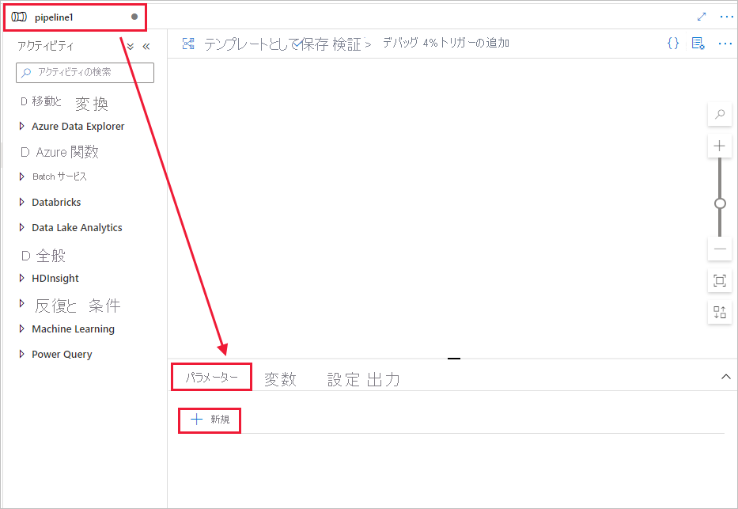
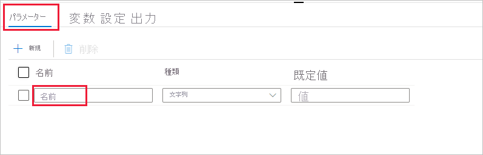
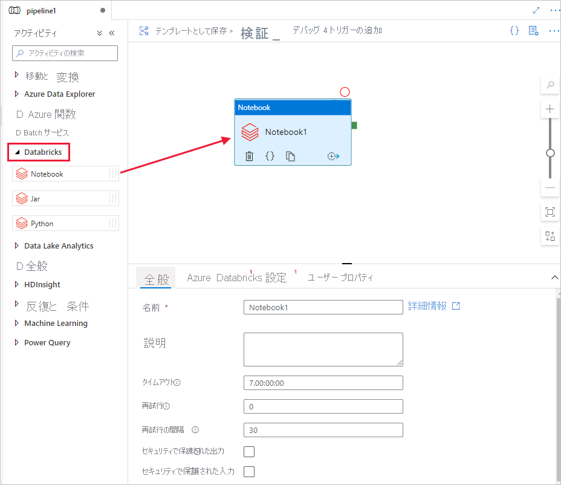
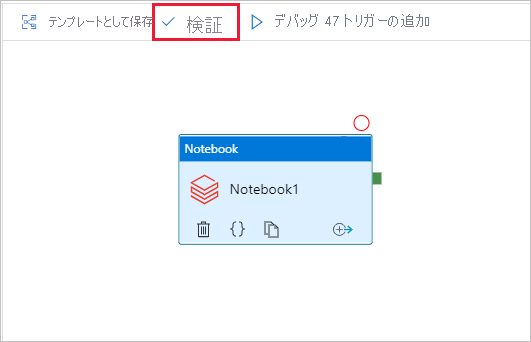
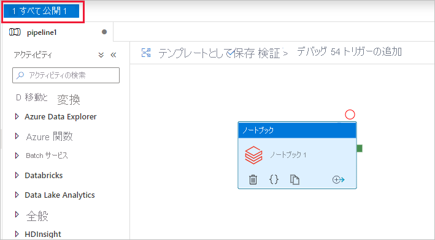

# <a name="run-a-databricks-notebook-with-the-databricks-notebook-activity-in-azure-data-factory"></a>Azure Data Factory で Databricks Notebook アクティビティを使用して Databricks Notebook を実行する

[!INCLUDE[appliesto-adf-xxx-md](includes/appliesto-adf-xxx-md.md)]

このチュートリアルでは、Azure Portal を使用して、Databricks ジョブ クラスターに対して Databricks Notebook を実行する Azure Data Factory パイプラインを作成します。 また、Databricks Notebook の実行中に、Azure Data Factory パラメーターを渡します。

このチュートリアルでは、以下の手順を実行します。

  - データ ファクトリを作成します。

  - Databricks Notebook アクティビティを使用するパイプラインを作成します。

  - パイプラインの実行をトリガーする。

  - パイプラインの実行を監視します。

Azure サブスクリプションをお持ちでない場合は、開始する前に [無料アカウント](https://azure.microsoft.com/free/) を作成してください。

この機能の概要とデモンストレーションについては、以下の 11 分間の動画を視聴してください。

> [!VIDEO https://channel9.msdn.com/Shows/Azure-Friday/ingest-prepare-and-transform-using-azure-databricks-and-data-factory/player]

## <a name="prerequisites"></a>前提条件

  - **Azure Databricks ワークスペース**。 [Databricks ワークスペースを作成する](/azure/databricks/scenarios/quickstart-create-databricks-workspace-portal)か、既存のワークスペースを使用します。 Azure Databricks ワークスペースに、Python ノートブックを作成します。 その後、Azure Data Factory を使用してノートブックを実行し、パラメーターを渡します。

## <a name="create-a-data-factory"></a>Data Factory の作成

1. Web ブラウザー (**Microsoft Edge** または **Google Chrome**) を起動します。 現在、Data Factory の UI がサポートされる Web ブラウザーは Microsoft Edge と Google Chrome だけです。

1. Azure portal メニューの **[リソースの作成]** を選択し、 **[統合]** 、 **[Data Factory]** の順に選択します。

    :::image type="content" source="./media/doc-common-process/new-azure-data-factory-menu.png" alt-text="[新規] ウィンドウでの [Data Factory] の選択を示すスクリーンショット。":::

1. **[Create Data Factory]\(データ ファクトリの作成\)** ページの **[基本]** タブで、データ ファクトリを作成する Azure **サブスクリプション** を選択します。

1. **[リソース グループ]** で、次の手順のいずれかを行います。
    
    1. ドロップダウン リストから既存のリソース グループを選択します。
    
    1. **[新規作成]** を選択し、新しいリソース グループの名前を入力します。

    リソース グループの詳細については、 [リソース グループを使用した Azure のリソースの管理](../azure-resource-manager/management/overview.md)に関するページを参照してください。

1. **[リージョン]** で、データ ファクトリの場所を選択します。

    この一覧に表示されるのは、Data Factory でサポートされ、かつ Azure Data Factory のメタ データが格納される場所のみです。 Data Factory で使用する関連データ ストア (Azure Storage、Azure SQL Database など) やコンピューティング (Azure HDInsight など) は他のリージョンで実行できます。

1. **[名前]** に「**ADFTutorialDataFactory**」と入力します。
    
    Azure データ ファクトリの名前は *グローバルに一意* にする必要があります。 次のエラーが発生した場合は、データ ファクトリの名前を変更します ( **&lt;yourname&gt;ADFTutorialDataFactory** などを使用)。 Data Factory アーティファクトの名前付け規則については、[Data Factory の名前付け規則](./naming-rules.md)に関する記事を参照してください。

    :::image type="content" source="./media/doc-common-process/name-not-available-error.png" alt-text="名前が使用できない場合のエラーを示すスクリーンショット。":::

1. **[バージョン]** で、 **[V2]** を選択します。

1. **Next:Git configuration\(次へ: Git の構成\)** を選択し、**Configure Git later\(後で Git を構成する\)** チェック ボックスをオンにします。

1. **[確認と作成]** を選択し、検証に成功したら **[作成]** を選択します。 

1. 作成後、 **[リソースに移動]** を選択して、 **[Data factory]** ページに移動します。 **[Azure Data Factory Studio を開く]** タイルを選択して、別のブラウザー タブで Azure Data Factory ユーザー インターフェイス (UI) アプリケーションを起動します。

    :::image type="content" source="./media/doc-common-process/data-factory-home-page.png" alt-text="[Azure Data Factory Studio を開く] タイルを含む、Azure Data Factory のホーム ページを示すスクリーンショット。":::

## <a name="create-linked-services"></a>リンクされたサービスを作成します

このセクションでは、Databricks のリンクされたサービスを作成します。 このリンクされたサービスには、Databricks クラスターへの接続情報が含まれています。

### <a name="create-an-azure-databricks-linked-service"></a>Azure Databricks のリンクされたサービスを作成する

1.  ホーム ページの左側のパネルで **[管理]** タブに切り替えます。

    ![[管理] タブを示すスクリーンショット。](media/doc-common-process/get-started-page-manage-button.png)

1.  **[接続]** で **[リンク サービス]** を選択して、 **[+ 新規]** を選択します。
    
    

1.  **[新しいリンク サービス]** ウィンドウで、 **[コンピューティング]** &gt; **[Azure Databricks]** の順に選択し、 **[続行]** を選択します。
    
    

1.  **[新しいリンク サービス]** ウィンドウで、次の手順を完了します。
    
    1.  **[名前]** に「**_AzureDatabricks\_LinkedService_**」と入力します。
    
    1.  ノートブックを実行する適切な **Databricks ワークスペース** を選択します。

    1.  **[Select cluster]\(クラスターの選択)** で **[New job cluster]\(新しいジョブ クラスター)** を選択します。
    
    1.  **[Databricks Workspace URL]\(Databricks ワークスペースの URL\)** では、情報が自動入力されます。

    1.  **[アクセス トークン]** で、Azure Databricks ワークスペースからトークンを生成します。 手順については、[こちら](https://docs.databricks.com/api/latest/authentication.html#generate-token)を参照してください。

    1.  **[クラスター バージョン]** で、 **[4.2]** (Apache Spark 2.3.1、Scala 2.11 を含む) を選択します。

    1.  このチュートリアルでは、 **[Cluster node type]\(クラスター ノードの種類)** で、 **[General Purpose (HDD)]\(一般的な目的 (HDD))** カテゴリの **[Standard\_D3\_v2]** を選択します。 
    
    1.  **[ワーカー]** に「**2**」と入力します。
    
    1.  **［作成］** を選択します

        

## <a name="create-a-pipeline"></a>パイプラインを作成する

1.  **+** (正符号) ボタンを選択し、メニューの **[パイプライン]** を選択します。

    

1.  **パイプライン** で使用される **パラメーター** を作成します。 後で、このパラメーターを Databricks Notebook アクティビティに渡します。 空のパイプラインで **[パラメーター]** タブをクリックし、次に **[+ 新規]** をクリックして、"**name**" という名前を付けます。

    

    

1.  **[アクティビティ]** ツールボックスで **[Databricks]** を展開します。 **[アクティビティ]** ツールボックスからパイプライン デザイナー画面に **Notebook** アクティビティをドラッグします。

    

1.  下部の **Databricks** **Notebook** アクティビティ ウィンドウのプロパティで、次の手順を完了します。

    1. **[Azure Databricks]** タブに切り替えます。

    1. **[AzureDatabricks\_LinkedService]** (前の手順で作成したもの) を選択します。

    1. **[設定]** タブに切り替えます。

    1. 参照して、Databricks の **ノートブックのパス** を選択します。 ノートブックを作成し、ここでパスを指定しましょう。 次の手順に従って、ノートブックのパスを取得します。

       1. Azure Databricks ワークスペースを起動します。

       1. ワークスペースで **新しいフォルダー** を作成し、**adftutorial** という名前にします。

          

       1. [新しいノートブックの作成方法を示すスクリーンショット。](https://docs.databricks.com/user-guide/notebooks/index.html#creating-a-notebook) (Python)、**adftutorial** フォルダーの下で **mynotebook** という名前にして、 **[作成]** をクリックします。

          

          

       1. 新しく作成されたノートブック "mynotebook&quot; に次のコードを追加します。

           ```
           # Creating widgets for leveraging parameters, and printing the parameters

           dbutils.widgets.text(&quot;input&quot;, &quot;&quot;,&quot;")
           y = dbutils.widgets.get("input")
           print ("Param -\'input':")
           print (y)
           ```

           

       1. ここでの **Notebook パス** は、 **/adftutorial/mynotebook** です。

1.  **Data Factory UI 作成ツール** に戻ります。 **Notebook1** アクティビティの **[設定]** タブに移動します。

    a.  Notebook アクティビティに **パラメーター** を追加します。 前に **パイプライン** に追加したのと同じパラメーターを使用します。

       

    b.  パラメーターの名前を **input** にして、値を式 **\@pipeline().parameters.name** として指定します。

1.  パイプラインを検証するために、ツール バーの **[検証]** ボタンを選択します。 検証ウィンドウを閉じるには、 **[閉じる]** ボタンを選択します。

    

1.  **[すべて公開]** を選択します。 Data Factory UI により、エンティティ (リンクされたサービスとパイプライン) が Azure Data Factory サービスに公開されます。

    

## <a name="trigger-a-pipeline-run"></a>パイプラインの実行をトリガーする

ツール バーで **[トリガーの追加]** を選択し、 **[Trigger now]\(今すぐトリガー\)** を選択します。

![[Trigger now]\(今すぐトリガー\) コマンドを選択する方法を示すスクリーンショット。](media/transform-data-using-databricks-notebook/databricks-notebook-activity-image-20.png)

**[パイプライン実行]** ダイアログ ボックスで、**name** パラメーターの指定を求められます。 ここでは、パラメーターとして **/path/filename** を使用します。 **[OK]** を選択します。


## <a name="monitor-the-pipeline-run"></a>パイプラインの実行を監視します

1.  **[監視]** タブに切り替えます。パイプラインが実行されていることを確認します。 ノートブックが実行される Databricks ジョブ クラスターを作成するには、5 分から 8 分ほどかかります。

    

1.  **[最新の情報に更新]** を定期的にクリックして、パイプラインの実行の状態を確認します。

1.  パイプラインの実行に関連付けられているアクティビティの実行を表示するために、 **[アクション]** 列の **[View Activity Runs]\(アクティビティの実行の表示\)** を選択します。

    

上部の **[パイプライン]** リンクを選択すると、パイプラインの実行ビューに戻ることができます。

## <a name="verify-the-output"></a>出力を検証する

**Azure Databricks ワークスペース** にログオンし、 **[クラスター]** に移動すると、**ジョブ** の状態 (*実行の保留中、実行中、または終了*) を確認できます。


**ジョブ名** をクリックすると、より詳しい情報が表示されます。 正常に実行されると、渡されたパラメーターと、Python ノートブックの出力を検証できます。


## <a name="next-steps"></a>次のステップ

このサンプルのパイプラインでは、Databricks Notebook アクティビティをトリガーし、それにパラメーターを渡します。 以下の方法を学習しました。

  - データ ファクトリを作成します。

  - Databricks Notebook アクティビティを使用するパイプラインを作成します。

  - パイプラインの実行をトリガーする。

  - パイプラインの実行を監視します。