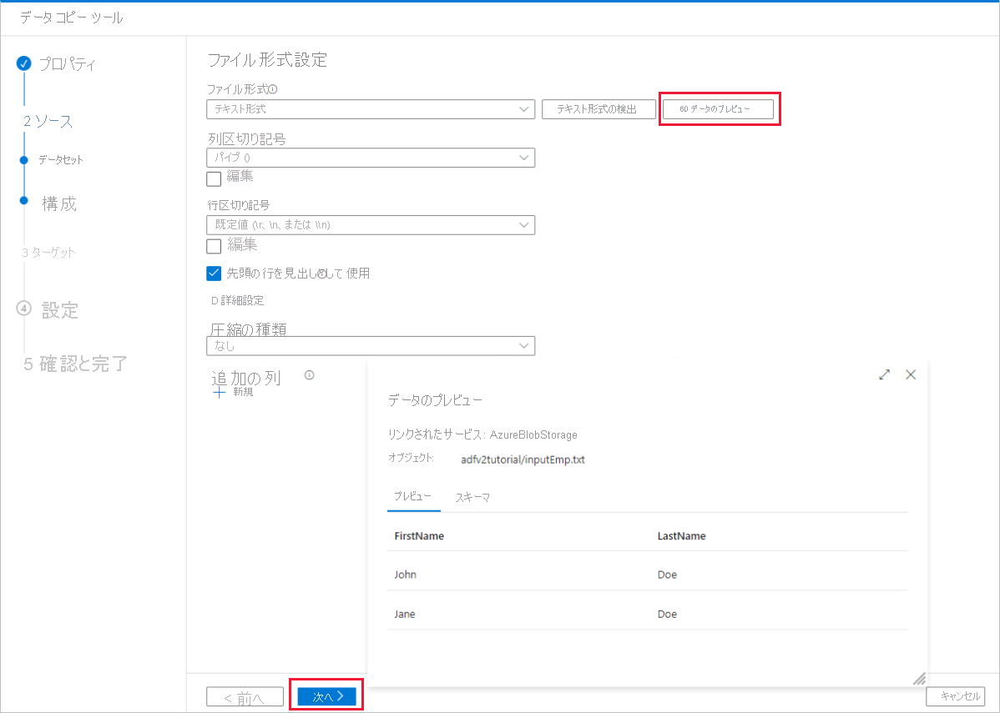
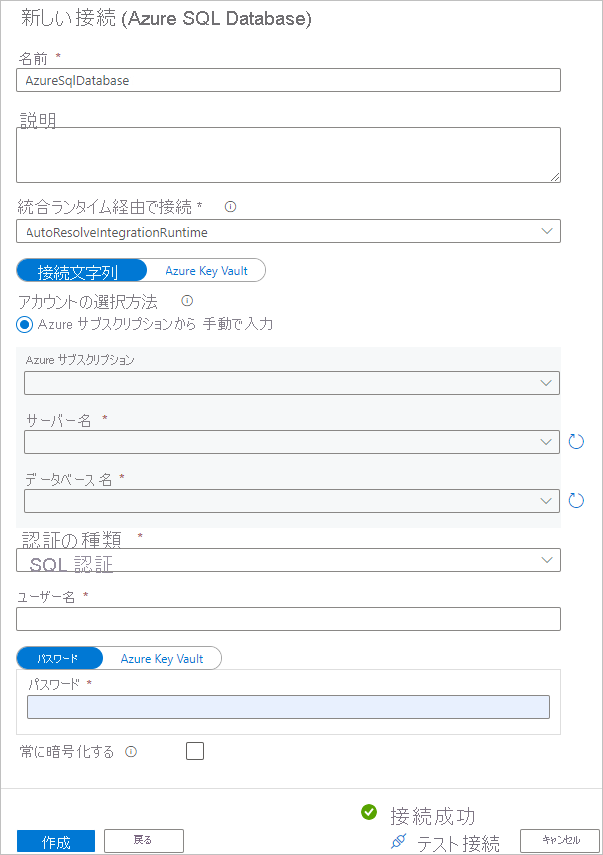
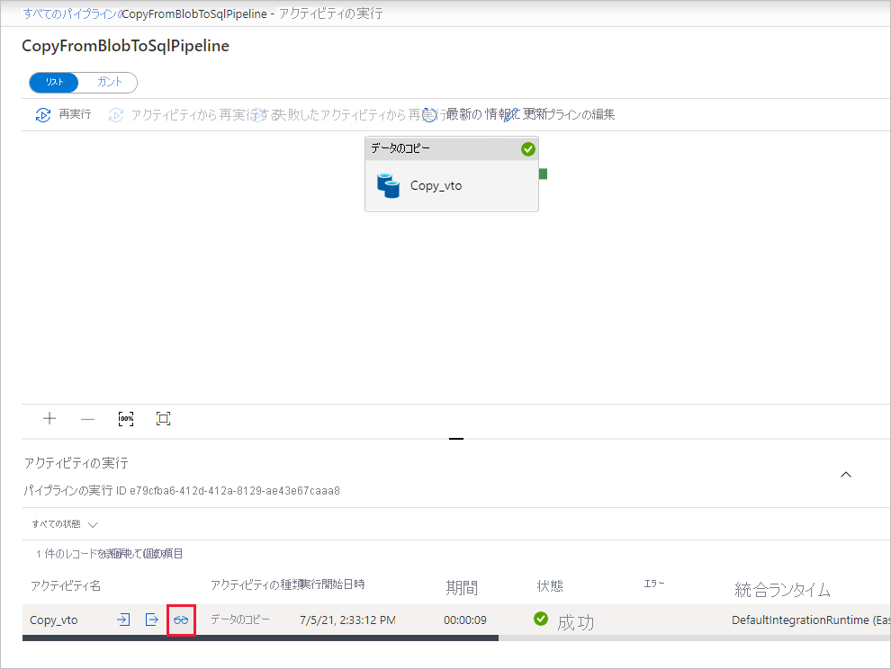

# <a name="copy-data-from-azure-blob-storage-to-a-sql-database-by-using-the-copy-data-tool"></a>データのコピー ツールを使用して Azure Blob Storage から SQL データベースにデータをコピーする
> [!div class="op_single_selector" title1="Select the version of the Data Factory service that you're using:"]
> * [Version 1](v1/data-factory-copy-data-from-azure-blob-storage-to-sql-database.md)
> * [現在のバージョン](tutorial-copy-data-tool.md)

このチュートリアルでは、Azure Portal を使用してデータ ファクトリを作成します。 次に、データのコピー ツールを使用して、Azure Blob Storage から SQL データベースにデータをコピーするパイプラインを作成します。 

> [!NOTE]
> Azure Data Factory を初めて使用する場合は、「[Azure Data Factory の概要](introduction.md)」を参照してください。

このチュートリアルでは、以下の手順を実行します。

> [!div class="checklist"]
> * データ ファクトリを作成します。
> * データのコピー ツールを使用してパイプラインを作成します。
> * パイプラインとアクティビティの実行を監視します。

## <a name="prerequisites"></a>前提条件

* **Azure サブスクリプション**: Azure サブスクリプションをお持ちでない場合は、開始する前に[無料アカウント](https://azure.microsoft.com/free/)を作成してください。
* **Azure Storage アカウント**: "_ソース_" データ ストアとして Blob Storage を使用します。 Azure Storage アカウントがない場合は、「[ストレージ アカウントの作成](../storage/common/storage-quickstart-create-account.md)」の手順をご覧ください。
* **Azure SQL Database**: "_シンク_" データ ストアとして SQL データベースを使用します。 SQL データベースがない場合は、「[SQL Database の作成](../sql-database/sql-database-get-started-portal.md)」の手順を参照してください。

### <a name="create-a-blob-and-a-sql-table"></a>BLOB と SQL テーブルを作成する

次の手順を実行して、チュートリアルで使用する Blob Storage と SQL データベースを準備します。

#### <a name="create-a-source-blob"></a>ソース BLOB を作成する

1. **メモ帳**を起動します。 次のテキストをコピーし、**inputEmp.txt** というファイル名でディスクに保存します。

    ```
    John|Doe
    Jane|Doe
    ```

1. **adfv2tutorial** という名前のコンテナーを作成し、そこに inputEmp.txt ファイルをアップロードします。 この作業は、[Azure Storage Explorer](http://storageexplorer.com/) をはじめとするさまざまなツールを使用して実行できます。

#### <a name="create-a-sink-sql-table"></a>シンク SQL テーブルを作成する

1. 次の SQL スクリプトを使用して、**dbo.emp** という名前のテーブルを SQL データベースに作成します。

    ```sql
    CREATE TABLE dbo.emp
    (
        ID int IDENTITY(1,1) NOT NULL,
        FirstName varchar(50),
        LastName varchar(50)
    )
    GO

    CREATE CLUSTERED INDEX IX_emp_ID ON dbo.emp (ID);
    ```

1. Azure サービスに SQL Server へのアクセスを許可します。 SQL Server が実行されているサーバーの **[Azure サービスへのアクセスを許可]** 設定が有効になっていることを確認します。 この設定により、Data Factory が SQL Server インスタンスにデータを書き込むことができます。 この設定を確認して有効にするには、次の手順を実行します。

    a. 画面の左側にある **[その他のサービス]** を選択し、**[SQL Server]** を選択します。

    b. 目的のサーバーを選択し、**[設定]** > **[ファイアウォール]** を選択します。

    c. **[ファイアウォール設定]** ページの **[Azure サービスへのアクセスを許可]** オプションを **[オン]** に設定します。

## <a name="create-a-data-factory"></a>Data Factory を作成する。

1. 左側のメニューで、**[+ 新規]** > **[データ + 分析]** > **[Data Factory]** を選択します。 
   
   
1. **[新しいデータ ファクトリ]** ページで、**[名前]** に「**ADFTutorialDataFactory**」と入力します。 
      
     
 
   データ ファクトリの名前は "_グローバルに一意_" にする必要があります。 次のエラー メッセージが表示される場合があります。
   
   ![[新しいデータ ファクトリ] のエラー メッセージ](./media/tutorial-copy-data-tool/name-not-available-error.png)

   データ ファクトリの名前の値に関するエラー メッセージが表示された場合は、別の名前を入力してください。 たとえば、_**yourname**_**ADFTutorialDataFactory** という名前を使用します。 Data Factory アーティファクトの名前付け規則については、[Data Factory の名前付け規則](naming-rules.md)に関するページを参照してください。
1. 新しいデータ ファクトリの作成先となる Azure **サブスクリプション**を選択します。 
1. **[リソース グループ]** で、次の手順のいずれかを行います。
     
    a. **[Use existing (既存のものを使用)]** を選択し、ドロップダウン リストから既存のリソース グループを選択します。

    b. **[新規作成]** を選択し、リソース グループの名前を入力します。 
         
    リソース グループの詳細については、[リソース グループを使用した Azure のリソースの管理](../azure-resource-manager/resource-group-overview.md)に関するページを参照してください。

1. **[バージョン]** で、バージョンとして **[V2]** を選択します。
1. **[場所]** で、データ ファクトリの場所を選択します。 サポートされている場所のみがドロップダウン リストに表示されます。 データ ファクトリによって使用されるデータ ストア (Azure Storage、SQL Database など) やコンピューティング (Azure HDInsight など) は、他の場所やリージョンに存在していてもかまいません。
1. **[ダッシュボードにピン留めする]** をオンにします。 
1. **作成**を選択します。
1. ダッシュボードの **[Deploying Data Factory]\(データ ファクトリをデプロイしています\)** タイルに処理の状態が表示されます。

    ![[Deploying data factory]\(データ ファクトリをデプロイしています\) タイル](media/tutorial-copy-data-tool/deploying-data-factory.png)
1. 作成が完了すると、**[Data Factory]** ホーム ページが表示されます。
   
    
1. 別のタブで Azure Data Factory ユーザー インターフェイス (UI) を起動するには、**[Author & Monitor]\(作成と監視\)** タイルを選択します。 

## <a name="use-the-copy-data-tool-to-create-a-pipeline"></a>データのコピー ツールを使用してパイプラインを作成する

1. **[Let's get started]\(始めましょう\)** ページで、**[データのコピー]** タイルを選択してデータのコピー ツールを起動します。 

   
1. **[プロパティ]** ページの **[タスク名]** に「**CopyFromBlobToSqlPipeline**」と入力します。 次に、**[次へ]** を選択します。 指定したタスク名のパイプラインが Data Factory UI によって作成されます。 

    ![[プロパティ] ページ](./media/tutorial-copy-data-tool/copy-data-tool-properties-page.png)
1. **[ソース データ ストア]** ページで、次の手順を実行します。

    a. **[+ 新しい接続の作成]** をクリックして、接続を追加します

    

    b. ギャラリーから **[Azure Blob Storage]** を選択し、**[次へ]** を選択します。

    

    c. **[New Linked Service]\(新しいリンクされたサービス\)** ページで、**[ストレージ アカウント名]** ボックスの一覧からストレージ アカウントを選択し、**[完了]** をクリックします。

    

    d. 新しく作成したリンクされたサービスをソースとして選択し、**[次へ]** をクリックします。

    

1. **[Choose the input file or folder]\(入力ファイルまたはフォルダーの選択\)** ページで、次の手順を実行します。
    
    a. **[参照]** をクリックして、**adfv2tutorial/input** フォルダーに移動します。**inputEmp.txt** ファイルを選択し、**[選択]** をクリックします。

    ![[Choose the input file or folder]\(入力ファイルまたはフォルダーの選択\)](./media/tutorial-copy-data-tool/specify-source-path.png)

    b. **[次へ]** をクリックして、次の手順に進みます。

1. **[File format settings]\(ファイル形式設定\)** ページで、列区切り記号と行区切り記号がツールによって自動的に検出されたことを確認します。 **[次へ]** を選択します。 このページでは、データのプレビューと入力データのスキーマの表示を行うこともできます。 

    
1. **[ターゲット データ ストア]** ページで、次の手順を実行します。

    a. **[+ 新しい接続の作成]** をクリックして、接続を追加します

    

    b. ギャラリーから **[Azure Blob Storage]** を選択し、**[次へ]** を選択します。

    

    c. **[New Linked Service]\(新しいリンクされたサービス\)** ページで、ドロップダウン リストからご自身のサーバー名と DB を選択し、ユーザー名とパスワードを指定して、**[完了]** をクリックします。    

    

    d. 新しく作成したリンクされたサービスをシンクとして選択し、**[次へ]** をクリックします。

    

1. **[テーブル マッピング]** ページで **[dbo].[emp]** テーブルを選択し、**[次へ]** を選択します。 

    
1. **[スキーマ マッピング]** ページで、入力ファイルの最初の列と 2 番目の列が **emp** テーブルの **FirstName** 列と **LastName** 列にマップされていることがわかります。 **[次へ]** を選択します。

    ![[スキーマ マッピング] ページ](./media/tutorial-copy-data-tool/schema-mapping.png)
1. **[設定]** ページで **[次へ]** を選択します。 
1. **[サマリー]** ページで設定を確認し、**[次へ]** を選択します。

    
1. **[Deployment]\(デプロイ\)** ページで **[監視]** を選択してパイプライン (タスク) を監視します。

    ![[Deployment]\(デプロイ\) ページ](./media/tutorial-copy-data-tool/deployment-page.png)
1. 左側の **[監視]** タブが自動的に選択されたことがわかります。 **[アクション]** 列には、アクティビティの実行の詳細を表示するリンクとパイプラインを再実行するリンクが表示されます。 **[最新の情報に更新]** を選択して、一覧を更新します。 

    
1. パイプラインの実行に関連付けられているアクティビティの実行を表示するには、**[アクション]** 列の **[View Activity Runs]\(アクティビティの実行の表示\)** リンクを選択します。 コピー操作の詳細を確認するために、**[アクション]** 列にある **[詳細]** リンク (眼鏡アイコン) を選択します。 **[Pipeline Runs]\(パイプラインの実行\)** ビューに戻るには、上部の **[パイプライン]** リンクを選択します。 表示を更新するには、**[最新の情報に更新]** を選択します。 

    

    

1. SQL データベースの **emp** テーブルにデータが挿入されたことを確認します。

    

1. 左側の **[作成者]** タブを選択して、編集モードに切り替えます。 ツールによって作成されたリンクされたサービス、データセット、パイプラインをエディターで更新できます。 Data Factory UI におけるこれらのエンティティの編集について詳しくは、[このチュートリアルの Azure Portal バージョン](tutorial-copy-data-portal.md)を参照してください。

## <a name="next-steps"></a>次の手順
このサンプルのパイプラインでは、Blob Storage から SQL データベースにデータがコピーされます。 以下の方法について学習しました。 

> [!div class="checklist"]
> * データ ファクトリを作成します。
> * データのコピー ツールを使用してパイプラインを作成します。
> * パイプラインとアクティビティの実行を監視します。

オンプレミスからクラウドにデータをコピーする方法について学習するには、次のチュートリアルに進んでください。 

> [!div class="nextstepaction"]
>[オンプレミスからクラウドにデータをコピーする](tutorial-hybrid-copy-data-tool.md)
