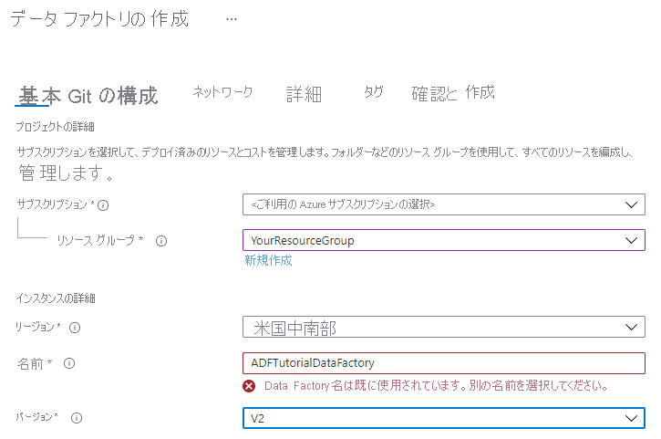
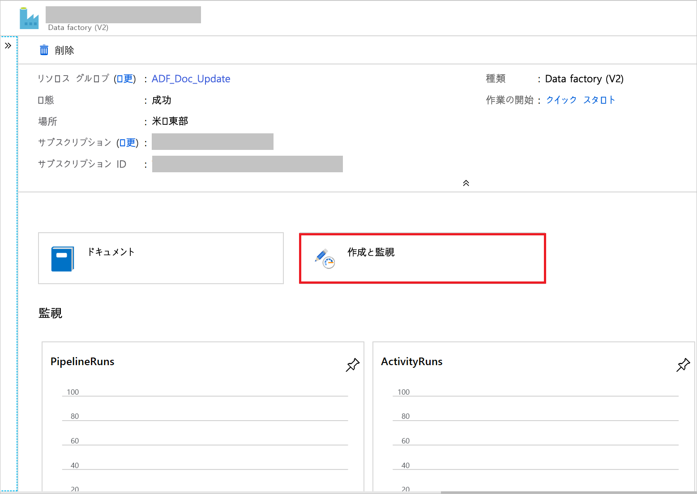
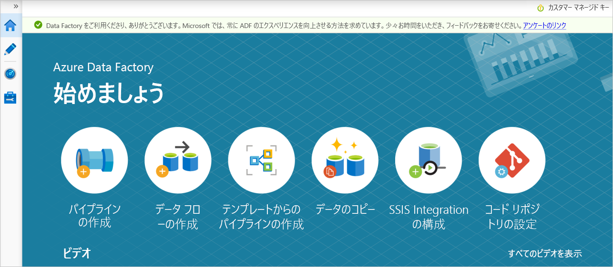
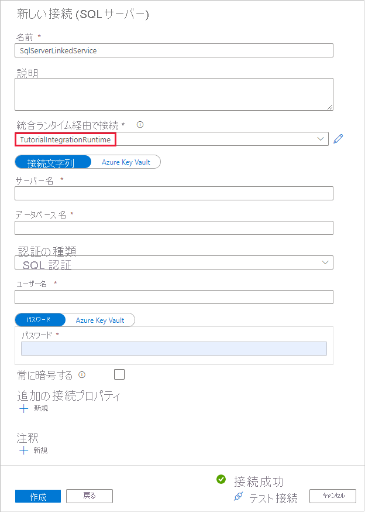
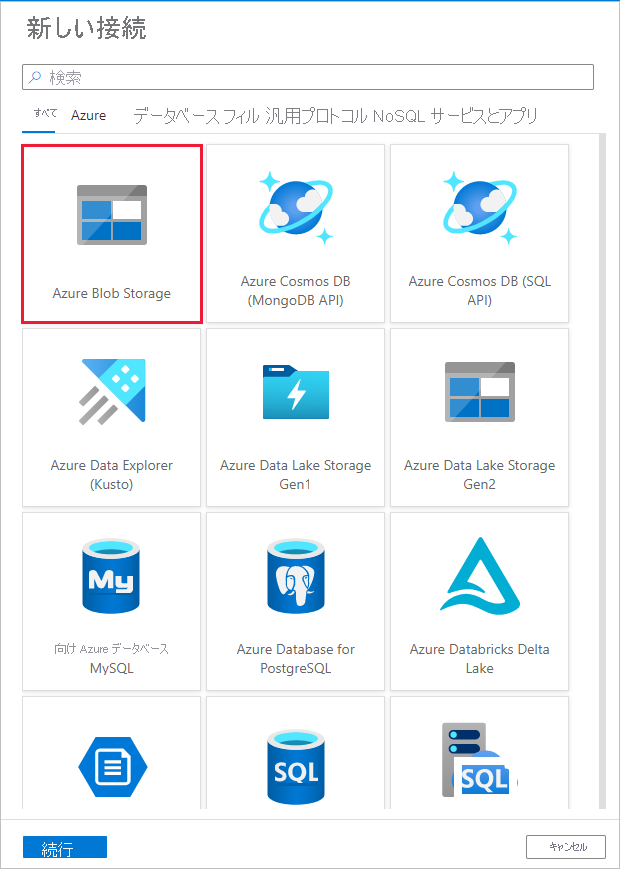

# <a name="copy-data-from-an-on-premises-sql-server-database-to-azure-blob-storage-by-using-the-copy-data-tool"></a>データのコピー ツールを使用してオンプレミスの SQL Server データベースから Azure Blob Storage にデータをコピーする
> [!div class="op_single_selector" title1="使用している Data Factory サービスのバージョンを選択してください:"]
> * [Version 1](v1/data-factory-copy-data-from-azure-blob-storage-to-sql-database.md)
> * [現在のバージョン](tutorial-hybrid-copy-data-tool.md)

このチュートリアルでは、Azure Portal を使用してデータ ファクトリを作成します。 次に、データのコピー ツールを使用して、オンプレミスの SQL Server データベースから Azure Blob Storage にデータをコピーするパイプラインを作成します。

> [!NOTE]
> - Azure Data Factory を初めて使用する場合は、「[Data Factory の概要](introduction.md)」を参照してください。

このチュートリアルでは、以下の手順を実行します。

> [!div class="checklist"]
> * データ ファクトリを作成します。
> * データのコピー ツールを使用してパイプラインを作成します。
> * パイプラインとアクティビティの実行を監視します。

## <a name="prerequisites"></a>前提条件
### <a name="azure-subscription"></a>Azure サブスクリプション
Azure サブスクリプションをお持ちでない場合は、開始する前に[無料アカウントを作成](https://azure.microsoft.com/free/)してください。

### <a name="azure-roles"></a>Azure ロール
Data Factory インスタンスを作成するには、Azure へのログインに使用するユーザー アカウントが、"*共同作成者*" または "*所有者*" ロールに属しているか、Azure サブスクリプションの "*管理者*" である必要があります。 

サブスクリプションで自分が持っているアクセス許可を表示するには、Azure Portal に移動します。 右上隅にあるユーザー名をクリックし、 **[アクセス許可]** を選択してください。 複数のサブスクリプションにアクセスできる場合は、適切なサブスクリプションを選択します。 ロールにユーザーを追加する手順の例については、「[RBAC と Azure portal を使用してアクセスを管理する](../role-based-access-control/role-assignments-portal.md)」をご覧ください。

### <a name="sql-server-2014-2016-and-2017"></a>SQL Server 2014、2016、2017
このチュートリアルでは、オンプレミスの SQL Server データベースを "*ソース*" データ ストアとして使用します。 このチュートリアルで作成するデータ ファクトリ内のパイプラインは、このオンプレミスの SQL Server データベース (ソース) から Blob Storage (シンク) にデータをコピーします。 SQL Server データベース内に **emp** という名前のテーブルを作成し、このテーブルにサンプル エントリをいくつか挿入します。 

1. SQL Server Management Studio を起動します。 ご使用のマシンにまだインストールされていない場合は、「[SQL Server Management Studio のダウンロード](https://docs.microsoft.com/sql/ssms/download-sql-server-management-studio-ssms)」にアクセスしてください。 

1. 自分の資格情報で SQL Server インスタンスに接続します。 

1. サンプル データベースを作成します。 ツリー ビューで **[データベース]** を右クリックし、 **[新しいデータベース]** を選択します。 

1. **[新しいデータベース]** ウィンドウで、データベースの名前を入力し、 **[OK]** を選択します。 

1. **emp** テーブルを作成していくつかのサンプル データを挿入するために、次のクエリ スクリプトをデータベースに対して実行します。 ツリー ビューで、作成したデータベースを右クリックし、 **[新しいクエリ]** をクリックします。

    ```sql
    CREATE TABLE dbo.emp
    (
        ID int IDENTITY(1,1) NOT NULL,
        FirstName varchar(50),
        LastName varchar(50)
    )
    GO
    
    INSERT INTO emp (FirstName, LastName) VALUES ('John', 'Doe')
    INSERT INTO emp (FirstName, LastName) VALUES ('Jane', 'Doe')
    GO
    ```

### <a name="azure-storage-account"></a>Azure ストレージ アカウント
このチュートリアルでは、コピー先/シンク データ ストアに汎用の Azure Storage アカウント (具体的には Blob Storage) を使用します。 汎用のストレージ アカウントがない場合、作成する手順について「[ストレージ アカウントの作成](../storage/common/storage-quickstart-create-account.md)」を参照してください。 このチュートリアルで作成するデータ ファクトリ内のパイプラインは、オンプレミスの SQL Server データベース (ソース) からこの Blob Storage (シンク) にデータをコピーします。 

#### <a name="get-the-storage-account-name-and-account-key"></a>ストレージ アカウント名とアカウント キーの取得
このチュートリアルでは、ご利用のストレージ アカウントの名前とキーを使用します。 ご利用のストレージ アカウントの名前とキーを取得するには、次の手順を実行します。 

1. Azure のユーザー名とパスワードを使用して、[Azure Portal](https://portal.azure.com) にサインインします。 

1. 左側のウィンドウで、 **[すべてのサービス]** を選択します。 「**ストレージ**」というキーワードでフィルタリングして、 **[ストレージ アカウント]** を選択します。

    

1. ストレージ アカウントの一覧で、必要に応じてご利用のストレージ アカウントをフィルターで抽出します。 次に、ストレージ アカウントを選択します。 

1. **[ストレージ アカウント]** ウィンドウで **[アクセス キー]** を選択します。


1. **[ストレージ アカウント名]** ボックスと **[key1]** ボックスの値をコピーし、メモ帳などのエディターに貼り付けます。これらの値は、後でこのチュートリアルの中で使用します。 

#### <a name="create-the-adftutorial-container"></a>adftutorial コンテナーの作成 
このセクションでは、**adftutorial** という名前の BLOB コンテナーを Blob Storage に作成します。 

1. **[ストレージ アカウント]** ウィンドウで **[概要]** に切り替え、 **[BLOB]** を選択します。 

1. **[BLOB]** ウィンドウで **[+ コンテナー]** を選択します。 

1. **[新しいコンテナー]** ウィンドウの **[名前]** に「**adftutorial**」と入力し、 **[OK]** を選択します。 

1. コンテナーの一覧で、 **[adftutorial]** を選択します。


1. **adftutorial** の **[コンテナー]** ウィンドウを開いたままにしておきます。 チュートリアルの最後で、このページを使用して出力を確認します。 このコンテナーには output フォルダーが Data Factory によって自動的に作成されます。手動で作成する必要はありません。


## <a name="create-a-data-factory"></a>Data Factory の作成

1. 左側のメニューで、 **[+ リソースの作成]**  >  **[分析]**  >  **[Data Factory]** の順に選択します。 
  
   

1. **[新しいデータ ファクトリ]** ページで、 **[名前]** に「**ADFTutorialDataFactory**」と入力します。 

   データ ファクトリの名前は "*グローバルに一意*" にする必要があります。 名前フィールドで次のエラー メッセージが発生した場合は、データ ファクトリの名前を変更してください (yournameADFTutorialDataFactory など)。 Data Factory アーティファクトの名前付け規則については、[Data Factory の名前付け規則](naming-rules.md)に関するページを参照してください。

   
1. データ ファクトリを作成する Azure **サブスクリプション**を選択します。 
1. **[リソース グループ]** で、次の手順のいずれかを行います。
  
   - **[Use existing (既存のものを使用)]** を選択し、ドロップダウン リストから既存のリソース グループを選択します。

   - **[新規作成]** を選択し、リソース グループの名前を入力します。 
        
     リソース グループの詳細については、[リソース グループを使用した Azure のリソースの管理](../azure-resource-manager/resource-group-overview.md)に関するページを参照してください。
1. **[バージョン]** で、 **[V2]** を選択します。
1. **[場所]** で、データ ファクトリの場所を選択します。 サポートされている場所のみがドロップダウン リストに表示されます。 Data Factory によって使用されるデータ ストア (Azure Storage、SQL Database など) やコンピューティング (Azure HDInsight など) は、他の場所やリージョンに存在していてもかまいません。
1. **作成** を選択します。

1. 作成が完了すると、図に示されているような **[Data Factory]** ページが表示されます。
  
     
1. **[Author & Monitor]\(作成と監視\)** をクリックして、別のタブで Data Factory ユーザー インターフェイスを起動します。 

## <a name="use-the-copy-data-tool-to-create-a-pipeline"></a>データのコピー ツールを使用してパイプラインを作成する

1. **[Let's get started]\(始めましょう\)** ページで、 **[データのコピー]** を選択してデータのコピー ツールを起動します。 

   

1. データのコピー ツールの **[プロパティ]** ページで、 **[タスク名]** に「**CopyFromOnPremSqlToAzureBlobPipeline**」と指定します。 次に、 **[次へ]** を選択します。 このフィールドで指定した名前のパイプラインが、データのコピー ツールによって作成されます。 
  

1. **[ソース データ ストア]** ページで、 **[新しい接続の作成]** タイルをクリックします。 


1. **[New Linked Service]\(新しいリンクされたサービス\)** で **SQL Server** を検索し、 **[続行]** を選択します。 

1. **[New Linked Service (SQL Server)]\(新しいリンクされたサービス (SQL Server)\)** ダイアログ ボックスの **[名前]** に「**SqlServerLinkedService**」と入力します。 **[Connect via integration runtime]\(統合ランタイム経由で接続\)** で **[+新規]** を選択します。 セルフホステッド統合ランタイムを作成してマシンにダウンロードし、それを Data Factory に登録する必要があります。 セルフホステッド統合ランタイムによって、オンプレミスの環境とクラウドとの間でデータがコピーされます。


1. **[Integration Runtime Setup]\(統合ランタイムのセットアップ\)** ダイアログ ボックスで、 **[Self-Hosted]\(セルフホスト\)** を選択します。 次に、 **[次へ]** を選択します。 

   

1. **[Integration Runtime Setup]\(統合ランタイムのセットアップ\)** ダイアログ ボックスの **[名前]** に「**TutorialIntegrationRuntime**」と入力します。 次に、 **[次へ]** を選択します。 


1. **[Integration Runtime Setup]\(統合ランタイムのセットアップ\)** ダイアログ ボックスで、 **[Click here to launch the express setup for this computer]\(このコンピューターで高速セットアップを起動するにはここをクリック\)** を選択します。 この操作により、統合ランタイムがマシンにインストールされ、Data Factory に登録されます。 別の方法として、手動セットアップのオプションを使用できます。インストール ファイルをダウンロードして実行し、キーを使用して統合ランタイムを登録します。 

1. ダウンロードされたアプリケーションを実行します。 ウィンドウには高速セットアップの状態が表示されます。 

    

1. **[New Linked Service (SQL Server)]\(新しいリンクされたサービス (SQL Server)\)** ダイアログ ボックスの [統合ランタイム] フィールドで **TutorialIntegrationRuntime** が選択されていることを確認します。 その後、次の手順を実行します。

    a. **[名前]** に「**SqlServerLinkedService**」と入力します。

    b. **[サーバー名]** にオンプレミスの SQL Server インスタンスの名前を入力します。

    c. **[データベース名]** にオンプレミスのデータベースの名前を入力します。

    d. **[認証の種類]** で適切な認証を選択します。

    e. **[ユーザー名]** に、オンプレミスの SQL Server へのアクセス権を持つユーザーの名前を入力します。

    f. ユーザーの**パスワード**を入力します。 

    g. 接続をテストし、 **[完了]** を選択します。

      

1. **[ソース データ ストア]** ページで、 **[次へ]** を選択します。

1. **[Select tables from which to copy the data or use a custom query]\(データのコピー元またはカスタム クエリの使用元となるテーブルの選択\)** ページで、一覧の **[dbo].[emp]** テーブルを選択し、 **[次へ]** を選択します。 データベースに基づいて、その他のテーブルを選択できます。

1. **[ターゲット データ ストア]** ページで **[新しい接続の作成]** を選択します


1. **[New Linked Service]\(新しいリンクされたサービス\)** で、 **[Azure BLOB]** 、 **[続行]** の順に選択します。 

   

1. **[New Linked Service (Azure Blob Storage)]\(新しいリンクされたサービス (Azure Blob Storage)\)** ダイアログで、次の手順を実行します。 

   a. **[名前]** に「**AzureStorageLinkedService**」と入力します。

   b. **[Connect via integration runtime]\(統合ランタイム経由で接続\)**  で **[TutorialIntegrationRuntime]** を選択します

   c. **[ストレージ アカウント名]** ボックスの一覧から、使用するストレージ アカウントを選択します。 

   d. **[完了]** を選択します。

1. **[配布先データ ストア]** ダイアログで、 **[Azure Blob Storage]** が選択されていることを確認します。 次に、 **[次へ]** を選択します。 

1. **[Choose the output file or folder]\(出力ファイルまたはフォルダーの選択\)** ダイアログで、 **[フォルダーのパス]** に「**adftutorial/fromonprem**」と入力します。 前提条件の 1 つとして **adftutorial** コンテナーを作成しました。 output フォルダーが存在しない場合は (この場合は **fromonprem**)、Data Factory によって自動的に作成されます。 また、 **[参照]** ボタンを使用して、Blob Storage とそのコンテナー (フォルダー) に移動することもできます。 **[ファイル名]** で値を指定しない場合は、既定でソースの名前 (この場合は **dbo.emp**) が使用されます。
           
   

1. **[File format settings]\(ファイル形式設定\)** ダイアログで **[次へ]** を選択します。 

1. **[設定]** ダイアログで **[次へ]** を選択します。 

1. **[概要]** ダイアログですべての設定の値を確認し、 **[次へ]** を選択します。 

1. **[Deployment]\(デプロイ\)** ページで **[監視]** を選択して、作成されたパイプラインまたはタスクを監視します。

   ![[Deployment]\(デプロイ\) ページ](./media/tutorial-hybrid-copy-data-tool/deployment-page.png)

1. **[監視]** タブでは、作成したパイプラインの状態を表示できます。 **[アクション]** 列のリンクを使用すると、パイプラインの実行に関連付けられているアクティビティの実行を表示したり、パイプラインを再実行したりできます。 
   
1. **[アクション]** 列の **[View Activity Runs]\(アクティビティの実行の表示\)** リンクを選択して、パイプラインの実行に関連付けられているアクティビティの実行を表示します。 コピー操作の詳細を確認するために、 **[アクション]** 列にある **[詳細]** リンク (眼鏡アイコン) を選択します。 再度**パイプラインの実行**ビューに切り替えるには、一番上にある **[Pipeline Runs]\(パイプラインの実行\)** を選択します。

1. **adftutorial** コンテナーの **fromonprem** フォルダーに出力ファイルがあることを確認します。 


1. 左側の **[編集]** タブを選択して、編集モードに切り替えます。 ツールによって作成されたリンクされたサービス、データセット、パイプラインをエディターを使用して更新できます。 **[コード]** を選択すると、エディターで開かれているエンティティに関する JSON コードが表示されます。 これらのエンティティを Data Factory の UI で編集する方法について詳しくは、[このチュートリアルの Azure Portal バージョン](tutorial-copy-data-portal.md)を参照してください。

   ![[編集] タブ](./media/tutorial-hybrid-copy-data-tool/edit-tab.png)


## <a name="next-steps"></a>次の手順
このサンプルのパイプラインでは、オンプレミスの SQL Server データベースから Blob Storage にデータがコピーされます。 以下の方法について学習しました。 

> [!div class="checklist"]
> * データ ファクトリを作成します。
> * データのコピー ツールを使用してパイプラインを作成します。
> * パイプラインとアクティビティの実行を監視します。

Data Factory でサポートされるデータ ストアの一覧については、[サポートされるデータ ストア](copy-activity-overview.md#supported-data-stores-and-formats)に関するセクションを参照してください。

次のチュートリアルに進んで、ソースからコピー先にデータを一括コピーする方法について学習しましょう。

> [!div class="nextstepaction"]
>[データを一括コピーする](tutorial-bulk-copy-portal.md)
