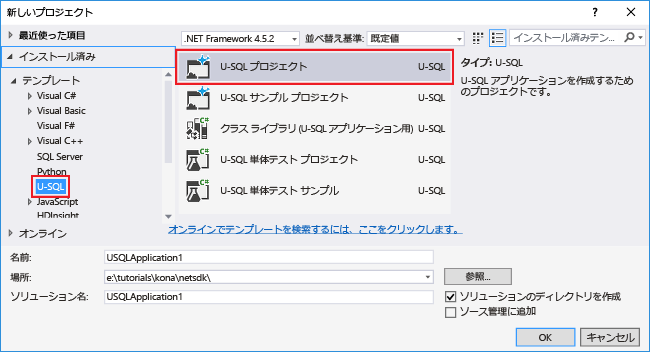

# Azure Data Lake Analytics を使用する Web サイト ログの分析
Data Lake Analytics を使用して Web サイトのログを分析する方法について、特に、Web サイトへのアクセスを試みたときにエラーが発生した参照元の特定に重点を置いて説明します。

## 前提条件
* **Visual Studio 2013 または Visual Studio 2015**
* **[Data Lake Tools for Visual Studio](https://aka.ms/adltoolsvs)** 。

    Data Lake Tools for Visual Studio がインストールされると、Visual Studio の **[ツール]** メニューに **[Data Lake]** が表示されます。

    
* **Data Lake Analytics と Data Lake Tools for Visual Studio の基本的な知識**。 作業を開始するには、次のトピックをご覧ください。

  * [チュートリアル: Data Lake Tools for Visual Studio を使用する U-SQL スクリプトの開発](data-lake-analytics-data-lake-tools-get-started.md)
* **Data Lake Analytics アカウント。**  [Azure Data Lake Analytics アカウントの作成](data-lake-analytics-get-started-portal.md)に関するセクションを参照してください。
* **サンプル データをインストールします。** Azure ポータル、Data Lake Analytics アカウントを開き、左側のメニューにある **[サンプル スクリプト]** をクリックし、 **[サンプル データのコピー]** をクリックします。 

## Azure に接続する
U-SQL スクリプトをビルドしてテストするには、Azure に接続しておく必要があります。

**Data Lake Analytics に接続するには**

1. Visual Studio を開きます。
2. **[Data Lake]、[オプションと設定]** の順にクリックします。
3. **[サインイン]** をクリックします。他のユーザーがサインインしている場合は、 **[ユーザーの変更]** をクリックし、指示に従います。
4. **[OK]** をクリックして、[オプションと設定] ダイアログを閉じます。

**Data Lake Analytics アカウントを参照するには**

1. Visual Studio で、**Ctrl + Alt + S** キーを押して、**サーバー エクスプローラー**を開きます。
2. **サーバー エクスプローラー**で、 **[Azure]** 、 **[Data Lake Analytics]** の順に展開します。 Data Lake Analytics アカウントが複数ある場合は、そのリストが表示されます。 Studio で Data Lake Analytics アカウントを作成することはできません。 アカウントを作成する場合は、「[Azure Portal で Azure Data Lake Analytics の使用を開始する](data-lake-analytics-get-started-portal.md)」または「[Azure PowerShell で Azure Data Lake Analytics の使用を開始する](data-lake-analytics-get-started-powershell.md)」をご覧ください。

## U-SQL アプリケーションの作成
U SQL アプリケーションの大部分は、U-SQL スクリプトです。 U-SQL の詳細については、 [U-SQL の使用](data-lake-analytics-u-sql-get-started.md)に関するページを参照してください。

アプリケーションにはユーザー定義演算子を追加できます。  詳細については、「 [Data Lake Analytics ジョブの U-SQL ユーザー定義演算子の開発](data-lake-analytics-u-sql-develop-user-defined-operators.md)」をご覧ください。

**Data Lake Analytics ジョブを作成して送信するには**

1. **[ファイル]、[新規作成]、[プロジェクト]** の順にクリックします。
2. プロジェクトの種類として、[U-SQL プロジェクト] を選択します。

    
3. **[OK]** をクリックします。 Visual Studio で、Script.usql ファイルを使用してソリューションが作成されます。
4. 次のスクリプトを Script.usql ファイルに入力します。

        // Create a database for easy reuse, so you don't need to read from a file every time.
        CREATE DATABASE IF NOT EXISTS SampleDBTutorials;

        // Create a Table valued function. TVF ensures that your jobs fetch data from the weblog file with the correct schema.
        DROP FUNCTION IF EXISTS SampleDBTutorials.dbo.WeblogsView;
        CREATE FUNCTION SampleDBTutorials.dbo.WeblogsView()
        RETURNS @result TABLE
        (
            s_date DateTime,
            s_time string,
            s_sitename string,
            cs_method string,
            cs_uristem string,
            cs_uriquery string,
            s_port int,
            cs_username string,
            c_ip string,
            cs_useragent string,
            cs_cookie string,
            cs_referer string,
            cs_host string,
            sc_status int,
            sc_substatus int,
            sc_win32status int,
            sc_bytes int,
            cs_bytes int,
            s_timetaken int
        )
        AS
        BEGIN

            @result = EXTRACT
                s_date DateTime,
                s_time string,
                s_sitename string,
                cs_method string,
                cs_uristem string,
                cs_uriquery string,
                s_port int,
                cs_username string,
                c_ip string,
                cs_useragent string,
                cs_cookie string,
                cs_referer string,
                cs_host string,
                sc_status int,
                sc_substatus int,
                sc_win32status int,
                sc_bytes int,
                cs_bytes int,
                s_timetaken int
            FROM @"/Samples/Data/WebLog.log"
            USING Extractors.Text(delimiter:' ');
            RETURN;
        END;

        // Create a table for storing referrers and status
        DROP TABLE IF EXISTS SampleDBTutorials.dbo.ReferrersPerDay;
        @weblog = SampleDBTutorials.dbo.WeblogsView();
        CREATE TABLE SampleDBTutorials.dbo.ReferrersPerDay
        (
            INDEX idx1
            CLUSTERED(Year ASC)
            DISTRIBUTED BY HASH(Year)
        ) AS

        SELECT s_date.Year AS Year,
            s_date.Month AS Month,
            s_date.Day AS Day,
            cs_referer,
            sc_status,
            COUNT(DISTINCT c_ip) AS cnt
        FROM @weblog
        GROUP BY s_date,
                cs_referer,
                sc_status;

    U-SQL を理解するには、「 [チュートリアル: Azure Data Lake Analytics U-SQL 言語の使用](data-lake-analytics-u-sql-get-started.md)」をご覧ください。    
5. 新しい U-SQL スクリプトをプロジェクトに追加し、以下を入力してください。

        // Query the referrers that ran into errors
        @content =
            SELECT *
            FROM SampleDBTutorials.dbo.ReferrersPerDay
            WHERE sc_status >=400 AND sc_status < 500;

        OUTPUT @content
        TO @"/Samples/Outputs/UnsuccessfulResponses.log"
        USING Outputters.Tsv();
6. 最初の U-SQL スクリプトに戻り、 **[送信]** ボタンの横に、Analytics アカウントを指定します。
7. **ソリューション エクスプローラー**で **Script.usql** を右クリックし、 **[Build Script (スクリプトのビルド)]** をクリックします。 [出力] ウィンドウで結果を確認します。
8. **ソリューション エクスプローラー**で **Script.usql** を右クリックし、 **[Submit Script (スクリプトの送信)]** をクリックします。
9. **[Analytics Account (Analytics アカウント)]** にジョブを実行するアカウントが設定されていることを確認し、 **[送信]** をクリックします。 送信が完了すると、Data Lake Tools for Visual Studio の [結果] ウィンドウに送信結果とジョブのリンクが示されます。
10. ジョブが正常に完了するまで待機します。  ジョブが失敗した場合、ソース ファイルがない可能性があります。  このチュートリアルの「前提条件」を参照してください。 トラブルシューティングの詳細については、 [Azure Data Lake Analytics ジョブの監視とトラブルシューティング](data-lake-analytics-monitor-and-troubleshoot-jobs-tutorial.md)に関するページをご覧ください。

    ジョブが完了すると、次の画面が表示されます。

    
11. 次に、 **Script1.usql**の手順 7 ～ 10 を繰り返します。

**ジョブの出力を表示するには**

1. **サーバー エクスプローラー**で、 **[Azure]** 、 **[Data Lake Analytics]** 、使用する Data Lake Analytics アカウント、 **[ストレージ アカウント]** の順に展開し、既定の Data Lake Storage アカウントを右クリックして **[エクスプローラー]** をクリックします。
2. **[サンプル]** をダブルクリックしてフォルダーを開き、 **[出力]** をダブルクリックします。
3. **UnsuccessfulResponses.log** をダブルクリックします。
4. ジョブのグラフ ビューで出力ファイルをダブルクリックして、出力ファイルに直接移動することもできます。

## 参照
さまざまなツールを使用して Data Lake Analytics の使用を開始する方法については、以下をご覧ください。

* [Azure Portal で Azure Data Lake Analytics の使用を開始する](data-lake-analytics-get-started-portal.md)
* [Azure PowerShell で Data Lake Analytics の使用を開始する](data-lake-analytics-get-started-powershell.md)
* [.NET SDK で Data Lake Analytics の使用を開始する](data-lake-analytics-get-started-net-sdk.md)
