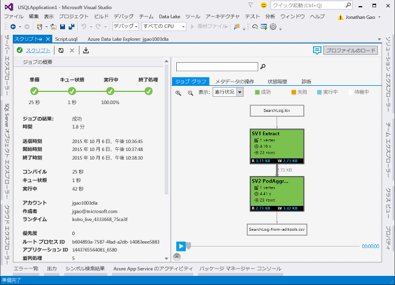

# <a name="develop-u-sql-scripts-by-using-data-lake-tools-for-visual-studio"></a>Data Lake Tools for Visual Studio を使用して U-SQL スクリプトを開発する

[!INCLUDE [get-started-selector](../../includes/data-lake-analytics-selector-get-started.md)]

Azure Data Lake および Stream Analytics ツールには、Azure Data Lake Analytics と Azure Stream Analytics という 2 つの Azure サービスに関する機能が含まれています。 Azure Stream Analytics シナリオの詳細については、[Visual Studio 用 Azure Stream Analytics ツール](../stream-analytics/stream-analytics-tools-for-visual-studio-install.md)に関するページを参照してください。

この記事では、Visual Studio を使用して Azure Data Lake Analytics アカウントを作成する方法について説明します。 [U-SQL](data-lake-analytics-u-sql-get-started.md) でジョブを定義し、Data Lake Analytics サービスにジョブを送信することができます。 Data Lake Analytics の詳細については、「 [Azure Data Lake Analytics の概要](data-lake-analytics-overview.md)」を参照してください。

> [!IMPORTANT]
> Azure Data Lake Tools for Visual Studio バージョン 2.3.3000.4 以降にアップグレードすることをお勧めします。 以前のバージョンはダウンロードできなくなり、非推奨になっています。
>
> 1. Azure Data Lake Tools for Visual Studio 2.3.3000.4 より前のバージョンを使用していないかどうかを確認します。
>
>    
>
> 1. バージョンが 2.3.3000.4 より前の場合は、ダウンロード センターにアクセスして、Azure Data Lake Tools for Visual Studio を更新します。
>    - [Visual Studio 2017 および 2019 の場合](https://marketplace.visualstudio.com/items?itemName=ADLTools.AzureDataLakeandStreamAnalyticsTools)
>    - [Visual Studio 2013 および 2015 の場合](https://www.microsoft.com/en-us/download/details.aspx?id=49504)

## <a name="prerequisites"></a>前提条件

* **Visual Studio**:Express を除くすべてのエディションがサポートされます。

  * Visual Studio 2019
  * Visual Studio 2017
  * Visual Studio 2015
  * Visual Studio 2013

* **Microsoft Azure SDK for .NET** バージョン 2.7.1 以上。 [Web プラットフォーム インストーラー](https://www.microsoft.com/web/downloads/platform.aspx)を使用してインストールします。
* **Data Lake Analytics** アカウント。 アカウントを作成するには、「[Azure Portal で Azure Data Lake Analytics の使用を開始する](data-lake-analytics-get-started-portal.md)」を参照してください。

## <a name="install-azure-data-lake-tools-for-visual-studio"></a>Azure Data Lake Tools for Visual Studio をインストールする

このチュートリアルでは、Data Lake Tools for Visual Studio がインストールされている必要があります。 詳細については、「[Data Lake Tools for Visual Studio のインストール](data-lake-analytics-data-lake-tools-install.md)」をご覧ください。

## <a name="connect-to-an-azure-data-lake-analytics-account"></a>Azure Data Lake Analytics アカウントに接続する

1. Visual Studio を開きます。

1. **[表示]**  >  **[サーバー エクスプローラー]** の順に選択して、**サーバー エクスプローラー**を開きます。

1. **[Azure]** を右クリックして、 **[Microsoft Azure サブスクリプションへの接続]** を選択します。 **[アカウントにサインインする]** で、指示に従います。

1. **サーバー エクスプローラー**で、 **[Azure]**  >  **[Data Lake Analytics]** の順に選択します。 Data Lake Analytics アカウントの一覧が表示されます。

## <a name="write-your-first-u-sql-script"></a>最初の U-SQL スクリプトを記述する

次のテキストは、単純な U-SQL スクリプトです。 それは、小さなデータセットを定義し、そのデータセットを `/data.csv` という名前のファイルとして既定の Data Lake Store に書き込みます。

```sql
USE DATABASE master;
USE SCHEMA dbo;
@a  = 
    SELECT * FROM 
        (VALUES
            ("Contoso", 1500.0),
            ("Woodgrove", 2700.0)
        ) AS 
              D( customer, amount );
OUTPUT @a
    TO "/data.csv"
    USING Outputters.Csv();
```

## <a name="submit-a-data-lake-analytics-job"></a>Data Lake Analytics ジョブの送信

1. Visual Studio で、 **[ファイル]**  >  **[新規]**  >  **[プロジェクト]** の順に選択します。

1. プロジェクト タイプとして **[U-SQL プロジェクト]** を選択して、 **[次へ]** を選択します。 **[新しいプロジェクトの構成]** で、 **[作成]** を選択します。

   Visual Studio によって、**Script.usql** ファイルを含むソリューションが作成されます。

1. 「[最初の U-SQL スクリプトを記述する](#write-your-first-u-sql-script)」からのスクリプトを **[Script.usql]** ウィンドウに貼り付けます。

1. **ソリューション エクスプローラー**で **Script.usql** を右クリックし、 **[スクリプトの送信]** をクリックします。

1. **[ジョブの送信]** で、ご自分の Data Lake Analytics アカウントを選択し、 **[送信]** を選択します。

   

ジョブの送信後、 **[ジョブ ビュー]** タブが開き、ジョブの進行状況が表示されます。

* **ジョブの概要**: ジョブの概要を示します。
* **ジョブ グラフ**: ジョブの進行状況を視覚化します。
* **メタデータ操作**: U-SQL カタログに対して実行されたすべてのアクションを示します。
* **データ**: すべての入力と出力を示します。
* **状態の履歴**: タイムラインと状態の詳細を示します。
* **AU 分析**: ジョブで使用された AU の数を示し、異なる AU 割り当て方法のシミュレーションを検討します。
* **診断**: ジョブの実行とパフォーマンスを最適化するための高度な分析を提供します。



最新のジョブの状態を表示して画面を更新するには、 **[更新]** を選択します。

## <a name="check-job-status"></a>ジョブの状態の確認

1. **サーバー エクスプローラー**で、 **[Azure]**  >  **[Data Lake Analytics]** の順に選択します。

1. Azure Data Lake Analytics アカウントの名前を展開します。

1. **[ジョブ]** をダブルクリックします。

1. 先ほど送信したジョブを選択します。

## <a name="see-the-job-output"></a>ジョブの出力の表示

1. **サーバー エクスプローラー**で、送信したジョブを参照します。

1. **[データ]** タブをクリックします。

1. **[ジョブの出力]** タブで、`"/data.csv"` ファイルを選択します。

## <a name="next-steps"></a>次のステップ

* [ご使用のワークステーションでのテストおよびデバッグのための U-SQL スクリプトの実行](data-lake-analytics-data-lake-tools-local-run.md)
* [Azure Data Lake Tools for Visual Studio Code を使用した U-SQL ジョブの C# コードのデバッグ](data-lake-tools-for-vscode-local-run-and-debug.md)
* [Azure Data Lake Tools for Visual Studio Code の使用](data-lake-analytics-data-lake-tools-for-vscode.md)
