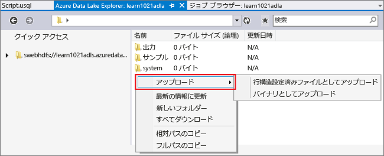
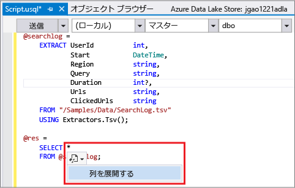
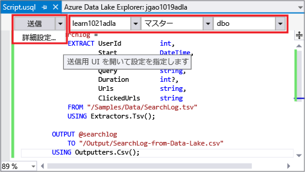
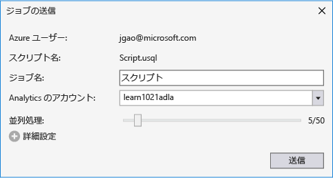
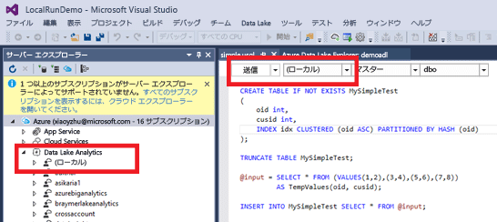
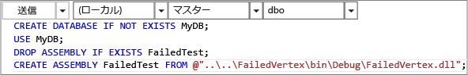

<properties
   pageTitle="Data Lake Tools for Visual Studio を使用する U-SQL スクリプトの開発 | Azure"
   description="Data Lake Tools for Visual Studio のインストール方法と、U-SQL スクリプトの開発およびテスト方法について説明します。"
   services="data-lake-analytics"
   documentationCenter=""
   authors="edmacauley"
   manager="jhubbard"
   editor="cgronlun"/>

<tags
   ms.service="data-lake-analytics"
   ms.devlang="na"
   ms.topic="get-started-article"
   ms.tgt_pltfrm="na"
   ms.workload="big-data"
   ms.date="05/16/2016"
   ms.author="edmaca"/>

# チュートリアル: Data Lake Tools for Visual Studio を使用する U-SQL スクリプトの開発

[AZURE.INCLUDE [get-started-selector](../../includes/data-lake-analytics-selector-get-started.md)]

Data Lake Tools for Visual Studio をインストールし、それを使用して U-SQL スクリプトを作成およびテストする方法を説明します。

U-SQL は、Data Lake 内のすべてのデータを準備、変換、分析するための拡張性に優れた言語です。詳細については、[U-SQL リファレンス](http://go.microsoft.com/fwlink/p/?LinkId=691348)に関するページを参照してください。

###前提条件

- **Visual Studio 2015、Visual Studio 2013 Update 4、Visual Studio 2012 のいずれか。サポートされるエディションは Enterprise (Ultimate/Premium)、Professional、Community です。Express エディションはサポートされません。現在、Visual Studio "15" はサポートされておらず、実現に向けて取り組んでいます。 **
- **Microsoft Azure SDK for .NET Version 2.7.1 以降**。[Web Platform Installer](http://www.microsoft.com/web/downloads/platform.aspx) を使用してインストールします。
- **[Data Lake Tools for Visual Studio](http://aka.ms/adltoolsvs)**。

    Data Lake Tools for Visual Studio をインストールすると、サーバー エクスプローラーの "Azure" ノードに "Data Lake Analytics" ノードが表示されます (サーバー エクスプローラーを表示するには Ctrl + Alt + S を押します)。

- **「[Azure Portal で Azure Data Lake Analytics の使用を開始する](data-lake-analytics-get-started-portal.md)」の次の 2 つのセクションを進めます**。

	- [Azure Data Lake Analytics アカウントの作成](data-lake-analytics-get-started-portal.md#create_adl_analytics_account)
	- [既定の Data Lake ストレージ アカウントへの SearchLog.tsv のアップロード](data-lake-analytics-get-started-portal.md#update-data-to-the-default-adl-storage-account)

    参考までに、Data Lake Analytic サービスを作成し、ソース データ ファイルをアップロードするための PowerShell サンプル スクリプトについては、「[付録 A: チュートリアルの準備のための PowerShell サンプル](data-lake-analytics-data-lake-tools-get-started.md#appx-a-powershell-sample-for-preparing-the-tutorial)」を参照してください。

	Data Lake Tools では、Data Lake Analytics アカウントの作成はサポートされません。そのため、Azure Portal、Azure PowerShell、.NET SDK、または Azure CLI を使用して作成する必要があります。Data Lake Analytics ジョブを実行するには、いくつかのデータが必要です。Data Lake Tools でデータのアップロードがサポートされていても、このチュートリアルに従いやすくするため、サンプル データのアップロードにはポータルを使用します。

## Azure への接続

**Data Lake Analytics に接続するには**

1. Visual Studio を開きます。
2. **[ビュー]** メニューで、**[サーバー エクスプローラー]** をクリックして、サーバー エクスプローラーを開きます。または、**Ctrl + Alt + S** キーを押します。
3. **[Azure]** を右クリックし、[Microsoft Azure サブスクリプションへの接続] をクリックして、指示に従います。
4. **サーバー エクスプローラー**で、**[Azure]**、**[Data Lake Analytics]** の順に展開します。Data Lake Analytics アカウントが複数ある場合は、そのリストが表示されます。Visual Studio で Data Lake Analytics アカウントを作成することはできません。アカウントを作成する場合は、「[チュートリアル: Azure Portal で Azure Data Lake Analytics の使用を開始する](data-lake-analytics-get-started-portal.md)」または「[チュートリアル: Azure PowerShell で Azure Data Lake Analytics の使用を開始する](data-lake-analytics-get-started-powershell.md)」を参照してください。

## ソース データ ファイルのアップロード

「**前提条件**」セクションでデータをアップロードしてあります。

独自のデータを使用したい場合は、以下の手順を使用して Data Lake Tools からデータをアップロードします。

**使用する Azure Data Lake アカウントにファイルをアップロードするには**

1. **サーバー エクスプローラー**で、**[Azure]**、**[Data Lake Analytics]**、使用する Data Lake Analytics アカウント、**[ストレージ アカウント]** の順に展開します。既定の Data Lake ストレージ アカウント、リンクされている Data Lake ストレージ アカウント、リンクされている Azure ストレージ アカウントが表示されます。既定の Data Lake アカウントには、「既定のストレージ アカウント」と表示されます。
2. 既定の Data Lake Storage アカウントを右クリックし、**[エクスプローラー]** をクリックします。Data Lake Tools for Visual Studio Explorer ウィンドウが開きます。左側にツリー ビューが、右側にコンテンツ ビューが表示されます。
3. ファイルをアップロードするフォルダーを参照します。
4. 空白部分を右クリックし、**[アップロード]** をクリックします。

	

**リンクされている Azure BLOB ストレージ アカウントにファイルをアップロードするには**

1. **サーバー エクスプローラー**で、**[Azure]**、**[Data Lake Analytics]**、使用する Data Lake Analytics アカウント、**[ストレージ アカウント]** の順に展開します。既定の Data Lake ストレージ アカウント、リンクされている Data Lake ストレージ アカウント、リンクされている Azure ストレージ アカウントが表示されます。
2. Azure ストレージ アカウントを展開します。
3. ファイルをアップロードするコンテナーを右クリックして、**[エクスプローラー]** をクリックします。コンテナーがない場合、Azure ポータル、Azure PowerShell、その他のツールを使用して最初にコンテナーを作成する必要があります。
4. ファイルをアップロードするフォルダーを参照します。
5. 空白部分を右クリックし、**[アップロード]** をクリックします。

## U-SQL スクリプトの開発

Data Lake Analtyics ジョブは U-SQL 言語で記述されます。U-SQL の詳細については、「[チュートリアル: Azure Data Lake Analytics U-SQL 言語の使用](data-lake-analytics-u-sql-get-started.md)」と「[U-SQL 言語リファレンス](http://go.microsoft.com/fwlink/?LinkId=691348)」に関する記述を参照してください。

**Data Lake Analytics ジョブを作成して送信するには**

1. **[ファイル]** メニューの **[新規作成]** をクリックし、**[プロジェクト]** をクリックします。
2. **[U-SQL プロジェクト]** タイプを選択します。

	

3. **[OK]** をクリックします。Visual Studio で、**Script.usql** ファイルを含むソリューションが作成されます。
4. 次のスクリプトを **Script.usql** に入力します。

        @searchlog =
            EXTRACT UserId          int,
                    Start           DateTime,
                    Region          string,
                    Query           string,
                    Duration        int?,
                    Urls            string,
                    ClickedUrls     string
            FROM "/Samples/Data/SearchLog.tsv"
            USING Extractors.Tsv();

		@res =
		    SELECT *
		    FROM @searchlog;        

        OUTPUT @res   
            TO "/Output/SearchLog-from-Data-Lake.csv"
        USING Outputters.Csv();

	この U-SQL スクリプトでは、**Extractors.Tsv()** を使用してソース データ ファイルを読み取ってから、**Outputters.Csv()** を使用して csv ファイルを作成します。

    ソース ファイルを別の場所にコピーしたのでない限り、2 つのパスを変更しないでください。存在しない場合、Data Lake Analytics は出力フォルダーを作成します。

	既定の Data Lake アカウントに格納されたファイルの相対パスを使用する方が簡単です。絶対パスを使用することもできます。たとえば、次のように入力します。

        adl://<Data LakeStorageAccountName>.azuredatalakestore.net:443/Samples/Data/SearchLog.tsv

    リンクされたストレージ アカウント内のファイルへのアクセスには、絶対パスを使用する必要があります。リンクされた Azure ストレージ アカウントに格納されているファイルの構文は以下のとおりです。

        wasb://<BlobContainerName>@<StorageAccountName>.blob.core.windows.net/Samples/Data/SearchLog.tsv

    >[AZURE.NOTE] パブリック BLOB またはパブリック コンテナーのアクセス許可を持つ Azure BLOB コンテナーは、現在サポートされていません。

	次の機能に注意してください。

	- **IntelliSense**

		自動的に作成された名前とメンバーが、行セット、クラス、データベース、スキーマ、ユーザー定義オブジェクト (UDO) に対して表示されます。

		カタログ エンティティ (データベース、スキーマ、テーブル、UDO など) に対する IntelliSense は、コンピューティング アカウントと関連付けられています。現在のアクティブなコンピューティング アカウント、データベース、スキーマを上部のツールバーで確認でき、ドロップダウン リストで切り替えることができます。

    - *列の "*展開*"*

        * の右側をクリックすると、"** の下に青い線*" が表示されます。青い下線にマウス カーソルを合わせて、下矢印をクリックします。 

        **[列の展開]** をクリックすると、* が列名に置き換えられます。

	- **オート フォーマット**

		[編集] の [詳細設定] でコードの構造に基づいて U-SQL スクリプトのインデントを変更できます。

		- ドキュメントのフォーマット (Ctrl + E、D): ドキュメント全体をフォーマットします
		- 選択範囲のフォーマット (Ctrl + K、Ctrl + F): 選択範囲をフォーマットします。範囲が選択されていない場合、このショートカットはカーソルがある行をフォーマットします。

		すべてのフォーマット ルールは、[ツール] -> [オプション] -> [テキスト エディター] -> [SIP] -> [フォーマット] で構成できます。
	- **スマート インデント**

		スクリプトの作成中に、Data Lake Tools for Visual Studio は式を自動的にインデントできます。この機能は既定では無効になっているので、ユーザーは [U-SQL] -> [オプションと設定] -> [スイッチ] -> [スマート インデントを有効にする] をオンにして有効にする必要があります。

	- **定義に移動してすべての参照を検索**

		行セット/パラメーター/列/UDO などの名前を右クリックし、[定義へ移動] \(F12) をクリックすると、その定義に移動できます。[すべての参照の検索] \(Shift + F12) をクリックすると、すべての参照が表示されます。

	- **Azure パスの挿入**

		Azure のファイル パスを憶えていてスクリプトを作成するときに手動で入力しなくても、Data Lake Tools for Visual Studio では、エディターを右クリックして [Azure パスの挿入] をクリックするだけで簡単に挿入できます。[Azure BLOB ブラウザー] ダイアログでファイルに移動します。**[OK]** をクリックすると、ファイル パスがコードに挿入されます。

5. Data Lake Analytics アカウント、データベース、スキーマを指定します。**[ローカル]** を選択し、テスト目的でスクリプトをローカルで実行します。詳細については、「[U-SQL のローカル実行](#run-u-sql-locally)」を参照してください。

	

    詳細については、「[U-SQL カタログの使用](data-lake-analytics-use-u-sql-catalog.md)」を参照してください。

5. **ソリューション エクスプローラー**で、**Script.usql** を右クリックしてから **[スクリプトのビルド]** をクリックします。[出力] ペインで結果を確認します。
6. **ソリューション エクスプローラー**で、**Script.usql** を右クリックしてから **[スクリプトの送信]** をクリックします。または、Script.usql のウィンドウから **[送信]** をクリックすることもできます。先のスクリーンショットをご覧ください。詳細オプションを使用して送信するには、[送信] ボタンの横にある下矢印をクリックします。
7. **[ジョブ名]** を指定し、**[Analytics アカウント]** を確認してから、**[送信]** をクリックします。送信が完了すると、Data Lake Tools for Visual Studio の [結果] ウィンドウに送信結果とジョブのリンクが示されます。

	

8. 最新のジョブの状態を表示して、画面を更新するには、[更新] をクリックする必要があります。ジョブが成功すると、**[ジョブ グラフ]**、**[メタ データ操作]**、**[状態の履歴]**、**[診断]** が表示されます。

	

	* [ジョブの概要]。現在のジョブの概要情報が表示されます (状態、進行状況、実行時間、ランタイムの名前、送信者など)。
	* [ジョブの詳細]。このジョブに関する詳細情報が表示されます (スクリプト、リソース、頂点実行ビューなど)。
	* [ジョブ グラフ]。ジョブの情報 (進行状況、データの読み取り、データの書き込み、実行時間、ノードごとの平均実行時間、入力スループット、出力スループット) が 4 つのグラフで視覚的に提供されます。
	* [メタデータ操作]。すべてのメタデータ操作が表示されます。
	* [状態の履歴]。
	* [診断]。Data Lake Tools for Visual Studio がジョブの実行を自動的に診断します。エラーやパフォーマンスの問題がジョブにある場合、アラートが表示されます。詳細についてはジョブの診断 (リンクは TBD) を参照してください。

**ジョブの状態を確認するには**

1. サーバー エクスプローラーで、**[Azure]**、**[Data Lake Analytics]**、Data Lake Analytics アカウント名の順に展開します。
2. **[ジョブ]** をダブルクリックしてジョブを一覧表示します。
2. 状態を確認するにはジョブをクリックします。

**ジョブの出力を表示するには**

1. **サーバー エクスプローラー**で、**[Azure]**、**[Data Lake Analytics]**、ご使用の Data Lake Analytics アカウント、**[ストレージ アカウント]** の順に展開し、既定の Data Lake Storage アカウントを右クリックして **[エクスプローラー]** をクリックします。
2.  **[出力]** をダブルクリックしてフォルダーを開きます。
3.  **SearchLog-From-adltools.csv** をダブルクリックします。

###ジョブの再生

ジョブの再生を使用すると、ジョブ実行の進行状況を監視し、視覚的にパフォーマンス上の問題やボトルネックを検出できます。この機能は、ジョブの実行が完了する前 (つまり、ジョブの実行中) だけでなく実行完了後にも使用できます。ジョブの実行中に再生を行うと、現時点までの進行状況を再生できます。

**ジョブの実行の進行状況を表示するには**

1. 右上隅にある **[プロファイルの読み込み]** をクリックします。前のスクリーンショットを参照してください。
2. 左下隅の [再生] ボタンをクリックすると、ジョブの実行の進行状況が表示されます。
3. 再生中に **[一時停止]** をクリックすると停止し、進行状況バーで特定の位置にドラッグすると直接そこに移動します。

###ヒート マップ

Data Lake Tools for Visual Studio にはユーザーが選択できるカラー オーバーレイがあり、各ステージの進行状況、データ I/O、実行時間、I/O スループットがジョブ ビューに表示されます。これにより、ジョブのプロパティの潜在的な問題と分布が直接かつ直観的にわかります。ドロップダウン リストから表示するデータ ソースを選択できます。

## U-SQL のローカル実行

Visual Studio で U-SQL をローカル実行し、次のことができます。

- C# アセンブリと共に U-SQL スクリプトをローカル実行します。
- ローカルで C# アセンブリをデバッグします。
- Azure Data Lake Analytics サービスの場合と同様に、サーバー エクスプローラーでローカルのデータベース、アセンブリ、スキーマ、テーブルの作成、削除、表示を実行します。

*ローカル* アカウントが Visual Studio に表示されます。インストーラーにより、*C:\\LocalRunRoot* に *DataRoot* フォルダーが作成されます。DataRoot フォルダーが使用されます。

- テーブル、DB、TVF など、メタデータを保存します。
- 特定のスクリプトの場合: 入力/出力パスで相対パスが参照される場合、DataRoot が検索されます (入力の場合は、スクリプトのパスも)。
- アセンブリを登録し、相対パスを利用しようとすると、DataRoot フォルダーは参照されません (詳細については、「ローカル実行時にアセンブリを使用する」を参照してください)。

次のビデオでは、U-SQL ローカル実行機能を説明しています。

>[AZURE.VIDEO usql-localrun]

### 既知の問題と制限

- U-SQL ローカル実行では、ファイルセットにローカルでクエリを実行できません。[U-SQL ファイルセット](https://msdn.microsoft.com/library/azure/mt621294.aspx)に関するページを参照してください。これは将来解決されます。
- ジョブ プランが 1 回のプロセスで連続的に実行されるため、並列性が低く、パフォーマンスが低下します。
- Visual Studio では、ローカル実行のジョブ グラフが表示されませ。これは将来解決されます。
- ローカル アカウントに対し、サーバー エクスプローラーでテーブル/DB などを作成できません。
- 相対パスが参照されている場合:

    - スクリプト入力で (EXTRACT * FROM “/path/abc”) - DataRoot パスとスクリプト パスの両方が検索されます。
    - スクリプト出力で (OUTPUT TO “path/abc”): DataRoot パスが出力フォルダーとして使用されます。
    - アセンブリ登録で (CREATE ASSEMBLY xyz FROM “/path/abc”): スクリプト パスが検索されます。DataRoot パスではありません。
    - 登録された TVF/View または他のメタデータ エンティティで: DataRoot パスが検索されます。スクリプト パスではありません。

    Data Lake サービスで実行されたスクリプトの場合、既定のストレージ アカウントがルート フォルダーとして使用され、適宜検索されます。

### U-SQL スクリプトのローカル テスト
U-SQL スクリプトの開発方法については、「[U-SQL スクリプトの開発](#develop-and-test-u-sql-scripts)」を参照してください。U-SQL スクリプトをローカルで作成し、実行するには、クラスター ドロップダウン リストで **[(ローカル)]** を選択し、**[送信]** をクリックします。正しいデータを参照していることを確認してください。絶対パスを参照するか、DataRoot フォルダーの下にデータを配置します。

スクリプトを右クリックし、コンテキスト メニューで **[ローカル プラン実行]** をクリックするか、**CTRL+F5** を押し、ローカル実行を開始します。

### ローカル実行でアセンブリを使用する

カスタマイズされた C# ファイルを実行する方法は 2 つあります。

- 分離コード ファイルにアセンブリを記述します。アセンブリは自動的に登録され、スクリプトが完了すると削除されます。
- C# アセンブリ プロジェクトを作成し、下のようなスクリプトを利用し、ローカル アカウントに出力 dll を登録します。パスは、DataRoot フォルダーではなく、スクリプトに相対となることに注意してください。

### スクリプトと C# アセンブリをローカルでデバッグする

Azure Data Lake Analytics サービスに提出し、登録しなくても C# アセンブリをデバッグできます。分離コード ファイルと参照 C# プロジェクトの両方にブレークポイントを設定できます。

**分離コード ファイルのローカル コードをデバッグするには**
1.	分離コード ファイルにブレークポイントを設定します。
2.	**F5** キーを押して、スクリプトをローカルでデバッグします。

次の手順は、Visual Studio 2015 でのみ機能します。以前の Visual Studio では、pdb ファイルを手動で追加する必要があります。

**参照先の C# プロジェクトのローカル コードをデバッグするには**
1.	C# アセンブリ プロジェクトを作成してビルドし、出力 dll を生成します。
2.	U-SQL ステートメントを使用して dll を登録します。

        CREATE ASSEMBLY assemblyname FROM @"..\..\path\to\output\.dll";
3.	C# コードにブレークポイントを設定します。
4.	**F5** キーを押し、C# dll をローカルで参照してスクリプトをデバッグします。

##関連項目

さまざまなツールを使用して Data Lake Analytics の使用を開始する方法については、以下をご覧ください。

- [Azure Portal で Azure Data Lake Analytics の使用を開始する](data-lake-analytics-get-started-portal.md)
- [Azure PowerShell で Data Lake Analytics の使用を開始する](data-lake-analytics-get-started-powershell.md)
- [.NET SDK で Data Lake Analytics の使用を開始する](data-lake-analytics-get-started-net-sdk.md)
- [U-SQL ジョブのデバッグ](data-lake-analytics-debug-u-sql-jobs.md)

開発に関するその他のトピックも参照してください。

- [Analyze weblogs using Data Lake Analytics (Data Lake Analytics を使用したウェブログの分析)](data-lake-analytics-analyze-weblogs.md)
- [Data Lake Tools for Visual Studio を使用する U-SQL スクリプトの開発](data-lake-analytics-data-lake-tools-get-started.md)
- [Azure Data Lake Analytics U-SQL 言語の使用](data-lake-analytics-u-sql-get-started.md)
- [Data Lake Analytics ジョブの U-SQL ユーザー定義演算子の開発](data-lake-analytics-u-sql-develop-user-defined-operators.md)

##付録 A: チュートリアルの準備のための PowerShell サンプル

次の PowerShell スクリプトを使用すると、Azure Data Lake Analytics アカウントとソース データが準備されるため、「[U-SQL スクリプトの開発](data-lake-analytics-data-lake-tools-get-started.md#develop-u-sql-scripts)」までスキップできます。

    #region - used for creating Azure service names
    $nameToken = "<Enter an alias>"
    $namePrefix = $nameToken.ToLower() + (Get-Date -Format "MMdd")
    #endregion

    #region - service names
    $resourceGroupName = $namePrefix + "rg"
    $dataLakeStoreName = $namePrefix + "adas"
    $dataLakeAnalyticsName = $namePrefix + "adla"
    $location = "East US 2"
    #endregion

    # Treat all errors as terminating
    $ErrorActionPreference = "Stop"

    #region - Connect to Azure subscription
    Write-Host "`nConnecting to your Azure subscription ..." -ForegroundColor Green
    try{Get-AzureRmContext}
    catch{Login-AzureRmAccount}
    #endregion

    #region - Create an Azure Data Lake Analytics service account
    Write-Host "Create a resource group ..." -ForegroundColor Green
    New-AzureRmResourceGroup `
        -Name  $resourceGroupName `
        -Location $location

    Write-Host "Create a Data Lake account ..."  -ForegroundColor Green
    New-AzureRmDataLakeStoreAccount `
        -ResourceGroupName $resourceGroupName `
        -Name $dataLakeStoreName `
        -Location $location

    Write-Host "Create a Data Lake Analytics account ..."  -ForegroundColor Green
    New-AzureRmDataLakeAnalyticsAccount `
        -Name $dataLakeAnalyticsName `
        -ResourceGroupName $resourceGroupName `
        -Location $location `
        -DefaultDataLake $dataLakeStoreName

    Write-Host "The newly created Data Lake Analytics account ..."  -ForegroundColor Green
    Get-AzureRmDataLakeAnalyticsAccount `
        -ResourceGroupName $resourceGroupName `
        -Name $dataLakeAnalyticsName  
    #endregion

    #region - prepare the source data
    Write-Host "Import the source data ..."  -ForegroundColor Green
    $localFolder = "C:\Tutorials\Downloads" # A temp location for the file.
    $storageAccount = "adltutorials"  # Don't modify this value.
    $container = "adls-sample-data"  #Don't modify this value.

    # Create the temp location  
    New-Item -Path $localFolder -ItemType Directory -Force

    # Download the sample file from Azure Blob storage
    $context = New-AzureStorageContext -StorageAccountName $storageAccount -Anonymous
    $blobs = Azure\Get-AzureStorageBlob -Container $container -Context $context
    $blobs | Get-AzureStorageBlobContent -Context $context -Destination $localFolder

    # Upload the file to the default Data Lake Store account    
    Import-AzureRmDataLakeStoreItem -AccountName $dataLakeStoreName -Path $localFolder"SearchLog.tsv" -Destination "/Samples/Data/SearchLog.tsv"

    Write-Host "List the source data ..."  -ForegroundColor Green
    Get-AzureRmDataLakeStoreChildItem -Account $dataLakeStoreName -Path  "/Samples/Data/"
    #endregion

<!-------HONumber=AcomDC_0914_2016-->