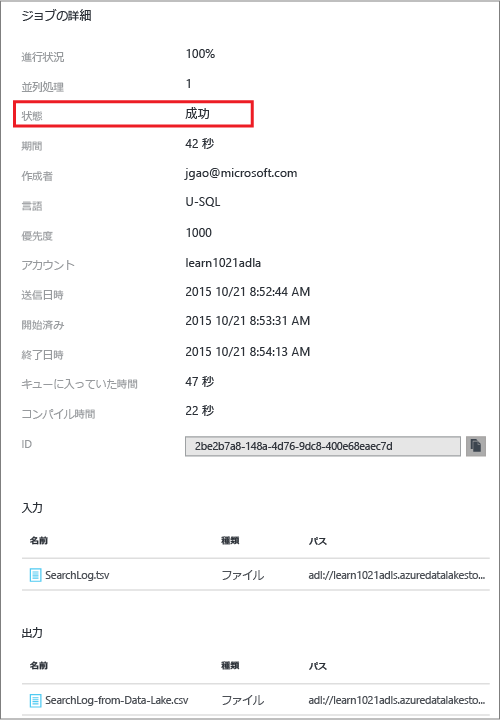

<properties 
   pageTitle="Azure プレビュー ポータルで Azure Data Lake Analytics の使用を開始する | Azure" 
   description="Azure プレビュー ポータルを使用して、Data Lake Analytics アカウントを作成し、U-SQL を使用して Data Lake Analytics ジョブを作成してから、ジョブを送信する方法について説明します。" 
   services="data-lake-analytics" 
   documentationCenter="" 
   authors="mumian" 
   manager="paulettm" 
   editor="cgronlun"/>
 
<tags
   ms.service="data-lake-analytics"
   ms.devlang="na"
   ms.topic="article"
   ms.tgt_pltfrm="na"
   ms.workload="big-data" 
   ms.date="10/22/2015"
   ms.author="jgao"/>

# チュートリアル: Azure プレビュー ポータルで Azure Data Lake Analytics の使用を開始する

[AZURE.INCLUDE [get-started-selector](../../includes/data-lake-analytics-selector-get-started.md)]

Azure プレビュー ポータルを使用して、Azure Data Lake Analytics アカウントを作成し、[U-SQL](data-lake-analytics-u-sql-get-started.md) で Data Lake Analytics ジョブを定義して、Data LakeAnalytics アカウントにジョブを送信する方法について説明します。Data Lake Analytics の詳細については、「[Azure Data Lake Analytics の概要](data-lake-analytics-overview.md)」を参照してください。

このチュートリアルでは、タブ区切り値 (TSV) ファイルを読み取り、それをコンマ区切り値 (CSV) ファイルに変換するジョブを開発します。サポートされている他のツールを使用する同じチュートリアルを読み進めるには、このセクションの上部にあるタブをクリックします。最初のジョブが成功したら、U-SQL でのより複雑なデータ変換の記述を開始できます。

**基本的な Data Lake Analytics のプロセス:**

1. Data Lake Analytics アカウントを作成します。
2. ソース データを準備します。Data Lake Analytics ジョブでは、Azure Data Lake Store アカウントまたは Azure BLOB ストレージ アカウントからデータを読み取ることができます。この例では、Azure Data Lake Store から読み取ります。  
3. U-SQL スクリプトを開発します。
4. ジョブ (U-SQL スクリプト) を Data Lake Analytics アカウントに送信します。ジョブはソース データから読み取り、U-SQL スクリプトで指示されたとおりにデータを処理して、Data Lake Store アカウントまたは BLOB ストレージ アカウントに出力を保存します。

**前提条件**

このチュートリアルを読み始める前に、次の項目を用意する必要があります。

- **Azure サブスクリプション**。[Azure 無料試用版の取得](https://azure.microsoft.com/ja-JP/pricing/free-trial/)に関するページを参照してください。

##Data Lake Analytics アカウントの作成

ジョブを実行するには、Data Lake Analytics アカウントが必要です。

各 Data Lake Analytics アカウントには、[Azure Data Lake Store]() アカウントとの依存関係があります。このアカウントを、既定の Data Lake Store アカウントと呼びます。事前に、または Data Lake Analytics アカウントの作成時に Data Lake Store アカウントを作成することができます。このチュートリアルでは、Data Lake Analytics アカウントを使用して Data Lake Store アカウントを作成します。

**Data Lake Analytics アカウントを作成するには**

1. 新しい [Azure ポータル](https://portal.azure.com)にサインオンします。
2. **[新規]**、**[データ + 分析]**、**[Data Lake Analytics]** の順にクリックします。
6. 次の項目を入力または選択します。

    

	- **名前**: Analytics アカウントに名前を付けます。
	- **Data Lake Store**: 各 Data Lake Analytics アカウントには、従属する Azure Data Lake Store アカウントがあります。Data Lake Analytics アカウントと従属する Data Lake Store アカウントは、同じ Azure データ センターに配置する必要があります。以下の指示に従って、新しい Data Lake Store アカウントを作成するか、既存のものを選択します。
	- **サブスクリプション**: Analytics アカウントに使用する Azure サブスクリプションを選択します。
	- **リソース グループ**。既存の Azure リソース グループを選択するか、新しいものを作成します。Azure リソース マネージャー (ARM) を使用すると、アプリケーション内のリソースを 1 つのグループと見なして作業できます。詳細については、「[Azure リソース マネージャーの概要](resource-group-overview.md)」を参照してください。 
	- **場所**。Data Lake Analytics アカウントの Azure データ センターを選択します。 
7. **[スタート画面にピン留めする]** を選択します。このチュートリアルに従う場合はこれが必要です。
8. **[作成]** をクリックします。ポータルのスタート画面が表示されます。新しいタイルはスタート画面に追加され、"Azure Data Lake Analytics のデプロイ" を示すラベルが付けられます。Data Lake Analytics アカウントの作成にはしばらく時間がかかります。アカウントが作成されると、ポータルの新しいブレードにアカウントが開きます。

	

Data Lake Analytics アカウントが作成されたら、さらに Data Lake Store アカウントや Azure ストレージ アカウントを追加することができます。手順については、[Data Lake Analytics アカウント データ ソースの管理](data-lake-analytics-manage-use-portal.md#manage-account-data-sources)に関する記述を参照してください。

##ソース データの準備

このチュートリアルでは、いくつかの検索ログを処理します。検索ログは、Data Lake Store または Azure BLOB ストレージに格納できます。

Azure プレビュー ポータルでは、検索ログ ファイルを含む、既定の Data Lake アカウントにいくつかのサンプル データ ファイルをコピーするためのユーザー インターフェイスが提供されます。

**サンプル データ ファイルをコピーするには**

1. Azure プレビュー ポータルで、左上隅にある **[Microsoft Azure]** をクリックします。
2. Data Lake Analytics アカウント名のタイルをクリックします。ここにはアカウントの作成時にピン留めされます。アカウントがそこにピン留めされていない場合は、[ポータルから Data Lake Analytics アカウントを開く](data-lake-analytics-manage-use-portal.md#access-adla-account)手順を参照してアカウントを開きます。
3. **[要点]** ペインを展開してから、**[サンプル ジョブの検索]** をクリックします。**[サンプル ジョブ]** という別のブレードが開きます。
4. **[サンプル データのコピー]** をクリックしてから **[OK]** をクリックして確定します。
5. **[通知]** (ベルの形のアイコン) をクリックします。**サンプル データの更新が完了した**ことを示すログが表示されます。通知ペインの外側の任意の場所をクリックして閉じます。
7. Data Lake Analytics アカウント ブレードで、上部の **[データ エクスプ ローラー]** をクリックします。 

	

    2 つのブレードが開きます。1 つは **データ エクスプ ローラー**、もう 1 つは既定の Data Lake Store アカウントです。
8. 既定の Data Lake Store アカウント ブレードで、**[サンプル]** をクリックしてフォルダーを展開してから、**[データ]** をクリックしてフォルダーを展開します。次のファイルとフォルダーが表示されます。

    - AmbulanceData/
    - AdsLog.tsv
    - SearchLog.tsv
    - version.txt
    - WebLog.log
    
    このチュートリアルでは、SearchLog.tsv を使用します。

実際には、リンクされたストレージ アカウントにデータを書き込むか、データをアップロードするようにアプリケーションをプログラムします。ファイルのアップロードについては、[Data Lake Store へのデータのアップロード](data-lake-analytics-manage-use-portal.md#upload-data-to-adls)または [BLOB ストレージへのデータのアップロード](data-lake-analytics-manage-use-portal.md#upload-data-to-wasb)に関する記述を参照してください。

##Data Lake Analytics ジョブの作成と送信

ソース データの準備ができたら、U-SQL スクリプトの開発を開始できます。

**ジョブを送信するには**

1. ポータルの Data Lake Analytics アカウント ブレードで、**[新しいジョブ]** をクリックします。 

	

    ブレードが表示されない場合は、[ポータルから Data Lake Analytics アカウントを開く](data-lake-analytics-manage-use-portal.md#access-adla-account)手順を参照してください。
4. **[ジョブ名]** を入力してから、以下の U-SQL スクリプトを入力します。

	

        @searchlog =
            EXTRACT UserId          int,
                    Start           DateTime,
                    Region          string,
                    Query           string,
                    Duration        int?,
                    Urls            string,
                    ClickedUrls     string
            FROM "/Samples/Data/SearchLog.tsv"
            USING Extractors.Tsv();
        
        OUTPUT @searchlog   
            TO "/Output/SearchLog-from-Data-Lake.csv"
        USING Outputters.Csv();

	この U-SQL スクリプトでは、**Extractors.Tsv()** を使用してソース データ ファイルを読み取ってから、**Outputters.Csv()** を使用して csv ファイルを作成します。
    
    ソース ファイルを別の場所にコピーしない限り、2 つのパスを変更しないでください。出力フォルダーが存在しない場合、Data Lake Analytics によって作成されます。この場合は、単純な相対パスを使用します。
	
	既定の Data Lake アカウントに格納されたファイルの相対パスを使用する方が簡単です。絶対パスを使用することもできます。たとえば、次のように入力します。
    
        adl://<Data LakeStorageAccountName>.azuredatalakestore.net:443/Samples/Data/SearchLog.tsv
      

    U-SQL の詳細については、[Azure Data Lake Analytics U-SQL 言語の使用](data-lake-analytics-u-sql-get-started.md)と [U-SQL 言語リファレンス](http://go.microsoft.com/fwlink/?LinkId=691348)に関する記述を参照してください。
     
5. 上部の **[ジョブの送信]** をクリックします。新しいジョブの詳細ペインが開きます。タイトル バーに、ジョブの状態が示されます。
6. ジョブの状態が **[成功]** に変わるまで待機します。ジョブが完了したら、ポータルの新しいブレードにジョブの詳細が開きます。

    

    前述のスクリーンショットから、ジョブが完了する (状態が送信済みから終了に変わる) まで約 1.5 分かかったことがわかります。
    
    ジョブが失敗した場合は、[Data Lake Analytics ジョブの監視とトラブルシューティング](data-lake-analytics-monitor-and-troubleshoot-jobs-tutorials.md)に関する記述を参照してください。

7. **[ジョブの詳細]** ブレードの下部にある **SearchLog-from-Data-Lake.csv** のジョブ名をクリックします。出力ファイルはプレビュー、ダウンロード、名前変更、削除できます。

    
8. **[プレビュー]** をクリックして出力ファイルを表示します。

    

##関連項目

- より複雑なクエリを表示する場合は、「[Azure Data Lake Analytics を使用する Web サイト ログの分析](data-lake-analytics-analyze-weblogs.md)」を参照してください。
- U-SQL アプリケーションの開発を開始する場合は、「[Data Lake Tools for Visual Studio を使用する U-SQL スクリプトの開発](data-lake-analytics-data-lake-tools-get-started.md)」を参照してください。
- U-SQL の詳細については、「[Azure Data Lake Analytics U-SQL 言語の使用](data-lake-analytics-u-sql-get-started.md)」を参照してください。
- 管理タスクについては、「[Azure プレビュー ポータルを使用する Azure Data Lake Analytics の管理](data-lake-analytics-manage-use-portal.md)」を参照してください。
- Data Lake Analytics の概要については、「[Azure Data Lake Analytics の概要](data-lake-analytics-overview.md)」を参照してください。
- 他のツールを使用する同じチュートリアルを表示するには、ページの上部にあるタブ セレクターをクリックします。

<!---HONumber=Nov15_HO1-->