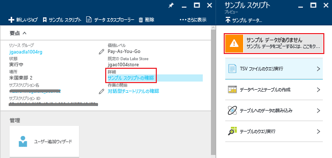
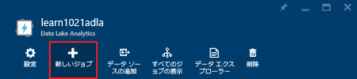
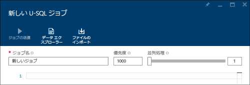
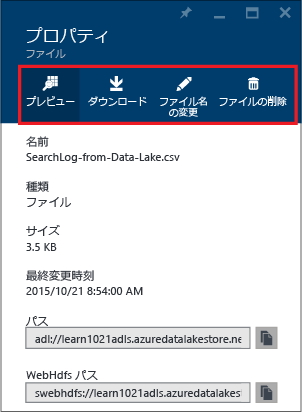

# チュートリアル: Azure Portal で Azure Data Lake Analytics の使用を開始する
[!INCLUDE [get-started-selector](../../includes/data-lake-analytics-selector-get-started.md)]

Azure Portal を使用して Azure Data Lake Analytics アカウントを作成し、[U-SQL](data-lake-analytics-u-sql-get-started.md) でジョブを定義して、Data Lake Analytics サービスにジョブを送信する方法について説明します。 Data Lake Analytics の詳細については、「 [Azure Data Lake Analytics の概要](data-lake-analytics-overview.md)」を参照してください。

このチュートリアルでは、タブ区切り値 (TSV) ファイルを読み取り、それをコンマ区切り値 (CSV) ファイルに変換するジョブを開発します。 サポートされている他のツールを使用する同じチュートリアルを読み進めるには、このセクションの上部にあるタブをクリックします。 最初のジョブが成功したら、U-SQL でのより複雑なデータ変換の記述を開始できます。

## 前提条件
このチュートリアルを開始する前に、次の項目を用意する必要があります。

* **Azure サブスクリプション**。 [Azure 無料試用版の取得](https://azure.microsoft.com/pricing/free-trial/)に関するページを参照してください。

## Data Lake Analytics アカウントを作成する
ジョブを実行するには、Data Lake Analytics アカウントが必要です。

各 Data Lake Analytics アカウントには、Azure Data Lake Store アカウントとの依存関係があります。  このアカウントを、既定の Data Lake Store アカウントと呼びます。  事前に、または Data Lake Analytics アカウントの作成時に Data Lake Store アカウントを作成することができます。 このチュートリアルでは、Data Lake Analytics アカウントを使用して Data Lake Store アカウントを作成します。

**Data Lake Analytics アカウントを作成する**

1. [Azure ポータル](https://portal.azure.com)にサインオンします。
2. **[新規]**、**[インテリジェンス + 分析]**、**[Data Lake Analytics]** の順にクリックします。
3. 次の値を入力または選択します。

    

   * **名前**: Data Lake Analytics アカウントに名前を付けます (英小文字と数字のみ使用できます)。
   * **サブスクリプション**: Analytics アカウントに使用する Azure サブスクリプションを選択します。
   * **リソース グループ**。 既存の Azure リソース グループを選択するか、新しいものを作成します。 Azure リソース マネージャーを使用すると、アプリケーション内の複数リソースを&1; つのグループと見なして作業できます。 詳細については、「 [Azure リソース マネージャーの概要](../azure-resource-manager/resource-group-overview.md)」を参照してください。
   * **場所**:  Data Lake Analytics アカウントの Azure データ センターを選択します。
   * **Data Lake Store**: *[必要な設定の構成]* をクリックします。 以下の指示に従って、新しい Data Lake Store アカウントを作成するか、既存のものを選択します。 各 Data Lake Analytics アカウントには、従属する Data Lake Store アカウントがあります。 Data Lake Analytics アカウントと従属する Data Lake Store アカウントは、同じ Azure データ センターに配置する必要があります。
4. 価格レベルを選択する  
5. ページの下部にある **[Create]**」を参照してください。 ポータルのホーム画面に戻り、"Azure Data Lake Analytics のデプロイ中" と示している新しいタイルが表示されます。 デプロイ プロセスでは、Data Lake Analytics アカウントが作成されるまでに数分かかります。 アカウントが作成されると、ポータルの新しいブレードにアカウントが開きます。

Data Lake Analytics アカウントが作成されたら、Data Lake Store アカウントや Azure ストレージ アカウントを追加できます。 手順については、 [Data Lake Analytics アカウント データ ソースの管理](data-lake-analytics-manage-use-portal.md#manage-account-data-sources)に関する記述を参照してください。

## ソース データの準備
このチュートリアルでは、検索ログを処理します。  検索ログは、Data Lake Store または Azure Blob Storage に格納できます。

Azure Portal には、検索ログ ファイルを含むサンプル データ ファイルを既定の Data Lake Store アカウントにコピーするためのユーザー インターフェイスが用意されています。

**サンプル データ ファイルのコピー**

1. [Azure Portal](https://portal.azure.com) から Data Lake Analytics アカウントを開きます。  アカウントを作成し、ポータルでそのアカウントを開く方法については、[Data Lake Analytics アカウントの管理](data-lake-analytics-get-started-portal.md#create-data-lake-analytics-account)に関する記事をご覧ください。
2. **[要点]** ウィンドウを展開し、**[サンプル スクリプトを探します]** をクリックします。 **[サンプル スクリプト]** という別のブレードが開きます。

    
3. **[サンプル データがありません]** をクリックして、サンプル データ ファイルをコピーします。 この操作が完了すると、ポータルに "**サンプル データの更新が完了しました**" と表示されます。
4. Data Lake Analytics アカウント ブレードで、上部の **[データ エクスプ ローラー]** をクリックします。

    

    2 つのブレードが開きます。 1 つは **データ エクスプ ローラー**、もう&1; つは既定の Data Lake Store アカウントです。
5. 既定の Data Lake Store アカウント ブレードで、**[サンプル]** をクリックしてフォルダーを展開し、**[データ]** をクリックしてフォルダーを展開します。 次のファイルとフォルダーが表示されます。

   * AmbulanceData/
   * AdsLog.tsv
   * SearchLog.tsv
   * version.txt
   * WebLog.log

     このチュートリアルでは、SearchLog.tsv を使用します。

実際には、リンクされたストレージ アカウントにデータを書き込むか、データをアップロードするようにアプリケーションをプログラムします。 ファイルのアップロードについては、[Data Lake Store へのデータのアップロード](data-lake-analytics-manage-use-portal.md#upload-data-to-adls)または [Blob Storage](data-lake-analytics-manage-use-portal.md#upload-data-to-wasb) へのデータのアップロードに関する記事をご覧ください。

## Data Lake Analytics ジョブの作成と送信
ソース データの準備ができたら、U-SQL スクリプトの開発を開始できます。  

**ジョブを送信するには**

1. ポータルの Data Lake Analytics アカウント ブレードで、 **[新しいジョブ]**をクリックします。

    

    ブレードが表示されない場合は、 [ポータルから Data Lake Analytics アカウントを開く](data-lake-analytics-manage-use-portal.md#access-adla-account)手順を参照してください。
2. **ジョブ名**を入力し、次の U-SQL スクリプトを入力します。

        @searchlog =
            EXTRACT UserId          int,
                    Start           DateTime,
                    Region          string,
                    Query           string,
                    Duration        int?,
                    Urls            string,
                    ClickedUrls     string
            FROM "/Samples/Data/SearchLog.tsv"
            USING Extractors.Tsv();

        OUTPUT @searchlog   
            TO "/Output/SearchLog-from-Data-Lake.csv"
        USING Outputters.Csv();

    

    この U-SQL スクリプトでは、**Extractors.Tsv()** を使用してソース データ ファイルを読み取ってから、**Outputters.Csv()** を使用して csv ファイルを作成します。

    ソース ファイルを別の場所にコピーしない限り、2 つのパスを変更しないでください。  出力フォルダーがない場合は、Data Lake Analytics によって作成されます。  この場合は、単純な相対パスを使用します。  

    既定の Data Lake アカウントに保存されたファイルの相対パスを使用する方が簡単です。 絶対パスを使用することもできます。  たとえば、次のように入力します。

        adl://<Data LakeStorageAccountName>.azuredatalakestore.net:443/Samples/Data/SearchLog.tsv

    U-SQL の詳細については、「[チュートリアル: Azure Data Lake Analytics U-SQL 言語の使用](data-lake-analytics-u-sql-get-started.md)」および「[U-SQL Language Reference (U-SQL 言語リファレンス)](http://go.microsoft.com/fwlink/?LinkId=691348)」をご覧ください。

1. 上部の **[ジョブの送信]** をクリックします。   
2. ジョブの状態が **[成功]**に変わるまで待機します。 ジョブが完了するまで約&1; 分かかる場合があります。

    ジョブが失敗した場合は、[Data Lake Analytics ジョブの監視とトラブルシューティング](data-lake-analytics-monitor-and-troubleshoot-jobs-tutorial.md)に関する記事をご覧ください。
3. ブレードの下部にある **[出力]** タブをクリックし、**SearchLog-from-Data-Lake.csv** をクリックします。 出力ファイルはプレビュー、ダウンロード、名前変更、削除できます。

    

## 関連項目
* より複雑なクエリを表示する場合は、「 [チュートリアル: Azure Data Lake Analytics を使用して Web サイトのログを分析する](data-lake-analytics-analyze-weblogs.md)」をご覧ください。
* U-SQL アプリケーションの開発を開始する場合は、「 [チュートリアル: Data Lake Tools for Visual Studio を使用する U-SQL スクリプトの開発](data-lake-analytics-data-lake-tools-get-started.md)」をご覧ください。
* U-SQL の詳細については、「 [Azure Data Lake Analytics U-SQL 言語の使用](data-lake-analytics-u-sql-get-started.md)」を参照してください。
* 管理タスクについては、「 [Azure Portal を使用する Azure Data Lake Analytics の管理](data-lake-analytics-manage-use-portal.md)」をご覧ください。
* Data Lake Analytics の概要については、「 [Microsoft Azure Data Lake Analytics の概要](data-lake-analytics-overview.md)」を参照してください。
* 他のツールを使用する同じチュートリアルを表示するには、ページの上部にあるタブ セレクターをクリックします。
* 診断情報のログについては、「 [Accessing diagnostics logs for Azure Data Lake Analytics (Azure Data Lake Analytics の診断ログへのアクセス)](data-lake-analytics-diagnostic-logs.md)

