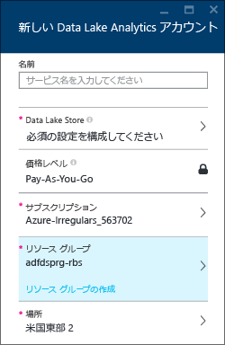
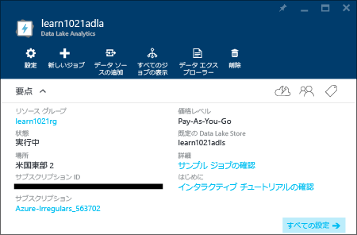
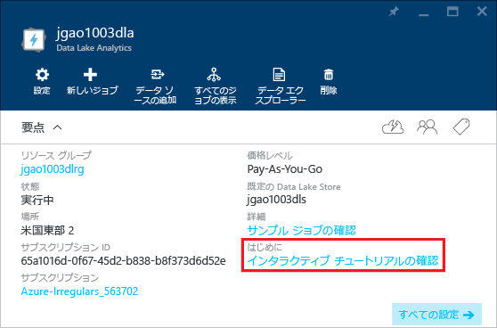

# Azure Data Lake Analytics の対話型チュートリアルの使用
Azure Portal では、Data Lake Analytics を使用するための対話型チュートリアルが提供されます。 この記事では、Web サイト ログを分析するためのチュートリアルを読み進める方法を示します。

> [!NOTE]
> Visual Studio を使用する同じチュートリアルを読み進める場合は、「 [Data Lake Analytics を使用する Web サイト ログの分析](data-lake-analytics-analyze-weblogs.md)」を参照してください。
> ポータルにはさらに対話型チュートリアルが追加されます。
> 
> 

他のチュートリアルについては、以下を参照してください。

* [Azure Portal で Azure Data Lake Analytics の使用を開始する](data-lake-analytics-get-started-portal.md)
* [Azure PowerShell で Data Lake Analytics の使用を開始する](data-lake-analytics-get-started-powershell.md)
* [.NET SDK で Azure Data Lake Analytics の使用を開始する](data-lake-analytics-get-started-net-sdk.md)
* [Data Lake Tools for Visual Studio を使用する U-SQL スクリプトの開発](data-lake-analytics-data-lake-tools-get-started.md) 

**前提条件**

このチュートリアルを読み始める前に、次の項目を用意する必要があります。

* **Data Lake Analytics アカウント**。  「[Azure Portal で Azure Data Lake Analytics の使用を開始する](data-lake-analytics-get-started-portal.md)」を参照してください。

## Data Lake Analytics アカウントを作成する
ジョブを実行するには、Data Lake Analytics アカウントが必要です。

各 Data Lake Analytics アカウントには、[Azure Data Lake Store](../data-lake-store/data-lake-store-overview.md) アカウント (既定の Data Lake Store アカウント) との依存関係があります。  このチュートリアルでは、Analytics アカウントを使用して既定の Data Lake Store アカウントを作成しますが、これは事前に作成しておくこともできます。

**Data Lake Analytics アカウントを作成するには**

1. [Azure ポータル](https://portal.azure.com/signin/index/?Microsoft_Azure_Kona=true&Microsoft_Azure_DataLake=true&hubsExtension_ItemHideKey=AzureDataLake_BigStorage%2cAzureKona_BigCompute)にサインオンします。
2. 左上隅にある **[Microsoft Azure]** をクリックして、スタート画面を開きます。
3. **[Marketplace]** タイルをクリックします。  
4. **[すべて]** ブレードの検索ボックスに「**Azure Data Lake Analytics**」と入力し、**Enter** キーを押します。 リストに **Azure Data Lake Analytics** が表示されます。
5. リストから **Azure Data Lake Analytics** をクリックします。
6. ブレードの下部にある **[作成]** をクリックします。
7. 次の値を入力または選択します。
   
    
   
   * **名前**: Analytics アカウントに名前を付けます。
   * **Data Lake Store**: 各 Data Lake Analytics アカウントには、従属する Data Lake Store アカウントがあります。 Data Lake Analytics アカウントと従属する Data Lake Store アカウントは、同じ Azure データ センターに配置する必要があります。 以下の指示に従って、Data Lake Store アカウントを作成するか、既存のものを選択します。
   * **サブスクリプション**: Analytics アカウントに使用する Azure サブスクリプションを選択します。
   * **リソース グループ**。 既存の Azure リソース グループを選択するか、新しいものを作成します。 アプリケーションは通常、Web アプリ、データベース、データベース サーバー、ストレージ、サード パーティのサービスなど、複数のコンポーネントで構成されます。 Azure リソース マネージャー (ARM) を使用すると、アプリケーション内の複数のリソースを&1; つのグループ (Azure リソース グループと呼ばれます) と見なして作業できます。 アプリケーションのこれらのリソースを、1 回の連携した操作でデプロイ、更新、監視、または削除できます。 デプロイにはテンプレートを使用しますが、このテンプレートは、テスト、ステージング、運用環境などのさまざまな環境に使用できます。 グループ全体のロールアップ コストを表示すると、組織の課金ついて明確に把握できます。 詳細については、「 [Azure リソース マネージャーの概要](../azure-resource-manager/resource-group-overview.md)」を参照してください。 
   * **場所**:  Data Lake Analytics アカウントの Azure データ センターを選択します。 
8. **[スタート画面にピン留めする]**を選択します。 このチュートリアルに従う場合はこれが必要です。
9. **[作成]**をクリックします。 ポータルのスタート画面が表示されます。 新しいタイルはホーム ページに追加され、"Azure Data Lake Analytics のデプロイ" を示すラベルが付けられます。 Data Lake Analytics アカウントの作成にはしばらく時間がかかります。 アカウントが作成されると、ポータルの新しいブレードにアカウントが開きます。
   
    

## Web サイト ログ分析の対話型チュートリアルの実行
**Web サイト ログ分析の対話型チュートリアルを開くには**

1. ポータルで、左側のメニューにある **[Microsoft Azure]** をクリックしてスタート画面を開きます。
2. Data Lake Analytics アカウントにリンクされているタイルをクリックします。
3. **[要点]** バーの **[対話型チュートリアルの検索]** をクリックします。
   
    
4. "サンプルがセットアップされていません。...をクリックしてください" という内容のオレンジ色の警告が表示された場合は、**[サンプル データのコピー]** をクリックして、サンプル データを既定の Data Lake Store アカウントにコピーします。 対話型チュートリアルを実行するにはデータが必要です。
5. **対話型チュートリアル**のブレードで、**[Web サイト ログの分析]** をクリックします。 ポータルの新しいポータル ブレードにチュートリアルが開きます。
6. **[概要]** をクリックし、指示に従います。

## 関連項目
* [Microsoft Azure Data Lake Analytics の概要](data-lake-analytics-overview.md)
* [Azure Portal で Azure Data Lake Analytics の使用を開始する](data-lake-analytics-get-started-portal.md)
* [Azure PowerShell で Data Lake Analytics の使用を開始する](data-lake-analytics-get-started-powershell.md)
* [Data Lake Tools for Visual Studio を使用する U-SQL スクリプトの開発](data-lake-analytics-data-lake-tools-get-started.md)
* [Azure Data Lake Analytics を使用する Web サイト ログの分析](data-lake-analytics-analyze-weblogs.md)

<!--HONumber=Dec16_HO2-->

