# Azure Data Lake Store のアクセス制御

Azure Data Lake Store は、POSIX アクセス制御モデルから派生した HDFS からさらに派生したアクセス制御モデルを実装します。 この記事では、Data Lake Store のアクセス制御モデルの基本について説明します。 HDFS アクセス制御モデルの詳細については、「[HDFS Permissions Guide (HDFS アクセス許可ガイド)](https://hadoop.apache.org/docs/current/hadoop-project-dist/hadoop-hdfs/HdfsPermissionsGuide.html)」を参照してください。

## ファイルとフォルダーのアクセス制御リスト

アクセス制御リスト (ACL) には、**アクセス ACL** と**既定の ACL** の 2 種類があります。

* **アクセス ACL**: オブジェクトへのアクセスを制御します。 ファイルとフォルダーの両方にアクセス ACL があります。

* **既定の ACL**: フォルダーに関連付けられた ACL の "テンプレート" です。この ACL によって、そのフォルダーの下に作成されるすべての子項目のアクセス ACL が決まります。 ファイルには既定の ACL がありません。

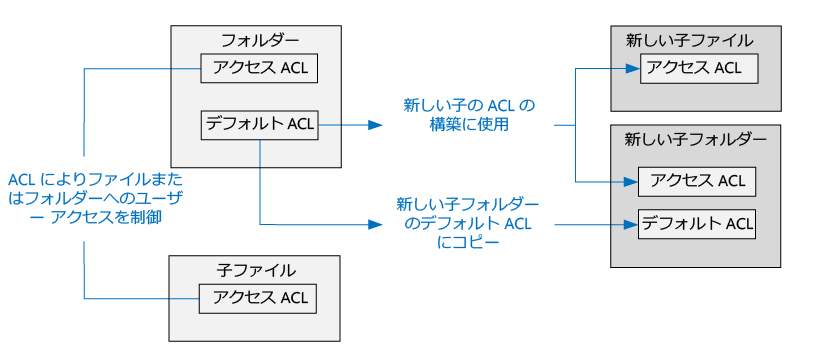

アクセス ACL と既定の ACL は両方とも同じ構造です。

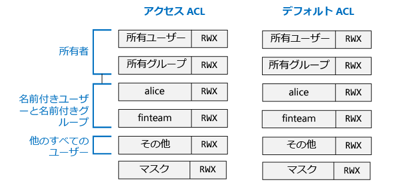

> [!NOTE]
> 親の既定の ACL を変更しても、既存の子項目のアクセス ACL または既定の ACL には影響しません。
>
>

## ユーザーと ID

すべてのファイルとフォルダーは、以下の ID の個別のアクセス許可を持っています。

* ファイルの所有ユーザー
* 所有グループ
* 名前付きユーザー
* 名前付きグループ
* その他のすべてのユーザー

ユーザーとグループの ID は、Azure Active Directory (Azure AD) の ID です。 そのため、注記がない限り、Data Lake Store のコンテキストでの "ユーザー" は、Azure AD ユーザーまたは Azure AD セキュリティ グループを意味します。

## アクセス許可

ファイル システム オブジェクトに対するアクセス許可は、**読み取り**、**書き込み**、**実行**であり、次の表に示すように、ファイルとフォルダーに対して使用できます。

|            |    ファイル     |   フォルダー |
|------------|-------------|----------|
| **読み取り (R)** | ファイルの内容を読み取ることができる | フォルダーの内容を一覧表示するには、**読み取り**と**実行**が必要です。|
| **書き込み (W)** | ファイルへの書き込みまたは追加を実行できる | フォルダーに子項目を作成するには、**書き込み**と**実行**が必要です。 |
| **実行 (X)** | Data Lake Store のコンテキストでは、何も意味しない | フォルダーの子項目をスキャンするために必要です。 |

### アクセス許可の短い形式

**RWX** は、**読み取り + 書き込み + 実行**を示すために使用されます。 さらに縮約された数値形式もあります。**読み取り = 4**、**書き込み = 2**、**実行 = 1** で、その合計でアクセス許可を表します。 次は一部の例です。

| 数値形式 | 短縮形式 |      意味     |
|--------------|------------|------------------------|
| 7            | RWX        | 読み取り + 書き込み + 実行 |
| 5            | R-X        | 読み取り + 実行         |
| 4            | R--        | 読み取り                   |
| 0            | ---        | アクセス許可なし         |

### アクセス許可が継承されない

Data Lake Store で使用されている POSIX 形式のモデルでは、項目のアクセス許可は項目自体に格納されます。 つまり、項目のアクセス許可は親項目から継承できません。

## アクセス許可に関連する一般的なシナリオ

Data Lake Store アカウントに対する特定の操作の実行に必要なアクセス許可について理解できるように、一般的なシナリオを次に示します。

### ファイルの読み取りに必要なアクセス許可

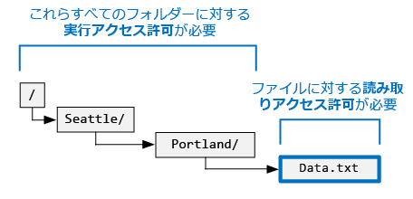

* 読み取り対象のファイルに対して、呼び出し元には**読み取り**アクセス許可が必要です。
* ファイルを含むフォルダー構造内のすべてのフォルダーに対して、呼び出し元には**実行**アクセス許可が必要です。

### ファイルへの追加に必要なアクセス許可

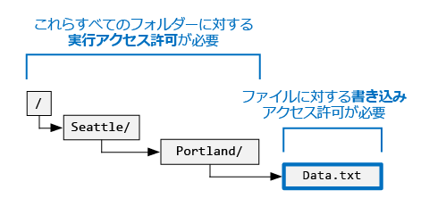

* 追加対象のファイルに対して、呼び出し元には**書き込み**アクセス許可が必要です。
* ファイルを含むすべてのフォルダーに対して、呼び出し元には**実行**アクセス許可が必要です。

### ファイルの削除に必要なアクセス許可

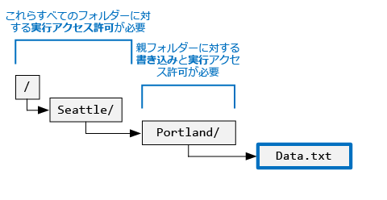

* 親フォルダーに対して、呼び出し元には**書き込み + 実行**アクセス許可が必要です。
* ファイルのパスにあるその他すべてのフォルダーに対して、呼び出し元には**実行**アクセス許可が必要です。

> [!NOTE]
> 上の 2 つの条件が満たされていれば、ファイルを削除するために、ファイルに対する書き込みアクセス許可は必要ありません。
>
>

### フォルダーの列挙に必要なアクセス許可

* 列挙するフォルダーに対して、呼び出し元には**読み取り + 実行**アクセス許可が必要です。
* すべての親フォルダーに対して、呼び出し元には**実行**アクセス許可が必要です。

## Azure Portal でのアクセス許可の表示

Data Lake Store アカウントの **[データ エクスプローラー]** ブレードで、**[アクセス]** をクリックして、ファイルまたはフォルダーの ACL を表示します。 **[アクセス]** をクリックして、**mydatastore** アカウントにある **catalog** フォルダーの ACL を表示します。

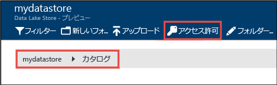

このブレードの最上部のセクションには、持っているアクセス許可の概要が示されます  (スクリーンショットでは、ユーザーは Bob です)。その下に、アクセス許可が表示されます。 その後、**[アクセス]** ブレードで **[簡易ビュー]** をクリックして、より単純なビューを表示します。

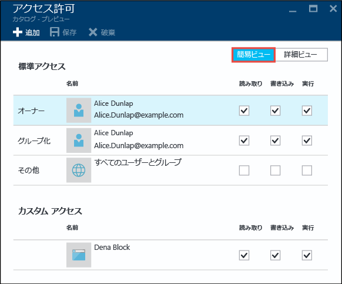

**[詳細ビュー]** をクリックして、より詳しいビューを表示します。このビューには、既定の ACL、マスク、スーパー ユーザーの概念が表示されます。

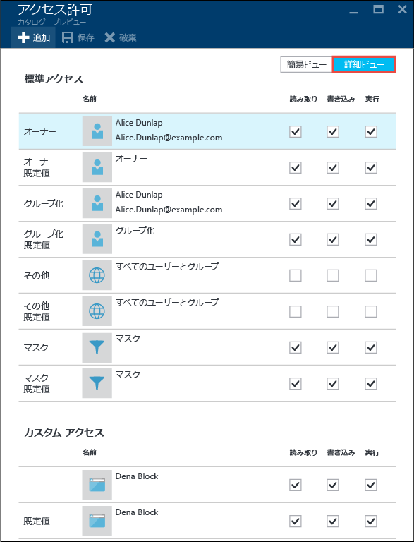

## スーパー ユーザー

スーパー ユーザーは、Data Lake Store 内のすべてのユーザーの中で、最高の権限を持ちます。 スーパー ユーザーには、次の特長があります。

* **すべて**のファイルとフォルダーに対して、RWX アクセス許可を持ちます。
* 任意のファイルまたはフォルダーのアクセス許可を変更できます。
* 任意のファイルまたはフォルダーの所有ユーザーまたは所有グループを変更できます。

Azure では、Data Lake Store アカウントは、次のようないくつかの Azure ロールを持ちます。

* 所有者
* 共同作成者
* 閲覧者

Data Lake Store アカウントの **所有者** ロールのすべてのユーザーは、自動的にそのアカウントのスーパー ユーザーになります。 詳細については、[ロール ベースのアクセス制御](../active-directory/role-based-access-control-configure.md)に関するページを参照してください。
スーパー ユーザー アクセス許可を持つ、カスタムのロール ベースのアクセス制御 (RBAC) ロールを作成する場合は、以下のアクセス許可を持っている必要があります。
- Microsoft.DataLakeStore/accounts/Superuser/action
- Microsoft.Authorization/roleAssignments/write

## 所有ユーザー

項目を作成したユーザーは、自動的に項目の所有ユーザーになります。 所有ユーザーは、次のことができます。

* 所有しているファイルのアクセス許可を変更します。
* 所有しているファイルの所有グループを変更します。ただし、所有ユーザーが変更後のグループのメンバーでもある必要があります。

> [!NOTE]
> 所有ユーザーは、他の所有ファイルの所有ユーザーを変更することは "*できません*"。 ファイルまたはフォルダーの所有ユーザーを変更できるのは、スーパー ユーザーだけです。
>
>

## 所有グループ

POSIX ACL では、すべてのユーザーが "プライマリ グループ" に関連付けられています。 たとえば、ユーザー "alice" が "finance" グループに属しているとします。 Alice は複数のグループに属している可能性がありますが、1 つのグループが常にプライマリ グループとして指定されています。 POSIX では、Alice がファイルを作成すると、そのファイルの所有グループが彼女のプライマリ グループに設定されます。ここでは、"finance" グループです。

新しいファイル システム項目が作成されると、Data Lake Store は所有グループに値を割り当てます。

* **ケース 1**: ルート フォルダー "/"。 このフォルダーは、Data Lake Store アカウントの作成時に作成されます。 この場合、所有グループは、アカウントを作成したユーザーに設定されます。
* **ケース 2** (その他すべての場合): 新しい項目が作成されると、所有グループが親フォルダーからコピーされます。

所有グループを変更できるユーザーは次のとおりです。
* すべてのスーパー ユーザー
* 所有ユーザー (所有ユーザーが変更後のグループのメンバーでもある場合)

## アクセス確認アルゴリズム

次の図は、Data Lake Store アカウントのアクセス確認アルゴリズムを示しています。

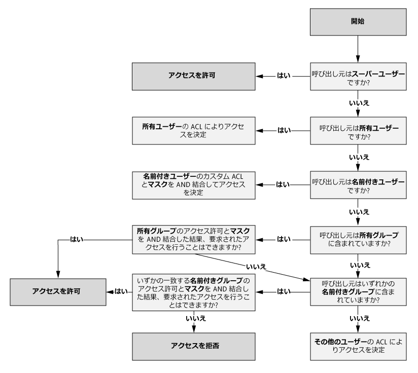

## マスクと "有効なアクセス許可"

**マスク**は、アクセス確認アルゴリズムの実行時に、**名前付きユーザー**、**所有グループ**、**名前付きグループ**のアクセスを制限するために使用される RWX 値です。 マスクの主な概念は次のとおりです。

* マスクは、"有効なアクセス許可" を作成します。 つまり、アクセス確認時にアクセス許可を変更します。
* ファイル所有者とすべてのスーパー ユーザーは、マスクを直接編集できます。
* マスクは、有効なアクセス許可を作成するためにアクセス許可を削除することができます。 マスクが有効なアクセス許可にアクセス許可を追加することは "*できません*"。

いくつかの例を見てみましょう。 次の例では、マスクは **RWX** に設定されています。つまり、マスクはどのアクセス許可も削除しません。 アクセス確認中に、名前付きユーザー、所有グループ、名前付きグループの有効なアクセス許可は変更されません。

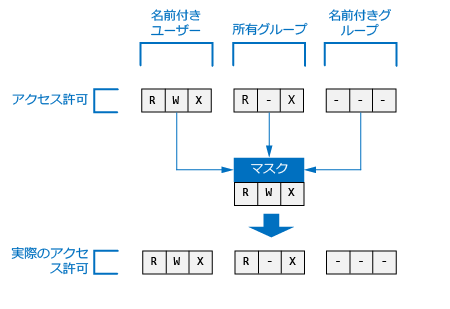

次の例では、マスクは **R-X** に設定されています。 そのため、アクセス確認時に、**名前付きユーザー**、**所有グループ**、**名前付きグループ**の**書き込みアクセス許可が無効**になります。

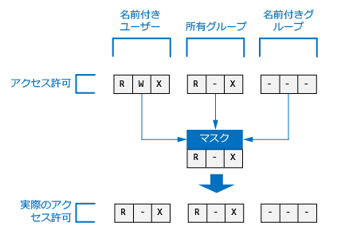

参考までに、ファイルまたはフォルダーのマスクが Azure Portal で表示されているところを示します。

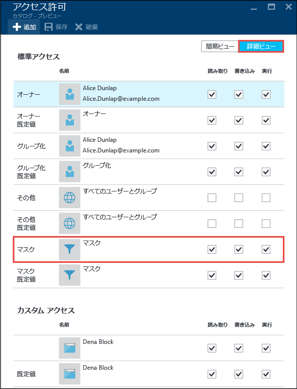

> [!NOTE]
> 新しい Data Lake Store アカウントでは、ルート フォルダー ("/") のアクセス ACL と既定の ACL のマスクは既定で RWX に設定されています。
>
>

## 新しいファイルとフォルダーのアクセス許可

既存のフォルダーの下に新しいファイルまたはフォルダーが作成されると、親フォルダーの既定の ACL によって、次のものが決定します。

- 子フォルダーの既定の ACL とアクセス ACL。
- 子ファイルのアクセス ACL (ファイルには既定の ACL がありません)。

### 子ファイルまたはフォルダーのアクセス ACL

子ファイルまたはフォルダーが作成されると、親の既定の ACL が子ファイルまたはフォルダーのアクセス ACL としてコピーされます。 また、**他の**ユーザーが親の既定の ACL で RWX アクセス許可を持っている場合、そのアクセス許可は子項目のアクセス ACL から削除されます。

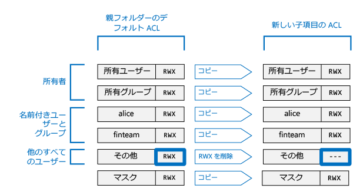

ほとんどのシナリオでは、子項目のアクセス ACL の決定方法について知っておく必要があることは、上記の情報がすべてです。 しかし、POSIX システムを使い慣れていて、この変換のしくみの詳細を理解したい場合は、この記事の後の方の「 [新しいファイルとフォルダーのアクセス ACL を作成する際の umask の役割](#umasks-role-in-creating-the-access-acl-for-new-files-and-folders) 」を参照してください。

### 子フォルダーの既定の ACL

親フォルダーの下に子フォルダーが作成されると、親フォルダーの既定の ACL がそのまま子フォルダーの既定の ACL にコピーされます。

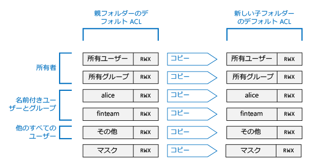

## Data Lake Store の ACL を理解するための高度なトピック

Data Lake Store のファイルまたはフォルダーの ACL がどのように決定されるかを理解するために役立ついくつかの高度なトピックを次に示します。

### 新しいファイルとフォルダーのアクセス ACL を作成する際の umask の役割

POSIX 準拠システムの一般概念では、umask は、新しい子ファイルまたはフォルダーのアクセス ACL で**所有ユーザー**、**所有グループ**、**その他**のアクセス許可を変換するために使用される、親フォルダーでの 9 ビット値です。 umask のビットは、子項目のアクセス ACL でどのビットがオフになるかを特定します。 つまり、**所有ユーザー**、**所有グループ**、および**その他**で、アクセス許可の継承を選択的に禁止するために使用されます。

HDFS システムでは、umask は一般的にサイト全体の構成オプションであり、管理者によって制御されます。 Data Lake Store は、変更することができない、 **アカウント全体の umask** を使用します。 次の表に、Data Lake Store の umask を示します。

| ユーザー グループ  | Setting | 新しい子項目のアクセス ACL への効果 |
|------------ |---------|---------------------------------------|
| 所有ユーザー | ---     | 効果なし                             |
| 所有グループ| ---     | 効果なし                             |
| 他の       | RWX     | 読み取り + 書き込み + 実行を削除         |

次の図は、この umask の動作を示しています。 実際の効果は、**その他**のユーザーの**読み取り + 書き込み + 実行**の削除です。 umask で**所有ユーザー**と**所有グループ**のビットを指定しなかったため、これらのアクセス許可は変換されません。

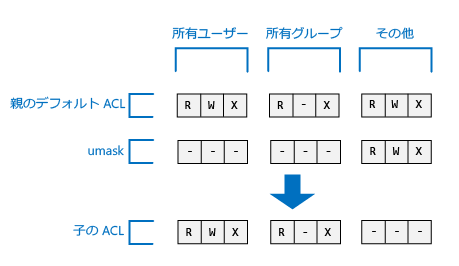

### スティッキー ビット

スティッキー ビットは、POSIX ファイル システムのより高度な機能です。 Data Lake Store のコンテキストでは、スティッキー ビットが必要になることはあまりありません。

次の表は、Data Lake Store でスティッキー ビットがどのように動作するかを示しています。

| ユーザー グループ         | ファイル    | フォルダー |
|--------------------|---------|-------------------------|
| スティッキー ビット **OFF** | 効果なし   | 効果なし。           |
| スティッキー ビット **ON**  | 効果なし   | 子項目の**スーパー ユーザー**と**所有ユーザー**以外のユーザーが、その子項目の削除や名前変更を実行できないようにします。               |

スティッキー ビットは、Azure Portal には表示されません。

## Data Lake Store の ACL に関する一般的な質問

Data Lake Store の ACL に関してよくある質問のいくつかを次に示します。

### ACL のサポートを有効にする必要はありますか

いいえ。 ACL によるアクセス制御は、Data Lake Store アカウントでは常に有効になっています。

### フォルダーとその内容を再帰的に削除するのに必要なアクセス許可を教えてください

* 親フォルダーには、**書き込み + 実行**アクセス許可が必要です。
* 削除対象のフォルダーとその中のすべてのフォルダーには、**読み取り + 書き込み + 実行**アクセス許可が必要です。

> [!NOTE]
> フォルダー内のファイルを削除するには、書き込みアクセス許可は必要ありません。 また、ルート フォルダー "/" を削除することは**できません**。
>
>

### ファイルまたはフォルダーの所有者として設定されるのはだれですか

ファイルまたはフォルダーの作成者が所有者になります。

### ファイルまたはフォルダーの作成時に、所有グループとして設定されるのはどのグループですか

所有グループは、新しいファイルまたはフォルダーが作成される親フォルダーの所有グループからコピーされます。

### ファイルの所有ユーザーですが、必要な RWX アクセス許可を持っていません。 どうすればよいですか。

所有ユーザーは、ファイルのアクセス許可を変更して、必要な任意の RWX アクセス許可を自分に与えることができます。

### Azure Portal で ACL を確認するとユーザー名が表示されますが、API では GUID が表示されるのはなぜですか

ACL のエントリは、ユーザーに対応する GUID として Azure AD に格納されます。 API では GUID がそのまま返されます。 Azure Portal では、可能であれば GUID をわかりやすい名前に変換することで、ACL をより使いやすくします。

### Azure Portal の使用時に ACL に GUID が表示されることがある理由を教えてください

GUID が表示されるのは、そのユーザーがもう Azure AD に存在しない場合です。 通常、ユーザーが会社を辞めた場合や Azure AD でそのアカウントが削除された場合に、この現象が発生します。

### Data Lake Store は ACL の継承をサポートしていますか

いいえ。

### mask と umask の違いは何ですか

| mask | umask|
|------|------|
| **mask** プロパティは、すべてのファイルおよびフォルダーで使用できます。 | **umask** は、Data Lake Store アカウントのプロパティです。 そのため、Data Lake Store には umask が 1 つしかありません。    |
| ファイルまたはフォルダーの mask プロパティを変更できるのは、ファイルの所有ユーザーまたは所有グループ、あるいはスーパー ユーザーです。 | umask プロパティは、スーパー ユーザーも含めて、どのユーザーも変更できません。 変更不可の定数値です。|
| mask プロパティは、実行時にアクセス確認アルゴリズムで使用され、ファイルまたはフォルダーに対する操作を実行する権限がユーザーにあるかどうかを判断します。 mask の役割は、アクセス確認時の "有効なアクセス許可" を作成することです。 | umask は、アクセス確認中はまったく使用されません。 umask は、フォルダーの新しい子項目のアクセス ACL を判断するために使用されます。 |
| マスクは、アクセス確認時に名前付きユーザー、名前付きグループ、所有ユーザーに適用される 3 ビット RWX 値です。| umask は、新しい子の所有ユーザー、所有グループ、および**その他**に適用される 9 ビット値です。|

### POSIX アクセス制御モデルの詳細はどこで確認できますか

* [POSIX Access Control Lists on Linux (Linux での POSIX アクセス制御リスト)](http://www.vanemery.com/Linux/ACL/POSIX_ACL_on_Linux.html)

* [HDFS Permission Guide (HDFS アクセス許可ガイド)](http://hadoop.apache.org/docs/current/hadoop-project-dist/hadoop-hdfs/HdfsPermissionsGuide.html)

* [POSIX FAQ (POSIX のよく寄せられる質問)](http://www.opengroup.org/austin/papers/posix_faq.html)

* [POSIX 1003.1 2008](http://standards.ieee.org/findstds/standard/1003.1-2008.html)

* [POSIX 1003.1e 1997](http://users.suse.com/~agruen/acl/posix/Posix_1003.1e-990310.pdf)

* [POSIX ACL on Linux (Linux での POSIX ACL)](http://users.suse.com/~agruen/acl/linux-acls/online/)

* [ACL using access control lists on Linux (Linux でのアクセス制御リストを使用した ACL)](http://bencane.com/2012/05/27/acl-using-access-control-lists-on-linux/)

## 関連項目

* [Azure Data Lake Store の概要](data-lake-store-overview.md)

