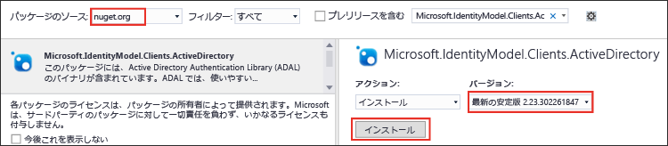

<properties
   pageTitle="Data Lake Store .NET SDK を使用してアプリケーションを開発する | Azure"
   description="Data Lake Store .NET SDK を使用してアプリケーションを開発する"
   services="data-lake-store"
   documentationCenter=""
   authors="nitinme"
   manager="paulettm"
   editor="cgronlun"/>

<tags
   ms.service="data-lake-store"
   ms.devlang="na"
   ms.topic="get-started-article"
   ms.tgt_pltfrm="na"
   ms.workload="big-data"
   ms.date="07/18/2016"
   ms.author="nitinme"/>

# .NET SDK で Data Lake Store の使用を開始する

> [AZURE.SELECTOR]
- [ポータル](data-lake-store-get-started-portal.md)
- [PowerShell](data-lake-store-get-started-powershell.md)
- [.NET SDK](data-lake-store-get-started-net-sdk.md)
- [Java SDK](data-lake-store-get-started-java-sdk.md)
- [REST API](data-lake-store-get-started-rest-api.md)
- [Azure CLI](data-lake-store-get-started-cli.md)
- [Node.JS](data-lake-store-manage-use-nodejs.md)

Azure Data Lake Store .NET SDK を使用して、Azure Data Lake アカウントを作成し、フォルダーの作成、データ ファイルのアップロードとダウンロード、アカウントの削除などの基本操作を行う方法について説明します。Data Lake の詳細については、[Azure Data Lake Store](data-lake-store-overview.md) に関するページを参照してください。

## 前提条件

* Visual Studio 2013 または 2015以下の手順では、Visual Studio 2015 を使用します。
* **Azure サブスクリプション**。[Azure 無料試用版の取得](https://azure.microsoft.com/pricing/free-trial/)に関するページを参照してください。
* Data Lake Store のパブリック プレビューに対して、**Azure サブスクリプションを有効にする**。[手順](data-lake-store-get-started-portal.md#signup)を参照してください。
* **Azure Active Directory アプリケーションを作成する**Azure Active Directory を使用した認証には、**対話型**と**非対話型**の 2 とおりの方法があります。どのように認証を行うかで前提条件は異なります。
	* **対話型の認証** (この記事で使用する認証方法) を使用する場合: Azure Active Directory で **[ネイティブ クライアント アプリケーション]** を作成する必要があります。アプリケーションの作成が完了したら、アプリケーションに関連する次の値を取得します。
		- アプリケーションの**クライアント ID** と**リダイレクト URI** を取得します。
		- 委任されたアクセス許可を設定する

	* **非対話型の認証**を使用する場合: Azure Active Directory で **[Web アプリケーション]** を作成する必要があります。アプリケーションの作成が完了したら、アプリケーションに関連する次の値を取得します。
		- アプリケーションの**クライアント ID**、**クライアント シークレット**、**リダイレクト URI** を取得します。
		- 委任されたアクセス許可を設定する
		- Azure Active Directory アプリケーションをロールに割り当てます。ロールは、Azure Active Directory アプリケーションにアクセス許可を付与するスコープのレベルにあります。たとえば、サブスクリプション レベルまたはリソース グループのレベルで、アプリケーションを割り当てることができます。

	これらの値を取得したりアクセス許可を設定したりロールを割り当てたりする手順については、「[ポータルを利用し、Active Directory のアプリケーションとサービス プリンシパルを作成する](../resource-group-create-service-principal-portal.md)」を参照してください。

## .NET アプリケーションの作成

1. Visual Studio を開き、コンソール アプリケーションを作成します。

2. **[ファイル]** メニューの **[新規作成]** をクリックし、**[プロジェクト]** をクリックします。

3. **[新しいプロジェクト]** で、次の値を入力するか、選択します。

	| プロパティ | 値 |
	|----------|-----------------------------|
	| カテゴリ | テンプレート/Visual C#/Windows |
	| テンプレート | コンソール アプリケーション |
	| 名前 | CreateADLApplication |

4. **[OK]** をクリックしてプロジェクトを作成します。

5. Nuget パッケージをプロジェクトに追加します。

	1. ソリューション エクスプローラーでプロジェクト名を右クリックし、**[NuGet パッケージの管理]** をクリックします。
	2. **[Nuget パッケージの管理]** タブで、**[パッケージ ソース]** が **nuget.org** に設定されており、**[プレリリースを含む]** チェック ボックスがオンになっていることを確認します。
	3. 以下の Data Lake Store パッケージを検索してインストールします。

		* `Microsoft.Azure.Management.DataLake.Store`
		* `Microsoft.Azure.Management.DataLake.StoreUploader`

		

	4. Azure Active Directory 認証用の `Microsoft.IdentityModel.Clients.ActiveDirectory` パッケージもインストールします。パッケージの安定バージョンがインストールされるように、**[プレリリースを含める]** チェック ボックスを*オフ*にします。

		

	5. **NuGet パッケージ マネージャー**を閉じます。

7. **Program.cs** を開き、既存のコードを削除し、次のステートメントを含めて、名前空間の参照を追加します。

		using System;
        using System.IO;
        using System.Security;
        using System.Text;
        using System.Collections.Generic;
        using System.Linq;

        using Microsoft.Azure.Management.DataLake.Store;
        using Microsoft.Azure.Management.DataLake.Store.Models;
        using Microsoft.Azure.Management.DataLake.StoreUploader;
        using Microsoft.IdentityModel.Clients.ActiveDirectory;
        using Microsoft.Rest;

8. 以下のように変数を宣言し、Data Lake Store 名とリソース グループ名の値を指定します。指定する Data Lake Store 名はアプリケーションによって作成されます。ここで指定するリソース グループは、既存のグループです。また、ここで指定するローカル パスとファイル名は、コンピューターに存在している必要があります。名前空間の宣言後に次のコード スニペットを追加します。

		namespace SdkSample
        {
            class Program
            {
                private static DataLakeStoreAccountManagementClient _adlsClient;
                private static DataLakeStoreFileSystemManagementClient _adlsFileSystemClient;

                private static string _adlsAccountName;
                private static string _resourceGroupName;
                private static string _location;

                private static void Main(string[] args)
                {
                    _adlsAccountName = "<DATA-LAKE-STORE-NAME>"; // TODO: Replace this value with the name for a NEW Store account.
                    _resourceGroupName = "<RESOURCE-GROUP-NAME>"; // TODO: Replace this value. This resource group should already exist.
                    _location = "East US 2";

                    string localFolderPath = @"C:\local_path"; // TODO: Make sure this exists and can be overwritten.
                    string localFilePath = localFolderPath + "file.txt"; // TODO: Make sure this exists and can be overwritten.
                    string remoteFolderPath = "/data_lake_path/";
                    string remoteFilePath = remoteFolderPath + "file.txt";
				}
			}
		}

記事の以降のセクションでは、ユーザーの認証、Data Lake Store アカウントの作成、ファイルのアップロードなどの操作を実行する .NET メソッドの使用方法について説明します。Data Lake Store の操作方法の詳細なサンプルについては、この記事の末尾にある「[付録](#appendix-sample-code)」を参照してください。

## ユーザーを認証する

Azure Active Directory を使用して認証する方法は 2 つあります。

* **対話型**。アプリケーションを使用するユーザー サインイン。これは、次のコード スニペットでメソッド `AuthenticateUser` に実装されます。

* **非対話型**。アプリケーションが独自の資格情報を指定します。これは、次のコード スニペットでメソッド `AuthenticateAppliaction` に実装されます。

### 対話型の認証

次のスニペットは、対話型のログイン エクスペリエンスに使用できる `AuthenticateUser` メソッドの例です。

 	// Authenticate the user with AAD through an interactive popup.
    // You need to have an application registered with AAD in order to authenticate.
    //   For more information and instructions on how to register your application with AAD, see:
    //   https://azure.microsoft.com/ja-JP/documentation/articles/resource-group-create-service-principal-portal/
	public static TokenCredentials AuthenticateUser(string tenantId, string resource, string appClientId, Uri appRedirectUri, string userId = "")
	{
	    var authContext = new AuthenticationContext("https://login.microsoftonline.com/" + tenantId);
	
	    var tokenAuthResult = authContext.AcquireToken(resource, appClientId, appRedirectUri,
	        PromptBehavior.Auto, UserIdentifier.AnyUser);
	
	    return new TokenCredentials(tokenAuthResult.AccessToken);
	}

### 非対話型の認証

次のスニペットは、非対話型のログイン エクスペリエンスに使用できる `AuthenticateApplication` メソッドの例です。

	// Authenticate the application with AAD through the application's secret key.
	// You need to have an application registered with AAD in order to authenticate.
	//   For more information and instructions on how to register your application with AAD, see:
	//   https://azure.microsoft.com/ja-JP/documentation/articles/resource-group-create-service-principal-portal/
	public static TokenCredentials AuthenticateApplication(string tenantId, string resource, string appClientId, Uri appRedirectUri, SecureString clientSecret)
	{
	    var authContext = new AuthenticationContext("https://login.microsoftonline.com/" + tenantId);
	    var credential = new ClientCredential(appClientId, clientSecret);
	
	    var tokenAuthResult = authContext.AcquireToken(resource, credential);
	
	    return new TokenCredentials(tokenAuthResult.AccessToken);
	}
	
## Data Lake Store アカウントを作成する

次のスニペットは、Data Lake Store アカウントの作成に使用できる `CreateAccount` メソッドの例です。

	// Create Data Lake Store account
    public static void CreateAccount()
    {
        var adlsParameters = new DataLakeStoreAccount(location: _location);
        _adlsClient.Account.Create(_resourceGroupName, _adlsAccountName, adlsParameters);
    } 

## サブスクリプション内のすべての Data Lake Store アカウントを一覧表示する

次のスニペットは、指定した Azure サブスクリプション内のすべての Data Lake Store アカウントを一覧表示するために使用できる `ListAdlStoreAccounts` メソッドの例です。

	// List all ADLS accounts within the subscription
	public static List<DataLakeStoreAccount> ListAdlStoreAccounts()
	{
	    var response = _adlsClient.Account.List(_adlsAccountName);
	    var accounts = new List<DataLakeStoreAccount>(response);
	
	    while (response.NextPageLink != null)
	    {
	        response = _adlsClient.Account.ListNext(response.NextPageLink);
	        accounts.AddRange(response);
	    }
	
	    return accounts;
	}

## ディレクトリを作成する

次のスニペットは、Data Lake Store アカウント内にディレクトリを作成するために使用できる `CreateDirectory` メソッドの例です。

	// Create a directory
    public static void CreateDirectory(string path)
    {
        _adlsFileSystemClient.FileSystem.Mkdirs(_adlsAccountName, path);
    }

## ファイルを Data Lake Store にアップロードする

次のスニペットは、Data Lake Store アカウントにファイルをアップロードするために使用できる `UploadFile` メソッドの例です。

	// Upload a file
    public static void UploadFile(string srcFilePath, string destFilePath, bool force = true)
    {
        var parameters = new UploadParameters(srcFilePath, destFilePath, _adlsAccountName, isOverwrite: force);
        var frontend = new DataLakeStoreFrontEndAdapter(_adlsAccountName, _adlsFileSystemClient);
        var uploader = new DataLakeStoreUploader(parameters, frontend);
        uploader.Execute();
    }

## ファイルまたはディレクトリの情報を取得する

次のスニペットは、Data Lake Store で使用できるファイルまたはディレクトリに関する情報を取得するために使用できる `GetItemInfo` メソッドの例です。

	// Get file or directory info
    public static FileStatusProperties GetItemInfo(string path)
    {
        return _adlsFileSystemClient.FileSystem.GetFileStatus(_adlsAccountName, path).FileStatus;
    }

## ファイルまたはディレクトリを一覧表示する

次のスニペットは、Data Lake Store アカウントのファイルとディレクトリを一覧表示するために使用できる `ListItem` メソッドの例です。
	
	// List files and directories
    public static List<FileStatusProperties> ListItems(string directoryPath)
    {
        return _adlsFileSystemClient.FileSystem.ListFileStatus(_adlsAccountName, directoryPath).FileStatuses.FileStatus.ToList();
    }

## ファイルを連結する

次のスニペットは、ファイルの連結に使用する `ConcatenateFiles` メソッドの例です。

	// Concatenate files
    public static void ConcatenateFiles(string[] srcFilePaths, string destFilePath)
    {
        _adlsFileSystemClient.FileSystem.Concat(_adlsAccountName, destFilePath, srcFilePaths);
    }

## ファイルに追加する

次のスニペットは、Data Lake Store アカウントに既に格納されているファイルに、データを追加するために使用する `AppendToFile` メソッドの例です。

	// Append to file
    public static void AppendToFile(string path, string content)
    {
        var stream = new MemoryStream(Encoding.UTF8.GetBytes(content));

        _adlsFileSystemClient.FileSystem.Append(_adlsAccountName, path, stream);
    }

## ファイルをダウンロードする

次のスニペットは、Data Lake Store アカウントからファイルをダウンロードするために使用する `DownloadFile` メソッドの例です。

	// Download file
    public static void DownloadFile(string srcPath, string destPath)
    {
        var stream = _adlsFileSystemClient.FileSystem.Open(_adlsAccountName, srcPath);
        var fileStream = new FileStream(destPath, FileMode.Create);

        stream.CopyTo(fileStream);
        fileStream.Close();
        stream.Close();
    }

## Data Lake Store アカウントを削除する

次のスニペットは、Data Lake Store アカウントの削除に使用できる `DeleteAccount` メソッドの例です。

	// Delete account
    public static void DeleteAccount()
    {
        _adlsClient.Account.Delete(_resourceGroupName, _adlsAccountName);
    }

## 付録: サンプル コード

次のスニペットは包括的なコード サンプルです。スニペットをコピーしてアプリケーションに貼り付けると、Data Lake Store のエンドツーエンドの操作を確認することができます。コード スニペットを実行する前に、Data Lake Store 名、リソース グループ名など、必要な値を指定する必要があります。また、Azure Active Directory 認証に必要な値 (**<APPLICATION-CLIENT-ID>**、**<APPLICATION-REPLY-URI>**、**<SUBSCRIPTION-ID>** など) も指定する必要があります。

以下のコード スニペットでは、対話型と非対話型の両方のアプローチ向けにメソッドが用意されていますが、非対話型コード ブロックはコメントアウトされています。対話型メソッドでは、AAD アプリケーションのクライアント ID とリダイレクト URI を提供する必要があります。前提条件のリンクでは、これらを取得する方法について説明します。

>[AZURE.NOTE] 代わりにコード スニペットを変更して、非対話型 (`AuthenticateApplication`) メソッドを使用する場合は、クライアント ID とクライアント応答 URI だけでなく、メソッドへの入力としてクライアント認証キーを入力する必要もあります。「[ポータルを利用し、Active Directory のアプリケーションとサービス プリンシパルを作成する](../resource-group-create-service-principal-portal.md)」の記事では、クライアント認証キーを生成し、取得する方法についても説明します。
	
最後に、ここで指定するローカル パスとファイル名は、コンピューターに存在している必要があります。アップロードするいくつかのサンプル データを探している場合は、[Azure Data Lake Git リポジトリ](https://github.com/MicrosoftBigData/usql/tree/master/Examples/Samples/Data/AmbulanceData)から **Ambulance Data** フォルダーを取得できます。

    using System;
    using System.IO;
    using System.Security;
    using System.Text;
    using System.Collections.Generic;
    using System.Linq;

    using Microsoft.Azure.Management.DataLake.Store;
    using Microsoft.Azure.Management.DataLake.Store.Models;
    using Microsoft.Azure.Management.DataLake.StoreUploader;
    using Microsoft.IdentityModel.Clients.ActiveDirectory;
    using Microsoft.Rest;

    namespace SdkSample
    {
        class Program
        {
            private static DataLakeStoreAccountManagementClient _adlsClient;
            private static DataLakeStoreFileSystemManagementClient _adlsFileSystemClient;

            private static string _adlsAccountName;
            private static string _resourceGroupName;
            private static string _location;

            private static void Main(string[] args)
            {
                _adlsAccountName = "<DATA-LAKE-STORE-NAME>"; // TODO: Replace this value with the name for a NEW Store account.
                _resourceGroupName = "<RESOURCE-GROUP-NAME>"; // TODO: Replace this value. This resource group should already exist.
                _location = "East US 2";

                string localFolderPath = @"C:\local_path"; // TODO: Make sure this exists and can be overwritten.
                string localFilePath = localFolderPath + "file.txt"; // TODO: Make sure this exists and can be overwritten.
                string remoteFolderPath = "/data_lake_path/";
                string remoteFilePath = remoteFolderPath + "file.txt";

                // Authenticate the user
                var tokenCreds = AuthenticateUser("common", "https://management.core.windows.net/",
                    "<APPLICATION-CLIENT-ID>", new Uri("<APPLICATION-REPLY-URI>")); // TODO: Replace bracketed values.

                SetupClients(tokenCreds, "<SUBSCRIPTION-ID>"); // TODO: Replace bracketed value.

                // Run sample scenarios
                WaitForNewline("Authenticated.", "Creating NEW account.");
                CreateAccount();
                WaitForNewline("Account created.", "Creating a directory.");

                // Create a directory in the Data Lake Store
                CreateDirectory(remoteFolderPath);
                WaitForNewline("Directory created.", "Showing directory info.");

                // Get info about the directory in the Data Lake Store
                var itemInfo = GetItemInfo(remoteFolderPath);
                Console.WriteLine("Type: " + itemInfo.Type);
                Console.WriteLine("Last modified (UTC): " +
                                  new DateTime(1970, 1, 1, 0, 0, 0, 0, DateTimeKind.Utc).AddMilliseconds(
                                      itemInfo.ModificationTime.Value));
                WaitForNewline("Directory info shown.", "Uploading a file.");

                // Upload a file to the Data Lake Store
                UploadFile(localFilePath, remoteFilePath);
                WaitForNewline("File uploaded.", "Listing files and directories.");

                // List the files in the Data Lake Store
                var itemList = ListItems(remoteFolderPath);
                var fileMenuItems = itemList.Select(a => String.Format("{0,15} {1}", a.Type, a.PathSuffix));
                Console.WriteLine(String.Join("\r\n", fileMenuItems));
                WaitForNewline("Files and directories listed.", "Appending content to a file.");

                // Append to a file in the Data Lake Store
                AppendToFile(remoteFilePath, "123");
                WaitForNewline("Content appended.", "Downloading a file.");

                // Download a file from the Data Lake Store
                DownloadFile(remoteFilePath, localFilePath);
                WaitForNewline("File downloaded.", "Deleting account.");

                // Delete account
                DeleteAccount();
                WaitForNewline("Account deleted. You can now exit.");
            }

            // Helper function to show status and wait for user input
            public static void WaitForNewline(string reason, string nextAction = "")
            {
                if (!String.IsNullOrWhiteSpace(nextAction))
                {
                    Console.WriteLine(reason + "\r\nPress ENTER to continue...");
                    Console.ReadLine();
                    Console.WriteLine(nextAction);
                }
                else
                {
                    Console.WriteLine(reason + "\r\nPress ENTER to continue...");
                    Console.ReadLine();
                }
            }

            // Authenticate the user with AAD through an interactive popup.
            // You need to have an application registered with AAD in order to authenticate.
            //   For more information and instructions on how to register your application with AAD, see:
            //   https://azure.microsoft.com/ja-JP/documentation/articles/resource-group-create-service-principal-portal/
            public static TokenCredentials AuthenticateUser(string tenantId, string resource, string appClientId, Uri appRedirectUri, string userId = "")
            {
                var authContext = new AuthenticationContext("https://login.microsoftonline.com/" + tenantId);

                var tokenAuthResult = authContext.AcquireToken(resource, appClientId, appRedirectUri,
                    PromptBehavior.Auto, UserIdentifier.AnyUser);

                return new TokenCredentials(tokenAuthResult.AccessToken);
            }
			
			/*
            // Authenticate the application with AAD through the application's secret key.
            // You need to have an application registered with AAD in order to authenticate.
            //   For more information and instructions on how to register your application with AAD, see:
            //   https://azure.microsoft.com/ja-JP/documentation/articles/resource-group-create-service-principal-portal/
            public static TokenCredentials AuthenticateApplication(string tenantId, string resource, string appClientId, Uri appRedirectUri, SecureString clientSecret)
            {
                var authContext = new AuthenticationContext("https://login.microsoftonline.com/" + tenantId);
                var credential = new ClientCredential(appClientId, clientSecret);

                var tokenAuthResult = authContext.AcquireToken(resource, credential);

                return new TokenCredentials(tokenAuthResult.AccessToken);
            }
			*/

            //Set up clients
            public static void SetupClients(TokenCredentials tokenCreds, string subscriptionId)
            {
                _adlsClient = new DataLakeStoreAccountManagementClient(tokenCreds);
                _adlsClient.SubscriptionId = subscriptionId;

                _adlsFileSystemClient = new DataLakeStoreFileSystemManagementClient(tokenCreds);
            }

            // Create account
            public static void CreateAccount()
            {
                // Create ADLS account
                var adlsParameters = new DataLakeStoreAccount(location: _location);
                _adlsClient.Account.Create(_resourceGroupName, _adlsAccountName, adlsParameters);
            }

            // Delete account
            public static void DeleteAccount()
            {
                _adlsClient.Account.Delete(_resourceGroupName, _adlsAccountName);
            }

            // List all ADLS accounts within the subscription
            public static List<DataLakeStoreAccount> ListAdlStoreAccounts()
            {
                var response = _adlsClient.Account.List(_adlsAccountName);
                var accounts = new List<DataLakeStoreAccount>(response);

                while (response.NextPageLink != null)
                {
                    response = _adlsClient.Account.ListNext(response.NextPageLink);
                    accounts.AddRange(response);
                }

                return accounts;
            }

            // Upload a file
            public static void UploadFile(string srcFilePath, string destFilePath, bool force = true)
            {
                var parameters = new UploadParameters(srcFilePath, destFilePath, _adlsAccountName, isOverwrite: force);
                var frontend = new DataLakeStoreFrontEndAdapter(_adlsAccountName, _adlsFileSystemClient);
                var uploader = new DataLakeStoreUploader(parameters, frontend);
                uploader.Execute();
            }

            // Concatenate files
            public static void ConcatenateFiles(string[] srcFilePaths, string destFilePath)
            {
                _adlsFileSystemClient.FileSystem.Concat(_adlsAccountName, destFilePath, srcFilePaths);
            }

            // Get file or directory info
            public static FileStatusProperties GetItemInfo(string path)
            {
                return _adlsFileSystemClient.FileSystem.GetFileStatus(_adlsAccountName, path).FileStatus;
            }

            // List files and directories
            public static List<FileStatusProperties> ListItems(string directoryPath)
            {
                return _adlsFileSystemClient.FileSystem.ListFileStatus(_adlsAccountName, directoryPath).FileStatuses.FileStatus.ToList();
            }

            // Download file
            public static void DownloadFile(string srcPath, string destPath)
            {
                var stream = _adlsFileSystemClient.FileSystem.Open(_adlsAccountName, srcPath);
                var fileStream = new FileStream(destPath, FileMode.Create);

                stream.CopyTo(fileStream);
                fileStream.Close();
                stream.Close();
            }

            // Append to file
            public static void AppendToFile(string path, string content)
            {
                var stream = new MemoryStream(Encoding.UTF8.GetBytes(content));

                _adlsFileSystemClient.FileSystem.Append(_adlsAccountName, path, stream);
            }

            // Create a directory
            public static void CreateDirectory(string path)
            {
                _adlsFileSystemClient.FileSystem.Mkdirs(_adlsAccountName, path);
            }
        }
    }

## 次のステップ

- [Data Lake Store のデータをセキュリティで保護する](data-lake-store-secure-data.md)
- [Data Lake Store で Azure Data Lake Analytics を使用する](../data-lake-analytics/data-lake-analytics-get-started-portal.md)
- [Data Lake Store で Azure HDInsight を使用する](data-lake-store-hdinsight-hadoop-use-portal.md)

<!---HONumber=AcomDC_0720_2016-->