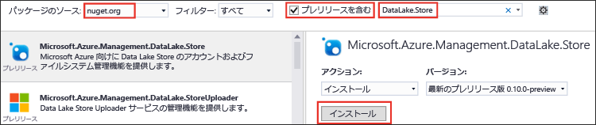

# .NET SDK で Data Lake Store の使用を開始する
> [!div class="op_single_selector"]
> * [ポータル](data-lake-store-get-started-portal.md)
> * [PowerShell](data-lake-store-get-started-powershell.md)
> * [.NET SDK](data-lake-store-get-started-net-sdk.md)
> * [Java SDK](data-lake-store-get-started-java-sdk.md)
> * [REST API](data-lake-store-get-started-rest-api.md)
> * [Azure CLI](data-lake-store-get-started-cli.md)
> * [Node.JS](data-lake-store-manage-use-nodejs.md)
> * [Python](data-lake-store-get-started-python.md)
>
> 

[Azure Data Lake Store .NET SDK](https://msdn.microsoft.com/library/mt581387.aspx) を使用して、フォルダーの作成、データ ファイルのアップロードとダウンロードなどの基本操作を実行する方法について説明します。Data Lake の詳細については、[Azure Data Lake Store](data-lake-store-overview.md) に関する記事をご覧ください。

## 前提条件
* **Visual Studio 2013、2015、2017**。 以下の手順では、Visual Studio 2015 Update 2 を使用します。

* **Azure サブスクリプション**。 [Azure 無料試用版の取得](https://azure.microsoft.com/pricing/free-trial/)に関するページを参照してください。

* **Azure Data Lake Store アカウント**。 アカウントを作成する手順については、「 [Azure Data Lake Store の使用を開始する](data-lake-store-get-started-portal.md)

* **Azure Active Directory アプリケーションを作成する**。 Azure AD アプリケーションを使用して、Azure AD で Data Lake Store アプリケーションを認証します。 Azure AD での認証方法には、**エンドユーザー認証**と**サービス間認証**があります。 認証方法の手順と詳しい情報については、「 [Authenticate with Data Lake Store using Azure Active Directory (Azure Active Directory を使用した Data Lake Store)](data-lake-store-authenticate-using-active-directory.md)」を参照してください。

## .NET アプリケーションの作成
1. Visual Studio を開き、コンソール アプリケーションを作成します。
2. **[ファイル]** メニューの **[新規作成]** をクリックし、**[プロジェクト]** をクリックします。
3. **[新しいプロジェクト]**で、次の値を入力するか、選択します。
   
   | プロパティ | 値 |
   | --- | --- |
   | カテゴリ |テンプレート/Visual C#/Windows |
   | テンプレート |コンソール アプリケーション |
   | 名前 |CreateADLApplication |
4. **[OK]** をクリックしてプロジェクトを作成します。
5. Nuget パッケージをプロジェクトに追加します。
   
   1. ソリューション エクスプローラーでプロジェクト名を右クリックし、 **[NuGet パッケージの管理]**をクリックします。
   2. **[Nuget パッケージ マネージャー]** タブで、**[パッケージ ソース]** が **nuget.org** に設定されており、**[プレリリースを含める]** チェック ボックスがオンになっていることを確認します。
   3. 以下の NuGet パッケージを検索してインストールします。
      
      * `Microsoft.Azure.Management.DataLake.Store` - このチュートリアルでは、v1.0.4 を使用します。
      * `Microsoft.Azure.Management.DataLake.StoreUploader` - このチュートリアルでは、v1.0.1-preview を使用します。
      * `Microsoft.Rest.ClientRuntime.Azure.Authentication` - このチュートリアルでは、v2.2.11 を使用します。
        
        
   4. **NuGet パッケージ マネージャー**を閉じます。
6. **Program.cs**を開き、既存のコードを削除し、次のステートメントに置き換えて、名前空間の参照を追加します。
   
        using System;
        using System.IO;
    using System.Security.Cryptography.X509Certificates; // Required only if you are using an Azure AD application created with certificates      using System.Threading;
   
        using Microsoft.Azure.Management.DataLake.Store;
    using Microsoft.Azure.Management.DataLake.Store.Models;  using Microsoft.Azure.Management.DataLake.StoreUploader;  using Microsoft.IdentityModel.Clients.ActiveDirectory;  using Microsoft.Rest.Azure.Authentication;

7. 以下のように変数を宣言し、既に存在する Data Lake Store 名とリソース グループ名の値を指定します。 また、ここで指定するローカル パスとファイル名は、コンピューターに存在している必要があります。 名前空間の宣言後に次のコード スニペットを追加します。
   
        namespace SdkSample
        {
            class Program
            {
                private static DataLakeStoreAccountManagementClient _adlsClient;
                private static DataLakeStoreFileSystemManagementClient _adlsFileSystemClient;
   
                private static string _adlsAccountName;
                private static string _resourceGroupName;
                private static string _location;
                private static string _subId;

                private static void Main(string[] args)
                {
                    _adlsAccountName = "<DATA-LAKE-STORE-NAME>"; // TODO: Replace this value with the name of your existing Data Lake Store account.
                    _resourceGroupName = "<RESOURCE-GROUP-NAME>"; // TODO: Replace this value with the name of the resource group containing your Data Lake Store account.
                    _location = "East US 2";
                    _subId = "<SUBSCRIPTION-ID>";

                    string localFolderPath = @"C:\local_path\"; // TODO: Make sure this exists and can be overwritten.
                    string localFilePath = Path.Combine(localFolderPath, "file.txt"); // TODO: Make sure this exists and can be overwritten.
                    string remoteFolderPath = "/data_lake_path/";
                    string remoteFilePath = Path.Combine(remoteFolderPath, "file.txt");
                }
            }
        }

記事の以降のセクションでは、認証、ファイルのアップロードなどの操作を実行する .NET メソッドの使用方法について説明します。

## 認証

### エンド ユーザー認証を使用している場合 (このチュートリアルではこちらを推奨)

既存の Azure AD ネイティブ アプリケーションでこれを使用して、アプリケーションを**対話的に**認証します。これは、Azure の資格情報を入力するよう求められることを意味します。 

使いやすくするために、次のスニペットでは、クライアント ID とリダイレクト URI について、すべての Azure サブスクリプションで有効な既定値を使用しています。 このチュートリアルは、できるだけ短時間で終了できるよう、このアプローチの使用を推奨しています。 次のスニペットでは、単にテナント ID の値を指定しています。 この値は、[Active Directory アプリケーションの作成](data-lake-store-end-user-authenticate-using-active-directory.md)に関するページの手順を使用して取得できます。

    // User login via interactive popup
    // Use the client ID of an existing AAD Web application.
    SynchronizationContext.SetSynchronizationContext(new SynchronizationContext());
    var tenant_id = "<AAD_tenant_id>"; // Replace this string with the user's Azure Active Directory tenant ID
    var nativeClientApp_clientId = "1950a258-227b-4e31-a9cf-717495945fc2";
    var activeDirectoryClientSettings = ActiveDirectoryClientSettings.UsePromptOnly(nativeClientApp_clientId, new Uri("urn:ietf:wg:oauth:2.0:oob"));
    var creds = UserTokenProvider.LoginWithPromptAsync(tenant_id, activeDirectoryClientSettings).Result;

このスニペットに関して、以下の&2; 点に留意してください。

* できるだけ短時間でチュートリアルを終了できるよう、このスニペットでは、すべての Azure サブスクリプションから既定で利用できる Azure AD ドメインとクライアント ID を使用しています。 そのため、**このスニペットを実際のアプリケーションで使用するときは、現状のままで使用**してください。
* ただし、独自の Azure AD ドメインとアプリケーション クライアント ID を使う必要がある場合は、Azure AD ネイティブ アプリケーションを作成したうえで、作成したアプリケーションの Azure AD テナント ID、クライアント ID、およびリダイレクト URI を使用する必要があります。 手順については、[Data Lake Store でのエンド ユーザー認証のための Active Directory アプリケーションの作成](data-lake-store-end-user-authenticate-using-active-directory.md)に関するページを参照してください。

### クライアント シークレットによるサービス間認証を使用している場合
次のスニペットは、アプリケーション/サービス プリンシパルのクライアント シークレット/キーを使用して、アプリケーションを**非対話的に**認証するために使用できます。 これは、既存の Azure AD "Web アプリ" アプリケーションと共に使用します。 Azure AD Web アプリケーションを作成する方法と、次のスニペットに必要なクライアント ID とクライアント シークレットを取得する方法については、[Data Lake Store でのサービス間認証のための Active Directory アプリケーションの作成](data-lake-store-authenticate-using-active-directory.md)に関するページを参照してください。

    // Service principal / appplication authentication with client secret / key
    // Use the client ID of an existing AAD "Web App" application.
    SynchronizationContext.SetSynchronizationContext(new SynchronizationContext());
    
    var domain = "<AAD-directory-domain>";
    var webApp_clientId = "<AAD-application-clientid>";
    var clientSecret = "<AAD-application-client-secret>";
    var clientCredential = new ClientCredential(webApp_clientId, clientSecret);
    var creds = await ApplicationTokenProvider.LoginSilentAsync(domain, clientCredential);

### 証明書によるサービス間認証を使用している場合
3 つ目のオプションとして、次のスニペットは、Azure Active Directory アプリケーション/サービス プリンシパルの証明書を使用して、アプリケーションを**非対話的に**認証するためにも使用できます。 これは、既存の [Azure AD アプリケーションと証明書](../azure-resource-manager/resource-group-authenticate-service-principal.md#create-service-principal-with-certificate)と共に使用します。

    // Service principal / application authentication with certificate
    // Use the client ID and certificate of an existing AAD "Web App" application.
    SynchronizationContext.SetSynchronizationContext(new SynchronizationContext());
    
    var domain = "<AAD-directory-domain>";
    var webApp_clientId = "<AAD-application-clientid>";
    var clientCert = <AAD-application-client-certificate>
    var clientAssertionCertificate = new ClientAssertionCertificate(webApp_clientId, clientCert);
    var creds = await ApplicationTokenProvider.LoginSilentWithCertificateAsync(domain, clientAssertionCertificate);

## クライアント オブジェクトを作成する
次のスニペットは、Data Lake Store アカウントとファイルシステム クライアント オブジェクトを作成します。これらは、サービスに要求を発行するために使用されます。

    // Create client objects and set the subscription ID
    _adlsClient = new DataLakeStoreAccountManagementClient(creds) { SubscriptionId = _subId };
    _adlsFileSystemClient = new DataLakeStoreFileSystemManagementClient(creds);

## サブスクリプション内のすべての Data Lake Store アカウントを一覧表示する
次のスニペットは、特定の Azure サブスクリプション内のすべての Data Lake Store アカウントを一覧表示します。

    // List all ADLS accounts within the subscription
    public static async Task<List<DataLakeStoreAccount>> ListAdlStoreAccounts()
    {
        var response = await _adlsClient.Account.ListAsync();
        var accounts = new List<DataLakeStoreAccount>(response);

        while (response.NextPageLink != null)
        {
            response = _adlsClient.Account.ListNext(response.NextPageLink);
            accounts.AddRange(response);
        }

        return accounts;
    }

## ディレクトリを作成する
次のスニペットは、Data Lake Store アカウント内にディレクトリを作成するために使用できる `CreateDirectory` メソッドの例です。

    // Create a directory
    public static async Task CreateDirectory(string path)
    {
        await _adlsFileSystemClient.FileSystem.MkdirsAsync(_adlsAccountName, path);
    }

## ファイルをアップロードする
次のスニペットは、Data Lake Store アカウントにファイルをアップロードするために使用できる `UploadFile` メソッドの例です。

    // Upload a file
    public static void UploadFile(string srcFilePath, string destFilePath, bool force = true)
    {
        var parameters = new UploadParameters(srcFilePath, destFilePath, _adlsAccountName, isOverwrite: force);
        var frontend = new DataLakeStoreFrontEndAdapter(_adlsAccountName, _adlsFileSystemClient);
        var uploader = new DataLakeStoreUploader(parameters, frontend);
        uploader.Execute();
    }

`DataLakeStoreUploader` では、ローカル ファイル パスと Data Lake Store ファイル パスの間の再帰的なアップロードとダウンロードがサポートされています。    

## ファイルまたはディレクトリの情報を取得する
次のスニペットは、Data Lake Store で使用できるファイルまたはディレクトリに関する情報を取得するために使用できる `GetItemInfo` メソッドの例です。 

    // Get file or directory info
    public static async Task<FileStatusProperties> GetItemInfo(string path)
    {
        return await _adlsFileSystemClient.FileSystem.GetFileStatusAsync(_adlsAccountName, path).FileStatus;
    }

## ファイルまたはディレクトリを一覧表示する
次のスニペットは、Data Lake Store アカウントのファイルとディレクトリを一覧表示するために使用できる `ListItem` メソッドの例です。

    // List files and directories
    public static List<FileStatusProperties> ListItems(string directoryPath)
    {
        return _adlsFileSystemClient.FileSystem.ListFileStatus(_adlsAccountName, directoryPath).FileStatuses.FileStatus.ToList();
    }

## ファイルを連結する
次のスニペットは、ファイルの連結に使用する `ConcatenateFiles` メソッドの例です。 

    // Concatenate files
    public static Task ConcatenateFiles(string[] srcFilePaths, string destFilePath)
    {
        await _adlsFileSystemClient.FileSystem.ConcatAsync(_adlsAccountName, destFilePath, srcFilePaths);
    }

## ファイルに追加する
次のスニペットは、Data Lake Store アカウントに既に格納されているファイルに、データを追加するために使用する `AppendToFile` メソッドの例です。

    // Append to file
    public static async Task AppendToFile(string path, string content)
    {
        using (var stream = new MemoryStream(Encoding.UTF8.GetBytes(content)))
        {
            await _adlsFileSystemClient.FileSystem.AppendAsync(_adlsAccountName, path, stream);
        }
    }

## ファイルをダウンロードする
次のスニペットは、Data Lake Store アカウントからファイルをダウンロードするために使用する `DownloadFile` メソッドの例です。

    // Download file
    public static async Task DownloadFile(string srcPath, string destPath)
    {
        using (var stream = await _adlsFileSystemClient.FileSystem.OpenAsync(_adlsAccountName, srcPath))
        using (var fileStream = new FileStream(destPath, FileMode.Create))
        {
            await stream.CopyToAsync(fileStream);
        }
    }

## 次のステップ
* [Data Lake Store のデータをセキュリティで保護する](data-lake-store-secure-data.md)
* [Data Lake Store で Azure Data Lake Analytics を使用する](../data-lake-analytics/data-lake-analytics-get-started-portal.md)
* [Data Lake Store で Azure HDInsight を使用する](data-lake-store-hdinsight-hadoop-use-portal.md)
* [Data Lake Store .NET SDK リファレンス](https://msdn.microsoft.com/library/mt581387.aspx)
* [Data Lake Store REST リファレンス](https://msdn.microsoft.com/library/mt693424.aspx)

