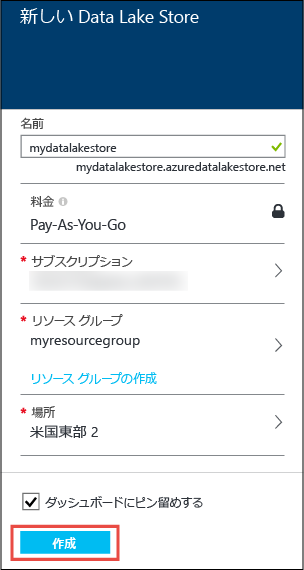
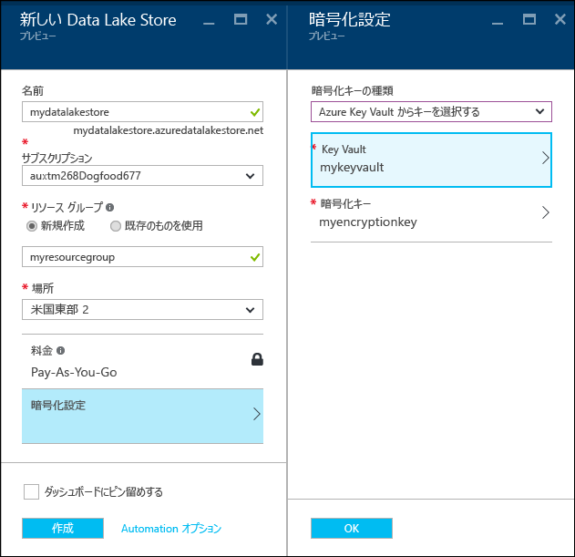
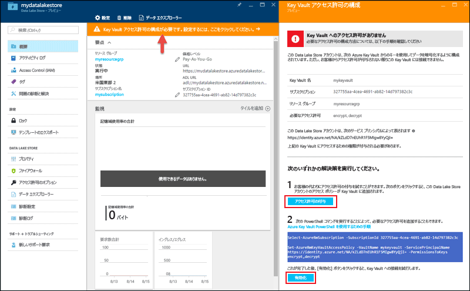
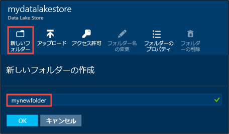
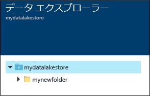
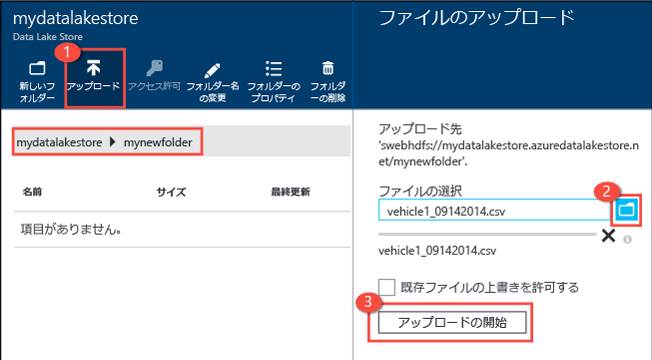
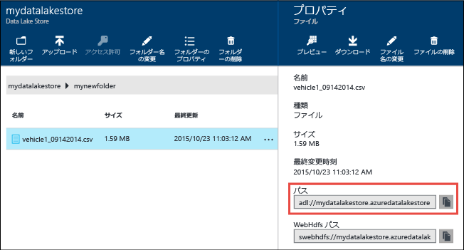
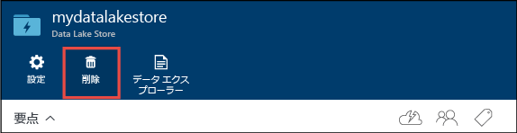

# Azure Portal で Azure Data Lake Storage Gen1 の使用を開始する

> [!div class="op_single_selector"]
> * [ポータル](data-lake-store-get-started-portal.md)
> * [PowerShell](data-lake-store-get-started-powershell.md)
> * [Azure CLI 2.0](data-lake-store-get-started-cli-2.0.md)
>
> 

[!INCLUDE [data-lake-storage-gen1-rename-note.md](../../includes/data-lake-storage-gen1-rename-note.md)]

Azure Portal を使用して、Azure Data Lake Store アカウントを作成し、フォルダーの作成、データ ファイルのアップロードとダウンロード、アカウントの削除などの基本操作を行う方法について説明します。詳しくは、「[Azure Data Lake Storage Gen1 の概要](data-lake-store-overview.md)」をご覧ください。

## 前提条件
このチュートリアルを開始する前に、次の項目を用意する必要があります。

* **Azure サブスクリプション**。 [Azure 無料試用版の取得](https://azure.microsoft.com/pricing/free-trial/)に関するページを参照してください。

## Azure Data Lake Store アカウントを作成する

1. 新しい [Azure Portal](https://portal.azure.com) にサインオンします。
2. **[リソースの作成]、[ストレージ]、[Data Lake Store]** の順にクリックします。
3. **[新しい Data Lake Store]** ブレードで、次のスクリーンショットに示されているように値を指定します。
   
    
   
   * **名前**。 Data Lake Store アカウントの一意の名前を入力します。
   * **サブスクリプション**。 新しい Data Lake Store アカウントを作成するサブスクリプションを選択します。
   * **リソース グループ**。 既存のリソース グループを選択するか、**[新規作成]** をクリックしてリソース グループを作成します。 リソース グループは、1 つのアプリケーションの関連リソースを保持するコンテナーです。 詳細については、[Azure のリソース グループ](../azure-resource-manager/resource-group-overview.md#resource-groups)に関する記事をご覧ください。
   * **[場所]**: Data Lake Store アカウントを作成する場所を選択します。
   * **暗号化設定**。 次の 3 つのオプションがあります。
     
     * **暗号化を有効にしない**。
     * **Data Lake Store で管理されるキーを使用する**。  Azure Data Lake Store に暗号化キーを管理させる場合。
     * **独自のキー コンテナーのキーを使用する**。 既存の Azure Key Vault を選択するか、新しい Key Vault を作成することができます。 Key Vault のキーを使用するには、Azure Key Vault にアクセスするために、Azure Data Lake Store アカウントのアクセス許可を割り当てる必要があります。 手順については、「[Azure Key Vault にアクセス許可を割り当てる](#assign-permissions-to-azure-key-vault)」を参照してください。
       
        
       
        **[暗号化設定]** ブレードで **[OK]** をクリックします。

        詳細については、「[Azure Data Lake Store でのデータの暗号化](./data-lake-store-encryption.md)」を参照してください。

4. **Create** をクリックしてください。 アカウントをダッシュボードにピン留めすることを選択した場合、ダッシュボードに戻ると、Data Lake Store アカウントのプロビジョニングの進行状況を確認できます。 Data Lake Store アカウントのプロビジョニングが完了すると、アカウントのブレードが表示されます。

## Azure Key Vault にアクセス許可を割り当てる
Azure Key Vault のキーを使用して Data Lake Store アカウントの暗号化を構成した場合は、Data Lake Store アカウントと Azure Key Vault アカウントの間でアクセスを構成する必要があります。 そのためには、次の手順を実行します。

1. Azure Key Vault のキーを使用している場合、Data Lake Store アカウントのブレードの上部に警告が表示されます。 警告をクリックして **[暗号化]** を開きます。
   
    
2. ブレードには、アクセスを構成する 2 つのオプションが表示されます。

    
   
   * 最初のオプションでは、**[アクセス許可の付与]** をクリックしてアクセスを構成します。 最初のオプションは、Data Lake Store アカウントを作成したユーザーが Azure Key Vault の管理者でもある場合にのみ有効になります。
   * もう 1 つのオプションでは、ブレードに表示されている PowerShell コマンドレットを実行します。 この場合、Azure Key Vault の所有者であるか、Azure Key Vault に対するアクセス許可を付与できる必要があります。 コマンドレットを実行したら、ブレードに戻り、**[有効にする]** をクリックしてアクセスを構成します。

> [!NOTE]
> Azure Resource Manager テンプレートを使用して、Data Lake Store アカウントを作成することもできます。 以下のテンプレートは、[Azure クイック スタート テンプレート](https://azure.microsoft.com/resources/templates/?term=data+lake+store)からアクセスすることができます。
    - データ暗号化なし: [Deploy Azure Data Lake Store account with no data encryption (Azure Data Lake Store アカウントをデータ暗号化なしでデプロイする)](https://azure.microsoft.com/resources/templates/101-data-lake-store-no-encryption/)。
    - Data Lake Store を使用したデータ暗号化付きで: [Deploy Data Lake Store account with encryption(Data Lake) (暗号化 (Data Lake) 付きで Data Lake Store アカウントをデプロイする)](https://azure.microsoft.com/resources/templates/101-data-lake-store-encryption-adls/)。
    - Azure Key Vault を使用したデータ暗号化付きで: [Deploy Data Lake Store account with encryption(Key Vault) (暗号化 (Key Vault) 付きで Data Lake Store アカウントをデプロイする)](https://azure.microsoft.com/resources/templates/101-data-lake-store-encryption-key-vault/)。
> 
> 

## Azure Data Lake Store アカウントにフォルダーを作成する
Data Lake Store アカウントにフォルダーを作成し、データの管理と保存を行うことができます。

1. 作成した Data Lake Store アカウントを開きます。 左側のウィンドウで **[すべてのリソース]** をクリックし、[すべてのリソース] ブレードで、フォルダーの作成先となるアカウント名をクリックします。 スタート画面にアカウントをピン留めした場合は、そのアカウントのタイルをクリックします。
2. Data Lake Store アカウントのブレードで、 **[データ エクスプローラー]** をクリックします。
   
    
3. [データ エクスプローラー] ブレードで、**[新しいフォルダー]** をクリックし、新しいフォルダーの名前を入力して、**[OK]** をクリックします。
   
    
   
    新しく作成されたフォルダーが **[データ エクスプローラー]** ブレードに表示されます。 レベルに上限なく入れ子になったフォルダーを作成できます。
   
    

## Azure Data Lake Store アカウントにデータをアップロードする
データは、Azure Data Lake Store アカウントのルート レベルに直接をアップロードすることも、アカウント内に作成したフォルダーにアップロードすることもできます。 

1. **[データ エクスプローラー]** ブレードで、**[アップロード]** をクリックします。 
2. **[ファイルのアップロード]** ブレードで、アップロードするファイルに移動し、**[選択されたファイルを追加します]** をクリックします。 複数のファイルを選択してアップロードすることもできます。

    

アップロードするいくつかのサンプル データを探している場合は、 **Azure Data Lake Git リポジトリ** から [Ambulance Data](https://github.com/MicrosoftBigData/usql/tree/master/Examples/Samples/Data/AmbulanceData)フォルダーを取得できます。

## 保存データに対して実行できるアクション
ファイルに対応する省略記号アイコンをクリックします。ポップアップ メニューで、データに対して実行するアクションをクリックします。

 

## データのセキュリティ保護
Azure Data Lake Store アカウントに保存したデータは、Azure Active Directory とアクセス制御 (ACL) を使用してセキュリティで保護することができます。 その方法の詳細については、「 [Azure Data Lake Store でのデータのセキュリティ保護](data-lake-store-secure-data.md)」を参照してください。

## Azure Data Lake Store アカウントの削除
Azure Data Lake Store アカウントを削除するには、Data Lake Store ブレードで **[削除]** をクリックします。 この操作を確認するために、削除するアカウントの名前を入力するよう求められます。 アカウントの名前を入力し、 **[削除]** をクリックします。

## 次の手順
* [ビッグ データの要件に対する Azure Data Lake Store の使用](data-lake-store-data-scenarios.md) 
* [Data Lake Store のデータをセキュリティで保護する](data-lake-store-secure-data.md)
* [Data Lake Store で Azure Data Lake Analytics を使用する](../data-lake-analytics/data-lake-analytics-get-started-portal.md)
* [Data Lake Store で Azure HDInsight を使用する](data-lake-store-hdinsight-hadoop-use-portal.md)

