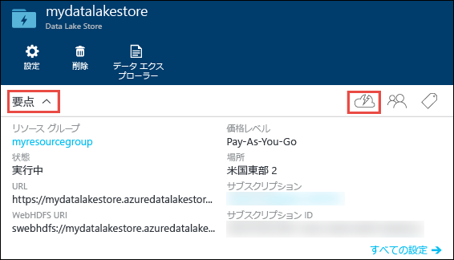
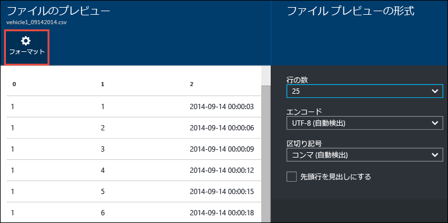

<properties 
   pageTitle="Data Lake Store の使用 | Azure" 
   description="ポータルを使用して、Data Lake Store アカウントを作成し、Data Lake Store で基本的な操作を実行します" 
   services="data-lake-store" 
   documentationCenter="" 
   authors="nitinme" 
   manager="jhubbard" 
   editor="cgronlun"/>
 
<tags
   ms.service="data-lake-store"
   ms.devlang="na"
   ms.topic="hero-article"
   ms.tgt_pltfrm="na"
   ms.workload="big-data" 
   ms.date="09/13/2016"
   ms.author="nitinme"/>

# Azure ポータルで Azure Data Lake Store の使用を開始する

> [AZURE.SELECTOR]
- [ポータル](data-lake-store-get-started-portal.md)
- [PowerShell](data-lake-store-get-started-powershell.md)
- [.NET SDK](data-lake-store-get-started-net-sdk.md)
- [Java SDK](data-lake-store-get-started-java-sdk.md)
- [REST API](data-lake-store-get-started-rest-api.md)
- [Azure CLI](data-lake-store-get-started-cli.md)
- [Node.JS](data-lake-store-manage-use-nodejs.md)

Azure ポータルを使用して、Azure Data Lake Store アカウントを作成し、フォルダーの作成、データ ファイルのアップロードとダウンロード、アカウントの削除などの基本操作を行う方法について説明します。Data Lake Store の詳細については、「[Azure Data Lake Store の概要](data-lake-store-overview.md)」を参照してください。

## 前提条件

このチュートリアルを読み始める前に、次の項目を用意する必要があります。

- **Azure サブスクリプション**。[Azure 無料試用版の取得](https://azure.microsoft.com/pricing/free-trial/)に関するページを参照してください。

## ビデオで速習する

Data Lake Store の基本操作については以下のビデオをご覧ください。

* [Data Lake Store アカウントを作成する](https://mix.office.com/watch/1k1cycy4l4gen)
* [データ エクスプローラーで Data Lake Store のデータを管理する](https://mix.office.com/watch/icletrxrh6pc)

## Azure Data Lake Store アカウントを作成する

1. 新しい [Azure ポータル](https://portal.azure.com)にサインオンします。

2. **[新規]**、**[データ + ストレージ]**、**[Azure Data Lake Store]** の順にクリックします。**[Azure Data Lake Store]** ブレードに表示された情報を確認し、ブレードの左下隅にある **[作成]** をクリックします。

3. **[新しい Data Lake Store]** ブレードで、次の画面キャプチャに示すように値を指定します。

	

	- **サブスクリプション**。新しい Data Lake Store アカウントを作成するサブスクリプションを選択します。
	- **[リソース グループ]**:既存のリソース グループを選択するか、**[リソース グループの作成]** をクリックしてリソース グループを作成します。リソース グループは、1 つのアプリケーションの関連リソースを保持するコンテナーです。詳細については、[Azure のリソース グループ](resource-group-overview.md#resource-groups)に関する記述を参照してください。
	- **[場所]**: Data Lake Store アカウントを作成する場所を選択します。

4. Data Lake Store アカウントにスタート画面からアクセスできるようにする場合は、**[スタート画面にピン留めする]** を選択します。

5. **[作成]** をクリックします。アカウントをスタート画面にピン留めした場合は、スタート画面に戻ると、Data Lake Store アカウントのプロビジョニングの進行状況を確認できます。Data Lake Store アカウントのプロビジョニングが完了すると、アカウントのブレードが表示されます。

6. **[要点]** ボックスの一覧を展開し、Data Lake Store アカウントに関する情報 (属しているリソース グループや場所など) を確認します。**[クイック スタート]** アイコンをクリックすると、Data Lake Store に関連するその他のリソースへのリンクが表示されます。

	

## Azure Data Lake Store アカウントにフォルダーを作成する

Data Lake Store アカウントにフォルダーを作成し、データの管理と保存を行うことができます。

1. 先ほど作成した Data Lake Store アカウントを開きます。左側のウィンドウで、**[参照]**、**[Data Lake Store]** の順にクリックし、[Data Lake Store] ブレードで、フォルダーを作成するアカウント名をクリックします。スタート画面にアカウントをピン留めした場合は、そのアカウントのタイルをクリックします。

2. Data Lake Store アカウントのブレードで、**[データ エクスプローラー]** をクリックします。

	

3. Data Lake Store アカウントのブレードで、**[新しいフォルダー]** をクリックし、新しいフォルダーの名前を入力して、**[OK]** をクリックします。
	
	
	
	新しく作成されたフォルダーが **[データ エクスプローラー]** ブレードに表示されます。レベルに上限なく入れ子になったフォルダーを作成できます。

	

## Azure Data Lake Store アカウントにデータをアップロードする

データは、Azure Data Lake Store アカウントのルート レベルに直接をアップロードすることも、アカウント内に作成したフォルダーにアップロードすることもできます。次の画面キャプチャでは、**[データ エクスプローラー]** ブレードからサブフォルダーにファイルをアップロードする手順を示しています。この画面キャプチャの場合、ファイルは、階層リンクで示されているサブフォルダー (赤色の四角形で示されています) にアップロードされます。

アップロードするいくつかのサンプル データを探している場合は、[Azure Data Lake Git リポジトリ](https://github.com/MicrosoftBigData/usql/tree/master/Examples/Samples/Data/AmbulanceData)から **Ambulance Data** フォルダーを取得できます。

## 保存データに対して使用できるプロパティと操作

新しく追加したファイルをクリックし、**[プロパティ]** ブレードを開きます。このブレードでは、そのファイルに関連付けられたプロパティと、そのファイルに対して実行できる操作を利用できます。また、次の画面キャプチャで赤い四角形で強調表示されている、Azure Data Lake Store アカウント内のファイルへの完全なパスをコピーすることもできます。

* **[プレビュー]** をクリックすると、ブラウザーから直接、ファイルのプレビューが表示されます。プレビューの形式を指定することもできます。**[プレビュー]** をクリックし、**[ファイルのプレビュー]** ブレードの **[形式]** をクリックします。**[ファイルのプレビュー形式]** ブレードで、表示する行数、使用するエンコード、使用する区切り記号などのオプションを指定します。

  

* ファイルをコンピューターにダウンロードするには、**[ダウンロード]** をクリックします。

* ファイルの名前を変更するには、**[ファイル名の変更]** をクリックします。

* ファイルを削除するには、**[ファイルの削除]** をクリックします。

## データのセキュリティ保護

Azure Data Lake Store アカウントに保存したデータは、Azure Active Directory とアクセス制御 (ACL) を使用してセキュリティで保護することができます。その方法の詳細については、「[Azure Data Lake Store でのデータのセキュリティ保護](data-lake-store-secure-data.md)」を参照してください。

## Azure Data Lake Store アカウントの削除

Azure Data Lake Store アカウントを削除するには、Data Lake Store ブレードで **[削除]** をクリックします。この操作を確認するために、削除するアカウントの名前を入力するよう求められます。アカウントの名前を入力し、**[削除]** をクリックします。

## 次のステップ

- [Data Lake Store のデータをセキュリティで保護する](data-lake-store-secure-data.md)
- [Data Lake Store で Azure Data Lake Analytics を使用する](../data-lake-analytics/data-lake-analytics-get-started-portal.md)
- [Data Lake Store で Azure HDInsight を使用する](data-lake-store-hdinsight-hadoop-use-portal.md)
- [Data Lake Store の診断ログへのアクセス](data-lake-store-diagnostic-logs.md)

<!-------HONumber=AcomDC_0914_2016-->