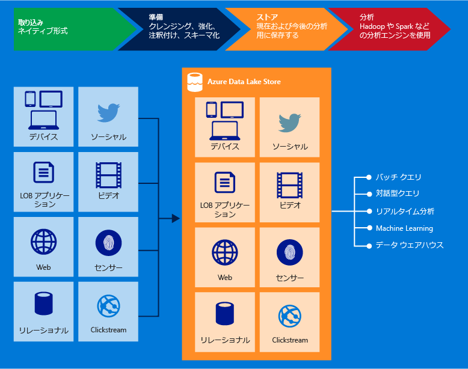

# Azure Data Lake Storage Gen1 とは

[!INCLUDE [data-lake-storage-gen1-rename-note.md](../../includes/data-lake-storage-gen1-rename-note.md)]

Azure Data Lake Storage Gen1 は、ビッグ データの分析ワークロードに対応するエンタープライズ レベルのハイパースケール リポジトリです。 Azure Data Lake を使用すると、運用分析や調査分析を目的として任意のサイズ、種類、および取り込み速度のデータを 1 か所でキャプチャすることができます。

Data Lake Storage Gen1 には、Hadoop (HDInsight クラスターで使用可能) から、WebHDFS と互換性のある REST API を使用してアクセスできます。 これは、格納されたデータに対する分析を可能にするように設計されており、データ分析シナリオ用にパフォーマンスがチューニングされます。 Data Lake Storage Gen1 には、エンタープライズ レベルのすべての機能 (セキュリティ、管理の容易性、スケーラビリティ、信頼性、および可用性) が組み込まれています。

## 主な機能

Data Lake Storage Gen1 の主要な機能のいくつかを以下に示します。

### Hadoop 用に構築

Data Lake Storage Gen1 は、Hadoop 分散ファイル システム (HDFS) と互換性のある Apache Hadoop ファイル システムであり、Hadoop エコシステムと連動します。 WebHDFS API を使用する既存の HDInsight アプリケーションまたはサービスは、Data Lake Storage Gen1 と簡単に統合することができます。 Data Lake Storage Gen1 では、アプリケーション向けの WebHDFS と互換性のある REST インターフェイスも公開されています。

Data Lake Storage Gen1 に格納されたデータは、MapReduce や Hive などの Hadoop 分析フレームワークを使用して簡単に分析することができます。 Data Lake Storage Gen1 に格納されたデータに直接アクセスするように Azure HDInsight クラスターをプロビジョニングおよび構成することができます。

### 無制限のストレージ、ペタバイト ファイル

Data Lake Storage Gen1 では無制限のストレージが提供されます。そのため、分析を目的としてさまざまなデータを格納することができます。 Data Lake に格納できるアカウント サイズ、ファイル サイズ、またはデータ量に関する制限は設定されていません。 対応可能な個々のファイルのサイズはキロバイトからペタバイトの範囲にわたります。 データは複数のコピーを作成して格納されるため、障害が発生しても保護されます。 Data Lake でのデータの格納期間に制限はありません。

### ビッグ データを分析するためのパフォーマンス チューニング

Data Lake Storage Gen1 は、大量のデータのクエリと分析のために非常に高いスループットを必要とする、大規模な分析システムを実行するために構築されています。 Data Lake では、ファイル内のデータを複数の異なる記憶域サーバーに分散します。 これにより、ファイルを並列に読み取ってデータ分析を実行する場合の読み取りスループットが向上します。

### エンタープライズ対応: 高可用性およびセキュリティ

Data Lake Storage Gen1 では、業界標準の可用性と信頼性が提供されます。 データ資産は、冗長なコピーを作成して格納されるので、予期せぬ障害が発生しても保護されます。

Data Lake Storage Gen1 では、格納されたデータに対してエンタープライズ レベルのセキュリティも提供されます。 詳細については、[Azure Data Lake Storage Gen1 内のデータのセキュリティ保護](#DataLakeStoreSecurity)に関するページを参照してください。

### すべてのデータ

Data Lake Storage Gen1 では、任意のデータをネイティブ形式で格納することができ、事前の変換は不要です。 Azure Data Lake Storage Gen1 では、データが読み込まれる前にスキーマを定義する必要はなく、分析時にデータを解釈してスキーマを定義するかどうかは個々の分析フレームワークに任されます。 任意のサイズおよび形式のファイルを格納できるようにすると、Data Lake Storage Gen1 で構造化データ、半構造化データ、および非構造化データを処理できるようになります。

Data Lake Storage Gen1 のデータ コンテナーは、本質的にはフォルダーとファイルです。 格納されたデータを SDK、Azure portal、および Azure PowerShell を使用して操作します。 これらのインターフェイスと適切なコンテナーを使用してストアにデータを配置すれば、あらゆる種類のデータを格納できます。 Data Lake Storage Gen1 では、格納されているデータの種類に基づくデータの特別な処理は行われません。

## データのセキュリティ保護

Data Lake Storage Gen1 では、Azure Active Directory (Azure AD) を使用し、認証およびアクセス制御リスト (ACL) によってデータへのアクセスを管理します。

| 機能 | 説明 |
| --- | --- |
| Authentication |Data Lake Storage Gen1 では、Azure AD と統合することで、Data Lake Storage Gen1 に格納されたすべてのデータの ID およびアクセスの管理を行います。 この統合により、Data Lake Storage Gen1 では、Azure AD のすべての機能 (多要素認証、条件付きアクセス、ロールベースのアクセス制御、アプリケーション使用状況の監視、セキュリティの監視とアラート通知など) の利点が得られます。 Data Lake Storage Gen1 では、REST インターフェイスでの認証に対応する OAuth 2.0 プロトコルがサポートされます。 [Data Lake Storage Gen1 の認証](data-lakes-store-authentication-using-azure-active-directory.md)に関するページを参照してください。|
| アクセス制御 |Data Lake Storage Gen1 では、WebHDFS プロトコルで公開された POSIX 形式のアクセス許可をサポートすることにより、アクセス制御が提供されます。 ルート フォルダー、サブフォルダー、個々のファイルで ACL を有効にすることができます。 Data Lake Storage Gen1 のコンテキストにおける ACL のしくみの詳細については、[Data Lake Storage Gen1 でのアクセス制御](data-lake-store-access-control.md)に関するページを参照してください。 |
| 暗号化 |Data Lake Storage Gen1 では、アカウントに格納されているデータを暗号化することもできます。 暗号化設定は、Data Lake Storage Gen1 アカウントの作成時に指定します。 データを暗号化するかどうかを選択できます。 詳細については、[Data Lake Storage Gen1 での暗号化](data-lake-store-encryption.md)に関するページを参照してください。 暗号化関連の構成を提供する方法については、[Azure portal で Data Lake Storage Gen1 の使用を開始する方法](data-lake-store-get-started-portal.md)に関するページを参照してください。 |

Data Lake Storage Gen1 内のデータをセキュリティで保護する方法については、[Azure Data Lake Storage Gen1 内のデータのセキュリティ保護](data-lake-store-secure-data.md)に関するページを参照してください。

## アプリケーションの互換性

Data Lake Storage Gen1 は、Hadoop エコシステム内のほとんどのオープンソース コンポーネントと互換性があります。 他の Azure サービスとも連携します。 オープンソース コンポーネントや他の Azure サービスで Data Lake Storage Gen1 を使用する方法の詳細については、次のリンクを使用してください。

- Data Lake Storage Gen1 と相互運用可能なオープンソース アプリケーションの一覧については、[Azure Data Lake Storage Gen1 と互換性のあるアプリケーションおよびサービス](data-lake-store-compatible-oss-other-applications.md)に関するページを参照してください。
- Data Lake Storage Gen1 を他の Azure サービスと共に使用して広範なシナリオを有効にする方法については、[他の Azure サービスとの統合](data-lake-store-integrate-with-other-services.md)に関するページを参照してください。
- データの取り込み、処理、ダウンロード、視覚化などのシナリオにおける Data Lake Storage Gen1 の使い方については、[Data Lake Storage Gen1 の使用に関するシナリオ](data-lake-store-data-scenarios.md)についてのページを参照してください。

## Data Lake Storage Gen1 ファイル システム

Hadoop 環境 (HDInsight クラスターで使用可能) では、ファイル システムである AzureDataLakeFilesystem (adl://) 経由で Data Lake Storage Gen1 にアクセスできます。 adl:// を使用するアプリケーションとサービスでは、WebHDFS で現在まだサポートされていない、より有効なパフォーマンスの最適化を利用できるようになります。 結果として、Data Lake Storage Gen1 では、adl:// を使用する推奨オプションで最適なパフォーマンスを利用することも、引き続き WebHDFS API を直接使用することにより既存のコードを維持することもできるという柔軟性が得られます。 Azure HDInsight は、AzureDataLakeFilesystem をフルに活用して Data Lake Storage Gen1 で最適なパフォーマンスを実現します。

Data Lake Storage Gen1 内のデータには、`adl://<data_lake_storage_gen1_name>.azuredatalakestore.net` を使用してアクセスすることができます。 Data Lake Storage Gen1 内のデータへのアクセス方法の詳細については、[格納データのプロパティの表示](data-lake-store-get-started-portal.md#properties)に関する記述を参照してください。

## 次の手順

- [Azure portal で Data Lake Storage Gen1 の使用を開始する](data-lake-store-get-started-portal.md)
- [.NET SDK で Data Lake Storage Gen1 の使用を開始する](data-lake-store-get-started-net-sdk.md)
- [Data Lake Storage Gen1 で Azure HDInsight を使用する](data-lake-store-hdinsight-hadoop-use-portal.md)