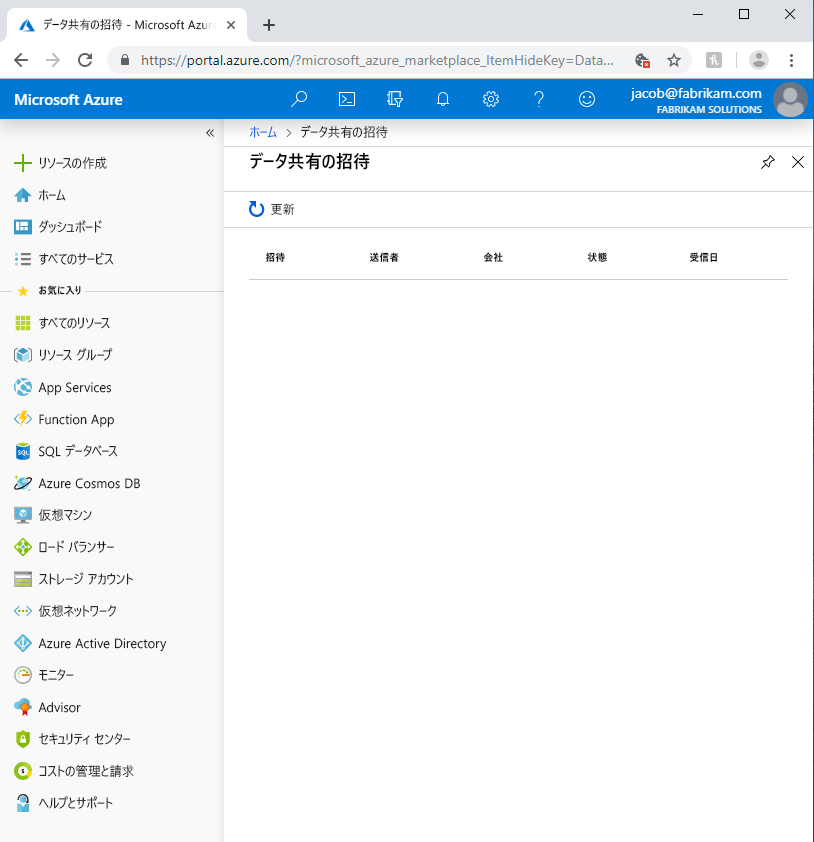
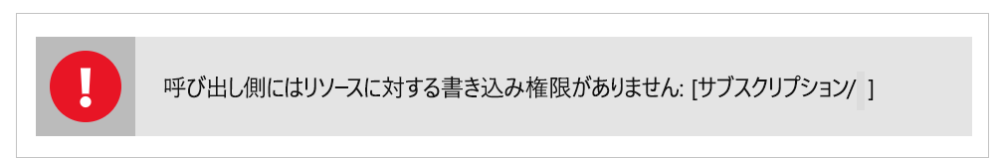

# Azure Data Share プレビューでの一般的な問題のトラブルシューティング

この記事では、Azure Data Share プレビューの一般的な問題のトラブルシューティングを行う方法を示します。 

## Azure Data Share の招待 

場合によっては、新しいユーザーが送信されたメール招待状の **[Accept Invitation]\(招待を承諾する\)** をクリックしたときに、空の招待リストが表示されることがあります。 

上のエラーはサービスに関する既知の問題であり、現在対処中です。 回避策としては、次の手順のようにします。 

1. Azure portal で、 **[サブスクリプション]** に移動します。
1. Azure Data Share に使っているサブスクリプションを選択します
1. **[リソース プロバイダー]** をクリックします
1. Microsoft.DataShare を検索します
1. **[登録]** をクリックします。

これらの手順を完了するには、[Azure 共同作成者 RBAC ロール](https://docs.microsoft.com/azure/role-based-access-control/built-in-roles#contributor)を持っている必要があります。 

> [!IMPORTANT]
> 既に Azure Data Share の招待を承諾した後で、ストレージを構成する前にサービスを終了した場合は、[データセットのマッピングの構成](how-to-configure-mapping.md)に関するハウツー ガイドで詳しく説明されている手順に従って、受け取ったデータ共有の構成を完了し、データの受信を開始する方法を学習してください。 

## 新しいデータ共有を作成または受信するときのエラー

"エラー: Operation returned an invalid status code 'BadRequest'" (操作で、無効な状態コード 'BadRequest' が返されました)

"エラー: AuthorizationFailed"

"エラー: role assignment to storage account" (ストレージ アカウントへのロールの割り当て)

新しいデータ共有を作成するとき、または新しいデータ共有を受け取ったときに、上のいずれかのエラーが発生する場合は、ストレージ アカウントに対する十分なアクセス許可がないためです。 必要なアクションは "*Microsoft.Authorization/ロール割り当て/書き込み*" です。これは、ストレージ所有者ロールに存在しており、カスタム ロールに割り当てることもできます。 自分で作成したストレージ アカウントの場合でも、自分がそのストレージ アカウントの所有者に自動的になることはありません。 次の手順に従って、自分自身にストレージ アカウントの所有者を許可します。 または、このアクセス権を持つカスタム ロールを作成し、それに自分自身を追加することもできます。  

1. Azure portal でストレージ アカウントに移動します
1. **[アクセス制御 (IAM)]** を選択します
1. **[追加]** をクリックします。
1. ストレージ BLOB データ所有者として自分自身を追加します

## 次の手順

データの共有を始める方法については、[データの共有](share-your-data.md)に関するチュートリアルをご覧ください。

