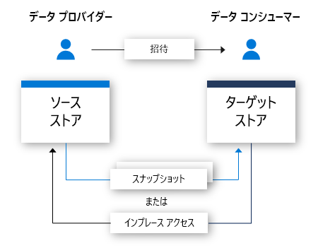

# Azure Data Share プレビューとは

今日の世界では、データは、多くの組織が簡単かつ安全に顧客やパートナーと共有する必要がある重要な戦略的資産と見られています。 現在お客様がこれを行うには、FTP、メール、API をはじめとして、多くの方法があります。 組織では、データを誰と共有したのかわからなくなることがよくあります。 データを共有するのに、FTP や、独自の API インフラストラクチャを利用すると、プロビジョニングと管理に多くのコストがかかることがよくあります。 これらの共有方法を大規模に使うと、管理オーバーヘッドが伴います。 

多くの組織では、共有するデータについて説明責任を負う必要があります。 説明責任だけでなく、多くの組織では、すべてのデータ共有を簡単な方法で制御、管理、監視できる必要があります。 今日のようにデータが急激に増加し続けることが予想される場合、組織にはビッグ データを共有するための簡単な方法が必要です。 お客様は、タイムリーな分析情報を得ることができるように、最新のデータを望んでいます。

組織では、Azure Data Share プレビューを利用することで、複数の顧客やパートナーとデータを簡単かつ安全に共有することができます。 ほんの数回のクリックで、新しい Data Share アカウントをプロビジョニングし、データセットを追加し、データ共有に顧客やパートナーを招待することができます。 データ プロバイダーは、共有するデータを常に制御しています。 Azure Data Share を使うと、どのようなデータが、いつ、誰と共有されたかを簡単に管理および監視できます。 

データ プロバイダーは、データ共有の使用条件を指定することで、データの処理方法の制御を維持できます。 データ コンシューマーは、データを受け取る前に、これらの条件に同意する必要があります。 データ プロバイダーは、データ コンシューマーが更新を受け取る頻度を指定できます。 データ プロバイダーは、新しい更新へのアクセスをいつでも取り消すことができます。 

Azure Data Share を使うと、サードパーティからのデータを簡単に結合して分析と AI のシナリオを補強できるようになり、分析情報の強化に役立ちます。 Azure の分析ツールの機能を簡単に利用して、Azure Data Share を使って共有されるデータを準備、処理、分析できます。 

## Azure Data Share のシナリオ

Azure Data Share はさまざまな業界で使用できます。 たとえば、小売業者はサプライヤーと最新の販売時点データを共有したい場合があります。 Azure Data Share を使うと、小売業者はすべてのサプライヤーに対する販売時点データを含むデータ共有を設定し、1 時間または 1 日ごとに売上を共有することができます。 

また、Azure Data Share を使うと、特定の業界に関するデータ マーケットプレースを確立できます。 たとえば、定期的に人口増加に関する匿名化されたデータをサードパーティと共有する政府機関や研究機関などです。 

Azure Data Share のもう 1 つのユース ケースは、データ コンソーシアムの確立です。 たとえば、複数の異なる研究機関が、1 つの信頼できる団体とデータを共有できます。 データは、Azure の分析ツールを使って分析または集計された後、関心のあるパーティと共有されます。 

## 動作のしくみ

Azure Data Share で使われているスナップショット ベースの共有アプローチでは、データはデータ プロバイダーの Azure サブスクリプションからデータ コンシューマーの Azure サブスクリプションに移動されます。 データ プロバイダーは、データ共有をプロビジョニングして、受信者をデータ共有に招待します。 データ コンシューマーは、メールでデータ共有への招待を受け取ります。 データ コンシューマーは、招待を受け入れると、共有されたデータの完全なスナップショットをトリガーできます。 このデータは、データ コンシューマーのストレージ アカウントに送られます。 データ コンシューマーは、共有されているデータの増分更新を定期的に受け取って、常にデータの最新バージョンを保持できます。 

データ プロバイダーは、スナップショットのスケジュールにより、共有しているデータの増分更新をデータ コンシューマーに提供できます。 スナップショットのスケジュールは、時間単位または日単位で提供されます。 データ コンシューマーは、データ共有を受け入れて構成すると、スナップショットのスケジュールをサブスクライブできます。 これは、共有データが定期的に更新され、データ コンシューマーが最新のデータを必要とするシナリオにおいて有益です。 

データ コンシューマーは、データ共有を受け入れると、自分で選択したストレージ アカウントでデータを受け取ることができます。 たとえば、データ プロバイダーが Azure Blob Storage を使ってデータを共有している場合、データ コンシューマーは Azure Data Lake Store でこのデータを受け取ることができます。 

## 主な機能

データ プロバイダーは Azure Data Share で次のことができます。

* Azure Storage および Azure Data Lake Store のデータを、組織の外部の顧客やパートナーと共有します

* データを誰と共有しているかを追跡します

* どのくらいの頻度でデータ コンシューマーがデータの更新を受け取るか

* 顧客が必要に応じて最新バージョンのデータをプルしたり、定義された間隔でデータの増分変更を自動的に受け取ったりできるようにします

データ コンシューマーは Azure Data Share で次のことができます。 

* 共有されているデータの種類の説明を表示します

* データの使用条件を表示します

* Azure Data Share の招待を承諾または拒否します

* 組織から共有されている Data Share の完全または増分スナップショットをトリガーします

* Data Share をサブスクライブし、増分スナップショット コピーによってデータの最新のコピーを受け取ります

* 共有されたデータを Azure Blob Storage または Azure Data Lake Gen2 アカウントに受け入れます

上記のすべての主要機能は、Azure または REST API によってサポートされます。 REST API での Azure Data Share の使用に関して詳しくは、リファレンス ドキュメントをご覧ください。 

## セキュリティ

Azure Data Share では、保存時と転送中のデータを保護するために Azure によって提供される基盤のセキュリティが利用されます。 データは保存時に暗号化され、基になるストレージ メカニズムでサポートされます。 データは転送中も暗号化されます。 データ共有に関するメタデータも、保存時と転送中に暗号化されます。 

Azure Data Share のリソース レベルでアクセス制御を設定し、承認されたユーザーだけによってアクセスされることを保証できます。 

Azure Data Share では、Azure Active Directory での自動 ID 管理用に、Azure リソースのマネージド ID (旧称 MSI) を利用します。 Azure リソースのマネージド ID は、データ共有に使われているストレージ アカウントにアクセスするために利用されます。 データ プロバイダーとデータ コンシューマーの間で資格情報が交換されることはありません。 詳しくは、[Azure リソースのマネージド ID](https://docs.microsoft.com/azure/active-directory/managed-identities-azure-resources/services-support-managed-identities) に関するページをご覧ください。 

## サポートされているリージョン

Azure Data Share を利用できる Azure リージョンの一覧については、「[リージョン別の利用可能な製品](https://azure.microsoft.com/global-infrastructure/services/)」ページで Azure Data Share を検索してください。 

Azure Data Share 自体にはデータは保存されません。 データは、共有されている基礎のストレージ アカウントに格納されます。 たとえば、データ プロデューサーが米国西部にある Azure Data Lake Store アカウントにデータを格納した場合は、それがデータの格納場所です。 西ヨーロッパにある Azure Storage アカウントでデータを共有している場合は、データは西ヨーロッパにある Azure Storage アカウントに直接転送されます。 

サービスを利用するために、Azure Data Share サービスが自分のリージョンで使用できる必要はありません。 たとえば、Azure Data Share をまだ利用できないリージョンにある Azure Storage アカウントにデータが格納されている場合でも、サービスを利用してデータを共有できます。 

## 次の手順

データの共有を始める方法については、[データの共有](share-your-data.md)に関するチュートリアルをご覧ください。
