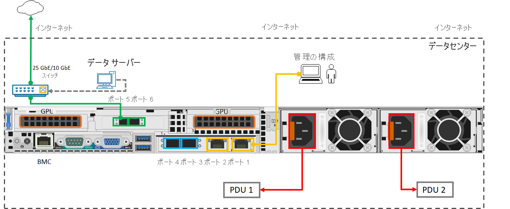

# クイックスタート: GPU 搭載の Azure Stack Edge Pro を使い始める 

このクイックスタートでは、Azure Stack Edge Pro GPU デバイスを配置するために必要な前提条件と手順について詳しく説明します。 このクイック スタートの手順は、Azure portal およびデバイスのローカル Web UI 上で実行します。 

手順全体を完了するのにかかる時間は約 1.5 時間です。 手順の詳細な説明については、[チュートリアル: Azure Stack Edge Pro GPU の配置の準備](azure-stack-edge-gpu-deploy-prep.md#deployment-configuration-checklist)に関する記事を参照してください。 

## 前提条件

配置する前に、次の前提条件が満たされていることを確認します。

1. Azure Stack Edge Pro GPU デバイスがサイトに配送されたら、[梱包を解き](azure-stack-edge-gpu-deploy-install.md#unpack-the-device)、[ラックに取り付け](azure-stack-edge-gpu-deploy-install.md#rack-the-device)ます。 
1. [一覧の URL パターンとポート](azure-stack-edge-gpu-system-requirements.md#networking-port-requirements)にデバイスが接続できるように、ネットワークを構成します。 
1. Azure サブスクリプションに対する所有者または共同作成者のアクセス権を持っています。
1. Azure portal で、 **[ホーム] > [サブスクリプション] > 自分のサブスクリプション > [リソース プロバイダー]** に移動します。 `Microsoft.DataBoxEdge` を検索し、リソース プロバイダーを登録します。 コンピューティング ワークロードをデプロイするために IoT Hub リソースを作成する場合は、繰り返して `Microsoft.Devices` を登録します。
1. Kubernetes ノード用に少なくとも 2 つの連続した静的空き IP アドレスと、IoT Edge サービス用に少なくとも 1 つの静的 IP アドレスがあることを確認します。 配置するモジュールまたは外部サービスごとに、追加の IP アドレスが 1 つ必要になります。
1. デバイスの構成に必要なすべてのものがあることを、[配置チェックリスト](azure-stack-edge-gpu-deploy-checklist.md)で確認します。 

## デプロイメントの手順

1. **設置**: クロスオーバー ケーブルまたは USB イーサネット アダプターを使用して、ポート 1 をクライアント コンピューターに接続します。 データ用に、他に少なくとも 1 つのデバイス ポートを接続します。できる限り、少なくとも 1 つの GbE スイッチと SFP+ 銅線ケーブルを経由して、インターネットへの 25 GbE (ポート 3 からポート 6) を使用します。 提供された電源コードを電源装置に接続し、配電コンセントを分離します。 フロント パネルの電源ボタンを押して、デバイスの電源を入れます。  

    互換性のあるネットワーク ケーブルとスイッチについては、[Cavium FastlinQ 41000 シリーズの相互運用性マトリックス](https://www.marvell.com/documents/xalflardzafh32cfvi0z/)および [Mellanox デュアル ポート 25G ConnectX-4 チャネル ネットワーク アダプター互換製品](https://docs.mellanox.com/display/ConnectX4LxFirmwarev14271016/Firmware+Compatible+Products)に関するドキュメントを参照してください。

    デバイスの配置に必要な最小限のケーブル構成は次のとおりです。

2. **接続**: 静的 IP アドレス **192.168.100.5** とサブネット **255.255.255.0** を使用して、コンピューターのイーサネット アダプターに IPv4 の設定を構成します。 ブラウザーを開き、デバイスのローカル Web UI https://192.168.100.10 に接続します。 これには数分かかることがあります。 セキュリティ証明書の警告が表示されたら、Web ページに進みます。

3. **サインイン**: 既定のパスワード *Password1* を使用してデバイスにサインインします。 デバイス管理者のパスワードを変更します。 パスワードは 8 から 16 文字で、大文字、小文字、数字、特殊文字のうち 3 種類の文字を含む必要があります。

4. **ネットワークの構成**: ネットワーク内に DHCP サーバーがある場合は、接続されたデータ ポートに対する既定の DHCP 構成をそのまま使用します。 そうでない場合は、IP、DNS サーバー、既定のゲートウェイを指定します。 詳細については、[ネットワークの設定](azure-stack-edge-gpu-deploy-configure-network-compute-web-proxy.md#configure-network)に関する記事を参照してください。

5. **コンピューティング ネットワークの構成**: デバイスのポートを有効にして、仮想スイッチを作成します。 スイッチを作成したのと同じネットワーク内の Kubernetes ノード用に、2 つの連続した静的空き IP アドレスを入力します。 IoT Edge Hub サービスがコンピューティング モジュールにアクセスするための少なくとも 1 つの静的 IP アドレスと、Kubernetes クラスターの外部からのアクセス用に追加のサービスまたはコンテナーごとに 1 つの静的 IP アドレスを指定します。 

    Kubernetes は、すべてのコンテナー化されたワークロードを展開するために必要です。 詳細については、[コンピューティング ネットワークの設定](azure-stack-edge-gpu-deploy-configure-network-compute-web-proxy.md#enable-compute-network)に関する記事を参照してください。

6. **Web プロキシの構成**: 環境内で Web プロキシを使用する場合は、`http://<web-proxy-server-FQDN>:<port-id>` に Web プロキシ サーバーの IP アドレスを入力します。 認証を **[なし]** に設定します。 詳細については、[Web プロキシの設定](azure-stack-edge-gpu-deploy-configure-network-compute-web-proxy.md#configure-web-proxy)に関する記事を参照してください。

7. **デバイスの構成**: デバイス名と DNS ドメインを入力するか、既定値をそのまま使用します。 

8. **Update サーバーの構成**: 既定の Microsoft Update サーバーをそのまま使用するか、Windows Server Update Services (WSUS) サーバーとサーバーへのパスを指定します。 

9. **時刻設定の構成**: 既定の時刻設定をそのまま使用するか、タイム ゾーン、プライマリ NTP サーバー、セカンダリ NTP サーバーをローカル ネットワーク上に、またはパブリック サーバーとして設定します。

10. **証明書の構成**: デバイス名と DNS ドメインの両方または一方を変更した場合は、証明書を生成するか、証明書を追加してデバイスをアクティブ化する必要があります。 

    - 非運用環境のワークロードをテストするには、[[証明書の生成] オプション](azure-stack-edge-gpu-deploy-configure-certificates.md#generate-device-certificates)を使用します。 
    - 署名チェーンを含む独自の証明書を持ち込む場合は、適切な形式の[証明書を追加](azure-stack-edge-gpu-deploy-configure-certificates.md#bring-your-own-certificates)します。 必ず、最初に署名チェーンをアップロードします。 [証明書の作成](azure-stack-edge-gpu-create-certificates-tool.md)および[ローカル UI を使用した証明書のアップロード](azure-stack-edge-gpu-deploy-configure-certificates.md#bring-your-own-certificates)に関する記事を参照してください。

11. **アクティブ化**:アクティブ化キーを取得するには 

    1. Azure portal で **Azure Stack Edge リソース > [概要] > [Device setup]\(デバイスのセットアップ\) > [アクティブ化] > [キーの生成]** に移動します。 キーをコピーします。 
    1. ローカル Web UI で、 **[作業の開始] > [アクティブ化]** に移動し、アクティブ化キーを指定します。 キーを適用してからデバイスがアクティブ化されるまで数分かかります。 メッセージが表示されたら `<device-serial-number>`.json ファイルをダウンロードし、将来の復旧に必要なデバイス キーを安全に保管します。 

12. **コンピューティングの構成**: Azure portal で、 **[概要] > [デバイス]** に移動します。 デバイスが **オンライン** であることを確認します。 左側のペインで、 **[Edge コンピューティング] > [作業の開始] > [Edge コンピューティングの構成] > [コンピューティング]** に移動します。 既存または新規の IoT Hub サービスを指定し、コンピューティングが構成されるまで約 20 分待ちます。 詳細については、「[チュートリアル: Azure Stack Edge Pro GPU デバイスにコンピューティングを構成する](azure-stack-edge-gpu-deploy-configure-compute.md)」を参照してください

これで、[IoT Edge](azure-stack-edge-gpu-deploy-sample-module-marketplace.md) を使用して、[`kubectl` を使用して](azure-stack-edge-gpu-create-kubernetes-cluster.md)、または [Azure Arc 対応 Kubernetes を使用して](azure-stack-edge-gpu-deploy-arc-kubernetes-cluster.md)、デバイスにコンピューティング ワークロードを展開できるようになりました。 セットアップの間に問題が発生する場合は、[デバイスの問題のトラブルシューティング]()、[注文の問題の](azure-stack-edge-gpu-troubleshoot.md)、[証明書の問題](azure-stack-edge-gpu-certificate-troubleshooting.md)、または Kubernetes の問題に関する記事を参照してください。 

## 次の手順

[Azure Stack Edge Pro GPU を設置する](./azure-stack-edge-gpu-deploy-install.md)

