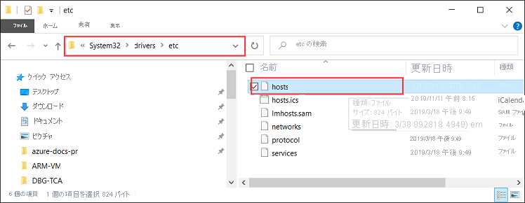

# <a name="deploy-vms-on-your-azure-stack-edge-pro-gpu-device-via-azure-powershell-script"></a>Azure PowerShell スクリプトを使用して Azure Stack Edge Pro GPU デバイスに VM をデプロイする

<!--[!INCLUDE [applies-to-skus](../../includes/azure-stack-edge-applies-to-all-sku.md)]-->

このチュートリアルでは、Azure PowerShell スクリプトを使用して、Azure Stack Edge Pro デバイスに VM を作成し、それを管理する方法について説明します。

## <a name="prerequisites"></a>前提条件

このスクリプトを使用して Azure Stack Edge Pro デバイスに VM を作成して管理する前に、次の手順に記載された前提条件をすべて満たしていることを確認する必要があります。

### <a name="for-azure-stack-edge-pro-device-via-the-local-web-ui"></a>Azure Stack Edge Pro デバイスの条件 (ローカル Web UI を使用)

1. 次の説明に従って Azure Stack Edge Pro デバイスでネットワーク設定を完了していること。「[手順 1: Azure Stack Edge Pro デバイスを構成する](azure-stack-edge-j-series-connect-resource-manager.md#step-1-configure-azure-stack-edge-pro-device)」

2. コンピューティング用のネットワーク インターフェイスを有効にしていること。 このネットワーク インターフェイスの IP を使用して、VM デプロイ用の仮想スイッチを作成します。 このプロセスは、次の手順で実行します。

    1. **[コンピューティングの設定]** にアクセスします。 仮想スイッチの作成に使用するネットワーク インターフェイスを選択します。

        > [!IMPORTANT] 
        > コンピューティング用に構成できるポートは 1 つだけです。

    2. そのネットワーク インターフェイスでコンピューティングを有効にします。 そのネットワーク インターフェイスに対応する仮想スイッチが Azure Stack Edge Pro によって作成、管理されます。

3. すべての証明書を作成し、Azure Stack Edge Pro デバイスと、お使いのクライアントの信頼されたルート ストアにインストールします。 次で説明されている手順に従います。「[手順 2: 証明書を作成してインストールする](azure-stack-edge-j-series-connect-resource-manager.md#step-2-create-and-install-certificates)」

### <a name="for-your-windows-client"></a>Windows クライアントの条件

1. デバイスのローカル Web UI の **[ネットワーク]** ページで、Azure consistent services の仮想インターネット プロトコル (VIP) を定義済みであること。 この VIP を次の場所に追加する必要があります。

    - クライアント上のホスト ファイル、または
    - DNS サーバーの構成
    
    > [!IMPORTANT]
    > エンドポイントの名前解決には、DNS サーバーの構成を変更することをお勧めします。

    1. **メモ帳** を管理者として起動し (hosts ファイルを保存するには管理者特権が必要です)、`C:\Windows\System32\Drivers\etc` にある **hosts** ファイルを開きます。
    
        
    
    2. **hosts** ファイルに次のエントリを追加します。値は、実際のデバイスに合わせて置き換えてください。
    
        ```
        <Azure consistent services VIP> login.<appliance name>.<DNS domain>
        <Azure consistent services VIP> management.<appliance name>.<DNS domain>
        <Azure consistent services VIP> <storage name>.blob.<appliance name>.<DNS domain>
        ```
        ストレージ アカウントには、新しいストレージ アカウントを作成するためにスクリプトで後から使用する名前を指定できます。 このスクリプトでは、そのストレージ アカウントが存在するかどうかはチェックしません。

    3. 次の画像を参考にしてください。 **hosts** ファイルを保存します。

        

2. この手順で使用した [PowerShell スクリプトをダウンロード](https://aka.ms/ase-vm-powershell)します。

3. Windows クライアントで PowerShell 5.0 以降が実行されていることを確認します。

4. `Azure.Storage Module version 4.5.0` がシステムにインストールされていることを確認します。 このモジュールは [PowerShell ギャラリーから](https://www.powershellgallery.com/packages/Azure.Storage/4.5.0)取得できます。 このモジュールをインストールするには、次のように入力します。

    `Install-Module -Name Azure.Storage -RequiredVersion 4.5.0`

    インストールされているモジュールのバージョンを確認するには、次のように入力します。

    `Get-InstalledModule -name Azure.Storage`

    他のバージョンのモジュールをアンインストールするには、次のように入力します。

    `Uninstall-Module -Name Azure.Storage`

5. Windows クライアントに [AzCopy 10 をダウンロード](https://docs.microsoft.com/azure/storage/common/storage-use-azcopy-v10#download-azcopy)します。 スクリプトの実行中にパラメーターとして渡すので、この場所をメモしておきます。

6. Windows クライアントで TLS 1.2 以降が実行されていることを確認します。


## <a name="create-a-vm"></a>VM の作成

1. PowerShell を管理者として実行します。
2. スクリプトをダウンロードしたクライアント上のフォルダーに移動します。  
3. 次のコマンドを使用して、スクリプトを実行します。
 
    `.\ArmPowershellClient.ps1 -VNetAddressSpace <AddressSpace> -NicPrivateIp <Private IP> -VHDPath <Path> -VHDFile <VHD File, with extension> -StorageAccountName <Name> -OS <Windows/Linux> -VMSize <Supported VM Size> -VMUserName <UserName to be used to login into VM> -VMPassword <Password for the VM login> --AzCopy10Path <Absolute Path>`

    スクリプトを実行して Windows VM と Linux VM を作成するときの例を以下に示します。

    **Windows VM の場合:**

    `.\ArmPowershellClient.ps1 -VNetAddressSpace 5.5.0.0/16 -NicPrivateIp 5.5.168.73 -VHDPath \\intel01\d$\vm_vhds\AzureWindowsVMmode -VHDFile WindowsServer2016Datacenter.vhd -StorageAccountName teaaccount1 -OS Windows -VMSize Standard_D1_v2 -VMUserName Administrator -VMPassword Password1 -AzCopy10Path C:\azcopy10\azcopy.exe`

    **Linux VM の場合:**

    `.\ArmPowershellClient.ps1 -VNetAddressSpace 5.5.0.0/16 -NicPrivateIp 5.5.168.83 -VHDPath \\intel01\d$\vm_vhds\AzurestackLinux -VHDFile ubuntu13.vhd -StorageAccountName sa2 -OS Linux -VMSize Standard_D1_v2 -VMUserName Administrator -VMPassword Password1 -AzCopy10Path C:\azcopy10\azcopy.exe`
    
4. スクリプトによって作成されたリソースをクリーンアップするには、次のコマンドを使用します。
    
    ```powershell
    Get-AzureRmVM | Remove-AzureRmVM -Force
    Get-AzureRmNetworkInterface | Remove-AzureRmNetworkInterface -Force
    Get-AzureRmResource | Remove-AzureRmResource -f
    Get-AzureRmResourceGroup | Remove-AzureRmResourceGroup -f
    ```


## <a name="next-steps"></a>次のステップ

[Azure PowerShell コマンドレットを使用して VM をデプロイする](azure-stack-edge-j-series-deploy-virtual-machine-powershell.md)
