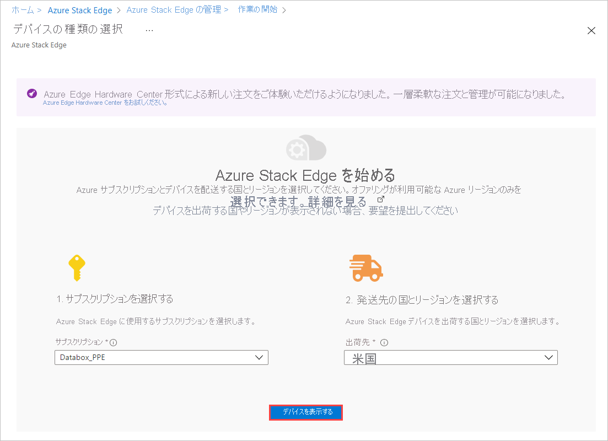
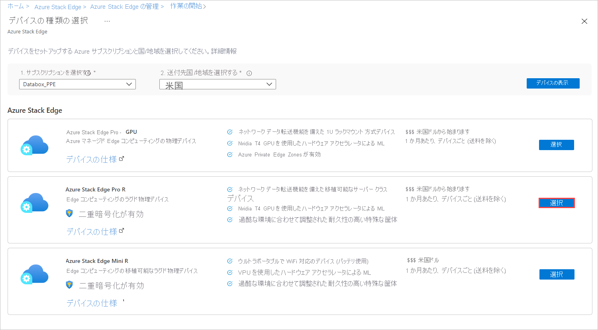
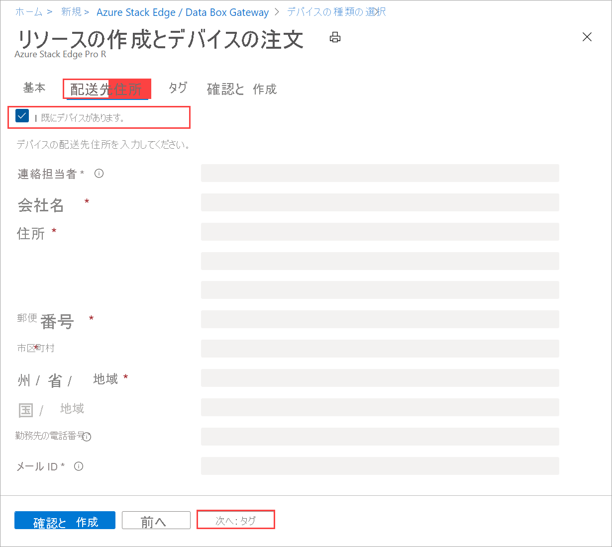
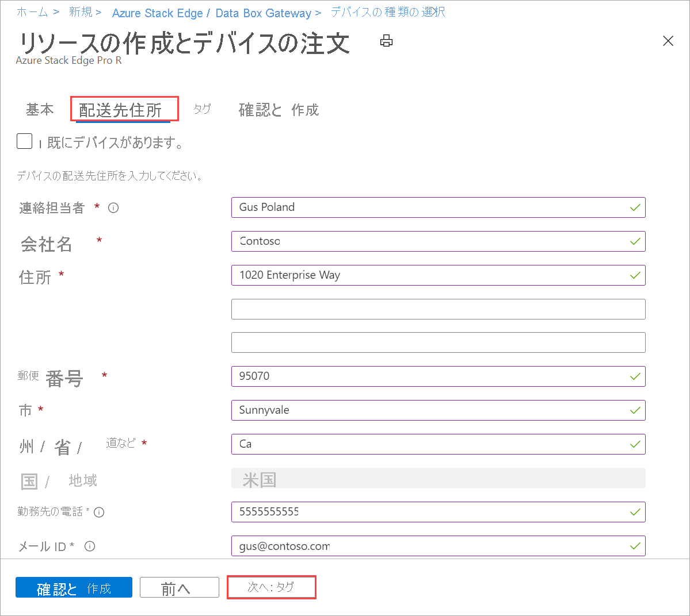

# <a name="tutorial-prepare-to-deploy-azure-stack-edge-pro-r"></a>チュートリアル:Azure Stack Edge Pro R の配置を準備する

このチュートリアルは、Azure Stack Edge Pro R を完全に配置するために必要な一連の配置チュートリアルの 1 つ目です。このチュートリアルでは、Azure Stack Edge リソースを配置するために Azure portal を準備する方法を説明します。 このチュートリアルでは、無停電電源装置 (UPS) に付属の 1 ノードの Azure Stack Edge Pro R デバイスを使用します。

セットアップと構成のプロセスを完了するには、管理者特権が必要です。 ポータルの準備は 10 分ほどで完了します。

このチュートリアルでは、以下の内容を学習します。

> [!div class="checklist"]
>
> * 新しいリソースを作成
> * アクティブ化キーの取得

### <a name="get-started"></a>はじめに

Azure Stack Edge Pro R を配置するには、次の順序どおりにチュートリアルを参照してください。

| 実行する手順 | 概要 |
| --- | --- |
| **準備** |後で行う配置のための準備として、これらの手順を完了する必要があります。 |
| **[配置の構成のチェック リスト](#deployment-configuration-checklist)** |このチェック リストを使用して、デプロイ前およびデプロイ中に情報を収集し、記録します。 |
| **[デプロイの前提条件](#prerequisites)** |これらの前提条件を使用して、配置に対する環境の準備が完了していることを確認します。 |
|  | |
|**配置のチュートリアル** |これらのチュートリアルは、ご利用の Azure Stack Edge Pro R デバイスを運用環境に配置するために必要です。 |
|**[1. デバイスのために Azure portal を準備する](azure-stack-edge-pro-r-deploy-prep.md)** |Azure Stack Box Edge 物理デバイスを設置する前に、Azure Stack Edge リソースを作成して構成します。 |
|**[2.デバイスを設置する](azure-stack-edge-pro-r-deploy-install.md)**|物理デバイスの検査とケーブル接続を行います。  |
|**[3. デバイスに接続する](azure-stack-edge-pro-r-deploy-connect.md)** |デバイスを設置したら、デバイスのローカル Web UI に接続します。  |
|**[4.ネットワーク設定を構成する](azure-stack-edge-pro-r-deploy-configure-network-compute-web-proxy.md)** |デバイスに対するコンピューティング ネットワークや Web プロキシの設定など、ネットワークを構成します。   |
|**[5.デバイス設定を構成する](azure-stack-edge-pro-r-deploy-set-up-device-update-time.md)** |デバイス名と DNS ドメインを割り当てて、更新サーバーとデバイスの時刻を構成します。 |
|**[6.セキュリティ設定を構成する](azure-stack-edge-pro-r-deploy-configure-certificates-vpn-encryption.md)** |ご利用のデバイスの証明書、VPN、保存時の暗号化を構成します。 デバイスで生成された証明書を使用するか、独自の証明書を使用します。   |
|**[7.デバイスをアクティブにする](azure-stack-edge-pro-r-deploy-activate.md)** |サービスからのアクティブ化キーを使用して、デバイスをアクティブ化します。 デバイスは、SMB または NFS 共有を設定するか、REST 経由で接続できる状態になります。 |
|**[8.コンピューティングを構成する](azure-stack-edge-gpu-deploy-configure-compute.md)** |デバイスでコンピューティング ロールを構成します。 Kubernetes クラスターも作成されます。 |

これで、Azure Portal をセットアップする準備が整いました。

## <a name="deployment-configuration-checklist"></a>デプロイの構成チェック リスト

デバイスを配置する前に、Azure Stack Edge Pro デバイスにソフトウェアを構成するための情報を収集する必要があります。 事前にこの情報の一部を準備することで、環境内にデバイスを配置するプロセスを効率化できます。 [Azure Stack Edge Pro R 配置構成チェックリスト](azure-stack-edge-pro-r-deploy-checklist.md)を使用して、ご利用のデバイスを配置するときの構成の詳細をメモします。

## <a name="prerequisites"></a>前提条件

次に示すのは、Azure Stack Edge リソース、Azure Stack Edge デバイス、およびデータセンター ネットワークの構成に関する前提条件です。

### <a name="for-the-azure-stack-edge-resource"></a>Azure Stack Edge リソースの前提条件

[!INCLUDE [Azure Stack Edge resource prerequisites](../../includes/azure-stack-edge-gateway-resource-prerequisites.md)]

### <a name="for-the-azure-stack-edge-device"></a>Azure Stack Edge デバイスの前提条件

物理デバイスを配置する前に次の点を確認します。

- このデバイスの安全性に関する情報を次のページで確認した: [Azure Stack Edge デバイスの安全性に関するガイドライン](azure-stack-edge-pro-r-safety.md)。
[!INCLUDE [Azure Stack Edge device prerequisites](../../includes/azure-stack-edge-gateway-device-prerequisites.md)] 


### <a name="for-the-datacenter-network"></a>データセンター ネットワークの前提条件

開始する前に次の点を確認します。

- Azure Stack Edge デバイスのネットワーク要件に従ってデータセンターのネットワークが構成されていること。 詳細については、「[Azure Stack Edge Pro R のシステム要件](azure-stack-edge-pro-r-system-requirements.md)」を参照してください。

- ご利用のデバイスの通常の動作条件下における帯域幅は次のとおりです。

    - デバイスが常に最新の状態に保たれるように最低 10 Mbps のダウンロード帯域幅。
    - ファイル転送用に最低 20 Mbps の専用のアップロード/ダウンロード帯域幅。

## <a name="create-a-new-resource"></a>新しいリソースを作成

物理デバイスを管理する既存の Azure Stack Edge リソースがある場合は、この手順をスキップして、「[アクティブ化キーの取得](#get-the-activation-key)」に進みます。

### <a name="portal"></a>[ポータル](#tab/azure-portal)

Azure Stack Edge リソースを作成するには、Azure portal で次の手順を実行します。

1. Microsoft Azure 資格情報を使用し、Azure portal にサインインします。URL は [https://portal.azure.com](https://portal.azure.com) です。

2. 左側のウィンドウで、 **[+ リソースの作成]** を選択します。 **[Azure Stack Edge/Data Box Gateway]** を検索して選択します。 **［作成］** を選択します 

3. Azure Stack Edge Pro デバイスに使用するサブスクリプションを選択します。 この物理デバイスを発送する先の国を選択します。 **[デバイスの表示]** を選択します。

    

4. デバイスの種類を選択します。 **[Azure Stack Edge]** で、 **[Azure Stack Edge Pro R]** を選択し、 **[選択]** を選択します。 問題が発生した場合、またはデバイスの種類を選択できない場合は、[注文の問題のトラブルシューティング](azure-stack-edge-troubleshoot-ordering.md)に関する記事を参照してください。

    

5. ビジネス ニーズに基づいて、 **[Azure Stack Edge Pro R single node]\(Azure Stack Edge Pro R 単一ノード\)** または **[Azure Stack Edge Pro R single node with UPS]\(Azure Stack Edge Pro R 単一ノードと UPS\)** を選択できます。  

    

6. **[基本]** タブで、次の **プロジェクト情報** を入力または選択します。
    
    |設定  |値  |
    |---------|---------|
    |サブスクリプション    |サブスクリプションは、前の選択に基づいて自動的に設定されます。 サブスクリプションは、課金アカウントにリンクされます。 |
    |Resource group  |既存のグループを選択するか、新しいグループを作成します。<br>Azure リソース グループの詳細については[こちら](../azure-resource-manager/management/overview.md)をご覧ください。     |

7. 次の **インスタンス情報** を入力または選択します。

    |設定  |値  |
    |---------|---------|
    |名前   | リソースを識別するわかりやすい名前を入力します。<br>名前は 2 - 50 文字で、英字、数字、ハイフンを使用します。<br> 名前の最初と最後には、英字か数字を使用します。        |
    |リージョン     |Azure Stack Edge リソースを使用できるすべてのリージョンの一覧については、[リージョン別の利用可能な Azure 製品](https://azure.microsoft.com/global-infrastructure/services/?products=databox&regions=all)に関するページを参照してください。 Azure Government を使用している場合は、「[Azure リージョン](https://azure.microsoft.com/global-infrastructure/regions/)」に記載されているすべての政府機関向けリージョンを選択できます。<br> デバイスをデプロイする地理的リージョンに最も近い場所を選択します。|

    


8. **配送先住所** を選択します。

    - 既にデバイスがある場合は、 **[I have a Azure Stack Edge Pro R device]\(Azure Stack Edge Pro R デバイスを持っています\)** のコンボ ボックスを選択します。

        

    - 新しいデバイスを注文する場合は、連絡先名、会社、デバイスの配送先住所、連絡先情報を入力します。

        

9. **タグ** を選択します。 必要に応じて、リソースを分類し、請求を統合するためのタグを指定します。 **確認と作成** をクリックします。

10. **[確認と作成]** タブで、**価格の詳細**、**使用条件**、リソースの詳細を確認します。 **[I have reviewed the privacy terms]\(プライバシー条件を確認しました\)** のコンボ ボックスを選択します。

     

    また、リソースの作成時に、クラウド サービスに対して認証できるようにするマネージド サービス ID (MSI) が有効になっていることも通知されます。 この ID は、リソースが存在する限り存在します。

11. **［作成］** を選択します

    リソースの作成には数分かかります。 また、Azure Stack Edge デバイスが Azure のリソースプロバイダーと通信できるようにする MSI も作成されます。

    リソースが正常に作成されてデプロイされると通知が表示されます。 **[リソースに移動]** を選択します。

    

Microsoft は受け取った注文を確認し、発送の詳細と共にお客様に (メールで) 連絡します。

<!-- - If this is restored, it must go above "After the resource is successfully created." The azure-stack-edge-resource-1.png would seem superfluous in that case.--> 

> [!NOTE]
> 一度に複数の注文を作成したい場合や既存の注文を複製したい場合は、[「Azure サンプル」のスクリプト](https://github.com/Azure-Samples/azure-stack-edge-order)をご利用ください。 詳細については、Readme ファイルを参照してください。

注文処理の間に問題が発生した場合は、[注文の問題のトラブルシューティング](azure-stack-edge-troubleshoot-ordering.md)に関する記事を参照してください。

### <a name="azure-cli"></a>[Azure CLI](#tab/azure-cli)

必要に応じて、Azure CLI の環境を準備します。

[!INCLUDE [azure-cli-prepare-your-environment-no-header.md](../../includes/azure-cli-prepare-your-environment-no-header.md)]

Azure Stack Edge リソースを作成するには、Azure CLI で次のコマンドを実行します。

1. [az group create](/cli/azure/group#az_group_create) コマンドを使用してリソース グループを作成するか、既存のリソース グループを使用します。

   ```azurecli
   az group create --name myasepgpu1 --location eastus
   ```

1. デバイスを作成するには、[az databoxedge device create](/cli/azure/databoxedge/device#az_databoxedge_device_create) コマンドを使用します。

   ```azurecli
   az databoxedge device create --resource-group myasepgpu1 \
      --device-name myasegpu1 --location eastus --sku EdgePR_Base
   ```

   デバイスをデプロイする地理的リージョンに最も近い場所を選択します。 このリージョンには、デバイス管理用のメタデータのみが格納されます。 実際のデータは、任意のストレージ アカウントに格納できます。

   Azure Stack Edge リソースを使用できるすべてのリージョンの一覧については、[リージョン別の利用可能な Azure 製品](https://azure.microsoft.com/global-infrastructure/services/?products=databox&regions=all)に関するページを参照してください。 Azure Government を使用している場合は、「[Azure リージョン](https://azure.microsoft.com/global-infrastructure/regions/)」に記載されているすべての政府機関向けリージョンを選択できます。

1. 注文を作成するには、[az databoxedge order create](/cli/azure/databoxedge/order#az_databoxedge_order_create) コマンドを実行します。

   ```azurecli
   az databoxedge order create --resource-group myasepgpu1 \
      --device-name myasegpu1 --company-name "Contoso" \
      --address-line1 "1020 Enterprise Way" --city "Sunnyvale" \
      --state "California" --country "United States" --postal-code 94089 \
      --contact-person "Gus Poland" --email-list gus@contoso.com --phone 4085555555
   ```

リソースの作成には数分かかります。 [Az databoxedge order show](/cli/azure/databoxedge/order#az_databoxedge_order_show) コマンドを実行して、注文を確認します。

```azurecli
az databoxedge order show --resource-group myasepgpu1 --device-name myasegpu1 
```

注文が行われたら、Microsoft は注文を確認し、発送の詳細が記載されたメールをお客様に送信します。

---

## <a name="get-the-activation-key"></a>アクティブ化キーの取得

Azure Stack Edge リソースが起動して実行中になったら、アクティブ化キーを取得する必要があります。 このキーを使用して、Azure Stack Edge Pro デバイスのアクティブ化とリソースへの接続を行います。 このキーは Azure portal ですぐに入手できます。

1. 自分が作成したリソースを選択して、 **[概要]** を選択します。

2. 右ペインで、Azure キー コンテナーの名前を入力するか、既定の名前をそのまま使用します。 キー コンテナーの名前は 3 から 24 文字で指定できます。

   デバイスでアクティブ化される Azure Stack Edge リソースごとに、キー コンテナーが作成されます。 キー コンテナーを使用すると、シークレットを格納してアクセスできます。たとえば、サービスのチャネル整合性キー (CIK) をキー コンテナーに格納できます。

   キー コンテナーの名前を指定したら、 **[Generate activation key]\(アクティブ化キーの生成\)** を選択して、アクティブ化キーを作成します。

   

   キー コンテナーとアクティブ化キーが作成されるまで数分待ちます。 コピー アイコンを選択してキーをコピーし、後で使用できるように保存します。<!--Verify that the new screen has a copy icon.-->

> [!IMPORTANT]
> - アクティブ化キーは生成後 3 日間で有効期限が切れます。
> - キーの有効期限が切れた場合は、新しいキーを生成してください。 古いキーは無効です。

## <a name="next-steps"></a>次のステップ

このチュートリアルでは、Azure Stack Edge に関する次のようなトピックについて説明しました。

> [!div class="checklist"]
> * 新しいリソースを作成
> * アクティブ化キーの取得

次のチュートリアルに進み、Azure Stack Edge を設置する方法を学習してください。

> [!div class="nextstepaction"]
> [Azure Stack Edge を設置する](./azure-stack-edge-pro-r-deploy-install.md)
