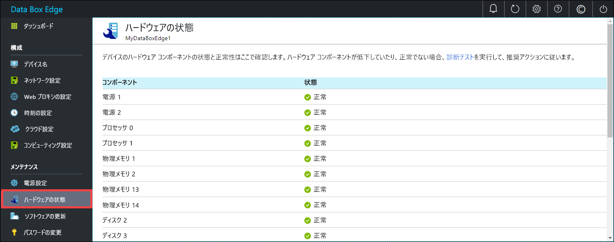

# Azure Data Box Edge を監視する

この記事では、Azure Data Box Edge を監視する方法について説明します。 デバイスは、Azure portal またはローカル Web UI を使用して監視できます。 デバイスのイベントを確認したり、アラートを構成して管理したり、メトリックを確認したりするには、Azure portal を使用します。 さまざまなデバイス コンポーネントのハードウェアの状態を確認するには、物理デバイスのローカル Web UI を使用します。

この記事では、次のことについて説明します。

> [!div class="checklist"]
> * デバイス イベントとそれに対応するアラートを確認する
> * デバイス コンポーネントのハードウェアの状態を確認する
> * デバイスの容量とトランザクションのメトリックを確認する
> * アラートを構成して管理する

## デバイスのイベントを確認する

[!INCLUDE [Supported OS for clients connected to device](../../includes/data-box-edge-gateway-view-device-events.md)]

## ハードウェアの状態を確認する

デバイス コンポーネントのハードウェアの状態を確認するには、ローカル Web UI から次の手順を実行します。

1. お使いのデバイスのローカル Web UI に接続します。
2. **[メンテナンス] > [ハードウェアの状態]** に移動します。 さまざまなデバイス コンポーネントの正常性を確認できます。

    

## メトリックを表示する

[!INCLUDE [Supported OS for clients connected to device](../../includes/data-box-edge-gateway-view-metrics.md)]

## Manage alerts

[!INCLUDE [Supported OS for clients connected to device](../../includes/data-box-edge-gateway-manage-alerts.md)]

## 次の手順 

[帯域幅を管理する](data-box-edge-manage-bandwidth-schedules.md)方法について学習します。