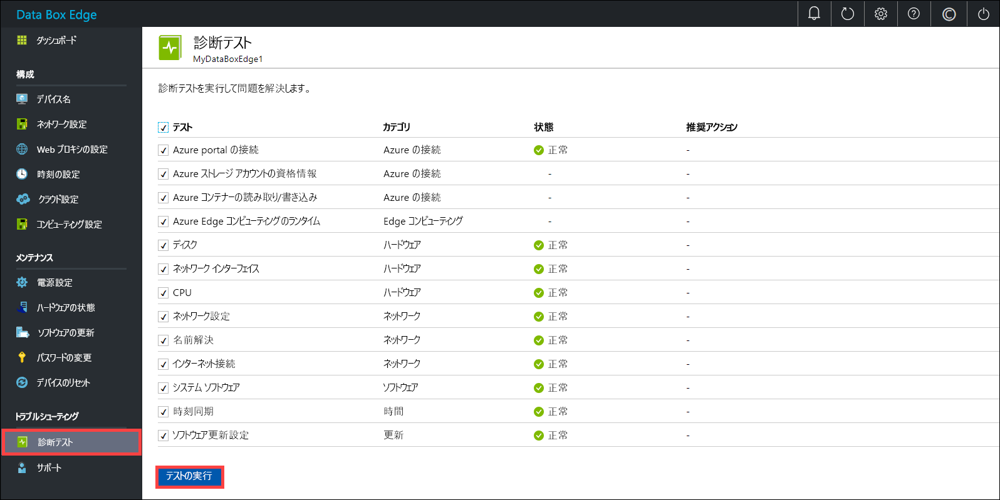
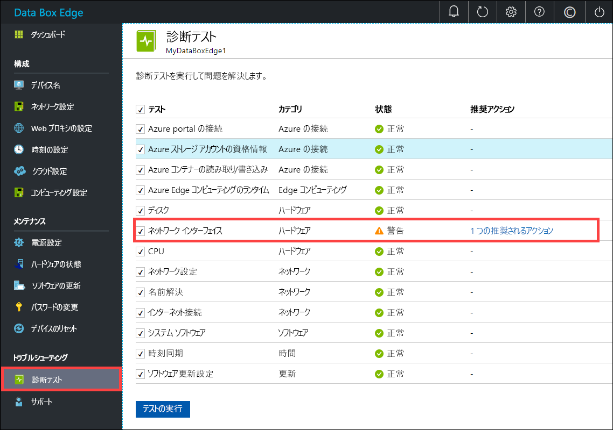
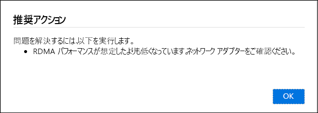
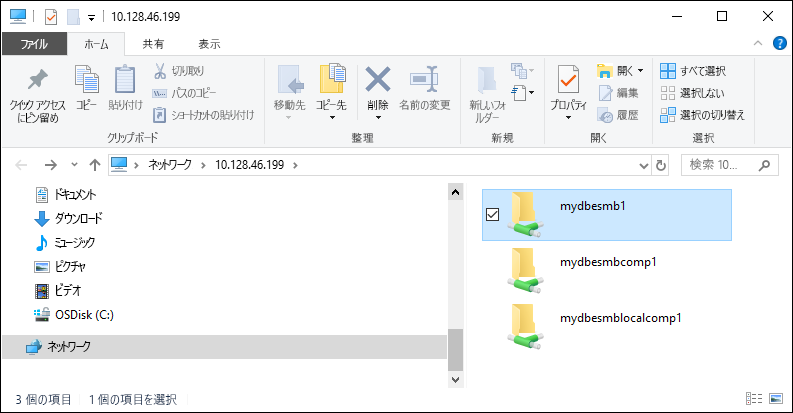

# <a name="troubleshoot-your-azure-data-box-edge-issues"></a>Azure Data Box Edge に関する問題のトラブルシューティング 

この記事では、Azure Data Box Edge に関する問題のトラブルシューティングを行う方法について説明します。 

この記事では、次のことについて説明します。

> [!div class="checklist"]
> * 診断の実行
> * サポート パッケージの収集
> * ログを使用したトラブルシューティング


## <a name="run-diagnostics"></a>診断の実行

デバイスのエラーの診断とトラブルシューティングを行うには、診断テストを実行します。 診断テストを実行するには、お客様のデバイスのローカル Web UI で、次の手順を実行します。

1. ローカル Web UI で、 **[トラブルシューティング]、[診断テスト]** の順に移動します。 実行したいテストを選択し、 **[テストの実行]** をクリックします。 これにより、お客様のネットワーク、デバイス、Web プロキシ、時刻、またはクラウドの設定で発生する可能性のある問題を診断するためのテストが実行されます。 デバイスでテストを実行中であることが通知されます。

    
 
2. テストが完了すると、結果が表示されます。 

    

    テストが失敗すると、推奨される操作の URL が表示されます。 URL をクリックすると、推奨される操作を表示することができます。
 
    


## <a name="collect-support-package"></a>サポート パッケージの収集

ログ パッケージは、Microsoft サポートがデバイスの問題のトラブルシューティングを行う際に役立つすべての関連ログで構成されます。 ログ パッケージは、ローカル Web UI を使用して生成することができます。

サポート パッケージを収集するには、次の手順を実行します。 

1. ローカル Web UI で、 **[トラブルシューティング]、[サポート]** の順に移動します。 **[サポート パッケージの作成]** をクリックします。 システムでサポート パッケージの収集が開始されます。 パッケージの収集には数分かかる場合があります。

    ![[ユーザーの追加] をクリックする](media/data-box-edge-troubleshoot/collect-logs-1.png)
 
2. サポート パッケージが作成されたら、 **[サポート パッケージのダウンロード]** をクリックします。 圧縮されたパッケージが、お客様が選択したパスにダウンロードされます。 パッケージを解凍して、システム ログ ファイルを表示できます。

    ![[ユーザーの追加] をクリックする](media/data-box-edge-troubleshoot/collect-logs-2.png)

## <a name="use-logs-to-troubleshoot"></a>ログを使用したトラブルシューティング

アップロード プロセス中および更新プロセス中に発生したすべてのエラーが、それぞれのエラー ファイルに含まれています。

1. エラー ファイルを表示するには、共有に移動し、内容を表示する共有をクリックします。 

      

2. "_Microsoft Data Box Edge フォルダー_" をクリックします。 このフォルダーには、次の 2 つのサブフォルダーがあります。

    - アップロードのエラー用のログ ファイルがある Upload フォルダー。
    - 更新中のエラー用の Refresh フォルダー。

    以下に更新用のログ ファイルのサンプルを示します。

    ```
    <root container="test1" machine="VM15BS020663" timestamp="03/18/2019 00:11:10" />
    <file item="test.txt" local="False" remote="True" error="16001" />
    <summary runtime="00:00:00.0945320" errors="1" creates="2" deletes="0" insync="3" replaces="0" pending="9" />
    ``` 

3. このファイル内にエラー (サンプルの強調表示されている部分) がある場合は、エラー コードを書き留めておきます。この例では 16001 です。 以下のエラー リファレンスで、このエラー コードの説明を参照します。

    [!INCLUDE [data-box-edge-edge-upload-error-reference](../../includes/data-box-edge-gateway-upload-error-reference.md)]


## <a name="next-steps"></a>次のステップ

- [このリリースの既知の問題](data-box-gateway-release-notes.md)について学習します。
