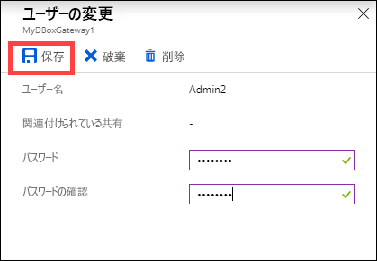
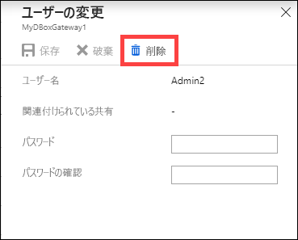
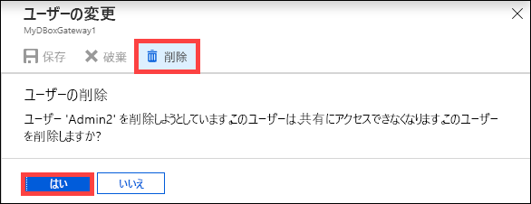

# Azure portal を使用して Azure Data Box Gateway のユーザーを管理する

この記事では、Data Box Gateway のユーザーを管理する方法について説明します。 Azure Data Box Gateway の管理は、Azure portal またはローカル Web UI を通じて行えます。 Azure portal を使用してユーザーを追加、変更、または削除します。

この記事では、次のことについて説明します。

> [!div class="checklist"]
> * ユーザーの追加
> * ユーザーの変更
> * ユーザーの削除

## ユーザーについて

ユーザーには、読み取りアクセス権だけを指定することも、すべての特権を指定することもできます。 名前が示すとおり、読み取り専用ユーザーは、共有データを表示することだけができます。 すべての特権を持つユーザーは、共有データの読み取り、これらの共有への書き込み、および共有データの変更または削除を行うことができます。

 - **すべての特権を持つユーザー** - フル アクセス権を持つローカル ユーザー。
 - **読み取り専用ユーザー** - 読み取り専用アクセス権を持つローカル ユーザー。 これらのユーザーは、読み取り専用の操作を許可する共有に関連付けられます。

ユーザーのアクセス許可は、まず、共有の作成中にユーザーを作成するときに定義します。 共有レベルのアクセス許可の変更は現在サポートされていません。

## ユーザーの追加

ユーザーを追加するには、Azure portal で次の手順を実行します。

1. Azure portal で Data Box Gateway リソースに移動し、 **[概要]** に移動します。 コマンド バーの **[+ ユーザーの追加]** をクリックします。

    ![[ユーザーの追加] をクリックする](media/data-box-gateway-manage-users/add-user-1.png)

2. 追加するユーザーのユーザー名とパスワードを指定します。 パスワードを確認し、 **[追加]** をクリックします。

    ![[ユーザーの追加] をクリックする](media/data-box-gateway-manage-users/add-user-2.png)

    > [!IMPORTANT] 
    > 以下のユーザーはシステムで予約されているため、使用できません。Administrator、EdgeUser、EdgeSupport、HcsSetupUser、WDAGUtilityAccount、CLIUSR、DefaultAccount、Guest。  

3. ユーザーの作成が開始され完了すると、その旨が通知されます。 ユーザーが作成されたら、コマンド バーの **[最新の情報に更新]** をクリックして、更新されたユーザーの一覧を表示します。

## ユーザーの変更

ユーザーの作成後、ユーザーに関連付けられているパスワードを変更することができます。 一覧のユーザーを選択してクリックします。 新しいパスワードを指定して確認します。 変更を保存します。
 

## ユーザーの削除

ユーザーを削除するには、Azure portal で次の手順を実行します。

1. ユーザーの一覧でユーザーを選択してクリックし、 **[削除]** をクリックします。  

   

2. メッセージが表示されたら、削除を確定します。 

   

ユーザーの一覧が更新され、ユーザーの削除が反映されます。

## 次のステップ

- [帯域幅を管理する](data-box-gateway-manage-bandwidth-schedules.md)方法について学習します。
