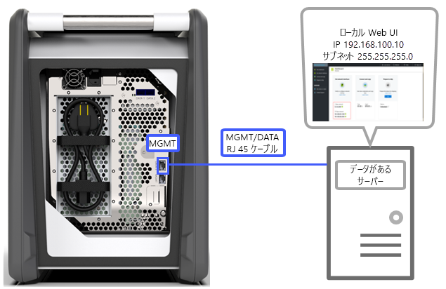
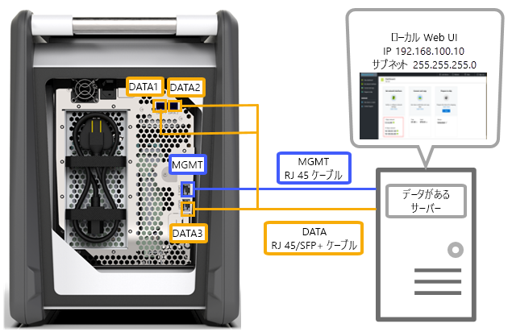
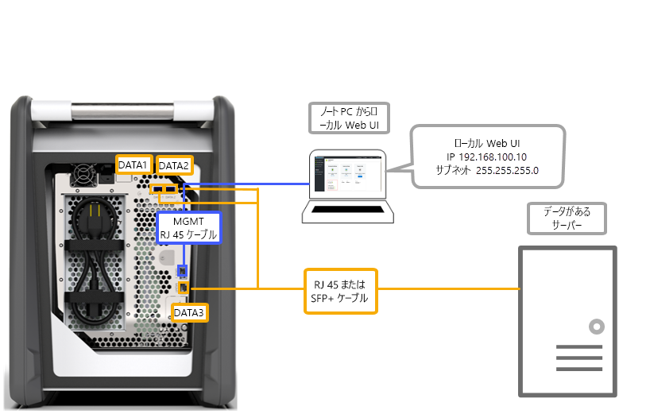
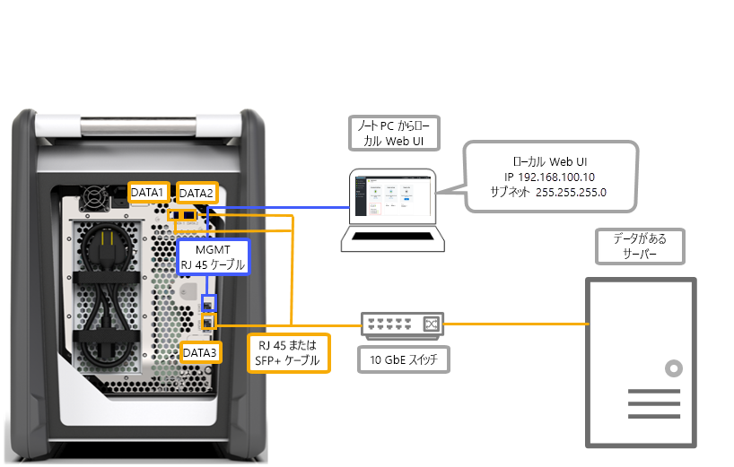
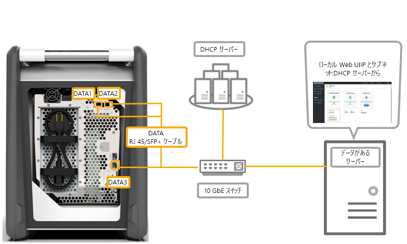

# Azure Data Box の配線方法

この記事では、データ転送のために Azure Data Box にケーブルを配線する際のさまざまな方法を説明します。

## MGMT ポート経由で転送する

このオプションでは、Data Box の構成がごく最小限になります。 MGMT ポートのみを構成し、管理とデータのどちらにも使用することができます。

開始する前に、次のものがあることを確認します。

- MGMT ポートに接続する RJ45 イーサネット ケーブル。
- [サポートされている OS](data-box-system-requirements.md#supported-operating-systems-for-clients) を実行しているデータ ソース。

次の手順に従ってケーブルを配線します。

1. RJ45 ケーブルを使って、MGMT ポートをデータが格納されているサーバーに接続します。

    

2. サーバーで、次の設定を行います。

    - **IP アドレス**: 192.168.100.5
    - **サブネット**: 255.255.255.0

3. デバイスのローカル Web UI (192.168.100.10) にアクセスします。 サインインし、Azure portal からロック解除のパスワードを使用して Data Box のロックを解除します。

## 静的 IP を使用して DATA ポート経由で転送する

Data Box に 2 つのポート (管理トラフィック用に MGMT ポート、データ用にデータ ポートのいずれか 1 つ) を構成できます。 データ ポートは DATA 1、DATA 2、DATA 3 のいずれかです。

構成するデータ ポートが 1 つのみのときは、DATA 1、DATA 2 などの 10-GbE ポートを使用することを強くお勧めします。 1-GbE ポートを使うと、データ転送にかかる時間が大幅に増えるおそれがあります。

開始する前に、次のものがあることを確認します。

- MGMT ポートに接続する RJ45 イーサネット ケーブル。
- 10-GbE SFP+ Twinax 銅線ケーブル (接続する 10-GbE データ ポート 1 つにつき 1 本ずつ)。
- [サポートされている OS](data-box-system-requirements.md#supported-operating-systems-for-clients) を実行している 1 つ以上のデータ ソース。

### オプション 1 - サーバーを介した初期設定

次の手順に従ってケーブルを配線します。

1. RJ45 イーサネット ケーブルを使用して、構成のために MGMT ポートとサーバーを直接接続します。
2. 使用するポートが DATA 3 であれば RJ45 ケーブル、DATA 1 または DATA 2 であれば SFP+ ケーブルを使って、ポートをデータ ソースとしての役割を果たすサーバーに接続します。 良好なパフォーマンスを得るには、10-GbE の DATA 1 ポートまたは DATA 2 ポートの使用をお勧めします。
3. サーバーで、次の設定を行います。

   - **IP アドレス**: 192.168.100.5
   - **サブネット**: 255.255.255.0

     

3. デバイスのローカル Web UI (192.168.100.10) にアクセスします。 サインインし、Azure portal からロック解除のパスワードを使用して Data Box のロックを解除します。
4. 構成したデータ ポートに静的 IP を割り当てます。

### オプション 2 - 別のコンピューターを介した初期設定

次の手順に従ってケーブルを配線します。

1. RJ45 イーサネット ケーブルを使用して、構成用の MGMT ポートに別のコンピューターを直接接続します。
2. 使用するポートが DATA 3 であれば RJ45 ケーブル、DATA 1 または DATA 2 であれば SFP+ ケーブルを使って、サーバーに接続します。 良好なパフォーマンスを得るには、10-GbE の DATA 1 ポートまたは DATA 2 ポートの使用をお勧めします。 データが格納されているサーバーとデータ ポートは、10-GbE スイッチを介して接続します。
3. デバイスに接続するために使用するノート PC のイーサネット アダプターを、次のとおり構成します。

   - **IP アドレス**: 192.168.100.5
   - **サブネット**: 255.255.255.0

     

3. デバイスのローカル Web UI (192.168.100.10) にアクセスします。 サインインし、Azure portal からロック解除のパスワードを使用して Data Box のロックを解除します。
4. DHCP サーバーにより割り当てられた IP アドレスを特定します。

## 静的 IP とスイッチを使用して DATA ポート経由で転送する 

1 GbE ネットワークと 10 GbE ネットワークにまたがる複数のデータ ソースの場合には、この構成を使用します。

開始する前に、次のものがあることを確認します。

- MGMT ポートに接続する RJ45 イーサネット ケーブル。
- 10-GbE SFP+ Twinax 銅線ケーブル (接続する 10-GbE データ ポート 1 つにつき 1 本ずつ)。
- [サポートされている OS](data-box-system-requirements.md#supported-operating-systems-for-clients) を実行している 1 つ以上のデータ ソース。 これらのデータ ソースは、1 GbE ネットワークや 10 GbE ネットワークなどの異なるネットワークに存在する可能性があります。

次の手順に従ってケーブルを配線します。

1. RJ45 イーサネット ケーブルを使用して、構成のために MGMT ポートとサーバーを直接接続します。
2. 使用するポートが DATA 3 であれば RJ45 ケーブル、DATA 1 または DATA 2 であれば SFP+ ケーブルを使って、サーバーに接続します。 良好なパフォーマンスを得るには、10-GbE の DATA 1 ポートまたは DATA 2 ポートの使用をお勧めします。
3. デバイスに接続するために使用するノート PC のイーサネット アダプターを、次のとおり構成します。

   - **IP アドレス**: 192.168.100.5
   - **サブネット**: 255.255.255.0

     

3. デバイスのローカル Web UI (192.168.100.10) にアクセスします。 サインインし、Azure portal からロック解除のパスワードを使用して Data Box のロックを解除します。
4. 構成したデータ ポートに静的 IP を割り当てます。

## DHCP 環境内で DATA ポート経由で転送する

デバイスが DHCP 環境にある場合には、この構成を使用します。

開始する前に、次のものがあることを確認します。

- RJ45 ケーブル (DATA 1 に接続する場合)。
- 10-GbE SFP+ Twinax 銅線ケーブル (接続する 10-GbE データ ポート 1 つにつき 1 本ずつ)。
- [サポートされている OS](data-box-system-requirements.md#supported-operating-systems-for-clients) を実行している 1 つ以上のデータ ソース。 これらのデータ ソースは、1 GbE ネットワークや 10 GbE ネットワークなどの異なるネットワークに存在する可能性があります。

次の手順に従ってケーブルを配線します。

1. (DHCP サーバーがアクセス可能な) スイッチを介して、RJ45 または SFP+ ケーブルを使用してサーバーに接続します。

    
2. DHCP サーバーまたは DNS サーバーを使用して IP アドレスを特定します。
3. 同じネットワーク上のサーバーから、DHCP サーバーによって割り当てられた IP アドレスを使用してデバイスのローカル Web UI にアクセスします。 サインインし、Azure portal からロック解除のパスワードを使用して Data Box のロックを解除します。

## 次のステップ

- デバイスの配線を済ませたら、[Azure Data Box へのデータのコピー](data-box-deploy-copy-data.md)に進みます。
