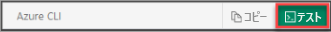

# <a name="tutorial-order-azure-data-box"></a>チュートリアル:Azure Data Box を注文する

Azure Data Box は、迅速かつ簡単な信頼性の高い方法でオンプレミス データを Azure にインポートできるハイブリッド ソリューションです。 お客様は、Microsoft 提供の 80 TB (使用可能容量) ストレージ デバイスにデータを転送した後、そのデバイスを Microsoft に戻します。 その後、このデータは Azure にアップロードされます。

このチュートリアルでは、Azure Data Box を注文する方法について説明します。 このチュートリアルで学習する内容は次のとおりです。

> [!div class="checklist"]
>
> * Data Box を展開するための前提条件
> * Data Box を注文する
> * 注文を追跡する
> * 注文をキャンセルする

## <a name="prerequisites"></a>前提条件

# <a name="portal"></a>[ポータル](#tab/portal)

デバイスをデプロイする前に、Data Box サービスとデバイスに関する次の構成の前提条件を完了してください。

[!INCLUDE [Prerequisites](../../includes/data-box-deploy-ordered-prerequisites.md)]

# <a name="azure-cli"></a>[Azure CLI](#tab/azure-cli)

[!INCLUDE [Prerequisites](../../includes/data-box-deploy-ordered-prerequisites.md)]

Azure サブスクリプションをお持ちでない場合は、開始する前に[無料アカウントを作成](https://azure.microsoft.com/free/)してください。

次の 2 つの方法のいずれかで Azure にサインインし、Azure CLI コマンドを実行できます。

* CLI をインストールして、CLI コマンドをローカルで実行できます。
* Azure portal 内から、Azure Cloud Shell で CLI コマンドを実行できます。

このチュートリアルでは Windows PowerShell から Azure CLI を使用しますが、どちらの方法を使用してもかまいません。

### <a name="install-the-cli-locally"></a>CLI をローカルにインストールする

* [Azure CLI](https://docs.microsoft.com/cli/azure/install-azure-cli) (バージョン 2.0.67 以降) をインストールします。 [MSI を使用してインストール](https://aka.ms/installazurecliwindows)することもできます。

#### <a name="sign-in-to-azure"></a>Azure へのサインイン

Windows PowerShell コマンド ウィンドウを開き、[az login](/cli/azure/reference-index#az-login) コマンドを使用して Azure にサインインします。

```azurecli
PS C:\Windows> az login
```

サインインに成功すると、次の出力が表示されます。

```output
You have logged in. Now let us find all the subscriptions to which you have access.
[
   {
      "cloudName": "AzureCloud",
      "homeTenantId": "aaaaaaaa-aaaa-aaaa-aaaa-aaaaaaaaaaaa",
      "id": "xxxxxxxx-xxxx-xxxx-xxxx-xxxxxxxxxxxx",
      "isDefault": true,
      "managedByTenants": [],
      "name": "My Subscription",
      "state": "Enabled",
      "tenantId": "aaaaaaaa-aaaa-aaaa-aaaa-aaaaaaaaaaaa",
      "user": {
          "name": "gusp@contoso.com",
          "type": "user"
      }
   }
]
```

#### <a name="install-the-azure-data-box-cli-extension"></a>Azure Data Box CLI 拡張機能をインストールする

Azure Data Box CLI コマンドを使用する前に、拡張機能をインストールしておく必要があります。 Azure CLI 拡張機能を使用すると、コア CLI の一部としてまだ出荷されていない実験用コマンドおよびプレリリース コマンドにアクセスできます。 拡張機能の詳細については、「[Azure CLI で拡張機能を使用する](/cli/azure/azure-cli-extensions-overview)」を参照してください。

Azure Data Box の拡張機能をインストールするには、`az extension add --name databox` コマンドを実行します。

```azurecli

    PS C:\Windows> az extension add --name databox
```

拡張機能が正常にインストールされた場合、次の出力が表示されます。

```output
    The installed extension 'databox' is experimental and not covered by customer support. Please use with discretion.
    PS C:\Windows>

    # az databox help

    PS C:\Windows> az databox -h

    Group
        az databox

    Subgroups:
        job [Experimental] : Commands to manage databox job.

    For more specific examples, use: az find "az databox"

        Please let us know how we are doing: https://aka.ms/clihats
```

### <a name="use-azure-cloud-shell"></a>Azure Cloud Shell を使用する

CLI コマンドは、Azure でホストされる対話型のシェル環境、[Azure Cloud Shell](https://shell.azure.com/) をブラウザーから使用して実行できます。 Azure サービスに関して、Azure Cloud Shell は Bash または Windows PowerShell をサポートします。 Azure CLI は、アカウントで使用できるように事前にインストールおよび構成されています。 Azure portal の右上のセクションのメニューで [Cloud Shell] ボタンをクリックします。


このボタンによって対話型のシェルが起動されます。このハウツー記事で説明する手順は、これを使って実行できます。

<!-- To start Azure Cloud Shell:

| Option | Example/Link |
|-----------------------------------------------|---|
| Select **Try It** in the upper-right corner of a code block. Selecting **Try It** doesn't automatically copy the code to Cloud Shell. |  |
| Go to [https://shell.azure.com](https://shell.azure.com), or select the **Launch Cloud Shell** button to open Cloud Shell in your browser. | [](https://shell.azure.com) |
| Select the **Cloud Shell** button on the menu bar at the upper right in the [Azure portal](https://portal.azure.com). |  |

To run the code in this article in Azure Cloud Shell:

1. Start Cloud Shell.

2. Select the **Copy** button on a code block to copy the code.

3. Paste the code into the Cloud Shell session by selecting **Ctrl**+**Shift**+**V** on Windows and Linux or by selecting **Cmd**+**Shift**+**V** on macOS.

4. Select **Enter** to run the code.

For this tutorial, we use Windows PowerShell command prompt to run Azure CLI commands. -->

<!-- This goes away, we'll show this later when we show how to order a Data Box. -->
<!-- ## Change the output format type

All Azure CLI commands will use json as the output format by default unless you change it. You can change the output format by using the global parameter `--output <output-format>`. -->

<!-- ```azurecli

az databox job <command> --output <output-format>

```

Azure Data Box CLI commands support the following output formats:

* json (default setting)
* jsonc
* table
* tsv
* yaml
* yamlc
* none

You can use the parameter `--output` with all Azure Data Box CLI commands. -->

<!-- To set the output format to yaml: -->

<!-- ```azurecli
PS C:\Windows>az databox job show --resource-group "myresourcegroup" --name "mydataboxorder" --output "yaml"

``` -->
<!-- 
To set the out format to tabular form (easier to read):

```azurecli
PS C:\Windows>az databox job show --resource-group "myresourcegroup" --name "mydataboxorder" --output "table"

``` -->

<!-- Here's the example output of `az databox job show` after changing the output format to table:

```azurecli
PS C:\WINDOWS\system32> az databox job show --resource-group "GDPTest" --name "mydataboxtest3" --output "table"
Command group 'databox job' is experimental and not covered by customer support. Please use with discretion.

DeliveryType    IsCancellable    IsCancellableWithoutFee    IsDeletable    IsShippingAddressEditable    Location    Name            ResourceGroup    StartTime                         Status
--------------  ---------------  -------------------------  -------------  ---------------------------  ----------  --------------  ---------------  --------------------------------  -------------
NonScheduled    True             True                       False          True                         westus      mydataboxorder  myresourcegroup          2020-06-11T22:05:49.436622+00:00  DeviceOrdered

``` -->

---

## <a name="order-data-box"></a>Data Box を注文する

# <a name="portal"></a>[ポータル](#tab/portal)

デバイスを注文するには、Azure portal で次の手順を実行します。

1. Microsoft Azure 資格情報を使用して、次の URL にサインインします。[https://portal.azure.com](https://portal.azure.com)
2. **[+ リソースの作成]** をクリックし、*Azure Data Box* を検索します。 **[Azure Data Box]** をクリックします。

   [](media/data-box-deploy-ordered/search-azure-data-box1.png#lightbox)

3. **Create** をクリックしてください。

4. ご利用のリージョンで Data Box サービスが利用可能かどうかを確認します。 次の情報を入力または選択し、 **[適用]** を選択します。

    |設定  |値  |
    |---------|---------|
    |サブスクリプション     | Data Box サービス用の EA、CSP、または Azure スポンサー サブスクリプションを選択します。 <br> サブスクリプションは、課金アカウントにリンクされます。       |
    |転送の種類     | **[Azure へインポート]** を選択します。        |
    |ソースの国/地域    |    データが現在存在する国/地域を選択します。         |
    |宛先 Azure リージョン     |     データを転送する Azure リージョンを選択します。        |

5. **[Data Box]** を選択します。 1 つの注文での使用可能な最大容量は 80 TB です。 データ サイズがこれより大きい場合は、複数の注文を作成できます。

      [](media/data-box-deploy-ordered/select-data-box-option1.png#lightbox)

6. **[注文]** で**注文の詳細**を指定します。 次の情報を入力または選択し、 **[次へ]** を選択します。

    |設定  |値  |
    |---------|---------|
    |名前     |  注文を追跡するためのフレンドリ名を指定します。 <br> 名前の長さは 3 ～ 24 文字で、文字、数字、ハイフンを使うことができます。 <br> 名前の最初と最後は、文字か数字とする必要があります。      |
    |Resource group     |    既存のグループを使用するか、新しいグループを作成します。 <br> リソース グループとは、まとめて管理したり、デプロイしたりできるリソースの論理コンテナーです。         |
    |宛先 Azure リージョン     | ストレージ アカウントのリージョンを選択します。 <br> 詳細については、[利用可能なリージョン](data-box-overview.md#region-availability)に関する記事をご覧ください。        |
    |保存先     | ストレージ アカウント、マネージド ディスク、またはその両方から選択します。 <br> 指定した Azure リージョンに基づいて、既存のストレージ アカウントのフィルター処理された一覧から 1 つまたは複数のストレージ アカウントを選択します。 Data Box は、最大 10 個のストレージ アカウントにリンクできます。 <br> 新しい**汎用 v1 アカウント**、**汎用 v2 アカウント**、または **Blob Storage アカウント**を作成することもできます。 <br>仮想ネットワークに対するストレージ アカウントがサポートされます。 セキュリティで保護されたストレージ アカウントと Data Box サービスとを連携させるには、ストレージ アカウントのネットワーク ファイアウォール設定内で、信頼できるサービスを有効にします。 詳細については、[Azure Data Box を信頼できるサービスとして追加する](../storage/common/storage-network-security.md#exceptions)方法を参照してください。|

    保存先としてストレージ アカウントを使用している場合は、以下のようなスクリーンショットが表示されます。

    

    Data Box を使用して、オンプレミスの仮想ハード ディスク (VHD) からマネージド ディスクを作成する場合は、以下の情報も指定する必要があります。

    |設定  |値  |
    |---------|---------|
    |リソース グループ     | オンプレミスの VHD からマネージド ディスクを作成する場合は、新しい リソース グループを作成します。 既存のリソース グループを使用できるのは、Data Box サービスでマネージド ディスクの Data Box 注文を作成するときに、そのリソース グループがすでに作成されていた場合に限られます。 <br> 複数のリソース グループを指定するときは、各リソース グループをセミコロンで区切ります。 サポートされるリソース グループは、最大 10 個です。|

    

    マネージド ディスクに指定されたストレージ アカウントは、ステージング ストレージ アカウントとして使用されます。 VHD は、Data Box サービスにより、ページ BLOB としてステージング ストレージ アカウントにアップロードされた後、マネージド ディスクに変換され、リソース グループに移動されます。 詳細については、「[Azure へのデータのアップロードを確認する](data-box-deploy-picked-up.md#verify-data-upload-to-azure)」を参照してください。

7. **[配送先住所]** に、お客様の氏名、会社の名前と郵送先住所、および有効な電話番号を入力します。 **[住所の確認]** をクリックします。 配送先住所でサービスが利用可能かどうかが確認されます。 指定した配送先住所でサービスを利用できる場合は、その旨が通知されます。

   [自己管理の出荷] を選択した場合、注文が正常に処理されると電子メール通知が届きます。 自己管理の出荷の詳細については、[自己管理の出荷の使用](data-box-portal-customer-managed-shipping.md)に関するページをご覧ください。

8. 出荷の詳細が正しく検証されたら、 **[次へ]** をクリックします。

9. **[通知の詳細]** で、電子メール アドレスを指定します。 指定した電子メール アドレスに、注文の状態の更新に関する電子メール通知が送信されます。

    グループの管理者が辞めた場合も引き続き通知を受け取ることができるように、グループ メールを使用することをお勧めします。

10. 注文、連絡先、通知、プライバシー条項に関する情報の**概要**を確認します。 プライバシー条項への同意に対応するボックスをオンにします。

11. **[注文]** をクリックします。 注文が作成されるまで数分かかります。

# <a name="azure-cli"></a>[Azure CLI](#tab/azure-cli)

デバイスを注文するには、Azure CLI を使用して次の手順を実行します。

1. Data Box の注文の設定を書き留めます。 たとえば、個人情報や勤務先情報、サブスクリプション名、デバイス情報、発送情報があります。 CLI コマンドを実行して Data Box の注文を作成するときに、これらの設定をパラメーターとして使用する必要があります。 `az databox job create` に使用するパラメーターの設定を次の表に示します。

   | 設定 (パラメーター) | 説明 |  値の例 |
   |---|---|---|
   |resource-group| 既存のグループを使用するか、新しいグループを作成します。 リソース グループとは、まとめて管理したり、デプロイしたりできるリソースの論理コンテナーです。 | "myresourcegroup"|
   |name| 作成する注文の名前。 | "mydataboxorder"|
   |contact-name| 配送先住所に関連付けられている名前。 | "Gus Poland"|
   |phone| 注文の配送先となる個人または企業の電話番号。| "14255551234"
   |location| デバイスの配送元となる最寄りの Azure リージョン。| "US West"|
   |sku| 注文する特定の Data Box デバイス。 有効な値は次のとおりです。"DataBox"、"DataBoxDisk"、"DataBoxHeavy"| "DataBox" |
   |email-list| 注文に関連付けられたメール アドレス。| "gusp@contoso.com" |
   |street-address1| 注文の配送先住所の番地。 | "15700 NE 39th St" |
   |street-address2| 住所 2 の情報 (部屋番号、建物番号など)。 | "Bld 123" |
   |city| デバイスの配送先となる市区町村。 | "Redmond" |
   |state-or-province| デバイスの配送先となる都道府県。| "WA" |
   |country| デバイスの配送先となる国。 | "米国" |
   |postal-code| 配送先住所に関連付けられている郵便番号。| "98052"|
   |company-name| 勤務先の会社の名前。| "Contoso, LTD" |
   |ストレージ アカウント| インポートするデータがある Azure Storage アカウント。| "mystorageaccount"|
   |debug| 詳細ログにデバッグ情報を追加します。  | --debug |
   |help| このコマンドのヘルプ情報を表示します。 | --help -h |
   |only-show-errors| エラーのみを表示し、警告は抑制します。 | --only-show-errors |
   |output -o| 出力形式を設定します。  json、jsonc、none、table、tsv、yaml、yamlc のいずれかの値を指定できます。 既定値は json です。 | --output "json" |
   |query| JMESPath クエリ文字列。 詳細については、「[JMESPath](http://jmespath.org/)」を参照してください。 | --query <string>|
   |verbose| 詳細ログを含めます。 | --verbose |

2. 任意のコマンド プロンプトまたはターミナルで、[az databox job create](https://docs.microsoft.com/cli/azure/ext/databox/databox/job?view=azure-cli-latest#ext-databox-az-databox-job-create) を使用して Azure Data Box の注文を作成します。

   ```azurecli
   az databox job create --resource-group <resource-group> --name <order-name> --location <azure-location> --sku <databox-device-type> --contact-name <contact-name> --phone <phone-number> --email-list <email-list> --street-address1 <street-address-1> --street-address2 <street-address-2> --city "contact-city" --state-or-province <state-province> --country <country> --postal-code <postal-code> --company-name <company-name> --storage-account "storage-account"
   ```

   コマンドの使用例を次に示します。

   ```azurecli
   az databox job create --resource-group "myresourcegroup" \
                         --name "mydataboxtest3" \
                         --location "westus" \
                         --sku "DataBox" \
                         --contact-name "Gus Poland" \
                         --phone "14255551234" \
                         --email-list "gusp@contoso.com" \
                         --street-address1 "15700 NE 39th St" \
                         --street-address2 "Bld 25" \
                         --city "Redmond" \
                         --state-or-province "WA" \
                         --country "US" \
                         --postal-code "98052" \
                         --company-name "Contoso" \
                         --storage-account mystorageaccount
   ```

   このコマンドを実行したときの出力を次に示します。

   ```output
   Command group 'databox job' is experimental and not covered by customer support. Please use with discretion.
   {
     "cancellationReason": null,
     "deliveryInfo": {
        "scheduledDateTime": "0001-01-01T00:00:00+00:00"
   },
   "deliveryType": "NonScheduled",
   "details": null,
   "error": null,
   "id": "/subscriptions/xxxxxxxx-xxxx-xxxx-xxxx-xxxxxxxxxxxx/resourceGroups/myresourcegroup/providers/Microsoft.DataBox/jobs/mydataboxtest3",
   "identity": {
     "type": "None"
   },
   "isCancellable": true,
   "isCancellableWithoutFee": true,
   "isDeletable": false,
   "isShippingAddressEditable": true,
   "location": "westus",
   "name": "mydataboxtest3",
   "resourceGroup": "myresourcegroup",
   "sku": {
     "displayName": null,
     "family": null,
     "name": "DataBox"
   },
   "startTime": "2020-06-10T23:28:27.354241+00:00",
   "status": "DeviceOrdered",
   "tags": {},
   "type": "Microsoft.DataBox/jobs"

   }
   PS C:\Windows>

   ```

3. すべての Azure CLI コマンドでは、出力形式を変更しない限り、json が既定の形式として使用されます。 出力形式は、グローバル パラメーター `--output <output-format>` を使用して変更できます。 形式を "table" に変更すると、出力の読みやすさが改善されます。

   以下に示したのは、先ほど実行したコマンドと同じですが、形式を少し変更しています。

    ```azurecli
    az databox job create --resource-group "myresourcegroup" --name "mydataboxtest4" --location "westus" --sku "DataBox" --contact-name "Gus Poland" --phone "14255551234" --email-list "gusp@contoso.com" --street-address1 "15700 NE 39th St" --street-address2 "Bld 25" --city "Redmond" --state-or-province "WA" --country "US" --postal-code "98052" --company-name "Contoso" --storage-account mystorageaccount --output "table"
   ```

   このコマンドを実行したときの出力を次に示します。

   ```output

    Command group 'databox job' is experimental and not covered by customer support. Please use with discretion.
    DeliveryType    IsCancellable    IsCancellableWithoutFee    IsDeletable    IsShippingAddressEditable    Location    Name            ResourceGroup    StartTime                         Status
    --------------  ---------------  -------------------------  -------------  ---------------------------  ----------  --------------  ---------------  --------------------------------  -------------
    NonScheduled    True             True                       False          True                         westus      mydataboxtest4  myresourcegroup  2020-06-18T03:48:00.905893+00:00  DeviceOrdered

    ```

---

## <a name="track-the-order"></a>注文を追跡する

# <a name="portal"></a>[ポータル](#tab/portal)

注文後、Azure portal から注文の状態を追跡できます。 Data Box の注文に移動し、 **[概要]** に移動して状態を表示します。 ポータルでは、注文は、 **[注文済み]** 状態で表示されます。

デバイスが使用できない場合は、通知されます。 デバイスが使用可能な場合は、Microsoft が配送用のデバイスを特定し、配送の準備をします。 デバイスの準備中に、次のアクションが実行されます。

* デバイスに関連付けられているストレージ アカウントごとに SMB 共有が作成されます。
* 各共有で、ユーザー名やパスワードなどのアクセス資格情報が生成されます。
* デバイスのロック解除に役立つデバイス パスワードも生成されます。
* Data Box は、任意の時点でのデバイスへの不正アクセスを防ぐためにロックされます。

デバイスの準備が完了すると、ポータルでは、注文が **[処理済み]** 状態で表示されます。


次に、Microsoft は、デバイスを準備して地域の運送業者を通じて発送します。 デバイスが出荷されると、お客様に追跡番号が送信されます。 ポータルには、**出荷済み**状態の注文が表示されます。


# <a name="azure-cli"></a>[Azure CLI](#tab/azure-cli)

### <a name="track-a-single-order"></a>1 つの注文を追跡する

Azure Data Box の既存の注文 1 つに関する追跡情報を取得するには、[az databox job show](https://docs.microsoft.com/cli/azure/ext/databox/databox/job?view=azure-cli-latest#ext-databox-az-databox-job-show) を実行します。 このコマンドでは、注文に関する情報が表示されます。名前、リソース グループ、追跡情報、サブスクリプション ID、連絡先情報、出荷タイプ、デバイス SKU などが表示されますが、これらに限定されません。

   ```azurecli
   az databox job show --resource-group <resource-group> --name <order-name>
   ```

   `az databox job show` に使用するパラメーターの情報を次の表に示します。

   | パラメーター | 説明 |  値の例 |
   |---|---|---|
   |resource-group [必須]| 注文に関連付けられているリソース グループの名前。 リソース グループとは、まとめて管理したり、デプロイしたりできるリソースの論理コンテナーです。 | "myresourcegroup"|
   |name [必須]| 表示する注文の名前。 | "mydataboxorder"|
   |debug| 詳細ログにデバッグ情報を追加します。 | --debug |
   |help| このコマンドのヘルプ情報を表示します。 | --help -h |
   |only-show-errors| エラーのみを表示し、警告は抑制します。 | --only-show-errors |
   |output -o| 出力形式を設定します。  json、jsonc、none、table、tsv、yaml、yamlc のいずれかの値を指定できます。 既定値は json です。 | --output "json" |
   |query| JMESPath クエリ文字列。 詳細については、「[JMESPath](http://jmespath.org/)」を参照してください。 | --query <string>|
   |verbose| 詳細ログを含めます。 | --verbose |

   次に示したのは、出力形式を "table" に設定したコマンドの例です。

   ```azurecli
    PS C:\WINDOWS\system32> az databox job show --resource-group "myresourcegroup" \
                                                --name "mydataboxtest4" \
                                                --output "table"
   ```

   このコマンドを実行したときの出力を次に示します。

   ```output
    Command group 'databox job' is experimental and not covered by customer support. Please use with discretion.
    DeliveryType    IsCancellable    IsCancellableWithoutFee    IsDeletable    IsShippingAddressEditable    Location    Name            ResourceGroup    StartTime                         Status
    --------------  ---------------  -------------------------  -------------  ---------------------------  ----------  --------------  ---------------  --------------------------------  -------------
    NonScheduled    True             True                       False          True                         westus      mydataboxtest4  myresourcegroup  2020-06-18T03:48:00.905893+00:00  DeviceOrdered
   ```

> [!NOTE]
> 注文の一覧表示はサブスクリプション レベルでサポートされます。そのため、リソース グループは (必要なパラメーターではなく) オプション パラメーターとなります。

### <a name="list-all-orders"></a>すべての注文を一覧表示する

複数のデバイスを注文した場合、[az databox job list](https://docs.microsoft.com/cli/azure/ext/databox/databox/job?view=azure-cli-latest#ext-databox-az-databox-job-list) を実行することで、Azure Data Box の注文をすべて表示できます。 このコマンドでは、特定のリソース グループに属しているすべての注文が一覧表示されます。 出力には、注文の名前、出荷状態、Azure リージョン、配送の種類、注文の状態も表示されます。 この一覧には、キャンセルされた注文も含まれます。
それぞれの注文のタイム スタンプも表示されます。

```azurecli
az databox job list --resource-group <resource-group>
```

`az databox job list` に使用するパラメーターの情報を次の表に示します。

   | パラメーター | 説明 |  値の例 |
   |---|---|---|
   |resource-group [必須]| 注文が含まれているリソース グループの名前。 リソース グループとは、まとめて管理したり、デプロイしたりできるリソースの論理コンテナーです。 | "myresourcegroup"|
   |debug| 詳細ログにデバッグ情報を追加します。 | --debug |
   |help| このコマンドのヘルプ情報を表示します。 | --help -h |
   |only-show-errors| エラーのみを表示し、警告は抑制します。 | --only-show-errors |
   |output -o| 出力形式を設定します。  json、jsonc、none、table、tsv、yaml、yamlc のいずれかの値を指定できます。 既定値は json です。 | --output "json" |
   |query| JMESPath クエリ文字列。 詳細については、「[JMESPath](http://jmespath.org/)」を参照してください。 | --query <string>|
   |verbose| 詳細ログを含めます。 | --verbose |

   次に示したのは、出力形式を "table" に設定したコマンドの例です。

   ```azurecli
    PS C:\WINDOWS\system32> az databox job list --resource-group "GDPTest" --output "table"
   ```

   このコマンドを実行したときの出力を次に示します。

   ```output
   Command group 'databox job' is experimental and not covered by customer support. Please use with discretion.
   CancellationReason                                               DeliveryType    IsCancellable    IsCancellableWithoutFee    IsDeletable    IsShippingAddressEditable    Location    Name                 ResourceGroup    StartTime                         Status
   ---------------------- ----------------------------------------  --------------  ---------------  -------------------------  -------------  ---------------------------  ----------  -------------------  ---------------  --------------------------------  -------------
   OtherReason This was a test order for documentation purposes.    NonScheduled    False            False                      True           False                        westus      gdpImportTest        GDPTest          2020-05-26T23:20:57.464075+00:00  Cancelled
   NoLongerNeeded This order was created for documentation purposes.NonScheduled    False            False                      True           False                        westus      mydataboxExportTest  GDPTest          2020-05-27T00:04:16.640397+00:00  Cancelled
   IncorrectOrder                                                   NonScheduled    False            False                      True           False                        westus      mydataboxtest2       GDPTest          2020-06-10T16:54:23.509181+00:00  Cancelled
                                                                    NonScheduled    True             True                       False          True                         westus      mydataboxtest3       GDPTest          2020-06-11T22:05:49.436622+00:00  DeviceOrdered
                                                                    NonScheduled    True             True                       False          True                         westus      mydataboxtest4       GDPTest          2020-06-18T03:48:00.905893+00:00  DeviceOrdered
   PS C:\WINDOWS\system32>
   ```

---

## <a name="cancel-the-order"></a>注文をキャンセルする

# <a name="portal"></a>[ポータル](#tab/portal)

この注文をキャンセルするには、Azure portal で **[概要]** に移動し、コマンド バーの **[キャンセル]** を選択します。

注文は、注文した後、注文の状態が [処理済み] とマークされるまでの間の任意の時点でキャンセルできます。

キャンセルされた注文を削除するには、 **[概要]** に移動し、コマンド バーの **[削除]** を選択します。

# <a name="azure-cli"></a>[Azure CLI](#tab/azure-cli)

### <a name="cancel-an-order"></a>注文のキャンセル

Azure Data Box の注文をキャンセルするには、[az databox job cancel](https://docs.microsoft.com/cli/azure/ext/databox/databox/job?view=azure-cli-latest#ext-databox-az-databox-job-cancel) を実行します。 注文のキャンセル理由を指定する必要があります。

   ```azurecli
   az databox job cancel --resource-group <resource-group> --name <order-name> --reason <cancel-description>
   ```

   `az databox job cancel` に使用するパラメーターの情報を次の表に示します。

   | パラメーター | 説明 |  値の例 |
   |---|---|---|
   |resource-group [必須]| 削除する注文に関連付けられているリソース グループの名前。 リソース グループとは、まとめて管理したり、デプロイしたりできるリソースの論理コンテナーです。 | "myresourcegroup"|
   |name [必須]| 削除する注文の名前。 | "mydataboxorder"|
   |reason [必須]| 注文のキャンセル理由。 | "間違った情報を入力したので注文をキャンセルする必要がありました。" |
   |はい| 確認のダイアログを表示しません。 | --yes (-y)| --yes -y |
   |debug| 詳細ログにデバッグ情報を追加します。 | --debug |
   |help| このコマンドのヘルプ情報を表示します。 | --help -h |
   |only-show-errors| エラーのみを表示し、警告は抑制します。 | --only-show-errors |
   |output -o| 出力形式を設定します。  json、jsonc、none、table、tsv、yaml、yamlc のいずれかの値を指定できます。 既定値は json です。 | --output "json" |
   |query| JMESPath クエリ文字列。 詳細については、「[JMESPath](http://jmespath.org/)」を参照してください。 | --query <string>|
   |verbose| 詳細ログを含めます。 | --verbose |

   コマンドの例と出力を次に示します。

   ```azurecli
   PS C:\Windows> az databox job cancel --resource-group "myresourcegroup" --name "mydataboxtest3" --reason "Our budget was slashed due to **redacted** and we can no longer afford this device."
   ```

   このコマンドを実行したときの出力を次に示します。

   ```output
   Command group 'databox job' is experimental and not covered by customer support. Please use with discretion.
   Are you sure you want to perform this operation? (y/n): y
   PS C:\Windows>
   ```

### <a name="delete-an-order"></a>注文を削除する

Azure Data Box の注文をキャンセルした場合、[az databox job delete](https://docs.microsoft.com/cli/azure/ext/databox/databox/job?view=azure-cli-latest#ext-databox-az-databox-job-delete) を使用してその注文を削除できます。

   ```azurecli
   az databox job delete --name [-n] <order-name> --resource-group <resource-group> [--yes] [--verbose]
   ```

   `az databox job delete` に使用するパラメーターの情報を次の表に示します。

   | パラメーター | 説明 |  値の例 |
   |---|---|---|
   |resource-group [必須]| 削除する注文に関連付けられているリソース グループの名前。 リソース グループとは、まとめて管理したり、デプロイしたりできるリソースの論理コンテナーです。 | "myresourcegroup"|
   |name [必須]| 削除する注文の名前。 | "mydataboxorder"|
   |subscription| Azure サブスクリプションの名前または ID (GUID)。 | "xxxxxxxx-xxxx-xxxx-xxxx-xxxxxxxxxxxx" |
   |はい| 確認のダイアログを表示しません。 | --yes (-y)| --yes -y |
   |debug| 詳細ログにデバッグ情報を追加します。 | --debug |
   |help| このコマンドのヘルプ情報を表示します。 | --help -h |
   |only-show-errors| エラーのみを表示し、警告は抑制します。 | --only-show-errors |
   |output -o| 出力形式を設定します。  json、jsonc、none、table、tsv、yaml、yamlc のいずれかの値を指定できます。 既定値は json です。 | --output "json" |
   |query| JMESPath クエリ文字列。 詳細については、「[JMESPath](http://jmespath.org/)」を参照してください。 | --query <string>|
   |verbose| 詳細ログを含めます。 | --verbose |

コマンドの例と出力を次に示します。

   ```azurecli
   PS C:\Windows> az databox job delete --resource-group "myresourcegroup" --name "mydataboxtest3" --yes --verbose
   ```

   このコマンドを実行したときの出力を次に示します。

   ```output
   Command group 'databox job' is experimental and not covered by customer support. Please use with discretion.
   command ran in 1.142 seconds.
   PS C:\Windows>
   ```

---

## <a name="next-steps"></a>次のステップ

このチュートリアルでは、Azure Data Box に関する次のような事柄について説明しました。

> [!div class="checklist"]
>
> * Data Box を展開するための前提条件
> * Data Box を注文する
> * 注文を追跡する
> * 注文をキャンセルする

次のチュートリアルに進んで、Data Box を設定する方法を学習してください。

> [!div class="nextstepaction"]
> [Azure Data Box を設定する](./data-box-deploy-set-up.md)
