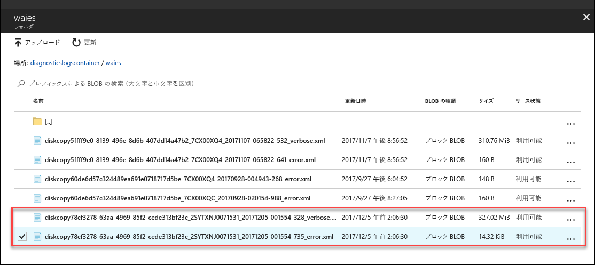

# <a name="understand-logs-to-troubleshoot-data-upload-issues-in-azure-data-box-disk"></a>Azure Data Box Disk でデータのアップロードに関する問題をトラブルシューティングするためのログを理解する

この記事は Microsoft Azure Data Box Disk を対象にしており、Azure にデータをアップロードするときに見られる問題について説明しています。

## <a name="data-upload-logs"></a>データ アップロード ログ

データセンターでデータが Azure にアップロードされると、`_error.xml` ファイルと `_verbose.xml` ファイルが生成されます。 これらのログは、データのアップロードに使用されたものと同じストレージ アカウントにアップロードされます。 `_error.xml` のサンプルを次に示します。
    
```xml
 <?xml version="1.0" encoding="utf-8"?>
    <DriveLog Version="2018-10-01">
      <DriveId>18041C582D7E</DriveId>
      <Summary>
     <!--Summary for validation and data copy to Azure -->
        <ValidationErrors>
          <None Count="8" />
        </ValidationErrors>
        <CopyErrors>
          <Completed Count="5" Description="No errors encountered" />
          <ContainerRenamed Count="3" Description="Renamed the container as the original container name does not follow Azure conventions." />
        </CopyErrors>
      </Summary>
    <!--List of renamed containers with the new names, new file path in Azure, original invalid file path, and size -->
      <Blob Status="ContainerRenamed">
        <BlobPath>databox-c2073fd1cc379d83e03d6b7acce23a6cf29d1eef/private.vhd</BlobPath>
        <OriginalFilePath>\PageBlob\pageblob test\private.vhd</OriginalFilePath>
        <SizeInBytes>10490880</SizeInBytes>
      </Blob>
      <Blob Status="ContainerRenamed">
        <BlobPath>databox-c2073fd1cc379d83e03d6b7acce23a6cf29d1eef/resource.vhd</BlobPath>
        <OriginalFilePath>\PageBlob\pageblob test\resource.vhd</OriginalFilePath>
        <SizeInBytes>71528448</SizeInBytes>
      </Blob>
      <Blob Status="ContainerRenamed">
        <BlobPath>databox-c2073fd1cc379d83e03d6b7acce23a6cf29d1eef/role.vhd</BlobPath>
        <OriginalFilePath>\PageBlob\pageblob test\role.vhd</OriginalFilePath>
        <SizeInBytes>10490880</SizeInBytes>
      </Blob>
      <Status>CompletedWithErrors</Status>
    </DriveLog>
```

## <a name="download-logs"></a>ログのダウンロード

診断ログを見つけてダウンロードするには、2 つの方法があります。

- Azure へのデータのアップロード時にエラーが発生した場合、診断ログがあるフォルダーへのパスがポータルに表示されます。

    

- Data Box の注文に関連付けられているストレージ アカウントに移動します。 **[Blob service]、[BLOB の参照]** の順に移動して、ストレージ アカウントに対応する BLOB を探します。 **waies** に移動します。

    

各ケースで、エラー ログと詳細ログを参照してください。 各ログを選択し、ローカル コピーをダウンロードします。


## <a name="data-upload-errors"></a>データのアップロード エラー

次の表に、データを Azure にアップロードするときに生成されるエラーをまとめます。

| エラー コード | 説明                        |
|-------------|------------------------------|
|`None` |  正常に完了しました。           |
|`Renamed` | Blob の名前が正常に変更されました。  |                                                            |
|`CompletedWithErrors` | アップロードは完了しましたが、エラーが発生しました。 エラーが発生したファイルの詳細がログ ファイルに記載されています。  |
|`Corrupted`|データ インジェスト中に計算された CRC が、アップロード中に計算された CRC と一致しません。  |  
|`StorageRequestFailed` | Azure ストレージ要求が失敗しました。   |     |
|`LeasePresent` | この項目はリースされており、別のユーザーによって使用されています。 |
|`StorageRequestForbidden` |認証の問題のため、アップロードできませんでした。 |
|`ManagedDiskCreationTerminalFailure` | マネージド ディスクとしてアップロードできませんでした。 ファイルは、ステージング ストレージ アカウントでページ BLOB として使用できます。 ページ BLOB はマネージド ディスクに手動で変換できます。  |
|`DiskConversionNotStartedTierInfoMissing` | 事前作成された階層フォルダーの外部で VHD ファイルがコピーされたため、マネージド ディスクは作成されませんでした。 ファイルは、注文作成時に指定されたとおりに、ページ BLOB としてステージング ストレージ アカウントにアップロードされます。 これをマネージド ディスクに手動で変換できます。|
|`InvalidWorkitem` | Azure の名前付け規則と制限規則に準拠していないため、データをアップロードできませんでした。|
|`InvalidPageBlobUploadAsBlockBlob` | プレフィックス `databoxdisk-invalid-pb-` が付いたコンテナー内にブロック BLOB としてアップロードされました。|
|`InvalidAzureFileUploadAsBlockBlob` | プレフィックス `databoxdisk-invalid-af`- が付いたコンテナー内にブロック BLOB としてアップロードされました。|
|`InvalidManagedDiskUploadAsBlockBlob` | プレフィックス `databoxdisk-invalid-md`- が付いたコンテナー内にブロック BLOB としてアップロードされました。|
|`InvalidManagedDiskUploadAsPageBlob` |プレフィックス `databoxdisk-invalid-md-` が付いたコンテナー内にページ BLOB としてアップロードされました。 |
|`MovedToOverflowShare` |元の共有サイズが Azure の最大サイズ制限を超えたため、ファイルを新しい共有にアップロードしました。 新しいファイル共有名には、元の名前にサフィックス `-2` が付いています。   |
|`MovedToDefaultAzureShare` |いずれのフォルダーにも含まれていないファイルを既定の共有にアップロードしました。 共有名は `databox-` で始まります。 |
|`ContainerRenamed` |これらのファイルのコンテナーは Azure の名前付け規則に準拠していなかったため、名前が変更されています。 新しい名前は `databox-` で始まり、元の名前の SHA1 ハッシュが末尾に付加されています。 |
|`ShareRenamed` |これらのファイルの共有は Azure の名前付け規則に準拠していなかったため、名前が変更されています。 新しい名前は `databox-` で始まり、元の名前の SHA1 ハッシュが末尾に付加されています。 |
|`BlobRenamed` |これらのファイルは Azure の名前付け規則に準拠していなかったため、名前が変更されました。 `BlobPath` フィールドで新しい名前を確認してください。 |
|`FileRenamed` |これらのファイルは Azure の名前付け規則に準拠していなかったため、名前が変更されました。 `FileStoragePath` フィールドで新しい名前を確認してください。 |
|`DiskRenamed` |これらのファイルは Azure の名前付け規則に準拠していなかったため、名前が変更されました。 `BlobPath` フィールドで新しい名前を確認してください。 |


## <a name="next-steps"></a>次の手順

- [Data Box Disk の問題に関するサポート チケットを開きます](data-box-disk-contact-microsoft-support.md)。
