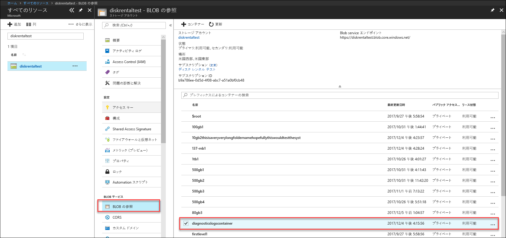

# Azure Data Box Disk (プレビュー) の問題のトラブルシューティング

この記事は、プレビュー リリースで実行されている Microsoft Azure Data Box に適用されます。 この記事では、Data Box と Data Box Disk で実行できる一部の複雑なワークフローと管理タスクについて説明します。 

Data Box Disk の管理は、Azure portal から行うことができます。 この記事では、Azure portal を使用して実行できるタスクについて説明します。 Azure portal を使用して、注文を管理したり、デバイスを管理したり、完了まで注文の状態を追跡したりします。

この記事には次のチュートリアルが含まれています。

- 診断ログのダウンロード
- アクティビティ ログのクエリ

> [!IMPORTANT]
> Data Box はプレビュー段階です。 このソリューションを展開する前に、[プレビューに関する Azure のサービス利用規約](https://azure.microsoft.com/support/legal/preview-supplemental-terms/)を確認してください。

## 診断ログのダウンロード

データ コピー プロセス中にエラーが発生した場合、診断ログがあるフォルダーへのパスがポータルに表示されます。 

診断ログは以下の場合があります。
- エラー ログ
- 詳細ログ  

コピー ログのパスに移動するには、Data Box 注文に関連付けられたストレージ アカウントに移動します。 

1.  **[全般]、[注文の詳細]** の順に移動して、注文に関連付けられたストレージ アカウントをメモします。
 

2.  **[すべてのリソース]** に移動して、前の手順で特定したストレージ アカウントを検索します。 ストレージ アカウントを選択してクリックします。

    

3.  **[Blob service]、[BLOB の参照]** の順に移動して、ストレージ アカウントに対応する BLOB を探します。 **diagnosticslogcontainer、waies の順**に移動します。 

    

    データ コピーに関するエラー ログと詳細ログがどちらも表示されます。 各ファイルを選択してクリックし、ローカル コピーをダウンロードします。

## アクティビティ ログのクエリ

アクティビティ ログを使用して、トラブルシューティングを行うときにエラーを探したり、組織のユーザーがリソースをどのように変更したかを監視したりします。 アクティビティ ログを使用すると、次の内容を判断することができます。

- サブスクリプション内のリソースに対して実行された操作。
- 操作を開始したユーザー。 
- 操作が発生した時間。
- 操作の状態。
- 操作の調査に役立つ可能性のあるその他のプロパティの値。

アクティビティ ログには、リソースで実行されたすべての書き込み操作 (PUT、POST、DELETE など) が含まれます。ただし、読み取り操作 (GET など) は含まれません。 

アクティビティ ログは、90 日間保持されます。 開始日が過去 90 日以内である限り、任意の日付の範囲にクエリを実行できます。 Insights でいずれかの組み込みクエリを使ってフィルターすることもできます。 たとえば、エラーをクリックしてから特定の問題を選択およびクリックし、根本原因を確認します。

## Data Box Disk ロック解除ツールのエラー

| エラー メッセージ/ツールの動作      | Recommendations                                                                                               |
|-------------------------------------------------------------------------------------------------------------------------------------|------------------------------------------------------------------------------------------------------|
| なし  Data Box Disk ロック解除ツールがクラッシュします。                                                                            | BitLocker がインストールされていません。 Data Box Disk ロック解除ツールが実行されているホスト コンピューターに BitLocker をインストールしてください。                                                                            |
| 現在の .NET Framework はサポートされていません。 サポートされているバージョンは 4.5 以降です。  メッセージと共にツールが終了します。  | .NET 4.5 がインストールされていません。 Data Box Disk ロック解除ツールが実行されるホスト コンピューターに .NET 4.5 以降をインストールします。                                                                            |
| ボリュームのロック解除または確認を行えませんでした。 Microsoft サポートにお問い合わせください。    ロックされたドライブのロック解除または確認がツールで失敗します。 | ツールで、提供されたパスキーを使用して、ロックされたドライブを 1 つもロック解除することができませんでした。 Microsoft サポートに手順をお問い合わせください。                                                |
| 以下のボリュームのロック解除と確認が行われました。  ボリュームのドライブ文字: E: パスキー werwerqomnf、qwerwerqwdfda ではどのボリュームもロック解除できませんでした   ツールで一部のドライブがロック解除され、成功したドライブの文字と失敗したドライブの文字が一覧表示されます。| 部分的に成功しました。 提供されたパスキーで一部のドライブをロック解除できませんでした。 Microsoft サポートに手順をお問い合わせください。 |
| ロックされたボリュームが見つかりませんでした。 Microsoft から受け取ったディスクが正しく接続されており、ロックされた状態であることを確認してください。          | ロックされたドライブがツールで見つかりません。 ドライブは既にロック解除されているか、検出されませんでした。 ドライブが接続されており、ロックされていることを確認します。                                                           |
| 致命的なエラー: 無効なパラメーター パラメーター名: invalid_arg 使用方法: DataBoxDiskUnlock /PassKeys:<passkey_list_separated_by_semicolon>  例: DataBoxDiskUnlock /PassKeys:passkey1;passkey2;passkey3 例: DataBoxDiskUnlock /SystemCheck 例: DataBoxDiskUnlock /Help  /PassKeys:       このパスキーは Azure DataBox Disk の注文から取得します。 パスキーによってディスクのロックが解除されます。 /Help:           このオプションでは、コマンドレットの使用方法と例のヘルプが表示されます。 /SystemCheck:    このオプションでは、ツールを実行するための要件をシステムが満たしているかどうかがチェックされます。  終了するには何かキーを押してください。 | 無効なパラメーターが入力されました。 許可されているパラメーターは、/SystemCheck、/PassKey、/Help のみです。                                                                            |

## Data Box Disk 分割コピー ツールのエラー

|エラー メッセージ/警告  |Recommendations |
|---------|---------|
|[情報] Retrieving bitlocker password for volume: m (ボリューム m の bitlocker パスワードを取得しています)  [エラー] Exception caught while retrieving bitlocker key for volume m: (ボリューム m の bitlocker キーの取得中に例外がキャッチされました)  Sequence contains no elements. (シーケンスに要素が含まれていません。)|対象となる Data Box Disk がオフラインである場合は、このエラーがスローされます。   ディスクをオンラインにするには、`diskmgmt.msc` ツールを使用します。|
|[エラー] 例外のスロー: WMI 操作に失敗しました。  Method=UnlockWithNumericalPassword、ReturnValue=2150694965、  Win32Message=指定した回復パスワードの形式が無効です。  BitLocker 回復パスワードは 48 桁である必要があります。  回復パスワードが正しい形式であることを確認し、再試行してください。|Data Box Disk ロック解除ツールを使用して、ディスクのロックを解除してから、コマンドを再試行してください。 詳細については、次を参照してください <li> [Windows クライアントの Data Box Disk のロック解除](data-box-disk-deploy-set-up.md#unlock-disks-on-windows-client)に関するページ。 </li><li> [Linux クライアントの Data Box Disk のロック解除](data-box-disk-deploy-set-up.md#unlock-disks-on-linux-client)に関するページ。 </li>|
|[エラー] 例外のスロー: A DriveManifest.xml file exists on the target drive. (DriveManifest.xml ファイルがターゲット ドライブに存在しています。)   This indicates the target drive may have been prepared with a different journal file. (これは、ターゲット ドライブが別のジャーナル ファイルを使用して準備されたことを示しています。)  To add more data to the same drive, use the previous journal file. (同じドライブにデータをさらに追加するには、前のジャーナル ファイルを使用します。) To delete existing data and reuse target drive for a new import job, delete the DriveManifest.xml on the drive.(既存のデータを削除して、新しいインポート ジョブのためにターゲット ドライブを再利用するには、ドライブの DriveManifest.xml を削除します。) Rerun this command with a new journal file. (新しいジャーナル ファイルを使用して、このコマンドを再実行します。)| このエラーは、複数のインポート セッションで同じドライブのセットを使用しようとしたときに発生します。   1 つの分割とコピーのセッションには、1 つのドライブのセットのみを使用します。|
|[エラー] 例外のスロー: CopySessionId importdata-sept-test-1 refers to a previous copy session and cannot be reused for a new copy session. (CopySessionId importdata-sept-test-1 が前のコピー セッションを参照しており、新しいコピー セッションのために再利用できません。)|このエラーは、前に正常に完了したジョブと同じジョブ名を新しいジョブに使用しようとした場合にレポートされます。  新しいジョブに一意の名前を割り当ててください。|
|[情報] Destination file or directory name exceeds the NTFS length limit. (ターゲットのファイルまたはディレクトリの名前が、NTFS の長さの制限を超えています。) |このメッセージは、ファイル パスが長いためにターゲット ファイルの名前が変更された場合にレポートされます。  この動作を制御するには、`config.json` ファイル内の disposition オプションを変更します。|
|[エラー] 例外のスロー: Bad JSON escape sequence.(JSON エスケープ シーケンスが正しくありません。) |このメッセージは、config.json の形式が無効である場合にレポートされます。   ファイルを保存する前に、[JSONlint](https://jsonlint.com/) を使用して `config.json` を検証してください。|

## 次の手順

- [Azure portal 経由で Data Box Disk を管理する](data-box-portal-ui-admin.md)方法について学習します。
