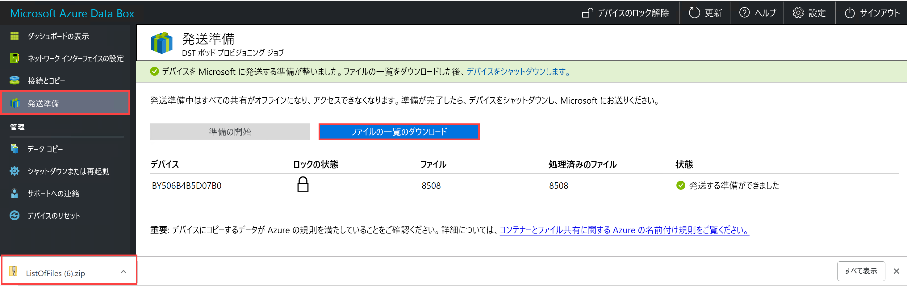

# <a name="use-the-local-web-ui-to-administer-your-data-box-and-data-box-heavy"></a>ローカル Web UI を使用して Data Box および Data Box Heavy を管理する

この記事では、Data Box および Data Box Heavy デバイスで実行される一部の構成と管理タスクについて説明します。 Data Box および Data Box Heavy デバイスの管理は、Azure portal UI およびデバイスのローカル Web UI を介して行えます。 この記事では、ローカル Web UI を使用して実行されるタスクについて説明します。

Data Box および Data Box Heavy のローカル Web UI は、デバイスの初期構成に使用されます。 また、ローカル Web UI を使用して、デバイスのシャットダウンまたは再起動、診断テストの実行、ソフトウェアの更新、コピー ログの表示、デバイスからのローカル データの消去、および Microsoft サポートのログ パッケージの生成を行うこともできます。 2 つの独立したノードを備えた Data Box Heavy デバイスでは、デバイスの各ノードに対応する 2 つの別個のローカル Web UI にアクセスできます。

## <a name="generate-support-package"></a>サポート パッケージの生成

デバイスの問題が発生した場合は、システム ログからサポート パッケージを作成できます。 Microsoft サポートでは、このパッケージを使用して問題のトラブルシューティングを行います。

サポート パッケージを生成するには、次の手順を実行します。

1. ローカル Web UI で、 **[サポートに問い合わせる]** に移動します。 必要に応じて、 **[Include memory dumps]\(メモリ ダンプを含める\)** を選択します。 次に、 **[サポート パッケージの作成]** を選択します。

    メモリ ダンプは、システム障害が発生した後に保存される、デバイスのメモリの内容です。

    サポートによって要求されない限り、 **[Include memory dumps]\(メモリ ダンプを含める\)** オプションは選択しないでください。 メモリ ダンプを含むサポート パッケージを収集するには長い時間がかかり、機密データも含まれます。

    

    サポート パッケージが収集されます。 システム ログのみを含める場合、この操作にかかる時間は数分です。 メモリ ダンプを含める場合は、それよりもずっと長い時間がかかります。

    

2. サポート パッケージの作成が完了したら、 **[サポート パッケージのダウンロード]** を選択します。

    

3. ダウンロードする場所を参照して選択します。 フォルダを開いて内容を表示します。

    

## <a name="erase-local-data-from-your-device"></a>デバイスからローカル データを消去する

Azure データセンターに戻す前に、ローカル Web UI を使用してデバイスからローカル データを消去できます。

> [!IMPORTANT]
> データの消去を元に戻すことはできません。 デバイスからローカル データを消去する前に、必ずファイルをバックアップしてください。

デバイスからローカル データを消去するには、こちらの手順を実行します。

1. ローカル Web UI で、 **[Data erase]\(データの消去\)** に移動します。
2. デバイスのパスワードを入力し、 **[Erase data]\(データの消去\)** を選択します。

    

3. 確認ダイアログで **[はい]** を選択して続行します。 データの消去には、50 分ほどかかることがあります。

   デバイスから消去する前に、必ずローカル データをバックアップしてください。 データの消去を元に戻すことはできません。

    

## <a name="shut-down-or-restart-your-device"></a>デバイスのシャットダウンと再起動

ローカル Web UI を使用して、デバイスをシャットダウンしたり再起動したりできます。 再起動する前に、ホストの共有、デバイスの順にオフラインにすることをお勧めします。 これにより、データ破損の可能性を最小限に抑えられます。 デバイスをシャットダウンするときに、データのコピーが進行中でないことを確認してください。

デバイスをシャットダウンするには、次の手順を実行します。

1. ローカル Web UI で、 **[シャット ダウンまたは再起動]** に移動します。

2. **[シャットダウン]** を選択します。

    

3. 確認を求められたら、 **[OK]** を選択して続行します。

    

デバイスがシャットダウンしたら、フロントパネルの電源ボタンを使用して、デバイスをオンにします。

Data Box を再起動するには、次の手順を実行します。

1. ローカル Web UI で、 **[シャット ダウンまたは再起動]** に移動します。
2. **[Restart]\(再起動\)** をクリックします。

    

3. 確認を求められたら、 **[OK]** を選択して続行します。

   デバイスは、シャットダウンしてから再起動します。

## <a name="download-bom-or-manifest-files"></a>BOM またはマニフェスト ファイルのダウンロード

BOM またはマニフェスト ファイルには、Data Box または Data Box Heavy にコピーされるファイルの一覧が含まれています。 これらのファイルは、発送するデバイスを準備するときにインポート注文用に生成されます。

開始する前に、次の手順に従って、インポート注文の BOM またはマニフェスト ファイルをダウンロードします。

1. ご自分のデバイスのローカル Web UI に移動します。 **デバイスの発送準備** 手順が完了していることを確認します。 デバイスの準備が完了すると、デバイスの状態が **[発送する準備ができました]** と表示されます。

    

2. **[ファイルの一覧のダウンロード]** を選択して、自分の Data Box にコピーされたファイルの一覧をダウンロードします。

    <!--  -->

3. エクスプローラーで、デバイスへの接続に使用されているプロトコルと使用されている Azure Storage の種類に応じて、別個のファイル一覧が生成されます。

    <!--  -->
    

   ファイル名と Azure Storage の種類および使用されている接続プロトコルのマッピングを次の表に示します。

    |ファイル名  |Azure Storage の種類  |使用される接続プロトコル |
    |---------|---------|---------|
    |utSAC1_202006051000_BlockBlob-BOM.txt     |ブロック blob         |SMB/NFS         |
    |utSAC1_202006051000_PageBlob-BOM.txt     |ページ blob         |SMB/NFS         |
    |utSAC1_202006051000_AzFile-BOM.txt    |Azure Files         |SMB/NFS         |
    |utsac1_PageBlock_Rest-BOM.txt     |ページ blob         |REST        |
    |utsac1_BlockBlock_Rest-BOM.txt    |ブロック blob         |REST         |

この一覧を使用して、Data Box が Azure データセンターに返送された後に Azure Storage アカウントにアップロードされたファイルを確認します。 マニフェスト ファイルの例を次に示します。

> [!NOTE]
> Data Box Heavy では、デバイス上の 2 つのノードに対応して、ファイル (BOM ファイル) の一覧が 2 組あります。

```xml
<file size="52689" crc64="0x95a62e3f2095181e">\databox\media\data-box-deploy-copy-data\prepare-to-ship2.png</file>
<file size="22117" crc64="0x9b160c2c43ab6869">\databox\media\data-box-deploy-copy-data\connect-shares-file-explorer2.png</file>
<file size="57159" crc64="0x1caa82004e0053a4">\databox\media\data-box-deploy-copy-data\verify-used-space-dashboard.png</file>
<file size="24777" crc64="0x3e0db0cd1ad438e0">\databox\media\data-box-deploy-copy-data\prepare-to-ship5.png</file>
<file size="162006" crc64="0x9ceacb612ecb59d6">\databox\media\data-box-cable-options\cabling-dhcp-data-only.png</file>
<file size="155066" crc64="0x051a08d36980f5bc">\databox\media\data-box-cable-options\cabling-2-port-setup.png</file>
<file size="150399" crc64="0x66c5894ff328c0b1">\databox\media\data-box-cable-options\cabling-with-switch-static-ip.png</file>
<file size="158082" crc64="0xbd4b4c5103a783ea">\databox\media\data-box-cable-options\cabling-mgmt-only.png</file>
<file size="148456" crc64="0xa461ad24c8e4344a">\databox\media\data-box-cable-options\cabling-with-static-ip.png</file>
<file size="40417" crc64="0x637f59dd10d032b3">\databox\media\data-box-portal-admin\delete-order1.png</file>
<file size="33704" crc64="0x388546569ea9a29f">\databox\media\data-box-portal-admin\clone-order1.png</file>
<file size="5757" crc64="0x9979df75ee9be91e">\databox\media\data-box-safety\japan.png</file>
<file size="998" crc64="0xc10c5a1863c5f88f">\databox\media\data-box-safety\overload_tip_hazard_icon.png</file>
<file size="5870" crc64="0x4aec2377bb16136d">\databox\media\data-box-safety\south-korea.png</file>
<file size="16572" crc64="0x05b13500a1385a87">\databox\media\data-box-safety\taiwan.png</file>
<file size="999" crc64="0x3f3f1c5c596a4920">\databox\media\data-box-safety\warning_icon.png</file>
<file size="1054" crc64="0x24911140d7487311">\databox\media\data-box-safety\read_safety_and_health_information_icon.png</file>
<file size="1258" crc64="0xc00a2d5480f4fcec">\databox\media\data-box-safety\heavy_weight_hazard_icon.png</file>
<file size="1672" crc64="0x4ae5cfa67c0e895a">\databox\media\data-box-safety\no_user_serviceable_parts_icon.png</file>
<file size="3577" crc64="0x99e3d9df341b62eb">\databox\media\data-box-safety\battery_disposal_icon.png</file>
<file size="993" crc64="0x5a1a78a399840a17">\databox\media\data-box-safety\tip_hazard_icon.png</file>
<file size="1028" crc64="0xffe332400278f013">\databox\media\data-box-safety\electrical_shock_hazard_icon.png</file>
<file size="58699" crc64="0x2c411d5202c78a95">\databox\media\data-box-deploy-ordered\data-box-ordered.png</file>
<file size="46816" crc64="0x31e48aa9ca76bd05">\databox\media\data-box-deploy-ordered\search-azure-data-box1.png</file>
<file size="24160" crc64="0x978fc0c6e0c4c16d">\databox\media\data-box-deploy-ordered\select-data-box-option1.png</file>
<file size="115954" crc64="0x0b42449312086227">\databox\media\data-box-disk-deploy-copy-data\data-box-disk-validation-tool-output.png</file>
<file size="6093" crc64="0xadb61d0d7c6d4deb">\databox\data-box-cable-options.md</file>
<file size="6499" crc64="0x080add29add367d9">\databox\data-box-deploy-copy-data-via-nfs.md</file>
<file size="11089" crc64="0xc3ce6b13a4fe3001">\databox\data-box-deploy-copy-data-via-rest.md</file>
<file size="9126" crc64="0x820856b5a54321ad">\databox\data-box-overview.md</file>
<file size="10963" crc64="0x5e9a14f9f4784fd8">\databox\data-box-safety.md</file>
<file size="5941" crc64="0x8631d62fbc038760">\databox\data-box-security.md</file>
<file size="12536" crc64="0x8c8ff93e73d665ec">\databox\data-box-system-requirements-rest.md</file>
<file size="3220" crc64="0x7257a263c434839a">\databox\data-box-system-requirements.md</file>
<file size="2823" crc64="0x63db1ada6fcdc672">\databox\index.yml</file>
<file size="4364" crc64="0x62b5710f58f00b8b">\databox\data-box-local-web-ui-admin.md</file>
<file size="3603" crc64="0x7e34c25d5606693f">\databox\TOC.yml</file>
```

このファイルには、Data Box または Data Box Heavy にコピーされたすべてのファイルの一覧が含まれています。 このファイルの *crc64* 値は、対応するファイルに対して生成されたチェックサムに関連付けられています。

## <a name="view-available-capacity-of-the-device"></a>デバイスの使用可能な容量の表示

デバイス ダッシュボードを使用して、デバイスの使用可能な容量と使用済み容量を表示できます。

1. ローカル Web UI で、 **[ダッシュボードの表示]** に移動します。
2. **[接続とコピー]** の下に、デバイスの空き容量と使用済み容量が表示されます。

    

## <a name="skip-checksum-validation"></a>チェックサム検証のスキップ

既定では、発送の準備をするときにデータのチェックサムが生成されます。 特定のまれなケースにおいて、データ型 (小さいファイル サイズ) によっては、パフォーマンスが低下することがあります。 このような場合は、チェックサムをスキップできます。

発送準備中のチェックサム計算は、エクスポート注文ではなく、インポート注文に対してのみ実行されます。

パフォーマンスに重大な影響がない限り、チェックサムを無効にしないことを強くお勧めします。

1. デバイスのローカル Web UI の右上隅にある **[設定]** に移動します。

    

2. **[無効]** をクリックしてチェックサム検証を無効にします
3. **[適用]** を選択します。

> [!NOTE]
> チェックサム計算のスキップ オプションは、Azure Data Box がロック解除されている場合にのみ使用できます。 デバイスがロックされている場合、このオプションは表示されません。

## <a name="enable-smb-signing"></a>SMB 署名を有効にする

サーバー メッセージ ブロック (SMB) 署名は、SMB を使用する通信にパケット レベルでデジタル署名できる機能です。 この署名により、転送中の SMB パケットを変更する攻撃を防ぐことができます。

SMB 署名に関する詳細については、「[サーバー メッセージ ブロックの署名の概要](https://support.microsoft.com/help/887429/overview-of-server-message-block-signing)」を参照してください。

Azure デバイスで SMB 署名を有効にするには、次のようにします。

1. デバイスのローカル Web UI の右上隅にある **[設定]** を選択します。

    ![[設定] を開く](media/data-box-local-web-ui-admin/data-box-settings-1.png)

2. SMB 署名を **[有効]** にします。

    

3. **[適用]** を選択します。
4. ローカル Web UI で、 **[シャット ダウンまたは再起動]** に移動します。
5. **[Restart]\(再起動\)** をクリックします。

## <a name="enable-backup-operator-privileges"></a>バックアップ オペレーターの特権を有効にする

Web UI ユーザーは、既定で SMB 共有に対するバックアップ オペレーター特権を持っています。 これが不要の場合、 **[バックアップ オペレーターの特権を有効にする]** を使用して、特権を無効または有効にします。

詳細については、[Active Directory セキュリティ グループ](/windows/security/identity-protection/access-control/active-directory-security-groups#backup-operators)に関する記事のバックアップ オペレーターを参照してください。

Azure デバイスでバックアップ オペレーターの特権を有効にするには、次の操作を行います。

1. デバイスのローカル Web UI の右上隅にある **[設定]** を選択します。

   

2. バックアップ オペレーターの特権を **有効にします**。

   

3. **[適用]** を選択します。
4. ローカル Web UI で、 **[シャット ダウンまたは再起動]** に移動します。
5. **[Restart]\(再起動\)** をクリックします。

## <a name="enable-acls-for-azure-files"></a>Azure Files の ACL を有効にする

ファイルのメタデータは、ユーザーが SMB 経由で Data Box にデータをアップロードすると、既定で転送されます。 メタデータには、アクセス制御リスト (ACL)、ファイル属性、およびタイムスタンプが含まれます。 この機能を使用しない場合は、 **[Azure Files の ACL]** を使用して、この機能を無効にするか有効にします。

<!--For more information about metadata that is transferred, see [Preserving the ACLs and metadata with Azure Data Box](./data-box-local-web-ui-admin.md#enable-backup-operator-privileges) - IN DEVELOPMENT-->

> [!Note]
> ファイルを使用してメタデータを転送するには、バックアップ オペレーターである必要があります。 この機能を使用する場合は、Web UI のローカル ユーザーがバックアップ オペレーターであることを確認してください。 「[バックアップ オペレーターの特権を有効にする](#enable-backup-operator-privileges)」を参照してください。

Azure Files からの ACL の転送を有効にするには、次のようにします。

1. デバイスのローカル Web UI の右上隅にある **[設定]** を選択します。

    

2. Azure Files の ACL を **有効にします**。

     
  
3. **[適用]** を選択します。
4. ローカル Web UI で、 **[シャット ダウンまたは再起動]** に移動します。
5. **[Restart]\(再起動\)** をクリックします。

## <a name="enable-tls-11"></a>TLS 1.1 を有効にする

既定の Azure Data Box では、トランスポート層セキュリティ (TLS) 1.1 より安全性が高いため、TLS 1.2 が暗号化に使用されます。 ただし、ユーザーまたはクライアントがブラウザーを使用して、TLS 1.2 がサポートされていないデータにアクセスする場合は、TLS 1.1 を有効にできます。

TLS に関する詳細については、[Azure Data Box Gateway のセキュリティ](../databox-gateway/data-box-gateway-security.md)に関する記事を参照してください。

Azure デバイスで TLS 1.1 を有効にするには、次のようにします。

1. デバイスのローカル Web UI の右上隅にある **[設定]** を選択します。

    

2. TLS 1.1 を **[有効]** にします。

    

3. **[適用]** を選択します。
4. ローカル Web UI で、 **[シャット ダウンまたは再起動]** に移動します。
5. **[Restart]\(再起動\)** をクリックします。

## <a name="next-steps"></a>次のステップ

- [Azure portal を使用して Data Box と Data Box Heavy を管理する](data-box-portal-admin.md)方法について学習します。
