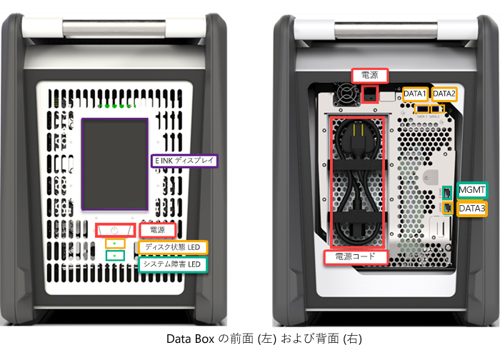
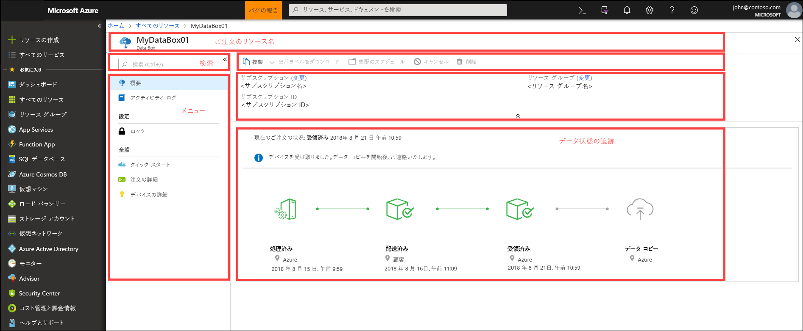
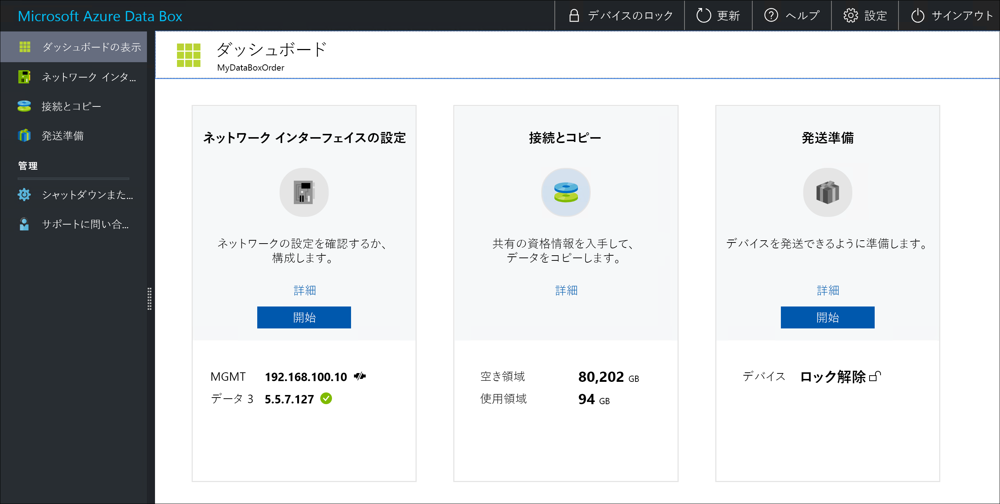

# Azure Data Box とは何ですか?

Microsoft Azure Data Box クラウド ソリューションを使用すると、迅速かつ安価な信頼性の高い方法で、数テラバイトのデータを Azure に送信できます。 独自の Data Box ストレージ デバイスを出荷することにより、セキュリティで保護されたデータ転送を高速化します。 各ストレージ デバイスは、最大で 80 TB のストレージ容量を使用でき、地域の運送業者を通じて皆さんのデータセンターに輸送されます。 デバイスは堅牢な筐体で保護され、転送中のデータはセキュリティで保護されます。

Data Box デバイスは、Azure portal から注文できます。 デバイスを受け取ったら、ローカル Web UI を使用してすばやく設定できます。 データをサーバーからデバイスにコピーし、デバイスを Azure に返送します。 そのデータは、Azure のデータセンターにてデバイスから Azure へと自動的にアップロードされます。 プロセス全体は、Azure portal の Data Box サービスでエンド ツー エンドで追跡できます。

## ユース ケース

Data Box は、ネットワーク接続が制限されていないシナリオで、40 TB を超えるデータ サイズを転送する場合に最適です。 データは 1 回だけ移動することも、定期的に移動することもできます。また、初期一括データ転送の後に定期的な転送を行うこともできます。 Data Box は、以下のようなさまざまなシナリオのデータ転送に使用できます。

 - **1 回限りの移行** - 大量のオンプレミス データを Azure に移動する場合。 
     - オフライン テープのメディア ライブラリを Azure に移動し、オンライン メディア ライブラリを作成する。
     - VM ファーム、SQL Server、アプリケーションを Azure に移行する
     - HDInsight を使用して詳細な分析やレポートの作成を行うために、履歴データを Azure に移動する

 - **初期一括転送** - Data Box (シード) を使用して初期一括転送が実行された後に、ネットワーク経由で増分転送を行う場合。 
     - Commvault などのバックアップ ソリューション パートナーと Data Box を使用して、最初に大量の履歴バックアップを Azure に移動する場合など。 完了後のデータの増分は、ネットワーク経由で Azure ストレージに転送する。

- **定期的なアップロード** - 定期的に生成される大量のデータを Azure に移動する必要がある場合。 たとえば、石油掘削装置や風力発電地帯でビデオ コンテンツが生成されるエネルギー探査でこれを実行します。      

## メリット

Data Box は、ネットワークにほとんどまたはまったく影響を与えずに大量のデータを Azure に移動することを目的としています。 このソリューションには次の利点があります。

- **速度** - Data Box では、1 Gbps または 10 Gbps ネットワーク インターフェイスを使用して、最大 80 TB のデータを Azure に移動します。

- **セキュリティ保護** - Data Box には、デバイス、データ、サービスのセキュリティ保護が組み込まれています。
  - デバイスの筐体は堅牢で、開封防止ネジと開封明示ステッカーによってセキュリティ保護されています。 
  - デバイスのデータは、AES 256 ビット暗号化によって常にセキュリティ保護されています。
  - デバイスは、Azure portal で提供されるパスワードでのみロックを解除できます。
  - このサービスは、Azure のセキュリティ機能によって保護されています。
  - データが Azure にアップロードされたら、NIST 800-88r1 規格に従って、デバイスのディスクが完全にワイプされます。
    
    詳細については、「[Azure Data Box のセキュリティとデータ保護](data-box-security.md)」を参照してください。

## 機能と仕様

このリリースの Data Box デバイスには、次の機能があります。

| 仕様                                          | 説明              |
|---------------------------------------------------------|--------------------------|
| Weight                                                  | 23 kg (50 lbs) 未満                |
| Dimensions                                              | デバイス - 幅: 309.0 mm 高さ: 430.4 mm 奥行き: 502.0 mm |            
| ラック スペース                                              | 寝かせてラックに配置した場合 7 U (ラック マウント不可)|
| 必要なケーブル                                         | 電源ケーブル x 1 (同梱)   RJ45 ケーブル x 2   SFP+ Twinax 銅線ケーブル x 2|
| ストレージの容量                                        | 100 TB のデバイス (RAID 5 保護後の使用可能容量 80 TB)|
| 電力定格                                            | 電源ユニットの定格は 700 W です。   通常は 375 W の電力が消費されます。|
| ネットワーク インターフェイス                                      | 1 GbE インターフェイス x 2 - MGMT、DATA 3   MGMT - 管理用、ユーザー構成不可、初期セットアップに使用   DATA3 - データ用、ユーザー構成可能、既定で動的   MGMT および DATA 3 は 10 GbE としても動作可能   10 GbE インターフェイス x 2 - DATA 1、DATA 2   両方ともデータ用、動的 (既定) または静的として構成可能 |
| データ転送メディア                                     | RJ45、SFP+ 銅線 10 GbE イーサネット  |
| Security                                                | 開封防止ネジを搭載した堅牢なデバイス筐体   デバイスの下部に開封明示ステッカー|
| データ転送速度                                      | 10 GbE ネットワーク インターフェイスで最大 1 日 80 TB 以上        |
| 管理                                              | ローカル Web UI - 1 回限りの初期セットアップと構成   Azure portal - 日常的なデバイスの管理        |

## Data Box のコンポーネント

Data Box に含まれるコンポーネントを次に示します。

* **Data Box デバイス** - プライマリ ストレージを提供し、クラウド ストレージとの通信を管理する物理デバイスです。デバイス上に保存されたすべてのデータのセキュリティと機密性も確保されます。 Data Box デバイスでは、80 TB のストレージ容量を使用できます。 

    

    
* **Data Box サービス** - さまざまな地理的場所からアクセスできる Web インターフェイスから、Data Box デバイスを管理できる、Azure portal の拡張機能。 Data Box サービスを使用すると、Data Box デバイスの日常的な管理を実行できます。 サービス タスクには、注文の作成と管理、警告の表示と管理、共有の管理が含まれます。  

    

    詳細については、「[Use the Data Box service to administer your Data Box device (Data Box サービスを使用した Data Box デバイスの管理)](data-box-portal-ui-admin.md)」を参照してください。

* **ローカル Web ユーザー インターフェイス** - デバイスの構成に使用する Web ベースの UI。この UI を使用して、ローカル ネットワークに接続し、デバイスを Data Box サービスに登録できます。 ローカル Web UI を使用すると、Data Box デバイスのシャット ダウンと再起動、コピー ログの表示、Microsoft サポートへの連絡とサービス要求の送信も行うことができます。

    

    Web ベース UI の使用については、「[Web ベース UI を使用した Data Box の管理](data-box-portal-ui-admin.md)」を参照してください。

## ワークフロー

一般的なフローには次の手順が含まれます。

1. **注文** - Azure portal で注文を作成し、配送情報とデータのコピー先 Azure ストレージ アカウントを指定します。 デバイスが利用可能な場合は、Azure がデバイスを準備し、出荷追跡 ID が割り当てられたデバイスを出荷します。

2. **受領** - デバイスが到着したら、デバイスをネットワークに接続し、指定のケーブルを電源につなぎます。 電源を入れてデバイスに接続します。 デバイスのネットワークを構成し、データをコピーするホスト コンピューターに共有をマウントします。

3. **データのコピー** - Data Box の共有にデータをコピーします。

4. **返却** - デバイスを準備し、電源を切って Azure データセンターに返送します。

5. **アップロード** - デバイスから Azure にデータが自動的にコピーされます。 デバイスのディスクは、米国国立標準技術研究所 (NIST) のガイドラインに従って安全に消去されます。

このプロセス全体を通じて、状態のすべての変更について電子メールで通知されます。 フローの詳細については、[Azure portal での Data Box の展開](data-box-deploy-ordered.md)に関する記事をご覧ください。

## 利用可能なリージョン

Data Box は、サービスが展開されているリージョン、デバイスが出荷される国/リージョン、データの転送対象となる Azure ストレージ アカウントに基づいてデータを転送できます。 

- **サービスの提供状況**: リージョン別の提供状況については、[リージョン別の利用可能な Azure 製品](https://azure.microsoft.com/global-infrastructure/services/?products=databox&regions=all)に関する記事を参照してください。 Data Box は、Azure Government クラウドにデプロイすることもできます。 詳細については、「[What is Azure Government? (Azure Government とは)](https://docs.microsoft.com/azure/azure-government/documentation-government-welcome)」を参照してください。

- **転送先ストレージ アカウント** - データを格納するストレージ アカウントは、サービスが使用可能なすべての Azure リージョンで利用できます。  

## 次のステップ

- [Data Box のシステム要件](data-box-system-requirements.md)を確認する。
- [Data Box の制限事項](data-box-limits.md)を理解する。
- Azure portal で [Azure Data Box](data-box-quickstart-portal.md) をすばやく展開する。

