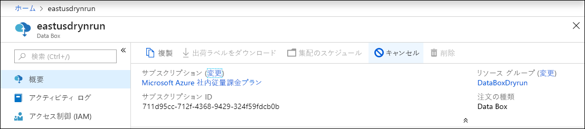
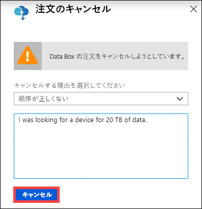
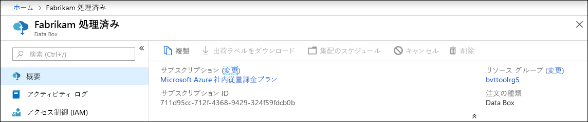
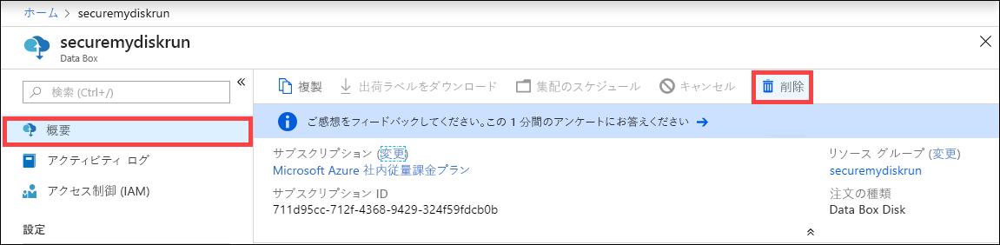
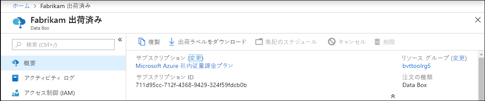
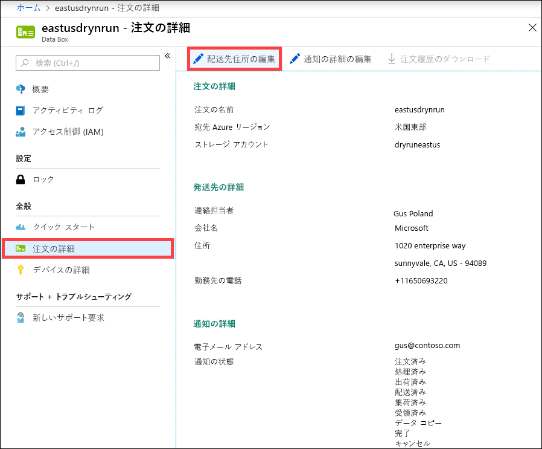
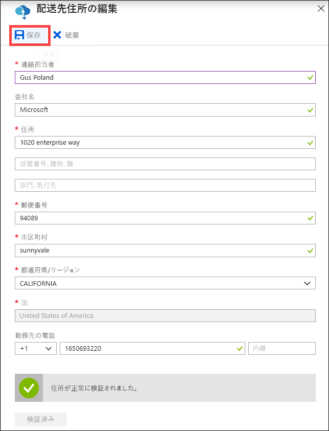
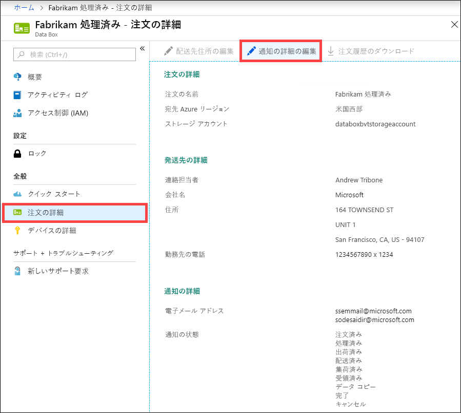
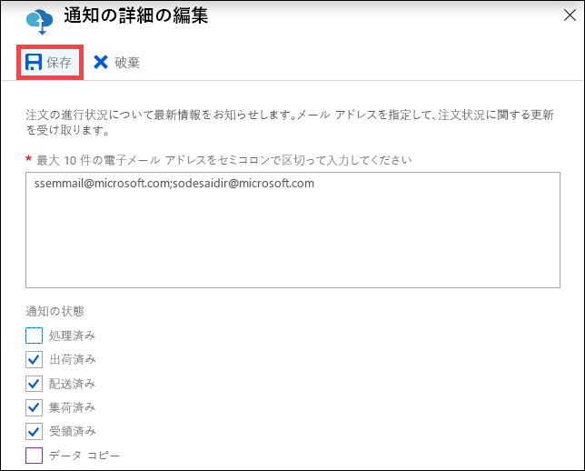

# Azure portal を使用して Data Box を管理する

この記事では、Data Box で実行できる一部の複雑なワークフローと管理タスクについて説明します。 Data Box の管理は、Azure portal またはローカル Web UI から行うことができます。 

この記事では、Azure portal を使用して実行できるタスクについて説明します。 Azure portal を使用して、注文を管理したり、Data Box を管理したり、完了まで注文の状態を追跡したりします。

## 注文のキャンセル

発注後、さまざまな理由から注文をキャンセルしなければならないことがあります。 キャンセルできるのは、処理される前の注文だけです。 注文が処理されて Data Box が準備された後は、注文をキャンセルできません。 

注文をキャンセルするには、次の手順を実行します。

1.  **[概要] > [キャンセル]** に移動します。 

    

2.  注文のキャンセル理由を入力します。  

    

3.  注文のキャンセル後、ポータルで注文の状態が更新され、**取り消し済み**として表示されます。 

## 注文の複製

特定の状況では複製機能が役立ちます。 たとえば、ユーザーが Data Box を使って何らかのデータを転送済みだとします。 その後、生成されるデータが増えていくと、それを Azure に転送するために別の Data Box が必要になります。 このようなケースでは、同じ注文をそのまま複製することができます。

注文を複製するには、次の手順を実行します。

1.  **[概要] > [複製]** に移動します。 

    

2.  注文の詳細はすべてそのままの状態で維持されます。 複製された注文は、元の名前の最後に "*-Clone*" を追加した名前になります。 プライバシー情報を確認済みであることへの同意として、チェック ボックスをオンにします。 **Create** をクリックしてください。    

複製は数分で作成され、ポータルに新しい注文が反映されます。

## 注文の削除

注文が完了した時点で、その注文を削除したい場合があります。 注文には、お客様の名前、住所、連絡先情報など、個人情報が含まれています。 この個人情報は、注文が削除されると削除されます。

削除できるのは、完了済みまたはキャンセル済みの注文だけです。 注文を削除するには次の手順を実行します。

1. **[すべてのリソース]** に移動します。 目的の注文を検索します。

2. 削除する注文をクリックし、**[概要]** に移動します。 コマンド バーの **[削除]** をクリックします。

    

3. 注文の削除を確認するメッセージが表示されたら注文の名前を入力します。 **[削除]** をクリックします。

## 配送先住所ラベルのダウンロード

Data Box の E インク表示が動作しておらず、返送ラベルが表示されない場合は、配送先住所ラベルをダウンロードしなければならないことがあります。 

配送先住所ラベルをダウンロードするには、次の手順を実行します。
1.  **[概要] > [出荷ラベルをダウンロード]** に移動します。 このオプションは、デバイスの発送後にのみ選択できます。 

    

2.  次の返送ラベルがダウンロードされます。 ラベルを保存し、印刷します。ラベルを折りたたみ、デバイスのクリア カバーに挿入します。 ラベルが見えることを確認します。 以前の出荷で使用したステッカーをデバイスからはがします。

    

## 配送先住所の編集

発注後に配送先住所の編集が必要になることも考えられます。 編集できるのは、デバイスが発送されるまでとなります。 デバイスの発送後は、このオプションは使用できなくなります。

注文を編集するには、次の手順を実行します。

1. **[注文の詳細] > [配送先住所の編集]** に移動します。

    

2. 配送先住所を編集して検証し、変更を保存します。

    

## 通知の詳細の編集

注文の状態を知らせるメールの宛先となるユーザーを変更しなければならないことがあります。 たとえばデバイスが発送または集荷されたときに、あるユーザーに連絡する必要があるとしましょう。 一方、データのコピーが完了したときの連絡先は、別のユーザーにする必要があります。Azure Storage アカウントにデータが存在することを別のユーザーが確認したうえで、コピー元からデータを削除するためです。 このような場合は、通知の詳細を編集することができます。

通知の詳細を編集するには、次の手順を実行します。

1. **[注文の詳細] > [通知の詳細の編集]** に移動します。

    

2. これで通知の詳細を編集し、変更を保存できるようになります。
 
    

## 注文の状態の確認

ポータル内でデバイスの状態が変化すると、メールで通知されます。

|注文の状態 |説明 |
|---------|---------|
|注文済み     | 正常に発注されました。  デバイスが使用可能な場合、Microsoft は出荷用のデバイスを特定し、デバイスを準備します。   デバイスがただちに入手できない場合、デバイスが入手可能になったときに注文が処理されます。 注文の処理は数日から 2 ～ 3 か月かかることがあります。 注文を 90 日以内に満たすことができない場合、注文が取り消されて通知されます。         |
|処理済み     | 注文処理は完了しています。 注文に応じて、デバイスを出荷する準備がデータ センター内で行われます。         |
|出荷しました     | 注文は発送済みです。 出荷を追跡するには、ポータルの注文に表示されている追跡 ID を使用します。        |
|配信済み     | 出荷は、注文に指定された住所に配達済みです。        |
|集荷されました     |返送する荷物が運送業者によって集荷されてスキャンされました。         |
|受取済み     | デバイスは Azure データ センターで受け取られてスキャンされます。   出荷が検査されると、デバイスのアップロードが開始されます。      |
|データのコピー     | データのコピーが進行中です。 Azure portal で、注文のコピーの進行状況を追跡します。   データのコピーが完了するまでお待ちください。 |
|完了       |注文が正常に完了しました。  オンプレミスのデータをサーバーから削除する前に、データが Azure に存在することを確認してください。         |
|完了 (エラーあり)| データのコピーが完了しましたが、コピー中にエラーが発生しました。   Azure portal に示されているパスを使用してコピー ログを確認してください。   |
|Canceled            |注文はキャンセルされました。   お客様によって注文がキャンセルされたか、またはエラーが発生したために、サービスによって注文がキャンセルされました。 注文を 90 日以内に満たすことができない場合も、注文が取り消されて通知されます。     |
|クリーンアップ | デバイスディスク上のデータは消去されます。 デバイスのクリーンアップは、注文のログ レポートが Azure portal で使用可能なときに完了したと見なされます。|

## 次の手順

- [Data Box の問題のトラブルシューティング](data-box-faq.md)に関するページを参照してください。
